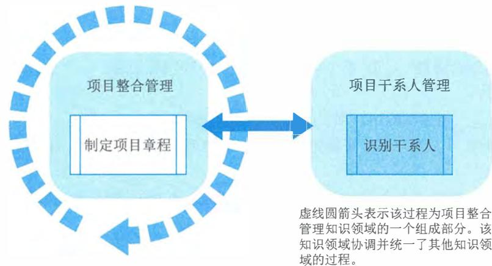
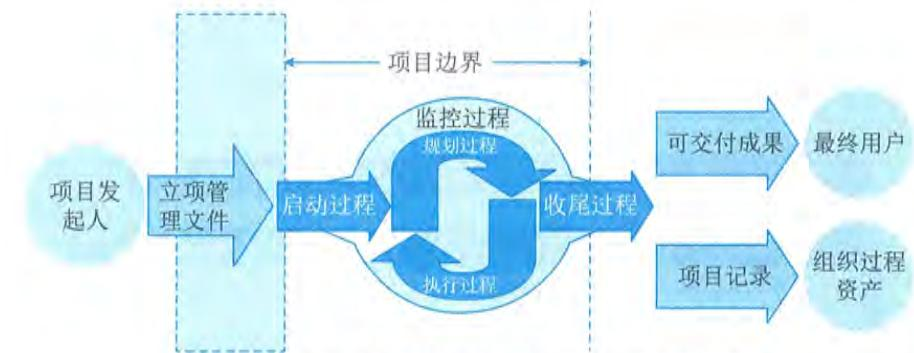
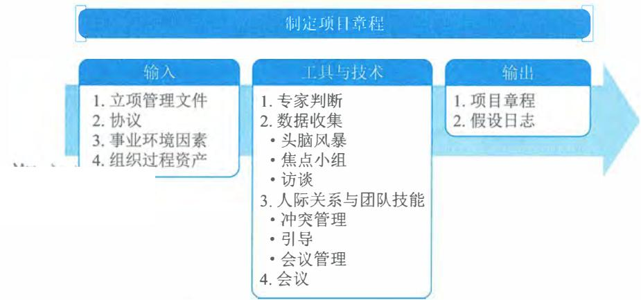
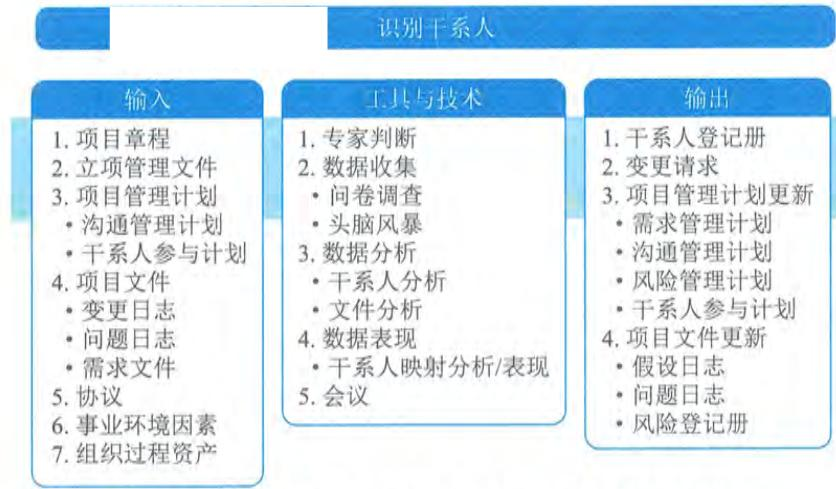
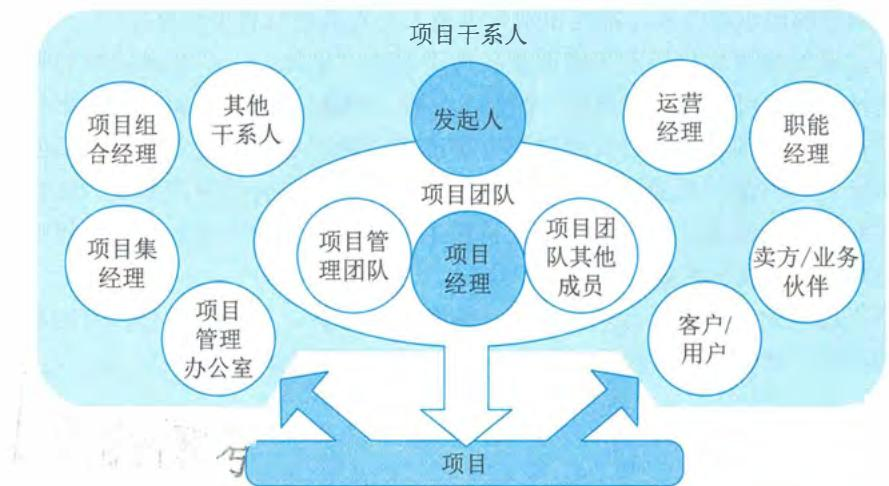
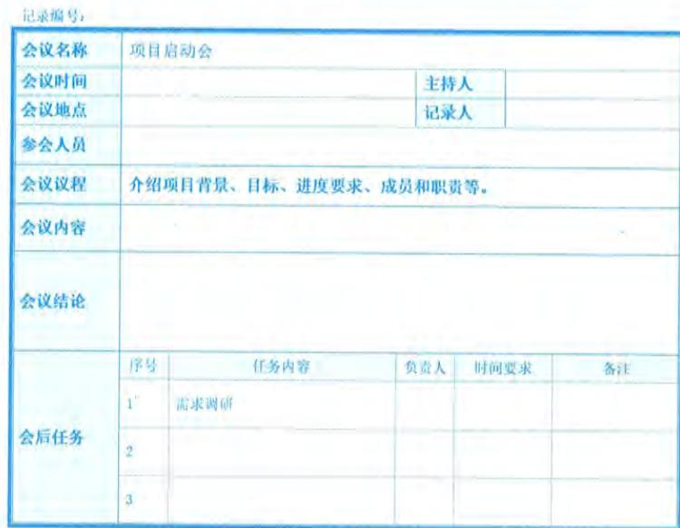

# 第10章 启动过程组

启动过程组包括定义一个新项目或现有项目的一个新阶段，授权开始该项目或阶段的一组过程。启动过程组包括两个过程，分别是项目整合管理中的“制定项目章程”和项目干系人管理中的“识别干系人”。启动过程组各过程之间的关系如图10- 1所示，各过程之间存在相互作用，工作并行开展。

  
图10-1 启动过程组

启动过程组的目的是协调各方干系人的期望与项目目的，告知各干系人项目范围和目标，并商讨他们对项目及相关阶段的参与将如何有助于实现其期望。在启动过程中，需要定义初步项目范围和落实初步财务资源，识别那些将相互作用并影响项目总体结果的干系人，指派项目经理（如果尚未安排）。这些信息应反映在项目章程和干系人登记册中。一旦项目章程获得批准，项目也就正式立项，同时，项目经理就有权将组织资源用于项目活动。

启动过程组的主要作用是确保只有符合组织战略目标的项目才能被立项，以及在项目开始时就认真考虑商业论证、项目效益和干系人。在一些组织中，项目经理会参与制定商业论证和分析项目效益，会帮助编写项目章程。在另一些组织中，项目的前期准备工作则由项目发起人、项目管理办公室（PMO）、项目组合指导委员会或其他干系人群体完成。图10- 2显示了项目发起人及立项管理文件与启动过程的关系。

项目通常划分为多个阶段。一旦划分了阶段，就需要在后续阶段复审从启动过程得到的信息，以确认是否仍然有效。在每个阶段开始时重新开展启动过程，有助于保持项目符合其预定的商业需求，有助于核实项目章程、立项管理文件和成功标准，有助于复审项目干系人的影响、动机、期望和目标。

项目发起人、客户和其他干系人参与项目启动，有助于促进他们对项目成功标准达成一致，也有助于提升项目完成时可交付成果通过验收的可能性，以及在整个项目期间干系人的满意程度。

  
图10-2 项目发起人及立项管理文件与启动过程的关系

启动过程组需要开展以下13类工作：

（1）基于事业环境因素、组织过程资产和项目的前期准备资料（包括商业论证、效益管理计划和协议），开展项目评估，来确认以前做出的关于项目可行性的商业论证结论仍然是合理可靠的；

（2）在开展项目评估时，应该广泛征求干系人的意见，并与重要干系人一起分析项目效益，确认项目仍然符合组织战略，能够为组织实现拟定的变革，创造预期的商业价值；

（3）明确为了实现变革和创造价值，项目必须在特定范围、进度、成本和质量要求下完成的关键可交付成果，这也有利于引导干系人（特别是客户）对项目抱有合理的期望；

（4）分析整体项目风险，确认整体项目风险水平是可接受的；

（5）分析项目合规性要求，制定项目合规目标；

（6）识别项目的单个项目风险类别、主要制约因素和主要假设条件；

（7）确定项目治理结构，组建项目治理委员会，并规定其权责；

（8）初选适用的项目开发方法（预测型、敏捷型或混合型）；

（9）提出项目执行的总体要求，如项目范围设计、里程碑进度计划、所需的财务资源估计；

（10）对前述所有工作的成果进行整理、分析和提炼，编制出项目章程和假设日志，在这个过程中，应该保持与干系人的良好沟通，以便大家对项目章程和假设日志的内容达成一致意见；

（11）获得项目发起人对项目章程的批准，以便项目正式立项，项目经理正式上任；

（12）向干系人分发（可召开项目启动会）已批准的项目章程，确保他们理解项目的意义和目标，以及各自的角色和职责；

（13）与已有的干系人一起，开展干系人识别和分析工作，编制出干系人登记册。

本章对启动过程组的2个过程——“制定项目章程”和“识别干系人”的输入输出、工具与技术进行说明时，采取以下规则进行描述：

$\bullet$  省略常见的输入输出、工具与技术；

$\bullet$  针对主要输入输出、重要的工具与技术进行详细阐述

# 10.1 制定项目章程

制定项目章程是编写一份正式批准项目并授权项目经理在项目活动中使用组织资源的文件

的过程。本过程的主要作用包括：一是明确项目与组织战略目标之间的直接联系；二是确立项目的正式地位；三是展示组织对项目的承诺。本过程仅开展一次或仅在项目的预定义时开展。本过程的输入、工具与技术和输出如图 10- 3 所示。

  
图10-3 制定项目章程过程的输入、工具与技术和输出

项目章程在项目执行和项目需求之间建立了联系。通过编制项目章程来确认项目是否符合组织战略和日常运营的需要。项目章程不能当作合同，在执行外部项目时，通常需要用正式的合同来达成合作协议，项目章程用于建立组织内部的合作关系，确保正确交付合同内容。项目章程授权项目经理进行项目管理过程中的规划、执行和控制，同时还授权项目经理在项目活动中使用组织资源，因此，应在规划开始之前任命项目经理，项目经理越早确认并任命越好，最好在制定项目章程时就任命。项目章程可由发起人编制，也可由项目经理与发起机构合作编制。通过这种合作，项目经理可以更好地了解项目目的、目标和预期收益，以便更有效地分配项目资源。项目章程一旦被批准，就标志着项目的正式启动。

项目由项目以外的机构来启动，例如发起人、项目集或项目管理办公室（PMO）、项目组合治理委员会主席或其授权代表。项目启动者或发起人应该具有一定的职权，能为项目获取资金并提供资源。

制定项目章程过程的主要输入为立项管理文件和协议，主要输出为项目章程和假设日志。下面进行详细介绍。

# 10.1.1 主要输入

# 1. 立项管理文件

立项管理阶段经批准的结果或相关的立项管理文件是用于制定项目章程的依据，一般包括项目建议书、可行性研究报告、项目评估报告等。立项管理从业务视角描述必要的信息，并且据此决定项目的期望结果是否值得所需投资。组织高层管理者通常使用立项管理文件作为决策依据。一般情况下，立项管理包含商业需求和成本效益分析，论证项目的合理性并确定项目边界。立项管理一般由市场需求、组织需要、客户要求、技术进步、法律要求、生态影响、社会需要等一个或多个因素引发。

项目章程包含来源于立项管理文件中的相关项目信息。由于立项管理文件不是项目文件，项目经理不可以对它们进行更新或修改，只可以提出相关建议。虽然立项管理文件是在项目之前制定的，但需要定期审核。

# 2. 协议

协议有多种形式，包括合同、谅解备忘录（MOUs）、服务水平协议（SLA）、协议书、意向书、口头协议或其他书面协议。为外部客户做项目时，通常需要签订合同。

# 10.1.2 主要输出

# 1. 项目章程

项目章程记录了关于项目和项目预期交付的产品、服务或成果的高层级信息，主要包括：

$\bullet$  项目目的；

$\bullet$  可测量的项目目标和相关的成功标准；

$\bullet$  高层级需求；

$\bullet$  高层级项目描述、边界定义以及主要可交付成果；

$\bullet$  整体项目风险；

$\bullet$  总体里程碑进度计划；

$\bullet$  预先批准的财务资源；

$\bullet$  关键干系人名单；

$\bullet$  项目审批要求（例如，评价项目成功的标准，由谁对项目成功下结论，由谁签署项目结束）；

$\bullet$  项目退出标准（例如，在何种条件下才能关闭或取消项目或阶段）；

$\bullet$  委派的项目经理及其职责和职权；

$\bullet$  发起人或其他批准项目章程的人员的姓名和职权等。

项目章程确保干系人在总体上就主要可交付成果、里程碑以及每个项目参与者的角色和职责达成共识。

# 项目章程示例

项目名称：CRM软件开发。

总体里程碑进度表：2009年5月1日开工，2009年11月5日结束。

项目经理：李某某；联系电话：  $xxxxxxx$

项目立项依据：公司业务经过多年的发展，公司已经拥有了大量的优质客户和一大批潜在的客户，为了稳定与发展公司的客户群，公司管理层决定开发一个CRM系统。

项目目标：以标准的客户关系管理理论为指导，结合公司的营销经验，在6个月时间里开发完成具备客户管理、市场管理、销售管理、服务管理、统计分析和CallCenter六大功能的CRM客户管理软件。预算为6个月投入50万元。

项目干系人：

i.赵某某：项目发起人和赞助人，负责监督项目；

ii.李某某：项目经理，负责计划、监控项目，对项目质量负责；

iii.钱某某：IT部门经理，负责为项目提供适当资源和培训；

iv.王某某：业务接口人，负责为项目提供业务需求。

签名：（以上所有干系人签名）

# 2.假设日志

假设日志用于记录整个项目生命周期中的所有假设条件和制约因素。

在项目启动之前进行可行性研究和论证时，就开始识别高层级的战略和运营假设条件与制约因素。这些假设条件与制约因素应纳入项目章程。较低层级的活动和任务假设条件在项目期间随着诸如定义技术规范、估算、进度和风险等项目活动的开展而生成。

# 10.2 识别干系人

项目干系人（Stakeholder）指参与项目实施活动或在项目完成后其利益会受到项目消极或积极影响的个人或组织。项目干系人也称为“利益干系人”或“利害关系者”，既包括其利益受到项目影响的个人或组织，也包括会对项目执行及其结果施加影响的个人或组织。项目团队应把干系人满意程度作为一个关键的项目目标来进行管理。

识别干系人是定期识别项目干系人，分析和记录他们的利益、参与度、相互依赖性、影响力和对项目成功的潜在影响的过程。本过程的主要作用是使项目团队能够建立对每个干系人或干系人群体的适度关注。本过程应根据需要在整个项目期间定期开展。本过程的输入、工具与技术和输出如图10- 4所示。

  
图10-4 识别干系人过程的输入、工具与技术和输出

识别干系人不是启动阶段一次性的活动，而是在项目过程中根据需要在整个项目期间定期开展。识别干系人管理过程通常在编制和批准项目章程之前或同时首次开展，之后的项目生命周期过程中在必要时重复开展，至少应在每个阶段开始时，以及项目或组织出现重大变化时重复开展。每次重复开展识别干系人管理过程，都应通过查阅项目管理计划组件及项目文件，来识别有关的项目干系人。

项目管理者通过识别项目的干系人，明确干系人需求或其对项目的承诺，对这些需求或承诺进行有效管理，使得项目赢得更多人的支持，从而确保项目取得成功。项目干系人与项目团队、项目的关系如图10- 5所示。

项目生命周期与组织

  
图10-5 项目干系人与项目团队、项目的关系

在不同项目中会包含不同的项目干系人，项目干系人的职责和权限也会有所不同。项目管理者需依据项目建设目标、项目建设内容及需求等方面确定对项目存在期望、需求或对项目产生影响的干系人的类别。

在系统集成项目建设过程中，项目干系人的主要类别通常包括项目客户和用户、项目团队及成员、项目发起人、资源或职能部门、供应商，以及其他相关组织或个人等。

（1）项目客户和用户。项目客户和用户包括客户方项目负责人、项目管理部门、具体使用用户以及项目监督部门等，他们均可能对项目提出需求或期望，或对项目进展产生影响。

（2）项目团队及成员。项目团队是执行项目工作的群体，包括项目管理人员、工程技术人员及相关支持人员等。项目团队由来自不同团队的个人组成，他们拥有执行项目工作所需的专业知识或特定技能。项目团队成员负责实现项目及其他干系人的需要或期望，他们的工作成果对项目的进展产生重要影响。

（3）项目发起人。项目发起人指为项目提供资金或资源支持的个人或组织。项目发起人明确项目的建设目标，为项目提供必要的决策支持和资源协调。项目管理者明确发起人的需要，并对发起人进行有效的工作沟通和管理，这对项目的进展往往会产生重要影响。

(4)资源或职能部门。在矩阵型组织中,系统集成项目的实施可能需要研发、测试、设计等部门为其提供技术人员,需要人力资源部门为其进行人员招聘,需要采购部门协助项目完成采购工作;同时,市场、销售、PMO、法务或审计等部门可能对项目实施提出需求或期望。项目管理者在干系人识别过程中应全面识别各类干系人,从而全面管理各干系人对项目的期望和承诺。

(5)供应商。系统集成项目的实施中如果存在供应商,供应商的工作执行与交付成果将对项目存在显著影响。项目管理者需识别各方供应商作为项目的干系人,通过对供应商的工作进展与承诺进行有效管理,确保项目的成功。

(6)其他相关组织或个人。对于其他内部或外部对项目产生影响或依赖的监管部门、巡视与审计部门、上下级单位或上下游组织等对项目有决定权、产生影响、被影响、需要项目信息或为项目提供信息的组织或个人,都应识别为干系人,对其进行管理和监控。

除此之外,系统集成项目还有可能面临各方干系人。例如,一个金融机构的管理信息系统建设,组织的技术部门可能要求遵循统一的技术架构,PMO可能要求将项目成本控制在一定范围之内,运营部门要求项目建设过程遵循国家标准或金融行业规范,营销或市场部门期望项目可以作为全国示范项目进行商业推广,同时项目需满足银保监会的审计要求、法规部门提出的要求等。这些对项目的需求、期望均会对项目产生重要的影响,干系人识别过程中如果遗漏关键干系人,将对项目进展产生重大的影响。

识别干系人过程的主要输入为项目管理计划和项目文件,主要工具与技术为数据收集、数据分析和数据表现,主要输出为干系人登记册。下面进行详细介绍。

# 10.2.1 主要输入

# 1.项目管理计划

在首次识别干系人时,项目管理计划并不存在。不过,一旦项目管理计划编制完成,其中可作为识别干系人输入的组件主要包括沟通管理计划和干系人参与计划等。

(1)沟通管理计划。沟通与干系人参与之间存在密切联系。沟通管理计划中的信息是了解项目干系人的主要依据。

(2)干系人参与计划。干系人参与计划确定有效引导干系人参与的管理策略和措施。

# 2.项目文件

首次识别干系人的输入并不包括所有项目文件,要在整个项目期间定期识别干系人。项目经历启动阶段以后,将会生成更多项目文件,用于后续的项目阶段。可作为识别干系人过程输入的项目文件主要包括变更日志、问题日志和需求文件等。

(1)变更日志。变更日志可能引入新的干系人,或改变干系人与项目的现有关系的性质。

(2)问题日志。问题日志所记录的问题可能为项目带来新的干系人,或改变现有干系人的参与类型。

(3)需求文件。需求文件可以提供关于潜在干系人的信息。

# 10.2.2 主要工具与技术

识别干系人的工具与技术主要有数据收集、数据分析和数据表现。

# 1.数据收集

适用于识别干系人过程的数据收集技术主要包括问卷调查、头脑风暴等。

(1)问卷调查。问卷调查可以包括一对一调查、焦点小组讨论,或其他大规模信息收集技术。

(2)头脑风暴。用于识别干系人的头脑风暴技术包括头脑风暴和头脑写作。头脑风暴是一种通用的数据收集和创意技术,用于向小组征求意见,如团队成员或主题专家;头脑写作是头脑风暴的改良形式,让个人参与者有时间在小组创意讨论开始前单独思考问题。信息可通过面对面小组会议收集,或在有技术支持的虚拟环境中收集。

# 2.数据分析

适用于识别干系人过程的数据分析技术主要包括干系人分析和文件分析等。

(1)干系人分析。干系人分析会产生干系人清单和关于干系人的各种信息。例如,在组织内的岗位、在项目中的角色、与项目的利害关系、期望、态度(如对项目的支持程度),以及对项目信息的兴趣。干系人的利害关系组合主要包括:

$\bullet$  兴趣:个人或群体会受与项目有关的决策或成果的影响。

$\bullet$  权利(合法权利或道德权利):国家的法律框架可能已就干系人的合法权利做出规定,如职业健康和安全。道德权利可能涉及保护历史遗迹或环境的可持续性。

$\bullet$  所有权:人员或群体对资产或财产拥有的法定所有权。

$\bullet$  知识:专业知识有助于更有效地达成项目目标和组织业务需求,或有助于了解组织的权力结构,从而有益于项目。

$\bullet$  贡献:提供资金或其他资源,包括人力资源,或者以无形方式为项目提供支持,例如宣传项目目标,或在项目与组织结构及政策之间扮演缓冲角色。

(2)文件分析。评估现有项目文件及以往项目的经验教训,以识别干系人和其他支持性信息。

# 3.数据表现

适用于识别干系人过程的数据表现技术是干系人映射分析和表现。干系人映射分析和表现是一种利用不同方法对干系人进行分类的技术。对干系人进行分类有助于团队与已识别的项目干系人建立关系。常见的分类方法包括作用影响方格、干系人立方体、凸显模型、影响方向和优先级排序等。

(1)作用影响方格。作用影响方格包括权力利益方格、权力影响方格等,主要是基于干系人的职权级别(权力)、对项目成果的关心程度(利益)、对项目成果的影响能力(影响)、改变项目计划或执行的能力,每一种方格都可用于对干系人进行分类。对于小型项目、干系人与项目的关系很简单的项目,或干系人之间的关系很简单的项目,这些分类模型非常实用。

(2)干系人立方体。干系人立方体是上述方格模型的改良形式。立方体把上述方格中的要

素组合成三维模型，项目经理和团队可据此分析干系人并引导干系人参与项目。作为一个多维模型，它将干系人视为一个多维实体，便于分析，从而有助于沟通策略的制定。

（3）凸显模型。通过评估干系人的权力（职权级别或对项目成果的影响能力）、紧迫性（因时间约束或干系人对项目成果有重大利益诉求而导致需立即加以关注）和合法性（参与的适当性），对干系人进行分类。在凸显模型中，也可以用邻近性取代合法性，以便考察干系人参与项目工作的程度。这种凸显模型适用于复杂的干系人大型群体，或在干系人群体内部存在复杂的关系网络的情况。凸显模型可用于确定已识别干系人的相对重要性。

（4）影响方向。可以根据干系人对项目工作或项目团队本身的影响方向，对干系人进行分类。据此可以把干系人分为：

$\bullet$  向上：执行组织或客户组织、发起人和指导委员会的高级管理层； $\bullet$  向下：临时贡献知识或技能的团队或专家； $\bullet$  向外：项目团队外的干系人群体及其代表，如供应商、政府机构、公众、最终用户和监管部门； $\bullet$  横向：项目经理的同级人员，如其他项目经理或中层管理人员，他们与项目经理竞争稀缺项目资源或者合作共享资源或信息。

（5）优先级排序。如果项目有大干系人，干系人群体的成员频繁变化，干系人和项目团队之间或干系人群体内部的关系复杂，有必要对干系人进行优先级排序。

# 10.2.3 主要输出

10.2.3 主要输出干系人登记册记录关于已识别干系人的信息，主要包括身份信息、评估信息和干系人分类等。（1）身份信息。身份信息包括姓名、组织职位、地点、联系方式，以及在项目中扮演的角色。（2）评估信息。评估信息包括主要需求、期望、影响项目成果的潜力，以及干系人最能影响或冲击的项目生命周期阶段。（3）干系人分类。干系人分类指用内部或外部，作用、影响、权力或利益，上级、下级、外围或横向，或者项目经理选择的其他分类模型，对干系人进行分类的结果等。

# 10.3 启动过程组的重点工作

启动过程组的重点工作包括项目启动会议，以及关注价值与目标。

# 10.3.1 项目启动会议

项目启动会议是一个项目正式启动的工作会议，因此对项目的启动工作及后续工作开展非常重要。项目启动会议通常由项目经理负责组织和召开，也标志着对项目经理资权的定义结果的正式公布。

召开项目启动会议的主要目的在于使项目各方干系人明确项目的目标、范围、需求、背景及各自的职责与权限，正式公布项目章程。项目启动会议通常包括如下5个工作步骤：

(1) 确定会议目标。项目启动会议的具体目标包括建立干系人之间的初始沟通,相互了解,获得支持,对项目建设方案达成共识等。

(2) 会议准备。包括审阅项目文件,召开启动准备会议,明确关键议题,编制初步计划,编制人员和组织计划,开发团队工作环境,准备会议材料等。

(3) 识别参会人员。典型的项目启动会议都是由项目经理作为会议主持人,参与的人员包括项目发起人、组织高层领导、客户及用户代表、资源和职能部门负责人等干系人。

(4) 明确议题。包括采用的项目开发过程、项目产出物、项目资源和进度计划等。

(5) 进行会议记录。项目启动会议中需对项目的各方干系人职责、承诺事项及会议决议进行书面记录,这些会议记录可以作为档案留存,作为项目需求或承诺跟踪的依据,同时可以在项目收尾阶段进行总结和改进参考。

图10- 6给出了某项目启动会议的会议纪要示例。

  
图10-6 某项目启动会议的会议纪要示例

# 10.3.2 关注价值和目标

项目是组织创造价值和效益的主要方式。在当今商业环境下,组织领导者需要应对预算紧缩、时间缩短、资源稀缺以及技术快速变化的情况。商业环境动荡不定,变化越来越快。为了在全球经济中保持竞争力,公司日益广泛地利用项目管理,来持续创造商业价值。

同时,在项目启动阶段需根据项目预期价值的实现识别项目的目标,项目目标包括项目成果性目标和约束性目标。清晰、准确的项目目标有助于指导项目后续规划和实施工作。

PMI将商业价值定义为从商业运作中获得的可量化净效益。在项目启动过程的商业分析中,商业价值可被视为回报,即以某种投入换取时间、资金、货物或无形的回报。项目的商业价值指特定项目的成果能够为项目干系人带来的效益。项目带来的效益可以是有形的、无形的或两者兼有之。

有形效益的例子包括货币资产、股东权益、公共事业、固定设施、工具和市场份额等;无形效益的例子包括商誉、品牌认知度、公共利益、商标、战略一致性和声誉等。

项目价值作为项目建设的最终衡量依据,应作为项目管理与监控的重要指导依据,在项目策划与监控过程中进行实时监控。

# 10.4 本章练习

# 1.选择题

(1)在制定项目章程的过程中,关于章程制定活动描述不正确的是

A.项目章程是证明项目存在的正式书面说明和证明文件

B.制定项目章程的活动可以在项目进展过程中持续完善或多次开展

C.项目章程规定了项目范围,如质量、时间、成本和可交付成果的约束条件

D.制定项目章程的主要作用为明确项目与组织战略目标之间的直接联系,确立项目的

正式地位,并展示组织对项目的承诺

参考答案:B

(2)关于项目章程的作用和内容的描述,以下不正确的是

A.在执行外部项目时,通常需要用正式的合同来达成合作协议,此时不需要用项目章程来建立组织内部的合作关系

B.项目章程一旦被批准,就标志着项目的正式启动

C.项目应尽早确认并任命项目经理,最好在制定项目章程时就任命

D.项目章程授权项目经理规划、执行和控制项目

参考答案:A

(3)项目启动会议的步骤中,通常不包含

A.确定会议目标 
B.识别参会人员

C.识别项目目标和价值 
D.进行会议记录

参考答案:C

