# 第11章 规划过程组

规划过程组包括明确项目全部范围、定义和优化目标，并为实现目标制定行动方案的一组过程。规划过程组中的过程负责制订项目管理计划的各组成部分以及用于执行项目的项目文件。

规划过程组共包括24个过程：项目整合管理中的“制订项目管理计划”，项目范围管理中的“规划范围管理”“收集需求”“定义范围”“创建WBS”，项目进度管理中的“规划进度管理”“定义活动”“排列活动顺序”“估算活动持续时间”“制订进度计划”，项目成本管理中的“规划成本管理”“估算成本”“制定预算”，项目质量管理中的“规划质量管理”，项目资源管理中的“规划资源管理”“估算活动资源”，项目沟通管理中的“规划沟通管理”，项目风险管理中的“规划风险管理”“识别风险”“实施定性风险分析”“实施定量风险分析”“规划风险应对”，项目采购管理中的“规划采购管理”，项目干系人管理中的“规划干系人参与”。规划过程组各过程之间的关系如图11- 1所示，各过程之间存在相互作用，工作并行开展。

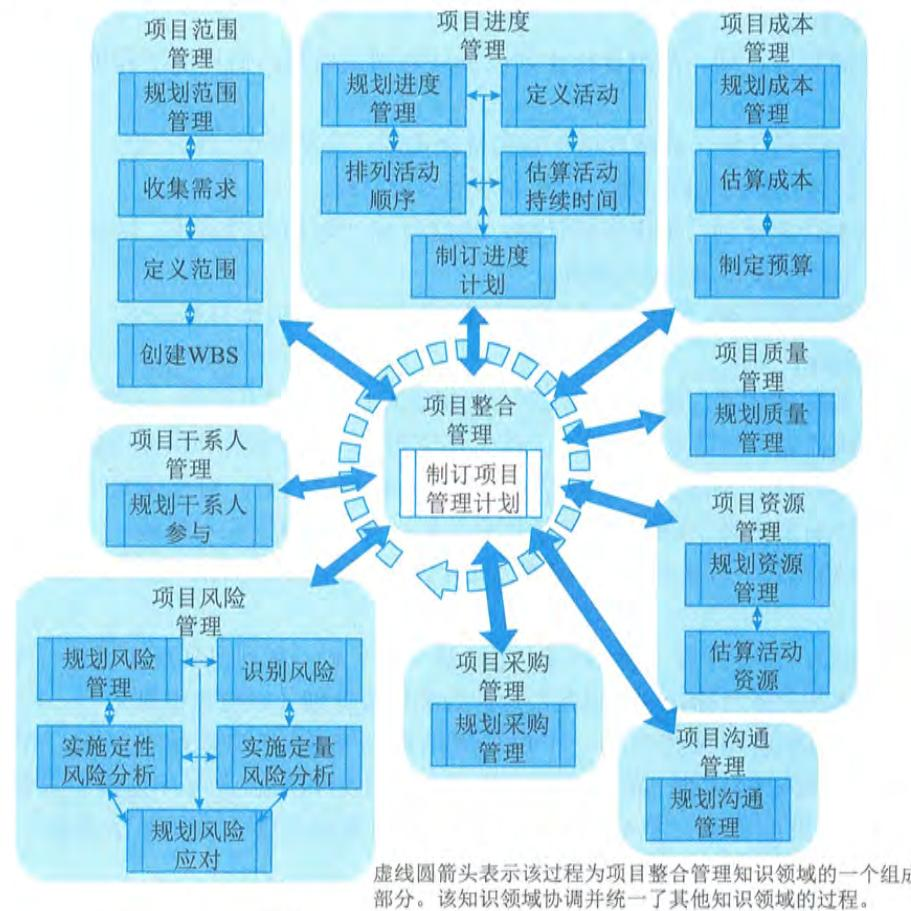  
图11-1 规划过程组各过程之间的关系

规划过程取决于项目本身的性质, 可能需要通过多轮反馈来做进一步分析。随着收集和掌握更多的项目信息或特性, 项目很可能需要进一步规划。项目生命周期中发生的重大变更, 可能引发重新开展一个或多个规划过程, 甚至一个或全部启动过程。这种对项目管理计划的持续精细化叫作"渐进明细", 表明项目规划和文件编制是迭代或持续开展的活动。本过程组的主要作用是确定成功完成项目或阶段的行动方案。

在规划项目、制订项目管理计划和项目文件时, 项目管理团队应当适当征求干系人的意见, 并鼓励干系人参与。初始规划工作完成时, 经批准的项目管理计划就被视为基准。在整个项目期间, 监控过程将把项目绩效与基准进行比较。

规划过程组需要开展以下15类主要工作:

(1) 通过规划管理过程, 编制需求管理计划、范围管理计划、进度管理计划、成本管理计划、质量管理计划、风险管理计划、资源管理计划、沟通管理计划、采购管理计划和干系人参与计划。

(2) 通过制订项目管理计划过程, 编制变更管理计划和配置管理计划, 确定项目开发方法和项目生命周期类型。

(3) 根据需求管理计划和范围管理计划, 编制范围目标计划, 包括项目范围说明书、工作分解结构和WBS字典。

(4) 根据资源管理计划、范围目标计划以及其他相关信息, 估算活动和项目所需的资源, 得到资源需求。

(5) 根据进度管理计划、范围目标计划和资源需求, 编制进度目标计划, 包括里程碑进度计划、汇总进度计划和详细进度计划, 以及相应的支持材料。

(6) 根据成本管理计划、范围目标计划、进度目标计划和资源需求, 编制成本目标计划, 包括成本估算、项目预算和项目资金需求。

(7) 根据质量管理计划、范围目标计划、进度目标计划和成本目标计划, 编制质量目标计划, 即质量测量指标。

(8) 根据范围管理计划、质量管理计划、资源管理计划, 以及范围、进度、成本和质量目标计划, 编制采购计划, 包括采购策略、采购工作说明书、招标文件和供方选择标准等。

(9) 根据风险管理计划等其他各种管理计划和其他相关信息, 对已编制出的范围、进度、成本和质量目标计划及采购计划进行风险识别和分析, 并制定风险应对措施。

(10) 根据风险识别、分析和应对措施制定的结果, 回头调整范围、进度、成本和质量目标计划及采购计划。

(11) 根据需要, 反复开展上述第(3)步至第(10)步, 直到得到现实可行、令人满意的范围、进度、成本和质量目标计划, 以及采购计划和风险计划 (风险登记册)。

(12) 把最终的项目范围说明书、工作分解结构和WBS字典汇编在一起, 报领导和主要干系人批准, 得到范围基准。把最终的里程碑进度计划和汇总进度计划报领导和其他主要干系人批准, 得到进度基准。把最终的项目预算报领导和其他主要干系人批准, 得到成本基准。

(13) 把所有的分项管理计划和分项基准汇编在一起, 形成项目管理计划, 并报领导和其

他主要干系人批准。把其他不属于项目管理计划的组成部分的内容（项目资金需求除外）归入“项目文件”或“采购文档”。

（14）把项目资金需求报给项目发起人，以便他据此准备和提供资金。

（15）召集项目开工会议，向干系人介绍项目计划和项目目标，获得干系人对项目的支持和参与，宣布项目正式进入执行阶段。

在编制计划的过程中，要留意并考虑项目执行组织内外部的商业环境的动态变化，考虑如何确保项目合规，如何确保项目能够实现组织变革和创造商业价值。

本章对规划过程组的24个过程——“制定项目管理计划”“规划范围管理”“收集需求”“定义范围”“创建WBS”“规划进度管理”“定义活动”“排列活动顺序”“估算活动持续时间”“制订进度计划”“规划成本管理”“估算成本”“制定预算”“规划质量管理”“规划资源管理”“估算活动资源”“规划沟通管理”“规划风险管理”“识别风险”“实施定性风险分析”“实施定量风险分析”“规划风险应对”“规划采购管理”“规划干系人参与”的输入输出、工具与技术进行说明时，采取以下规则进行描述：

$\bullet$  省略常见的输入输出、工具与技术；

$\bullet$  针对主要输入输出、重要的工具与技术进行详细阐述。

# 11.1 制订项目管理计划

制订项目管理计划是定义、准备和协调项目计划的所有组成部分，并把它们整合为一份综合项目管理计划的过程。本过程的主要作用是生成一份综合文件，用于确定所有项目工作的基础及其执行方式。本过程仅开展一次或仅在项目的预定义点开展。图11- 2描述了本过程的输入、工具与技术和输出。

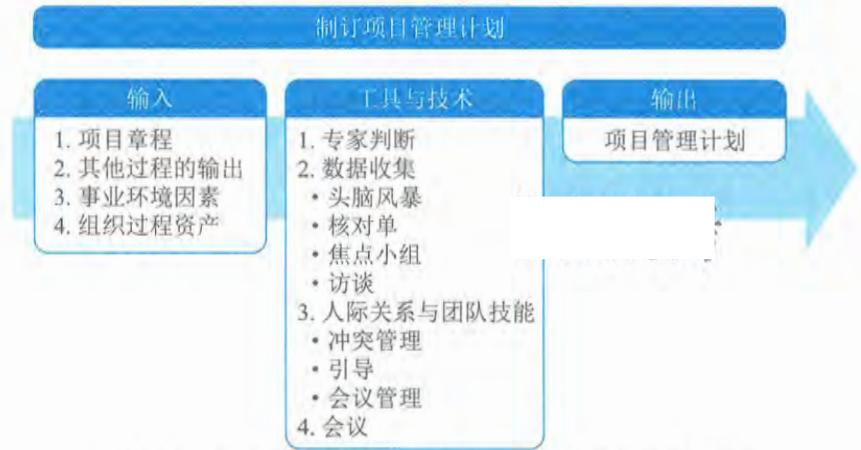  
图11-2 制订项目管理计划过程的输入、工具与技术和输出

项目管理计划确定项目的执行、监控和收尾方式，其内容会根据项目所在的应用领域和复杂程度的不同而不同。项目管理计划可以是概括的或详细的，每个组成部分的详细程度取决于

具体项目的要求。项目管理计划应基准化,即至少应规定项目的范围、时间和成本方面的基准,以便据此考核项目执行情况和管理项目绩效。在确定基准之前,可能要对项目管理计划进行多次更新,且这些更新无须遵循正式的流程。但是,一旦确定了基准,就只能通过提出变更请求、实施整体变更控制过程进行更新。在项目收尾之前,项目管理计划需要通过不断更新来渐进明细,并且这些更新需要得到控制和批准。

制订项目管理计划过程的主要输入为项目章程、其他过程的输出、事业环境因素和组织过程资产,主要输出为项目管理计划。

# 11.1.1 主要输入

# 1.项目章程

项目团队把项目章程作为初始项目规划的起点。项目章程会根据其所包含的信息种类数量、项目的复杂程度和已知信息的不同而不同。但项目章程中至少会包含项目的高层级信息,供项目管理计划的各个组成部分进一步细化。

# 2.其他知识领域规划过程的输出

创建项目管理计划需要整合诸多过程的输出。其他知识领域规划过程所输出的子计划和基准都是本过程的输入。此外,对这些子计划和基准的变更都可能导致对项目管理计划的相应更新。

# 3.事业环境因素

能够影响制订项目管理计划过程的事业环境因素主要包括以下5个方面:

(1)政府或行业标准(如产品标准、质量标准、安全标准和工艺标准);

(2)法律法规要求和相关制约因素,垂直市场(如建筑)和专门领域(如环境、安全、风险或敏捷软件开发)的项目管理知识体系;

(3)组织的结构、文化、管理实践和可持续性;

(4)组织治理框架(通过安排人员、制定政策和确定过程,以结构化的方式实施控制、指导和协调,以实现组织的战略和目标);

(5)基础设施(如现有的设施和固定资产)等。

# 4.组织过程资产

能够影响制订项目管理计划过程的组织过程资产主要包括以下4个方面:

(1)组织的标准政策、流程和程序,项目管理计划模板,变更控制程序(包括修改正式的组织标准、政策、计划、程序或项目文件,以及批准和确认变更所需遵循的步骤);

(2)监督和报告方法、风险控制程序以及沟通要求;

(3)以往类似项目的相关信息(如范围、成本、进度与绩效测量基准,项目日历,项目进度网络图和风险登记册);

(4)历史信息和经验教训知识库等。

# 11.1.2 主要输出

项目管理计划是说明项目执行、监控和收尾方式的一份文件,它整合并综合了所有知识领域的子管理计划和基准,以及管理项目所需的其他组件信息,项目管理计划的组件取决于项目的具体需求。项目管理计划组件主要包括子管理计划、基准和其他组件等。

(1)子管理计划:包括范围管理计划、需求管理计划、进度管理计划、成本管理计划、质量管理计划、资源管理计划、沟通管理计划、风险管理计划、采购管理计划、干系人参与计划。

(2)基准:包括范围基准、进度基准和成本基准。

(3)其他组件:虽然在项目管理计划过程中生成的组件会因项目而异,但是通常包括变更管理计划、配置管理计划、绩效测量基准、项目生命周期、开发方法、管理审查。

下面给出一个项目管理计划的示例。

# 1.项目名称

京华网上花店系统。

# 2.项目背景

随着互联网技术的飞速发展,互联网已经走进千家万户,"京华"鲜花店为了突破时空限制,降低交易成本,节约客户订购、支付和配送的时间,方便客户购买,决定进入电子商务网上鲜花销售市场,建立一个京华网上销售系统,利用互联网在线支付平台进行交易,实现网络营销与传统营销双通道同时运行的新型鲜花营销模式。

建设网上花店将取得以下几方面的收益:  $①$  网上销售带来销售量的增加。预计从网站运营起半年内花店收入增长  $10\%$  ,一年半内销售收入增长  $50\%$  。  $②$  网上销售带来的成本节约。预计鲜花销售成本可减少  $20\% \sim 30\%$  。  $③$  品牌增值带来的收益。网上商店的运作将扩大"京华"的知名度,提升"京华"品牌,最终使"京华"成为北京地区有影响力的鲜花网上销售企业。

3. 项目范围管理计划,范围基准

京华网上花店系统的总体目标是成为北京地区有影响力的鲜花网上销售企业,这一目标将分3个阶段实现。

项目的范围定为采用现有的各种网络技术,构建一个鲜花、礼品等商品多级查询、选择、订购的网上销售系统,为客户提供方便、快捷、安全的网上购物环境。

项目可交付成果包括一个网上购物商城,提供各类管理文档、开发技术文件、系统使用和用户手册,并对人员提供必要的培训。详细的可交付物说明参见WBS文档。

项目范围管理的方法为:

(1)范围说明书只有项目经理有权更新和发布。

(2)范围说明书是制定项目WBS的基础和依据。

(3)对项目范围说明书的更改或调整可能会引起合同变更,对此要慎重。

4. 项目进度管理计划,进度基准

项目建设周期约需要6个月。

5. 项目成本管理计划，成本基准

项目建设预计投入20万元，用于平台搭建、软硬件资源购买、技术支持及管理和人员的费用。成本预算方案见下表。

成本预算方案  

<table><tr><td>类别</td><td>成本项</td><td>费用</td></tr><tr><td>设备</td><td>服务器</td><td>23 000 元</td></tr><tr><td rowspan="3">软件</td><td>操作系统软件</td><td>5 000 元</td></tr><tr><td>数据库软件</td><td>15 000 元</td></tr><tr><td>防病毒软件</td><td>300 元</td></tr><tr><td rowspan="2">网站功能开发</td><td>项目人员费用</td><td>20 000 元</td></tr><tr><td>应用系统开发费用</td><td>50 000 元</td></tr><tr><td rowspan="2">网站推广</td><td>网上推广</td><td>10 000 元</td></tr><tr><td>网下推广</td><td>20 000 元</td></tr><tr><td rowspan="3">网站运营/维护</td><td>人员费用</td><td>50 000 元/年</td></tr><tr><td>主机托管/网站维护</td><td>7 000 元/年</td></tr><tr><td>国内域名/国际域名</td><td>600 元/年</td></tr><tr><td rowspan="2">合计</td><td>首年费用合计</td><td>143 300 元</td></tr><tr><td>每年运营/维护费用</td><td>57 600 元</td></tr></table>

共计：200900元

6. 项目质量管理计划

项目开发过程中，按照公司制定的CMMI三级标准过程来进行。在里程碑会议和周例会上按照公司的软件开发质量检查表、质量评审过程进行质量审查，提出改进措施并及时进行改进。详细的质量检查表、质量检查过程标准参见公司标准。

7. 项目人力资源计划

金建文（项目经理） 主要负责经营策略与项目规划

蒋长敏 主要负责网站开发

邓苗 主要负责网站的制作和维护

程智磊 主要负责市场调查和业务流程设计

8. 项目沟通计划

利用BBS建立一个项目共享区，所有项目干系人都通过这个共享区进行交流与沟通。项目的进展情况通过项目例会和里程碑会议进行检查与收集。项目沟通计划可根据项目实际情况进行及时调整。

9. 项目风险管理计划，风险登记册

项目实施过程中可能遇到的风险及防范措施如下。

1）技术风险

技术风险包括以下几个方面:

(1) 黑客攻击, 或者病毒入侵会导致网站死机或者不能访问, 影响网上花店的运作。防范措施是加强病毒和入侵检测, 设置好防火墙。

(2) 设备硬件损坏导致网站不能访问或者数据丢失, 使花店客户遭受损失。防范措施是做好数据备份以及硬件备份。

(3) 开发方出现问题使开发进度缓慢导致实施进度无法跟上计划。防范措施如下: 一是多方比较, 慎重选择合作方; 二是签订规范、合理的合同, 在出现纠纷时能通过法律途径保护本网站的正当权益。

2) 经营风险

经营风险包括以下几个方面:

(1) 网站宣传推广效果不好, 网站访问量少。防范措施是推广网站时应根据企业的自身情况选定合适的搜索引擎注册, 并且隔一段时间观察排名情况, 总结出哪些搜索引擎能带来实际效果。注意跟进, 积累数据, 为了以后的业务开展积累经验, 不断改进网站推广方式。还要注意引进、结合网下的多种推广方式。

(2) 由于目前企业计算机人才缺乏, 对外包单位依赖较大, 网站一旦出现问题只能由其解决。防范措施是加强员工在以下两个方面的技术培训: 一是要求电子商务员熟悉网站各模块的操作; 二是要求网络管理员熟悉网站系统的管理以及网站应用系统的程序。

(3) 若项目运营得比较成功, 客户量增大, 客户订单增长迅速, 花店接纳客户能力 (快速供货能力) 会受到考验。防范措施是加强与供应商的合作与联系, 提高双方的反应能力, 避免出现订单积压、供货链断裂的现象。

3) 管理风险

管理风险包括以下几个方面:

(1) 由于业务流的改变, 网上花店人员对新的销售流程不熟悉导致花店动作出现混乱。防范措施是加强对花店人员的业务培训, 主要是网上业务流程的培训。

(2) 由于有网上与网下两种销售方式, 其中的协调可能会出现问题。防范措施是统一协调, 制定网上、网下的营销方案, 加强各部门对网上销售业务的培训, 以及准备应急的方案。

4) 市场风险

可能出现多家竞争对手, 使竞争激烈, 导致预期销售量减少。防范措施是加强对竞争对手的分析, 及时调整经营策略。

10. 项目采购计划

项目所需要的硬件和软件的采购计划如下。

(1) 硬件选型方案所需设备如下表所示。

<table><tr><td>序号</td><td>名称</td><td>型号</td><td>单价</td><td>数量</td><td>金额</td></tr><tr><td>1</td><td>服务器</td><td>××1U机架式</td><td>23 000.00</td><td>1</td><td>23 000.00</td></tr><tr><td colspan="5">合计</td><td>23 000.00</td></tr></table>

（2）正版软件系统费用见下表。

<table><tr><td>序号</td><td>名称</td><td>单价</td><td>数量</td><td>金额</td><td>备注</td></tr><tr><td>1</td><td>Linux</td><td>5 000.00</td><td>1</td><td>5 000.00</td><td></td></tr><tr><td>2</td><td>南大通用</td><td>15 000.00</td><td>1</td><td>15 000.00</td><td></td></tr><tr><td>3</td><td>XX防病毒</td><td></td><td></td><td></td><td></td></tr><tr><td></td><td>XX防火墙企业服务器版</td><td>300.00</td><td>1</td><td>300.00</td><td></td></tr><tr><td>4</td><td>Oracle</td><td>5 000.00</td><td>1</td><td>5 000.00</td><td></td></tr><tr><td colspan="4">合计</td><td>25 300.00</td><td></td></tr></table>

# 11.2 规划范围管理

规划范围管理是为记录如何定义、确认和控制项目范围及产品范围而创建范围管理计划的过程。本过程的主要作用是在整个项目期间对如何管理范围提供指南和方向。本过程仅开展一次或仅在项目的预定义点开展。图11- 3描述了本过程的输入、工具与技术和输出。

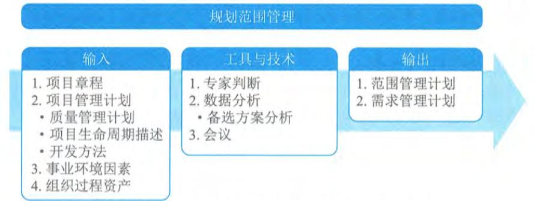  
图11-3 规划范围管理过程的输入、工具与技术和输出

规划范围管理过程的主要输入为项目管理计划，主要输出为范围管理计划和需求管理计划。

# 11.2.1 主要输入

规划范围管理过程使用的项目管理计划组件主要包括：

- 质量管理计划：在项目中实施组织的质量政策、方法和标准的方式会影响管理项目和产品范围的方式。

- 项目生命周期描述：定义了项目从开始到完成所经历的一系列阶段。- 开发方法：定义了项目是采用预测型、适应型还是混合型开发方法。

# 11.22 主要输出

# 1.范围管理计划

范围管理计划是项目管理计划的组成部分，描述将如何定义、制定、监督、控制和确认项目范围。制订范围管理计划和细化项目范围始于对下列信息的分析：项目章程中的信息、项目管理计划中已批准的子计划、组织过程资产中的历史信息和相关事业环境因素。范围管理计划用于指导如下过程和相关工作：

$\bullet$  制定项目范围说明书； $\bullet$  根据详细项目范围说明书创建WBS； $\bullet$  确定如何审批和维护范围基准； $\bullet$  正式验收已完成的项目可交付成果。 $\bullet$  根据项目需要，范围管理计划可以是正式或非正式的，非常详细或高度概括的。

# 2.需求管理计划

需求管理计划是项目管理计划的组成部分，描述将如何分析、记录和管理项目和产品需求。需求管理计划的主要内容包括：

$\bullet$  如何规划、跟踪和报告各种需求活动； $\bullet$  配置管理活动，例如，如何启动变更，如何分析其影响，如何进行追溯、跟踪和报告，以及变更审批权限； $\bullet$  需求优先级排序过程； $\bullet$  测量指标及使用这些指标的理由； $\bullet$  反映哪些需求属性将被列入跟踪矩阵等。

# 11.3 收集需求

收集需求是为实现目标而确定、记录并管理干系人的需要和需求的过程。本过程的主要作用是为定义产品范围和项目范围奠定基础。本过程仅开展一次或仅在项目的预定义点开展。图11- 4描述了本过程的输入、工具与技术和输出。

让干系人积极参与需求的探索和分解工作（分解成项目和产品需求），并仔细确定、记录和管理对产品、服务或成果的需求，能直接促进项目成功。需求是指根据特定协议或其他强制性规范，产品、服务或成果必须具备的条件或能力。它包括发起人、客户和其他干系人的已量化且书面记录的需要和期望。应该足够详细地挖掘、分析和记录这些需求，并将其包含在范围基准中，在项目执行开始后对其进行测量。需求将作为后续工作分解结构（WBS）的基础，也将作为成本、进度、质量和采购规划的基础。

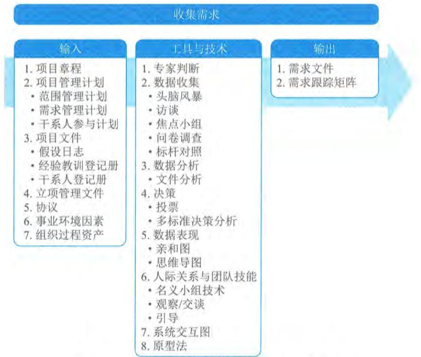  
图11-4 收集需求过程的输入、工具与技术和输出

收集需求过程的主要输入为项目管理计划和项目文件, 主要工具与技术为数据收集、数据分析、决策、数据表现、人际关系与团队技能、系统交互图和原型法, 主要输出为需求文件和需求跟踪矩阵。

# 11.3.1 主要输入

# 1. 项目管理计划

收集需求过程使用的项目管理计划组件主要包括: 范围管理计划、需求管理计划和干系人参与计划等。

(1) 范围管理计划。范围管理计划包含如何定义和制定项目范围的信息。

(2) 需求管理计划。需求管理计划包含如何收集、分析和记录项目需求的信息。

(3) 干系人参与计划。从干系人参与计划中了解干系人的沟通需求和参与程度, 以便评估并适应干系人对需求活动的参与程度。

# 2. 项目文件

可用作收集需求过程输入的项目文件主要包括假设日志、经验教训登记册和干系人登记册等。

(1) 假设日志。假设日志识别了有关产品、项目、环境、干系人以及会影响需求的其他因素的假设条件。

(2) 经验教训登记册。经验教训登记册提供了有效的需求收集技术, 尤其针对使用敏捷或适应型产品开发方法的项目。

(3) 干系人登记册。干系人登记册用于了解哪些干系人能够提供需求方面的信息, 及记录干系人对项目的需求和期望。

# 11.3.2 主要工具与技术

# 1. 数据收集

可用于收集需求过程的数据收集技术主要包括头脑风暴、访谈、焦点小组、问卷调查和标杆对照等。

(1) 头脑风暴。头脑风暴是一种用来产生和收集对项目需求与产品需求的多种创意的技术。

(2) 访谈。访谈是通过与干系人直接交谈来获取信息的正式或非正式的方法。访谈的典型做法是向被访者提出预设和即兴的问题, 并记录他们的回答。访谈经常是一个访谈者和一个被访者之间的"一对一"谈话, 但也可包括多个访谈者和/或多个被访者。访谈有经验的项目参与者、发起人和其他高管及主题专家, 有助于识别和定义所需产品可交付成果的特征和功能。访谈也可用于获取机密信息。

(3) 焦点小组。焦点小组是召集预定的干系人和主题专家, 了解他们对所讨论的产品、服务或成果的期望和态度。由一位受过训练的主持人引导大家进行互动式讨论。焦点小组往往比"一对一"的访谈更热烈。

(4) 问卷调查。问卷调查是指设计一系列书面问题, 向众多受访者快速收集信息。问卷调查方法非常适用于受众多样化、需要快速完成调查、受访者地理位置分散, 并且适合开展统计分析的情况。

(5) 标杆对照。标杆对照将实际或计划的产品、过程和实践与其他可比组织的实践进行比较, 以便识别最佳实践, 形成改进意见, 并为绩效考核提供依据。标杆对照所采用的可比组织可以是内部的, 也可以是外部的。

# 2. 数据分析

可用于收集需求过程的数据分析技术是文件分析。文件分析指审核和评估任何相关的文件信息。在此过程中, 文件分析通过分析现有文件, 识别与需求相关的信息来获取需求, 可供分析并有助于获取需求的文件包括协议, 商业计划, 业务流程或接口文档, 业务规则库, 现行流程, 市场文献, 问题日志, 政策、程序或法规文件 (如法律、准则、法令等), 建议邀请书, 用例等。

# 3. 决策

适用于收集需求过程的决策技术主要包括投票、独裁型决策制定和多标准决策分析等。

(1) 投票。投票是一种为达成某种期望结果, 而对未来多个行动方案进行评估的决策技术和过程。本技术用于生成、归类和排序产品需求。

(2) 独裁型决策制定。采用这种方法将由一个人负责为整个集体制定决策。

(3) 多标准决策分析。该技术借助决策矩阵, 用系统分析方法建立诸如风险水平、不确定性和价值收益等多种标准, 以对众多创意进行评估和排序。

# 4.数据表现

可用于收集需求过程的数据表现技术主要包括亲和图和思维导图等。

(1)亲和图。用来对大量创意进行分组的技术,以便进一步审查和分析。

(2)思维导图。把从头脑风暴中获得的创意整合成一张图,用以反映创意之间的共性与差异,激发新创意。

# 5.人际关系与团队技能

可用于收集需求过程的人际关系与团队技能主要包括名义小组技术、观察和交谈、引导等。

(1)名义小组技术。名义小组技术是用于促进头脑风暴的一种技术,通过投票排列最有用的创意,以便进一步开展头脑风暴或优先排序。名义小组技术是一种结构化的头脑风暴形式,由以下4个步骤组成:

向集体提出一个问题或难题,每个人在沉思后写出自己的想法。

主持人在活动挂图上记录所有人的想法。

集体讨论各个想法,直到全体成员达成一个明确的共识。

个人私下投票决出各种想法的优先排序,通常采用5分制,1分最低,5分最高。为减少想法数量,集中关注想法,可进行数轮投票。每轮投票后,都将清点选票,得分最高者被选出。

(2)观察和交谈。观察和交谈是指直接查看个人在各自的环境中如何执行工作(或任务)和实施流程。当产品使用者难以或不愿清晰说明他们的需求时,特别需要通过观察来了解他们的工作细节。观察也称为"工作跟随",通常由"旁站观察者"观察业务专家如何执行工作,但也可以由"参与观察者"来观察,即通过实际执行一个流程或程序,来体验该流程或程序是如何实施的,以便挖掘隐藏的需求。

(3)引导。引导与主题研讨会结合使用,把主要干系人召集在一起定义产品需求。研讨会可用于快速定义跨职能需求并协调干系人的需求差异。因为具有群体互动的特点,有效引导的研讨会有助于参与者之间建立信任、改进关系、改善沟通,从而有利于干系人达成一致意见。此外,与分别召开会议相比,研讨会能够更早发现并解决问题。

# 6.系统交互图

系统交互图是对产品范围的可视化描绘,可以直观显示业务系统(过程、设备、计算机系统等)及其与人和其他系统(行动者)之间的交互方式。

# 7.原型法

原型法是指在实际制造预期产品之前,先造出该产品的模型,并据此征求对需求的早期反馈。原型包括微缩产品、计算机生成的二维和三维模型、实体模型或模拟。因为原型是有形的实物,它使得干系人可以体验最终产品的模型,而不是仅限于讨论抽象的需求描述。原型法支持渐进明细的理念,需要经历从模型创建、用户体验、反馈收集到原型修改的反复循环过程。在经过足够的反馈循环之后,就可以通过原型获得足够的需求信息,从而进入设计或制造阶段。

故事板是一种原型技术,通过一系列的图像或图示来展示顺序或导航路径。故事板用于各种行业的各种项目中,如电影、广告、教学设计,以及敏捷和其他软件开发项目。在软件开发

中,故事板使用实体模型来展示网页、屏幕或其他用户界面的导航路径。

# 11.3.3 主要输出

# 1. 需求文件

需求文件描述各种单一需求将如何满足项目相关的业务需求。一开始可能只有高层级的需求,然后随着有关需求信息的增加而逐步细化。只有明确的(可测量和可测试的)、可跟踪的、完整的、相互协调的,且主要干系人愿意认可的需求,才能作为基准。需求文件的格式多种多样,既可以是一份按干系人和优先级分类列出全部需求的简单文件,也可以是一份包括内容提要、细节描述和附件等的详细文件。许多组织把需求分为不同的种类,如业务解决方案和技术解决方案。前者是干系人的需要,后者是指如何实现这些干系人需要的方案。把需求分成不同的类别,有利于对需求进行进一步完善和细化。需求的类别一般包括业务需求、干系人需求、解决方案需求、过渡和就绪需求、项目需求和质量需求等。

(1)业务需求。整个组织的高层级需要,例如,解决业务问题或抓住业务机会,以及实施项目的原因。

(2)干系人需求。干系人的需要。

(3)解决方案需求。为满足业务需求和干系人需求,产品、服务或成果必须具备的特性、功能和特征。解决方案需求又可以进一步分为功能需求和非功能需求。功能需求描述产品应具备的功能,例如,产品应该执行的行动、流程、数据和交互;非功能需求是对功能需求的补充,是产品正常运行所需的环境条件或质量要求,例如,可靠性、保密性、性能、安全性、服务水平、可支持性、保留或清除等。

(4)过渡和就绪需求。如数据转换和培训需求。这些需求描述了从"当前状态"过渡到"将来状态"所需的临时能力。

(5)项目需求。项目需要满足的行动、过程或其他条件,例如里程碑日期、合同责任、制约因素等。

(6)质量需求。用于确认项目可交付成果的成功完成或其他项目需求的实现的任何条件或标准,例如,测试、认证、确认等。

# 2. 需求跟踪矩阵

需求跟踪矩阵是把产品需求从其来源连接到能满足需求的可交付成果的一种表格。使用需求跟踪矩阵,把每个需求与业务目标或项目目标联系起来,有助于确保每个需求都具有业务价值。需求跟踪矩阵提供了在整个项目生命周期中跟踪需求的一种方法,有助于确保需求文件中被批准的每项需求在项目结束的时候都能实现并交付。最后,需求跟踪矩阵还为管理产品范围变更提供了框架。跟踪需求的内容包括:

- 业务需要、机会、目的和目标;

- 项目目标;

- 项目范围和WBS可交付成果;

- 产品设计;

产品开发;

测试策略和测试场景;

$\bullet$  高层级需求到详细需求等。

应在需求跟踪矩阵中记录每个需求的相关属性,这些属性有助于明确每个需求的关键信息。需求跟踪矩阵中记录的典型属性包括唯一标识、需求的文字描述、收录该需求的理由、所有者、来源、优先级别、版本、当前状态和状态日期。为确保干系人满意,可能需要增加一些补充属性,如稳定性、复杂性和验收标准。需求跟踪矩阵示例如图11- 5所示。

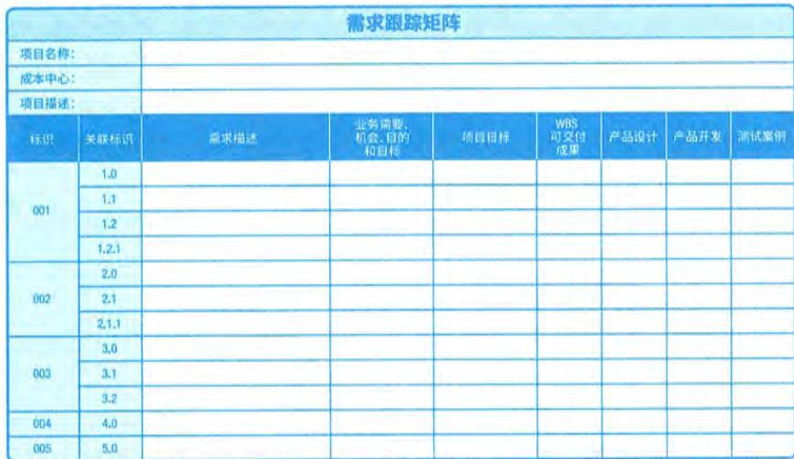  
图11-5 需求跟踪矩阵示例

# 11.4 定义范围

定义范围是制定项目和产品详细描述的过程。本过程的主要作用是描述产品、服务或成果的边界和验收标准。本过程仅开展一次或仅在项目的预定义点开展。图11- 6描述了本过程的输入、工具与技术和输出。

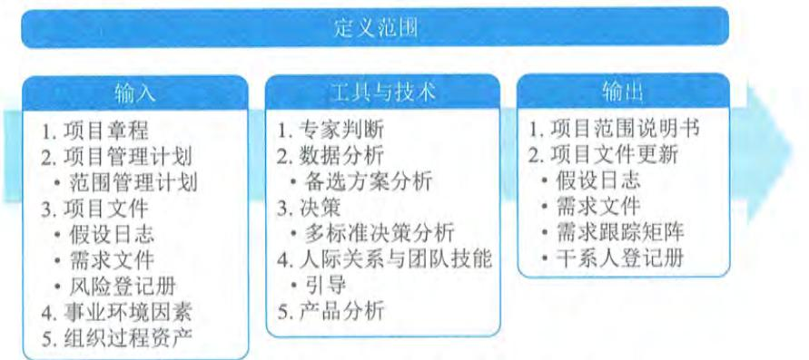  
图11-6 定义范围过程的输入、工具与技术和输出

由于在收集需求过程中识别出的所有需求未必都包含在项目中,所以定义范围过程需要从需求文件(收集需求过程的输出)中选取最终的项目需求,然后制定出关于项目及其产品、服务或成果的详细描述。准备好详细的项目范围说明书对项目成功至关重要。

应根据项目启动过程中记载的主要可交付成果、假设条件和制约因素来编制详细的项目范围说明书。在项目规划过程中,随着对项目信息了解的逐渐深入,应该更加详细、具体地定义和描述项目范围。此外,还需要分析现有风险、假设条件和制约因素的完整性,并做必要的增补或更新。

定义范围过程的主要输入为项目管理计划和项目文件,主要输出为项目范围说明书。

# 11.4.1 主要输入

# 1.项目管理计划

1. 项目管理计划定义范围过程中使用的项目管理计划组件是范围管理计划,其中记录了如何定义、确认和控制项目范围。

# 2.项目文件

可用作定义范围过程输入的项目文件主要包括假设日志、需求文件和风险登记册等。

(1)假设日志。假设日志识别了有关产品、项目、环境、干系人以及会影响项目和产品范围的假设条件和制约因素。

(2)需求文件。需求文件识别了应纳入范围的需求。

(3)风险登记册。风险登记册包含了可能影响项目范围的应对策略,例如缩小或改变项目和产品范围,以规避或缓解风险。

# 11.4.2 主要输出

项目范围说明书是对项目范围、主要可交付成果、假设条件和制约因素的描述。它记录了整个范围(包括项目和产品范围),详细描述了项目的可交付成果,代表项目干系人之间就项目范围所达成的共识。为便于管理干系人的期望,项目范围说明书可明确指出哪些工作不属于本项目范围。项目范围说明书帮助项目团队进行更详细的规划,在执行过程中指导项目团队工作,并为评价变更请求或额外工作是否超过项目边界提供基准。

项目范围说明书描述要做和不要做的工作的详细程度,决定着项目管理团队控制整个项目范围的有效程度。详细的项目范围说明书包括的内容有产品范围描述、可交付成果、验收标准、项目的除外责任等。

(1)产品范围描述。逐步细化项目章程和需求文件中所述的产品、服务或成果特征。

(2)可交付成果。为完成某一过程、阶段或项目而必须产出的任何独特并可核实的产品、成果或服务能力,可交付成果也包括各种辅助成果,如项目管理报告和文件,对可交付成果的描述可略可详。

(3)验收标准。可交付成果通过验收前必须满足的一系列条件。

(4)项目的除外责任。识别排除在项目之外的内容。明确说明哪些内容不属于项目范围,有助于管理干系人的期望及减少范围蔓延。

虽然项目章程和项目范围说明书的内容存在一定程度的重叠,但它们的详细程度完全不同。项目章程包含高层级的信息;而项目范围说明书则是对范围组成部分的详细描述,这些组成部分需要在项目过程中渐进细化。

# 11.5 创建WBS

创建工作分解结构(WBS)是把项目可交付成果和项目工作分解为较小的、更易于管理的组件的过程。本过程的主要作用是为所要交付的内容提供架构。本过程仅开展一次或仅在项目的预定义点开展。图11- 7描述了本过程的输入、工具与技术和输出。

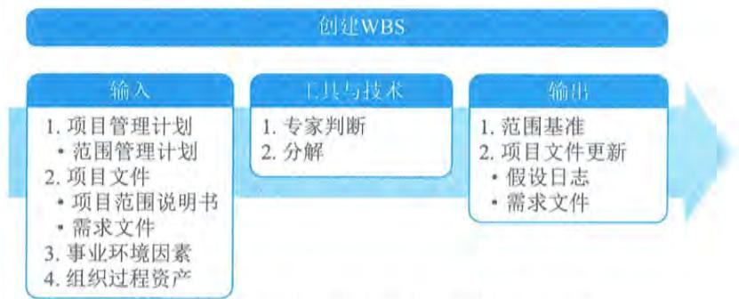  
图11-7 创建WBS过程的输入、工具与技术和输出

WBS是对项目团队为实现项目目标、创建所需可交付成果而需要实施的全部工作范围的层级分解。WBS组织并定义了项目的总范围,代表着经批准的当前项目范围说明书中所规定的工作。

WBS最底层的组成部分称为工作包,其中包括计划的工作。工作包对相关活动进行归类,以便对工作安排进度、进行估算、开展监督与控制。在"工作分解结构"这个词语中,"工作"是指作为活动结果的工作产品或可交付成果,而不是活动本身。

创建WBS过程的主要输入为项目管理计划和项目文件,主要工具与技术为分解技术,主要输出为范围基准。

# 11.5.1 主要输入

# 1.项目管理计划

创建WBS过程中使用的项目管理计划组件是范围管理计划。范围管理计划定义了如何根据项目范围说明书创建WBS。

# 2.项目文件

可用作创建WBS过程输入的项目文件主要包括项目范围说明书和需求文件等。

(1)项目范围说明书。项目范围说明书描述了需要实施的工作,以及不包含在项目中的工作。

(2)需求文件。需求文件详细描述了各种单一需求如何满足项目的业务需要。

# 11.5.2 主要工具与技术

11.5.2 主要工具与技术分解是一种把项目范围和项目可交付成果逐步划分为更小、更便于管理的组成部分的技术。工作包是WBS最底层的工作，可对其成本和持续时间进行估算和管理。分解的程度取决于所需的控制程度，以实现对项目的高效管理；工作包的详细程度则因项目规模和复杂程度而异。创建WBS的方法多种多样，常用的方法包括自上而下的方法、使用组织特定的指南和使用WBS模板。自下而上的方法可用于归并较低层次组件。

# 1.分解活动

要把整个项目工作分解为工作包，通常需要开展如下活动：

$\bullet$  识别和分析可交付成果及相关工作； $\bullet$  确定WBS的结构和编排方法； $\bullet$  自上而下逐层细化分解； $\bullet$  为WBS组成部分制定和分配标识编码； $\bullet$  核实可交付成果分解的程度是否恰当。

如图11- 8所示为某工作分解结构的一部分，若干分支已经向下分解到工作包层次。

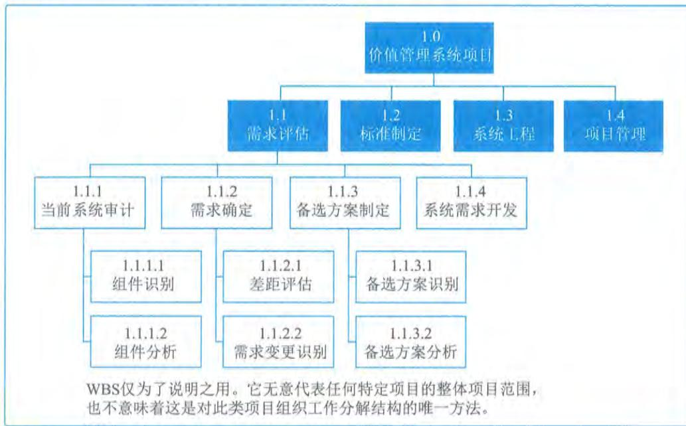  
图11-8 分解到工作包的WBS示例

# 2.WBS结构

2. WBS结构WBS的结构可以采用多种形式。以项目生命周期的各阶段作为分解的第二层，把产品和项目可交付成果放在第三层，这种形式的WBS如图11-9所示。以主要可交付成果作为分解的第二层，这种形式的WBS如图11-10所示。将其纳入由项目团队以外的组织开发的各种较低层次

组件（如外包工作）。随后，作为外包工作的一部分，卖方须制定相应的合同WBS。

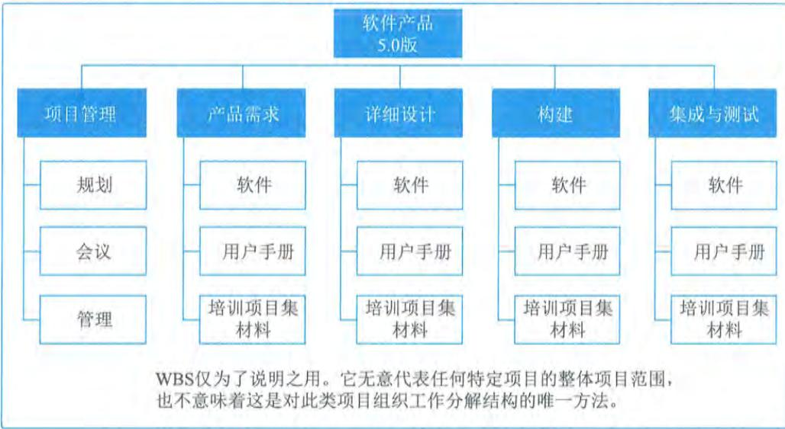  
图11-9 以项目生命周期的各阶段作为第二层的WBS示例

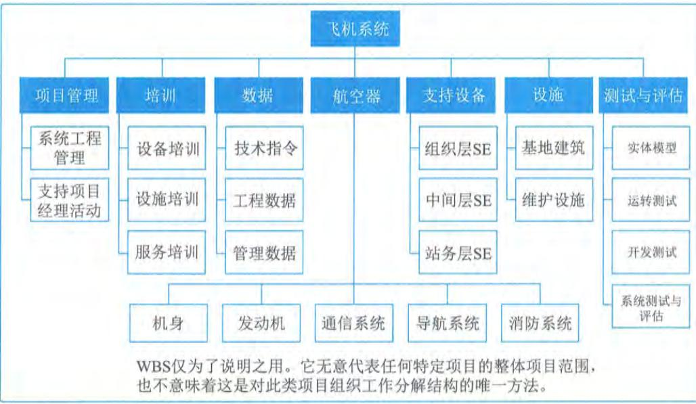  
图11-10 以主要可交付成果作为第二层的WBS示例

对WBS较高层组件进行分解，就是要把每个可交付成果或组件分解为最基本的组成部分，即可核实的产品、服务或成果。如果采用敏捷或适应型方法，可以将长篇故事分解成用户故事。WBS可以采用提纲式、组织结构图或能说明层级结构的其他形式。通过确认WBS较低层组件是完成上层相应可交付成果的必要且充分的工作，来核实分解的正确性。不同的可交付成果可以分解到不同的层次。某些可交付成果只需分解到下一层，即可到达工作包的层次，而有些则

需分解更多层。工作分解得越细致,对工作的规划、管理和控制就越有力。但是,过细的分解会造成管理工作的无效耗费、资源使用效率低下、工作实施效率降低,同时造成WBS各层级的数据汇总困难。

要在未来远期才完成的可交付成果或组件,当前可能无法分解。因而项目管理团队通常需要等待对该可交付成果或组成部分达成一致意见,才能够制定出WBS中的相应细节。这种技术又称为滚动式规划。

# 3. 注意事项

在分解的过程中,应该注意以下8个方面:

(1)WBS必须是面向可交付成果的。项目的目标是提供产品或服务,WBS中的各项工作是为提供可交付的成果服务的。WBS并没有明确地要求重复循环的工作,但为了达到里程碑,有些工作可能要进行多次。最明显的例子是软件测试,软件必须经过多次测试后才能作为可交付成果。

(2)WBS必须符合项目的范围。WBS必须包括,也仅包括为了完成项目的可交付成果的活动。 $100\%$  原则(包含原则)认为,在WBS中,所有下一级的元素之和必须  $100\%$  代表上一级元素。如果WBS没有覆盖全部的项目可交付成果,那么最后提交的产品或服务是无法让用户满意的。

(3)WBS的底层应该支持计划和控制。WBS是项目管理计划和项目范围之间的桥梁,WBS的底层不但要支持项目管理计划,而且要让管理层能够监视和控制项目的进度和预算。

(4)WBS中的元素必须有人负责,而且只由一个人负责。如果存在没有人负责的内容,那么WBS发布后,项目团队成员将很少能够意识到自己和其中内容上的联系。WBS和责任人可以使用工作责任矩阵来描述。在一些参考文献中,这个规定又称为独立责任原则。

(5)WBS应控制在  $4\sim 6$  层。如果项目规模比较大,以至于WBS要超过6层,此时可以使用项目分解结构将大项目分解成子项目,然后针对子项目来做WBS。每个级别的WBS将上一级的一个元素分为  $4\sim 7$  个新的元素,同一级的元素的大小应该相似。一个工作单元只能从属于某个上层单元,避免交叉从属。

(6)WBS应包括项目管理工作(因为管理是项目具体工作的一部分),也要包括分包出去的工作。

(7)WBS的编制需要所有(主要)项目干系人的参与。各项目干系人站在自己的立场上,对同一个项目可能编制出差别较大的WBS。项目经理应该组织他们进行讨论,以便编制出一份大家都能接受的WBS。

(8)WBS并非一成不变的。在完成WBS之后的工作中,仍然有可能需要对WBS进行修改。如果没有合理的范围控制,仅仅依靠WBS会使得后面的工作僵化。

# 11.5.3 主要输出

范围基准是经过批准的范围说明书、WBS和相应的WBS字典,只有通过正式的变更控制程序才能进行变更,它被用作比较的基础。范围基准是项目管理计划的组成部分,包括项目范围说明书、WBS、工作包、规划包和WBS字典等。

(1)项目范围说明书。项目范围说明书包括对项目范围、主要可交付成果、假设条件和制约因素的描述。

(2)WBS。WBS是对项目团队为实现项目目标、创建所需可交付成果而需要实施的全部工作范围的层级分解。工作分解结构每向下分解一层,代表对项目工作更详细的定义。

(3)工作包。WBS的最低层级是带有独特标识号的工作包。这些标识号为进行成本、进度和资源信息的逐层汇总提供了层级结构,即账户编码。每个工作包都是控制账户的一部分,而控制账户则是一个管理控制点。在该控制点上,把范围、预算和进度加以整合,并与挣值相比较,以测量绩效。控制账户包含两个或更多工作包,但每个工作包只与一个控制账户关联。

(4)规划包。规划包是一种低于控制账户而高于工作包的工作分解结构组件,工作内容已知,但详细的进度活动未知,一个控制账户可以包含一个或多个规划包。

(5)WBS字典。WBS字典是针对WBS中的每个组件,详细描述可交付成果、活动和进度信息的文件。WBS字典对WBS提供支持,其中大部分信息由其他过程创建,然后在后期添加到字典中。WBS字典中的内容一般包括账户编码标识、工作描述、假设条件和制约因素、负责的组织、进度里程碑、相关的进度活动、所需资源、成本估算、质量要求、验收标准、技术参考文献和协议信息等。

# 11.6 规划进度管理

规划进度管理是为规划、编制、管理、执行和控制项目进度而制定政策、程序和文档的过程。本过程的主要作用是为如何在整个项目期间管理项目进度提供指南和方向。本过程仅开展一次或仅在项目的预定义点开展。图11- 11描述了本过程的输入、工具与技术和输出。

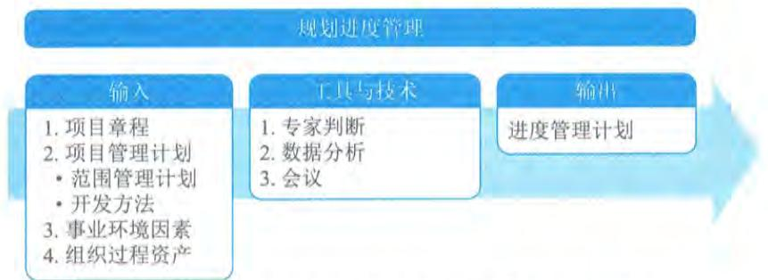  
图11-11 规划进度管理过程的输入、工具与技术和输出

规划进度管理过程的主要输入为项目管理计划,主要输出为进度管理计划。

# 11.6.1 主要输入

规划进度管理过程使用的项目管理计划组件主要包括范围管理计划和开发方法等。

(1)范围管理计划。范围管理计划描述如何定义和制定范围,并提供有关如何制定进度计划的信息。

(2)开发方法。产品开发方法有助于定义进度计划方法、估算技术、进度计划编制工具以及用来控制进度的技术。

# 11.62 主要输出

进度管理计划是项目管理计划的组成部分，为编制、监督和控制项目进度建立准则和明确活动要求。根据项目需要，进度管理计划可以是正式或非正式的，非常详细或高度概括的。进度管理计划的内容一般包括项目进度模型、进度计划的发布和迭代长度、精准度、计量单位、WBS、项目进度模型维护、控制临界值、绩效测量规则和报告格式等。

（1）项目进度模型。需要规定用于制定项目进度模型的进度规划方法论和工具。

（2）进度计划的发布和迭代长度。使用适应型生命周期时，应指定发布、规划和迭代的固定时间段。固定时间段指项目团队稳定地朝着目标前进的持续时间，它可以推动团队先处理基本功能，然后在时间允许的情况下再处理其他功能，从而尽可能减少范围蔓延。

（3）准确度。准确度定义了活动持续时间估算的可接受区间，以及允许的紧急情况储备。

（4）计量单位。需要规定每种资源的计量单位，例如，用于测量时间的人·时数、人·天数或周数，用于计量数量的米、升、吨、千米或立方米。

（5）WBS。工作分解结构（WBS）为进度管理计划提供了框架，保证了与估算及相应进度计划的协调性。

（6）项目进度模型维护。需要规定在项目执行期间，将如何在进度模型中更新项目状态，记录项目进展。

（7）控制临界值。需要规定偏差临界值，用于监督进度绩效。它是在需要采取某种措施前允许出现的最大差异。临界值通常用偏离基准计划中参数的某个百分数来表示。

（8）绩效测量规则。需要规定用于绩效测量的挣值管理（EVM）规则或其他规则。

（9）报告格式。需要规定各种进度报告的格式和编制频率。

# 11.7 定义活动

定义活动是识别和记录为完成项目可交付成果而须采取的具体行动的过程。本过程的主要作用是将工作包分解为进度活动，作为对项目工作进行进度估算、规划、执行、监督和控制的基础。本过程需要在整个项目期间开展。图11- 12描述了本过程的输入、工具与技术和输出。

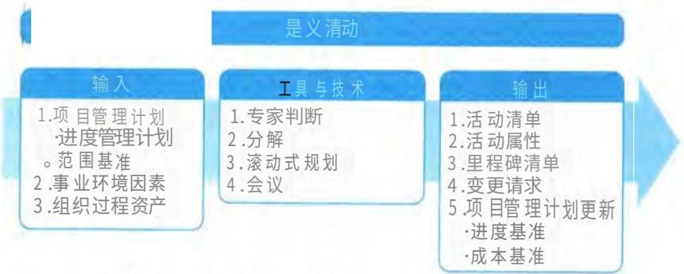  
图11-12 定义活动过程的输入、工具与技术和输出

定义活动过程的主要输入为项目管理计划, 主要工具与技术为分解和滚动式规划, 主要输出为活动清单、活动属性和里程碑清单。

# 11.7.1 主要输入

定义活动过程使用的项目管理计划组件主要包括进度管理计划和范围基准。

(1) 进度管理计划。进度管理计划定义进度计划方法、滚动式规划的持续时间, 以及管理工作所需的详细程度。

(2) 范围基准。在定义活动时, 需明确考虑范围基准中的项目WBS、可交付成果、制约因素和假设条件。

# 11.7.2 主要工具与技术

定义活动过程的工具与技术主要包括分解和滚动式规划等。

# 1.分解

分解是一种把项目范围和项目可交付成果逐步划分为更小、更便于管理的组成部分的技术。WBS中的每个工作包都需分解成活动, 以便通过这些活动来完成相应的可交付成果。让团队成员参与分解过程有助于得到更好、更准确的结果。WBS、WBS字典和活动清单可依次或同时编制, 其中WBS和WBS字典是制定最终活动清单的基础。活动表示完成工作包所需的投入。定义活动过程的最终输出是活动, 而不是可交付成果, 可交付成果是指导与管理项目工作过程的输出。

# 2.滚动式规划

滚动式规划是一种迭代式的规划技术, 即详细规划近期要完成的工作, 同时在较高层级上粗略规划远期工作。它是一种渐进明细的规划方式, 适用于工作包、规划包。因此, 在项目生命周期的不同阶段, 工作的详细程度会有所不同。在早期的战略规划阶段, 信息尚不够明确, 工作包只能分解到已知的详细水平; 而后, 随着了解到更多的信息, 近期即将实施的工作包就可以分解到具体的活动。

# 11.7.3 主要输出

# 1.活动清单

活动清单包含项目所需的进展活动。对于使用滚动式规划或敏捷技术的项目, 活动清单会在项目进展过程中得到定期更新。活动清单包括每个活动的标识及工作范围详述, 使项目团队成员知道需要完成什么工作。

# 2.活动属性

活动属性是指每项活动所具有的多重属性, 用来扩充对活动的描述。活动属性随着项目进展情况演进并更新。在项目初始阶段, 活动属性包括唯一活动标识 (ID)、WBS标识和活动标签或名称; 在活动属性编制完成时, 活动属性可能包括活动描述、紧前活动、紧后活动、逻辑

关系、提前量和滞后量、资源需求、强制日期、制约因素和假设条件。活动属性可用于识别开展工作的地点、编制开展活动的项目日历,以及指明相关的活动类型。活动属性还可用于编制进度计划。根据活动属性,可在报告中以各种方式对计划进度活动进行选择、排序和分类。

# 3.里程碑清单

里程碑是项目中的重要时点或事件,里程碑清单列出了项目所有的里程碑,并指明每个里程碑是强制性的(如合同要求的)还是选择性的(如根据历史信息确定的)。里程碑的持续时间为零,因为它们代表的只是一个重要时间点或事件。

# 11.8 排列活动顺序

排列活动顺序是识别和记录项目活动之间的关系的过程。本过程的主要作用是定义工作之间的逻辑顺序,以便在既定的所有项目制约因素下获得最高的效率。本过程需要在整个项目期间开展。图11- 13描述了本过程的输入、工具与技术和输出。

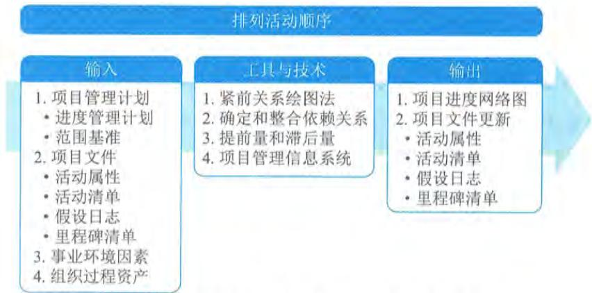  
图11-13 排列活动顺序过程的输入、工具与技术和输出

排列活动顺序过程旨在将项目活动列表转化为图表,作为发布进度基准的第一步。

除了首尾两项,每项活动都至少有一项紧前活动和一项紧后活动,并且逻辑关系适当。通过设计逻辑关系可以支持创建一个切实的项目进度计划,可能有必要在活动之间使用提前量或滞后量,使项目进度计划更为切实可行。可以使用项目管理软件、手动技术或自动技术来排列活动顺序。

排列活动顺序过程的主要输入为项目管理计划和项目文件,主要工具与技术包括紧前关系绘图法、箭线图法、提前量和滞后量,主要输出为项目进度网络图。

# 11.8.1 主要输入

# 1.项目管理计划

排列活动顺序过程使用的项目管理计划组件主要包括进度管理计划和范围基准等。

(1) 进度管理计划。进度管理计划规定了排列活动顺序的方法和准确度, 以及所需的其他标准。

(2) 范围基准。在排列活动顺序时, 需明确考虑范围基准中的项目WBS、可交付成果、制约因素和假设条件。

# 2. 项目文件

可作为排列活动顺序过程输入的项目文件主要包括假设日志、活动属性、活动清单和里程碑清单等。

(1) 假设日志。假设日志所记录的假设条件和制约因素可能影响活动排序的方式、活动之间的关系, 以及对提前量和滞后量的需求, 并且有可能生成一个会影响项目进度的风险。

(2) 活动属性。活动属性中可能描述了事件之间的必然顺序或确定的紧前或紧后关系, 以及定义的提前量与滞后量, 和活动之间的逻辑关系。

(3) 活动清单。活动清单列出了项目所需的、待排序的全部进度活动, 这些活动的依赖关系和其他制约因素会对活动排序产生影响。

(4) 里程碑清单。里程碑清单中可能已经列出特定里程碑的实现日期, 这可能影响活动排序的方式。

# 11.8.2 主要工具与技术

# 1. 紧前关系绘图法

紧前关系绘图法 (Precedence Diagramming Method, PDM), 又称前导图法, 是创建进度模型的一种技术, 它使用方框或者长方形 (被称作节点) 代表活动, 节点之间用箭头连接, 以显示节点之间的逻辑关系。这种网络图也被称作单代号网络图 (只有节点需要编号) 或活动节点图 (Active On Node, AON), 如图11- 14所示。

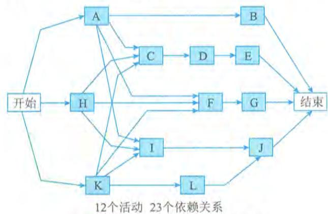  
图11-14 前导图法（单代号网络图）

PDM中的活动关系类型有4种, 如图11- 15所示。紧前活动是在进度计划的逻辑路径中, 排在某个活动前面的活动。紧后活动是在进度计划的逻辑路径中, 排在某个活动后面的活动。这4种活动关系类型的定义为:

- 完成到开始（FS）：只有紧前活动完成，紧后活动才能开始的逻辑关系。例如，只有完成装配PC硬件（紧前活动），才能开始在PC上安装操作系统（紧后活动）。

- 完成到完成（FF）：只有紧前活动完成，紧后活动才能完成的逻辑关系。例如，只有完成文件的编写（紧前活动），才能完成文件的编辑（紧后活动）。

- 开始到开始（SS）：只有紧前活动开始，紧后活动才能开始的逻辑关系。例如，只有开始地基浇灌（紧前活动），才能开始混凝土的找平（紧后活动）。

- 开始到完成（SF）：只有紧前活动开始，紧后活动才能完成的逻辑关系。例如，只有启动新的应付账款系统（紧前活动），才能关闭旧的应付账款系统（紧后活动）。

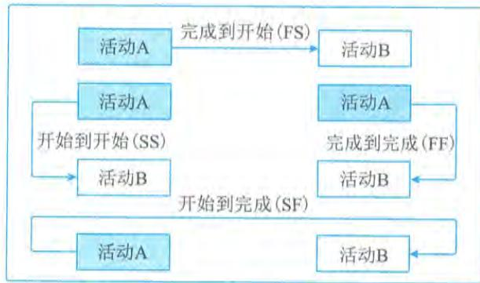  
图11-15 紧前关系绘图法（PDM）中的活动关系类型

在PDM图中，FS是最常用的逻辑关系类型，SF关系则很少使用。

在前导图法中，每项活动有唯一的活动号，每项活动都注明了预计工期（活动的持续时间）。通常，每个节点的活动会有如下几个时间：

- 最早开始时间（Earliest Start time，ES）：某项活动能够开始的最早时间；- 最早完成时间（Earliest Finish time，EF）：某项活动能够完成的最早时间，EF=ES+工期；- 最迟开始时间（Latest Start time，LS）：为了使项目按时完成，某项活动必须开始的最迟时间；- 最迟完成时间（Latest Finish time，LF）：为了使项目按时完成，某项活动必须完成的最迟时间，LS=LF-工期。

这几个时间通常作为每个节点的组成部分，如图11- 16所示。

  
图11-16 PDM图中的节点表示

虽然两个活动之间可能同时存在两种逻辑关系（例如SS和FF），但不建议相同的活动之间存在多种关系。因此，必须做出影响最大的逻辑关系的决定。此外也不建议采用闭环的逻辑关系。

# 2. 箭线图法

箭线图法（Arrow Diagramming Method，ADM）是用箭线表示活动、用节点表示事件的一种网络图绘制方法，如图11- 17所示。这种网络图也被称作双代号网络图（节点和箭线都要编号）或活动箭线图（Active On the Arrow，AOA）。

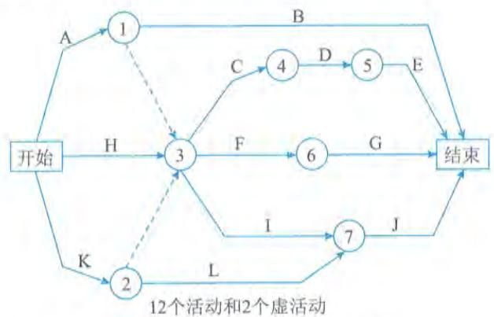  
图11-17 箭线图法（双代号网络图）

在箭线图法中，有如下3个基本原则：

（1）网络图中的每一项活动和每一个事件都必须有唯一的代号，即网络图中不会有相同的代号；（2）任两项活动的紧前事件和紧后事件代号至少有一个不相同，节点代号沿箭线方向越来越大；（3）流入（流出）同一节点的活动，均有共同的紧后活动（或紧前活动）。

为了绘图方便，在箭线图中又人为引入了一种额外的、特殊的活动，叫作虚活动（Dummy Activity），在网络图中由虚箭线表示。虚活动不消耗时间，也不消耗资源，只是为了弥补箭线图在表达活动依赖关系方面的不足。借助虚活动，我们可以更好地、更清楚地表达活动之间的关系，如图11- 18所示。

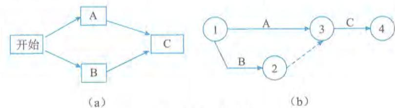  
图11-18 虚活动

注：活动A和B可以同时进行；只有活动A和B都完成后，活动C才能开始。

# 3. 提前量和滞后量

提前量是相对于紧前活动，紧后活动可以提前的时间量，提前量一般用负值表示。滞后量是相对于紧前活动，紧后活动需要推迟的时间量，滞后量一般用正值表示。例如，在新办公大

楼建设项目中, 景观建筑划分可以在尾工清单编制完成前 2 周开始; 对于一个大型技术文档, 编写小组可以在编写工作开始后 15 天, 开始编辑文档草案, 如图 11- 19 所示。

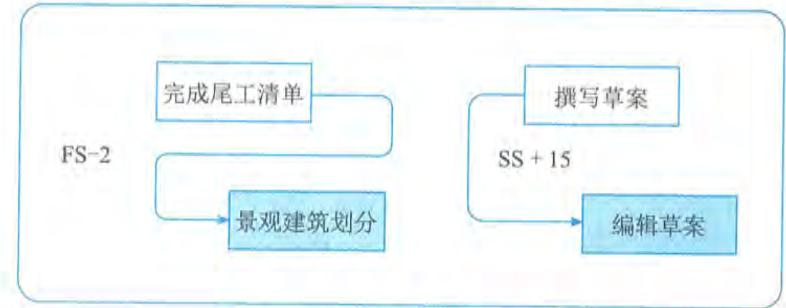  
图 11-19 提前量和滞后量示例

项目管理团队应该明确哪些依赖关系中需要加入提前量或滞后量, 以便准确地表示活动之间的逻辑关系。

# 11.8.3 主要输出

项目进度网络图是表示项目进度活动之间的逻辑关系（也叫依赖关系）的图形。图 11- 20 所示是项目进度网络图的一个示例。项目进度网络图可手工或借助项目管理软件来绘制, 可包括项目的全部细节, 也可只列出一项或多项概括性活动。项目进度网络图应附有简要文字描述, 说明活动排序所使用的基本方法。在文字描述中, 还应该对任何异常的活动序列做详细说明。

带有多个紧前活动的活动代表路径汇聚, 而带有多个紧后活动的活动则代表路径分支。带汇聚和分支的活动受到多个活动的影响或能够影响多个活动, 因此存在较大风险。

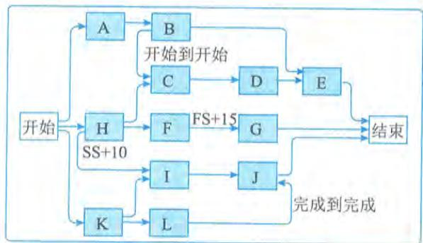  
图 11-20 项目进度网络图示例

# 11.9 估算活动持续时间

估算活动持续时间是根据资源估算的结果, 估算完成单项活动所需工作时段数的过程。本过程的主要作用是确定完成每个活动所需花费的时间量。本过程需要在整个项目期间开展。图 11- 21 描述了本过程的输入、工具与技术和输出。

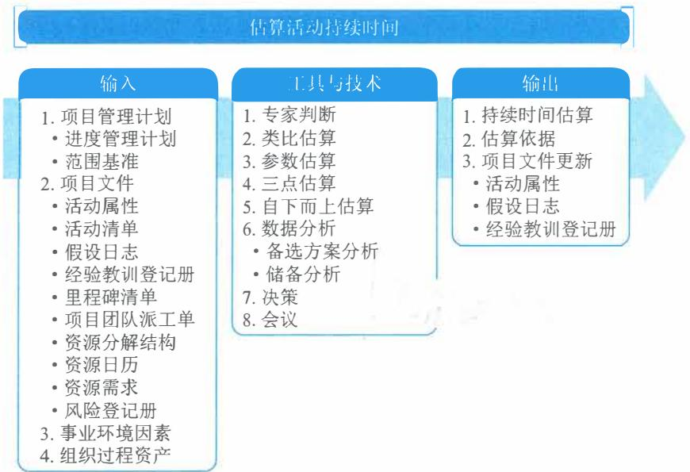  
图11-21 估算活动持续时间过程的输入、工具与技术和输出

在估算活动持续时间过程中，应该首先估算完成活动所需的工作量和计划投入该活动的资源数量，然后结合项目日历和资源日历，据此估算出完成活动所需的工作时段（即活动持续时间）。应该由项目团队中最熟悉具体活动的个人或小组提供持续时间估算所需的各种输入，对持续时间的估算也应该根据输入数据的数量和质量进行渐进明细。例如，在工程与设计项目中，随着数据越来越详细，越来越准确，持续时间估算的准确性和质量也会越来越高。

在许多情况下，预计可用的资源数量以及这些资源（尤其是人力资源）的技能熟练程度可能会决定活动的持续时间，更改分配到活动的主导性资源通常会影响持续时间，但这不是简单的“直线”或线性关系。有时候，因为工作的特性（即受到持续时间的约束、相关人力投入或资源数量），无论资源分配如何，都需要花预定的时间才能完成工作。估算活动持续时间时需要考虑的其他因素包括收益递减规律、资源数量、技术进步和员工激励等。

（1）收益递减规律。在保持其他因素不变的情况下，增加一个用于确定单位产出所需投入的因素（如资源）会最终达到一个临界点，在该点之后的产出或输出会随着增加这个因素而递减。

（2）资源数量。增加资源数量，比如资源两倍投入，但完成工作的时间不一定能缩短一半，因为投入资源可能会增加额外的风险，比如，如果增加太多活动资源，可能会因知识传递、学习曲线、额外合作等其他相关因素而造成持续时间增加。

（3）技术进步。在确定持续时间估算时，技术进步因素可能发挥重要作用。例如，通过采购最新技术，制造工厂可以提高产量，而这可能会影响持续时间和资源需求。

（4）员工激励。项目经理还需要了解拖延症和帕金森定律，前者指出，人们只有在最后一刻，即快到期限时才会全力以赴；后者指出，只要还有时间，工作就会不断扩展，直到用完所有的时间。

应该把活动持续时间估算所依据的全部数据与假设都记录在案。

估算活动持续时间过程的主要输入为项目管理计划和项目文件, 主要工具与技术包括类比估算、参数估算、三点估算和自下而上估算, 主要输出为持续时间估算和估算依据。

# 11.9.1 主要输入

# 1. 项目管理计划

估算活动持续时间过程使用的项目管理计划组件主要包括进度管理计划和范围基准等。

(1) 进度管理计划。进度管理计划规定了用于估算活动持续时间的方法和准确度, 以及所需的其他标准。

(2) 范围基准。范围基准包含WBS、WBS字典, 后者包括可能影响人力投入和持续时间估算的技术细节。

# 2. 项目文件

可作为估算活动持续时间过程输入的项目文件主要包括活动属性、活动清单、假设日志、经验教训登记册、里程碑清单、项目团队派工单、资源分解结构、资源日历、资源需求、风险登记册等。

(1) 活动属性。活动属性可能描述了确定的紧前或紧后关系、定义的提前量与滞后量以及可能影响持续时间估算的活动之间的逻辑关系。

(2) 活动清单。活动清单列出了项目所需的、待估算的全部进度活动, 这些活动的依赖关系和其他制约因素会对持续时间估算产生影响。

(3) 假设日志。假设日志所记录的假设条件和制约因素有可能生成一个会影响项目进度的风险。

(4) 经验教训登记册。与人力投入和持续时间估算有关的经验教训登记册可以运用到项目后续阶段, 以提高人力投入和持续时间估算的准确性。

(5) 里程碑清单。里程碑清单中可能已经列出特定里程碑的计划实现日期, 这可能影响持续时间估算。

(6) 项目团队派工单。将合适的人员分派到团队, 为项目配备人员。

(7) 资源分解结构。资源分解结构按照资源类别和资源类型, 提供了已识别资源的层级结构。

(8) 资源日历。资源日历中的资源可用性、资源类型和资源性质, 都会影响进度活动的持续时间。资源日历规定了在项目期间, 特定的项目资源何时可用及可用多久。

(9) 资源需求。估算的活动资源需求会对活动持续时间产生影响。对于大多数活动来说, 所分配的资源能否达到要求, 将对其持续时间有显著影响。

(10) 风险登记册。单个项目风险可能影响资源的选择和可用性。

# 11.9.2 主要工具与技术

# 1. 类比估算

类比估算是一种使用相似活动或项目的历史数据, 来估算当前活动或项目的持续时间或成

本的技术。类比估算以过去类似项目的参数值（如持续时间、预算、规模、重和复杂性等）为基础，来估算当前和未来项目的同类参数或指标。这是一种粗略的估算方法，有时需要根据项目复杂性方面的已知差异进行调整，在项目详细信息不足时，经常使用类比估算来估算项目持续时间。

相对于其他估算技术，类比估算通常成本较低、耗时较少，但准确性也较低。类比估算可以针对整个项目或项目中的某个部分进行，也可以与其他估算方法联合使用。如果以往活动是本质上而不是表面上类似，并且从事估算的项目团队成员具备必要的专业知识，那么类比估算的可靠性会比较高。

# 2.参数估算

2. 参数估算参数估算是一种基于历史数据和项目参数，使用某种算法来计算成本或持续时间的估算技术。它是指利用历史数据之间的统计关系和其他变量（如建筑施工中的平方英尺），来估算诸如成本、预算和持续时间等活动参数。把需要实施的工作量乘以完成单位工作量所需的工时，即可计算出持续时间。参数估算的准确性取决于参数模型的成熟度和基础数据的可靠性。参数估算可以针对整个项目或项目中的某个部分，并可以与其他估算方法联合使用。

# 3.三点估算

历史数据不充分时，通过考虑估算中的不确定性和风险，可以提高活动持续时间估算的准确性。使用三点估算有助于界定活动持续时间的近似区间。

$\bullet$  乐观时间（OptimisticTime，  $T_{0}$  ）：任何事情都顺利的情况下，完成某项工作的时间； $\bullet$  最可能时间（MostLikelyTime，  $T_{\mathbb{M}}$  ）：正常情况下，完成某项工作的时间； $\bullet$  悲观时间（PessimisticTime，  $T_{\mathbb{P}}$  ）：最不利的情况下，完成某项工作的时间。

基于持续时间在三种估算值区间内的假定分布情况，可计算期望持续时间  $T_{\mathrm{E}}$  0如果三个估算值服从三角分布，则：

$$
T_{\mathbb{E}} = (T_{\mathbb{O}} + T_{\mathbb{M}} + T_{\mathbb{P}}) / 3
$$

如果三个估算值服从  $\beta$  分布，则：

$$
T_{\mathbb{E}} = (T_{\mathbb{O}} + 4T_{\mathbb{M}} + T_{\mathbb{P}}) / \ell
$$

# 4.自下而上估算

4. 自下而上估算自下而上估算是一种估算项目持续时间或成本的方法，通过从下到上逐层汇总WBS组成部分的估算而得到项目估算。如果无法以合理的可信度对活动持续时间进行估算，则应将活动中的工作进一步细化，然后估算细化后的具体工作的持续时间，接着再汇总得到每个活动的持续时间。活动之间如果存在影响资源利用的依赖关系，则应该对相应的资源使用方式加以说明，并记录在活动资源需求中。免费资料加入/心:858172646

# 11.9.3 主要输出

# 1.持续时间估算

持续时间估算是对完成某项活动、阶段或项目所需的工作时段数的定量评估，其中并不包

括任何滞后量，但可指出一定的变动区间。例如，2周±2天，表明活动至少需要8天，最多不超过12天（假定每周工作5天）。

# 2.估算依据

持续时间估算所需的支持信息的数量和种类，因应用领域的不同而不同。不论其详细程度如何，支持性文件都应该清晰、完整地说明持续时间估算是如何得出的。

持续时间估算的支持信息可包括：

持续时间估算的支持信息可包括：- 关于估算依据的文件（如估算是如何编制的）；- 关于全部假设条件的文件；- 关于各种已知制约因素的文件；- 对估算区间的说明（如“±10%”），以指出预期持续时间的所在区间；- 对最终估算的置信水平的说明；- 有关影响估算的单个项目风险的文件等。

# 11.10 制订进度计划

制订进度计划是分析活动顺序、持续时间、资源需求和进度制约因素，创建进度模型，从而落实项目执行和监控的过程。本过程的主要作用是为完成项目活动而制定具有计划日期的进度模型。本过程需要在整个项目期间开展。图11- 22描述了本过程的输入、工具与技术和输出。

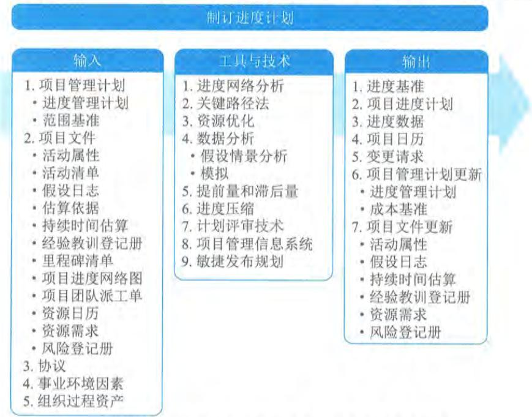  
图11-22 制订进度计划过程的输入、工具与技术和输出

制订可行的项目进度计划是一个反复进行的过程。基于获取的最佳信息，使用进度模型来确定各项目活动和里程碑的计划开始日期和计划完成日期。编制进度计划时，需要审查和修正持续时间估算、资源估算和进度储备，以制订项目进度计划，并在经批准后作为基准用于跟踪项目进度。制订进度计划包括以下4个关键步骤：

（1）定义项目里程碑、识别活动并排列活动顺序，以及估算活动持续时间，并确定活动的开始和完成日期；

（2）由分配至各个活动的项目人员审查其被分配的活动；

（3）项目人员确认开始和完成日期与资源日历和其他项目或任务没有冲突，从而确认计划日期的有效性；

（4）分析进度计划，确定是否存在逻辑关系冲突，以及在批准进度计划并将其作为基准之前是否需要资源平衡，并同步修订和维护项目进度模型，确保进度计划在整个项目期间一直切实可行。

制订进度计划过程的主要输入为项目管理计划和项目文件，主要工具与技术包括关键路径法、资源优化、进度压缩和计划评审技术，主要输出为进度基准、项目进度计划、进度数据和项目日历。

# 11.10.1 主要输入

# 1.项目管理计划

制订进度计划过程使用的项目管理计划组件主要包括进度管理计划和范围基准等。

（1）进度管理计划。进度管理计划规定了用于制订进度计划的进度计划编制方法和工具，以及推算进度计划的方法。

（2）范围基准。范围说明书、WBS和WBS字典包含了项目可交付成果的详细信息，供建进度模型时借鉴。

# 2.项目文件

可作为制订进度计划过程输入的项目文件主要包括活动属性、活动清单、假设日志、估算依据、持续时间估算、经验教训登记册、里程碑清单、项目进度网络图、项目团队派工单、资源日历、资源需求和风险登记册等。

（1）活动属性。活动属性提供了创建进度模型所需的细节信息。（2）活动清单。活动清单明确了需要在进度模型中包含的活动。（3）假设日志。假设日志所记录的假设条件和制约因素可能造成影响项目进度的单个项目风险。（4）估算依据。持续时间估算所需的支持信息的数和种类，因应用领域而异。不论其详细程度如何，支持性文件都应该清晰、完整地说明持续时间估算是如何得出的。（5）持续时间估算。持续时间估算包括对完成某项活动所需的工作时段数的定盟评估，用于进度计划的推算。（6）经验教训登记册。与创建进度模型有关的经验教训登记册可以运用到项目后期阶段，以提高进度模型的有效性。

(7) 里程碑清单。里程碑清单列出特定里程碑的实现日期。

(8) 项目进度网络图。项目进度网络图中包含用于推算进度计划的紧前和紧后活动的逻辑关系。

(9) 项目团队派工单。项目团队派工单明确了分配到每个活动的资源。

(10) 资源日历。资源日历规定了在项目期间的资源可用性。

(11) 资源需求。活动资源需求明确了活动所需的资源类型和数量, 用于创建进度模型。

(12) 风险登记册。风险登记册中记录所有已识别的会影响进度模型的风险的详细信息及特征。进度储备通过预期或平均风险影响程度, 反映了与进度有关的风险信息。

# 11.10.2 主要工具与技术

# 1. 关键路径法

关键路径法用于在进度模型中估算项目的最短工期, 确定逻辑网络路径的进度灵活性。关键路径法有如下 2 个规则:

(1) 某项活动的最早开始时间必须相同或晚于直接指向这项活动的最早结束时间中的最晚时间。

(2) 某项活动的最迟结束时间必须相同或早于该活动直接指向的所有活动的最迟开始时间的最早时间。

根据以上规则, 可以计算出工作的最早完工时间。通过正向计算 (从第一个活动到最后一个活动) 推算出最早完工时间, 步骤如下:

(1) 从网络图始端向终端计算;

(2) 第一个活动的开始时间为项目开始时间;

(3) 活动完成时间为开始时间加持续时间;

(4) 后续活动的开始时间根据前置活动的时间和搭接时间而定;

(5) 多个前置活动存在时, 根据最迟活动时间来定。

通过反向计算 (从最后一个活动到第一个活动) 推算出最晚开工和完工时间, 步骤如下:

(1) 从网络图终端向始端计算;

(2) 最后一个活动的完成时间为项目完成时间;

(3) 活动开始时间为完成时间减持续时间;

(4) 前置活动的完成时间根据后续活动的时间和搭接时间而定;

(5) 多个后续活动存在时, 根据最早活动时间来定。

关键路径法在不考虑任何资源限制的情况下, 按照以上步骤使用正向和反向推算, 计算出所有活动的最早开始、最早完成、最晚开始和最晚完成时间, 示例如图 11- 23 所示。在这个例子中, 最长的路径包括活动 A、B、F、G 和 H, 因此, 活动序列 A- B- F- G- H 就是关键路径, 关键路径是项目中时间最长的活动顺序, 决定着可能的项目最短工期。最长路径的总浮动时间通常为零。由此得到的最早和最晚的开始和完成时间并不一定就是项目进度计划, 而只是把既定的参数 (活动持续时间、逻辑关系、提前量、滞后量和其他已知的制约因素) 输入进度模型后所得到的一种结果, 表明活动可以在该时段内实施。关键路径法用来计算进度模型中的关键路径、总浮动时间和自由浮动时间。

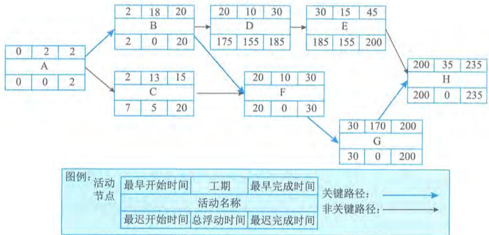  
图11-23 关键路径法示例

总浮动时间：在任一网络路径上，进度活动可以从最早开始时间推迟或拖延的时间，而不至于延误项目完成日期或违反进度制约因素，这个时间就是总浮动时间。总浮动时间的计算方法为：本活动的最迟完成时间减去本活动的最早完成时间，或本活动的最迟开始时间减去本活动的最早开始时间。

自由浮动时间：自由浮动时间就是指在不延误任何紧后活动最早开始时间或不违反进度制约因素的前提下，某进度活动可以推迟的时间量。其计算方法为：紧后活动最早开始时间的最小值减去本活动的最早完成时间。

例如，在图11- 23中，活动D的总浮动时间是155天，自由浮动时间是0天。

进度网络图可能有多条关键路径。为了使网络路径的总浮动时间为零或正值，可能需要调整活动持续时间（可增加资源或缩减范围时）、逻辑关系（针对选择性依赖关系时）、提前量和滞后量，或其他进度制约因素。

# 2.资源优化

资源优化是根据资源供需情况来调整进度模型的技术。资源优化用于调整活动的开始和完成日期，以调整计划使用的资源，使其等于或少于可用的资源。资源优化技术包括资源平衡和资源平滑。

# 1）资源平衡

为了在资源需求与资源供给之间取得平衡，根据资源制约因素对开始日期和完成日期进行调整的一种技术。如果共享资源或关键资源只在特定时间可用，数量有限，如一个资源在同一时段内被分配至两个或多个活动，就需要进行资源平衡。也可以为保持资源使用量处于均衡水平而进行资源平衡。资源平衡往往导致关键路径改变。可以用浮动时间平衡资源。因此，在项目进度计划期间，关键路径可能发生变化。

例如，在图11- 24中，如果活动B和C都只能由工程师小王完成，那么小王在第2天和第

3天需要完成B,而第2天同时还需要完成C,此时小王工作会超负荷,需要进行资源平衡,平衡后的工作安排如图11- 25所示。

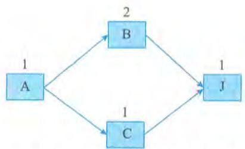  
图11-24 资源平衡示例（平衡前）

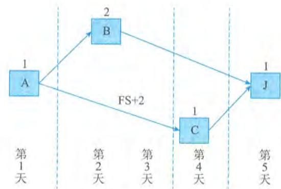  
图11-25 资源平衡示例（平衡后）

项目需要4天完成,做了资源平衡之后需要5天完成,所以资源平衡往往导致关键路径改变,而且通常是延长了关键路径。

# 2）资源平滑

对进度模型中的活动进行调整,从而使项目资源需求不超过预定的资源限制的一种技术。相对于资源平衡而言,资源平滑不会改变项目的关键路径,完工日期也不会延迟。也就是说,活动只在其自由和总浮动时间内延迟。但资源平滑技术可能无法实现所有资源的优化。

例如,在图11- 26中,如果活动B和D都需要小王完成,此时第2天,小王需要同时完成B和D,工作会超出负荷,由于关键路径为A- B- C- F,D不在关键路径上,可以有1天的总浮动时间,所以针对D可以利用资源平滑技术进行调整,调整后的工作安排如图11- 27所示。

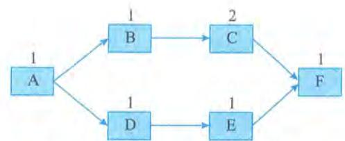  
图11-26 资源平滑示例（调整前）

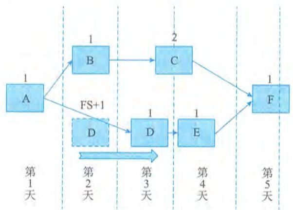  
图11-27 资源平滑示例（调整后）

由于D有1天的总浮动时间,我们可以通过滞后量,把D安排在第3天,避免了小王第2天资源负荷过大的问题,而且不影响整体工期。

# 3.进度压缩

进度压缩技术是指在不缩减项目范围的前提下,缩短或加快进度工期,以满足进度制约因素、强制日期或其他进度目标。进度压缩技术包括赶工和快速跟进。

(1)赶工。通过增加资源,以最小的成本代价来压缩进度工期的一种技术。赶工的例子包括批准加班、增加额外资源或支付加急费用,据此来加快关键路径上的活动。赶工只适用于那些通过增加资源就能缩短持续时间的,且位于关键路径上的活动。但赶工并非总是切实可行的,因为它可能导致风险和/或成本的增加。

(2)快速跟进。快速跟进是一种进度压缩技术,将正常情况下按顺序进行的活动或阶段改为至少部分并行开展。例如,在大楼的建筑图纸尚未全部完成前就开始建地基。快速跟进可能造成返工和风险增加,所以它只适用于能够通过并行活动来缩短关键路径上的项目工期的情况。若进度加快而使用提前量通常会增加相关活动之间的协调工作,并增加质量风险。快速跟进还有可能增加项目成本。

# 4.计划评审技术

计划评审技术(Program Evaluation and Review Technique,PERT),又称为三点估算技术,其理论基础是假设项目持续时间,以及整个项目完成时间是随机的,且服从某种概率分布。PERT可以估计整个项目在某个时间内完成的概率。PERT和CPM在项目进度规划中的应用非常广,下文通过实例来对此技术加以说明。

1)活动的时间估计

PERT对各项目活动的完成时间按照3种不同情况进行估计:

$\bullet$  乐观时间(OptimisticTime,  $T_{\mathrm{o}}$  ):任何事情都顺利的情况下,完成某项工作的时间;

$\bullet$  最可能时间(MostLikelyTime,  $T_{\mathrm{M}}$  ):正常情况下,完成某项工作的时间;

$\bullet$  悲观时间(PessimisticTime,  $T_{\mathrm{p}}$  ):最不利的情况下,完成某项工作的时间。

假定3个估计服从  $\beta$  分布,由此可算出每个活动的期望  $t_{i}$

$$
t_{i} = \frac{a_{i} + 4m_{i} + b_{i}}{6}
$$

其中:  $a_{i}$  表示第  $i$  项活动的乐观时间,  $m_{i}$  表示第  $i$  项活动的最可能时间,  $b_{i}$  表示第  $i$  项活动的悲观时间。

根据  $\beta$  分布的方差计算方法,第  $i$  项活动的持续时间方差为:

$$
\sigma_{i}^{2} = \frac{(b_{i} - a_{i})^{2}}{36}
$$

例如,某政府OA系统的建设可分解为需求分析、设计编码、测试、安装部署4个活动,各个活动顺次进行,没有时间上的重叠,活动的完成时间估计如图11- 28所示。

  
图11-28 OA系统工作分解和活动工期估计

各活动的期望工期、方差和标准差如下：

$$
\begin{array}{l l l l l l}{{t_{\mathbb{R}\times\mathbb{R}\times\mathbb{R}}=\frac{7+4\times11+15}{6}=11}}&{{\sigma^{2}_{\mathbb{R}\times\mathbb{R}\times\mathbb{R}}=\frac{(15-7)^{2}}{36}=1.778}}&{{\sigma_{\mathbb{R}\times\mathbb{R}\times\mathbb{R}}=\frac{15-7}{6}=1.333}}\\ {{t_{\mathbb{R}\times\mathbb{R}\times\mathbb{R}}=\frac{13+4\times20+35}{6}=21}}&{{\sigma^{2}_{\mathbb{R}\times\mathbb{R}\times\mathbb{R}}=\frac{(35-13)^{2}}{36}=13.445}}&{{\sigma_{\mathbb{R}\times\mathbb{R}\times\mathbb{R}}=\frac{35-13}{6}=3.667}}\\ {{t_{\mathbb{R}\times\mathbb{R}}=\frac{5+4\times7+9}{6}=7}}&{{\sigma^{2}_{\mathbb{R}\times\mathbb{R}}=\frac{(9-5)^{2}}{36}=0.445}}&{{\sigma_{\mathbb{R}\times\mathbb{R}}=\frac{9-5}{6}=0.667}}\\ {{t_{\mathbb{R}\times\mathbb{R}}=\frac{5+4\times13+15}{6}=12}}&{{\sigma^{2}_{\mathbb{R}\times\mathbb{R}}=\frac{(15-5)^{2}}{36}=2.778}}&{{\sigma_{\mathbb{R}\times\mathbb{R}}=\frac{15-5}{6}=1.667}}\end{array}
$$

2）项目周期估算

PERT认为整个项目的完成时间是各个活动完成时间之和，且服从正态分布。整个项目完成时间  $t$  的数学期望  $T$  和方差  $\sigma^{2}$  分别等于：

$$
T = 11 + 21 + 7 + 12 = 51
$$

$$
\sigma^{2} = 1.778 + 13.445 + 0.445 + 2.778 = 18.446
$$

标准差为：

$$
\sigma = \sqrt{\sigma^{2}} = \sqrt{18.446} = 4.3
$$

据此，可以得出正态分布曲线图，如图11- 29所示。

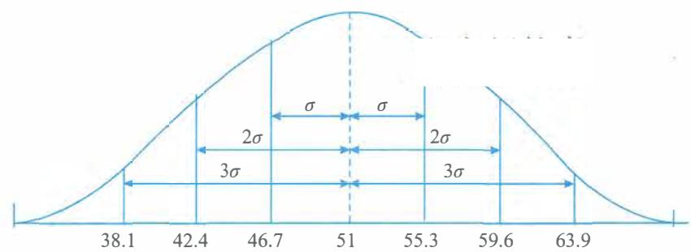  
图11-29 OA系统项目的工期正态分布

因为图11- 29是正态曲线，根据正态分布规律，在  $\pm \sigma$  范围内（即在46.7天与55.3天之间）完成的概率为  $68\%$  ；在  $\pm 2\sigma$  范围内（即在42.4天到59.6天之间）完成的概率为  $95\%$  ；在  $\pm 3\sigma$  范围内（即在38.1天到63.9天之间）完成的概率为  $99\%$  。如果客户要求在39天内完成，则可完成的概率约为  $0.5\%$  ，几乎为零，也就是说，项目有不可压缩的最小周期，这是客观规律。

通过查标准正态分布表，可得到整个项目在某一时间内完成的概率。例如，如果客户要求在60天内完成，那么可能完成的概率为：

$$
P(t\leqslant 60) = \Phi \left(\frac{60 - T}{\sigma}\right) = \Phi \left(\frac{60 - 51}{4.3}\right) = 0.9817
$$

如果客户要求再提前7天完成，则完成的概率为：

$$
P(t\leqslant 53) = \Phi \left(\frac{53 - T}{\sigma}\right) = \Phi \left(\frac{53 - 51}{4.3}\right) = 0.6808
$$

# 11.103 主要输出

# 1.进度基准

1. 进度基准进度基准是经过批准的进度模型，只有通过正式的变更控制程序才能进行变更，用作与实际结果进行比较的依据。经干系人接受和批准，进度基准包含基准开始日期和基准结束日期。在监控过程中，将用实际开始和完成日期与批准的基准日期进行比较，以确定是否存在偏差。进度基准是项目管理计划的组成部分。

# 2.项目进度计划

项目进度计划是进度模型的输出，为各个相互关联的活动标注了计划日期、持续时间、里程碑和所需资源等。项目进度计划中至少要包括每个活动的计划开始日期与计划完成日期。即使在早期阶段就进行了资源规划，但在未确认资源分配和计划开始与完成日期之前，项目进度计划都只是初步的。项目进度计划可以是概括的或详细的。虽然项目进度计划可以采用列表形式，但图形方式更直观，可以采用的图形方式包括横道图、里程碑图、项目季度网络图。

（1）横道图：也称为甘特图，是展示进度信息的一种图表方式。在横道图中，纵向列表示活动，横向列表示日期，用横条表示活动自开始日期至完成日期的持续时间。横道图相对易读，比较常用。

（2）里程碑图：与横道图类似，但仅标示出主要可交付成果和关键外部接口的计划开始或完成时间。加√心：858172646，送最新免费资料

（3）项目进度网络图：通常用活动节点法绘制，没有时间刻度，纯粹显示活动及其相互关系。项目进度网络图也可以是包含时间刻度的进度网络图，称为时标图，如图11-30所示。

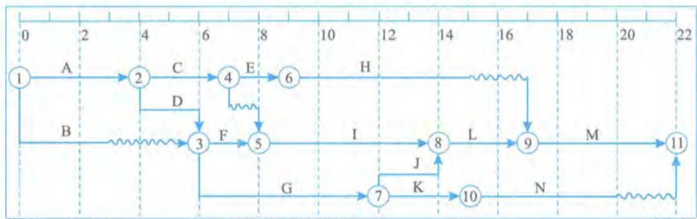  
图11-30 时标图示例

图11- 31给出了进度计划的3种形式，包括里程碑进度计划（即里程碑图）、概括性进度计划（即横道图）和详细进度计划（即项目进度网络图），以及这3种不同层次的进度计划之间的关系。

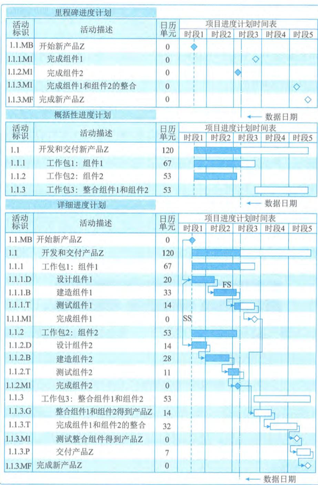  
图11-31 进度计划的3种形式及其关系示例

# 3.进度数据

项目进度模型中的进度数据是用以描述和控制进度计划的信息集合。进度数据至少包括进

度里程碑、进度活动、活动属性，以及已知的全部假设条件与制约因素，而所需的其他数据因应用领域的不同而不同。经常可用作支持细节的信息包括：

$\bullet$  按时段列出的资源需求，往往以资源直方图表示； $\bullet$  备选的进度计划，如最好情况或最坏情况下的进度计划、经资源平衡或未经资源平衡的进度计划、有强制日期或无强制日期的进度计划； $\bullet$  使用的进度储备等。

进度数据还可以包括资源直方图、现金流预测，以及订购与交付进度安排等其他相关信息。

# 4.项目日历

在项目日历中规定可以开展进度活动的可用工作日和工作班次，它把可用于开展进度活动的时间段（按天或更小的时间单位划分）与不可用的时间段区分开来。在一个进度模型中，可能需要采用不止一个项目日历来编制项目进度计划，因为有些活动需要不同的工作时段。因此，可能需要对项目日历进行更新。

# 11.11 规划成本管理

规划成本管理是确定如何估算、预算、管理、监督和控制项目成本的过程。本过程的主要作用是在整个项目期间为如何管理项目成本提供指南和方向。本过程仅开展一次或仅在项目的预定义点开展。图11- 32描述了本过程的输入、工具与技术和输出。

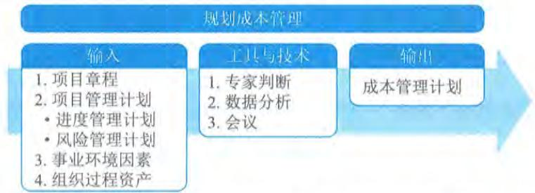  
图11-32 规划成本管理过程的输入、工具与技术和输出

应该在项目规划阶段的早期就对成本管理工作进行规划，建立各成本管理过程的基本框架，以确保各过程的有效性及各过程之间的协调性。成本管理计划是项目管理计划的组成部分，其过程及所用工具与技术应记录在成本管理计划中。

规划成本管理过程的主要输入为项目章程和项目管理计划，主要输出为成本管理计划。

# 11.11.1 主要输入

# 1.项目章程

项目章程中规定的总体里程碑进度计划会影响项目的进度管理。

# 2.项目管理计划

规划成本管理过程使用的项目管理计划组件主要包括进度管理计划、风险管理计划等。

(1) 进度管理计划。进度管理计划确定了编制、监督和控制项目进度的准则和活动, 同时也提供了影响成本估算和管理的过程及控制方法。

(2) 风险管理计划。风险管理计划提供了识别、分析和监督风险的方法, 同时也提供了影响成本估算和管理的过程及控制方法。

# 11.11.2 主要输出

成本管理计划是项目管理计划的组成部分, 描述将如何规划、安排和控制项目成本。成本管理过程及所用工具与技术应记录在成本管理计划中。

在成本管理计划中一般需要规定计量单位、精确度、准确度、组织程序链接、控制临界值、绩效测量规则、报告格式和其他细节等。

(1) 计量单位。需要规定每种资源的计量单位, 例如, 用于测量时间的人·时数、人·天数或周数, 用于计量数量的米、升、吨、千米或立方码, 或者用货币表示的总价。

(2) 精确度。根据活动范围和项目规模, 设定成本估算向上或向下取整的程度 (例如 995.59 元取整为 1000 元)。

(3) 准确度。为活动成本估算规定一个可接受的区间 (如  $\pm 10\%$ ), 其中可能包括一定数量的应急储备。

(4) 组织程序链接。工作分解结构为成本管理计划提供了框架, 以便据此规范地开展成本估算、预算和控制。在项目成本核算中使用的 WBS 组成部分称为控制账户 (CA), 每个控制账户都有唯一的编码或账号, 直接与执行组织的会计制度相联系。

(5) 控制临界值。需要规定偏差临界值, 用于监督成本绩效, 它是在需要采取某种措施前, 允许出现的最大差异, 通常用偏离基准计划的百分数来表示。

(6) 绩效测量规则。需要规定用于绩效测量的挣值管理 (EVM) 规则。例如, 成本管理计划应该:

- 定义 WBS 中用于绩效测量的控制账户;

- 确定拟用的 EVM 技术 (如加权里程碑法、固定公式法、完成百分比法等);

- 规定跟踪方法, 以及用于计算项目完工估算 (EAC) 的 EVM 公式, 该公式计算出的结果可用于验证通过自下而上方法得出的完工估算。

(7) 报告格式, 需要规定各种成本报告的格式和编制频率。

(8) 其他细节: 关于成本管理活动的其他细节。具体包括:

- 对战略筹资方案的说明;

- 处理汇率波动的程序;

- 记录项目成本的程序等。

# 11.12 估算成本

估算成本是对完成项目工作所需资金进行近似估算的过程。本过程的主要作用是确定项目所需的资金。本过程应根据需要在整个项目期间定期开展。图 11- 33 描述了本过程的输入、工具与技术和输出。

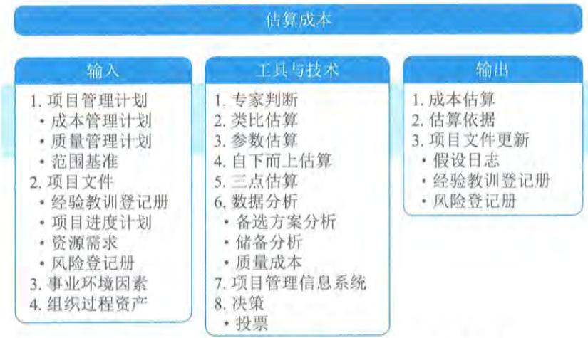  
图11-33 估算成本过程的输入、工具与技术和输出

成本估算是对完成活动所需资源的可能成本进行的量化评估,是在某特定时点根据已知信息所做出的成本预测。在估算成本时,需要识别和分析可用于启动与完成项目的备选成本方案,需要权衡备选成本方案并考虑风险,如比较自制成本与外购成本、购买成本与租赁成本及多种资源共享方案,以优化项目成本。

通常用某种货币单位进行成本估算,但有时也可采用其他计量单位,如人·时数或人·天数,以消除通货膨胀的影响,便于成本比较。

在项目过程中,应该随着更详细信息的呈现和假设条件的验证,对成本估算进行持续审查和优化。在项目生命周期中,项目估算的准确性亦将随着项目的进展而逐步提高。例如,在启动阶段可得出项目的粗略量级估算,其区间为  $- 25\% \sim +75\%$ ; 之后,随着信息越来越详细,确定性估算的区间可缩小至  $- 5\% \sim +10\%$ ,某些组织已经制定出相应的指南,规定何时进行优化,以及每次优化所要达到的置信度或准确度。

进行成本估算,应该考虑针对项目收费的全部资源,一般包括人工、材料、设备、服务、设施,以及一些特殊的成本种类,如通货膨胀补贴、融资成本或应急成本。成本估算可在活动层级呈现,也可以通过汇总形式呈现。

估算成本过程的主要输入为项目管理计划和项目文件,主要输出为成本估算和估算依据。

# 11.12.1 主要输入

# 1. 项目管理计划

估算成本过程使用的项目管理计划组件主要包括成本管理计划、质量管理计划和范围基准。

(1)成本管理计划。成本管理计划描述了可使用的估算方法以及成本估算需要达到的准确度和精确度。

(2)质量管理计划。质量管理计划描述了项目管理团队为实现一系列项目质量目标所需的活动和资源。

(3)范围基准。范围基准包括项目范围说明书、WBS和WBS字典:

- 项目范围说明书: 项目范围说明书反映了因项目资金支出的周期而产生的资金制约因素, 或其他财务假设条件和制约因素; 
- 工作分解结构 (WBS): WBS指明了项目全部可交付成果及其各组成部分之间的相互关系; 
- WBS字典: 在WBS字典和相关的详细工作说明书中列明了可交付成果, 并描述了为产出可交付成果, WBS各组成部分所需进行的工作。

# 2. 项目文件

可作为估算成本过程输入的项目文件包括经验教训登记册、项目进度计划、资源需求和风险登记册。

(1) 经验教训登记册。项目早期与制定成本估算有关的经验教训可以运用到项目后期阶段, 以提高成本估算的准确度和精确度。

(2) 项目进度计划。进度计划包括项目可用的团队和实物资源的类型、数量和可用时间长短。如果资源成本取决于使用时间的长短, 并且成本出现季节波动, 则持续时间估算会对成本估算产生影响。进度计划还为包含融资成本 (包括利息) 的项目提供有用的信息。

(3) 资源需求。资源需求明确了每个工作包或活动所需的资源类型和数量。

(4) 风险登记册。风险登记册包含了已识别的并按优先顺序排列的单个项目风险的详细信息, 以及针对这些风险采取的应对措施。风险登记册还提供了可用于估算成本的详细信息。

# 11.12.2 主要输出

# 1. 成本估算

成本估算包括完成项目工作可能需要的成本、应对已识别风险的应急储备。成本估算可以是汇总的或详细分列的。成本估算应覆盖项目所使用的全部资源, 包括直接人工、材料、设备、服务、设施、信息技术, 以及一些特殊的成本种类, 如融资成本 (包括利息)、通货膨胀补贴、汇率或成本应急储备。如果间接成本也包含在项目估算中, 则可在活动层次或更高层次上计列间接成本。成本估算示例如图 11- 34 所示。

  
图11-34 成本估算示例

# 2.估算依据

成本估算所需的支持信息的数量和种类因应用领域而异，不论其详细程度如何，支持性文件都应该清晰、完整地说明成本估算是如何得出的。

成本估算的支持信息可包括：

成本估算的支持信息可包括：- 关于估算依据的文件（如估算是如何编制的）；- 关于全部假设条件的文件；- 关于各种已知制约因素的文件；- 有关已识别的、在估算成本时应考虑的风险的文件；- 对估算区间的说明（如“10000元  $\pm 10\%$  ”就说明了预期成本的所在区间）；- 对最终估算的置信水平的说明等。

# 11.13 制定预算

11.13 制定预算制定预算是汇总所有单个活动或工作包的估算成本，建立一个经批准的成本基准的过程。本过程的主要作用是确定可据以监督和控制项目绩效的成本基准。本过程仅开展一次或仅在项目的预定义点开展。图11-35描述了本过程的输入、工具与技术和输出。

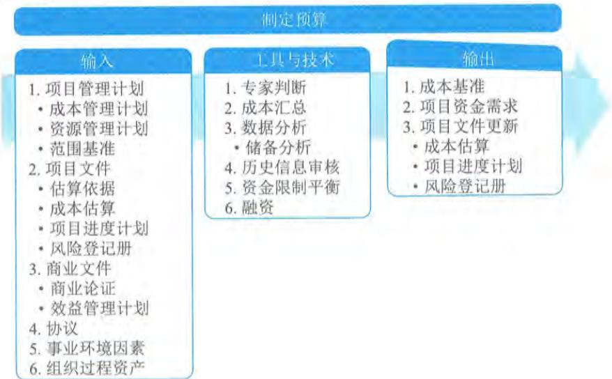  
图11-35 制定预算过程的输入、工具与技术和输出

制定预算过程的主要输入为项目管理计划和项目文件，主要输出为成本基准和项目资金需求。

# 11.13.1 主要输入

# 1.项目管理计划

11.13.1 主要输入1. 项目管理计划制定预算过程使用的项目管理计划组件主要包括成本管理计划、资源管理计划、范围基准。（1）成本管理计划。成本管理计划描述了如何将项目成本纳入项目预算中。

(2) 资源管理计划。资源管理计划提供了有关（人力和其他资源的）费率、差旅成本估算，和其他可预见的成本信息，这些信息是估算整个项目预算时必须考虑的因素。

(3) 范围基准。范围基准包括项目范围说明书、WBS和WBS字典的详细信息，可用于成本估算和管理。

# 2.项目文件

可作为制定预算过程输入的项目文件主要包括估算依据、成本估算、项目进度计划和风险登记册等。

(1) 估算依据。在估算依据中包括基本的假设条件，例如，项目预算中是否应该包含间接成本或其他成本。

(2) 成本估算。各工作包内每个活动的成本估算汇总后，即得到各工作包的成本估算。

(3) 项目进度计划。项目进度计划包括项目活动、里程碑、工作包和控制账户的计划开始和完成时间。可根据这些信息，把计划成本和实际成本汇总到相应日历时段。

(4) 风险登记册。应该审查风险登记册，以确定如何汇总风险应对成本。风险登记册的更新包含在项目文件更新中，

# 11.132 主要输出

# 1.成本基准

成本基准是经过批准的、按时间段分配的项目预算，不包括任何管理储备，只有通过正式的变更控制程序才能变更，用作与实际结果进行比较的依据，成本基准是不同进度活动经批准的预算的总和。

项目预算和成本基准的各个组成部分如图11- 36所示。先汇总各项目活动的成本估算及其应急储备，得到相关工作包的成本；然后汇总各工作包的成本估算及其应急储备，得到控制账户的成本；接着再汇总各控制账户的成本，得到成本基准；最后，在成本基准之上增加管理储备，得到项目预算。当出现有必要动用管理储备的变更时，则应该在获得变更控制过程的批准之后，把适量的管理储备移入成本基准中。

由于成本基准中的成本估算与进度活动直接关联，因此可按时间段分配成本基准，得到一条S曲线，如图11- 37所示。对于使用挣值管理的项目，成本基准指的是绩效测量基准。

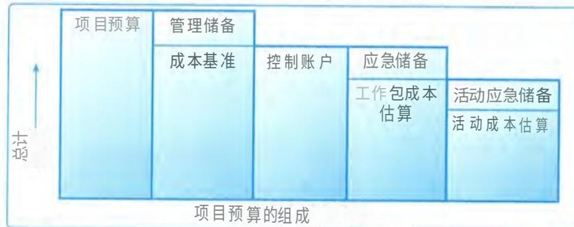  
图11-36 项目预算的组成

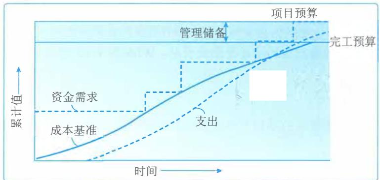  
图11-37 成本基准、支出与资金需求

# 2.项目资金需求

2. 项目资金需求根据成本基准，确定总资金需求和阶段性（如季度或年度）资金需求。成本基准中包括预计支出及预计债务。项目资金通常以增量的方式投入，并且可能是非均衡的，呈现出如图11-37所示的阶梯状。如果有管理储备，则总资金需求等于成本基准加管理储备。在资金需求文件中，也可说明资金来源。

# 11.14 规划质量管理

11.14 规划质量管理规划质量管理是识别项目及其可交付成果的质量要求和（或）标准，并书面描述项目将如何证明符合质量要求和（或）标准的过程。本过程的主要作用是在整个项目期间为如何管理和核实质量提供指南和方向。本过程仅开展一次或仅在项目的预定义点开展。图11-38描述了本过程的输入、工具与技术和输出。

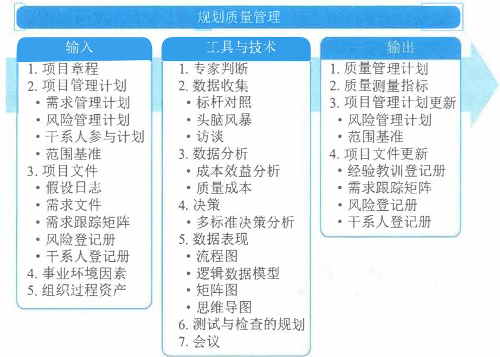  
图11-38 规划质量管理过程的输入、工具与技术和输出

质量规划应与其他知识领域规划过程并行开展。例如,为满足既定的质量标准而对可交付成果提出变更,可能需要调整成本或进度计划,并就该变更对相关计划的影响进行详细风险分析。

规划质量管理过程的主要输入为项目管理计划和项目文件,主要工具与技术包括数据收集、数据分析、决策技术、数据表现、测试与检查的规划,主要输出为质量管理计划和质量测量指标。

# 11.14.1 主要输入

# 1.项目管理计划

规划质量管理过程使用的项目管理计划组件主要包括需求管理计划、风险管理计划、干系人参与计划和范围基准等。

(1)需求管理计划。需求管理计划提供了识别、分析和管理需求的方法,以供质量管理计划和质量测量指标借鉴。

(2)风险管理计划。风险管理计划提供了识别、分析和监督风险的方法。将风险管理计划和质量管理计划的信息相结合,有助于成功交付产品和项目。

(3)干系人参与计划。干系人参与计划提供了记录干系人需求和期望的方法,为质量管理奠定了基础。

(4)范围基准。在确定适用于项目的质量标准和目标时,以及在确定要求质量审查的项目可交付成果和过程时,需要考虑WBS和项目范围说明书中记录的可交付成果。范围说明书包含可交付成果的验收标准,用以界定可能导致质量成本变化并进而导致项目成本的显著升高或降低,满足所有验收标准意味着满足干系人的需求。

# 2.项目文件

可作为规划质量管理过程输入的项目文件主要包括假设日志、需求文件、需求跟踪矩阵、风险登记册和干系人登记册等。

(1)假设日志。记录与质量要求和标准合规相关的全部假设条件和制约因素。

(2)需求文件。记录项目和产品为满足干系人的期望应达到的要求,它包括针对项目和产品的质量要求,这些需求有助于项目团队规划将如何实施项目质量控制。

(3)需求跟踪矩阵。需求跟踪矩阵将产品需求连接到可交付成果,有助于确保需求文件中的各项需求都得到测试。矩阵提供了核实需求时所需测试的概述。

(4)风险登记册。风险登记册包含可能影响质量要求的各种威胁和机会的信息。

(5)干系人登记册。干系人登记册有助于识别对质量有特别兴趣或影响的干系人,尤其注重客户和项目发起人的需求和期望。

# 11.14.2 主要工具与技术

# 1.数据收集

适用于规划质量管理过程的数据收集技术包括标杆对照、头脑风暴和访谈等。

（1）标杆对照。标杆对照是将实际或计划的项目实践或项目的质量标准与可比项目的实践进行比较，以便识别最佳实践，形成改进意见，并为绩效考核提供依据。作为标杆的项目可以来自执行组织内部或外部，或者来自同一应用领域或其他应用领域。标杆对照也允许用不同应用领域或行业的项目做类比。

（2）头脑风暴。通过头脑风暴可以向团队成员或主题专家收集数据，以制订最适合新项目的质量管理计划。

（3）访谈。访谈有经验的项目参与者、干系人和主题专家有助于了解他们对项目和产品质量的隐性和显性、正式和非正式的需求和期望。应在信任和保密的环境下开展访谈，以获得真实可信、不带偏见的反馈。

# 2.数据分析

适用于规划质量管理过程的数据分析技术包括成本效益分析和质量成本等。

（1）成本效益分析。成本效益分析是用来估算备选方案优势和劣势的财务分析工具，以确定可以创造最佳效益的备选方案。成本效益分析可帮助项目经理确定规划的质量活动是否有效利用了成本。达到质量要求的主要效益包括减少返工、提高生产率、降低成本、提升干系人满意度及提升盈利能力。对每个质量活动进行成本效益分析，就是要比较其可能成本与预期效益。

（2）质量成本。与项目有关的质量成本（COQ）包含以下一种或多种成本（图11-39提供了各组成本的例子）：

- 预防成本：预防特定项目的产品、可交付成果或服务质量低劣所带来的成本；- 评估成本：评估、测量、审计和测试特定项目的产品、可交付成果或服务所带来的成本；- 失败成本（内部/外部）：因产品、可交付成果或服务与干系人需求或期望不一致而导致的成本。最优COQ能够在预防成本和评估成本之间找到恰当的投资平衡点，用于规避失败成本。

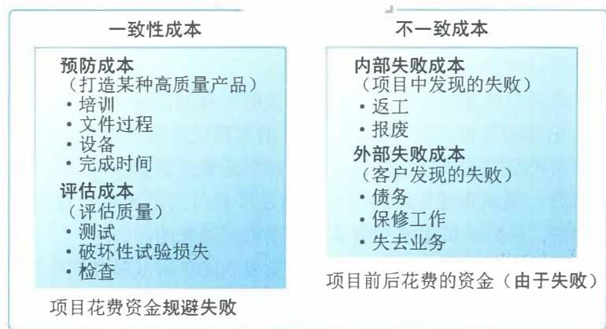  
图11-39 质量成本示例

# 3.决策技术

多标准决策分析是适用于规划质量管理过程的一种决策技术，多标准决策分析工具（如优先矩阵）可用于识别关键事项和合适的备选方案，并通过一系列决策排列出备选方案的优先顺

序。先对标准排序和加权，再应用于所有备选方案，计算出各个备选方案的数学得分，然后根据得分对备选方案排序。在本过程中，它有助于排定质量测量指标的优先顺序。

# 4. 数据表现

适用于规划质量管理过程的数据表现技术包括流程图、逻辑数据模型、矩阵图和思维导图等。

（1）流程图。流程图也称过程图，用来显示在一个或多个输入转化成一个或多个输出的过程中，所需的步骤顺序和可能分支。它通过映射水平价值链的过程细节来显示活动、决策点、分支循环、并行路径及整体处理顺序。图11-40展示了其中一个版本的价值链，即SIPOC（供应商、输入、过程、输出和客户）模型。流程图有助于了解和估算一个过程的质量成本，通过工作流的逻辑分支及其相对频率来估算质量成本，这些逻辑分支细分为完成符合要求的输出而需要开展的一致性工作和非一致性工作。用于展示过程步骤时，流程图有时又被称为“过程流程图”或“过程流向图”，可帮助改进过程并识别可能出现质量缺陷或可以纳入质量检查的地方。

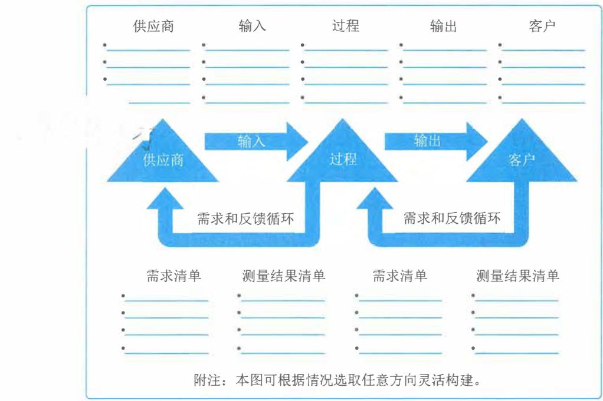  
图11-40 SIPOC模型

（2）逻辑数据模型。逻辑数据模型把组织数据可视化，用业务语言加以描述，不依赖任何特定技术。逻辑数据模型可用于识别会出现数据完整性或其他问题的地方。

（3）矩阵图。矩阵图在行列交叉的位置展示因素、原因和目标之间的关系强弱。根据可用来比较因素的数量，项目经理可使用不同形状的矩阵图，如L型、T型、Y型、X型、C型和屋顶型矩阵。在规划质量管理过程中，矩阵图有助于识别对项目成功至关重要的质量测量指标。

（4）思维导图。思维导图是一种用于可视化组织信息的绘图法。质量思维导图通常是基于

单个质量概念创建的,是绘制在空白页面中央的图像,之后再增加以图像、词汇或词条形式表现的想法。思维导图技术有助于快速收集项目质量要求、制约因素、依赖关系和联系。

# 5. 测试与检查的规划

在规划阶段,项目经理和项目团队决定如何测试或检查产品、可交付成果或服务,以满足干系人的需求和期望,以及如何满足产品的绩效和可靠性目标。不同行业有不同的测试与检查,可能包括软件项目的  $\alpha$  测试和  $\beta$  测试、建筑项目的强度测试、制造和实地测试的检查,以及工程的无损伤测试。

# 11.14.3 主要输出

# 1. 质量管理计划

质量管理计划是项目管理计划的组成部分,描述如何实施适用的政策、程序和指南以实现质量目标。它描述了项目管理团队为实现一系列项目质量目标所需的活动和资源。质量管理计划可以是正式或非正式的,非常详细或高度概括的,其风格与详细程度取决于项目的具体需要。应该在项目早期就对质量管理计划进行评审,以确保决策是基于准确信息的。这样做的好处是,更加关注项目的价值定位,降低因返工而造成的成本超支金额和进度延误次数。

质量管理计划的内容一般包括:

- 项目采用的质量标准;

- 项目的质量目标;

- 质量角色与职责;

- 需要质量审查的项目可交付成果和过程;

- 为项目规划的质量控制和质量管理活动;

- 项目使用的质量工具;

- 与项目有关的主要程序,例如处理不符合要求的情况、纠正措施程序,以及持续改进程序等。

下面列举一个质量管理计划的示例。

# 1. 概述

介绍项目背景及本文件的作用。

2. 角色和职责

<table><tr><td>角色</td><td>姓名</td><td>职责</td></tr><tr><td>质量保证工程师</td><td>张三</td><td>● 制订项目的软件质量管理工作计划
● 实施质量保证活动
● 汇报项目开发过程问题
● 在有需要时，定期与客户的质量人员一起审核质量保证活动的执行情况和效果
● 向项目相关人员定期报告质量保证活动的状态和结果</td></tr></table>

（续表）

<table><tr><td>角色</td><td>姓名</td><td>职责</td></tr><tr><td>项目经理</td><td>李四</td><td>●在项目计划中定义对工作产品的评审活动，按计划组织人员进行评审工作，监督评审发现的问题得到及时纠正
●协助质量保证工程师制订质量管理计划，并支持该计划的执行
●定期以及在事件驱动下，检查质量活动的状态和效果</td></tr></table>

# 3.评价标准

3. 评价标准本项目的管理需要遵循组织的过程体系规范，包括ISO9000，以及CMMI3过程评价体系。在项目实施过程中，模板的使用应符合公司和客户提出的要求。

# 4.质量目标

本项目的质量目标是：客户满意度大于  $95\%$

# 5.质量保证活动

# 5.1 制订质量管理计划

5.1 制订质量管理计划在计划中对项目定义的过程和产品及质量检查活动（如评审等）列出详细的检查时间、检查依据、检查频率；对问题处理机制和质量分析汇报机制，根据组织级过程定义做出详细的约定。

# 5.2 评价过程和产品质量

5.2 评价过程和产品质量在项目进行过程中，质量保证工程师依据质量管理计划对项目过程和输出的产品的符合性与规范性做检查。

# 5.2.1 对过程的检查

<table><tr><td>阶段名称</td><td>过程/活动名称</td><td>评审标准/采用的检查单</td><td>评审时间/频率</td><td>计划工作量/人·时</td><td>备注</td></tr><tr><td>需求分析</td><td>需求分析项目策划</td><td>需求过程检查单</td><td>一次</td><td>4</td><td>需求分析基线发布后一周内</td></tr><tr><td>设计</td><td>软件设计</td><td>设计过程检查单</td><td>一次</td><td>6</td><td>设计基线发布后一周内</td></tr><tr><td>开发</td><td>编码实现</td><td>编码过程检查单</td><td>一次</td><td>4</td><td>代码基线发布后一周内</td></tr><tr><td>测试及部署</td><td>产品测试</td><td>测试过程检查单</td><td>一次</td><td>4</td><td>产品验收后一周内</td></tr><tr><td>各阶段</td><td>项目的跟踪和监控</td><td>项目监控过程检查单</td><td>每次工程活动检查的同时</td><td>10</td><td>每次执行工程过程评审时同时执行此项评审</td></tr><tr><td>各阶段</td><td>配置管理</td><td>配置管理过程检查单</td><td>每次工程活动检查的同时</td><td>10</td><td>配置管理计划发布后一周内执行，且还需在定义的各基线发布后一周内执行</td></tr></table>

# 5.2.2 对产品的审计

<table><tr><td>阶段名称</td><td>工作产品</td><td>评审标准/采用的检查单</td><td>评审时间/频率</td><td>计划工作量/人·时</td></tr><tr><td>需求分析</td><td>《需求说明书》</td><td>组织标准工作产品检查单</td><td>工作产品完成后3天内</td><td>4</td></tr><tr><td>设计</td><td>《概要设计说明书》
《详细设计说明书》
《数据库设计说明书》
《测试方案》</td><td>组织标准工作产品检查单</td><td>工作产品完成后3天内</td><td>10</td></tr><tr><td>开发</td><td>《测试用例》</td><td>组织标准工作产品检查单</td><td>工作产品完成后3天内</td><td>4</td></tr><tr><td>测试及部署</td><td>《测试报告》
《安装部署手册》
《用户手册》</td><td>组织标准工作产品检查单</td><td>工作产品完成后3天内</td><td>6</td></tr><tr><td>试运行</td><td>《试运行报告》</td><td>组织标准工作产品检查单</td><td>工作产品完成后3天内</td><td>2</td></tr></table>

# 5.3 监督及跟踪解决不符合项问题

一般而言,项目执行的不符合项要优先报告给直接责任人和项目经理,尽可能地在项目组内部解决不符合项问题。对于影响重大的问题,质量保证工程师在报告项目经理的同时,也可以抄送给高层经理,以便尽早解决问题,降低项目风险。对于项目组不能解决的问题,由质量保证工程师直接报告给高层经理,并告知质量主管和项目经理,直至问题落实。

# 5.4 质量分析与汇报

在评价过程或工作产品(和服务)后,质量保证工程师需要在当天提交评价的发现和结论给相关活动/工作产品的负责人。质量保证工程师定期编制《工作日志》,提交给项目经理、高层经理。质量保证工程师需要根据事件驱动或在每月20日对项目的阶段质量活动情况进行总结,生成《质量分析报告》,提交给项目经理、高层经理。需要时,质量保证工程师和高层经理进行面对面的工作汇报。定期与客户/客户代表的质量人员一起审核质量保证活动的执行情况和效果。

# 6.测试

项目在编码工作完成后分别需要进行单元测试、集成测试和系统测试。测试人员在项目初期就介入,以便及早和详细地了解需求,从而提高测试效果。在测试过程中发现的缺陷必须及时修复,然后重新测试。只有当软件产品的缺陷情况达到公司和项目组确定的质量准则要求时,才能通过测试,并且在系统测试完成后需要提交用户进行验收测试。

软件产品具体测试内容参见相应的测试计划。

# 7.工具和技术

质量保证不符合项问题和测试缺陷管理工具采用MANTIS。

# 2.质量测量指标

2. 质量测量指标质量测量指标专用于描述项目或产品属性,以及控制质量过程将如何验证符合程度。质量测量指标的例子包括按时完成的任务的百分比、以CPI测量的成本绩效、故障率、识别的日缺陷数量、每月总停机时间、每个代码行的错误、客户满意度分数,以及测试计划所涵盖的需求的百分比(即测试覆盖度)。质量测量指标示例如表11-1所示。

表11-1 质量测量指标示例  

<table><tr><td>指 标 分 类</td><td>指 标</td><td>目 标</td><td>单 位</td></tr><tr><td>交付质量</td><td>交付质量</td><td>≤ 0.96</td><td>缺陷数/千行代码</td></tr><tr><td>成本</td><td>工作量偏差</td><td>≤ 12</td><td>%</td></tr><tr><td>生产率</td><td>生产率</td><td>≥ 35</td><td>代码行/人·天</td></tr><tr><td>客户满意度</td><td>客户满意度</td><td>≥ 96</td><td>%</td></tr></table>

# 11.15 规划资源管理

11.15 规划资源管理规划资源管理是定义如何估算、获取、建设、管理和控制实物以及团队资源的过程。本过程的主要作用是根据项目类型和复杂程度确定适用于项目资源的管理方法和管理程度。本过程仅开展一次或仅在项目的预定义点开展。图11-41描述了本过程的输入、工具与技术和输出。

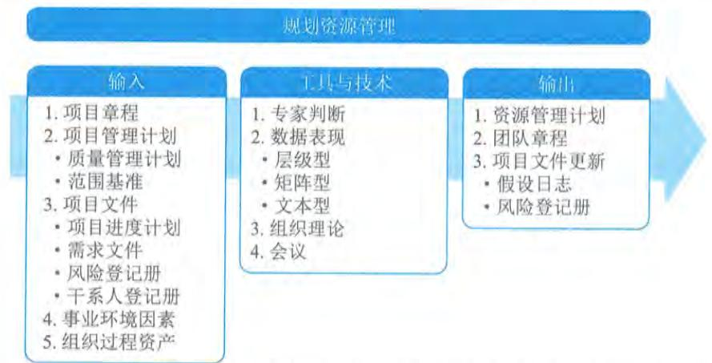  
图11-41 规划资源管理过程的输入、工具与技术和输出

资源规划用于识别和确定一种方法,以确保有足够的资源能够成功完成项目。项目资源可能包括团队成员、用品、材料、设备、服务和设施。有效的资源规划还需要考虑稀缺资源的可用性和竞争方面的问题,并编制相应的计划。

这些资源可以从组织内部资产获得,或者通过采购过程从组织外部获取。其他项目可能会在同一时间和地点竞争项目所需的相同资源,从而对项目成本、进度、风险、质量和其他项目领域造成显著影响。

规划资源管理过程的主要输入为项目管理计划和项目文件, 主要工具与技术为数据表现, 主要输出为资源管理计划和团队章程。

# 11.15.1 主要输入

# 1. 项目管理计划

规划资源管理过程使用的项目管理计划组件主要包括质量管理计划和范围基准等。

(1) 质量管理计划。质量管理计划有助于定义项目所需的资源水平, 以实现和维护已定义的质量水平并达到项目测量指标。

(2) 范围基准。范围基准识别了可交付成果, 决定了需要管理资源的类型和数量。

# 2. 项目文件

可作为规划资源管理过程输入的项目文件主要包括项目进度计划、需求文件、风险登记册、干系人登记册等。

(1) 项目进度计划。项目进度计划提供了所需资源的时间轴。

(2) 需求文件。需求文件指出了项目所需的资源的类型和数量, 并可能影响管理资源的方式。

(3) 风险登记册。风险登记册包含可能影响资源规划的各种威胁和机会的信息。

(4) 干系人登记册。干系人登记册有助于识别对项目所需资源有特别兴趣或影响的那些干系人, 以及会影响资源使用偏好的干系人。

# 11.15.2 主要工具与技术

数据表现有多种格式来记录和阐明团队成员的角色与职责, 大多数格式属于层级型、矩阵型或文本型。有些项目人员安排可以在子计划 (如风险、质量或沟通管理计划) 中列出, 无论使用什么方法来记录团队成员的角色, 目的都是确保每个工作包都有明确的责任人, 确保全体团队成员都清楚地理解其角色和职责。一般来说, 层级型可用于表示高层级角色, 而文本型则更适合用于记录详细职责。

# 1. 层级型

可以采用传统的组织结构图, 自上而下地显示各种职位及其相互关系。

- 工作分解结构 (WBS): WBS 用来显示如何把项目可交付成果分解为工作包, 有助于明确高层级的职责;

- 组织分解结构 (OBS): WBS 显示项目可交付成果的分解, 而 OBS 则按照组织现有的部门、单元或团队排列, 并在每个部门下列出项目活动或工作包, 运营部门只需要找到其所在的 OBS 位置, 就能看到自己的全部项目职责;

- 资源分解结构: 资源分解结构是按资源类别和类型, 对团队和实物资源的层级列表, 用于规划、管理和控制项目工作, 每向下一个层次都代表对资源的更详细描述, 直到信息细到可以与工作分解结构 (WBS) 相结合, 用来规划和监控项目工作。

# 2.矩阵型

2. 矩阵型矩阵型展示项目资源在各个工作包中的任务分配。矩阵型图表的一个例子是职责分配矩阵（RAM），它显示了分配给每个工作包的项目资源，用于说明工作包或活动与项目团队成员之间的关系。在大型项目中，可以制定多个层次的RAM，例如，高层次的RAM可定义项目团队、小组或部门负责WBS中的哪部分工作，而低层次的RAM则可在各小组内为具体活动分配角色、职责和职权。矩阵图能反映与每个人相关的所有活动，以及与每项活动相关的所有人员，它也可确保任何一项任务都只有一个人负责，从而避免职权不清。RAM的一个例子是RACI（执行、负责、咨询和知情）矩阵，如图11-42所示。图中最左边的一列表示待完成的工作（活动），分配给每项工作的资源可以是个人或小组，项目经理也可根据项目需要，选择“领导”或“资源”等适用词汇来分配项目责任。如果团队由内部和外部人员组成，RACI矩阵对明确划分角色和职责特别有用。

<table><tr><td>RACI 矩阵</td><td colspan="5">人员</td></tr><tr><td>活动</td><td>张美丽</td><td>李致远</td><td>王智慧</td><td>赵先修</td><td>刘工</td></tr><tr><td>创建章程</td><td>A</td><td>R</td><td>I</td><td>I</td><td>I</td></tr><tr><td>收集需求</td><td>I</td><td>A</td><td>R</td><td>C</td><td>C</td></tr><tr><td>提交变更请求</td><td>I</td><td>A</td><td>R</td><td>R</td><td>C</td></tr><tr><td>制订测试计划</td><td>A</td><td>C</td><td>I</td><td>I</td><td>R</td></tr></table>

注：R执行；A负责；C咨询；I知情。

# 图11-42 RACI矩阵示例

# 3.文本型

3. 文本型如果需要详细描述团队成员的职责，就可以采用文本型，文本型文件通常以概述的形式，提供诸如职责、职权、能力和资格等方面的信息，这种文件有多种名称，如职位描述、角色一职责一职权表，该文件可作为未来项目的模板，特别是在根据当前项目的经验教训对其内容进行更新之后。

# 11.15.3 主要输出

# 1.资源管理计划

作为项目管理计划的一部分，资源管理计划提供了关于如何分类、分配、管理和释放项目资源的指南。资源管理计划可以根据项目的具体情况分为团队管理计划和实物资源管理计划。资源管理计划的内容主要包括：识别资源、获取资源、角色与职责、项目组织图、项目团队资源管理、培训、团队建设、资源控制和认可计划等。

（1）识别资源。用于识别和量化项目所需的团队和实物资源的方法。（2）获取资源。关于如何获取项目所需的团队和实物资源的指南。（3）角色与职责。具体包括：  $①$  角色：在项目中，某人承担的职务或分配给某人的职务，

如土木工程师、商业分析师和测试协调员。 $②$  职权:使用项目资源、作出决策、签字批准、验收可交付成果并影响他人开展项目工作的权力。例如,下列事项都需要由具有明确职权的人来做决策:选择活动的实施方法,质量验收标准,以及如何应对项目偏差等。当个人的职权水平与职责相匹配时,团队成员就能最好地开展工作。 $③$  职责:为完成项目活动,项目团队成员必须履行的职责和工作。 $④$  能力:为完成项目活动,项目团队成员需具备的技能和才干。如果项目团队成员不具备所需的能力,就不能有效地履行职责。一旦发现成员能力与职责不匹配,就应主动采取措施,如安排培训、招募新成员、调整进度计划或工作范围。

(4)项目组织图。项目组织图以图形方式展示项目团队成员及其报告关系。基于项目的需要,项目组织图可以是正式或非正式的,非常详细或高度概括的。例如,一个3000人的灾害应急团队的项目组织图,要比仅有20人的内部项目的组织图详尽得多。

(5)项目团队资源管理。关于如何定义、配备、管理和最终遣散项目团队资源的指南。

(6)培训。针对项目成员的培训策略。

(7)团队建设。建设项目团队的方法。

(8)资源控制。依据需要确保实物资源充足可用,并为项目需求优化实物资源采购而采用的方法,包括有关整个项目生命周期内的库存、设备和用品管理的信息。

(9)认可计划。将给予团队成员哪些认可和奖励,以及何时给予。

# 2.团队章程

团队章程是为团队创建团队价值观、共识和工作指南的文件。团队章程包括:

$\bullet$  团队价值观;

$\bullet$  沟通指南;

$\bullet$  决策标准和过程;

$\bullet$  冲突处理过程;

$\bullet$  会议指南;

$\bullet$  团队共识。

团队章程对项目团队成员的可接受行为确定了明确的期望,尽早认可并遵守明确的规则,有助于减少误解,提高生产力;讨论诸如行为规范、沟通、决策、会议礼仪等领域,团队成员可以了解彼此重要的价值观。由团队制定或参与制定的团队章程可发挥最佳效果,所有项目团队成员都分担责任,确保遵守团队章程中规定的规则,可定期审查和更新团队章程,确保团队始终了解团队基本规则,并指导新成员融入团队。

# 11.16 估算活动资源

估算活动资源是估算执行项目所需的团队资源、设施、设备、材料、用品和其他资源的类型和数量的过程。本过程的主要作用是明确完成项目所需的资源种类、数量和特性。本过程应根据需要在整个项目期间定期开展。图11- 43描述了本过程的输入、工具与技术和输出。

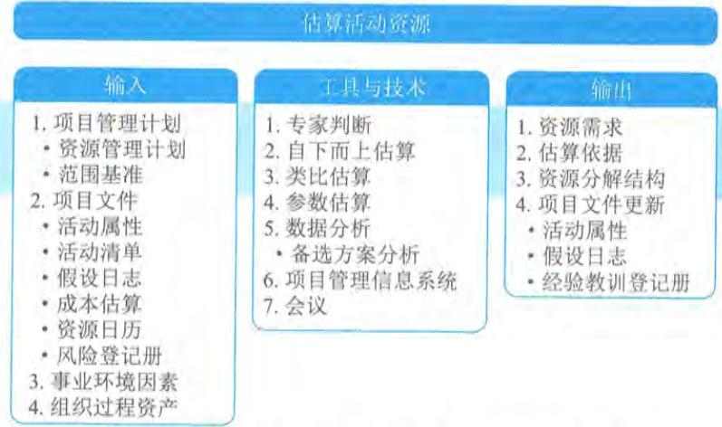  
图11-43 估算活动资源过程的输入、工具与技术和输出

估算活动资源过程与其他过程紧密相关(如估算成本过程)。例如,设计团队需要熟悉最新的系统设计技术,这些必要的知识可以通过聘请顾问、派设计人员参加技术研讨会等方式来获取。

估算活动资源过程的主要输入为项目管理计划和项目文件,主要输出为资源需求、估算依据和资源分解结构。

# 11.16.1 主要输入

# 1.项目管理计划

估算活动资源过程使用的项目管理计划组件主要包括资源管理计划、范围基准。

(1)资源管理计划。资源管理计划定义了识别项目所需不同资源的方法,还定义了量化各个活动所需的资源以及整合这些信息的方法。

(2)范围基准。范围基准识别了实现项目目标所需的项目和产品范围,而范围决定了对团队和实物资源的需求。

# 2.项目文件

可作为估算活动资源过程输入的项目文件主要包括活动属性、活动清单、假设日志、成本估算、资源日历、风险登记册等。

(1)活动属性。活动属性为估算活动清单中每项活动所需的团队和实物资源提供了数据来源,包括资源需求、强制日期、活动地点、假设条件和制约因素。

(2)活动清单。活动清单识别了需要资源的活动。

(3)假设日志。假设日志可能包含有关生产力因素、可用性、成本估算以及工作方法的信息,这些因素会影响团队和实物资源的性质和数量。

(4)成本估算。资源成本从数量和技能水平方面会影响资源选择。

(5)资源日历。资源日历识别了每种具体资源可用时的工作日、班次、正常营业的上下班时间、周末和公共假期。在规划活动期间,潜在的可用资源信息(如团队资源、设备和材料)

用于估算资源可用性。资源日历还规定了在项目期间确定的团队和实物资源何时可用、可用多久。这些信息可以在活动或项目层面建立,这考虑了诸如资源经验和/或技能水平以及不同地理位置等属性。

(6) 风险登记册。风险登记册描述了可能影响资源选择和可用性的各个风险。

# 11.16.2 主要输出

# 1.资源需求

资源需求识别了各个工作包或工作包中每个活动所需的资源类型和数量,可以汇总这些需求,以估算每个工作包、每个WBS分支以及整个项目所需的资源。资源需求描述的细节数量与具体程度因应用领域而异,而资源需求文件也可包含为确定所用资源的类型、可用性和所需数量所做的假设。

# 2.资源分解结构

资源分解结构是资源依类别和类型的层级展现,如图11- 44所示。资源类别包括(但不限于)人力、材料、设备和用品,资源类型则包括技能水平、要求证书、等级水平或适用于项目的其他类型。在估算活动资源过程中,资源分解结构用于指导项目的分类活动。在这一过程中,资源分解结构是一份完整的文件,用于获取和监督资源。

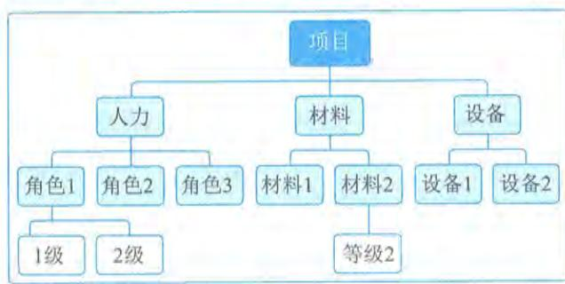  
图11-44 资源分解结构示例

# 3.估算依据

资源估算所需的支持信息的数量和种类因应用领域而异。但不论其详细程度如何,支持性文件都应该清晰、完整地说明资源估算是如何得出的。

资源估算的支持信息包括:估算方法;用于估算的资源,如以往类似项目的信息;与估算有关的假设条件;已知的制约因素;估算范围;估算的置信水平;有关影响估算的已识别风险的文件等。

# 11.17 规划沟通管理

规划沟通管理是基于每个干系人或干系人群体的信息需求、可用的组织资产,以及具体项

目的需求, 为项目沟通活动制订恰当的方法和计划的过程。本过程的主要作用是为及时向干系人提供相关信息、引导干系人有效参与项目而编制书面沟通计划。本过程应根据需要在整个项目期间定期开展。图 11- 45 描述了本过程的输入、工具与技术和输出。

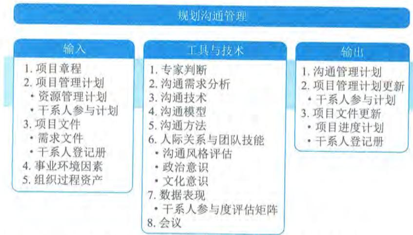  
图11-45 规划沟通管理过程的输入、工具与技术和输出

项目经理需在项目生命周期的早期, 针对项目干系人多样性的信息需求, 制订有效的沟通管理计划。应该在整个项目期间, 定期审查本过程的成果并做必要修改, 以确保其持续适用。例如, 在干系人发生变化或每个新项目阶段开始时。

在大多数项目中, 需要及早开展沟通的规划工作, 例如在识别干系人及制订项目管理计划期间。虽然所有项目都需要进行信息沟通, 但是各项目的信息需求和信息发布方式可能差别很大。此外, 在本过程中, 需要考虑并合理记录用来存储、检索和最终处置项目信息的方法。

规划沟通管理过程的主要输入为项目管理计划和项目文件, 主要工具与技术为沟通模型和沟通方法, 主要输出为沟通管理计划。

# 11.17.1 主要输入

# 1. 项目管理计划

规划沟通管理过程使用的项目管理计划组件主要包括资源管理计划和干系人参与计划。

(1) 资源管理计划。资源管理计划指导如何对项目资源进行分类、分配、管理和释放。团队成员和小组可能有沟通要求, 应该在沟通管理计划中列出。

(2) 干系人参与计划。干系人参与计划确定了有效吸引干系人参与所需的管理策略, 而这些策略通常通过沟通来落实。

# 2. 项目文件

可作为规划沟通管理过程输入的项目文件主要包括需求文件、干系人登记册。

(1) 需求文件。需求文件可能包含项目干系人对沟通的需求。

(2) 干系人登记册。干系人登记册用于规划与干系人的沟通活动。

# 11.17.2 主要工具与技术

# 1.沟通模型

沟通模型可以是最基本的线性（发送方和接收方）沟通过程，也可以是增加了反馈元素（发送方、接收方和反馈）、更具互动性的沟通形式，甚至可以是融合了发送方或接收方的人性因素、试图考虑沟通复杂性的更加复杂的沟通模型。

作为沟通过程的一部分，发送方负责信息的传递，确保信息的清晰性和完整性，并确认信息已被正确理解；接收方负责确保完整地接收信息，正确地理解信息，并需要告知已收到或做出适当的回应。在发送方和接收方所处的环境中，都可能存在干扰有效沟通的各种噪音和其他障碍。

在跨文化沟通中，确保信息能被正确理解具有一定挑战。沟通风格的差异可能源于工作方法、年龄、国籍、专业学科、民族、种族或性别差异。不同文化的人们会以不同的语言（如技术设计文档、不同的风格）沟通，并喜欢采用不同的沟通过程和礼节。

图11- 46所示的沟通模型展示了发送方的当前情绪、知识、背景、个性、文化和偏见会如何影响信息本身及其传递方式。类似地，接收方的当前情绪、知识、背景、个性、文化和偏见也会影响信息的接收和解读方式，导致沟通中的障碍或噪音。

此沟通模型及其强化版有助于制订人对人或小组对小组的沟通策略和计划，但不能用于制订采用其他沟通成果（如电子邮件、广播信息或社交媒体）的沟通策略和计划。

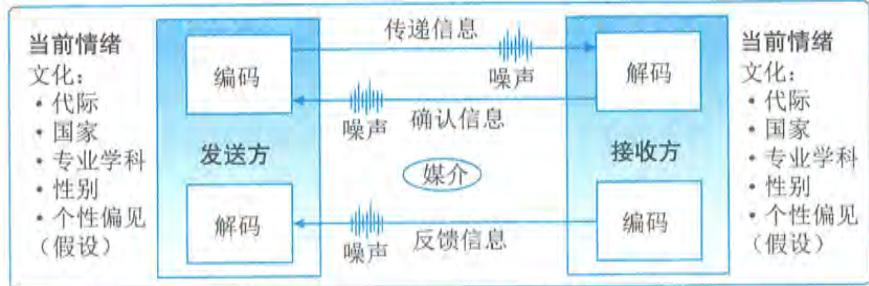  
图11-46 适用于跨文化沟通的沟通模型

# 2.沟通方法

项目干系人之间用于分享信息的沟通方法主要包括：

（1）互动沟通。在两方或多方之间进行的实时多向信息交换。它使用诸如会议、电话、即时信息、社交媒体和视频会议等沟通方式。

（2）推式沟通。向需要接收信息的特定接收方发送或发布信息。这种方法可以确保信息的发送，但不能确保信息送达目标受众或被目标受众理解。在推式沟通中，可以用于沟通的有信件、备忘录、报告、电子邮件、传真、语音邮件、博客、新闻稿。

（3）拉式沟通。适用于大量复杂信息或大量信息受众的情况。它要求接收方在遵守有关安全规定的前提之下自行访问相关内容。这种方法包括门户网站、组织内网、电子在线课程、经验教训数据库或知识库。

可以采用如下不同方法来实现沟通管理计划所规定的主要的沟通需求:

- 人际沟通: 个人之间交换信息, 通常以面对面的方式进行;

- 小组沟通: 在  $3 \sim 6$  名人员的小组内部开展;

- 公众沟通: 单个演讲者面向一群人;

- 大众传播: 信息发送人员或小组与大量目标受众 (有时为匿名) 之间只有最低程度的联系;

- 网络和社交工具沟通: 借助社交工具和媒体, 开展多对多的沟通。

可用于沟通的方法或成果主要包括: 公告板, 新闻通讯、内部杂志、电子杂志, 致员工或志愿者的信件, 新闻稿, 年度报告, 电子邮件和内部局域网, 门户网站和其他信息库 (适用于拉式沟通), 电话交流, 演示, 团队简述或小组会议, 焦点小组, 干系人之间的正式或非正式的面对面会议, 咨询小组或员工论坛, 社交工具和媒体等。

# 11.17.3 主要输出

沟通管理计划是项目管理计划的组成部分, 描述将如何规划、结构化、执行与监督项目沟通, 以提高沟通的有效性。沟通管理计划主要包括:

- 干系人的沟通需求;

- 需沟通的信息, 包括语言、形式、内容和详细程度;

- 上报步骤;

- 发布信息的原因;

- 发布所需信息、确认已收到, 或做出回应 (若适用) 的时限和频率;

- 负责沟通相关信息的人员;

- 负责授权保密信息发布的人员;

- 接收信息的人员或群体, 包括他们的需要、需求和期望;

- 用于传递信息的方法或技术, 如备忘录、电子邮件、新闻稿, 或社交媒体;

- 为沟通活动分配的资源, 包括时间和预算;

- 随着项目进展 (如项目不同阶段干系人社区的变化) 而更新与优化沟通管理计划的方法;

- 通用术语表;

- 项目信息流向图、工作流程 (可能包含审批程序)、报告清单和会议计划等;

- 来自法律法规、技术、组织政策等的制约因素等。

沟通管理计划中还包括关于项目状态会议、项目团队会议、网络会议和电子邮件等的指南和模板。如果项目要使用项目网站和项目管理软件, 需要将其写入沟通管理计划。

# 11.18 规划风险管理

规划风险管理是定义如何实施项目风险管理活动的过程。本过程的主要作用是确保风险管理的水平、方法和可见度与项目风险程度, 以及项目对组织和其他干系人的重要程度相匹配。

本过程仅开展一次或仅在项目的预定义点开展。图11- 47描述了本过程的输入、工具与技术和输出。

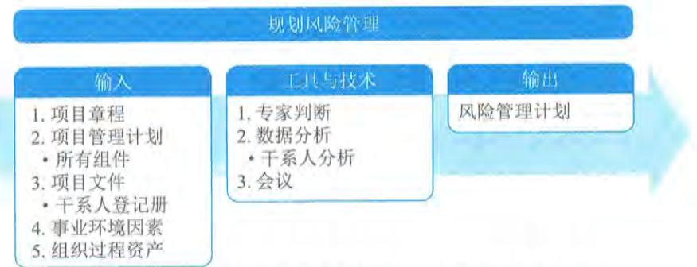  
图11-47 规划风险管理过程的输入、工具与技术和输出

规划风险管理过程的主要输入为项目管理计划和项目文件,主要输出为风险管理计划。

# 11.18.1 风险基本概念

项目是具有不同复杂程度的独特性工作,整个实施过程充满了风险,不仅要面对各种制约因素和假设条件,而且还要面对各干系人相互间可能的冲突和不断变化的期望。组织应有目的地、以可控方式去面对项目风险,平衡项目风险和回报,创造最好的项目价值。

每个项目都在两个层面上存在风险:一是每个项目都有会影响项目达成目标的单个风险;二是由单个风险和不确定性的其他来源联合导致的整体项目风险。项目风险管理过程同时兼顾这两个层面的风险。

项目风险会对项目目标产生负面或正面的影响,也就是威胁与机会。项目风险管理旨在利用或强化正面风险(机会),规避或减轻负面风险(威胁),负面风险可能会引发各种问题,如工期延误、成本超支、绩效不佳或声誉受损等。

# 1.风险的属性

风险具有以下几方面属性:

(1)风险事件的随机性。风险事件的发生及其后果都具有偶然性,包括风险事件是否发生,何时发生,发生之后会造成什么样的后果等。许多事件的发生都遵循一定的统计规律,这种性质叫随机性。风险事件具有随机性。

(2)风险的相对性。风险总是相对项目活动主体而言的。同样的风险对于不同的主体有不同的影响。人们对于风险事件都有一定的承受能力,但是这种能力因活动、人和时间而异。对于项目风险,影响人们的风险承受能力的因素主要包括:

- 收益的大小:收益总是伴随着损失的可能性。损失的可能性和数额越大,人们希望为弥补损失而得到的收益也越大。反过来,收益越大,人们愿意承担的风险也就越大。

- 投入的大小:项目活动投入得越多,人们对成功所抱的希望也越大,愿意冒的风险也就越小。投入与愿意接受的风险大小之间的关系如图11-48所示。一般人(风险中立者)希望活动获得成功的概率随着投入的增加呈S曲线规律增加。当投入少时,人们可以接

受较大的风险，即获得成功的概率不高也能接受；当投入逐渐增加时，人们就开始变得谨慎起来，希望活动获得成功的概率提高了，最好达到百分之百。图11- 48还表示了另外两种人（风险规避者和冒险者）对待风险的态度。

- 项目活动主体的地位和拥有的资源：级别高的管理人员比级别低的管理人员能够承担的风险相对要大。同一风险，不同的个人或组织的承受能力也不同。个人或组织拥有的资源越多，其风险承受能力也越大。

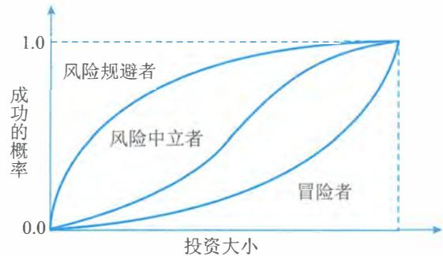  
图11-48 不同的投资者对风险的态度

# 2. 风险的可变性

辩证唯物主义认为，任何事情和矛盾都可以在一定条件下向自己的反面转化。这里的条件指活动涉及的一切风险因素。当这些条件发生变化时，必然会引起风险的变化。风险的可变性含义包括：风险性质的变化、风险后果的变化、出现新风险。

（1）风险性质的变化。例如，10年前熟悉项目进度管理软件的人不多，出了问题，常常使人手足无措。那个时候使用计算机管理进度风险很大。而现在，熟悉的人多了起来，使用计算机管理进度不再是大的风险。

（2）风险后果的变化。风险后果包括后果发生的频率、收益或损失的大小。随着科学技术的发展和生产力的提高，人们认识和抵御风险事件的能力也逐渐增强，能够在一定程度上降低风险事件发生的频率并减少损失或损害。在项目管理中，加强项目班子建设，增强责任感，提高管理技能，就能避免一些风险。此外，由于信息传播技术、预测理论、方法和手段的不断完善和发展，某些项目风险现在可以较准确地预测和估计了，因而大大减少了项目的不确定性。

（3）出现新风险。随着项目或其他活动的开展，会有新的风险出现。特别是在活动主体为回避某些风险而采取行动时，另外的风险就会出现。例如，为了避免项目进度拖延而增加资源投入时，就有可能造成成本超支。有些建设项目，为了早日完成，采取边设计、边施工或者在设计中免除校核手续的办法。这样做虽然可以加快进度，但是会产生增加设计变更、降低施工质量和提高造价的风险。

# 3. 风险的分类

为了深入、全面地认识项目风险，并有针对性地进行管理，有必要将风险分类。分类可以从不同的角度、根据不同的标准进行。

1）按照风险后果划分

按照后果的不同,风险可划分为纯粹风险和投机风险。

- 纯粹风险:不能带来机会、无获得利益可能的风险,叫纯粹风险。纯粹风险只有两种可能的后果:造成损失和不造成损失。纯粹风险造成的损失是绝对的损失。活动主体蒙受了损失,全社会也跟着受损失。例如,某建设项目空气压缩机房在施工过程中失火,蒙受了损失。该损失不但是这个工程的,也是全社会的。没有人从中获得好处。纯粹风险总是和威胁、损失、不幸相联系。

- 投机风险:既可能带来机会、获得利益,又隐含威胁、造成损失的风险,叫投机风险。投机风险有3种可能的后果:造成损失、不造成损失和获得利益。投机风险如果使活动主体蒙受了损失,但全社会不一定也跟着受损失。相反,其他人有可能因此而获得利益。例如,私人投资的房地产开发项目如果失败,投资者要蒙受损失。但是发放贷款的银行却可将抵押的土地和房屋收回,等待时机转手高价卖出,不但可收回贷款,而且还有可能获得高额利润。

纯粹风险和投机风险在一定条件下可以相互转化。项目管理人员必须避免投机风险转化为纯粹风险。风险不是零和游戏。在许多情况下,涉及风险的各有关方面都要蒙受损失,无一幸免。

2）按照风险来源划分

按照风险来源或损失产生的原因可将风险划分为自然风险和人为风险。

- 自然风险:由于自然力的作用,造成财产损毁或人员伤亡的风险属于自然风险。例如,水利工程施工过程中因发生洪水或地震而造成的工程损害、材料和器材损失。

- 人为风险:指由于人的活动而带来的风险。人为风险又可以细分为行为,经济、技术、政策和组织风险等。

3）按照风险是否可管理划分

可管理的风险是指可以预测,并可采取相应措施加以控制的风险。反之,则为不可管理的风险。风险能否管理,取决于风险不确定性是否可以消除,以及活动主体的管理水平。要消除风险的不确定性,就必须掌握有关的数据、资料和其他信息。随着数据、资料和其他信息的增加以及管理水平的提高,有些不可管理的风险可以变为可管理的风险。

4）按照风险影响范围划分

风险按影响范围划分,可以分为局部风险和总体风险。局部风险影响的范围小,而总体风险影响范围大。局部风险和总体风险也是相对的,项目管理团队特别要注意总体风险。例如,项目所有的活动都有拖延的风险,但是处在关键路线上的活动一旦延误,就要推迟整个项目的完成日期,形成总体风险。而非关键路线上活动的延误在许多情况下是局部风险。

5）按照风险后果的承担者划分

项目风险,若按其后果的承担者来划分则有项目业主风险、政府风险、承包商风险、投资方风险、设计单位风险、监理单位风险、供应商风险、担保方风险和保险公司风险等。这样划分有助于合理分配风险,提高项目对风险的承受能力。

6）按照风险的可预测性划分

按风险的可预测性划分,风险可以分为已知风险、可预测风险和不可预测风险。

- 已知风险:是在认真、严格地分析项目及其计划之后就能够明确的那些经常发生的,而且其后果亦可预见的风险。已知风险发生概率高,但一般后果轻微,不严重。项目管理中已知风险的例子有项目目标不明确,过分乐观的进度计划,设计或施工变更,材料价格波动等。

- 可预测风险:是根据经验,可以预见其发生,但不可预见其后果的风险。这类风险的后果有时可能相当严重。项目管理中的例子有业主不能及时审查批准,分包商不能及时交工,施工机械出现故障,不可预见的地质条件等。

- 不可预测风险:是有可能发生,但其发生的可能性即使最有经验的人亦不能预见的风险。不可预测风险有时也称为未知风险或未识别的风险。它们是新的、以前未观察到或很晚才显现出来的风险。这些风险一般是外部因素作用的结果。例如,地震、百年不遇的暴雨、通货膨胀、政策变化等。

# 11.18.2 主要输入

# 1.项目管理计划

1. 项目管理计划在规划风险管理时,应考虑所有已批准的项目管理子计划,使风险管理计划与各计划相协调。同时,各子计划中所列出的方法论可能也会影响规划风险管理过程。

# 2.项目文件

2. 项目文件可作为规划风险管理过程输入的项目文件是关于记录干系人详细信息的文档(干系人登记册),概述了其在项目中的角色和对项目风险的态度;可用于确定项目风险管理的角色和职责,以及为项目设定的风险临界值。

# 11.18.3 主要输出

风险管理计划是项目管理计划的组成部分,描述如何安排与实施风险管理活动。风险管理计划的内容主要包括:风险管理策略、方法论、角色与职责、资金、时间安排、风险类别、干系人风险偏好、风险概率和影响、概率和影响矩阵、报告格式、跟踪等。

(1)风险管理策略。风险管理策略描述了用于管理本项目风险的一般方法。

(2)方法论。方法论指确定用于开展本项目风险管理的具体方法、工具及数据来源。

(3)角色与职责。角色与职责指确定每项风险管理活动的领导者、支持者和团队成员,并明确职责。

(4)资金。资金指确定开展项目风险管理活动所需的资金,并制定应急储备和管理储备的使用方案。

(5)时间安排。时间安排指确定在项目生命周期中实施项目风险管理过程的时间和频率,确定风险管理活动并将其纳入项目进度计划。

(6)风险类别。风险类别指确定对项目风险进行分类的方式。通常借助风险分解结构

(RBS)来构建风险类别。风险分解结构是潜在风险来源的层级展现,如表11- 2所示。风险分解结构有助于项目团队考虑单个项目风险的全部可能来源,对识别风险或归类已识别风险特别有用。组织可能有适用于所有项目的通用风险分解结构,也可能针对不同类型项目使用几种不同的风险分解结构框架,或者允许项目量身定制专用的风险分解结构。如果未使用风险分解结构,组织则可能采用某种常见的风险分类框架,既可以是简单的类别清单,也可以是基于项目目标的某种类别结构。

表11-2 风险分解结构（RBS）示例  

<table><tr><td>RBS0级</td><td>RBS1级</td><td>RBS2级</td></tr><tr><td rowspan="28">0项目风险所有来源</td><td rowspan="7">1技术风险</td><td>1.1范围定义</td></tr><tr><td>1.2需求定义</td></tr><tr><td>1.3估算、假设和制约因素</td></tr><tr><td>1.4技术过程</td></tr><tr><td>1.5技术</td></tr><tr><td>1.6技术联系</td></tr><tr><td>……</td></tr><tr><td rowspan="7">2管理风险</td><td>2.1项目管理</td></tr><tr><td>2.2项目集/项目组合管理</td></tr><tr><td>2.3运营管理</td></tr><tr><td>2.4组织</td></tr><tr><td>2.5提供资源</td></tr><tr><td>2.6沟通</td></tr><tr><td>……</td></tr><tr><td rowspan="7">3商业风险</td><td>3.1合同条款和条件</td></tr><tr><td>3.2内部采购</td></tr><tr><td>3.3供应商与卖方</td></tr><tr><td>3.4分包合同</td></tr><tr><td>3.5客户稳定性</td></tr><tr><td>3.6合伙企业和合资企业</td></tr><tr><td>……</td></tr><tr><td rowspan="7">4外部风险</td><td>4.1法律</td></tr><tr><td>4.2汇率</td></tr><tr><td>4.3地点/设施</td></tr><tr><td>4.4环境/天气</td></tr><tr><td>4.5竞争</td></tr><tr><td>4.6监督</td></tr><tr><td>……</td></tr></table>

(7)干系人风险偏好。应在风险管理计划中记录项目关键干系人的风险偏好。他们的风险偏好会影响规划风险管理过程的细节。特别是,应该针对每个项目目标,把干系人的风险偏好

表述成可测量的风险临界值。这些临界值不仅将联合决定可接受的整体项目风险忍受水平,而且也用于制定概率和影响定义。以后将根据概率和影响定义,对单个项目风险进行评估和排序。

(8)风险概率和影响。根据具体的项目环境,组织和关键干系人的风险偏好和临界值,来制定风险概率和影响。项目可能自行制定关于概率和影响级别的具体定义,或者用组织提供的通用定义作为基础来制定。应根据拟开展项目风险管理过程的详细程度,来确定概率和影响级别的数量,更多级别(通常为5级)对应于更详细的风险管理方法,更少级别(通常为3级)对应于更简单的方法。表11-3针对3个项目目标提供了概率和影响定义的示例。

表11-3 概率和影响定义示例  

<table><tr><td rowspan="2">量表</td><td rowspan="2">概率</td><td colspan="3">+/-对项目目标的影响</td></tr><tr><td>时间</td><td>成本</td><td>质量</td></tr><tr><td>很高</td><td>&amp;gt;70%</td><td>&amp;gt;6个月</td><td>&amp;gt;500万元</td><td>对整体功能影响非常重大</td></tr><tr><td>高</td><td>51%～70%</td><td>3～6个月</td><td>100万元～500万元</td><td>对整体功能影响重大</td></tr><tr><td>中</td><td>31%～50%</td><td>1～3个月</td><td>50.1万元～100万元</td><td>对关键功能领域有一些影响</td></tr><tr><td>低</td><td>11%～30%</td><td>1～4周</td><td>10万元～50万元</td><td>对整体功能有微小影响</td></tr><tr><td>很低</td><td>1%～10%</td><td>1周</td><td>&amp;lt;10万元</td><td>对辅助功能有微小影响</td></tr><tr><td>零</td><td>&amp;lt;1%</td><td>不变</td><td>不变</td><td>功能不变</td></tr></table>

通过将影响定义为负面威胁(工期延误、成本增加和绩效不佳)和正面机会(工期缩短、成本节约和绩效改善),上表所示的量表可同时用于评估威胁和机会。

(9)概率和影响矩阵。组织可在项目开始前确定优先级排序规则,并将其纳入组织过程资产,或者也可为具体项目量身定制优先级排序规则。在常见的概率和影响矩阵中,会同时列出机会和威胁,以正面影响定义机会,以负面影响定义威胁。概率和影响可以用描述性术语(如很高、高、中、低和很低)或数值来表达。如果使用数值,就可以把两个数值相乘,得出每个风险的概率-影响分值,以便据此在每个优先级组别之内排列单个风险的相对优先级。图11-49是概率和影响矩阵的示例,其中也有数值风险评分的方法。

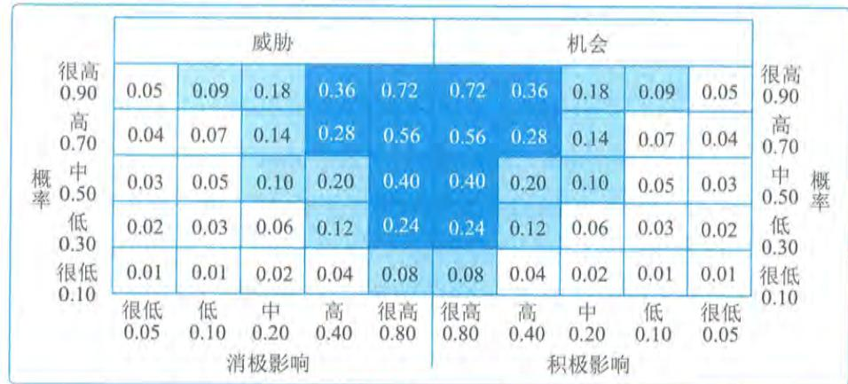  
图11-49 概率和影响矩阵示例(有数值风险评分方法)

(10) 报告格式。确定将如何记录、分析和沟通项目风险管理过程的结果。在这一部分, 描述风险登记册、风险报告以及项目风险管理过程的其他输出的内容和格式。

(11) 跟踪。确定将如何记录风险活动, 以及如何审计风险的管理过程。

# 11.19 识别风险

识别风险是识别单个项目风险及整体项目风险的来源, 并记录风险特征的过程。本过程的主要作用是记录现有的单个项目风险及整体项目风险的来源。本过程还汇集相关信息, 以便项目团队能够恰当应对已识别风险。本过程需要在整个项目期间开展。图 11-50 描述了本过程的输入、工具与技术和输出。

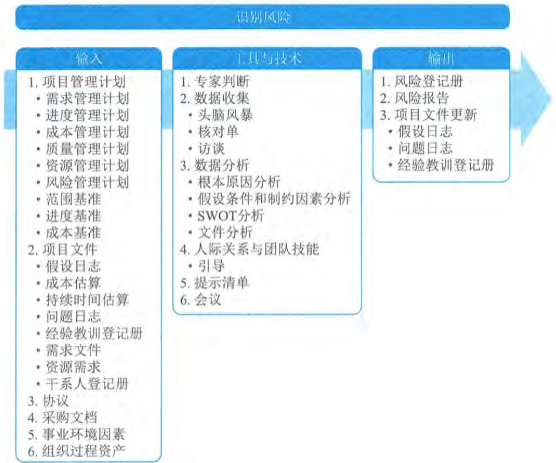  
图11-50 识别风险过程的输入、工具与技术和输出

在识别风险时, 要同时考虑单个项目风险及整体项目风险的来源。风险识别活动的参与者可能包括项目经理、项目团队成员、项目风险专家 (若已指定)、客户、项目团队外部的主题专家、最终用户、其他项目经理、运营经理、干系人和组织内的风险管理专家。虽然这些人员通常是风险识别活动的关键参与者, 但是还应鼓励所有项目干系人参与项目风险的识别工作。项目团队的参与尤其重要, 以便培养和保持他们对已识别的单个项目风险、整体项目风险级别和相关风险应对措施的主人翁意识和责任感。

应采用统一的风险描述格式来描述和记录项目风险,以确保每一项风险都被清楚、明确地理解,从而为有效地分析和风险应对措施的制定提供支持。在整个项目生命周期中,单个项目风险可能随项目进展而不断变化,整体项目风险的级别也会发生变化。因此,识别风险是一个迭代的过程。迭代的频率和每次迭代所需的参与程度因情况而异,应在风险管理计划中做出相应规定。

识别风险过程的主要输入为项目管理计划和项目文件,主要工具与技术为数据收集和数据分析,主要输出为风险登记册和风险报告。

# 11.19.1 主要输入

# 1.项目管理计划

识别风险过程使用的项目管理计划组件主要包括需求管理计划、进度管理计划、成本管理计划、质量管理计划、资源管理计划、风险管理计划、范围基准、进度基准和成本基准等。

(1)需求管理计划。需求管理计划可能指出了特别有风险的项目目标。

(2)进度管理计划。进度管理计划可能列出了受不确定性或模糊性影响的一些进度领域。

(3)成本管理计划。成本管理计划可能列出了受不确定性或模糊性影响的一些成本领域。

(4)质量管理计划。质量管理计划可能列出了受不确定性或模糊性影响的一些质量领域,或者关键假设可能引发风险的一些质量领域。

(5)资源管理计划。资源管理计划可能列出了受不确定性或模糊性影响的一些资源领域,或者关键假设可能引发风险的一些资源领域。

(6)风险管理计划。风险管理计划规定了风险管理的角色和职责,说明了如何将风险管理活动纳入预算和进度计划,并描述了风险类别。

(7)范围基准。范围基准包括可交付成果及其验收标准,其中有些可能引发风险,还包括工作分解结构,可用作安排风险识别工作的框架。

(8)进度基准。通过查看进度基准,可以找出存在不确定性或模糊性的里程碑日期和可交付成果的交付日期,或者可能引发风险的关键假设条件。

(9)成本基准。通过查看成本基准,可以找出存在不确定性或模糊性的成本估算或资金需求,或者关键假设可能引发风险的方面。

# 2.项目文件

可作为识别风险过程输入的项目文件主要包括假设日志、成本估算、持续时间估算、问题日志、经验教训登记册、需求文件、资源需求、干系人登记册等。

(1)假设日志。假设日志所记录的假设条件和制约因素可能引发单个项目风险,还可能影响整体项目风险的级别。

(2)成本估算。成本估算是对项目成本的定量评估,理想情况下用区间表示,区间的大小预示着风险程度。对成本估算文件进行结构化审查,可能显示当前估算不足,从而引发项目风险。

(3)持续时间估算。持续时间估算是对项目持续时间的定量评估,理想情况下用区间表示,

区间的大小预示着风险程度。对持续时间估算文件进行结构化审查,可能显示当前估算不足,从而引发项目风险。

(4) 问题日志。问题日志所记录的问题可能引发单个项目风险,还可能影响整体项目风险的级别。

(5) 经验教训登记册。可以查看与项目早期所识别的风险相关的经验教训,以确定类似风险是否可能在项目的剩余时间再次出现。

(6) 需求文件。需求文件列明了项目需求,使团队能够确定哪些需求存在风险。

(7) 资源需求。资源需求是对项目所需资源的定量评估,理想情况下用区间表示,区间的大小预示着风险程度。对资源需求文件进行结构化审查,可能显示当前估算不足,从而引发项目风险。

(8) 干系人登记册。干系人登记册规定了哪些个人或小组可能参与项目的风险识别工作,还会详细说明哪些个人适合扮演风险责任人的角色。

# 11.19.2 主要工具与技术

# 1. 数据收集

适用于识别风险过程的数据收集技术主要包括头脑风暴、核对单、访谈等。

(1) 头脑风暴。头脑风暴的目标是获取一份全面的项目风险来源的清单。通常由项目团队开展头脑风暴,同时邀请团队以外的多学科专家参与。可以采用自由或结构化的形式开展头脑风暴,在组织者的指引下产生各种创意。可以用风险类别(如风险分解结构)作为识别风险的框架。因为头脑风暴生成的创意并不成型,所以应该特别注意对头脑风暴识别的风险进行清晰描述。

(2) 核对单。核对单是包括需要考虑的项目、行动或要点的清单。它常被用作提醒。基于从类似项目和其他信息来源积累的历史信息和知识来编制核对单。编制核对单,列出过去曾出现且可能与当前项目相关的具体项目风险,这是吸取已完成的类似项目的经验教训的有效方式。可基于已完成的项目来编制核对单,或者可采用特定行业的通用风险核对单。虽然核对单简单易用,但它不可能穷尽所有风险。所以,必须确保不要用核对单来取代所需的风险识别工作。同时,项目团队也应该注意考察未在核对单中列出的事项。此外,还应该不时地审查核对单,增加新信息,删除或存档过时信息。

(3) 访谈。可通过对资深项目参与者、干系人和主题专家的访谈,来识别项目风险的来源。应该在信任和保密的环境下开展访谈,以获得真实可信、不带偏见的意见。

# 2. 数据分析

适用于识别风险过程的数据分析技术主要包括根本原因分析、假设条件和制约因素分析、SWOT分析和文件分析等。

(1) 根本原因分析。根本原因分析常用于发现导致问题的深层原因并制定预防措施。可以用问题陈述(如项目可能延误或超支)作为出发点,来探讨哪些威胁可能导致该问题,从而识别出相应的威胁。也可以用收益陈述(如提前交付或低于预算)作为出发点,来探讨哪些机会

可能有利于实现该效益,从而识别出相应的机会。

(2)假设条件和制约因素分析。每个项目及其项目管理计划的构思和开发都基于一系列的假设条件,并受一系列制约因素的限制。这些假设条件和制约因素往往都已纳入范围基准和项目估算。开展假设条件和制约因素分析,来探索假设条件和制约因素的有效性,确定其中哪些会引发项目风险。从假设条件的不准确、不稳定、不一致或不完整,可以识别出威胁,通过清除或放松会影响项目或过程执行的制约因素,可以创造出机会。

(3)SWOT分析。这是对项目的优势、劣势、机会和威胁(简称SWOT)进行逐个检查。在识别风险时,它会将内部产生的风险包含在内,从而拓宽识别风险的范围。首先,关注项目、组织或一般业务领域,识别出组织的优势和劣势;然后,找出组织优势可能为项目带来的机会,组织劣势可能造成的威胁,还可以分析组织优势能在多大程度上克服威胁,组织劣势是否会妨碍机会的产生。

(4)文件分析。通过对项目文件的结构化审查,可以识别出一些风险。可供审查的文件主要包括计划、假设条件、制约因素、以往项目档案、合同、协议和技术文件。项目文件中的不确定性或模糊性,以及同一文件内部或不同文件之间的不一致,都可能是项目风险的提示信号。

# 11.19.3 主要输出

# 1.风险登记册

风险登记册记录已识别项目风险的详细信息。随着实施定性风险分析、规划风险应对、实施风险应对和监督风险等过程的开展,这些过程的结果也要记进风险登记册,取决于具体的项目变量(如规模和复杂性),风险登记册可能包含有限或广泛的风险信息。

当完成识别风险过程时,风险登记册的内容主要包括已识别风险的清单、潜在风险责任人、潜在风险应对措施清单等。

(1)已识别风险的清单。在风险登记册中,每个项目风险都被赋予一个独特的标识号。需要按照所需的详细程度对已识别风险进行描述,确保明确理解。可以使用结构化的风险描述,来把风险本身与风险原因及风险影响区分开来。

(2)潜在风险责任人。如果已在识别风险过程中识别出潜在的风险责任人,就要把该责任人记录到风险登记册中。随后将由实施定性风险分析过程进行确认。

(3)潜在风险应对措施清单。如果已在识别风险过程中识别出某种潜在的风险应对措施,就要把它记录到风险登记册中。随后将由规划风险应对过程进行确认。

根据风险管理计划规定的风险登记册格式,可能还要记录关于每项已识别风险的其他数据,包括简短的风险名称、风险类别、当前风险状态、一项或多项原因、一项或多项对目标的影响、风险触发条件(显示风险即将发生的事件或条件)、受影响的WBS组件,以及时间信息(风险何时识别、可能何时发生、何时可能不再相关,以及采取行动的最后期限)。

# 2.风险报告

风险报告提供关于整体项目风险的信息,以及关于已识别的单个项目风险的概述信息。在项目风险管理过程中,风险报告的编制是一项渐进式的工作。随着实施定性风险分析、实施定

量风险分析、规划风险应对、实施风险应对和监督风险过程的完成，这些过程的结果也需要记录在风险报告中。完成识别风险过程时，风险报告内容主要包括：

$\bullet$  整体项目风险的来源，说明哪些是整体项目风险的最重要因素； $\bullet$  关于已识别的单个项目风险的概述信息，例如，已识别的威胁与机会的数量、风险在风险类别中的分布情况、测量指标和发展趋势； $\bullet$  根据风险管理计划中规定的报告要求，风险报告中可能还包含其他信息。

# 1120 实施定性风险分析

实施定性风险分析是通过评估单个项目风险发生的概率和影响以及其他特征，对风险进行优先级排序，从而为后续分析或行动提供基础的过程。本过程的主要作用是重点关注高优先级的风险。本过程需要在整个项目期间开展。图11- 51描述了本过程的输入、工具与技术和输出。

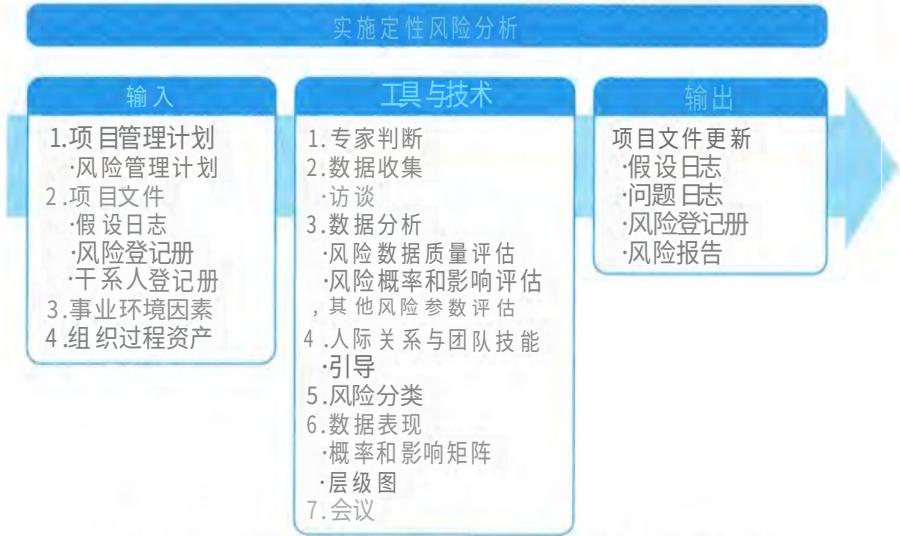  
图11-51 实施定性风险分析过程的输入、工具与技术和输出

实施定性风险分析，使用项目风险的发生概率、风险发生时对项目目标的相应影响以及其他因素，来评估已识别的单个项目风险的优先级。这种评估基于项目团队和其他干系人对风险的感知程度，因此具有主观性。所以，为了实现有效评估，就需要认清和管理本过程的关键参与者对风险所持的态度。风险主观意识会导致评估已识别风险时出现偏见，所以应该注意找出偏见并加以纠正。如果由引导者来引导本过程的开展，那么找出并纠正偏见就是该引导者的一项重要工作。同时，评估单个项目风险的现有信息的质量，也有助于澄清每个风险对项目的重要性

实施定性风险分析能为规划风险应对过程确定单个项目风险的相对优先级。本过程会为每个风险识别出责任人，以便由他们负责规划风险应对措施，并确保应对措施的实施。如果需要开展实施定量风险分析过程，那么实施定性风险分析也能为其奠定基础。根据风险管理计划的

规定,在整个项目生命周期中要定期开展实施定性风险分析过程。在敏捷或适应型开发环境中,实施定性风险分析过程通常要在每次迭代开始前进行。

实施定性风险分析过程的主要输入为项目管理计划和项目文件,主要工具与技术包括数据分析、风险分类和数据表现,主要输出为更新后的风险登记册和风险报告。

# 11.20.1 主要输入

# 1.项目管理计划

1. 项目管理计划实施定性风险分析过程使用的项目管理计划的子计划是风险管理计划。本过程中需要特别注意的是风险管理的角色和职责、预算和进度活动安排,以及风险类别(通常在风险分解结构中定义)、概率和影响定义、概率和影响矩阵和干系人的风险临界值。通常已经在规划风险管理过程中把这些内容裁剪成适合具体项目的需要。如果还没有这些内容,则可以在实施定性风险分析过程中编制,并经项目发起人批准之后用于本过程。

# 2.项目文件

可作为实施定性风险分析过程输入的项目文件主要包括假设日志、风险登记册和干系人登记册等。

(1)假设日志。假设日志用于识别、管理和监督可能影响项目的关键假设条件和制约因素,它们可能影响对项目风险的优先级的评估。

(2)风险登记册。风险登记册包括将在本过程评估的、已识别的项目风险的详细信息。

(3)干系人登记册。它包括可能被指定为风险责任人的项目干系人的详细信息。

# 11.20.2 主要工具与技术

# 1.数据分析

适用于实施定性风险分析过程的数据分析技术主要包括以下几种。

(1)风险数据质量评估。风险数据是开展定性风险分析的基础。风险数据质量评估旨在评价关于单个项目风险的数据的准确性和可靠性。使用低质量的风险数据,可能导致定性风险分析对项目来说基本没用。如果数据质量不可接受,就可能需要收集更好的数据。可以开展问卷调查,了解项目干系人对数据质量各方面的评价,包括数据的完整性、客观性、相关性和及时性,进而对风险数据的质量进行综合评估。可以计算这些方面的加权平均数,将其作为数据质量的总体分数。

(2)风险概率和影响评估。风险概率评估考虑的是特定风险发生的可能性,而风险影响评估考虑的是风险对一项或多项项目目标的潜在影响,如进度、成本、质量或绩效。威胁将产生负面的影响,机会将产生正面的影响。要对每个已识别的单个项目风险进行概率和影响评估。风险评估可以采用访谈或会议的形式,参加者将依照他们对风险登记册中所记录的风险类型的熟悉程度而定。项目团队成员和项目外部资深人员应该参加访谈或会议。在访谈或会议期间,评估每个风险的概率水平及其对每项目标的影响级别。如果干系人对概率水平和影响级别的感知存在差异,则应对差异进行探讨。此外,还应记录相应的说明性细节,例如,确定概率水平

或影响级别所依据的假设条件。应该采用风险管理计划中的概率和影响定义,来评估风险的概率和影响。低概率和影响的风险将被列入风险登记册中的观察清单,以供未来监控。

(3)其他风险参数评估。为了方便未来分析和行动,在对单个项目风险进行优先级排序时,项目团队还可能考虑(除概率和影响以外的)的其他风险特征包括如下几方面。

- 紧迫性:为有效应对风险而必须采取应对措施的时间段。时间短就说明紧迫性高。

- 邻近性:风险在多长时间后会影响一项或多项项目目标。时间短就说明邻近性高。

- 潜伏期:从风险发生到影响显现之间可能的时间段。时间短就说明潜伏期短。

- 可管理性:风险责任人(或责任组织)管理风险发生或影响的容易程度。如果容易管理,可管理性就高。

- 可控性:风险责任人(或责任组织)能够控制风险后果的程度。如果后果很容易控制,可控性就高。

- 可监测性:对风险发生或即将发生进行监测的容易程度。如果风险发生很容易监测,可监测性就高。

- 连通性:风险与其他单个项目风险存在关联的程度大小。如果风险与多个其他风险存在关联,连通性就高。

- 战略影响力:风险对组织战略目标潜在的正面或负面影响。如果风险对战略目标有重大影响,战略影响力就大。

- 密切度:风险被一名或多名干系人认为要紧的程度。被认为很要紧的风险,密切度就高。

考虑上述某些特征有助于进行更稳健的风险优先级排序。

# 2. 风险分类

项目风险可依据风险来源、受影响的项目领域,以及其他实用类别(如项目阶段、项目预算、角色和职责)来分类,确定哪些项目领域最容易被不确定性影响;风险还可以根据共同根本原因进行分类。应该在风险管理计划中规定可用于项目的风险分类方法。

对风险进行分类,有助于把注意力和精力集中到风险最可能发生的领域,或针对一组相关的风险制定通用的风险应对措施,从而有利于更有效地开展风险应对。

# 3. 数据表现

适用于实施定性风险分析过程的数据表现技术主要包括概率和影响矩阵、层级图等。

(1)概率和影响矩阵。概率和影响矩阵是把每个风险发生的概率和一旦发生对项目目标的影响映射起来的表格。此矩阵将概率和影响进行组合,以便于把单个项目风险划分到不同的优先级组别。基于风险的概率和影响,对风险进行优先级排序,以便未来进一步分析并制定应对措施。采用风险管理计划中规定的风险概率和影响定义,逐一对单个项目风险的发生概率及其对一项或多项项目目标的影响(若发生)进行评估。然后,基于所得到的概率和影响的组合,使用概率和影响矩阵,来为单个项目风险分配优先级别。组织可针对每个项目目标(如成本、时间和范围)制定单独的概率和影响矩阵,并用它们来评估风险针对每个目标的优先级别。组织也可以用不同的方法为每个风险确定一个总体优先级别。既可综合针对不同目标的评估结果,

也可采用最高优先级别(无论针对哪个目标)作为风险的总体优先级别。

(2) 层级图。如果使用了两个以上的参数对风险进行分类, 那就不能使用概率和影响矩阵, 而需要使用其他图形。例如, 气泡图能显示三维数据。在气泡图中, 把每个风险都绘制成一个气泡, 并用  $x$  轴值、  $y$  轴值和气泡大小来表示风险的 3 个参数。气泡图的示例如图 11-52 所示, 其中,  $x$  轴代表可监测性,  $y$  轴代表邻近性, 影响值则以气泡大小表示。

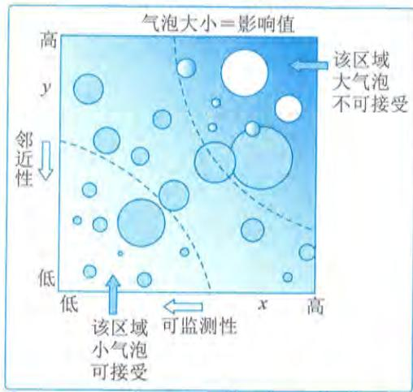  
图 11-52 列出可监测性、邻近性和影响值的气泡图示例

# 11.20.3 主要输出

# 1. 风险登记册 (更新)

用实施定性风险分析过程生成的新信息去更新风险登记册。风险登记册的更新内容可能包括每项单个项目风险的概率和影响评估、优先级别或风险分值、指定风险责任人、风险紧迫性信息或风险类别, 以及低优先级风险的观察清单或需要进一步分析的风险。

# 2. 风险报告 (更新)

更新后的风险报告记录最重要的单个项目风险 (通常为概率和影响最高的风险)、所有已识别风险的优先级列表以及简要的结论。

# 11.21 实施定量风险分析

实施定量风险分析是就已识别的单个项目风险和不确定性的其他来源对整体项目目标的影响进行定量分析的过程。本过程的主要作用是量化整体项目风险, 并提供额外的定量风险信息, 以支持风险应对规划。本过程需要在整个项目期间开展。图 11- 53 描述了本过程的输入、工具与技术和输出。

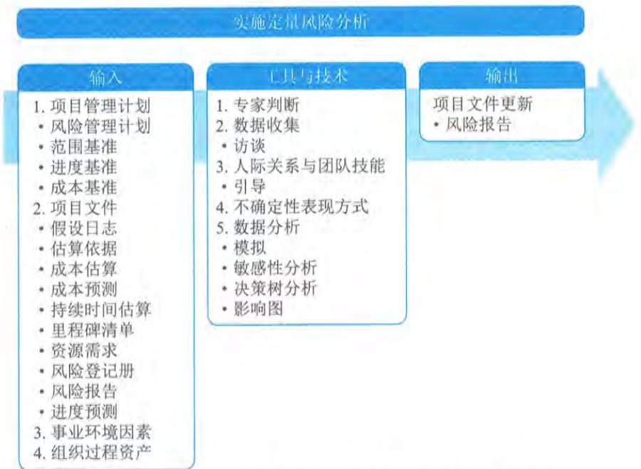  
图11-53 实施定量风险分析过程的输入、工具与技术和输出

并非所有项目都需要实施定量风险分析。项目风险管理计划会规定是否需要使用定量风险分析,定量分析适用于大型或复杂的项目、具有战略重要性的项目、合同要求进行定量分析的项目,或主要干系人要求进行定量分析的项目。能否开展稳健的定量分析取决于是否有关于单个项目风险和其他不确定性来源的高质量数据,以及与范围、进度和成本相关的扎实的项目基线。定量风险分析通常需要运用专门的风险分析软件,以及编制和解释风险模式的专业知识,还需要额外的时间和成本投入。

在实施定量风险分析过程中,要使用被定性风险分析过程评估为对项目目标存在重大潜在影响的单个项目风险的信息。实施定量风险分析过程的输出,则要用作规划风险应对过程的输入,特别是要据此为整体项目风险和关键单个项目风险推荐应对措施。定量风险分析也可以在规划风险应对过程之后开展,以分析已规划的应对措施对降低整体项目风险最大可能的有效性。

实施定量风险分析过程的主要输入为项目管理计划和项目文件,主要工具与技术包括不确定性表现方式和数据分析,主要输出为更新后的风险报告。

# 11.21.1 主要输入

# 1.项目管理计划

实施定量风险分析过程使用的项目管理计划的组件主要包括风险管理计划、范围基准、进度基准、成本基准等。

(1)风险管理计划。风险管理计划确定项目是否需要使用定量风险分析,还会详述可用于分析的资源,以及预期的分析频率。

(2) 范围基准。范围基准提供了对单个项目风险和其他不确定性来源的影响开展评估的起点。

(3) 进度基准。进度基准提供了对单个项目风险和其他不确定性来源的影响开展评估的起点。

(4) 成本基准。成本基准提供了对单个项目风险和其他不确定性来源的影响开展评估的起点。

# 2. 项目文件

可作为实施定量风险分析过程输入的项目文件主要包括假设日志、估算依据、成本估算、成本预测、持续时间估算、里程碑清单、资源需求、风险登记册、风险报告和进度预测等。

(1) 假设日志。如果认为假设条件会引发项目风险,那么就应该把它们列作定量风险分析的输入。在定量风险分析期间,也可以建立模型来分析制约因素的影响。

(2) 估算依据。开展定量风险分析时,可以把用于项目规划的估算依据反映在所建立的变量分析模型中。可能包括估算目的、分类、准确性、方法论和资料来源。

(3) 成本估算。成本估算提供了对成本变化性进行评估的起始点。

(4) 成本预测。成本预测包括项目的完工尚需估算(ETC)、完工估算(EAC)、完工预算(BAC)和完工尚需绩效指数(TCPI)。把这些预测指标与定量成本风险分析的结果进行比较,以确定与实现这些指标相关的置信水平。

(5) 持续时间估算。持续时间估算提供了对进度变化性进行评估的起始点。

(6) 里程碑清单。项目的重要阶段决定着进度目标。把这些进度目标与定量进度风险分析的结果进行比较,以确定与实现这些目标相关的置信水平。

(7) 资源需求。资源需求提供了对变化性进行评估的起始点。

(8) 风险登记册。风险登记册包含了用作定量风险分析输入的单个风险的详细信息。

(9) 风险报告。风险报告描述了整体项目风险来源,以及当前的整体项目风险状态。

(10) 进度预测。可以将预测与定量进度风险分析的结果进行比较,以确定与实现预测目标相关的置信水平。

# 11.21.2 主要工具与技术

# 1. 不确定性表现方式

要开展定量风险分析,就需要建立能反映单个项目风险和其他不确定性来源的定量风险分析模型,并为之提供输入。

如果活动的持续时间、成本或资源需求是不确定的,就可以在模型中用概率分布来表示其数值的可能区间。概率分布可能有多种形式,最常用的有三角分布、正态分布、对数正态分布、贝塔分布、均匀分布或离散分布。应该谨慎选择用于表示活动数值的可能区间的概率分布形式。

单个项目风险可以用概率分布图表示,也可以作为概率分支包括在定量分析模型中,在概

率分支上添加风险发生的时间和(或)成本影响。如果风险的发生与任何计划活动都没有关系,就最适合将其作为概率分支。如果风险之间存在相关性,例如有某个共同原因或逻辑依赖关系,那么应该在模型中考虑这种相关性。其他不确定性来源也可用概率分支来表示,以描述贯穿项目的其他路径。

# 2.数据分析

适用于实施定量风险分析过程的数据分析技术主要包括模拟、敏感性分析、决策树分析、影响图等。

# 1)模拟

在定量风险分析中,使用模型来模拟单个项目风险和其他不确定性来源的综合影响,以评估它们对项目目标的潜在影响。模拟通常采用蒙特卡洛分析。

对成本风险进行蒙特卡洛分析时,使用项目成本估算作为模拟的输入;对进度风险进行蒙特卡洛分析时,使用进度网络图和持续时间估算作为模拟的输入。开展定量成本和进度综合风险分析时,同时使用这两种输入,其输出就是定量风险分析模型。

用计算机软件数千次迭代运行定量风险分析模型。每次运行,都要随机选择输入值(如成本估算、持续时间估算或概率分支发生频率)。这些运行的输出构成了项目可能结果(如项目结束日期、项目完工成本)的区间。典型的输出包括表示模拟得到特定结果的次数的直方图,或表示获得等于或小于特定数值的结果的累积概率分布曲线(S曲线)。蒙特卡洛成本风险分析所得到的S曲线示例如图11- 54所示。

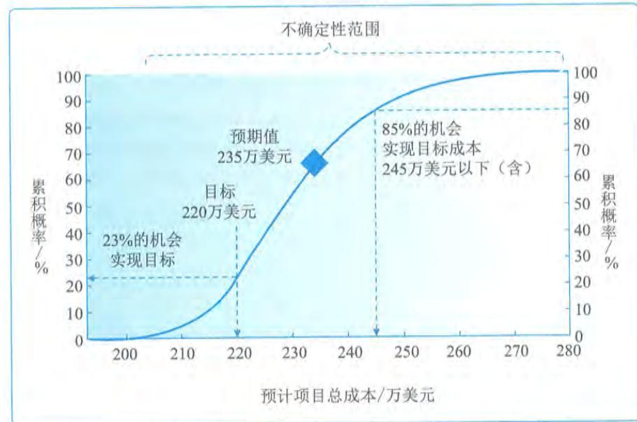  
图11-54蒙特卡洛成本风险分析所得到的S曲线示例

在定量进度风险分析中,还可以执行关键性分析,以确定风险模型的哪些活动对项目关键路径的影响最大。对风险模型中的每一项活动计算关键性指标,即在全部模拟中,该活动出现

在关键路径上的频率，通常以百分比表示。通过关键性分析，项目团队就能够重点针对那些对项目整体进度绩效存在最大潜在影响的活动，进行规划风险应对措施。

# 2）敏感性分析

敏感性分析有助于确定哪些单个项目风险或不确定性来源对项目结果具有最大的潜在影响。它在项目结果变化与定量风险分析模型中的要素变化之间建立联系。敏感性分析的结果通常用龙卷风图来表示，图中标出定量风险分析模型中的每项要素与其能影响的项目结果之间的关联系数，这些要素可包括单个项目风险、易变的项目活动，或具体的不明确性来源。每个要素按关联强度降序排列，形成典型的龙卷风形状，如图11- 55所示。

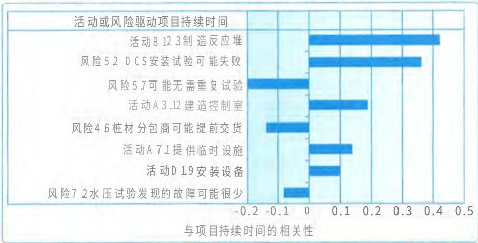  
图11-55 龙卷风图示例

# 3）决策树分析

用决策树在若干备选行动方案中选择一个最佳方案。在决策树中，用不同的分支代表不同的决策或事件，即项目的备选路径。每个决策或事件都有相关的成本和单个项目风险（包括威胁和机会）。决策树分支的终点表示沿特定路径发展的最后结果，可以是负面或正面的结果。在决策树分析中，通过计算每条分支的预期货币价值，就可以选出最优的路径。决策树示例如图11- 56所示。

# 4）影响图

影响图是在不确定条件下进行决策的图形辅助工具。它将一个项目或项目中的一种情境表现为一系列实体、结果和影响，以及它们之间的关系和相互影响。如果因为存在单个项目风险或不确定性来源而影响图中的某些要素的不确定性，就在影响图中以区间或概率分布的形式表示这些要素；然后，借助模拟技术（如蒙特卡洛分析）来分析哪些要素对重要结果具有最大的影响。影响图分析可以得出类似于其他定量风险分析的结果，如S曲线图和龙卷风图。

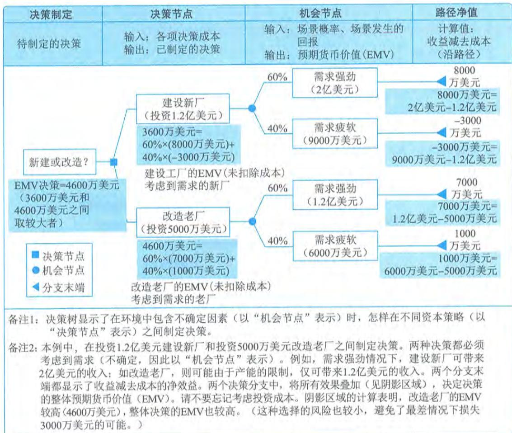  
图11-56 决策树示例

# 11.21.3 主要输出

更新后的风险报告可以反映定量风险分析的结果,具体内容包括:

(1)对整体项目风险最大可能性的评估结果。整体项目风险有两种主要的测量方式:

- 项目成功的可能性:基于已识别的单个项目风险和其他不确定性来源,项目实现其主要目标(例如,既定的结束日期或中间里程碑、既定的成本目标)的概率。

- 项目固有的变化性:在开展定量分析时,可能的项目结果的分布区间。

(2)项目详细概率分析的结果。列出定量风险分析的重要输出,如S曲线、龙卷风图和关键性指标,以及对它们的叙述性解释。定量风险分析的详细结果主要包括:

- 所需的应急储备:以达到实现目标的特定置信水平;

- 对项目关键路径有最大影响的单个项目风险或其他不确定性来源的清单;

- 整体项目风险的主要驱动因素:即对项目结果的不确定性有最大影响的因素等。

(3)单个项目风险优先级清单。根据敏感性分析的结果,列出对项目造成最大威胁或产生

最大机会的单个项目风险。

（4）定量风险分析结果的趋势。随着在项目生命周期的不同时间重复开展定量风险分析，风险的发展趋势可能逐渐清晰。发展趋势会影响风险应对措施的规划。

（5）风险应对建议。风险报告可能根据定量风险分析结果，针对整体风险的最大可能性或关键单个风险提出应对建议。这些建议将成为规划风险应对过程的输入。

# 11.22 规划风险应对

规划风险应对是为处理整体项目风险敞口，以及应对单个项目风险而制定可选方案、选择应对策略并商定应对行动的过程。本过程的主要作用是制定应对整体项目风险和单个项目风险的适当方法。本过程还将分配资源，并根据需要将相关活动添加进项目文件和项目管理计划。本过程需要在整个项目期间开展。图11- 57描述了本过程的输入、工具与技术和输出。

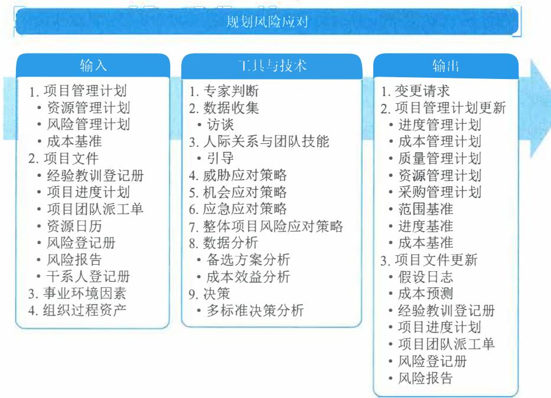  
图11-57 规划风险应对过程的输入、工具与技术和输出

针对项目团队认为足够重要的每项单个的项目风险，这些风险会对项目目标的实现造成威胁或提供机会。有效和适当的风险应对可以最小化威胁、最大化机会，并降低整体项目风险发生的可能性；不恰当的风险应对则会适得其反。项目经理也应该思考如何针对整体项目风险的当前级别做出适当的应对。

风险应对方案应该与风险的重要性相匹配，并且能够经济、有效地应对挑战，同时在当前项目背景下现实可行，获得全体干系人的同意，并由一名责任人具体负责。在项目过程中，往

往需要从几套可选方案中选出最优的风险应对方案,为每个风险选择最可能有效的策略或策略组合。可用结构化的决策技术来选择最适当的应对策略。对于大型或复杂项目,可能需要以数学优化模型或实际方案分析为基础,进行备选风险应对策略经济分析。

要为实施商定的风险应对策略制定具体的应对行动。如果选定的策略并不完全有效,或者发生了已接受的风险,就需要制订应急计划。同时,也需要识别次生风险。次生风险是实施风险应对措施而直接导致的风险。

规划风险应对过程的主要输入为项目管理计划和项目文件,主要工具与技术包括威胁应对策略、机会应对策略、整体项目风险应对策略,主要输出为更新后的风险登记册和风险报告。

# 11.22.1 主要输入

# 1.项目管理计划

规划风险应对过程使用的项目管理计划组件主要包括资源管理计划、风险管理计划和成本基准等。

(1)资源管理计划。资源管理计划有助于协调用于风险应对的资源和其他项目资源。

(2)风险管理计划。本过程会用到风险管理计划中的风险角色和职责、风险临界值。

(3)成本基准。成本基准包含了拟用于风险应对的应急资金的信息。

# 2.项目文件

可作为规划风险应对过程输入的项目文件主要包括经验教训登记册、项目进度计划、项目团队派工单、资源日历、风险登记册、风险报告和干系人登记册。

(1)经验教训登记册。查看关于项目早期的风险应对的经验教训,确定类似的应对是否适用于项目后期。

(2)项目进度计划。进度计划用于确定如何同时规划风险应对活动和其他项目活动。

(3)项目团队派工单。项目团队派工单列明了可用于风险应对的人力资源。

(4)资源日历。资源日历确定了潜在的资源何时可用于风险应对。

(5)风险登记册。风险登记册包含了已识别并排序的、需要应对的单个项目风险的详细信息。每项风险的优先级有助于选择适当的风险应对措施。例如,针对高优先级的威胁或机会,可能需要采取优先措施和积极主动的应对策略;而针对低优先级的威胁和机会,可能只需要把它们列入风险登记册的观察清单部分,不必采取主动的管理措施。同时,风险登记册列出了每项风险的指定风险责任人,还可能包含在早期的项目风险管理过程中识别的初步风险应对措施。风险登记册可能还会提供有助于规划风险应对的、关于已识别风险的其他信息,包括根本原因、风险触发因素和预警信号、需要在短期内应对的风险,以及需要进一步分析的风险。

(6)风险报告。风险报告中的项目整体风险最大可能风险的当前级别,会影响风险应对策略的选择。风险报告也可能按优先级顺序列出了单个项目风险,并对单个项目风险的分布情况进行了更多分析,这些信息都会影响风险应对策略的选择。

(7)干系人登记册。干系人登记册列出了风险应对的潜在责任人。

# 11.22.2 主要工具与技术

# 1.威胁应对策略

针对威胁，可以考虑以下5种备选的应对策略：上报、规避、转移、减轻和接受。

（1）上报。如果项目团队或项目发起人认为某威胁不在项目范围内，或提议的应对措施超出了项目经理的权限，就应该采用上报策略。被上报的风险将在项目集层面、项目组合层面或组织的其他相关部门加以管理，而非项目层面。项目经理确定应就威胁通知哪些人员，并向该人员或组织部门传达关于该威胁的详细信息。对于被上报的威胁，组织中的相关人员必须愿意承担应对责任，这一点非常重要。威胁通常要上报给其目标会受该威胁影响的层级。威胁一旦上报，就不再由项目团队做进一步监督，虽然仍可出现在风险登记册中供参考。

（2）规避。风险规避是指项目团队采取行动来消除威胁，或保护项目免受威胁的影响。它可能适用于发生概率较高，且具有严重负面影响的高优先级的威胁。规避策略可能涉及变更项目管理计划的某些方面，或改变会受负面影响的目标，以便于彻底消除威胁，将它的发生概率降低到零。风险责任人也可以采取措施，来分离项目目标与风险万一发生的影响。规避措施可能包括消除威胁的原因、延长进度计划、改变项目策略，或缩小范围。有些风险可以通过澄清需求、获取信息、改善沟通或取得专有技能来加以规避。

（3）转移。转移涉及将应对威胁的责任转移给第三方，让第三方管理风险并承担威胁发生的影响。采用转移策略，通常需要向承担威胁的一方支付风险转移费用。风险转移可能需要通过一系列行动才能得以实现，主要包括购买保险、使用履约保函、使用担保书、使用保证书等。也可以通过签订协议，把具体风险的归属和责任转移给第三方。

（4）减轻。风险减轻是指采取措施来降低威胁发生的概率和影响。提前采取减轻措施通常比威胁出现后尝试进行弥补更加有效。减轻措施包括采用较简单的流程，进行更多次测试，或者选用更可靠的卖方。还可能涉及原型开发，以降低从实验台模型放大到实际工艺或产品中的风险。如果无法降低概率，也许可以从决定风险严重性的因素入手，来减轻风险发生的影响。例如，在一个系统中加入余部件，可减轻原始部件故障所造成的影响。

（5）接受。风险接受是指承认威胁的存在。此策略可用于低优先级的威胁，也可用于无法以任何其他方式经济、有效地应对的威胁。接受策略又分为主动或被动方式，最常见的主动接受策略是建立应急储备，包括预留时间、资金或资源，以应对出现的威胁；被动接受策略则不会主动采取行动，而只是定期对威胁进行审查，确保其并未发生重大改变。

# 2.机会应对策略

针对机会，可以考虑以下5种备选策略：上报、开拓、分享、提高和接受。

（1）上报。如果项目团队或项目发起人认为某机会不在项目范围内，或提议的应对措施超出了项目经理的权限，就应该采取上报策略。被上报的机会将在项目集层面、项目组合层面或组织的其他相关部门加以管理，而非项目层面。项目经理确定应就机会通知哪些人员，并向该人员或组织部门传达关于该机会的详细信息。对于被上报的机会，组织中的相关人员必须愿意承担应对责任，这一点非常重要。机会通常要上报给其目标会受该机会影响的层级。机会一旦

上报,就不再由项目团队做进一步监督,虽然仍可出现在风险登记册中供参考。

(2)开拓。如果组织想确保把握住高优先级的机会,就可以选择开拓策略。此策略将特定机会的出现概率提高到  $100\%$  ,确保其肯定出现,从而获得与其相关的收益。开拓措施可能包括:把组织中最有能力的资源分配给项目来缩短完工时间,或采用全新技术或技术升级来节约项目成本并缩短项目持续时间。

(3)分享。分享涉及将应对机会的责任转移给第三方,使其享有机会所带来的部分收益。必须仔细为已分享的机会安排新的风险责任人,让那些最有能力为项目抓住机会的人担任新的风险责任人。采用机会应对策略,通常需要向承担机会应对责任的一方支付风险费用。分享措施包括建立合伙关系、合作团队、特殊公司或合资企业分享机会。

(4)提高。提高策略用于提高机会出现的概率和影响。提前采取提高措施通常比机会出现后尝试改善收益更加有效。通过关注其原因,可以提高机会出现的概率;如果无法提高概率,也许可以针对决定其潜在收益规模的因素来提高机会发生的影响。机会提高措施包括为早日完成活动而增加资源。

(5)接受。接受机会是指承认机会的存在。此策略可用于低优先级的机会,也可用于无法以任何其他方式经济、有效地应对的机会。接受策略又分为主动或被动方式。最常见的主动接受策略是建立应急储备,包括预留时间、资金或资源,以便在机会出现时加以利用;被动接受策略则不会主动采取行动,而只是定期对机会进行审查,确保其并未发生重大改变。

# 3.整体项目风险应对策略

风险应对措施的规划和实施不应只针对单个项目风险,还应针对整体的项目风险。用于应对单个项目风险的策略也适用于整体项目风险,主要包括规避、开拓、转移或分享、减轻或提高、接受。

(1)规避。如果整体项目风险有严重的负面影响,并已超出商定的项目风险临界值,就可以采用规避策略。此策略涉及采取集中行动,弱化不确定性对项目整体的负面影响,并将项目拉回到临界值以内。例如,取消项目范围中的高风险工作,就是一种整个项目层面的规避措施。如果无法将项目拉回到临界值以内,则可能取消项目。这是最极端的风险规避措施,仅适用于威胁的整体级别在当前和未来都不可接受的情况。

(2)开拓。如果整体项目风险有显著的正面影响,并已超出商定的项目风险临界值,就可以采用开拓策略。此策略涉及采取集中行动,获得不确定性对整体项目的正面影响。例如,在项目范围中增加高收益的工作,以提高项目对干系人的价值或效益;或者,也可以与关键干系人协商修改项目的风险临界值,以便将机会包含在内。

(3)转移或分享。如果整体项目风险的级别很高,组织无法有效加以应对,就可能需要让第三方代表组织对风险进行管理。若整体项目风险是负面的,就需要采取转移策略,这可能涉及支付风险费用;若整体项目风险高度正面,则由多方分享,以获得相关收益。整体项目风险的转移和分享策略主要包括:建立买方和卖方分享整体项目风险的协作式业务结构、成立合资企业或特殊目的公司,或对项目的关键工作进行分包。

(4)减轻或提高。本策略涉及变更整体项目风险的级别,以优化实现项目目标的可能性。

减轻策略适用于负面的整体项目风险,而提高策略则适用于正面的整体项目风险。减轻或提高策略包括重新规划项目、改变项目范围和边界,调整项目优先级、改变资源配置、调整交付时间等。

(5)接受。即使整体项目风险已超出商定的临界值,如果无法针对整体项目风险采取主动的应对策略,组织可能选择继续按当前的定义推动项目进展。接受策略又分为主动或被动方式。最常见的主动接受策略是为项目建立整体应急储备,包括预留时间、资金或资源,以便在项目风险超出临界值时使用;被动接受策略则不会主动采取行动,而只是定期对整体项目风险的级别进行审查,确保其未发生重大改变。

# 11.22.3 主要输出

# 1.风险登记册(更新)

需要更新风险登记册,记录选择和商定的风险应对措施。

风险登记册的更新可能包括:

$\bullet$  商定的应对策略;

$\bullet$  实施所选应对策略所需要的具体行动;

$\bullet$  风险发生的触发条件、征兆和预警信号;

$\bullet$  实施所选应对策略所需要的预算和进度活动;

$\bullet$  应急计划及启动该计划所需的风险触发条件;

$\bullet$  回退计划,供风险发生且主要应对措施不足以应对时使用;

$\bullet$  采取预定应对措施之后仍存在的残余风险,以及被有意接受的风险;

$\bullet$  由实施风险应对措施而直接导致的次生风险。

# 2.风险报告(更新)

更新风险报告,记录针对当前整体项目风险敞口和高优先级风险的经商定的应对措施,以及实施这些措施之后的预期变化。

# 11.23 规划采购管理

规划采购管理是记录项目采购决策,明确采购方法,识别潜在卖方的过程。本过程的主要作用是确定是否从项目外部获取货物和服务,如果是,则还要确定将在什么时间、以什么方式获取什么货物和服务。货物和服务可从执行组织的其他部门采购,或者从外部渠道采购。本过程仅开展一次或仅在项目的预定义点开展。图11- 58描述了本过程的输入、工具与技术和输出。

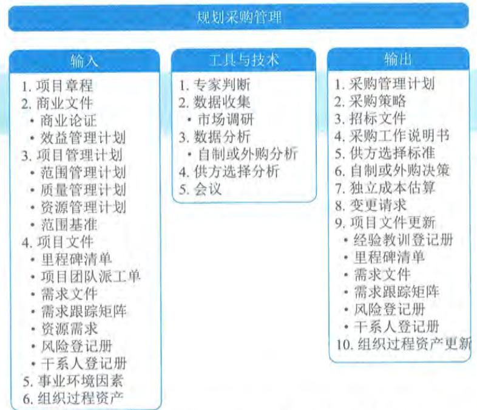  
图11-58 规划采购管理的输入、工具与技术和输出

应该在规划采购管理过程的早期，确定与采购有关的角色和职责。项目经理应确保在项目团队中配备具有所需采购专业知识的人员。采购过程的参与者可能包括购买部或采购部的人员，以及法务部的人员。这些人员的职责也应记录在采购管理计划中。

一般的采购步骤包括：

- 准备采购工作说明书（SOW）或工作大纲（TOR）；- 准备高层级的成本估算，制定预算；- 发布招标广告；- 确定合格卖方的名单；- 准备并发布招标文件；- 由卖方准备并提交建议书；- 对建议书开展技术（包括质量）评估；- 对建议书开展成本评估；- 准备最终的综合评估报告（包括质量及成本），选出中标建议书；- 结束谈判，买方和卖方签署合同。

项目进度计划对规划采购管理过程中的采购策略制定有重要影响。在制定采购管理计划时所做出的决定也会影响项目进度计划。在开展制订进度计划过程、估算活动资源过程以及自制或外购决策制定时，都需要考虑这些决定。

规划采购管理过程的主要输入为项目管理计划和项目文件，主要输出为采购管理计划、采购策略、采购工作说明书和招标文件。

# 11.23.1 主要输人

# 1.项目管理计划

规划采购管理过程使用的项目管理计划的组件主要包括范围管理计划、质量管理计划、资源管理计划、范围基准等。

（1）范围管理计划。范围管理计划说明如何在项目实施阶段管理承包商的工作范围等。

（2）质量管理计划。质量管理计划包含项目需要遵循的行业标准与准则。这些标准与准则应写入招标文件，如建议邀请书，并将最终在合同中引用。这些标准与准则也可用于供应商资格预审，或作为供应商甄选标准的一部分。

（3）资源管理计划。资源管理计划包括关于哪些资源需要采购或租赁的信息，以及任何可能影响采购的假设条件或制约因素。

（4）范围基准。范围基准包含范围说明书、WBS和WBS字典。在项目早期，项目范围可能仍要继续演进。应该针对项目范围中已知的工作编制工作说明书（SOW）和工作大纲（TOR）。

# 2.项目文件

可作为规划采购管理过程输入的项目文件主要包括里程碑清单、项目团队派工单、需求文件、需求跟踪矩阵、资源需求、风险登记册、干系人登记册等。

（1）里程碑清单。重要里程碑清单说明卖方需要在何时交付成果。

（2）项目团队派工单。项目团队派工单包含关于项目团队技能和能力的信息，以及他们可用于支持采购活动的时间。如果项目团队不具备开展采购活动的能力，则需要外聘人员或对现有人员进行培训，或者二者同时进行。

（3）需求文件。需求文件包括以下内容：一是卖方需要满足的技术要求；二是具有合同和法律意义的需求，如健康、安全、安保、绩效、环境、保险、知识产权、同等就业机会、执照、许可证，以及其他非技术要求。

（4）需求跟踪矩阵。需求跟踪矩阵将产品需求从来源连接到满足需求的可交付成果。

（5）资源需求。资源需求包含关于某些特定需求的信息，例如，可能需要采购的团队及实物资源。

（6）风险登记册。风险登记册列明风险清单，以及风险分析和风险应对规划的结果。有些风险应通过采购协议转移给第三方。

（7）干系人登记册。干系人登记册提供有关项目参与者及其项目利益的详细信息，包括监管机构、合同签署人员和法务人员。

# 11.23.2 主要输出

# 1.采购管理计划

采购管理计划包含在采购过程中开展的各种活动。它应该记录是否要开展国际竞争性招标、国内竞争性招标、当地招标等。如果项目由外部资助，资金的来源和可用性应符合采购管理计划和项目进度计划的规定。

采购管理计划可包括以下内容：

- 如何协调采购与项目的其他工作，例如，项目进度计划的制订和控制；

- 开展重要采购活动的时间表；

- 用于管理合同的采购测量指标；

- 与采购有关的干系人角色和职责，如果执行组织有采购部，项目团队拥有的职权和受到的限制；

- 可能影响采购工作的制约因素和假设条件；

- 司法管辖权和付款货币；

- 是否需要编制独立估算，以及是否应将其作为评价标准；

- 风险管理事项，包括对履约保函或保险合同的要求，以减轻某些项目风险；

- 拟使用的预审合格的卖方（如果有）等。

根据每个项目的需要，采购管理计划可以是正式或非正式的，也可以是非常详细或高度概括的。

# 2. 采购策略

一旦完成自制或外购分析，并决定从项目外部渠道采购，就应制定一套采购策略。应该在采购策略中规定项目交付方法、具有法律约束力的协议类型，以及如何在采购阶段推动采购进展。

# 1）交付方法

对专业服务项目和建筑施工项目，应该采用不同的交付方法，具体如下：

- 专业服务项目的交付方法：主要涉及的项目类型包括买方或服务提供方不得分包、买方或服务提供方可以分包、买方和服务提供方设立合资企业、买方或服务提供方仅充当代表；

- 工业或商业施工项目的交付方法：主要涉及的项目类型包括交钥匙式、设计-建造（DB）、设计-招标-建造（DBB）、设计-建造-运营（DBO）、建造-拥有-运营-转让（BOOT）等。

2）合同支付类型

合同支付类型与项目交付方法无关，需要与采购组织的内部财务系统相协调。主要包括以下几种合同类型及其变种：总价、固定总价、成本加奖励费用、成本加激励费用、工料、目标成本及其他。

- 总价合同适用于工作类型可预知、需求能清晰定义且不太可能变更的情况；

- 成本补偿合同适用于工作不断演进、很可能变更或未明确定义的情况；

- 激励和奖励费用可用于协调买方和卖方的目标。

3）采购阶段相关信息

采购策略也可以包括与采购阶段有关的信息，这些信息可能包括：

- 采购工作的顺序安排或阶段划分，每个阶段的描述，以及每个阶段的具体目标；

- 用于监督的采购绩效指标和里程碑；

- 从一个阶段过渡到下一个阶段的标准；- 用于追踪采购进展的监督和评估计划；- 向后续阶段转移知识的过程。

# 3. 采购工作说明书

依据项目范围基准，为每次采购编制工作说明书（SOW），仅对将要包含在相关合同中的那一部分项目范围进行定义。工作说明书会充分、详细地描述拟采购的产品、服务或成果，以便潜在卖方确定是否有能力提供此类产品、服务或成果。根据采购品的性质、买方的需求，或拟采用的合同形式，工作说明书的详细程度会有较大不同。工作说明书的内容包括规格、所需数量、质量水平、绩效数据、履约期间、工作地点和其他要求。

采购工作说明书应力求清晰、完整和简练。它需要说明所需的附加服务，例如，报告绩效，或对采购品的后续运营支持。在采购过程中，应根据需要对工作说明书进行修订，直到它成为所签协议的一部分。

对于服务采购，可能会用“工作大纲（TOR）”这个术语。与采购工作说明书类似，工作大纲通常包括以下内容：

- 承包商需要执行的任务，以及所需的协调工作；- 承包商必须达到的适用标准；- 需要提交批准的数据；- 由买方提供给承包商的，适用时，将用于合同履行的全部数据和服务的详细清单；- 关于初始成果提交和审查（或审批）的进度计划。

# 4. 招标文件

招标文件用于向潜在卖方征求建议书。如果主要依据价格来选择卖方（如购买商业或标准产品时），通常就使用标书、投标或报价等术语；如果其他考虑因素（如技术能力或技术方法）至关重要，则通常使用建议书之类的术语。具体使用的采购术语也可能因行业或采购地点而异。根据所需的货物或服务，招标文件可以是信息邀请书、报价邀请书、建议邀请书，或其他适当的采购文件。使用不同文件的条件如下：

- 信息邀请书（RFI）：如果需要卖方提供关于拟采购货物和服务的更多信息，就使用信息邀请书。随后一般还会使用报价邀请书或建议邀请书。- 报价邀请书（RFQ）：如果需要供应商提供关于将如何满足需求和（或）将需要多少成本的更多信息，就使用报价邀请书。- 建议邀请书（RFP）：如果项目中出现问题且解决办法难以确定，就使用建议邀请书。这是最正式的“邀请书”文件，需要遵守与内容、时间表，以及卖方应答有关的严格的采购规则。

买方拟定的招标文件不仅应便于潜在卖方做出准确、完整的应答，还要便于买方对卖方应答进行评价。招标文件会包括规定的应答格式、相关的采购工作说明书，以及所需的合同条款。

招标文件的复杂和详细程度应与采购的价值及相关的风险相符。招标文件既需要具备足够详细的信息，以确保卖方做出一致且适当的应答，同时又要有足够的灵活度，让卖方为满足相

同的要求而提出更好的建议。

# 11.23.3 合同类型

以项目范围为标准进行划分，可以将合同分为项目总承包合同、项目单项承包合同和项目分包合同3类。以项目付款方式为标准进行划分，通常可将合同分为两大类，即总价合同和成本补偿合同。另外，常用的合同类型还有混合型的工料合同。

# 1.项目总承包合同

买方将项目的全过程作为一个整体发包给同一个卖方的合同。需要特别注意的是，总承包合同要求只与同一个卖方订立承包合同，但并不意味着只订立一个总合同。可以采用订立一个总合同的形式，也可以采用订立若干合同的形式。例如，在一个典型的IT项目中，买方与同一个卖方分别就项目的咨询论证、方案设计、硬件建设、软件开发、实施及运行维护等订立不同的合同。采用总承包合同的方式一般适用于经验丰富、技术实力雄厚且组织管理协调能力强的卖方，这样有利于发挥卖方的专业优势，保证项目的质量和进度，提高投资效益。采用这种方式，买方只需要与一个卖方沟通，容易管理与协调。

# 2.项目单项承包合同

一个卖方只承包项目中的某一项或某几项内容，买方分别与不同的卖方订立项目单项承包合同。采用项目单项承包合同的方式有利于吸引更多的卖方参与投标竞争，使买方可以选择在某一单项上实力强的卖方。同时也有利于卖方专注于自身经验丰富且技术实力雄厚的部分的建设。但这种方式对于买方的组织管理协调能力提出了较高的要求。

# 3.项目分包合同

经合同约定和买方认可，卖方将其承包项目的某一部分或某几部分（非项目的主体结构）再发包给具有相应资质条件的分包方，与分包方订立的合同称为项目分包合同。需要说明的是，订立项目分包合同必须同时满足以下5个条件：

$\bullet$  经过买方认可； $\bullet$  分包的部分必须是项目非主体工作； $\bullet$  只能分包部分项目，而不能转包整个项目； $\bullet$  分包方必须具备相应的资质条件； $\bullet$  分包方不能再次分包。

分包合同涉及两种合同关系，即买方与卖方的承包合同关系，以及卖方与分包方的分包合同关系。卖方在原承包合同范围内向买方负责，而分包方与卖方在分包合同范围内向买方承担连带责任。如果分包的项目出现问题，买方既可以要求卖方承担责任，也可以直接要求分包方承担责任。

# 4.总价合同

总价合同（Fixed Price Contract）为既定产品或服务的采购设定一个总价。总价合同也可以为达到或超过项目目标（例如，进度交付日期、成本和技术绩效，或其他可量化、可测量的目

标)而规定财务奖励条款。卖方必须依法履行总价合同,否则,就要承担相应的违约赔偿责任。采用总价合同,买方必须准确定义要采购的产品或服务。虽然允许范围变更,但范围变更通常会导致合同价格提高。从付款的类型上来划分,总价合同又可以分为以下几种。

# 1)固定总价合同

固定总价(Firm Fixed Price,FFP)合同是最常用的合同类型。大多数买方都喜欢这种合同,因为采购的价格在一开始就被确定,并且不允许改变(除非工作范围发生变更)。因合同履行不好而导致的任何成本增加都由卖方承担。

# 2)总价加激励费用合同

总价加激励费用(Fixed Price Incentive Fee;FPIF)合同为买方和卖方都提供了一定的灵活性,它允许有一定的绩效偏差,并对实现既定目标给予财务奖励。奖励的计算方法可以有多种,但都与卖方的成本、进度或技术绩效有关。例如,规定目标工期以及提前完工的奖金。绩效目标一开始就要制定好,而最终的合同价格要待全部工作结束后根据卖方绩效加以确定。在FPIF合同中,要设置一个价格上限(最高限价、天花板价格),卖方必须完成工作,并且要承担高于上限的全部成本,也就是说,买方付款的总数不得超过最高限价。例如,表11- 4是一个总价加激励费用合同的示例。

表11-4 总价加激励费用合同示例（金额单位：万元）  

<table><tr><td rowspan="2">项目</td><td rowspan="2">合同内容</td><td colspan="2">实际执行情况</td><td rowspan="2">说明</td></tr><tr><td>A项目</td><td>B项目</td></tr><tr><td>目标成本</td><td>10</td><td>8</td><td>13</td><td rowspan="2">假设买方和卖方对目标成本、目标费用、分摊比例和价格上限已达成一致</td></tr><tr><td>目标费用</td><td>1</td><td>1</td><td>0</td></tr><tr><td>分摊比例</td><td>60:40</td><td>0.8</td><td>0</td><td>如果实际的花费比目标成本低,买方支付目标费用和激励费用(假设约定为目标成本和实际花费差价的40%)</td></tr><tr><td>价格上限</td><td>12</td><td></td><td>12</td><td>买方能支付的最高限价</td></tr><tr><td>实际支付</td><td></td><td>9.8</td><td>12</td><td>买方实际支付的款项</td></tr><tr><td>实际利润</td><td></td><td>1.8</td><td>-1</td><td>卖方有可能亏本,例如,B项目</td></tr></table>

3)总价加经济价格调整合同

如果卖方履约要跨越相当长的周期(数年),就应该使用总价加经济价格调整(Fixed Price with Economic Price Adjustment,FPEPA)合同。如果买方和卖方之间要维持多种长期关系,也可以采用这种合同类型。它是一种特殊的总价合同,允许根据条件变化(例如,通货膨胀、某些特殊商品的成本增加或降低等),以事先确定的方式对合同价格进行最终调整。FPEPA合同可以保护买方和卖方免受外界不可控情况的影响,FPEPA合同条款必须规定用于准确调整最终价格的、可靠的财务指数。

# 4)订购单

在实际工作中,还有另外一种形式的总价合同,就是订购单。当非大量采购标准化产品时,通常可以由买方直接填写卖方提供的订购单,卖方照此供货。由于订购单通常不需要谈判,所

以又称为单边合同。

# 5.成本补偿合同

成本补偿合同（Cost- Reimbursable Contract）向卖方支付为完成工作而发生的全部合法实际成本（可报销成本），外加一笔费用作为卖方的利润。成本补偿合同也可为卖方超过或低于预定目标而规定财务奖励条款。

成本补偿合同以卖方从事项目工作的实际成本作为付款的基础，即成本实报实销。在这种合同下，买方的成本风险最大。这种合同适用于买方仅知道要一个什么产品，但不知道具体工作范围的情况，也就是工作范围很不清楚的项目。当然，成本补偿合同也适用于买方特别信得过的卖方，想要与买方全面合作的情况。

# 1）成本加固定费用合同

成本加固定费用（Cost Plus Fixed Fee，CPFF）合同为卖方报销履行合同工作所发生的一切合法成本（即成本实报实销），并向卖方支付一笔固定费用作为利润，该费用以项目初始估算成本（目标成本）的某一百分比计算。费用只能针对已完成的工作来支付，并且不因卖方的绩效而变化。除非项目范围发生变更，费用金额维持不变。这是最常用的成本补偿合同，对卖方有一定的制约作用。表11- 5是一个成本加固定费用合同的示例。

表11-5 成本加固定费用合同示例（金额单位：万元）  

<table><tr><td rowspan="2">项目</td><td rowspan="2">合同内容</td><td colspan="2">实际执行情况</td><td rowspan="2">说明</td></tr><tr><td>A项目</td><td>B项目</td></tr><tr><td>目标成本</td><td>10</td><td>8</td><td>13</td><td>假设买方和卖方对目标成本和固定费用已达成一致</td></tr><tr><td>固定费用</td><td>1</td><td>1</td><td>1</td><td>固定费用为估算成本的10%</td></tr><tr><td>总价</td><td>11</td><td></td><td></td><td></td></tr><tr><td>实际支付</td><td></td><td>9</td><td>14</td><td>买方实际支付的款项</td></tr><tr><td>实际利润</td><td></td><td>1</td><td>1</td><td>卖方总是有正的利润</td></tr></table>

# 2）成本加激励费用合同

成本加激励费用（Cost Plus Incentive Fee，CPIF）合同为卖方报销履行合同工作所发生的一切合法成本（即成本实报实销），并在卖方达到合同规定的绩效目标时，向卖方支付预先确定的激励费用。

在CPIF合同下，如果卖方的实际成本低于目标成本，节余部分由双方按一定比例分成（例如，基于卖方的实际成本，按照80/20的比例分成，即买方80%，卖方20%）；如果卖方的实际成本高于目标成本，超过目标成本的部分由双方按比例分担（例如，基于卖方的实际成本，按照20/80的比例分担，即买方20%，卖方80%）。

在CPIF合同下，如果实际成本大于目标成本，卖方可以得到的付款总数为“目标成本+目标费用+买方应负担的成本超支”；如果实际成本小于目标成本，则卖方可以得到的付款总数为“目标成本+目标费用- 买方应享受的成本节约”。表11- 6是一个成本加激励费用合同的示例。

表11-6 成本加激励费用合同示例（金额单位：万元）  

<table><tr><td rowspan="2">项目</td><td rowspan="2">合同内容</td><td colspan="2">实际执行情况</td><td rowspan="2">说明</td></tr><tr><td>A项目</td><td>B项目</td></tr><tr><td>目标成本</td><td>10</td><td>8</td><td>13</td><td rowspan="2">假设买方和卖方对目标成本、目标费用和分摊比例已达成一致</td></tr><tr><td>目标费用</td><td>1</td><td>1</td><td>1</td></tr><tr><td>分摊比例</td><td>60:40</td><td>0.8</td><td>-1.2</td><td></td></tr><tr><td>实际支付</td><td></td><td>9.8</td><td>12.8</td><td>买方实际支付的款项</td></tr><tr><td>实际利润</td><td></td><td>1.8</td><td>-0.2</td><td>卖方有可能亏本，例如，B项目</td></tr></table>

# 3）成本加奖励费用合同

3）成本加奖励费用合同成本加奖励费用（Cost Plus Award Fee，CPAF）合同为卖方报销履行合同工作所发生的一切合法成本（即成本实报实销），买方再凭自己的主观感觉给卖方支付一笔利润，完全由买方根据自己对卖方绩效的主观判断来决定奖励费用，并且卖方通常无权申诉。

# 6.工料合同

工料合同（Time and Material，T&M）是指按项目工作所花费的实际工时数和材料数，按事先确定的单位工时费用标准和单位材料费用标准进行付款。这类合同适用于工作性质清楚，工作范围比较明确，但具体的工作量无法确定的项目。在这种合同下，买方承担中等程度的成本风险，即承担工作量变动的风险；而卖方则承担单价风险。因此，工料合同在金额小、工期短、不复杂的项目上可以有效使用，但在金额大、工期长的复杂项目上不适用。

工料合同是兼具成本补偿合同和总价合同的某些特点的混合型合同。在不能很快编写出准确工作说明书的情况下，经常使用工料合同来增加人员、聘请专家以及寻求其他外部支持。这类合同与成本补偿合同的相似之处在于，它们都是开口合同，合同价因成本增加而变化。在授予合同时，买方可能并未确定合同的总价值和采购的准确数量。因此，如同成本补偿合同一样，工料合同的合同价值可以增加。

很多组织会在工料合同中规定最高价格和时间限制，以防止成本无限增加。另一方面，由于合同中确定了一些参数，工料合同又与固定单价合同相似。当买卖双方就特定资源类别的价格（例如，高级工程师的小时费率或某种材料的单位费率）取得一致意见时，买方和卖方就预先设定了单位人力或材料费率（包含卖方利润）。

# 7.合同类型的选择

在项目工作中，要根据项目的实际情况和外界条件的约束来选择合同类型，具体原则为：

·如果工作范围很明确，且项目的设计已具备详细的细节，则使用总价合同。

·如果工作性质清楚，但工作量不是很清楚，而且工作不复杂，又需要快速签订合同，则使用工料合同。

·如果工作范围尚不清楚，则使用成本补偿合同。

·如果双方分担风险，则使用工料合同；如果买方承担成本风险，则使用成本补偿合同；如果卖方承担成本风险，则使用总价合同。

·如果是购买标准产品，且数量不大，则使用单边合同等。

# 11.23.4 合同内容

一般情况下,项目合同的具体条款由当事人各方自行约定。总的来说,应包括以下各项:

(1)项目名称。

(2)标的内容和范围。明确双方的权利与义务,这是合同的主要内容。其中的权利与义务应对等,从而体现合同的公平原则,而不应偏向其中的任何一方。

(3)项目的质量要求。通常情况下采用技术指标限定等各种方式来描述项目的整体质量标准和各部分质量标准,它是判断整个项目成败的重要依据。

(4)项目的计划、进度、地点、地域和方式。

(5)项目建设过程中的各种期限。明确卖方提交有关基础资料(例如,文档、源代码等)的期限、项目的里程碑时间,以及项目的验收时间等重要期限。需要特别注意的是,在项目执行过程中,如果出现里程碑的延误和不合格时,买方有权停止卖方的开发,转向其他卖方。

(6)技术情报和资料的保密。明确约定双方都不得向第三方泄漏对方的业务和技术上的秘密,包括买方业务上的机密(例如,商业运营方式和客户信息等),以及卖方的技术机密。为了提高保密意识,实现自我保护,双方可以另行订立一个保密合同,具体规定保密的内容和保密的期限等。

(7)风险责任的承担,明确项目的风险承担方式,是由买方承担还是由卖方承担,或者双方按比例分担。

(8)技术成果的归属。项目中产品的知识产权和所有权不同。一般来说,买方支付开发费用之后,产品的所有权将转给买方,但产品的知识产权仍然属于卖方。如果要将产品的知识产权也转给买方(或双方共同拥有),则应在合同中明确相关条款。

(9)验收的标准和方法。质量验收标准是一个关键的指标,如果双方的验收标准不一致,就会在产品验收时产生争议与纠纷。在某些情况下,卖方为了获得项目也可能将产品的功能过分夸大,使得买方对产品功能的预期过高。另外,买方对产品功能的预期可能会随着自己对产品的熟悉而提高标准。为避免此类情况的发生,清晰地规定质量验收标准是必须的,而且对双方都是有益的。

(10)价款、报酬(或使用费)及其支付方式。价款,即买方为项目建设投入的资金情况,分为总体费用和分项费用;报酬,即付给卖方的酬金。建议分期支付价款和报酬,即以某一阶段的里程碑为标志,按一定比例支付。这样,双方对项目每个阶段的实施范围,以及验收的标准进行细化,使之具有可操作性和可度量性,有利于提高项目建设的质量。同时也能充分调动卖方的积极性,并有效地保护买方的合法权益。

(11)违约金或者损失赔偿的计算方法。合同当事人双方应当根据有关规定约定双方的违约责任,以及赔偿金的计算方法和赔偿方式。对于采用分期付款方式的项目,可以明确约定每个阶段达不到验收要求所实行的违约处罚措施。

(12)解决争议的方法。该条款中应尽可能地明确在出现争议与纠纷时采取何种方式来协商解决(Negotiated Settlement)。

(13)名词术语解释。该条款主要对合同中出现的专用名词术语进行解释说明。

项目合同经当事人各方约定,还可以包括相关文档资料、项目变更的约定,以及有关技术

支持服务的条款等内容作为上述基本条款的补充，也可以用附件的形式单独列出，具体如下：

- 相关文档资料：包括与履行合同有关的技术背景资料、可行性报告、技术评价报告、项目任务书、项目管理计划、相关技术标准和规范等文件。- 项目变更的约定：项目变更的范围包括资金、需求、期限及合同等的变更，该条款应明确每一变更发生时通过何种方式处理，以减少产生争议和纠纷的可能性。- 技术支持服务：该条款应明确由于卖方产品质量所造成的技术性问题的解决方式和是否收费等事宜。如果没有这个条款规定，就视为卖方所有的售后服务都要另行收费。

# 11.24 规划干系人参与

规划干系人参与是根据干系人的需求、期望、利益和对项目的潜在影响，制定项目干系人参与项目的方法的过程。本过程的主要作用是提供与干系人进行有效互动的可行计划。本过程应根据需要在整个项目期间定期开展。图11- 59描述了本过程的输入、工具与技术和输出。

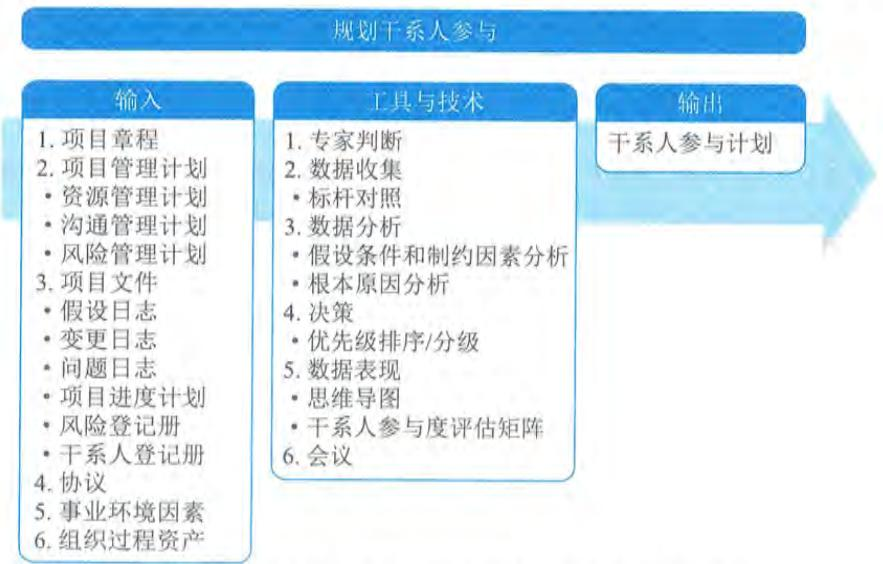  
图11-59 规划干系人参与过程的输入、工具与技术和输出

为满足项目干系人的多样性信息需求，应在项目生命周期的早期制订一份有效的计划：然后，随着干系人群体的变化，定期审查和更新该计划。在通过识别干系人过程明确最初的干系人群体之后，就应该编制第一版的干系人参与计划，然后定期更新干系人参与计划，以反映干系人群体的变化。会触发该计划更新的情况主要包括：

- 项目新阶段开始；

- 组织结构或行业内部发生变化；

- 新的个人或群体成为干系人，现有干系人不再是干系人群体的成员，或特定干系人对项目成功的重要性发生变化；

- 当其他项目过程(如变更管理、风险管理或问题管理)的输出导致需要重新审查干系人参与策略等。

上述情况都可能导致已识别干系人的相对重要性发生变化。

规划干系人参与过程的主要输入为项目管理计划和项目文件,主要工具与技术是干系人参与度评估矩阵这一数据表现技术,主要输出为干系人参与计划。

# 11.24.1 主要输入

# 1. 项目管理计划

规划干系人参与过程使用的项目管理计划组件主要包括资源管理计划、沟通管理计划和风险管理计划等。

(1) 资源管理计划。资源管理计划包含团队成员及其他干系人角色和职责的信息。

(2) 沟通管理计划。用于干系人管理的沟通策略以及用于实施策略的计划,既是项目干系人管理的各个过程的输入,又会收录来自这些过程的相关信息。

(3) 风险管理计划。风险管理计划可能包含风险临界值或风险态度,有助于选择最佳的干系人参与策略组合。

# 2. 项目文件

可用作规划干系人参与过程输入的项目文件(尤其在初始规划之后)主要包括假设日志、变更日志、问题日志、项目进度计划、风险登记册和干系人登记册等。

(1) 假设日志。假设日志中关于假设条件和制约因素的信息,可能与特定干系人关联。

(2) 变更日志。变更日志记录了对原始项目范围的变更。变更通常与具体干系人相关联,因为干系人可能是变更请求提出者、变更请求审批者、受变更实施影响者。

(3) 问题日志。为了管理和解决问题日志中的问题,需要与受影响干系人额外沟通。

(4) 项目进度计划。进度计划中的活动需要与具体干系人关联,即把特定干系人指定为活动责任人或执行者。

(5) 风险登记册。风险登记册包含项目的已识别风险,它通常会把这些风险与具体干系人关联,即把特定干系人指定为风险责任人或受风险影响者。

(6) 干系人登记册。干系人登记册提供项目干系人的清单、分类情况和其他信息。

# 11.24.2 主要工具与技术

干系人参与度评估矩阵用于将干系人当前参与水平与期望参与水平进行比较,它是对干系人参与水平进行分类的方式之一,如表11- 7所示。干系人参与水平可分为如下几种:

- 不了解型:不知道项目及其潜在影响;

- 抵制型:知道项目及其潜在影响,但抵制项目工作或成果可能引发的任何变更,此类干系人不会支持项目工作或项目成果;

- 中立型:了解项目,但既不支持,也不反对;

- 支持型:了解项目及其潜在影响,并且会支持项目工作及其成果;

- 领导型：了解项目及其潜在影响，而且积极参与，以确保项目取得成功。

表11-7 干系人参与度评估矩阵  

<table><tr><td>干系人</td><td>不了解</td><td>抵制</td><td>中立</td><td>支持</td><td>领导</td></tr><tr><td>干系人1</td><td>C</td><td></td><td></td><td>D</td><td></td></tr><tr><td>干系人2</td><td></td><td></td><td>C</td><td>D</td><td></td></tr><tr><td>干系人3</td><td></td><td></td><td></td><td>DC</td><td></td></tr></table>

在表11- 7中，C代表每个干系人的当前参与水平，而D是项目团队评估出来的、为确保项目成功所必不可少的参与水平（期望的）。应根据每个干系人的当前与期望参与水平的差距，开展必要的沟通，有效引导干系人参与项目。弥合当前与期望参与水平的差距是监督干系人参与的一项基本工作。

# 11.24.3 主要输出

干系人参与计划是项目管理计划的组成部分。该计划制定了干系人有效参与和执行项目决策的策略和行动。干系人参与计划可以是正式或非正式的，非常详细或高度概括的，这个基于项目的需要和干系人的期望。

干系人参与计划可主要包括调动干系人个人或群体参与的特定策略或方法。

干系人参与计划示例如表11- 8所示。

表11-8 干系人参与计划示例  

<table><tr><td>责任相关人
活动名称</td><td>计划时间</td><td>实际时间</td><td>最终
用户</td><td>客户/
代表</td><td>高层
经理</td><td>中层经
理</td><td>项目经理</td><td>业务/技
术专家</td></tr><tr><td>合同评审</td><td></td><td></td><td>O</td><td></td><td></td><td></td><td></td><td></td></tr><tr><td>评审技术方案建议书</td><td></td><td></td><td>O</td><td></td><td></td><td></td><td></td><td></td></tr><tr><td>评审项目总体计划</td><td></td><td></td><td>O</td><td></td><td></td><td></td><td></td><td></td></tr><tr><td>用户需求说明书评审</td><td></td><td></td><td>O</td><td></td><td></td><td></td><td></td><td></td></tr><tr><td>软件需求说明书评审</td><td></td><td></td><td>O</td><td></td><td></td><td></td><td></td><td></td></tr><tr><td>里程碑评审</td><td></td><td></td><td>O</td><td></td><td></td><td></td><td></td><td></td></tr><tr><td>计划变更评审</td><td></td><td></td><td>O</td><td></td><td></td><td></td><td></td><td></td></tr><tr><td>需求变更评审</td><td></td><td></td><td>O</td><td></td><td></td><td></td><td></td><td></td></tr><tr><td>联调测试</td><td></td><td></td><td></td><td></td><td></td><td></td><td></td><td></td></tr><tr><td>专家测试</td><td></td><td></td><td></td><td></td><td></td><td></td><td></td><td></td></tr><tr><td>验收测试</td><td></td><td></td><td></td><td></td><td></td><td></td><td></td><td></td></tr><tr><td>验收发布</td><td></td><td></td><td></td><td></td><td></td><td></td><td></td><td></td></tr><tr><td>...</td><td></td><td></td><td></td><td></td><td></td><td></td><td></td><td></td></tr></table>

备注：

1. 编制计划时，确定相关角色的人员以及参加时间，以“O”标识所参加的活动。

2. 进行活动时，填写实际参加时间，以“●”标识所参加的活动或者评审会议。

# 11.25 本章练习

# 1.选择题

(1)规划范围管理的输入不包括

A.项目章程 
B.项目管理计划

C.范围管理计划 
D.组织过程资产

参考答案:C

(2)收集需求中输入的项目文件不包括

A.假设日志 
B.需求文件

C.经验教训登记册 
D.干系人登记册

参考答案:B

(3)定义范围是制定项目和产品详细描述的过程,其主要作用是

A.描述产品、服务或成果的边界和验收标准

B.为定义产品范围和项目范围奠定基础

C.在整个项目期间对如何管理范围提供指南和方向

D.定义工作之间的逻辑顺序,以便在既定的所有项目制约因素下获得最高效率

参考答案:A

(4)创建工作分解结构(WBS)过程中的输入不包括

A.范围基准 
B.项目管理计划

C.项目范围说明书 
D.需求文件

参考答案:A

(5)规划进度管理是为规划、 和控制项目进度而制定政策、程序和文档的过程,

A.编制、管理、执行 
B.编制、管理、分解

C.管理、执行、分解 
D.编制、执行、分解

参考答案:A

(6)定义活动的主要作用是将工作包分解为进度活动,作为对项目工作进行进度估算、 的基础。

A.规划、执行、监督和控制 
B.规划、定义、监督和控制

C.规划、执行、定义和控制 
D.规划、执行、监督和定义

参考答案:A

(7) 不属于排列活动顺序的输入。

A.活动属性 
B.范围基准

C.假设日志 
D.里程碑清单

参考答案:B

(8)以下关于估算活动持续时间如何开展的描述,正确的是

A.仅开展一次

B.仅在项目的预定义点开展

C. 仅开展一次或仅在项目的预定义点开展

D. 需要在整个项目期间开展

参考答案:D

(9) 估算活动持续时间的输出不包括

A. 项目管理计划 
B. 项目文件更新

C. 持续时间估算 
D. 估算依据

参考答案:A

(10) 规划成本管理是确定如何 和控制项目成本的过程。

A. 估算、明确、管理、监督 
B. 明确、预算、管理、监督

C. 估算、预算、管理、监督 
D. 估算、预算、明确、监督

参考答案:C

(11) 制定预算是汇总所有单个活动或工作包的估算成本, 建立一个经批准的成本基准的过程, 其主要作用是

A. 根据项目类型和复杂程度确定适用于项目资源的管理方法和管理程度

B. 明确完成项目所需的资源种类、数量和特性

C. 确定可据以监督和控制项目绩效的成本基准

D. 在整个项目期间为如何管理和核实质量提供指南和方向

参考答案:C

(12) 估算活动资源是估算执行项目所需的团队资源, 以及材料、设备和用品的类型和数量的过程, 其主要作用是

A. 在整个项目期间为如何管理项目成本提供指南和方向

B. 确定项目所需的资金

C. 明确完成项目所需的资源种类、数量和特性

D. 在整个项目期间为如何管理和核实质量提供指南和方向

参考答案:C

(13) 规划风险管理是 如何实施项目风险管理活动的过程。

A. 管理 
B. 定义 
C. 规划 
D. 监督

参考答案:B

(14) 识别风险是识别 的来源, 并记录风险特征的过程。

A. 单个项目风险

B. 整体项目风险

C. 单个项目风险及整体项目风险

D. 单个项目风险或整体项目风险

参考答案:C

(15) 规划沟通管理的输入不包括

A. 项目章程 
B. 项目文件

C. 项目管理计划 
D. 沟通管理计划

参考答案:D

(16)规划干系人参与是根据干系人的需求、期望、利益和对项目的潜在影响,制定项目干系人参与项目的方法的过程,其主要作用是

A.在整个项目期间为如何管理项目成本提供指南和方向

B.确定项目所需的资金

C.提供与干系人进行有效互动的可行计划

D.为及时向干系人提供相关信息、引导干系人有效参与项目而编制书面沟通计划

参考答案:C

(17)规划采购管理是记录项目采购决策, ,识别潜在卖方的过程。

A.明确预算成本 
B.明确采购方法

C.明确采购目标 
D.明确采购质量

参考答案:B

# 2.思考题

(1)请根据你的理解简要叙述规划质量管理的定义及其主要作用。

参考答案:略

(2)规划质量管理的输入包含哪些?

参考答案:略

# 3.案例题

某安全要求较高的智能智造园区拟建设智慧安防监控平台,计划采用ARM架构CPU芯片的通用服务器,搭载适合神经网络计算的NPU芯片人工智能算力卡,使用高性能计算存储架构及零信任通信加密技术,支撑园区600路高清摄像头的监控运行。同时开发人工智能算法,对园区周界入侵、未授权人员出入安全场所、烟雾火情等不安全情形进行主动报警。报警信息在智慧安防监控平台的驾驶舱界面予以实时展现,并通过加密无线网络实时发送到相关负责人的移动终端。

项目经理根据项目章程,参考前期相关文件、历史类似项目资料、安防行业标准、信创解决方案及AI技术趋势,直接明确了项目全部范围,随后确定了完成项目的行动方案。

(1)第一段中,属于规划过程组中的哪个规划?对其做简要说明。

(2)第二段中,该项目经理有哪些错误?如何改正?

参考答案:略

