# 第12章 执行过程组

执行过程组包括完成项目管理计划中确定的工作，以满足项目要求的10个过程，包括：项目整合管理中的“指导与管理项目工作”和“管理项目知识”；项目质量管理中的“管理质量”；项目资源管理中的“获取资源”“建设团队”和“管理团队”；项目沟通管理中的“管理沟通”；项目风险管理中的“实施风险应对”；项目采购管理中的“实施采购”；项目干系人管理中的“管理干系人参与”，执行过程组各子过程之间的关系如图12- 1所示，各过程之间存在相互作用，工作并行开展。本过程组需要按照项目管理计划来协调资源，管理干系人参与，以及整合并实施项目活动。本过程组的主要作用是，根据计划执行为满足项目要求、实现项目目标所需的项目工作。执行过程组会耗费绝大多数的项目预算、资源和时间，同时开展执行过程组的过程涉及的工作，还可能会引发变更请求，一旦变更请求获得批准，则可能触发一个或多个规划过程，来修改项目管理计划、完善项目文件，甚至建立新的基准。

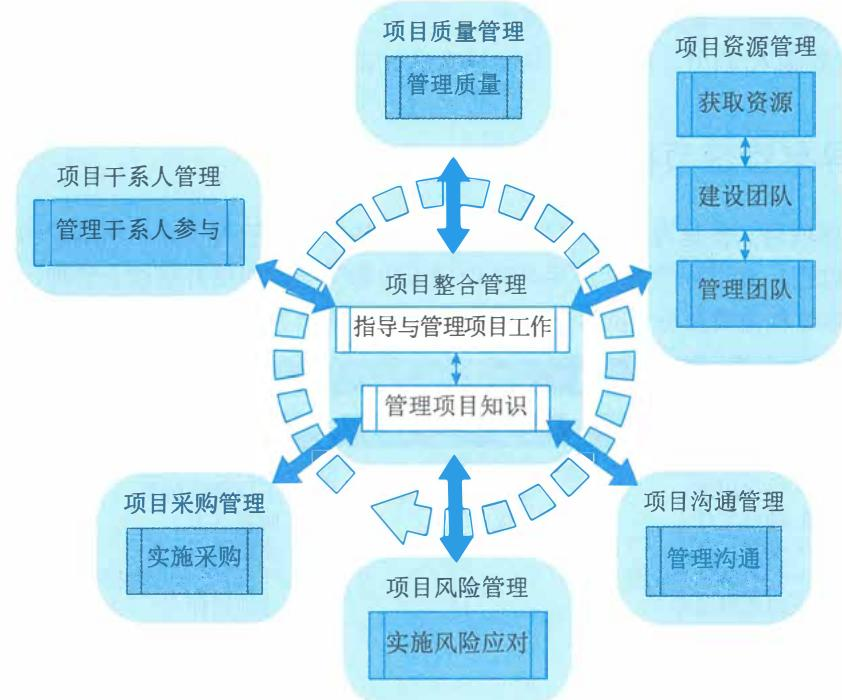  
图12-1 执行过程组各过程关系图

执行过程组需要开展以下11类工作。

（1）按照资源管理计划，从项目执行组织内部或外部获取项目所需的团队资源和实物资源。（2）对于团队资源，组建、建设和管理团队。对于实物资源，将其在正确的时间分配到正确的工作上。

（3）按照采购计划开展采购活动，从项目执行组织外部获取项目所需的资源、产品或服务。（4）领导团队按照计划执行项目工作，随时收集能真实反映项目执行情况的工作绩效数据，并完成符合范围、进度、成本和质量要求的可交付成果。（5）开展管理质量过程相关工作，有效执行质量管理体系。（6）执行经批准的变更请求，包括纠正措施、缺陷补救和预防措施。（7）执行经批准的风险应对策略和措施，降低威胁对项目的影响，提升机会对项目的影响。（8）执行沟通管理计划，管理项目信息的流动，确保干系人了解项目情况。（9）执行干系人参与计划，维护与干系人之间的关系，引导干系人的期望，促进其积极参与和支持项目。（10）开展管理项目知识过程相关工作，促进利用现有知识，并形成新知识，进行知识分享和知识转移，促进本项目顺利实施和项目执行组织的发展。

（11）对项目团队成员和项目干系人进行培训或辅导，促进其更好地参与项目。

本章对执行过程组的10个过程——“指导与管理项目工作”“管理项目知识”“管理质量”“获取资源”“建设团队”“管理团队”“实施风险应对”“实施采购”“管理沟通”“管理干系人参与”的输入/输出、工具与技术进行说明时，采取以下规则进行描述：

$\bullet$  省略常见的输入/输出、工具与技术； $\bullet$  针对主要输入/输出、重要的工具与技术进行详细阐述。

# 12.1 指导与管理项目工作

指导与管理项目工作是为实现项目目标而领导和执行项目管理计划中所确定的工作，并实施已批准变更的过程。本过程的主要作用是对项目工作和可交付成果开展综合管理，以提高项目成功的可能性。本过程需要在整个项目期间开展。图12- 2描述本过程的输入、工具与技术和输出。

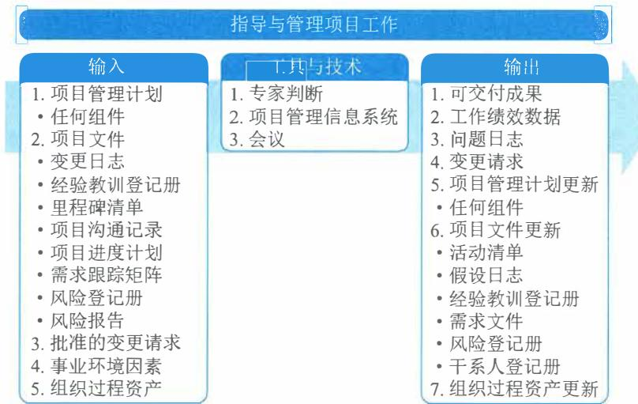  
图12-2 指导与管理项目工作过程的输入、工具与技术和输出

指导与管理项目工作包括执行项目管理计划的各种项目活动，以完成项目可交付成果并达

成既定目标,并识别必要的项目变更,提出变更请求。本过程需要分配可用资源并管理其有效使用,也需要执行因分析工作绩效数据和信息而提出的项目计划变更。指导与管理项目工作过程会受项目所在应用领域的直接影响。

项目执行阶段的开始通常由项目经理组织一次会议,项目发起人召集主要项目干系人一起参加,项目经理向主要干系人介绍项目目标与项目计划,获得他们对项目的承诺与支持,并宣布项目正式进入执行阶段。

项目经理与项目管理团队一起指导实施已计划好的项目活动,并管理项目内的各种技术接口和组织接口。指导与管理项目工作还要求回顾所有项目变更的影响,并实施已批准的变更,包括纠正措施、预防措施和(或)缺陷补救。

在指导与管理项目工作时,可以通过会议来讨论和解决项目的相关事项。参会者可包括项目经理、项目团队成员,以及与所讨论事项相关或会受该事项影响的干系人。应该明确每个参会者的角色,确保有效参会。会议类型包括(但不限于):开工会议、技术会议、敏捷或迭代规划会议、每日站会、指导小组会议、问题解决会议、进展跟进会议以及回顾会议。

在项目执行过程中,收集工作绩效数据并传达给合适的控制过程做进一步分析。通过分析工作绩效数据,得到关于可交付成果的完成情况以及与项目绩效相关的其他细节,工作绩效数据用作监控过程组的输入,并可作为反馈输入到经验教训库,以改善未来工作的绩效。

指导与管理项目工作过程的主要输入为:项目管理计划和项目文件,主要输出为可交付成果、工作绩效数据、问题日志和变更请求。

# 12.1.1 主要输入

# 1.项目管理计划

项目管理计划是说明项目执行、监控和收尾方式的一份文件,它整合并综合了所有子管理计划和基准,以及管理项目所需的其他信息。范围管理计划、需求管理计划、成本管理计划、进度管理计划、质量管理计划、范围基准、进度基准、成本基准等项目管理计划组件都可用作指导与管理项目工作过程的输入。

# 2.项目文件

可作为指导与管理项目工作过程输入的项目文件主要包括:变更日志、经验教训登记册、里程碑清单、项目沟通记录、项目进度计划、需求跟踪矩阵、风险登记册和风险报告等。

(1)变更日志。变更日志记录所有变更请求的状态。

(2)经验教训登记册。经验教训用于改进项目绩效,以免重犯错误。登记册有助于确定针对哪些方面设定规则或指南,以使团队行动保持一致。

(3)里程碑清单。里程碑清单列出特定里程碑的计划实现日期。

(4)项目沟通记录。项目沟通记录包含绩效报告、可交付成果的状态,以及项目生成的其他信息。

(5)项目进度计划。进度计划至少包含工作活动清单、持续时间、资源,以及计划的开始与完成日期。

(6)需求跟踪矩阵。需求跟踪矩阵把产品需求连接到相应的可交付成果,有助于把关注点

放在最终结果上。

(7) 风险登记册。风险登记册提供可能影响项目执行的各种威胁和机会的信息。

(8) 风险报告。风险报告提供关于整体项目风险来源的信息,以及关于已识别单个项目风险的概括信息。

# 12.1.2 主要输出

# 1. 可交付成果

可交付成果是在某一过程、阶段或项目完成时,必须产出的任何独特并可核实的产品、成果或服务能力。它通常是为实现项目目标而完成的有形的组成部分,并可包括项目管理计划的组成部分。

# 2. 工作绩效数据

工作绩效数据是在执行项目工作的过程中,从每个正在执行的活动中收集到的原始观察结果和测量值。数据通常是最低层次的细节,将交由其他过程中提炼并形成信息。在工作执行过程中收集数据,再交由10大知识领域的相应的控制过程做进一步分析。

例如,工作绩效数据包括已完成的工作、关键绩效指标(KPI)、技术绩效测量结果、进度活动的实际开始日期和完成日期、已完成的故事点、可交付成果状态、进度进展情况、变更请求的数量、缺陷的数量、实际发生的成本和实际持续时间等。

# 3. 问题日志

在整个项目生命周期中,项目经理通常会遇到问题、差距、不一致或意外冲突。项目经理需要采取某些行动加以处理,以免影响项目绩效。问题日志是一种记录和跟进所有问题的项目文件,需要记录和跟进的内容可能包括:

问题类型;

问题提出者和提出时间;

问题描述;

问题优先级;

由谁负责解决问题;

目标解决日期;

问题状态;

最终解决情况。

某项目问题日志示例如表12- 1所示。

表12-1 某项目日志框架示例  

<table><tr><td colspan="2">初始信息</td><td rowspan="2">优先级/严重性</td><td rowspan="2">描述</td><td rowspan="2">问题来
源/分类</td><td rowspan="2">纠正
措施</td><td rowspan="2">分析
原因</td><td rowspan="2">问题
发现
阶段</td><td rowspan="2">问题
注入
阶段</td><td rowspan="2">受影响
区域</td><td rowspan="2">问题跟
踪人</td><td rowspan="2">目标
日期</td><td colspan="4">跟踪/确认结果</td></tr><tr><td>#</td><td>日期</td><td>状态</td><td>日期</td><td>确认人</td><td>确认结果</td></tr><tr><td></td><td></td><td></td><td></td><td></td><td></td><td></td><td></td><td></td><td></td><td></td><td></td><td></td><td></td><td></td><td></td></tr><tr><td></td><td></td><td></td><td></td><td></td><td></td><td></td><td></td><td></td><td></td><td></td><td></td><td></td><td></td><td></td><td></td></tr></table>

问题日志可以帮助项目经理有效跟进和管理问题，确保它们得到调查和解决。作为本过程的输出，问题日志被首次创建（尽管在项目期间任何时候都可能发生问题）。在整个项目生命周期应该随同监控活动更新问题日志。

# 4. 变更请求

变更请求是关于修改文件、可交付成果或基准的正式提议。如果在开展项目工作时发现问题，就可提出变更请求，对项目政策或程序、项目或产品范围、项目成本或预算、项目进度计划、项目或产品结果的质量进行修改。其他变更请求包括必要的预防措施或纠正措施，用来防止以后的不利后果。任何项目干系人都可以提出变更请求，应该通过实施整体变更控制过程对变更请求进行审查和处理。变更请求可源自项目内部或外部，可能来自项目需求，也可能是法律（合同）强制要求。变更请求可能包括：

$\bullet$  纠正措施：为使项目工作绩效重新与项目管理计划一致，进行的有目的的活动。

$\bullet$  预防措施：为确保项目工作的未来绩效符合项目管理计划，进行的有目的的活动。

$\bullet$  缺陷补救：为了修正不一致产品或产品组件进行的有目的的活动。

$\bullet$  更新：对正式受控的项目文件或计划等进行的变更，以反映修改或增加的意见或内容。某软件研发项目变更单示例如图12- 3所示。

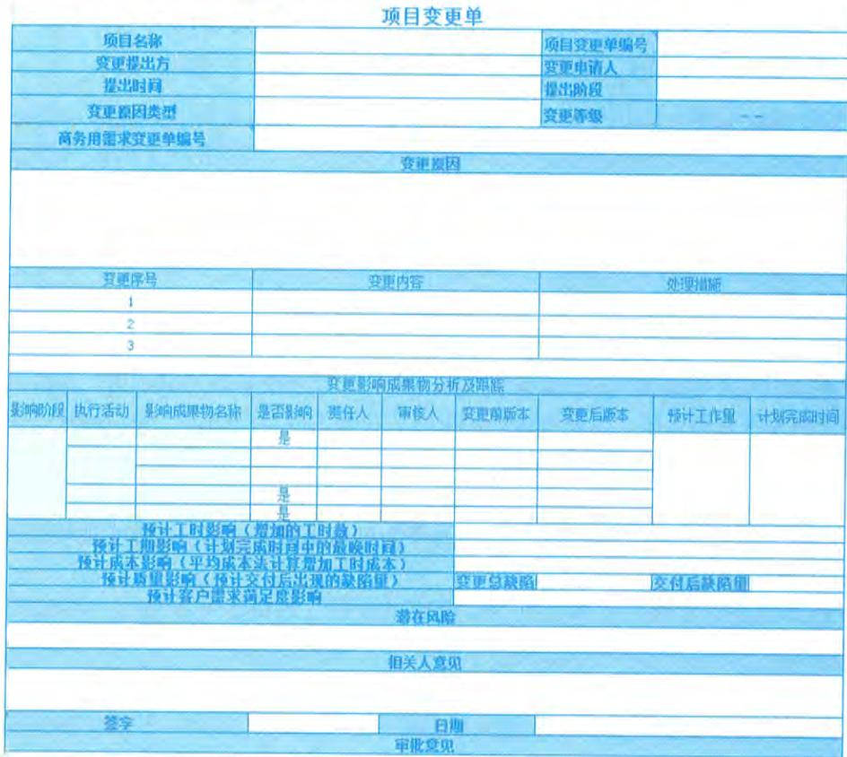  
图12-3 项目变更单示例

# 12.2 管理项目知识

12.2 管理项目知识管理项目知识是使用现有知识并生成新知识，以实现项目目标，并且帮助组织学习的过程。本过程的主要作用是，利用已有的组织知识来创造或改进项目成果，并且使当前项目创造的知识可用于支持组织运营和未来的项目或阶段。图12- 4描述本过程的输入、工具与技术和输出。

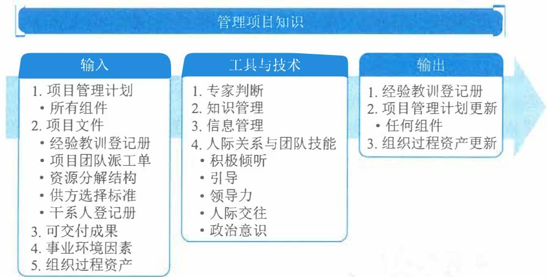  
图12-4 管理项目知识过程的输入、工具与技术和输出

从组织的角度来看，知识管理指的是确保项目团队和其他干系人的技能、经验和专业知识在项目开始之前、开展期间和结束之后都能够得到运用。知识存在于人们的思想中，我们不能强迫别人分享自己的知识或关注他人的知识。因此，知识管理最重要的环节就是营造一种相互信任的氛围，激励人们分享知识或关注他人的知识。如果不激励人们分享知识或关注他人的知识，即便最好的知识管理工具和技术也无法发挥作用。在实践中，可以联合使用知识管理工具和技术（用于人际互动）以及信息管理工具和技术（用于编撰显性知识）来分享知识。

知识管理的重点是把现有的知识条理化和系统化，以便更好地加以利用。同时，还要基于这些条理化和系统化的知识，以及对这些知识的实践来生成新的知识。知识通常分为“显性知识”（易使用文字、图片和数字进行编撰的知识）和“隐性知识”（个体知识以及难以明确表达的知识，如信念、洞察力、经验和“诀窍”)。管理项目知识的过程是要在项目环境中持续整理和利用现有的“显性知识”和“隐性知识”，并不断创造出新的知识，以便实现项目目标，促进项目执行组织持续学习。

管理项目知识的关键活动是知识分享和知识集成。项目管理要创造一个相互信任的氛围，激励大家相互分享知识。不仅要分享以数字、文字或图形方式存在的显性知识，而且要分享存在于个人头脑中的隐性知识。应明确与知识分享有关的权责，采用合适的知识分享途径和方法确保项目连续性。知识集成则是把来自不同领域、产生于不同背景的各种知识系统化。

知识管理过程通常包括:知识获取与集成、知识组织与存储、知识分享、知识转移与应用和知识管理审计。

(1)知识获取与集成。知识获取与集成是对组织内部已经存在的知识进行整理、积累或从外部获取知识的过程。显性知识获取与集成就是针对待解决的问题寻找和识别与之相关的关键性信息,并将这些信息进行提取,为形成解决方案或决策提供依据。组织显性知识获取与收集的途径一般有图书资料、内外部数据挖掘、网络搜索、营销与销售信息等。隐性知识获取方式主要有结构式访谈、行动学习标杆学习、分析学习、经验学习、综合学习和交互学习等。

(2)知识组织与存储。知识组织是以知识为对象的如整理、加工、表示、控制等一系列组织过程及其方法,其实质是以满足各类客观知识主观化需要为目的,针对客观知识的无序化状态所实施的一系列有序化组织活动。知识存储是指在组织中建立知识库,将知识存储于组织内部,知识库中包括显性知识和隐性知识。知识库是按一定要求存储在计算机中的相互关联的知识的集合,是经过分类、组织和有序化的知识集合。知识库是构造专家系统的核心和基础。构建知识库不仅是为了存储知识,更重要的目的是实现知识分享,促进组织知识流动和创新。

(3)知识分享。知识分享就是知识在人与人之间传递的过程,也就是人与人之间进行沟通的过程。知识共享定义为知识从一个个体、群体或组织向另一个个体、群体或组织转移或传播的行为。

(4)知识转移与应用。知识转移是由知识传输和知识吸收两个过程所共同组成的统一过程,只有当转移的知识保留下来,才是有效的知识转移。知识的成功转移必须完成知识传递和知识吸收两个过程,并使知识接收者感到满意。知识在组织中只有得到应用才能增加价值,知识应用决定了组织对知识的需求,是知识鉴别,创新、获取、存储和共享的参考点。

(5)知识管理审计。知识管理审计是对组织知识资产和关联的知识管理系统的评估。知识管理的审计既是组织知识管理的起点,又是组织知识管理的重点,在组织的知识管理循环中,起到了承上启下的重要作用。

知识管理的审计对象包括知识资源、安全和能力。知识资源审计是对组织知识资源进行系统、科学的考察和评估,分析组织已有的知识(知识存量)与需要的知识(知识需求),分析知识的短缺状况,针对组织的知识管理目标,提出诊断性和预测性的审计报告。知识安全审计是对组织知识资源的合理和安全使用的审计。组织知识管理的安全体系既包括知识管理系统的安全设备、软件和其他安全装置,也包括为使知识管理安全使用的安全政策、措施、策略和规章制度等。知识能力审计是对知识管理人员的素质和知识管理绩效的审计,主要包括:群体的知识管理水平是否达到当前管理的基本要求、群体的专业知识结构的合理性、人员的知识供需安排的适当性、组织主要管理人员的知识贡献与知识管理的规划是否一致、人员的知识运用能力及创新知识能力等。

管理项目知识过程的主要输入为项目管理计划、项目文件和可交付成果,主要输出为经验教训登记册。

# 12.2.1 主要输入

# 1.项目管理计划

1. 项目管理计划范围管理计划、需求管理计划、成本管理计划、进度管理计划、质量管理计划、范围基准、进度基准、成本基准等项目管理计划组件都可用作管理项目知识过程的输入。

# 2.项目文件

2. 项目文件可作为管理项目知识过程输入的项目文件主要包括:经验教训登记册、项目团队派工单、资源分解结构、供方选择标准和干系人登记册等。

(1)经验教训登记册。经验教训登记册提供了有效的知识管理实践。

(2)项目团队派工单。项目团队派工单说明了项目团队已具有的能力和经验以及可能缺乏的知识。

(3)资源分解结构。资源分解结构包含有关团队组成的信息,有助于了解团队拥有和缺乏的知识。

(4)供方选择标准。供方选择标准包含供方能力和潜能、技术专长和方法、具体的相关经验知识转移计划(包括培训计划等信息),有助于了解供方所拥有的知识。

(5)干系人登记册。干系人登记册包含已识别的干系人的详细情况,有助于了解他们可能拥有的知识。

# 3.可交付成果

3. 可交付成果可交付成果是在某一过程、阶段或项目完成时,必须产出的任何独特的、可核实的产品、成果或服务能力。它通常是为实现项目目标而完成的、有形的、项目结果的组成部分,包括项目管理计划的组成部分。

# 12.2.2 主要输出

经验教训登记册可以包含情况的类别和描述,还可以包括与情况相关的影响、建议和行动方案。经验教训登记册可以记录遇到的挑战、问题、意识到的风险和机会,或其他适用的内容。

经验教训登记册在项目早期创建,作为本过程的输出。因此,在整个项目期间,它可以作为很多过程的输入,也可以作为输出而不断更新,参与工作的个人和团队也参与记录经验教训。可以通过视频、图片、音频或其他合适的方式记录知识,确保有效吸取经验教训。

项目或阶段结束时,应把相关信息归入经验教训知识库,成为组织过程资产的一部分。

# 12.3 管理质量

12.3 管理质量管理质量是把组织的质量政策用于项目,并将质量管理计划转化为可执行的质量活动的过程。本过程的主要作用是提高实现质量目标的可能性,以及识别无效过程和导致质量低劣的原因,促进质量过程改进。图12- 5描述本过程的输入、工具与技术和输出。

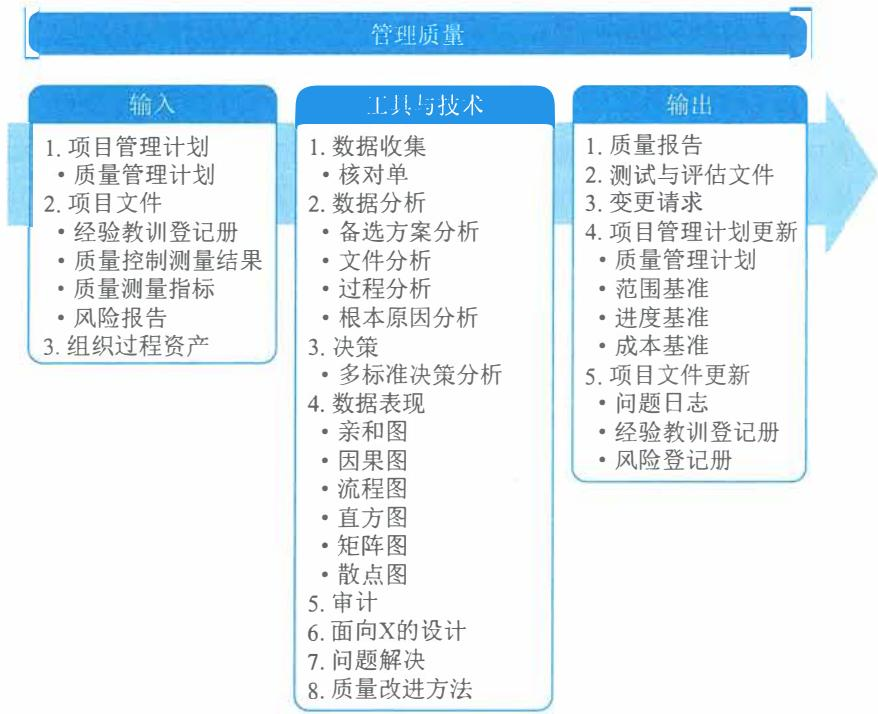  
图12-5 管理质量过程的输入、工具与技术和输出

管理质量过程执行在项目质量管理计划中所定义的一系列有计划、有系统的行动和过程，这有助于：

（1）通过执行有关产品特定方面的设计准则，设计出最优的、成熟的产品。

（2）建立信心，相信通过质量保证工具和技术（如质量审计和故障分析）可以使输出在完工时满足特定的需求和期望。

（3）确保使用质量过程并确保其使用能够满足项目的质量目标。

（4）提高过程和活动的效率与效果，获得更好的成果和绩效并提高干系人满意度。

项目经理和项目团队可以通过组织的质量保证部门或其他组织职能执行某些管理质量活动，例如故障分析、实验设计和质量改进。质量保证部门在质量工具和技术的使用方面通常拥有跨组织经验，是良好的项目资源。

管理质量是所有人的共同职责，包括项目经理、项目团队、项目发起人、执行组织的管理层，甚至是客户。所有人在管理项目质量方面都扮演一定的角色，尽管这些角色的人数和工作量不同。参与质量管理工作的程度取决于所在行业和项目管理风格。在敏捷型项目中，整个项目期间的质量管理由所有团队成员执行；但在传统项目中，质量管理通常是特定团队成员的职责。

管理质量过程的主要工作包括：

（1）执行质量管理计划中规划的质量管理活动，确保项目工作过程和工作成果达到质量测量指标及质量标准。（2）把质量标准和质量测量指标转化成测试与评估文件，供控制质量过程使用。（3）根据风险评估报告识别与处置项目质量目标的机会和威胁，以便提出必要的变更请求，

如调整质量管理方法或质量测量指标等。

(4) 根据质量控制测量结果评价质量管理绩效及质量管理体系的合理性, 以便提出必要的变更请求, 实现过程改进。

(5) 质量管理持续优化改进, 需参考已记入经验教训登记册的质量管理经验教训。

(6) 根据质量管理计划、质量测量指标、质量控制测量结果、管理质量过程的实施情况等, 编制质量报告, 并向项目干系人报告项目质量绩效。

管理质量过程的主要输入为项目管理计划和项目文件, 主要工具与技术包括数据收集、数据分析、决策、数据表现、审计、面向 X 的设计、问题解决和质量改进方法, 主要输出为质量报告、测试与评估文件。

# 12.3.1 主要输入

# 1. 项目管理计划

质量管理计划是项目管理计划的组件。质量管理计划定义了项目和产品质量的可接受水平, 并描述了如何确保可交付成果和过程达到这一质量水平。质量管理计划还描述了不合格产品的处理方式以及需要采取的纠正措施。

# 2. 项目文件

可作为管理质量过程输入的项目文件主要包括: 经验教训登记册、质量控制测量结果、质量测量指标和风险报告等。

(1) 经验教训登记册。项目早期与质量管理有关的经验教训, 可以运用到项目后期阶段, 以提高质量管理的效率与效果。

(2) 质量控制测量结果。质量控制测量结果用于分析和评估项目过程和可交付成果的质量是否符合执行组织的标准或特定要求。质量控制测量结果也有助于分析这些测量结果的产生过程, 以确定实际测量结果的正确程度。

(3) 质量测量指标。核实质量测量指标是控制质量过程的一个环节。管理质量过程依据这些质量测量指标设定项目的测试场景和可交付成果, 用作质量改进的依据。

(4) 风险报告。使用风险报告识别整体项目风险, 这些风险能够影响项目的质量目标。

# 12.3.2 主要工具与技术

# 1. 数据收集

核对单是一种结构化工具, 通过具体列出各检查项来核实一系列步骤是否已经执行, 确保在质量控制过程中规范地执行经常性任务。在管理质量过程中, 可以用核对单收集数据, 反映该做的事情是否已做, 以及是否已做到符合要求。

# 2. 数据分析

数据分析包括备选方案分析、文件分析、过程分析和根本原因分析。备选方案分析用于分析多种可选的质量活动实施方案, 并做出选择。文件分析用于分析质量控制测量结果、质量测试与评估结果、质量报告等, 以便判断质量过程的实施情况好坏。过程分析用于把一个生产过

程分解成若干环节，逐一加以分析，发现最值得改进的环节。根本原因分析用于分析导致某个或某类质量问题的根本原因。

# 3.决策

3. 决策多标准决策分析是借助决策矩阵，用系统分析方法建立多种标准，以对众多需要决策内容进行评估和排序。可用多标准决策分析技术来对多种质量活动实施方案进行排序，并作出选择。

# 4.数据表现

数据表现中包括亲和图、因果图、流程图、直方图、矩阵图和散点图等。

（1）亲和图。亲和图用于根据其亲近关系对导致质量问题的各种原因进行归类，展示最应关注的领域，如图12-6所示。

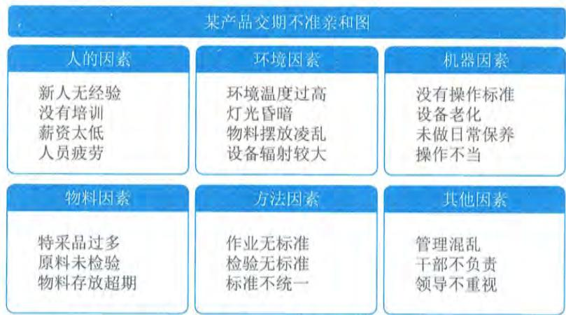  
图12-6 亲和图

（2）因果图。因果图也叫鱼刺图或石川图，用来分析导致某一结果的一系列原因，有助于人们进行创造性、系统性思维，找出问题的根源。它是进行根本原因分析的常用方法，如图12-7所示。

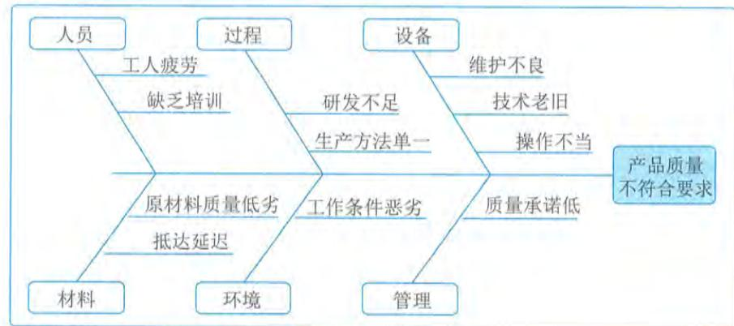  
图12-7 因果图

(3)流程图。流程图展示了引发缺陷的一系列步骤,用于完整地分析某个或某类质量问题产生的全过程。

(4)直方图。直方图是一种显示各种问题分布情况的柱状图。每个柱子代表一个问题,柱子的高度代表问题出现的次数。直方图可以展示每个可交付成果的缺陷数量、缺陷成因的排列、各个过程的不合规次数,或项目与产品缺陷的其他表现形式。

(5)矩阵图。矩阵图在行列交叉的位置展示因素、原因和目标之间的关系强弱。根据可用来比较因素的数量,有图12-8所示的六种常用的矩阵图。

- 屋顶形:用于表示间属一组变量的各个变量之间的关系。

- L形:通常为倒L形。用于表示两组变量之间的关系。

- T形:用于表示一组变量分别与另两组变量的关系。后两组变量之间没有关系。

- X形:用于表示四组变量之间的关系。每组变量同时与其他两组有关系。

- Y形:用于表示三组变量之间的两两关系。每两组变量之间都有关系。

- C形:用于表示三组变量之间的关系。三组变量同时有关系。

  
L形

  
T形

  
X形

  
屋顶形

  
图12-8 矩阵图

(6)散点图。散点图是一种展示两个变量之间的关系的图形,它能够展示两支轴的关系,一般一支轴表示过程、环境或活动的任何要素,另一支轴表示质量缺陷。散点图一般用  $x$  轴表示自变量,  $y$  轴表示固变量,定量地显示两个变量之间的关系,是最简单的回归分析工具。所有数据点的分布越靠近某条斜线,两个变量之间的关系就越密切,如图12-9所示。

# 5. 审计

审计是用于确定项目活动是否遵循了组织和项目的政策、过程与程序的一种结构化且独立的过程。质量审计是在对质量管理活动进行独立的、结构化的审查,以便总结质量管理方面的经验教训。质量审计通常由项目外部的团队开展,如组织内部审计部门、项目管理办公室或组织外部的审计师。质量审计目标一般包括:

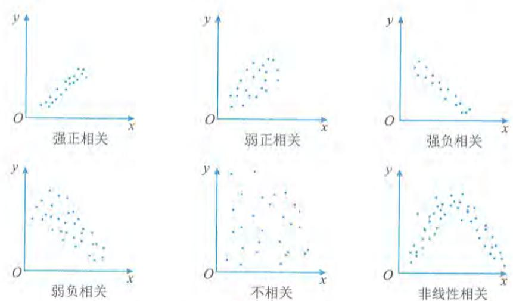  
图12-9 散点图

- 识别全部正在实施的良好及最佳实践;- 识别所有违规做法、差距及不足;- 分享所在组织和（或）行业中类似项目的良好实践;- 积极、主动地提供协助，以改进过程的执行，从而帮助团队提高生产效率;- 强调每次审计都应对组织经验教训知识库的积累做出贡献。

# 6. 面向 X 的设计

面向 X 的设计中的 X 既可以是卓越（excellence）的意思，也可以是产品的某种特性，如可靠性、可用性、安全性和经济性。前者追求整个产品在整个生命周期中的最优化，后者重点改进产品的某个特性。使用面向 X 的设计可以降低成本、改进质量、提高绩效和客户满意度。

# 7. 问题解决

问题解决是指用结构化的方法从根本上解决在控制质量过程或质量审计中发现的质量管理问题。从定义问题、识别根本原因，到形成备选解决方案、选择最好的方案，再到实施选定的方案、核实解决效果。

# 8. 质量改进方法

在管理质量过程中，要基于过程分析的结果，用质量改进方法去做过程改进。过程改进旨在使生产过程更加顺畅、稳定，减少生产过程中的浪费及降低产品缺陷率。可以用来做过程改进的方法有很多，如戴明环、六西格玛、精益生产和精益六西格玛等。

# 12.3.3 主要输出

# 1. 质量报告

质量报告可能是图形、数据或定性文件，其中包含的信息可帮助其他过程和部门采取纠正措施，以实现项目质量目标。质量报告的信息可以包含团队上报的质量管理问题，针对过程、

项目和产品的改善建议、纠正措施建议，以及在控制质量过程中发现的情况的概述。

# 2.测试与评估文件

可基于行业需求和组织模板创建测试与评估文件。它们是控制质量过程的输入，用于评估质量目标的实现情况。这些文件可能包括专门的核对单（又称检查单）和详尽的需求跟踪矩阵。某项目需求说明书检查单示例如图12- 10所示。

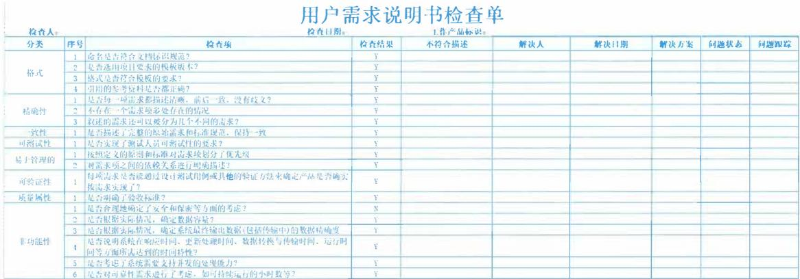  
图12-10 需求说明书检查单示例

# 12.4 获取资源

获取资源是获取项目所需的团队资源、设施、设备、材料、用品和其他资源的过程。本过程的主要作用是，概述和指导资源的选择，并将其分配给相应的活动。本过程应根据需要在整个项目期间定期开展。图12- 11描述本过程的输入、工具与技术和输出。

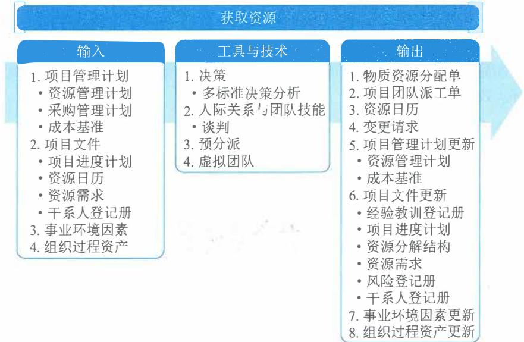  
图12-11 获取资源过程的输入、工具与技术和输出

获取资源过程旨在以正确的方式在正确的时间获取适合的人力资源和实物资源。项目所需资源可能来自项目执行组织的内部或外部。内部资源由职能经理或资源经理负责获取(分配),外部资源则是通过采购过程获得。在矩阵型组织结构下,项目经理需要向各职能部门调配人员。项目经理可能因组织的集体劳资协议而不得不使用某些人员,也可能因组织中的相关规定而必须或不能使用某些人员。在这些情况下,项目经理就没有获取人力资源的直接控制权,因此会面临更大的挑战。项目经理或项目团队应该进行有效谈判,并影响那些能为项目提供所需团队和实物资源的人员。

本过程还需要对所获取的资源进行分配,并形成相应的资源分配文件,包括物质资源分配单和项目团队派工单。项目团队派工单可以是写明团队成员的岗位信息的成员名单,也可以是已经插入成员姓名的项目计划。对于设备、设施和人员,还需要确定究竟什么时候可用于本项目,编制出相应的资源日历。

对所获得的团队成员,必须仔细分析他们的性格、态度、能力、胜任力和可用性等,并基于分析结果进行工作分配,确定该采用什么样的领导风格和手段去启发、激励和影响他们。

获取资源过程的主要输入为项目管理计划和项目文件;主要工具与技术包括决策、人际关系与团队技能、预分派、虚拟团队:主要输出为物质资源分配单、项目团队派工单和资源日历。

# 12.4.1 主要输入

# 1. 项目管理计划

获取资源过程使用的项目管理计划组件主要包括:资源管理计划、采购管理计划和成本基准等。

(1) 资源管理计划。资源管理计划为如何获取项目资源提供指南。

(2) 采购管理计划。采购管理计划提供了将从项目外部获取的资源的信息,包括如何将采购与其他项目工作整合起来,以及涉及资源采购工作的干系人。

(3) 成本基准。成本基准提供了项目活动的总体预算。

# 2. 项目文件

可作为获取资源过程输入的项目文件主要包括:项目进度计划、资源日历、资源需求和干系人登记册等。

(1) 项目进度计划。项目进度计划展示了各项活动及其开始和结束日期,有助于确定需要提供和获取资源的时间。

(2) 资源日历。资源日历记录了每个项目资源在项目中的可用时间段。对各个资源的可用性和时间限制(包括时区、工作时间、休假时间、当地节假日、维护计划和在其他项目的工作时间)的良好了解,能够支持编制出可靠的进度计划。资源日历需要在整个项目过程中渐进明细和更新。资源日历是获取资源过程的输出,在重复本过程时随时可用。

(3) 资源需求。资源需求识别了需要获取的资源。

(4) 干系人登记册。干系人登记册可能会发现干系人对项目特定资源的需求或期望,在获取资源过程中应加以考虑。

# 12.4.2 主要工具与技术

获取资源的工具主要包括决策、人际关系与团队技能、预分派以及虚拟团队。

# 1.决策

多标准决策分析可用于获取资源过程的决策，选择标准常用于选择项目的物质资源或项目团队。使用多标准决策分析工具制定出标准，用于对潜在资源进行评级或打分（例如，在内部和外部团队资源之间进行选择）。根据所选标准的相对重要性对其进行加权，加权值可能因资源类型的不同而发生变化。可使用的选择标准包括：

可用性：确认资源能否在项目所需时段内为项目所用。

成本：确认增加资源的成本是否在规定的预算内。

能力：确认团队成员是否提供了项目所需的能力。

经验：确认团队成员具备项目成功所需的相关经验。

知识：团队成员是否掌握关于客户、执行过的类似项目和项目环境细节的相关知识。

技能：确认团队成员拥有使用项目工具的相关技能。

态度：团队成员能否与他人协同工作，以形成有凝聚力的团队。

其他客观因素：团队成员的位置、时区和沟通能力。

# 2.人际关系与团队技能

适用于本过程的人际关系与团队技能一般为谈判。很多项目需要针对所需资源进行谈判，项目管理团队需要与下列各方谈判：

职能经理：确保项目在要求的时限内获得最佳资源，直到完成职责。

执行组织中的其他项目管理团队：合理分配稀缺或特殊资源。

外部组织和供应商：提供合适的、稀缺的、特殊的、合格的、经认证的或其他特殊的团队或物质资源。特别需要注意与外部谈判有关的政策、惯例、流程、指南、法律及其他标准。

# 3.预分派

预分派指事先确定项目的物质或团队资源，下列情况需要进行预分派：

在竞标过程中承诺分派特定人员进行项目工作：

项目取决于特定人员的专有技能：

在完成资源管理计划的前期工作之前，制定项目章程过程或其他过程已经指定了某些团队成员的工作。

# 4.虚拟团队

在互联网日益发达的今天，项目经理可以借助电子邮件、电话会议、社交媒体、网络会议和视频会议等沟通技术组建虚拟团队来提高获取人力资源的灵活性，例如，把不同物理地点的人招募到项目团队中。因为虚拟团队成员日常并不面对面集中办公，而是主要通过网络联系，所以他们之间的沟通和团队建设会更加困难。虚拟团队特别需要有效的沟通管理计划与真正的

团队建设。应该在项目关键时点（如阶段开始或结束时）把虚拟团队成员召集在一起进行临时的集中办公（如开会），以加强团队建设。

# 12.4.3 主要输出

获取资源后，对资源的分配包括物质资源和人力资源的分配。

# 1. 物质资源分配单

物质资源分配单记录了项目将使用的材料、设备、用品、地点和其他实物资源。

# 2. 项目团队派工单

项目团队派工单记录了团队成员及其在项目中的角色和职责，可包括项目团队名单，还需要把人员姓名插入项目管理计划的其他部分，如项目组织图和进度计划。

# 3. 资源日历

资源日历识别了每种具体资源可用时的工作日、班次、正常营业的上下班时间、周末和公共假期。在规划活动期间，潜在的可用资源信息（如团队资源、设备和材料）用于估算资源可用性。资源日历规定了在项目期间确定的团队和实物资源何时可用、可用多久。这些信息可以在活动或项目层面建立，考虑了诸如资源经验和（或）技能水平以及不同地理位置等属性。

# 12.5 建设团队

建设团队是提高工作能力、促进团队成员互动、改善团队整体氛围，以提高项目绩效的过程。本过程的主要作用是，改进团队协作、增强人际关系技能、激励员工、减少摩擦以及提升整体项目绩效。本过程需要在整个项目期间开展。图12- 12描述本过程的输入、工具与技术和输出。

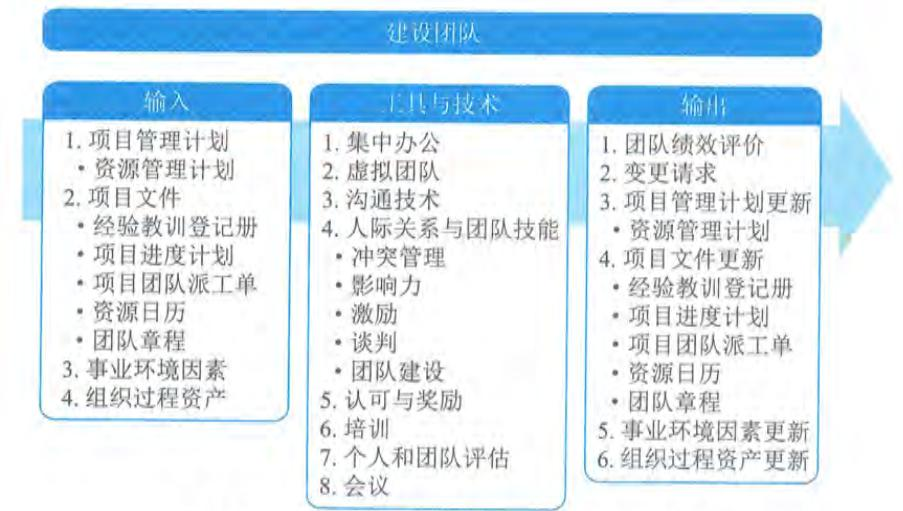  
图12-12 建设团队过程的输入、工具与技术和输出

项目经理应创建一个能促进团队协作的环境,并通过给予挑战与机会、提供及时反馈与所需支持,以及认可与奖励优秀绩效,不断激励团队。可实现团队高效运行的行为主要包括:

$\bullet$  使用开放与有效的沟通;

$\bullet$  创造团队建设机遇;

$\bullet$  建立团队成员间的信任;

$\bullet$  以建设性方式管理冲突;

$\bullet$  鼓励合作型的问题解决方法;

$\bullet$  鼓励合作型的决策方法等。

项目经理在全球化环境和富有文化多样性的项目中工作,团队成员通常来自不同的行业,讲不同的语言,有时甚至会在工作中使用一种特别的"团队语言"或文化规范,而不是使用他们的母语;项目管理团队应该利用文化差异,在整个项目生命周期中致力于发展和维护项目团队,并促进在相互信任的氛围中充分协作;通过建设项目团队,可以改进人际技巧、技术能力、团队环境及项目绩效。在整个项目生命周期中,团队成员之间都要保持明确、及时、有效(包括效果和效率两个方面)的沟通。建设项目团队的目标包括:

$\bullet$  提高团队成员的知识和技能:以提高他们完成项目可交付成果的能力,并降低成本、缩短工期和提高质量。

$\bullet$  提高团队成员之间的信任和认同感:以提高士气、减少冲突和增进团队协作。

$\bullet$  创建富有生气、凝聚力和协作性的团队文化:一是提高个人和团队生产率,振奋团队精神,促进团队合作;二是促进团队成员之间的交叉培训和辅导,以分享知识和经验。

$\bullet$  提高团队参与决策的能力:使他们承担起对解决方案的责任,从而提高团队的生产效率,获得更有效和高效的成果等。

有一种关于团队发展的模型叫塔克曼阶梯理论,在该理论中提出团队建设通常要经过形成阶段、震荡阶段、规范阶段、成熟阶段和解散阶段。通常这五个阶段按顺序进行,有时团队也会停滞在某个阶段或退回到较早的阶段;而如果团队成员曾经共事过,项目团队建设也可跳过某个阶段。

(1)形成阶段。团队成员相互认识,并了解项目情况及他们在项目中的正式角色与职责。在这一阶段,团队成员倾向于相互独立,不一定开诚布公。

(2)震荡阶段。团队开始从事项目工作、制定技术决策和讨论项目管理方法。如果团队成员不能用合作和开放的态度对待不同观点和意见,团队环境可能变得事与愿违。

(3)规范阶段。团队成员开始协同工作,并调整各自的工作习惯和行为来支持团队,团队成员会学习相互信任。

(4)成熟阶段。团队就像一个组织有序的单位那样工作,团队成员之间相互依靠,平稳高效地解决问题。

(5)解散阶段。团队完成所有工作,团队成员离开项目。通常在项目可交付成果完成之后,或者,在结束项目或阶段过程中,释放人员,解散团队。

某个阶段持续时间的长短,取决于团队活力、团队规模和团队领导力。项目经理应该对团

队活力有较好的理解，以便有效地带领团队经历所有阶段。

建设团队过程的主要输入为项目管理计划和项目文件，主要输出为团队绩效评价。

# 12.5.1 主要输入

# 1.项目管理计划

1. 项目管理计划项目管理计划组件包括资源管理计划。资源管理计划为如何通过团队绩效评价和其他形式的团队管理活动，为项目团队成员提供奖励、提出反馈、增加培训或采取惩罚措施提供了指南。

# 2.项目文件

可作为建设团队过程输入的项目文件主要包括：经验教训登记册、项目进度计划、项目团队派工单、资源日历和团队章程等。

（1）经验教训登记册。项目早期与团队建设有关的经验教训可以运用到项目后期阶段，以提高团队绩效。

（2）项目进度计划。项目进度计划定义了如何以及何时为项目团队提供培训，以培养项目不同阶段所需的能力，并根据项目执行期间的任何差异，识别需要的团队建设策略。

（3）项目团队派工单。项目团队派工单识别了团队成员的角色与职责。针对不同岗位的成员开展不同的团队建设活动。

（4）资源日历。资源日历定义了项目团队成员何时能参与团队建设活动，有助于说明团队在整个项目期间的可用性。

（5）团队章程。团队章程用于指导团队建设的高层文件，包含团队工作指南。团队价值观和工作指南为描述团队的合作方式提供了架构。

# 12.5.2 主要输出

随着项目团队建设工作的开展，项目管理团队应该对项目团队的有效性进行正式或非正式的评价。有效的团队建设策略和活动可以提高团队绩效，从而提高实现项目目标的可能性。评价团队有效性的指标可包括：

- 个人技能的改进，从而使成员更有效地完成工作任务。- 团队能力的改进，从而使团队成员更好地开展工作。- 团队成员离职率的降低。- 团队凝聚力的加强，从而使团队成员公开分享信息和经验，并互相帮助来提高项目绩效。

# 12.6 管理团队

12.6 管理团队管理团队是跟踪团队成员工作表现、提供反馈、解决问题并管理团队变更，以优化项目绩效的过程。本过程的主要作用是，影响团队行为、管理冲突以及解决问题。本过程需要在整个项目期间开展。图 12-13 描述本过程的输入、工具与技术和输出。

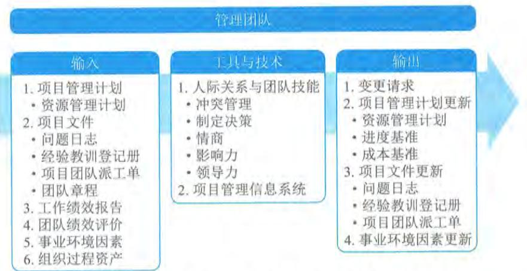  
图12-13 管理团队过程的输入、工具与技术和输出

管理团队需要借助多方面的管理和领导力技能, 来促进团队协作, 整合团队成员的工作, 从而创建高效团队。进行团队管理, 需要综合运用各种技能, 特别是沟通、冲突管理、谈判和领导技能。项目经理应留意团队成员是否有意愿和有能力完成工作, 然后相应地调整管理和领导力方式。管理团队的主要工作包括:

管理团队的主要工作包括:

- 在管理团队的过程中, 分析冲突背景、原因和阶段, 采用适当方法解决冲突。- 考核团队绩效并向成员反馈考核结果。- 持续评估工作职责的落实情况, 分析团队绩效的改进情况, 考核培训、教练和辅导的效果。- 持续评估团队成员的技能并提出改进建议, 持续评估妨碍团队的困难和障碍的排除情况, 持续评估与成员的工作协议的落实情况。- 发现、分析和解决成员之间的误解, 发现和纠正违反基本规则的言行。- 对于虚拟团队, 则还要持续评估虚拟团队成员参与的有效性。管理团队过程的主要输入为项目管理计划、项目文件、工作绩效报告、团队绩效评价, 主要工具与技术包括人际关系与团队技能、项目管理信息系统。

管理团队过程的主要输入为项目管理计划、项目文件、工作绩效报告、团队绩效评价, 主要工具与技术包括人际关系与团队技能、项目管理信息系统。

# 12.6.1 主要输入

# 1. 项目管理计划

项目管理计划组件包括资源管理计划等。资源管理计划为如何管理和最终遣散项目团队资源提供指南。

# 2. 项目文件

可作为管理团队过程输入的项目文件主要包括: 问题日志、经验教训登记册、项目团队派工单和团队章程等。

(1) 问题日志。在管理项目团队过程中, 可用问题日志记录由谁负责在规定的目标时间内解决特定问题, 并监督解决情况。

(2)经验教训登记册。项目早期的经验教训可以运用到项目后期阶段,以提高团队管理的效率与效果。

(3)项目团队派工单。项目团队派工单识别了团队成员的角色与职责。

(4)团队章程。团队章程为团队应如何决策、举行会议和解决冲突提供指南。

# 3.工作绩效报告

3. 工作绩效报告工作绩效报告是为制定决策、采取行动或引起关注所形成的实物或电子工作绩效信息,它包括从进度控制、成本控制、质量控制和范围确认中得到的结果,有助于项目团队管理。绩效报告和相关预测报告中的信息,有助于确定未来的团队资源需求、认可与奖励,以及更新资源管理计划。

# 4.团队绩效评价

4. 团队绩效评价项目管理团队应该持续地对项目团队绩效进行正式或非正式的评价。不断地评价项目团队绩效,有助于采取措施解决问题、调整沟通方式、解决冲突和改进团队互动。

# 12.6.2 主要工具与技术

管理团队的工具与技术包括人际关系与团队技能、项目管理信息系统。

# 1.人际关系与团队技能

适用于管理团队的人际关系与团队技能主要包括冲突管理、制定决策、情商、影响力和领导力等。

(1)冲突管理。冲突是指双方或多方的意见或行动不一致。冲突不仅是不可避免的,而且适当数量和性质的冲突是有益的,有利于提高团队的创造力。有效地管理冲突,有利于加强团队建设,提高项目绩效。冲突的来源包括资源稀缺、进度优先级排序和个人工作风格差异等。冲突的发展划分成如下五个阶段:

- 潜伏阶段:冲突潜伏在相关背景中,例如,对两个工作岗位的职权描述存在交叉。

- 感知阶段:各方意识到可能发生冲突,例如,人们发现了岗位描述中的职权交叉。

- 感受阶段:各方感受到了压力和焦虑,并想要采取行动来缓解压力和焦虑。例如,某人想要把某种职权完全归属于自己。

- 呈现阶段:一方或各方采取行动,使冲突公开化。例如,某人采取行动行使某种职权,从而与也想要行使该职权的人产生冲突。

- 结束阶段:冲突呈现之后,经过或长或短的时间,得到解决。例如,该职权被明确地归属于某人。

在冲突发展的潜伏阶段和感知阶段,重点是预防冲突。在冲突发展进入感受阶段及呈现阶段后,则重点在解决冲突。常用的冲突解决方法如下:

- 撤退/回避:从实际或潜在冲突中退出,将问题推迟到准备充分的时候,或者将问题推给其他人解决。

- 缓和/包容:强调一致而非差异:为维持和谐与关系而退让一步,考虑其他方的需要。

- 妥协/调解: 为了暂时或部分解决冲突, 寻找能让各方都在一定程度上满意的方案。但这种方法有时会导致"双输"局面。

- 强迫/命令: 以牺牲其他方为代价, 推行某一方的观点; 只提供赢输方案。通常是利用权力来强行解决紧急问题, 这种方法通常会导致"赢输"局面。

- 合作/解决问题: 综合考虑不同的观点和意见, 采用合作的态度和开放式对话引导各方达成共识和承诺。这种方法可以带来双赢局面。

(2) 制定决策。决策包括谈判能力以及影响组织与项目管理团队的能力。进行有效决策需要:

- 着眼于所要达到的目标:

- 遵循决策流程:

- 研究环境因素:

- 分析可用信息:

- 激发团队创造力:

- 理解风险等。

(3) 情商。情商指识别、评估和管理个人情绪、他人情绪及团体情绪的能力。项目管理团队能用情商来了解、评估及控制项目团队成员的情绪, 预测团队成员的行为, 确认团队成员的关注点及跟踪团队成员的问题, 来达到减轻压力、加强合作的目的。

(4) 影响力。影响力主要体现在说服他人、清晰表达观点和立场、积极且有效的倾听、了解并综合考虑各种观点、收集相关信息等方面, 在维护相互信任的关系下, 解决问题并达成一致意见。

(5) 领导力。成功的项目需要强有力的领导技能。领导力是领导团队、激励团队做好本职工作的能力。

# 2. 项目管理信息系统

项目管理信息系统可包括资源管理或进度计划软件, 可用于在各个项目活动中管理和协调团队成员。

# 12.7 管理沟通

管理沟通是确保项目信息及时且恰当地收集、生成、发布、存储、检索、管理、监督和最终处置的过程。本过程的主要作用是, 促成项目团队与干系人之间的有效率且有效果的沟通。图12- 14描述本过程的输入、工具与技术和输出。

管理沟通的主要工作是根据项目管理计划中的沟通管理计划有效率且有效果地开展沟通, 得到项目沟通记录。有效率的沟通是指只给项目干系人提供他们所需要的信息, 但是不提供多余的信息。有效果的沟通是指在正确的时间把正确的信息发送给正确的人, 以便信息起到正确的作用。项目管理计划中的资源管理计划, 有利于为协调和管理资源而开展有效的沟通; 干系人参与计划则有利于为引导干系人合理参与项目而开展沟通。

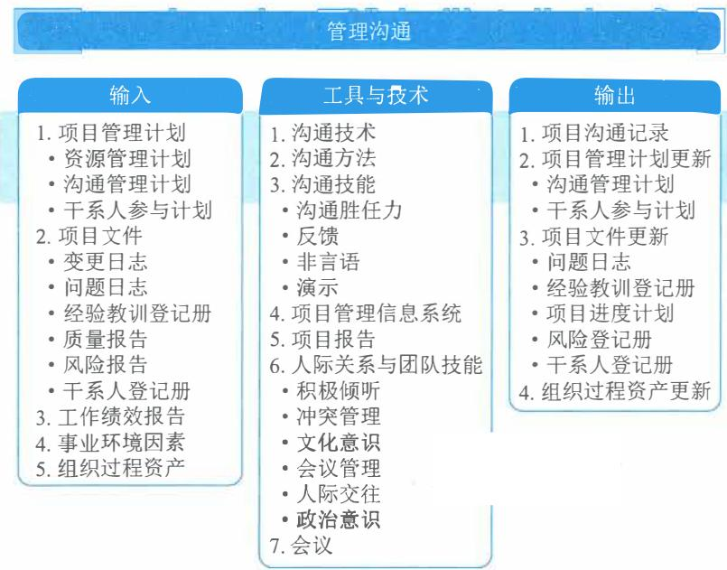  
图12-14 管理沟通过程的输入、工具与技术和输出

管理沟通过程中应将工作绩效报告发送给项目干系人，也应该在管理沟通过程中把各种项目文件发送给项目干系人，如质量报告、风险报告，有些项目文件，如变更日志和问题日志，即便不需要或不应该完整地发给项目干系人，也应该以合理的方式把其中的部分内容传递给项目干系人。

管理沟通过程会涉及与开展有效沟通有关的所有方面，包括使用适当的技术、方法和技巧。此外，它还应允许沟通活动具有灵活性，允许对方法和技术进行调整，以满足干系人及项目不断变化的需求。本过程不局限于发布相关信息，它还设法确保信息以适当的格式正确生成和送达目标受众。本过程也为干系人提供机会，允许他们参与提供更多信息、澄清和讨论。有效的沟通管理需要借助的技术主要包括：发送方- 接收方模型、媒介选择、写作风格、会议管理、演示、引导和积极倾听等。

（1）发送方-接收方模型：运用反馈循环，为互动和参与提供机会，并清除妨碍有效沟通的障碍。

（2）媒介选择：为满足特定的项目需求而使用合理的沟通方法。例如，何时进行书面沟通或口头沟通，何时准备非正式备忘录或正式报告，何时使用推式或拉式沟通，以及该选择何种沟通技术。

（3）写作风格：选择适当的语态、句子结构，以及使用适当的词汇。

（4）会议管理：准备议程，邀请重要参会者并确保他们出席；处理会议现场发生的冲突，或因对会议纪要和后续行动跟进不力而导致的冲突，或因不当人员与会而导致的冲突。

（5）演示：了解肢体语言和视觉辅助设计的作用。

（6）引导：达成共识、克服障碍（如小组缺乏活力），及维持小组成员兴趣和热情。

（7）积极倾听：积极倾听包括告知已收到、澄清与确认信息、理解，以及消除妨碍理解的障碍。

管理沟通过程的主要输入为项目管理计划、项目文件和工作绩效报告,主要工具与技术包括沟通技术、沟通方法、沟通技能、项目管理信息系统、项目报告、人际关系与团队技能和会议,主要输出为项目沟通记录。

# 12.7.1 主要输入

# 1. 项目管理计划

管理沟通过程使用的项目管理计划组件主要包括:管理资源计划、沟通管理计划和干系人参与计划等。

(1) 资源管理计划:描述为管理团队或物质资源所需开展的沟通。

(2) 沟通管理计划:描述将如何对项目沟通进行规划、结构化和监控。

(3) 干系人参与计划:描述如何用适当的沟通策略引导干系人参与项目。

# 2. 项目文件

可作为管理沟通过程输入的项目文件主要包括:变更日志、问题日志、经验教训登记册、质量报告、风险报告和干系人登记册。

(1) 变更日志:用于向受影响的干系人传达变更,以及变更请求的批准、推迟和否决情况。

(2) 问题日志:将与问题有关的信息传达给受影响的干系人。

(3) 经验教训登记册:项目早期获取的与管理沟通有关的经验教训,可用于项目后期阶段改进沟通过程,提高沟通效率与效果。

(4) 质量报告:包括与质量问题、项目和产品改进,以及过程改进相关的信息。这些信息应交给能够采取纠正措施的人员,以便达成项目的质量期望。

(5) 风险报告:提供关于整体项目风险来源的信息,以及关于已识别的单个项目风险的概述信息。这些信息应传达给风险责任人及其他受影响的干系人。

(6) 干系人登记册:确定了需要各类信息的人员、群体或组织。

# 3. 工作绩效报告

根据沟通管理计划的定义,工作绩效报告会通过本过程传递给项目干系人。工作绩效报告的典型示例包括状态报告和进展报告。工作绩效报告可以包含挣值图表和信息、趋势线和预测、储备燃尽图、缺陷直方图、合同绩效信息以及风险概述信息。可表现为有助于引起关注、制定决策和采取行动的仪表指示图、热点报告、信号灯图或其他形式。

# 12.7.2 主要工具与技术

# 1. 沟通技术

沟通常见方法包括对话、会议、书面文件、数据库、社交媒体和网站。会影响技术选用的因素包括团队是否集中办公、需要分享的信息是否需要保密、团队成员的可用资源,以及组织文化会如何影响会议和讨论的正常开展。

# 2.沟通方法

2. 沟通方法沟通方法的选择应具有灵活性, 以应对干系人社区的成员变化, 或成员的需求变化和期望变化。

# 3.沟通技能

3. 沟通技能适用于管理沟通过程的沟通技能包括沟通胜任力、反馈、非口头技能、演示等。

# 4.项目管理信息系统

项目管理信息系统能够确保干系人及时便利地获取所需信息。

# 5.项目报告

5. 项目报告项目报告是收集和发布项目信息及绩效的行为。项目信息应发布给众多干系人群体。应针对每种干系人来调整项目信息发布的适当层次、形式和细节。

# 6.人际关系与团队技能

6. 人际关系与团队技能适用于管理沟通过程的人际关系与团队技能包括积极倾听、文化意识、会议管理、人际交往和政策意识等。

# 7.会议

7. 会议可以召开会议, 支持沟通策略和沟通计划所定义的行动。

# 12.7.3 主要输出

12.7.3 主要输出项目沟通记录主要包括: 绩效报告、可交付成果的状态、进度进展、产生的成本、演示, 以及干系人需要的其他信息。

# 12.8 实施风险应对

12.8 实施风险应对实施风险应对是执行商定的风险应对计划的过程。本过程的主要作用是, 确保按计划执行商定的风险应对措施, 来管理整体项目风险、最小化单个项目威胁, 以及最大化单个项目机会。本过程需要在整个项目期间开展。图 12- 15 描述本过程的输入、工具与技术和输出。

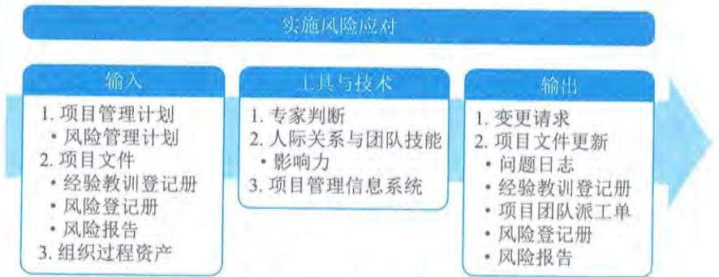  
图12-15 实施风险应对过程的输入、工具与技术和输出

项目风险管理的一个常见问题就是只发现不执行,即项目团队努力识别和分析风险并制定应对措施,然后把经商定的应对措施记录在风险登记册和风险报告中,但是不采取实际行动去管理风险。适当关注实施风险应对的过程,能够确保已商定的风险应对措施得到实际执行。

只有风险责任人努力去实施商定的应对措施,项目的整体风险和单个威胁及机会才能得到主动管理。

项目经理作为整体项目风险的责任人,必须根据规划风险应对过程的结果,组织所需的资源,采取已商定的应对策略和措施处理整体项目风险,使整体项目风险保持在合理水平。

实施风险应对过程的主要输入为项目管理计划和项目文件。

# 主要输入

# 1.项目管理计划

项目管理计划组件包括风险管理计划等。风险管理计划列明了与风险管理相关的项目团队成员和其他干系人的角色和职责,据此对风险应对措施分配责任人。风险管理计划定义了适用于本项目的风险管理方法及项目的风险临界值。

# 2.项目文件

可作为实施风险应对过程输入的项目文件主要包括:经验教训登记册、风险登记册和风险报告等。

(1)经验教训登记册。项目早期获得的与实施风险应对有关的经验教训,可用于项目后期提高本过程的有效性。

(2)风险登记册。记录了每项单个风险的商定风险应对措施,以及负责应对的指定责任人。

(3)风险报告。包括对当前整体项目风险的评估,以及商定的风险应对策略,还会描述重要的单个项目风险及其应对计划。

# 12.9 实施采购

实施采购是获取卖方应答、选择卖方并授予合同的过程。本过程的主要作用是,选定合格卖方并签署关于货物或服务交付的法律协议。本过程的最后成果是签订的协议,包括正式合同。本过程应根据需要在整个项目期间定期开展。图12- 16描述本过程的输入、工具与技术和输出。

本过程是按采购管理计划和采购策略中规定的采购方法,来开展实际的采购,签订采购合同。采购形式一般有:

- 直接采购:直接邀请某一家厂商报价或提交建议书,没有竞争性。

- 邀请招标:邀请一些厂家报价或提交建议书,具有有限竞争性。

- 竞争招标:公开发布招标广告,以便潜在卖方报价或提交建议书,具有很大的竞争性。

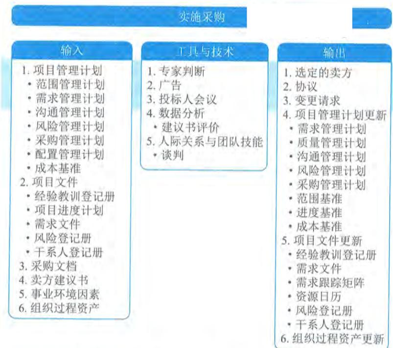  
图12-16 实施采购过程的输入、工具与技术和输出

以招投标方式进行的采购, 实施采购过程包括招标、投标、评标和授标四个环节。

(1) 招标。买方发出招标文件, 邀请潜在卖方要约。竞争招标, 应该在公共媒体上发布。邀请招标, 应该在有限范围内发布。直接采购, 则只需要向特定厂家发出采购消息。

(2) 投标。潜在卖方购买招标文件之后, 根据招标文件编制投标文件。在编制投标文件的过程中, 潜在卖方会对招标文件有各种疑问。招标方应该通过投标人会议, 给他们提问的机会, 并回答他们的问题。在投标人会议期间, 招标方也可以带潜在卖方考察项目现场。

(3) 评标。招标方收到投标文件后, 就要按既定的评标程序和标准开展评标工作。评标工作通常由专门的评标委员会进行。常用的评标方法包括:

- 加权打分法: 用具有不同权重的各评标标准, 对各投标文件进行打分, 然后加权汇总, 得到各潜在卖方的排名顺序。选择得分最高的潜在卖方中标。

- 筛选系统: 通过多轮过滤, 逐步淘汰达不到既定标准的投标商, 直到剩下一家。用于淘汰的标准逐轮提高。最后剩下的那家, 就是中标者。

- 独立估算: 把潜在卖方的报价与买方事先编制的独立成本估算进行比较, 选择与标底最接近的报价中标。

(4) 授标。在确定中标者之前, 需要与潜在卖方进行谈判。谈判的目的是要与潜在卖方加深了解, 得到公平、合理的价格, 为以后可能的合同关系奠定良好基础。基于评标委员会的推荐, 招标方的高级管理层正式批准某投标方中标, 与其订立合同。

实施采购过程的主要输入为项目管理计划、项目文件、采购文档和卖方建议书。主要输出为选定的卖方和协议。

# 12.9.1 主要输人

# 1.项目管理计划

实施采购过程使用的项目管理计划组件主要包括：范围管理计划、需求管理计划、沟通管理计划、风险管理计划、采购管理计划、配置管理计划和成本基准。

（1）范围管理计划。范围管理计划描述如何管理总体工作范围，包括由卖方负责的工作范围。

（2）需求管理计划。需求管理计划有助于识别和分析拟通过采购来实现的需求。

（3）沟通管理计划。沟通管理计划描述买方和卖方之间如何开展沟通。

（4）风险管理计划。风险管理计划描述如何安排和实施项目风险管理活动。

（5）采购管理计划。采购管理计划包含在实施采购过程中应该开展的活动。

（6）配置管理计划。配置管理计划有助于确定卖方必须实现的重要配置参数。

（7）成本基准。成本基准包括用于开展采购的预算，用于管理采购过程的成本，以及用于管理卖方的成本。

# 2.项目文件

可作为实施采购过程输入的项目文件主要包括：经验教训登记册、项目进度计划、需求文件、风险登记册和干系人登记册等。

（1）经验教训登记册。在项目早期获取的与实施采购有关的经验教训，可用于项目后期阶段，以提高本过程的效率。

（2）项目进度计划。项目进度计划确定项目活动的开始和结束日期，包括采购活动。它还会规定承包商最终的交付日期。

（3）需求文件。需求文件可能包括卖方需要满足的技术要求及具有合同和法律意义的需求，如健康、安全、安保、绩效、环境、保险、知识产权、同等就业机会、执照、许可证，以及其他非技术要求。

（4）风险登记册。有助于评估与特定潜在的卖方及其建议书有关的风险。

（5）干系人登记册。此文件包含与已识别干系人有关的所有详细信息，有助于邀请潜在的卖方提交建议书，以及考虑各主要干系人对建议书评审的要求和期望。

# 3.采购文档

采购文档是用于达成法律协议的各种书面文件，其中可能包括当前项目启动之前的较旧文件。采购文档可包括：招标文件、采购工作说明书、独立成本估算和供方选择标准等。

（1）招标文件。招标文件包括发给卖方的信息邀请书、建议邀请书、报价邀请书或其他文件，以便卖方编制应答文件。

（2）采购工作说明书。采购工作说明书向卖方清晰地说明目标、需求及成果，以便卖方据此做出量化应答。

（3）独立成本估算。独立成体估算可由内部或外部人员编制，用于评价投标人提交的建议书的合理性。

(4) 供方选择标准。供方选择标准描述如何评估投标人的建议书, 包括评估标准和权重。

# 4. 卖方建议书

卖方为响应采购文件包而编制的建议书, 其中包含的基本信息将被评估团队用于选定一个或多个投标人。评估团队会根据供方选择标准审查每一份建议书, 然后选出最能满足采购组织需求的卖方。

# 12.9.2 主要输出

# 1. 选定的卖方

选定的卖方是在建议书评估或投标评估中被判断为最有竞争力的投标人。

# 2. 协议

合同是对双方都有约束力的协议。它强制卖方提供规定的产品、服务或成果, 强制买方向卖方支付相应的报酬。合同建立了受法律保护的买卖双方的关系。协议文本的主要内容会有所不同, 一般可包括:

- 采购工作说明书或主要的可交付成果;

- 进度计划、里程碑或进度计划中规定的日期;

- 绩效报告;

- 定价和支付条款;

- 检查、质量和验收标准;

- 担保和后续产品支持;

- 激励和惩罚;

- 保险和履约保函;

- 下属分包商批准;

- 一般条款和条件;

- 变更请求处理;

- 终止条款和替代争议解决方法。

# 12.10 管理干系人参与

管理干系人参与是与干系人进行沟通和协作以满足其需求与期望、处理问题, 并促进干系人合理参与的过程。本过程的主要作用是, 让项目经理能够提高干系人的支持, 并尽可能降低干系人的抵制。图 12- 17 描述本过程的输入、工具与技术和输出。

管理干系人参与过程旨在根据干系人参与计划, 通过沟通及其他方法, 与干系人沟通并引导干系人合理参与项目, 解决实际出现的干系人之间的问题, 以便满足干系人的需要和期望。通过这个过程, 把干系人实际参与项目的程度提高到项目经理期望的程度。

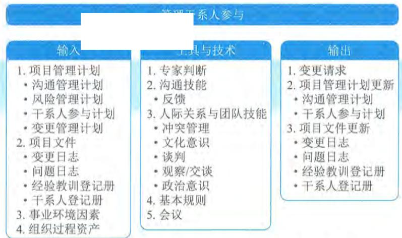  
图12-17 管理干系人参与过程的输入、工具与技术和输出

在这个过程中,需要把项目团队中的问题、项目团队与其他干系人之间的问题以及其他干系人之间的问题记录下来,形成问题日志更新。过程实施中,需要提出变更请求。变更请求可能包括对干系人参与计划的修改建议,以及对项目及其成果的修改建议。

在管理干系人参与过程中,需要开展多项活动,包括:

- 在适当的项目阶段引导干系人参与,以便获取、确认或维持他们对项目成功的持续承诺;

- 通过谈判和沟通的方式管理干系人期望;

- 处理与干系人管理有关的任何风险或潜在关注点,预测干系人可能在未来引发的问题;

- 澄清和解决已识别的问题等。

管理干系人参与过程的主要输入为项目管理计划和项目文件。

# 主要输入

# 1. 项目管理计划

管理干系人参与过程使用的项目管理计划组件主要包括:沟通管理计划、风险管理计划、干系人参与计划和变更管理计划等。

- 沟通管理计划:描述与干系人沟通的方法、形式和技术。

- 风险管理计划:描述了风险类别、风险偏好和报告格式。这些内容都可用于管理干系人参与。

- 干系人参与计划:为管理干系人期望提供指导和信息。

- 变更管理计划:描述了提交、评估和执行项目变更的过程。

# 2. 项目文件

可作为管理干系人过程输入的项目文件主要包括:变更日志、问题日志、经验教训登记册和干系人登记册等。

变更日志: 记录变更请求及其状态, 并将其传递给适当的干系人。

问题日志: 记录项目或干系人的关注点, 以及关于处理问题的行动方案。

经验教训登记册: 在项目早期获取的与管理干系人参与有关的经验教训, 可用于项目后期阶段, 以提高本过程的效率和效果。

干系人登记册: 提供项目干系人清单, 及执行干系人参与计划所需的任何信息。

# 12.11 本章练习

# 1. 选择题

(1) 过程改进通常是在________过程中。

A. 规划质量管理 
B. 管理质量 
C. 控制质量 
D. 检查质量

参考答案: B

(2) 项目经理观察到有些项目团队成员开始调整工作习惯以配合其他成员。但是, 他们彼此仍然缺乏信任。项目经理可以得出________结论。

A. 团队处于规范阶段, 很有可能进入到成熟阶段

B. 团队处于震荡阶段, 很有可能进入到规范阶段

C. 团队处于规范阶段, 很有可能退回到震荡阶段

D. 团队处于震荡阶段, 很有可能退回到形成阶段

参考答案: C

(3) 项目经理被分配管理一个智能型新产品研发项目。项目团队是按照专业知识从不同地方选择的, 发现难以管理分处不同地方的项目团队成员后, 项目经理申请了一个新地点将团队整合在一起。项目经理可使用________技术。

A. 虚拟团队 
B. 团队建设 
C. 集中办公 
D. 基本规则

参考答案: C

(4) 项目沟通计划中规定, 项目经理需要每两周向干系人用电子邮件形式发送报告, 这份报告应该是________。

A. 工作绩效数据 
B. 工作绩效分析

C. 工作绩效报告 
D. 工作挣值分析

参考答案: C

(5) 供方选择标准是以下哪个文件的一个组成部分

A. 采购工作说明书 
B. 采购文件 
C. 项目章程 
D. 卖方建议书

参考答案: B

(6) 在一次项目团队内部会议中, 一名成员不同意项目经理的方案, 导致会议无法进行。项目经理提出先讨论下一项议题, 会后单独与其沟通。项目经理使用的是________。

A. 缓和或包容 
B. 妥协或调解 
C. 强迫或命令 
D. 撤退或回避

参考答案: D

(7)随着项目的开展,项目周会的出席人数一直在下降,如果要鼓励干系人积极参加,项目经理应该查阅

A.干系人登记册

C.人力资源管理计划

B.沟通管理计划

D.干系人参与计划

参考答案:D

(8)执行过程组的主要目标是

A.跟踪并审查项目进度

C.完成确定的工作满足项目目标

B.管理干系人的期望

D.监控进度表

参考答案:C

2. 思考题

(1)沟通管理和干系人管理的区别是什么?

参考答案:略

(2)团队绩效评价与项目绩效评价的区别是什么?

参考答案:略

(3)质量改进和过程改进的关系是什么?

参考答案:略

