# 第13章 监控过程组

监控过程组是由监督项目执行情况并在必要时采取纠正措施，识别必要的计划变更并启动相应的变更程序等12个过程组成，包括：项目范围管理中的“确认范围”和“控制范围”；项目进度管理中的“控制进度”；项目成本管理中的“控制成本”；项目质量管理中的“控制质量”；项目资源管理中的“控制资源”；项目沟通管理中的“监督沟通”；项目风险管理中的“监督风险”；项目采购管理中的“控制采购”；项目干系人管理中的“监督干系人参与”；项目整合管理中的“监控项目工作”和“实施整体变更控制”。监控过程组各过程之间的关系如图13- 1所示，各过程之间存在相互作用，工作并行开展。监督是收集项目绩效数据，计算绩效指标，并报告和发布绩效信息。控制是比较实际绩效与计划绩效，分析偏差，评估趋势以改进过程，评价可选方案，并建议必要的纠正措施。这个项目过程组的目的在于，定期监督和计量项目绩效以及时发现实际情况与项目管理计划之间的偏差，对预知可能出现的问题制定预防措施，以及控制变更。监控过程组不仅监视和控制某一过程组正在进行的工作，而且还监视和控制整个项目的成果。

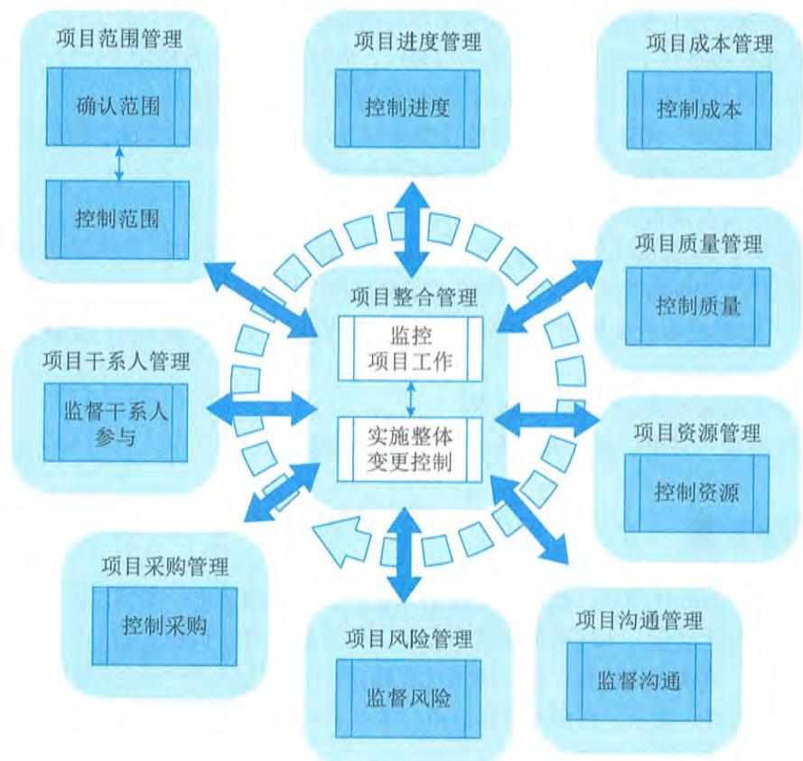  
图13-1 监控过程组各过程关系图

持续的监督使项目团队和其他干系人得以洞察项目的健康状况,并识别需要格外注意的方面。在监控过程组,需要监督和控制在每个知识领域、每个过程组、每个生命周期阶段以及整个项目中正在进行的工作。

监控过程组需要开展以下11类工作。

(1)把执行情况和计划进行比较,分析项目绩效(包括范围绩效、进度绩效、成本绩效和质量绩效),识别和量化绩效的偏差。

(2)分析偏差的程度和原因,并预测未来绩效。

(3)基于分析和预测结果(如果超出了控制临界值),提出变更请求,包括纠正措施、缺陷补救措施建议、计划修改建议和预防措施建议。

(4)根据变更管理计划的规定,对变更请求进行综合评审,做出批准、否决或搁置等决定。

(5)除了为实现项目的既定目标而管理项目变更,还要从确保项目继续符合商业需要的高度来管理项目变更,提出修改项目目标的变更请求、并报变更控制委员会审批。

(6)及时查看和处理随同项目执行而记录的问题日志中的各种问题,最小化这些问题对项目的不利影响。

(7)及时检查已完成的可交付成果的质量,并及时验收质量合格的可交付成果,确保项目可交付成果能够满足项目要求,实现组织变革和创造商业价值。

(8)监控团队成员和干系人对项目的参与情况,确保有利于项目成功。

(9)监控项目采购活动,确保采购工作有利于项目目标的实现。

(10)既要监控单个项目风险,又要监控整体项目风险,还要监控风险管理工作的有效性,以便降低对项目目标的威胁,提高实现项目目标的机会。

(11)不断总结经验教训,以便持续改进。

本章对监控过程组的12个过程——"确认范围""控制范围""控制进度""控制成本""控制质量""控制资源""监督沟通""监督风险""控制采购""监督干系人参与""监控项目工作""实施整体变更控制"的输入输出、工具与技术进行说明时,采取以下规则进行描述:

省略常见的输入输出、工具与技术;

针对主要输入输出、重要的工具与技术进行详细阐述。

# 13.1 控制质量

控制质量是为了评估绩效,确保项目输出完整、正确且满足客户期望,而监督和记录质量管理活动执行结果的过程。本过程的主要作用是,核实项目可交付成果和工作已经达到主要干系人的质量要求,可供最终验收。控制质量过程确定项目输出是否达到预期目的,这些输出需要满足所有适用标准、要求、法律法规和规范。本过程需要在整个项目期间开展。图13- 2描述本过程的输入、工具与技术和输出。

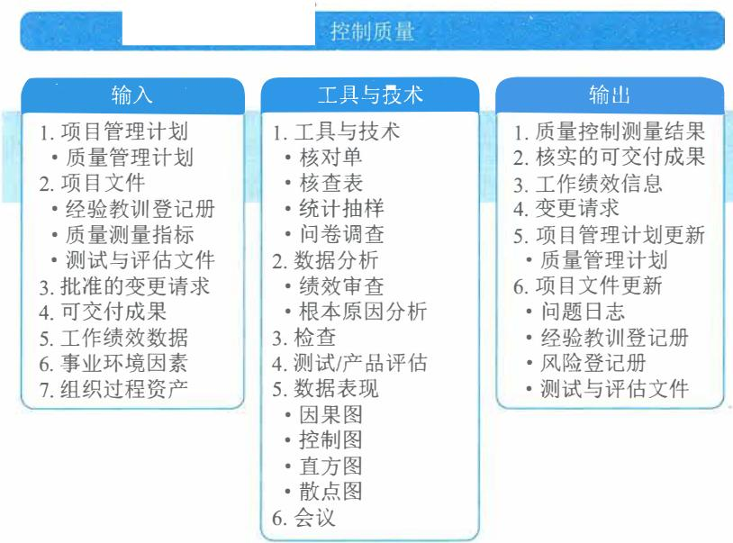  
图13-2 控制质量过程的输入、工具与技术和输出

本过程通过测量所有步骤、属性和变量，来核实与规划阶段所描述规范的一致性和合规性。在整个项目期间应执行质量控制，用可靠的数据来证明项目已经达到发起人和（或）客户的验收标准。

控制质量的努力程度和执行程度可能会因所在行业和项目管理风格而不同。例如，与其他行业相比，制药、医疗、运输和核能产业可能拥有更加严格的质量控制程序，为满足标准付出的工作也更多；在敏捷或适应型项目中，控制质量活动可能由所有团队成员在整个项目生命周期中执行；在瀑布或预测型项目中，控制质量活动由特定团队成员在特定时间点或者项目或阶段快结束时执行。

控制质量过程的主要输入为项目管理计划、项目文件、批准的变更请求、可交付成果和工作绩效数据，主要工具与技术包括数据收集、数据分析、检查、测试/产品评估、数据表现和会议，主要输出为质量控制测量结果、核实的可交付成果和工作绩效信息。

# 13.1.1 主要输入

# 1.项目管理计划

可用于控制质量的项目管理计划组件是质量管理计划，质量管理计划定义了如何在项目中开展质量控制。

# 2.项目文件

可作为控制质量过程输入的项目文件主要包括：经验教训登记册、质量测量指标、测试与评估文件等。

（1）经验教训登记册：在项目早期的经验教训可以运用到后期阶段，以改进质量控制。（2）质量测量指标：专用于描述项目或产品属性，以及控制质量过程将如何验证符合程度。（3）测试与评估文件：用于评估质量目标的实现程度。

# 3.批准的变更请求

3. 批准的变更请求在实施整体变更控制过程中,通过更新变更日志,显示哪些变更已经得到批准,哪些变更没有得到批准。批准的变更请求可包括各种修正,如缺陷补救、修订的工作方法和修订的进度计划。完成局部变更时,如果步骤不完整或不正确,可能会导致不一致和延迟。批准的变更请求的实施需核实,并需要确认完整性、正确性,以及是否重新测试。

# 4.可交付成果

4. 可交付成果可交付成果指的是在某一过程、阶段或项目完成时,必须产出的任何独特并可核实的产品、成果或服务能力。作为指导与管理项目工作过程的输出的可交付成果将得到检查,并与项目范围说明书定义的验收标准作比较。

# 5.工作绩效数据

5. 工作绩效数据工作绩效数据包括产品状态数据,例如观察结果、质量测量指标、技术绩效测量数据,以及关于进度绩效和成本绩效的项目质量信息。

# 13.1.2 主要工具与技术

# 1.数据收集

适用于控制质量过程的数据收集技术包括核对单、核查表、统计抽样和问卷调查等。

(1)核对单。核对单有助于以结构化方式管理控制质量活动。

(2)核查表。核查表又称计数表,用于合理排列各种事项,以便有效地收集关于潜在质量问题的有用数据。在开展检查以识别缺陷时,用核查表收集属性数据就特别方便,例如关于缺陷数量或后果的数据,如图13-3所示。

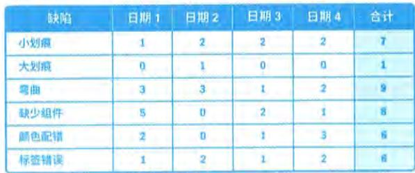  
图13-3 核查表

(3)统计抽样。统计抽样是指从目标总体中选取部分样本用于检查(如从75张工程图纸中随机抽取10张)。样本用于测量控制和确认质量。抽样的频率和规模应在规划质量管理过程中确定。

(4)问卷调查。问卷调查可用于在部署产品或服务之后收集关于客户满意度的数据。在问卷调查中识别的缺陷相关成本可被视为COQ模型中的外部失败成本,给组织带来的影响会超出成本本身。

# 2.数据分析

2. 数据分析适用于控制质量过程的数据分析技术包括:绩效核查和根本原因分析(RCA)。

(1) 绩效审查。绩效审查针对实际结果，测量、比较和分析规划质量管理过程中定义的质量测量指标。

(2) 根本原因分析。根本原因分析用于识别缺陷成因。

# 3.检查

检查是指检验工作产品，以确定是否符合书面标准。检查的结果通常包括相关的测量数据，可在任何层面上进行，可以检查单个活动的成果，也可以检查项目的最终产品。检查也可称为审查、同行审查、审计或巡检等，而在某些应用领域，这些术语的含义比较狭窄和具体。检查也可用于确认缺陷补救。

# 4.测试/产品评估

测试是一种有组织的、结构化的调查，旨在根据项目需求提供有关被测产品或服务质量的客观信息。测试的目的是找出产品或服务中存在的错误、缺陷、漏洞或其他不合规问题。用于评估各项需求的测试的类型、数量和程度是项目质量计划的一部分，具体取决于项目的性质、时间、预算或其他制约因素。测试可以贯穿于整个项目，可以在项目的不同组成部分完成时进行，也可以在项目结束（即交付最终可交付成果）时进行。早期测试有助于识别不合规问题，帮助减少修补不合规组件的成本。

不同应用领域需要不同测试。例如，软件测试可能包括单元测试、集成测试、黑盒测试、白盒测试、接口测试、回归测试、a测试等；硬件开发中，测试可能包括环境应力筛选、老化测试、系统测试等。

# 5.数据表现

适用于控制质量过程的数据表现技术包括因果图、控制图、直方图和散点图等。

（1）因果图。因果图用于识别质量缺陷和错误可能造成的结果，详见本书1232节。

(2）控制图。控制图用于确定一个过程是否稳定，或者是否具有可预测的绩效。规格上限和下限是根据要求制定的，反映了可允许的最大值和最小值。上下控制界限不同于规格界限。控制界限根据标准的统计原则，通过标准的统计计算确定，代表一个稳定过程的自然波动范围。项目经理和干系人可基于计算出的控制界限，识别须采取纠正措施的检查点，以预防不在控制界限内的绩效。控制图可用于监测各种类型的输出变量。虽然控制图最常用来跟踪批量生产中的重复性活动，但也可用来监测成本与进度偏差、产量、范围变更频率或其他管理工作成果，以便帮助确定项目管理过程是否受控。

（3）直方图。直方图可按来源或组成部分展示缺陷数量，详见本书1232节。

（4）散点图。散点图可在一个轴上展示计划的绩效，在另一个轴上展示实际绩效，详见本书1232节。

# 6.会议

审查已批准的变更请求、回顾/经验教训等会议可作为控制质量过程的一部分。

（1）审查已批准的变更请求：对所有已批准的变更请求进行审查，以核实它们是否已按批准的方式实施，确认是否已完成局部变更，以及是否已执行、测试、完成和证实所有部分。

（2）回顾/经验教训：项目团队举行的会议，旨在讨论下述内容。

项目/阶段的成功要素。

待改进之处。

当前项目和未来项目可增加的内容。

可增加到组织过程资产中的内容等。

# 13.1.3 主要输出

# 1.质量控制测量结果

控制质量的测量结果是对质量控制活动的结果的书面记录，应以质量管理计划所确定的格式加以记录。

# 2.核实的可交付成果

控制质量过程的一个目的就是确定可交付成果的正确性。开展控制质量过程的结果是核实的可交付成果，后者又是确认范围过程的一项输入，以便正式验收。如果存在任何与可交付成果有关的变更请求或改进事项，可能会执行变更、开展检查并重新核实。

# 3.工作绩效信息

工作绩效信息包含有关项目需求实现情况的信息、拒绝的原因、要求的返工、纠正措施建议、核实的可交付成果列表、质量测量指标的状态，以及过程调整需求。

# 13.2 确认范围

确认范围是正式验收已完成的项目可交付成果的过程。本过程的主要作用是，使验收过程具有客观性；同时通过确认每个可交付成果来提高最终产品、服务或成果获得验收的可能性。本过程应根据需要在整个项目期间定期开展。图13- 4描述本过程的输入、工具与技术和输出。

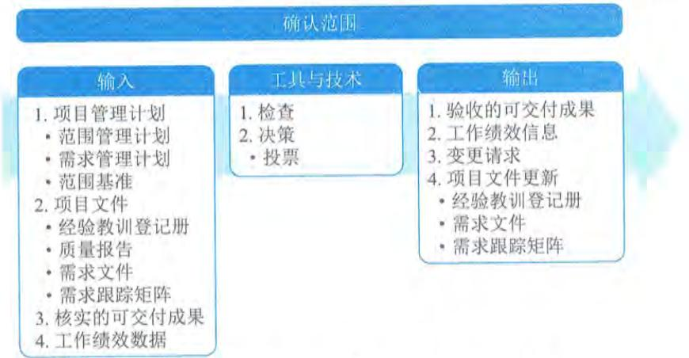  
图13-4 确认范围过程的输入、工具与技术和输出

由主要干系人,尤其是客户或发起人审查从控制质量过程输出的核实的可交付成果,确认这些可交付成果已经圆满完成并通过正式验收。确认范围过程依据从项目范围管理知识领域的相应过程获得的输出(如需求文件或范围基准),以及从其他知识领域的执行过程获得的工作绩效数据,对可交付成果的确认和最终验收。

确认范围过程的主要输入为项目管理计划、项目文件、核实的可交付成果和工作绩效数据,主要输出为验收的可交付成果和工作绩效信息。

# 13.2.1 确认范围的关键内容

# 1.确认范围的步骤

确认范围应该贯穿项目的始终。如果是在项目的各个阶段对项目的范围进行确认,则还要考虑如何通过项目协调来降低项目范围改变的频率,以保证项目范围的改变是有效率和适时的。确认范围的一般步骤如下。

(1)确定需要进行范围确认的时间。

(2)识别范围确认需要哪些投入。

(3)确定范围正式被接受的标准和要素。

(4)确定范围确认会议的组织步骤。

(5)组织范围确认会议。

通常情况下,在确认范围前,项目团队需要先进行质量控制工作。例如,在确认软件项目的范围之前,需要进行系统测试等工作,以确保确认工作的顺利完成。

确认范围过程与控制质量过程的不同之处在于,前者关注可交付成果的验收,而后者关注可交付成果的正确性及是否满足质量要求。控制质量过程通常先于确认范围过程,但二者也可同时进行。

# 2.确认范围时需要检查的问题

项目干系人进行范围确认时,一般需要检查以下6个方面的问题。

(1)可交付成果是否是确定的、可确认的?

(2)每个可交付成果是否有明确的里程碑?里程碑是否有明确的、可辨别的事件?例如,客户的书面认可等。

(3)是否有明确的质量标准?可交付成果的交付不但要有明确的标准标志,而且要有是否按照要求完成的标准,可交付成果和其标准之间是否有明确联系?

(4)审核和承诺是否有清晰的表达?项目发起人必须正式同意项目的边界,项目完成的产品或者服务,以及项目相关的可交付成果。项目团队必须清楚地了解可交付成果是什么。所有的这些表达必须清晰,并取得一致意见。

(5)项目范围是否覆盖了需要完成的产品或服务的所有活动,有没有遗漏或错误?

(6)项目范围的风险是否太高?管理层是否能够降低风险发生时对项目的影响?

# 3.干系人关注点的不同

确认范围主要是项目干系人(例如,客户、发起人等)对项目的范围进行确认和接受的工

作,每个人对项目范围所关注的方面是不同的,主要体现在以下4个方面。

(1)管理层主要关注项目范围:是指范围对项目的进度、资金和资源的影响,这些因素是否超过了组织承受范围,是否在投入产出上具有合理性。在确认范围工作进行之后,管理层可能会取消该项目,这可能是因为项目范围太大,造成对时间、资金和资源的占有远远大于管理层的预计或者组织的承受能力。更多的情况是要求项目团队压缩范围以满足进度、资金和资源的限制。

(2)客户主要关注产品范围:关心项目的可交付成果是否足够完成产品或服务。有些项目的产品经理就是客户,这种情况下,可减少项目团队对产品理解的失误的可能性,降低项目的风险。在项目中,客户往往有在当前版本中加入所有功能和特征的意愿,这对于项目来说是一种潜在的风险,会给组织和客户带来危害和损失。

(3)项目管理人员主要关注项目制约因素:关心项目可交付成果是否足够和必须完成,时间、资金和资源是否足够,以及主要的潜在风险和预备解决的方法。

(4)项目团队成员主要关注项目范围中自己参与的元素和负责的元素:通过定义范围中的时间检查自己的工作时间是否足够,自己在项目范围中是否有多项工作,而这些工作是否有冲突的地方。如果项目团队成员估计某些可交付成果无法在确定的时间完成,需要提出自己的意见。

# 13.2.2 主要输入

# 1.项目管理计划

确认范围过程使用的项目管理计划组件主要包括:范围管理计划、需求管理计划和范围基准等。

(1)范围管理计划:定义了如何正式验收已经完成的可交付成果。

(2)需求管理计划:描述了如何确认项目需求。

(3)范围基准:用范围基准与实际结果比较,以决定是否有必要进行变更、采取纠正措施或预防措施。

# 2.项目文件

可作为确认范围过程输入的项目文件主要包括:需求文件、需求跟踪矩阵、质量报告和经验教训登记册等。

(i)需求文件:将需求与实际结果比较,以决定是否有必要进行变更、采取纠正措施或预防措施。

(2)需求跟踪矩阵:含有与需求相关的信息,包括如何确认需求。

(3)质量报告:可包括由团队管理或需上报的全部质量保证事项、改进建议,以及在控制质量过程中发现的情况的概述。在验收产品之前,需要查看所有这些内容。

(4)经验教训登记册:在项目早期获得的经验教训可以运用到后期阶段,以提高验收可交付成果的效率与效果。

# 3.核实的可交付成果

核实的可交付成果是指已经完成,并被控制质量过程检查为正确的可交付成果。

# 4.工作绩效数据

4. 工作绩效数据工作绩效数据可能包括符合需求的程度、不一致的数量、不一致的严重性或在某时间段内开展确认的次数。

# 13.2.3 主要输出

# 1.验收的可交付成果

1. 验收的可交付成果符合验收标准的可交付成果应该由客户或发起人正式签字批准。应该从客户或发起人那里获得正式文件，证明干系人对项目可交付成果的正式验收。这些文件将提交给结束项目或阶段过程。

# 2.工作绩效信息

2. 工作绩效信息工作绩效信息包括项目进展信息，例如，哪些可交付成果已经被验收，哪些未通过验收以及原因。这些信息应该被记录下来并传递给干系人。

# 13.3 控制范围

13.3 控制范围控制范围是监督项目和产品的范围状态，管理范围基准变更的过程。本过程的主要作用是，在整个项目期间保持对范围基准的维护，且需要在整个项目期间开展。图 13-5 描述本过程的输入、工具与技术和输出。

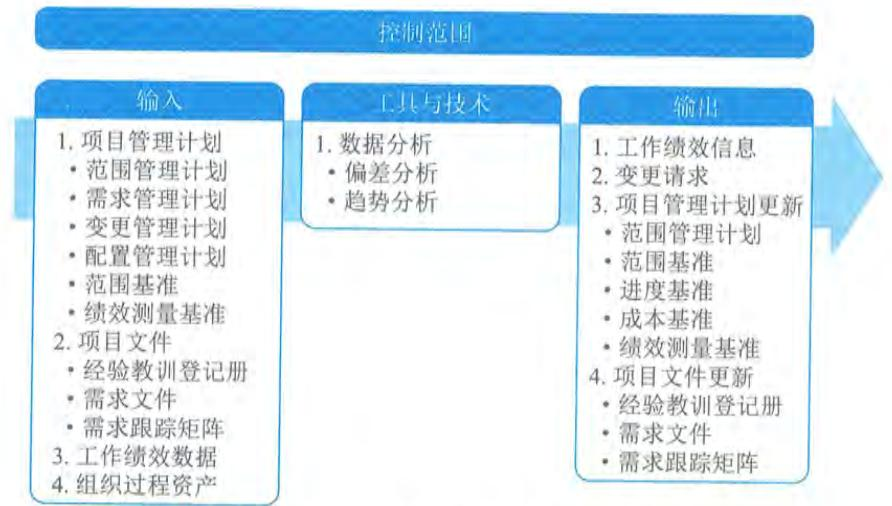  
图13-5 控制范围过程的输入、工具与技术和输出

控制项目范围确保所有变更请求、推荐的纠正措施或预防措施都通过实施整体变更控制过程进行处理。在变更实际发生时，也需要采用控制范围过程来管理这些变更。控制范围过程应该与其他项目管理知识领域的控制过程协调开展。未经控制的产品或项目范围的扩大（未对时间、成本和资源做相应调整）被称为范围蔓延。

控制范围过程的主要输入为项目管理计划、项目文件和工作绩效数据, 主要输出为工作绩效信息。

# 13.3.1 主要输入

# 1. 项目管理计划

控制范围过程使用的项目管理计划组件主要包括: 范围管理计划、需求管理计划、变更管理计划、配置管理计划、范围基准和绩效测量基准等。

(1) 范围管理计划: 记录了如何控制项目和产品范围。

(2) 需求管理计划: 记录了如何管理项目需求。

(3) 变更管理计划: 定义了管理项目变更的过程。

(4) 配置管理计划: 定义了哪些是配置项, 哪些配置项需要正式变更控制, 以及针对这些配置项的变更控制过程。

(5) 范围基准: 用范围基准与实际结果比较, 以决定是否有必要进行变更、采取纠正措施或预防措施。

(6) 绩效测量基准: 使用挣值分析时, 将绩效测量基准与实际结果比较, 以决定是否有必要进行变更、采取纠正措施或预防措施。

# 2. 项目文件

可作为控制范围过程输入的项目文件主要包括: 经验教训登记册、需求文件和需求跟踪矩阵等。

(1) 经验教训登记册: 项目早期的经验教训可以运用到后期阶段, 以改进范围控制。

(2) 需求文件: 用于发现任何对商定的项目或产品范围的偏离。

(3) 需求跟踪矩阵: 有助于探查任何变更或对范围基准的任何偏离对项目目标的影响, 它还可以提供受控需求的状态。

# 3. 工作绩效数据

工作绩效数据可能包括收到的变更请求的数量, 接受的变更请求的数量或者核实、确认和完成的可交付成果的数量。

# 13.3.2 主要输出

控制范围过程产生的工作绩效信息是有关项目和产品范围实施情况 (对照范围基准) 的、相互关联且与各种背景相结合的信息, 包括收到的变更的分类、识别的范围偏差和原因、偏差对进度和成本的影响, 以及对将来范围绩效的预测。

# 13.4 控制进度

控制进度是监督项目状态, 以更新项目进度和管理进度基准变更的过程。本过程的主要作

用是在整个项目期间保持对进度基准的维护，且需要在整个项目期间开展。图 13- 6 描述本过程的输入、工具与技术和输出。

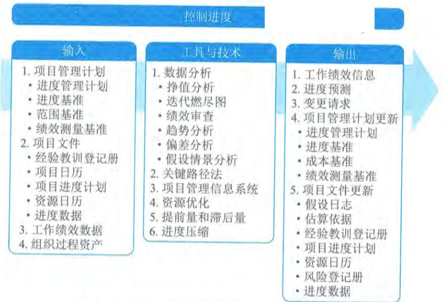  
图13-6 控制进度过程的输入、工具与技术和输出

要更新进度模型，就需要了解迄今为止的实际绩效。进度基准的任何变更都必须经过实施整体变更控制过程的审批。控制进度作为实施整体变更控制过程的一部分，关注内容包括：

- 判断项目进度的当前状态；- 对引起进度变更的因素施加影响；- 重新考虑必要的进度储备；- 判断项目进度是否已经发生变更；- 在变更实际发生时对其进行管理。如果采用敏捷方法，控制进度要关注如下内容：- 通过比较上一个时间周期中已交付并验收的工作总量与已完成的工作估算值，来判断项目进度的当前状态；- 实施回顾性审查（定期审查，记录经验教训），以便纠正与改进过程；- 剩余工作计划（未完项）重新进行优先级排序；- 确定每次迭代时间（约定的工作周期持续时间，通常是两周或一个月）内可交付成果的生成、核实和验收的速度；- 确定项目进度已经发生变更；- 在变更实际发生时对其进行管理。

将工作外包时，定期向承包商和供应商了解里程碑的状态更新是确保工作按商定进度进行的一种途径，有助于确保进度受控。同时，应执行进度状态评审和巡检，确保承包商报告准确且完整。

控制进度过程的主要输入为项目管理计划、项目文件和工作绩效数据, 主要工具与技术包括数据分析、关键路径法、资源优化、提前量和滞后量、进度压缩, 主要输出为工作绩效信息和进度预测。

# 13.4.1 主要输入

# 1. 项目管理计划

控制进度过程使用的项目管理计划组件主要包括: 进度管理计划、进度基准、范围基准和绩效测量基准等。

(1) 进度管理计划: 描述了进度的更新频率、进度储备的使用方式, 以及进度的控制方式。

(2) 进度基准: 把进度基准与实际结果相比, 以判断是否需要进行变更或采取纠正或预防措施。

(3) 范围基准: 在监控进度基准时, 需明确考虑范围基准中的项目WBS、可交付成果、制约因素和假设条件。

(4) 绩效测量基准: 使用挣值分析时, 将绩效测量基准与实际结果比较, 以决定是否有必要进行变更、采取纠正措施或预防措施。

# 2. 项目文件

可作为控制进度过程输入的项目文件主要包括: 经验教训登记册、项目日历、项目进度计划、资源日历和进度数据等。

(1) 经验教训登记册: 项目早期的经验教训可运用到后期阶段, 以改进进度控制。

(2) 项目日历: 在一个进度模型中, 可能需要不止一个项目日历来预测项目进度, 因为有些活动需要不同的工作时段。

(3) 项目进度计划: 是最新版本的项目进度计划。

(4) 资源日历: 显示了团队和物质资源的可用性。

(5) 进度数据: 在控制进度过程中需要对进度数据进行审查和更新。

# 3. 工作绩效数据

工作绩效数据包含关于项目状态的数据, 例如哪些活动已经开始, 它们的进展如何 (如实际持续时间、剩余持续时间和实际完成百分比), 哪些活动已经完成。

# 13.4.2 主要工具与技术

# 1. 数据分析

可用作控制进度过程的数据分析技术主要包括: 挣值分析、迭代燃尽图、绩效审查、趋势分析、偏差分析和假设情景分析等。

(1) 挣值分析: 进度绩效测量指标 (如进度偏差 (SV) 和进度绩效指数 (SPI)) 用于评价偏离初始进度基准的程度。

(2) 迭代燃尽图: 这类图用于追踪迭代未完项中尚待完成的工作。它分析与理想燃尽图的

偏差。可使用预测趋势线来预测迭代结束时可能出现的偏差,以及在迭代期间应采取的合理行动。燃尽图中先用对角线表示理想的燃尽情况,再每天画出实际剩余工作,最后基于剩余工作计算出趋势线以预测完成情况,如图 13- 7 所示。

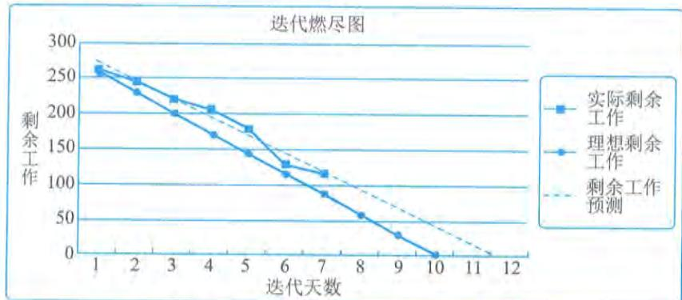  
图13-7 迭代燃尽图

(3)绩效审查。绩效审查是指根据进度基准,测量、对比和分析进度绩效,如实际开始和完成日期、已完成百分比,以及当前工作的剩余持续时间。

(4)趋势分析。趋势分析检查项目绩效随时间的变化情况,以确定绩效是在改善还是在恶化。图形分析技术有助于理解截至目前的绩效,并与未来的绩效目标(表示为完工日期)进行对比。

(5)偏差分析。偏差分析关注实际开始和完成日期与计划的偏离,实际持续时间与计划的差异,以及浮动时间的偏差。它包括确定偏离进度基准的原因与程度,评估这些偏差对未来工作的影响,以及确定是否需要采取纠正或预防措施。

(6)假设情景分析。假设情景分析基于项目风险管理过程的输出,对各种不同的情景进行评估,促使进度模型符合项目管理计划和批准的基准。

# 2.关键路径法

检查关键路径的进展情况有助于确定项目进度状态。关键路径上的偏差将对项目的结束日期产生直接影响。评估次关键路径上的活动的进展情况,有助于识别进度风险。

# 3.资源优化

资源优化技术是在同时考虑资源可用性和项目时间的情况下,对活动和活动所需资源进行的进度规划。

# 4.提前量和滞后量

在网络分析中调整提前量与滞后量,设法使进度滞后的项目活动赶上计划。

# 5.进度压缩

采用进度压缩技术使进度落后的项目活动赶上计划,可以对剩余工作使用快速跟进或赶工方法。

# 13.4.3 主要输出

# 1.工作绩效信息

工作绩效信息包括与进度基准相比较的项目工作执行情况。可以在工作包层级和控制账户层级,计算开始和完成日期的偏差以及持续时间的偏差。使用挣值分析的项目,进度偏差(SV)和进度绩效指数(SPI)将记录在工作绩效报告中。某项目进度工作绩效信息示例如图13- 8所示。

某项目进度工作绩效信息示例如图13- 8所示。

# 3、进度数据统计表

# 4、进度数据分析图

注：雨后作动作成，支项算。

  
图13-8 进度工作绩效信息示例

# 2.进度预测

2. 进度预测进度预测指根据已有的信息和知识,对项目未来的情况和事件进行的估算或预计。随着项目执行,应该基于工作绩效信息,更新和重新发布进度预测,这些信息取决于纠正或预防措施所期望的未来绩效,可能包括挣值绩效指数,以及可能在未来对项目造成影响的进度储备信息。

# 13.5 控制成本

控制成本是监督项目状态,以更新项目成本和管理成本基准变更的过程。本过程的主要作用是,在整个项目期间保持对成本基准的维护。本过程需要在整个项目期间开展。图13- 9描述本过程的输入、工具与技术和输出。

要更新预算,就需要了解截至目前的实际成本。只有经过实施整体变更控制过程的批准,才可以增加预算。只监督资金的支出,而不考虑由这些支出所完成的工作的价值,对项目没有什么意义,最多算是跟踪资金流。因此,在成本控制中,应重点分析项目资金支出与相应完成的工作之间的关系。有效成本控制的关键在于管理经批准的成本基准。项目成本控制的目标包括:

$\bullet$  对造成成本基准变更的因素施加影响;

$\bullet$  确保所有变更请求都得到及时处理;

- 当变更实际发生时, 管理这些变更;

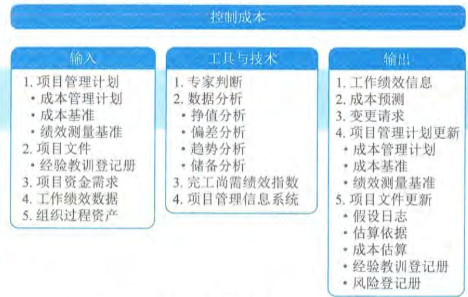  
图13-9 控制成本过程的输入、工具与技术和输出

- 确保成本支出不超过批准的资金限额, 既不超出按时段、按WBS组件、按活动分配的限额, 也不超出项目总限额; 
- 监督成本绩效, 找出并分析与成本基准间的偏差; 
- 对照资金支出, 监督工作绩效; 
- 防止在成本或资源使用报告中出现未经批准的变更; 
- 向干系人报告所有经批准的变更及其相关成本; 
- 设法把预期的成本超支控制在可接受的范围内等。

控制成本过程的主要输入为项目管理计划、项目文件、项目资金需求和工作绩效数据, 主要工具与技术包括挣值分析、偏差分析、趋势分析、储备分析、完工尚需绩效指数、项目管理信息系统, 主要输出为工作绩效信息和成本预测。

# 13.5.1 主要输入

# 1. 项目管理计划

控制成本过程使用的项目管理计划组件主要包括: 成本管理计划、成本基准和绩效测量基准等。

(1) 成本管理计划: 描述将如何管理和控制项目成本。

(2) 成本基准: 把成本基准与实际结果相比, 以判断是否需要进行变更或采取纠正或预防措施。

(3) 绩效测量基准: 使用挣值分析时, 将绩效测量基准与实际结果比较, 以决定是否有必要进行变更、采取纠正措施或预防措施。

# 2. 项目文件

可作为控制成本过程输入的项目文件是经验教训登记册, 在项目早期获得的经验教训可以

运用到后期阶段,以改进成本控制。

# 3.项目资金需求

项目资金需求包括预计支出及预计债务。

# 4.工作绩效数据

4. 工作绩效数据工作绩效数据包含项目状态的数据,例如哪些成本已批准、发生、支付和开具发票。

# 13.5.2 主要工具与技术

# 1.挣值分析

挣值分析(EVA)是把范围、进度和资源绩效综合起来考虑,以评估项目绩效和进展的方法。它是一种常用的项目绩效测量方法。它把范围基准、成本基准和进度基准整合起来,形成绩效基准,以便项目管理团队评估和测量项目绩效和进展。作为一种项目管理技术,挣值分析要求建立整合基准,用于测量项目期间的绩效。EVA的原理适用于所有行业的所有项目。它针对每个工作包和控制账户,计算并监测以下指标。

(1)计划值(PlannedValue,PV)。计划值是指项目实施过程中某阶段计划要求完成的工作量所需的预算工时(或费用)。PV主要反映进度计划应当完成的工作量,不包括管理储备。项目的总计划值又被称为完工预算(BAC)。

(2)实际成本(ActualCost,AC)。实际成本是指项目实施过程中某阶段实际完成的工作量所消耗的工时(或费用),主要反映项目执行的实际消耗指标。

(3)挣值(EarnedValue,EV)。挣值是指项目实施过程中某阶段实际完成工作量及按预算定额计算出来的工时(或费用)之积。

(4)进度偏差(Schedule Variance,SV)及进度绩效指数(Schedule Performance Index,SPI)。进度偏差是测量进度绩效的一种指标,可表明项目进度是落后还是提前于进度基准。由于当项目完工时,全部的计划值都将实现(即成为挣值),所以进度偏差最终将等于零。

进度绩效指数是测量进度效率的一种指标,它反映了项目团队利用时间的效率,有时与成本绩效指数(CPI)一起使用,以预测最终的完工估算。由于SPI测量的是项目总工作量,所以还需要对关键路径上的绩效进行单独分析,以确认项目是否将比计划完成日期提前或推迟。

SV计算公式:  $\mathrm{SV} = \mathrm{EV} - \mathrm{PV}$  。当  $\mathrm{SV} > 0$  时,说明进度超前;当  $\mathrm{SV}< 0$  时,说明进度落后;当 $\mathrm{SV} = 0$  时,则说明实际进度符合计划。

SPI计算公式:  $\mathrm{SPI} = \mathrm{EV} / \mathrm{PV}$  。当  $\mathrm{SPI} > 1.0$  时,说明进度超前;当  $\mathrm{SPI}< 1.0$  时,说明进度落后;当  $\mathrm{SPI} = 1.0$  时,则说明实际进度符合计划。

(5)成本偏差(Cost Variance,CV)及成本绩效指数(Cost Performance Index,CPI)。成本偏差是测量项目成本绩效的一种指标,指明了实际绩效与成本支出之间的关系,表示在某个给定时点的预算亏空或盈余量。项目结束时的成本偏差,就是完工预算(BAC)与实际成本之间的差值。

成本绩效指数是测量项目成本效率的一种指标,用来测量已完成工作的成本效率,可为预测项目成本和进度的最终结果提供依据。

CV计算公式:CV=EV- AC。当CV<0时,说明成本超支;当CV>0时,说明成本节省;

当  $\mathrm{CV} = 0$  时，说明成本等于预算。

CPI计算公式：  $\mathrm{CPI} = \mathrm{EV} / \mathrm{AC}$  。当  $\mathrm{CPI}< 1.0$  时，说明成本超支；当  $\mathrm{CPI} > 1.0$  时，说明成本节省；当  $\mathrm{CPI} = 1.0$  时，说明成本等于预算。

# （6）预测

随着项目进展，项目团队可根据项目绩效，对完工估算（EAC）进行预测，预测的结果可能与完工预算（BAC）存在差异。如果BAC已明显不再可行，则项目经理应考虑对EAC进行预测。预测EAC是根据当前掌握的绩效信息和其他知识，预计项目未来的情况和事件。预测要根据项目执行过程中所提供的工作绩效数据来产生、更新和重新发布。工作绩效信息包含项目过去的绩效，以及可能在未来对项目产生影响的任何信息。

在计算EAC时，通常用已完成工作的实际成本AC，加上剩余工作的完工尚需估算（EstimateToComplete，ETC），即：  $\mathrm{EAC} = \mathrm{AC} + \mathrm{ETC}$  。两种最常用的计算ETC的方法：

$\bullet$  基于非典型的偏差计算ETC。如果当前的偏差被看作是非典型的，并且项目团队预期在以后将不会发生这种类似偏差时，这种方法被经常使用。计算公式为：  $\mathrm{ETC} = \mathrm{BAC} - \mathrm{EV}$ $\bullet$  基于典型的偏差计算ETC。如果当前的偏差被看作是可代表未来偏差的典型偏差时，可以采用这种方法。

计算公式为：  $\mathrm{ETC} =$  （BAC- EV）/CPI，或者EAC=BAC/CPI。

上述两种方法都可用于任何项目。如果预测的EAC值不在可接受范围内，就是给项目管理团队发出了预警信号。

# 2.偏差分析

对于不使用挣值管理的项目，通过比较计划成本和实际成本，来识别成本基准与实际项目绩效之间的差异。可以实施进一步的分析，以判定偏离进度基准的原因和程度，并决定是否需要采取纠正或预防措施。可通过成本绩效测量来评价偏离原始成本基准的程度。随着项目工作的逐步完成，偏差的可接受范围（常用百分比表示）将逐步缩小。

# 3.趋势分析

趋势分析旨在审查项目绩效随时间的变化情况，以判断绩效是正在改善还是正在恶化。图形分析技术有助于了解截至目前的绩效情况，并把发展趋势与未来的绩效目标进行比较。

# 4.储备分析

在控制成本过程中，可以采用储备分析来监督项目中应急储备和管理储备的使用情况，从而判断是否还需要这些储备，或者是否需要增加额外的储备。随着项目工作的进展，这些储备可能已按计划用于支付风险或其他应急情形的成本；或者，如果风险事件没有如预计的那样发生，就可能要从项目预算中扣除未使用的应急储备，为其他项目或运营腾出资源。在项目中开展进一步风险分析，可能会发现需要为项目预算申请额外的储备。

# 5.完工尚需绩效指数（TCPI）

完工尚需绩效指数（To- Complete Performance Index，TCPI）是一种为了实现特定的管理目

标, 剩余资源的使用必须达到的成本绩效指标, 是完成剩余工作所需的成本与剩余预算之比。TCPI是指为了实现具体的管理目标 (如BAC或EAC), 剩余工作的实施必须达到的成本绩效指标。如果BAC已明显不再可行, 则项目经理应考虑使用EAC进行TCPI计算。经过批准后, 就用EAC取代BAC。

基于BAC的TCPI公式:  $\mathrm{TCPI} = \mathrm{(BAC - EV) / (BAC - AC)}$

# 6.项目管理信息系统

项目管理信息系统常用于监测PV、EV和AC这三个EVA指标, 绘制趋势图, 并预测最终项目结果的可能区间。

# 13.5.3 主要输出

# 1.工作绩效信息

1. 工作绩效信息工作绩效信息包括有关项目工作实施情况的信息 (对照成本基准), 可以在工作包层级和控制账户层级上评估已执行的工作和工作成本方面的偏差。对于使用挣值分析的项目, CV、CPI、EAC、VAC和TCPI将记录在工作绩效报告中。

# 2.成本预测

无论是计算得出的EAC值, 还是自下而上估算的EAC值, 都需要记录下来, 并传达给干系人。

# 13.6 控制资源

控制资源是确保按计划为项目分配实物资源, 以及根据资源使用计划监督资源实际使用情况, 并采取必要纠正措施的过程。本过程的主要作用是, 确保所分配的资源适时适地可用于项目, 且在不再需要时被释放。本过程需要在整个项目期间开展。图13- 10描述了本过程的输入、工具与技术和输出。

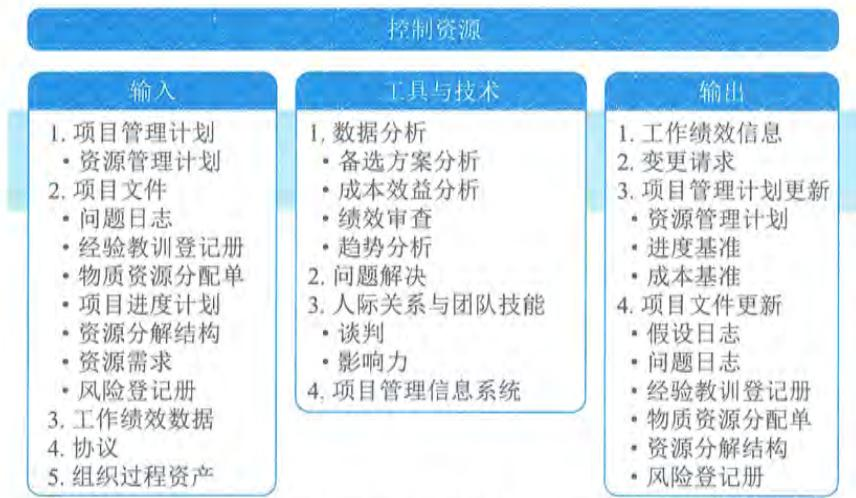  
图13-10 控制资源过程的输入、工具与技术和输出

应在所有项目阶段和整个项目生命周期期间持续开展控制资源过程,且适时、适地和适量地分配和释放资源,使项目能够持续进行。控制资源过程重点关注实物资源,例如设备、材料、设施和基础设施。本节讨论的控制资源技术是项目中最常用的,在特定项目或应用领域中,还可采用许多其他控制资源技术。

更新资源分配时,需要了解已使用的资源和还需要获取的资源。为此应审查至今为止的资源使用情况。控制资源过程关注:

$\bullet$  监督资源支出:

$\bullet$  及时识别和处理资源缺乏/剩余情况;

$\bullet$  确保根据计划和项目需求使用并释放资源;

$\bullet$  出现资源相关问题时通知相应干系人;

$\bullet$  影响可以导致资源使用变更的因素;

$\bullet$  在变更实际发生时对其进行管理等。

进度基准或成本基准的任何变更,都必须经过实施整体变更控制过程的审批。

控制资源过程的主要输入为项目管理计划、项目文件、工作绩效数据和协议。

# 主要输人

# 1.项目管理计划

可用于控制资源的项目管理计划组件是资源管理计划,资源管理计划为如何使用、控制和最终释放实物资源提供指南。

# 2.项目文件

可作为控制资源过程输入的项目文件主要包括:问题日志、经验教训登记册、物质资源分配单、项目进度计划、资源分解结构、资源需求和风险登记册等。

(1)问题日志。问题日志用于识别有关缺乏资源、原材料供应延迟或低等级原材料等问题。

(2)经验教训登记册。在项目早期获得的经验教训可以运用到后期阶段,以改进实物资源控制。

(3)物质资源分配单。物质资源分配单描述了资源的预期使用情况以及资源的详细信息,例如类型、数量、地点以及属于组织内部资源还是外购资源。

(4)项目进度计划。项目进度计划展示了项目在何时何地需要哪些资源。

(5)资源分解结构。资源分解结构为项目过程中需要替换或重新获取资源的情况提供了参考。

(6)资源需求。资源需求识别了项目所需的材料、设备、用品和其他资源。

(7)风险登记册。风险登记册识别了可能会影响设备、材料或用品的单个风险。

# 3.工作绩效数据

工作绩效数据包含有关项目状态的数据,例如已使用的资源的数量和类型。

# 4.协议

在项目中签署的协议是获取组织外部资源的依据,应在需要新的和未规划的资源时,或在当前资源出现问题时,在协议里定义相关程序。

# 13.7 监督沟通

监督沟通是确保满足项目及其干系人的信息需求的过程。本过程的主要作用是,按沟通管理计划和干系人参与计划的要求优化信息传递流程。本过程需要在整个项目期间开展。图13- 11描述本过程的输入、工具与技术和输出。

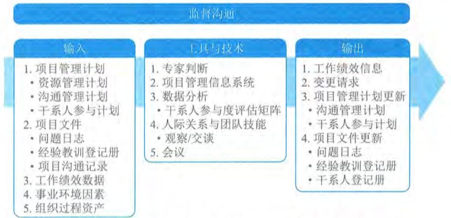  
图13-11 监督沟通过程的输入、工具与技术和输出

通过监督沟通过程,来确定规划的沟通方法和沟通活动对项目可交付成果与预计结果的支持力度。项目沟通的影响和结果应该接受正式的评估和监督,以确保在正确的时间,通过正确的渠道,将正确的内容(发送方和接收方对其理解一致)传递给正确的受众。

监督沟通过程可能需要采取各种方法,例如,开展客户满意度调查、整理经验教训、开展团队观察、审查问题日志或评估变更。

监督沟通过程可能触发规划沟通管理、管理沟通过程的迭代,以便修改沟通计划并开展额外的沟通活动,来提升沟通的效果。这种迭代体现了项目沟通管理各过程的持续性。问题、关键绩效指标、风险或冲突,都可能立即触发重新迭代开展这些过程。

监督沟通过程的主要输入为项目管理计划、项目文件和工作绩效数据。

# 主要输入

# 1.项目管理计划

监督沟通过程使用的项目管理计划组件主要包括:资源管理计划、沟通管理计划、干系人参与计划等。

(1)资源管理计划。通过描述角色和职责,以及项目组织结构图,资源管理计划可用于理解实际的项目组织及其任何变更。

(2)沟通管理计划。沟通管理计划是关于及时收集、生成和发布信息的现行计划,它确定了沟通过程中的团队成员、干系人和有关工作。

(3)干系人参与计划。干系人参与计划确定了计划用以引导干系人参与的沟通策略。

# 2.项目文件

可作为监督沟通过程输入的项目文件主要包括：问题日志、经验教训登记册和项目沟通记录等。

（1）问题日志。问题日志提供项目的历史信息、干系人参与问题的记录，以及它们如何得以解决。

（2）经验教训登记册。项目早期的经验教训可用于项目后期阶段，以改进沟通效果。

（3）项目沟通记录。项目沟通记录提供已开展的沟通的信息。

# 3.工作绩效数据

工作绩效数据包含关于已开展的沟通类型和数量的数据。

# 13.8 监督风险

监督风险是在整个项目期间，监督商定的风险应对计划的实施、跟踪已识别风险、识别和分析新风险，以及评估风险管理有效性的过程。本过程的主要作用是，使项目决策都基于关于整体项目风险和单个项目风险的当前信息。本过程需要在整个项目期间开展。图13- 12描述本过程的输入、工具与技术和输出。

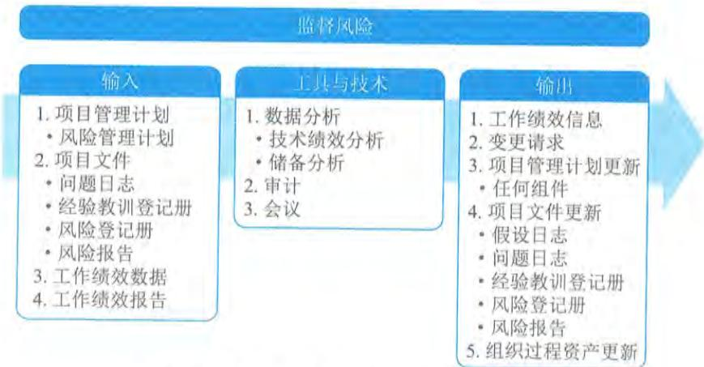  
图13-12 监督风险过程的输入、工具与技术和输出

为了确保项目团队和关键干系人了解当前的风险级别，应该通过监督风险过程对项目工作进行持续监督，并持续关注新出现、正变化和已过时的单个项目风险。

监督风险过程采用项目执行期间生成的绩效信息，以确定：

$\bullet$  实施的风险应对是否有效；

$\bullet$  整体项目风险级别是否已改变；

$\bullet$  已识别单个项目风险的状态是否已改变；

$\bullet$  是否出现新的单个项目风险；

风险管理方法是否依然适用：

项目假设条件是否仍然成立：

风险管理政策和程序是否已得到遵守：

成本或进度应急储备是否需要修改：

项目策略是否仍然有效等。

监督风险过程的主要输入为项目管理计划、项目文件、工作绩效数据和工作绩效报告，主要工具与技术包括数据分析、审计和会议，主要输出为工作绩效信息。

# 13.8.1 主要输入

# 1.项目管理计划

监督风险过程使用的项目管理计划的组件是风险管理计划。风险管理计划规定了应如何及何时审查风险，应遵守哪些政策和程序，与本过程监督工作有关的角色和职责安排，以及报告格式。

# 2.项目文件

可作为监督风险过程输入的项目文件主要包括：问题日志、经验教训登记册、风险登记册和风险报告等。

（1）问题日志。问题日志用于检查未决问题是否更新，并对风险登记册进行必要更新。

（2）经验教训登记册。在项目早期获得的与风险相关的经验教训可用于后期阶段。

（3）风险登记册。风险登记册的主要内容包括：已识别单个项目风险、风险责任人、商定的风险应对策略，以及具体的应对措施。它可能还会提供其他详细信息，包括用于评估应对计划有效性的控制措施、风险的症状和预警信号、残余及次生风险，以及低优先级风险观察清单。

（4）风险报告。风险报告包括对当前整体项目风险入口的评估，以及商定的风险应对策略，还会描述重要的单个项目风险及其应对计划和风险责任人。

# 3.工作绩效数据

工作绩效数据包含关于项目状态的信息，例如，已实施的风险应对措施、已发生的风险、仍活跃及已关闭的风险。

# 4.工作绩效报告

工作绩效报告通过分析绩效测量结果得出，能够提供关于项目工作绩效的信息，包括偏差分析结果、挣值数据和预测数据。监督与绩效相关的风险时，需要使用这些信息。

# 13.8.2 主要工具与技术

# 1.数据分析

适用于监督风险过程的数据分析技术主要包括以下2个方面。

(1) 技术绩效分析: 开展技术绩效分析, 把项目执行期间所取得的技术成果与取得相关技术成果的计划进行比较。它要求定义关于技术绩效的客观的、量化的测量指标, 以便据此比较实际结果与计划要求。技术绩效测量指标可能包括处理时间、缺陷数量和储存容量等。实际结果偏离计划的程度可代表威胁或机会的潜在影响。

(2) 储备分析: 在整个项目执行期间, 可能发生某些单个项目风险, 对预算和进度应急储备产生正面或负面的影响。储备分析是指在项目的任一时点比较剩余应急储备与剩余风险量, 从而确定剩余储备是否仍然合理。可以用各种图形 (如燃尽图) 来显示应急储备的消耗情况。

# 2. 审计

风险审计是一种审计类型, 可用于评估风险管理过程的有效性。项目经理负责确保按项目风险管理计划所规定的频率开展风险审计。风险审计可以在日常项目审查会上开展, 可以在风险审查会上开展, 团队也可以召开专门的风险审计会。在实施审计前, 应明确定义风险审计的程序和目标。

# 3. 会议

适用于监督风险过程的会议是风险审查会。应该定期安排风险审查, 来检查和记录风险应对在处理整体项目风险和已识别单个项目风险方面的有效性。在风险审查中, 还可以识别出新的单个项目风险 (包括已商定应对措施所引发的次生风险), 重新评估当前风险, 关闭已过时风险, 讨论风险发生所引发的问题, 以及总结可用于当前项目后续阶段或未来类似项目的经验教训。根据风险管理计划的规定, 风险审查可以是定期项目状态会中的一项议程, 或者也可以召开专门的风险审查会。

# 13.8.3 主要输出

工作绩效信息是经过比较单个风险的实际发生情况和预计发生情况, 所得到的关于项目风险管理执行绩效的信息。它可以说明风险应对规划和应对实施过程的有效性。

# 13.9 控制采购

控制采购是管理采购关系、监督合同绩效、实施必要的变更和纠偏, 以及关闭合同的过程。本过程的主要作用是, 确保买卖双方履行法律协议, 满足项目需求。本过程应根据需要在整个项目期间开展。图 13- 13 描述本过程的输入、工具与技术和输出。

买方和卖方都出于相似的目的来管理采购合同, 每方都必须确保双方履行合同义务, 确保各自的合法权利得到保护。合同关系的法律性质, 要求项目管理团队必须了解在控制采购期间所采取的任何行动的法律后果。对于有多个供应商的较大项目, 合同管理的一个重要方面就是管理各个供应商之间的沟通。鉴于其法律意义, 很多组织都将合同管理视为独立于项目的一种组织职能。虽然采购管理员可以是项目团队成员, 但通常还向另一部门的合同管理经理报告。

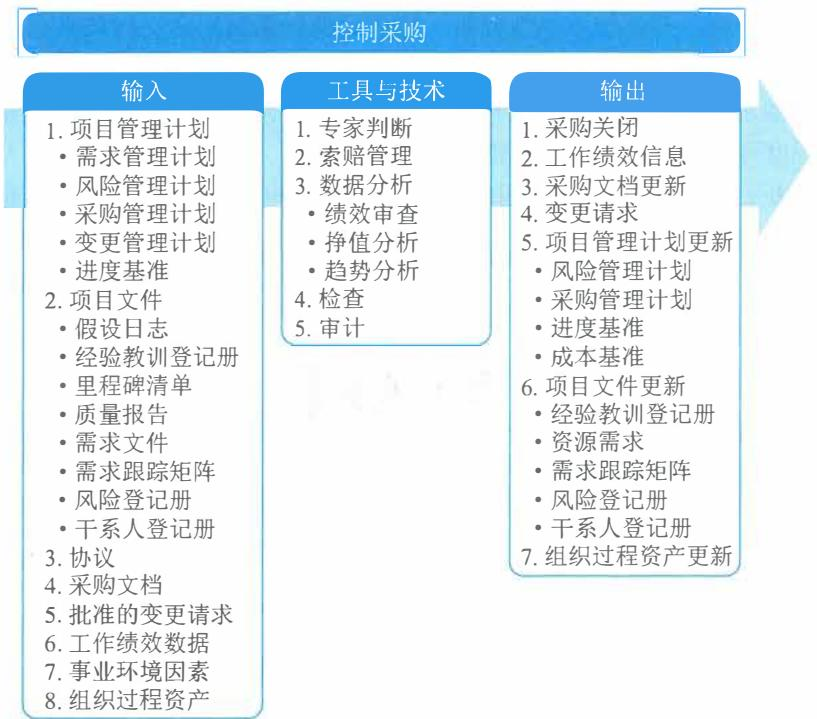  
图13-13 控制采购过程的输入、工具与技术和输出

在控制采购过程中，需要把适当的项目管理过程应用于合同关系，并且需要整合这些过程的输出，以用于对项目的整合管理。如果涉及多个卖方，以及多种产品、服务或成果，往往需要在多个层级上开展这种整合。

合同管理活动可能包括以下5个方面：

（1）收集数据和管理项目记录，包括维护对实体和财务绩效的详细记录，以及建立可测量的采购绩效指标；（2）完善采购计划和进度计划；（3）建立与采购相关的项目数据的收集、分析和报告机制，并为组织编制定期报告；（4）监督采购环境，以便引导或调整实施；（5）向卖方付款。

控制采购的质量，包括采购审计的独立性和可信度，是采购系统可靠性的关键决定因素。组织的道德规范、内部法律顾问和外部法律咨询，包括持续的反腐计划，都有助于实现适当的采购控制。

在控制采购过程中，需要开展财务管理工作，包括监督向卖方付款。这是要确保合同中的支付条款得到遵循，确保按合同规定，把付款与卖方的工作进展联系起来。需要重点关注的一点是，确保向卖方的付款与卖方实际已经完成的工作量之间有密切的关系。如果合同规定了基于项目输出及可交付成果来付款，而不是基于项目输入（如工时），那么就可以更有效地开展采购控制。

在合同收尾前，若双方达成共识，可以根据协议中的变更控制条款，随时对协议进行修改。通常要书面记录对协议的修改。

控制采购过程的主要输入为项目管理计划、项目文件、协议、采购文档和工作绩效数据,主要工具与技术包括专家判断、索赔管理、数据分析、检查和审计,主要输出为采购关闭和工作绩效信息。

# 13.9.1 主要输入

# 1. 项目管理计划

控制采购过程使用的项目管理计划组件主要包括:需求管理计划、风险管理计划、采购管理计划、变更管理计划和进度基准等。

(1) 需求管理计划:描述将如何分析、记录和管理承包商需求。

(2) 风险管理计划:描述如何安排和实施由卖方引发的风险管理活动。

(3) 采购管理计划:规定了在控制采购过程中需要开展的活动。

(4) 变更管理计划:包含关于如何处理由卖方引发的变更的信息。

(5) 进度基准:如果卖方的进度拖后影响了项目的整体进度绩效,则可能需要更新并审批进度计划,以反映当前的期望。

# 2. 项目文件

可作为控制采购过程输入的项目文件主要包括:假设日志、经验教训登记册、里程碑清单、质量报告、需求文件、需求跟踪矩阵、风险登记册和干系人登记册等。

(1) 假设日志:记录了采购过程中做出的假设。

(2) 经验教训登记册:在项目早期获取的经验教训可供项目未来使用,以改进承包商绩效和采购过程。

(3) 里程碑清单:重要里程碑清单说明卖方需要在何时交付成果。

(4) 质量报告:用于识别不合规的卖方过程、程序或产品。

(5) 需求文件:可能包括一是卖方需要满足的技术要求;二是具有合同和法律意义的需求,如健康、安全、安保、绩效、环境、保险、知识产权、同等就业机会、执照、许可证,以及其他非技术要求。

(6) 需求跟踪矩阵:将产品需求从来源连接到满足需求的可交付成果。

(7) 风险登记册:取决于卖方的组织、合同的持续时间、外部环境、项目交付方法、所选合同类型,以及最终商定的价格,每个被选中的卖方都会带来特殊的风险。

(8) 干系人登记册:包括关于已识别干系人的信息,例如,合同团队成员、选定的卖方、签署合同的专员,以及参与采购的其他干系人。

# 3. 协议

协议是双方之间达成的包括对各方义务的一致理解。对照相关协议,确认其中的条款和条件的遵守情况。

# 4. 采购文档

采购文档包含用于管理采购过程的完整支持性记录,包括工作说明书、支付信息、承包商工作绩效信息、计划、图纸和其他往来函件。

# 5.工作绩效数据

5. 工作绩效数据工作绩效数据包含与项目状态有关的卖方数据,例如,技术绩效,已启动、进展中或已结束的活动,已产生或投入的成本。工作绩效数据还可能包括已向卖方付款的情况。

# 13.9.2 主要工具与技术

# 1.专家判断

1. 专家判断在控制采购时,应征求具备如下专业知识或接受过相关培训的个人或小组的意见:相关的职能领域,如财务、工程、设计、开发、供应链管理等;法律法规和合规性要求;索赔管理等。

# 2.索赔管理

2. 索赔管理如果买卖双方不能就变更补偿达成一致意见,或对变更是否发生存在分歧,那么被请求的变更就成为有争议的变更或潜在的推定变更。此类有争议的变更称为索赔。如果不能妥善解决,它们会成为争议并最终引发申诉。在整个合同生命周期中,通常会按照合同条款对索赔进行记录、处理、监督和管理。如果合同双方无法自行解决索赔问题,则可能不得不按合同中规定的程序,用替代争议解决方法(ADR)去处理。谈判是解决所有索赔和争议的首选方法。

# 3.数据分析

用于监督和控制采购的数据分析技术主要包括:绩效审查、挣值分析和趋势分析。

(1)绩效审查。绩效审查是指对照协议,对质量、资源、进度和成本绩效进行测量、比较和分析,以审查合同工作的绩效。其中包括确定工作包提前或落后于进度计划、超出或低于预算,以及是否存在资源或质量问题。

(2)挣值分析(EVA)。挣值分析用于计算进度和成本偏差,以及进度和成本绩效指数,以确定偏离目标的程度。

(3)趋势分析。趋势分析可用于编制关于成本绩效的完工估算(EAC),以确定绩效是正在改善还是恶化。

# 4.检查

4. 检查检查是指对承包商正在执行的工作进行结构化审查,可能涉及对可交付成果的简单审查,或对工作本身的实地审查。在施工、工程和基础设施建设项目中,检查包括买方和承包商联合巡检现场,以确保双方对正在进行的工作有共同的认识。

# 5.审计

5. 审计审计是对采购过程的结构化审查。应该在采购合同中明确规定与审计有关的权利和义务。买卖双方的项目经理都应该关注审计结果,以便对项目进行必要的调整。

# 13.9.3 主要输出

# 1.采购关闭

1. 采购关闭买方通常通过其授权的采购管理员,向卖方发出合同已经完成的正式书面通知。关于正式

关闭采购的要求，通常已在合同条款和条件中规定，包括在采购管理计划中。一般而言，这些要求包括：

$\bullet$  已按时按质按技术要求交付全部可交付成果： $\bullet$  没有未决索赔或发票，全部最终款项已付清。项目管理团队应该在关闭采购之前批准所有的可交付成果。

# 2. 工作绩效信息

工作绩效信息是卖方正在履行的工作的绩效情况，包括与合同要求相比较的可交付成果完成情况和技术绩效达成情况，以及与SOW预算相比较的已完工作的成本产生和认可情况。

# 13.10 监督干系人参与

监督干系人参与是监督项目干系人关系，并通过修订参与策略和计划来引导干系人合理参与项目的过程。本过程的主要作用是，随着项目进展和环境变化，维持或提升干系人参与活动的效率和效果。本过程需要在整个项目期间开展。图13- 14描述本过程的输入、工具与技术和输出。

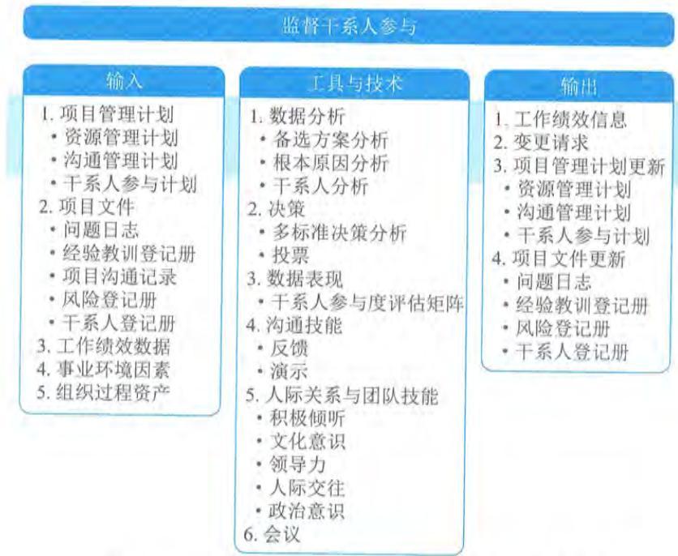  
图13-14 监督干系人参与过程的输入、工具与技术和输出

监督干系人参与过程的主要输入为项目管理计划、项目文件和工作绩效数据，主要工具与技术包括数据分析、决策、数据表现、沟通技能、人际关系与团队技能、会议，主要输出为工作绩效信息。

# 13.10.1 主要输人

# 1.项目管理计划

监督干系人参与过程使用的项目管理计划组件主要包括：资源管理计划、沟通管理计划和干系人参与计划等。

（1）资源管理计划。资源管理计划确定了对团队成员的管理方法。

（2）沟通管理计划。沟通管理计划描述了适用于项目干系人的沟通计划和策略。

（3）干系人参与计划。干系人参与计划定义了管理干系人需求和期望的计划。

# 2.项目文件

可作为监督干系人参与过程输入的项目文件主要包括：问题日志、经验教训登记册、项目沟通记录、风险登记册和干系人登记册等。

（1）问题日志。问题日志记录了所有与项目和干系人有关的已知问题。

（2）经验教训登记册。在项目早期获取的经验教训，可用于项目后期阶段，以提高引导干系人参与的效率和效果。

（3）项目沟通记录。根据沟通管理计划和干系人参与计划与干系人开展的项目沟通，都在项目沟通记录中。

（4）风险登记册。风险登记册记录了与干系人参与及互动有关的风险，包括它们的分类，以及潜在的应对措施。

（5）干系人登记册。干系人登记册记录了各种干系人信息，主要包括干系人名单、评估结果和分类情况。

# 3.工作绩效数据

工作绩效数据包含项目状态数据，如哪些干系人支持项目，他们的参与水平和类型。

# 13.10.2 主要工具与技术

# 1.数据分析

适用于监督干系人参与过程的数据分析技术主要包括：

$\oplus$  备选方案分析：在干系人参与效果没有达到期望要求时，应该开展备选方案分析，评估应对偏差的各种备选方案。

$\oplus$  根本原因分析：开展根本原因分析，确定干系人参与未达预期效果的根本原因。

$\oplus$  干系人分析：确定干系人群体和个人在项目任何特定时间的状态。

# 2.决策

适用于监督干系人参与过程的决策技术主要包括：

$\oplus$  多标准决策分析：考察干系人成功参与项目的标准，并根据其优先级排序和加权，识别出最适当的选项。

$\oplus$  投票：通过投票，选出应对干系人参与水平偏差的最佳方案。

# 3.数据表现

3. 数据表现适用于监督干系人参与过程的数据表现技术主要是干系人参与度评估矩阵。使用干系人参与度评估矩阵来跟踪每个干系人参与水平的变化,对干系人参与加以监督。

# 4.沟通技能

适用于监督干系人参与过程的沟通技能主要包括:

反馈:用于确保发送给干系人的信息被接收和理解。

演示:为干系人提供清晰的信息。

# 5.人际关系与团队技能

适用于监督干系人参与过程的人际关系技能主要包括:

积极倾听:通过积极倾听,减少理解错误和沟通错误。

文化意识:文化意识和文化敏感性有助于项目经理分析干系人和团队成员的文化差异和文化需求,并对沟通进行规划。

领导力:成功的干系人参与,需要强有力的领导技能,以传递愿景并激励干系人支持项目工作和成果。

人际交往:通过人际交往了解关于干系人参与水平。

政策意识:有助于理解组织战略,理解谁能行使权力和施加影响,以及培养与这些干系人沟通的能力。

# 6.会议

6. 会议可用于监督干系人参与的会议类型包括为监督和评估干系人的参与水平而召开的状态会议、站会、回顾会,以及干系人参与计划中规定的其他任何会议。会议不再局限于面对面或声音互动。虽然面对面互动最为理想,但可能成本很高。电话会议和电信技术可以降低成本,并提供丰富的联系方法和沟通方式。

# 13.10.3 主要输出

13.10.3 主要输出工作绩效信息包括与干系人参与状态有关的信息,例如,干系人对项目的当前支持水平,以及与干系人参与度评估矩阵、干系人立方体或其他工具所确定的期望参与水平相比较的结果。

# 13.11 监控项目工作

13.11 监控项目工作监控项目工作是跟踪、审查和报告整体项目进展,以实现项目管理计划中确定的绩效目标的过程。本过程的主要作用是,让干系人了解项目的当前状态并认可为处理绩效问题而采取的行动,以及通过成本和进度预测,让干系人了解未来项目状态。本过程需要在整个项目期间开展。图 13- 15 描述了本过程的输入、工具与技术和输出。

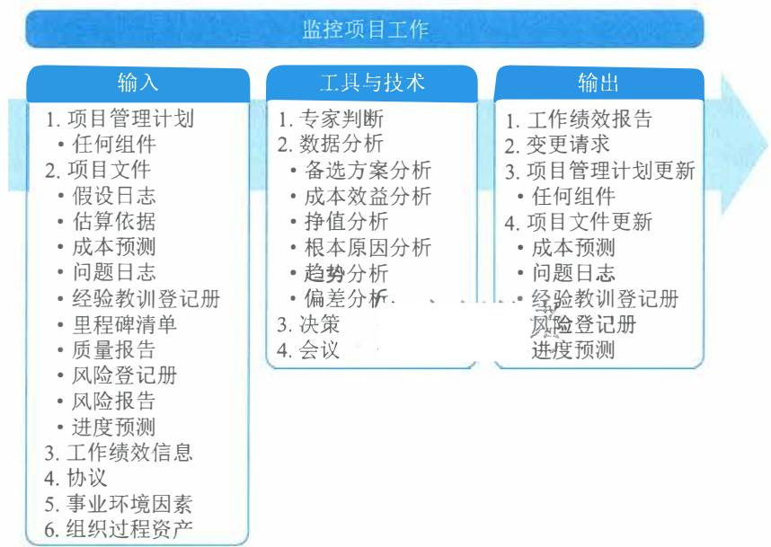  
图13-15 监控项目工作过程的输入、工具与技术和输出

监督是贯穿于整个项目的项目管理活动之一，包括收集、测量和分析测量结果，以及预测趋势，以便推动过程改进。持续的监督使项目管理团队可以洞察项目进展状况，并识别需要特别关注的地方。控制包括制定纠正或预防措施或重新规划，并跟踪行动计划的实施过程，以确保它们能有效解决问题。

监控项目工作过程主要关注：

- 把项目的实际绩效与项目管理计划进行比较；- 定期评估项目绩效，决定是否需要采取纠正或预防措施，并推荐必要的措施；- 检查单个项目风险的状态；- 在整个项目期间，维护一个准确且及时更新的信息库，以反映产品及文件情况；- 为状态报告、进展测量和预测提供信息；- 做出预测，以更新当前的成本与进度信息；- 监督已批准变更的实施情况；- 如果项目是项目集的一部分，还应向项目集管理层报告项目进展和状态；- 确保项目与商业需求保持一致等。

监控项目工作过程的主要输入为项目管理计划、项目文件、工作绩效信息和协议，主要工具与技术包括数据分析和决策，主要输出为工作绩效报告。

# 13.11.1 主要输入

# 1. 项目管理计划

监控项目工作包括查看项目的各个方面。项目管理计划的任一组成部分都可作为监控项目工作过程的输入。

# 2.项目文件

可用于监控项目工作过程输入的项目文件主要包括：假设日志、估算依据、成本预测、问题日志、经验教训登记册、里程碑清单、质量报告、风险登记册、风险报告和进度预测等。

（1）假设日志：包含会影响项目的假设条件和制约因素的信息。

（2）估算依据：说明不同估算是如何得出的，用于决定如何应对偏差。

（3）成本预测：基于项目以往的绩效，用于确定项目是否仍处于预算的公差内，并识别任何必要的变更。

（4）问题日志：用于记录和监督由谁负责在目标日期内解决特定问题。

（5）经验教训登记册：可能包含应对偏差的有效方式以及纠正措施和预防措施。

（6）里程碑清单：列出特定里程碑实现日期，检查是否达到计划的里程碑。

（7）质量报告：包含质量管理问题，针对过程、项目和产品的改善建议，纠正措施建议（包括返工、缺陷（漏洞）补救、  $100\%$  检查等），以及在控制质量过程中发现的情况的概述。

（8）风险登记册：记录并提供了在项目执行过程中发生的各种威胁和机会的相关信息。

（9）风险报告：记录并提供了关于整体项目风险和单个风险的信息。

（10）进度预测：基于项目以往的绩效，用于确定项目是否仍处于进度的公差区间内，并识别任何必要的变更。

# 3.工作绩效信息

在工作执行过程中收集工作绩效数据，再交由控制过程做进一步分析。将工作绩效数据与项目管理计划组件、项目文件和其他项目变量比较之后生成工作绩效信息。通过这种比较可以了解项目的执行情况。

在项目开始时，就在项目管理计划中规定关于范围、进度、预算和质量的具体工作绩效测量指标。项目期间通过控制过程收集绩效数据，与计划和其他变量比较，为工作绩效提供背景。

# 4.协议

4. 协议采购协议中包括条款和条件，也可包括其他条目，如买方就卖方应实施的工作或应交付的产品所做的规定。如果项目将部分工作外包出去，项目经理需要监督承包商的工作，确保所有协议都符合项目的特定要求，以及组织的采购政策。

# 13.11.2 主要工具与技术

# 1.数据分析

可用于监控项目工作过程的数据分析技术主要包括：备选方案分析、成本效益分析、挣值分析、根本原因分析、趋势分析和偏差分析等。

（1）备选方案分析：用于在出现偏差时选择要执行的纠正措施或纠正措施和预防措施的组合。

（2）成本效益分析：有助于出现偏差时确定最节约成本的纠正措施。

（3）挣值分析：对范围、进度和成本绩效进行了综合分析。

(4) 根本原因分析: 关注识别问题的主要原因。它可用于识别出现偏差的原因以及项目经理为达成项目目标应重点关注的领域。

(5) 趋势分析: 根据以往结果预测未来绩效。它可以预测项目的进度延误, 提前让项目经理意识到, 按照既定趋势发展, 后期进度可能出现的问题。应该在项目期间尽早进行趋势分析, 确保项目团队有时间分析和纠正任何异常。可以根据趋势分析的结果, 提出必要的预防措施建议。

(6) 偏差分析: 成本估算、资源使用、资源费率、技术绩效和其他测量指标。偏差分析审查目标绩效与实际绩效之间的差异 (或偏差), 可涉及持续时间估算, 可以在每个知识领域, 针对特定变量开展偏差分析。在监控项目工作过程中, 通过偏差分析对成本、时间、技术和资源偏差进行综合分析, 以了解项目的总体偏差情况。这样便于采取合适的预防或纠正措施。

# 2. 决策

常用于监控项目工作过程的决策技术是投票。投票可以包括用下列方法进行决策: 一致同意、大多数同意或相对多数原则。

# 13.11.3 主要输出

工作绩效信息可以用实体或电子形式加以合并、记录和分发。基于工作绩效信息, 以实体或电子形式编制形成工作绩效报告, 以制定决策、采取行动或引起关注。根据项目沟通管理计划, 通过沟通过程向项目干系人发送工作绩效报告。

工作绩效数据、工作绩效信息和工作绩效报告之间的主要区别, 如表 13- 1 所示。

表13-1 工作绩效数据、工作绩效信息和工作绩效报告的区别  

<table><tr><td>比较项</td><td>工作绩效数据</td><td>工作绩效信息</td><td>工作绩效报告</td></tr><tr><td>产生于</td><td>指导与管理项目工作过程</td><td>确认范围、控制范围、控制进度、控制成本、控制质量、监督沟通、控制资源、监督风险、控制采购、监督干系人参与过程</td><td>监控项目工作过程</td></tr><tr><td>产生时间</td><td>项目过程中随时产生</td><td>间隔一定时间</td><td>间隔时间较长，定期或特殊需要时</td></tr><tr><td>主要用途</td><td>记录项目执行情况</td><td>反映项目执行和计划之间的偏差，支持变更决定</td><td>整个项目层面，更深入或更综合的项目执行与项目计划的对比，支持变更或其他行动</td></tr><tr><td>回答的问题</td><td>是什么（what）</td><td>为什么（why）</td><td>如何解决和预防（how and how will）</td></tr><tr><td>使用者</td><td>项目团队</td><td>项目团队</td><td>项目团队、发起人、高级管理者、客户及其他干系人</td></tr><tr><td>示例</td><td>截至当前完成了20个模块的研发工作</td><td>截至当前，与计划相比，进度落后2个月，主要原因是项目所需人员能力不足</td><td>截至当前，进度偏差为-2个月，超出控制临界值。应加强人员培训，提高技能，防止进度的继续偏差</td></tr></table>

工作绩效报告的内容一般包括状态报告和进展报告。工作绩效报告可以包含挣值图表和信息、趋势线和预测、储备燃尽图、缺陷直方图、合同绩效信息和风险情况概述。工作绩效报告

可以表示为引起关注、制定决策和采取行动的仪表盘、大型可见图表、任务板、燃烧图等形式。

# 1. 仪表盘

仪表盘是以电子方式收集信息并生成描述状态的图表，允许对数据进行深入分析，用于提供高层级的概要信息，对于超出既定临界值的任何度量指标，辅助使用文本进行解释，如图13- 16所示。

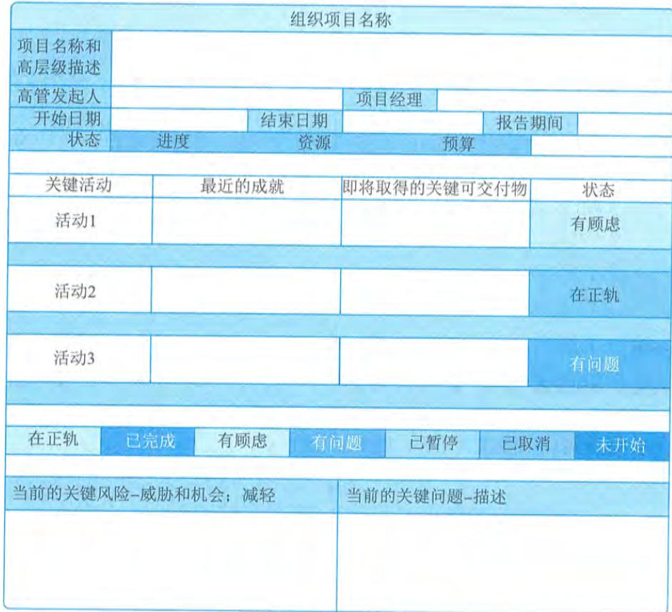  
图13-16 仪表盘示例

仪表盘包括信号灯图（也称为RAG图，其中RAG是红、黄、绿的缩写）、横道图、饼状图和控制图。

# 2. 大型可见图表

大型可见图表（BVC）也称为信息发射源，是一种可见的实物展示工具，可向组织内成员提供度量信息和结果，支持及时的知识共享。BVC不局限在进度工具或报告工具中发布信息，更多时候会在人们很容易看到的地方发布信息，BVC应该易于更新且经常更新。一般而言，BVC不是电子生成的，而是手动维护的，因此通常是“低科技高触感”。图13- 17显示了与已完成工作、剩余工作和风险相关的BVC。

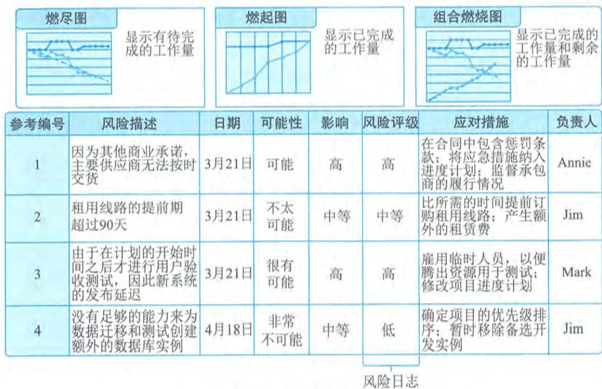  
图13-17 信息发射源示例

# 3.任务板

任务板通过直观看板方式，显示已准备就绪并可以开始（待办）的工作、正在进行和已完成的工作，是对计划工作的可视化表示，可以帮助项目成员随时了解各项任务的状态，可以用不同颜色的便利贴代表不同类型的工作，如图13- 18所示。

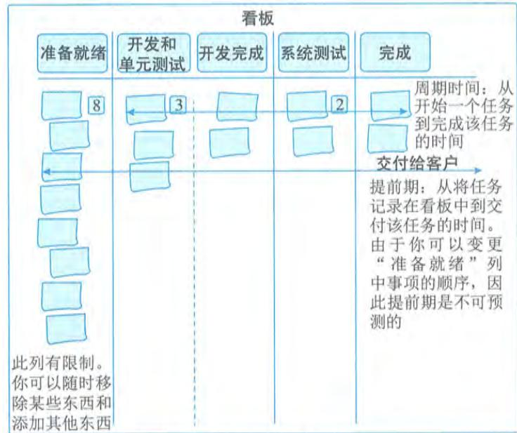  
图13-18 任务板

# 4.燃烧图

4. 燃烧图燃烧图（包括燃起图或燃尽图）用于显示项目团队的速度，此“速度”可度量项目的生产率。燃起图可以对照计划，跟踪已完成的工作量，如图13-19所示；燃尽图可以显示剩余工作（比如采用适应型方法的项目中的故事点）的数量或已减少的风险的数量。

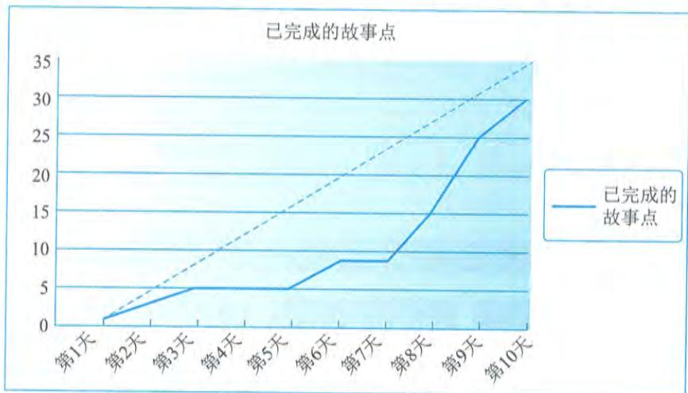  
图13-19 燃起图示例

图13- 20是预算临界值设置的例子，超出计划支出率  $+10\%$  的曲线为  $①$  ，  $- 20\%$  的曲线为  $②$  ，  $③$  代表实际支出。图中显示在1月份，支出超过了  $+10\%$  的公差上限，将触发诊断计划。

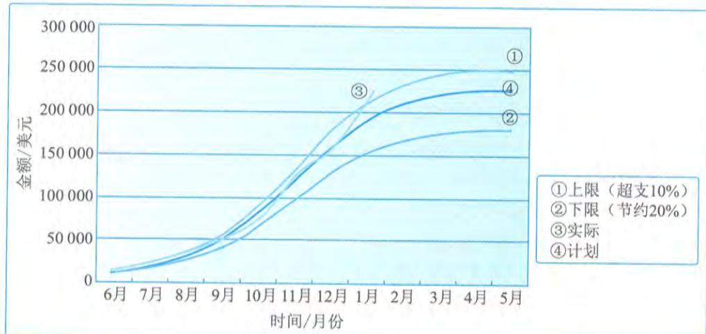  
图13-20 计划支出率和实际支出率

图13- 20 计划支出率和实际支出率项目团队不应等到突破临界值才采取行动，如果可以通过趋势或新信息进行预测，则项目团队能主动提前解决偏差。诊断计划是在超过临界值或预测时采取的一组行动，诊断计划不需

要注重形式,它可以像召集干系人开会讨论问题一样简单,诊断计划的重要性在于讨论问题并针对需要做的事情制订计划,然后持续跟进,确保计划得到实施并确定计划是否有效。

# 13.12 实施整体变更控制

实施整体变更控制是指审查所有变更请求,批准变更,管理对可交付成果、组织过程资产、项目文件和项目管理计划的变更,并对变更处理结果进行沟通的过程。本过程审查对项目文件、可交付成果或项目管理计划的所有变更请求,并决定对变更请求的处置方案。本过程的主要作用是,确保对项目中已记录在案的变更做综合评审。如果不考虑变更对整体项目目标或计划的影响就开展变更,往往会加剧整体项目风险。本过程需要在整个项目期间开展。图13- 21描述了本过程的输入、工具与技术和输出。

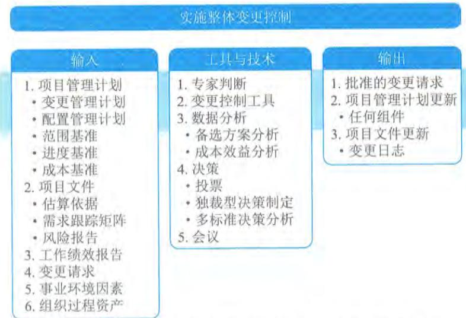  
图13-21 实施整体变更控制过程的输入、工具与技术和输出

实施整体变更控制过程贯穿项目始终,项目经理对此承担最终责任。变更请求可能影响项目范围、产品范围以及任一项目管理计划组件或任一项目文件。在整个项目生命周期的任何时间,参与项目的任何干系人都可以提出变更请求。

在基准确定之前,变更无须正式受控并实施整体变更控制过程。一旦确定了项目基准,就必须通过实施整体变更控制过程来处理变更请求。尽管变更可以口头提出,但所有变更请求都必须以书面形式记录,并纳入变更管理和(或)配置管理系统中。在批准变更之前,可能需要了解变更对进度的影响和对成本的影响。在变更请求可能影响任一项目基准的情况下,都需要开展正式的整体变更控制过程。每项记录在案的变更请求都必须由一位责任人批准、推迟或否决,这个责任人通常是项目发起人或项目经理。应该在项目管理计划或组织程序中指定这位责任人,必要时,应该由CCB来开展实施整体变更控制过程。变更请求得到批准后,可能需要新编(或修订)成本估算、活动排序、进度日期、资源需求和(或)风险应对方案分析,这些变

更可能会对项目管理计划和其他项目文件进行调整。

为了便于开展变更管理,可以使用一些手动或信息化的工具。配置控制和变更控制的关注点不同:配置控制重点关注可交付成果及各个过程的技术规范,而变更控制则重点关注识别、记录、批准或否决对项目文件、可交付成果或基准的变更。

变更控制工具的选择应基于项目干系人的需要,并充分考虑组织和环境的情况和制约因素。变更控制工具需要支持的配置管理活动包括:识别配置项、记录并报告配置项状态、进行配置项核实与审计等。

(1)识别配置项:识别与选择配置项,为定义与核实产品配置、标记产品和文件、管理变更和明确责任提供基础。

(2)记录并报告配置项状态:对各个配置项的信息进行记录和报告。

(3)进行配置项核实与审计:通过配置核实与审计,确保项目的配置项组成的正确性,以及相应的变更都被登记、评估、批准、跟踪和正确实施,确保配置文件所规定的功能要求都已实现。

变更控制工具还需要支持的变更管理活动包括:识别变更、记录变更、做出变更决定和跟踪变更等。

(1)识别变更:识别并选择过程或项目文件的变更项。

(2)记录变更:将变更记录为合适的变更请求。

(3)做出变更决定:审查变更,批准、否决、推迟对项目文件、可交付成果或基准的变更或做出其他决定。

(4)跟踪变更:确认变更被登记、评估、批准、跟踪并向干系人传达最终结果。

也可以使用变更控制工具管理变更请求和后续的决策,同时还需要及时沟通,帮助CCB的成员履行职责,并向干系人传达变更相关的决定。

实施整体变更控制过程的主要输入为项目管理计划、项目文件、工作绩效报告和变更请求,主要输出为批准的变更请求。

# 13.12.1 主要输人

# 1.项目管理计划

实施整体变更控制过程使用的项目管理计划组件主要包括:变更管理计划、配置管理计划、范围基准、进度基准和成本基准等。

(1)变更管理计划:为管理变更控制过程提供指导,并记录CCB的角色和职责。

(2)配置管理计划:描述项目的配置项、识别应记录和更新的配置项,以便保持项目产品的一致性和有效性。

(3)范围基准:提供项目和产品定义。

(4)进度基准:用于评估变更对项目进度的影响。

(5)成本基准:用于评估变更对项目成本的影响。

# 2.项目文件

可用于实施整体变更控制过程输入的项目文件主要包括:需求跟踪矩阵、风险报告和估算依据等。

(1)需求跟踪矩阵:有助于评估变更对项目范围的影响。

(2)风险报告:提供了与变更请求有关的项目风险的来源的信息。

(3)估算依据:指出了持续时间、成本和资源估算是如何得出的,可用于计算变更对时间、预算和资源的影响。

# 3.工作绩效报告

对实施整体变更控制过程特别有用的工作绩效报告包括:资源可用情况、进度和成本数据、挣值报告、燃烧图或燃尽图。

# 4.变更请求

项目执行中很多过程都会输出变更请求。变更请求可能包含纠正措施、预防措施、缺陷补救,以及针对正式受控的项目文件或可交付成果的更新。变更可能影响项目基准,也可能不影响项目基准,变更决定通常由项目经理做决策。

对于会影响项目基准的变更,通常应该在变更请求中说明执行变更的成本、所需的计划日期修改、资源需求以及相关的风险。这种变更应由CCB(如有)和客户或发起人审批,除非他们本身就是CCB的成员。只有经批准的变更才能纳入修改后的基准。

# 13.12.2 主要输出

13.12.2 主要输出由项目经理、CCB或指定的团队成员,根据变更管理计划处理变更请求,做出批准、推迟或否决的决定。批准的变更请求应通过指导与管理项目工作过程加以实施。对于推迟或否决的变更请求,应通知提出变更请求的个人或小组。

# 13.13 本章练习

# 1.选择题

(1)过程将工作绩效信息作为输入。

A.监控项目 
B.确认范围 
C.控制范围 
D.控制进度

参考答案:A

(2)为确保项目工作的未来绩效符合项目管理计划,而进行的有目的的活动属于

A.缺陷补救 
B.纠正措施 
C.修复措施 
D.预防措施

参考答案:D

(3)关于实施项目整体变更控制过程的描述,不正确的是

A.尽管可以口头提出,但所有变更请求都必须以书面形式记录

B.在基准确定之前,变更也应正式受控,实施整体变更控制过程

C. 实施整体变更控制过程贯穿项目始终，项目经理对此承担最终责任

D. 项目的任何干系人都可以提出变更请求

参考答案：B

（4）控制范围过程的主要作用是

A. 描述产品、服务或成果的边界和验收标准

B. 通过确认每个可交付成果来提高最终产品获得验收的可能性

C. 在整个项目期间保持对范围基准的维护

D. 使验收过程具有客观性

参考答案：C

（5）四个项目甲、乙、丙、丁，当前各项目进度数据如表所示，则最有可能在按时完工的同时并能更好地控制成本的项目是

<table><tr><td>项目</td><td>PV</td><td>EV</td><td>AC</td></tr><tr><td>甲</td><td>100</td><td>120</td><td>110</td></tr><tr><td>乙</td><td>200</td><td>210</td><td>200</td></tr><tr><td>丙</td><td>150</td><td>130</td><td>160</td></tr><tr><td>丁</td><td>180</td><td>200</td><td>210</td></tr></table>

A. 甲 
B. 乙 
C. 丙 
D. 丁

参考答案：A

(6) 不属于控制质量过程的数据表现技术。

A. 思维导图 
B. 控制图 
C. 流程图 
D. 散点图

参考答案：A

(7) 检查项目绩效随时间的变化情况，可用于确定绩效是在改善还是在恶化。

A. 备选方案分析 
B. 成本效益分析 
C. 绩效审查 
D. 趋势分析

参考答案：D

（8）关于风险审计的描述，不正确的是

A. 风险审计可用于评估风险管理过程的有效性

B. 项目经理要确保按项目风险管理计划所规定的频率实施风险审计

C. 应召开专门的风险审计会议进行风险审计

D. 在实施审计前，要明确定义审计的格式和目标

参考答案：C

（9）可能影响控制沟通过程的组织过程资产不包括

A. 以往项目的经验教训知识库

B. 组织对沟通的要求

C. 制作、交换、储存和检索信息的标准化指南

D. 组织治理框架

参考答案：D

(10) _______包含用于管理采购过程的完整支持性记录。

A. 采购文档 
B. 采购合同 
C. 协议 
D. 采购管理计划

参考答案:A

2. 思考题

(1) 监控过程组包含哪些项目管理过程。

参考答案:略

(2) 当项目发生变更时,请简述变更控制的过程。

参考答案:略

