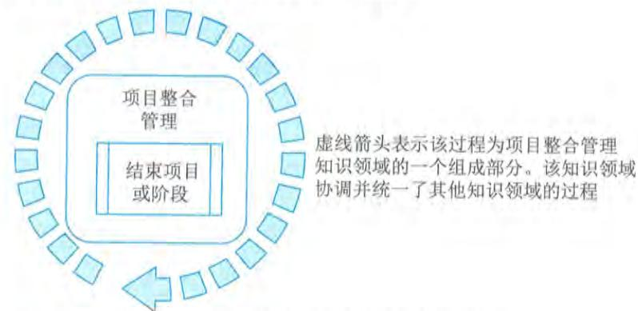
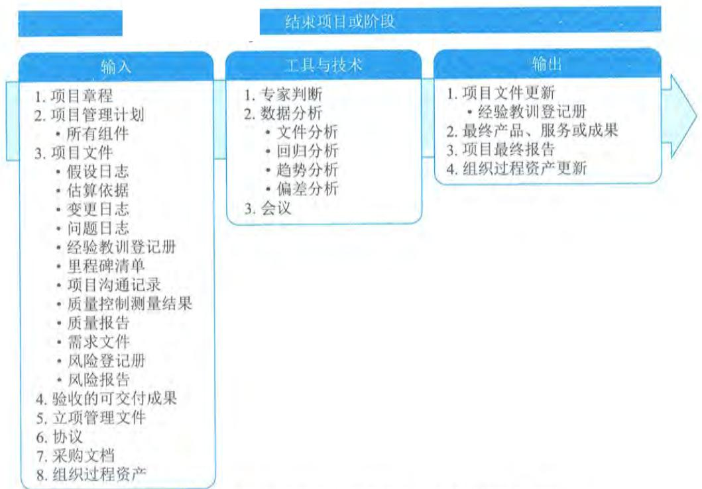

# 第14章 收尾过程组

收尾过程组包括为正式完成或关闭项目、阶段或合同而开展的过程。本过程组旨在核实为完成项目或阶段所需的所有过程组的全部过程均已完成,并正式宣告项目或阶段关闭。本过程组的主要作用是,确保恰当地关闭阶段、项目和合同。虽然本过程组只有一个过程,但是组织可以自行为项目、阶段或合同添加相关过程,因此,仍把它称为"过程组",如图14- 1所示。本过程组也适用于项目的提前关闭,例如项目流产或取消。

  
图14-1 监控过程组各过程关系图

收尾过程组需要开展以下10类工作。

(1)确认所有的项目合同都已经妥善关闭,没有未解决问题。

(2)获得主要的干系人对项目可交付成果的最终验收,确保项目目标已经实现。

(3)把项目可交付成果移交给指定的干系人,如发起人或客户。这件工作经常可以与最终验收同时开展。

(4)编制和分发最终的项目绩效报告。这份报告既有利于干系人了解项目的最终绩效,又可称为开展项目后评价的重要依据。

(5)收集、整理并归档项目资料,更新组织过程资产。这是为了保留项目记录,遵守相关法律法规,供后续审计(如果需要开展)使用,以及供以后其他项目借鉴。

(6)收集各主要干系人对项目的反馈意见,调查满意度。

(7)评估项目合规性、实现组织变革和创造商业价值的情况。

(8)全面开展项目后评价,总结经验教训,更新组织过程资产。

(9)开展知识分享和知识转移,为后续的项目成果运营实现商业价值提供支持。

(10)开展财务、法律和行政收尾,宣布正式关闭项目,把对项目可交付成果的管理和使用责任转移给指定的干系人,如发起人或客户。

本章对收尾过程组的1个过程——"结束项目或阶段"的输入输出、工具与技术进行说明

时，采取以下规则进行描述：

省略常见的输入输出、工具与技术；

$\bullet$  针对主要输入输出、重要的工具与技术进行详细阐述。

# 14.1 结束项目或阶段

14.1 结束项目或阶段结束项目或阶段是终结项目、阶段或合同的所有活动的过程。本过程的主要作用是，存档项目或阶段信息，完成计划的工作，释放组织资源以展开新的工作。本过程仅开展一次或仅在项目的预定义点开展。图14- 2描述了本过程的输入、工具与技术和输出。

  
图14-2 结束项目或阶段过程的输入、工具与技术和输出

在结束项目时，项目经理需要回顾项目管理计划，确保所有项目工作都已完成以及项目目标均已实现。项目或阶段行政收尾所需的必要活动包括如下内容。

（1）为达到阶段或项目的完工或退出标准所必须的行动和活动，例如：

$\bullet$  确保所有文件和可交付成果都已是最新版本，且所有问题都已得到解决；

$\bullet$  确认可交付成果已交付给客户并已获得客户的正式验收；

$\bullet$  确保所有成本都已记入项目成本账；

$\bullet$  关闭项目账户；

$\bullet$  重新分配人员；

- 处理多余的项目材料；- 重新分配项目设施、设备和其他资源；- 根据组织政策编制详尽的最终项目报告。

（2）为关闭项目合同协议或项目阶段合同协议所必须开展的活动，例如：

确认卖方的工作已通过正式验收：

最终处置未决索赔：

- 最终处置未决索赔；

- 更新记录以反映最后的结果；

（3）完成下列工作所必须开展的活动：

收集项目或阶段记录：

- 审计项目成败；

- 管理知识分享和传递；

- 总结经验教训；

- 存档项目信息以供组织未来使用。

（4）为向下一个阶段，或者向生产和（或）运营部门移交项目的产品、服务或成果所必须开展的行动和活动。

（5）收集关于改进或更新组织政策和程序的建议，并将它们发送给相应的组织部门。

（6）测量干系人的满意程度。

如果项目在完工前就提前终止，结束项目或阶段过程还需要制定程序，来调查和记录提前终止的原因。为了实现上述目的，项目经理应该引导所有合适干系人参与本过程。

结束项目和阶段过程的主要输入为项目章程、项目管理计划、项目文件、验收的可交付成果、协议和采购文档，主要输出为最终产品、服务或成果和项目最终报告。

# 14.1.1 主要输人

# 1.项目章程

项目章程记录了项目成功标准、审批要求，以及由谁来签署项目结束。

# 2.项目管理计划

项目管理计划的所有组成部分均为结束项目或阶段过程的输入。

# 3.项目文件

可作为结束项目或阶段过程输入的项目文件主要包括：假设日志、估算依据、变更日志、问题日志、经验教训登记册、里程碑清单、项目沟通记录、质量控制测量结果、质量报告、需求文件、风险登记册、风险报告和验收的其他相关文件等。

（1）假设日志：记录了与技术规范、估算、进度和风险等有关的全部假设条件和制约因素。

（2）估算依据：用于根据实际结果来评估持续时间、成本和资源估算，以及成本控制。

（3）变更日志：包含了整个项目或阶段期间的所有变更请求的状态。

(4) 问题日志: 用于确认所有问题已解决, 没有遗留未解决的问题。

(5) 经验教训登记册: 在归入经验教训知识库之前, 完成对阶段或项目经验教训总结。

(6) 里程碑清单: 列出了完成项目里程碑的最终日期。

(7) 项目沟通记录: 包含整个项目期间所有的沟通。

(8) 质量控制测量结果: 记录了控制质量活动的结果, 证明符合质量要求。

(9) 质量报告: 可包括由团队管理或需上报的全部质量保证事项、改进建议, 以及在控制质量过程中发现的不合格项或其他事项的说明。

(10) 需求文件: 用于证明符合项目范围。

(11) 风险登记册: 提供了有关项目期间发生的风险的信息。

(12) 风险报告: 提供了有关风险状态信息, 确认项目结束时没有未关闭风险。

(13) 验收的其他相关文件: 包括可交付成果、立项管理文件、协议和采购文档等。

# 4. 验收的可交付成果

验收的可交付成果可包括批准的产品规范、交货收据和工作绩效文件。对于分阶段实施的项目或提前取消的项目, 还可能包括部分完成或中间的可交付成果。

# 5. 协议

通常在合同条款和条件中定义对正式关闭采购的要求, 并包括在采购管理计划中。在复杂项目中, 可能需要同时或先后管理多个合同。

# 6. 采购文档

为关闭合同, 需收集全部采购文档, 并建立索引、加以归档。有关合同进度、范围、质量和成本绩效的信息, 以及全部合同变更文档、支付记录和检查结果, 都要归类收录。在项目结束时, 应将"实际执行的"计划 (图纸) 或"初始编制的"文档、手册、故障排除文档和其他技术文档视为采购文件的组成部分。这些信息可用于总结经验教训, 并为签署以后的合同而用作评价承包商的基础。

# 14.1.2 主要输出

# 1. 最终产品、服务或成果

把项目交付的最终产品、服务或成果 (对于阶段收尾, 则是所在阶段的中间产品、服务或成果) 移交给客户。

# 2. 项目最终报告

用项目最终报告总结项目绩效, 其中可包含:

- 项目或阶段的概述;

- 范围目标、范围的评估标准, 证明达到完工标准的证据;

- 质量目标、项目和产品质量的评估标准、相关核实信息和实际里程碑交付日期以及偏差原因;

- 成本目标, 包括可接受的成本区间、实际成本, 产生任何偏差的原因等;- 最终产品、服务或成果的确认信息的总结;- 进度计划目标包括成果是否实现项目预期效益; 如果在项目结束时未能实现效益, 则指出效益实现程度并预计未来实现情况;- 关于最终产品、服务或成果如何满足业务需求的概述。如果项目结束时未能满足业务需求, 则指出需求满足程度并预计业务需求何时能得到满足;- 关于项目过程中发生的风险或问题及其解决情况的概述等。

# 14.2 收尾过程组的重点工作

# 14.2.1 项目验收

项目验收是项目收尾中的首要环节, 只有完成项目验收工作后, 才能进入后续的项目总结等工作阶段。

项目的正式验收包括验收项目产品、文档及已经完成的交付成果。对系统集成项目进行验收时需要根据项目前期所签署的合同内容以及对应的技术工作内容, 如果在项目执行过程中发生了合同变更, 还应将变更内容也作为项目验收的评价依据。对于软件类型的系统集成项目而言, 除了依据项目前期的合同内容, 通常还需要将甲乙双方签署或认可的软件需求规格说明书作为验收依据。在执行项目验收测试时, 验收测试用例应该覆盖软件需求规格说明书中所有的功能性需求和非功能性需求。

项目验收工作需要完成正式的验收报告, 验收报告包含了验收的主要内容以及相应的验收结论, 参与验收的各方应该对验收结论进行签字确认, 对验收结果承担相应的责任。对于系统集成项目, 一般需要执行正式的验收测试工作。验收测试工作可以由业主和承建单位共同进行, 也可以由第三方公司进行, 但无论哪种方式都需要以项目前期所签署的合同以及相关的支持附件作为依据进行验收测试, 而不得随意变更验收测试的依据。对于那些发生了重大变更的系统集成项目, 则应以变更后的合同及其附件作为验收测试的主要依据。

具体而言, 系统集成项目在验收阶段主要包含以下四方面的工作内容, 分别是验收测试、系统试运行、系统文档验收以及项目终验。

# 1. 验收测试

验收测试是对信息系统进行全面的测试, 依照双方合同约定的系统环境, 以确保系统的功能和技术设计满足建设方的功能需求和非功能需求, 并能正常运行。验收测试阶段应包括编写验收测试用例, 建立验收测试环境, 全面执行验收测试, 出具验收测试报告以及验收测试报告的签署。

# 2. 系统试运行

信息系统通过验收测试环节以后, 可以开通系统试运行。系统试运行期间主要包括数据迁移、日常维护以及缺陷跟踪和修复等方面的工作内容。为了检验系统的试运行情况, 可将部分数据或配置信息加载到信息系统上进行正常操作。在试运行期间, 甲乙双方可以进一步确定具

体的工作内容并完成相应的交接工作。对于在试运行期间系统发生的问题,根据其性质判断是否是系统缺陷,如果是系统缺陷,应该及时更正系统的功能;如果不是系统自身缺陷,而是额外的信息系统新需求,可以遵循项目变更流程进行变更,也可以将其暂时搁置,作为后续升级项目工作内容的一部分。

# 3. 系统文档验收

系统验收测试过程中,与系统相匹配的系统文档应同步交由用户进行验收。甲方也可按照合同或者项目工作说明书的规定,对所交付的文档加以检查和评价;对不清晰的地方可以提出修改要求。在最终交付系统前,系统的所有文档都应当验收合格并经甲乙双方签字认可。

对于系统集成项目,所涉及的验收文档可能包括:

- 系统集成项目介绍;

- 系统集成项目最终报告;

- 信息系统说明手册;

- 信息系统维护手册;

- 软硬件产品说明书、质量保证书等。

# 4. 项目终验

在系统经过试运行以后的约定时间,例如三个月或者六个月,双方可以启动项目的最终验收工作。通常情况下,大型项目都分为试运行和最终验收两个步骤。对于一般项目而言,可以将系统测试和最终验收合并进行,但需要对最终验收的过程加以确认。

最终验收报告就是业主方认可承建方项目工作的最主要文件之一,这是确认项目工作结束的重要标志。对于信息系统而言,最终验收标志着项目的结束和售后服务的开始。

最终验收的工作包括双方对验收测试文件的认可和接受、双方对系统试运行期间的工作状况的认可和接受、双方对系统文档的认可和接受、双方对结束项目工作的认可和接受。

项目最终验收合格后,应该由双方的项目组撰写验收报告提请双方工作主管认可。这标志着项目组开发工作的结束和项目后续活动的开始。

# 14.2.2 项目移交

系统集成项目的移交通常包含三个主要移交对象,分别是向用户移交、向运维和支持团队移交,以及过程资产向组织移交。

# 1. 向用户移交

项目经理须依据项目立项管理文件、合同或协议中交付内容的规定,识别并整理向客户方移交的工作成果,从而满足立项管理文件、合同或协议的要求。向用户移交的最终内容可能包括:需求说明书、设计说明书、项目研发成果、测试报告、可执行程序及用户使用手册等。

# 2. 向运维和支持团队移交

项目研发阶段结束后,通常将进入运维阶段。运维团队依据组织运维要求,将对项目交付运维的交付物及交付时间提出要求。

项目经理须依据上线发布或运维移交的相关规定,识别并整理向运维和支持团队移交的工作成果,从而满足后续运维工作的需要。向运维和支持团队移交的最终内容可能包括:需求说明书、设计说明书、项目研发成果、测试报告、可执行程序、用户使用手册、安装部署手册或运维手册等。

# 3.向组织移交过程资产

在项目收尾过程中,项目团队应归纳总结项目的过程资产和技术资产,提交组织更新至过程资产库。向组织移交的过程资产通常包括:

(1)项目档案。项目档案包括在项目活动中产生的各种文件,如项目管理计划、范围计划、成本计划、进度计划、项目日历、风险登记册、其他登记册、变更管理文件、风险应对计划和风险影响评价等。

(2)项目或阶段收尾文件。项目或阶段收尾文件包括表明项目或阶段完工的正式文件,以及用来把完成的项目或阶段可交付成果移交给他人(如运营部门或下一阶段)的正式文件。在项目收尾期间,项目经理应该审查以往的阶段文件、确认范围过程(见本书范围管理相关内容)所产生的客户验收文件及合同(如果有的话),以确保在达到全部项目要求之后才正式结束项目。如果项目在完工前提前终止,则需要在正式的收尾文件中说明项目终止的原因,并规定正式程序,把该项目的已完成和未完成的可交付成果移交他人。

(3)技术和管理资产。项目经理需要总结在项目执行过程中产出的可复用代码、组件、用例等,纳入组织过程资产库,供后续项目通过加强复用来提升研发效率和交付质量。

项目经理需要总结在项目执行过程中产出的度量数据、优秀实践、经验教训、风险问题解决经验等管理内容,归纳到组织的过程资产库中,通过管理经验和最佳实践的传承以供未来项目的有效参考。

# 14.2.3 项目总结

项目总结属于项目收尾的管理收尾。而管理收尾有时又被称为行政收尾,就是检查项目团队成员及相关干系人是否按规定履行了所有职责。实施行政结尾过程还包括收集项目记录、分析项目成败、收集应吸取的教训,以及将项目信息存档供本组织将来使用等活动。

# 1.项目总结的意义

项目总结的主要意义如下。

了解项目全过程的工作情况及相关的团队或成员的绩效状况。

了解出现的问题并进行改进措施总结。

了解项目全过程中出现的值得吸取的经验并进行总结。

对总结后的文档进行讨论,通过后即存入公司的知识库,从而纳入组织过程资产。

# 2.项目总结准备工作

项目总结准备工作包括以下两点。

(1)收集整理项目过程文档和经验教训。这需要全体项目人员共同进行,而非项目经理一

人的工作。项目经理可将此项工作列入项目的收尾工作中，作为参与项目人员和团队的必要工作。项目经理还可以根据项目的实际情况对项目过程文档进行收集，对所有的文档进行归类和整理，给出具体的文档模板并加以指导和要求。

（2）经验教训的收集和形成项目总结会议的讨论稿。在此初始讨论稿中，项目经理有必要列出项目执行过程中的若干主要优点和若干主要缺点，以利于讨论的时候加以重点呈现。

# 3.项目总结

项目总结过程是对项目前期价值与目标达成情况的总结，以及对工作经验和教训的总结分析。由项目经理组织项目全体成员的参与，形成正式的项目总结结论。项目总结会议所形成的文件一定要通过所有人的确认，任何有违此项原则的文件都不能作为项目总结会议的结果。

项目总结会议还应对项目进行自我评价，有利于后面的项目评估和审计的工作开展。

一般的项目总结会应讨论如下内容。

（1）项目目标：包括项目价值和目标的完成情况、具体的项目计划完成率等，作为全体参与项目成员的共同成绩。

（2）技术绩效：最终的工作范围与项目初期的工作范围的比较结果是什么，工作范围上有什么变更，项目的相关变更是否合理，处理是否有效，变更是否对项目质量、进度和成本等有重大影响，项目的各项工作是否符合预计的质量标准，是否达到客户满意。

（3）成本绩效：最终的项目成本与原始的项目预算费用，包括项目范围的有关变更增加的预算是否存在大的差距，项目盈利状况如何。这牵扯到项目组成员的绩效和奖金的分配。

（4）进度计划绩效：最终的项目进度与原始的项目进度计划比较结果是什么，进度为何提前或者延后，是什么原因造成这样的影响。

（5）项目的沟通：是否建立了完善并有效利用的沟通体系；是否让客户参与过项目决策和执行的工作；是否要求让客户定期检查项目的状况；与客户是否有定期的沟通和阶段总结会议，是否及时通知客户潜在的问题，并邀请客户参与问题的解决等；项目沟通计划完成情况如何：项目内部会议记录资料是否完备等。

（6）识别问题和解决问题：项目中发生的问题是否解决，问题的原因是否可以避免，如何改进项目的管理和执行等。

（7）意见和改进建议：项目成员对项目管理本身和项目执行计划是否有合理化建议和意见，这些建议和意见是否得到大多数参与项目成员的认可，是否能在未来项目中予以改进。

# 143 本章练习

# 1.选择题

（1）在项目收尾过程中，关于验收测试的描述，正确的是

A.验收测试是依照双方合同约定的系统环境，以确保系统的功能和技术设计满足建设方的功能需求和非功能需求，并能正常运行B.验收测试由于用户不是IT从业人员，所以无须编写测试用例

C. 验收测试环境的搭建须严格遵从承建方的开发测试环境

D. 验收测试报告的出具和签署由承建方的专业测试团队完成

# 参考答案:A

(2)在项目收尾过程中,关于试运行的描述,不正确的是

A. 试运行期间系统发生的问题,可能是系统缺陷,也可能是额外的新需求  
B. 试运行过程中识别的新需求,应马上执行变更流程予以处理  
C. 为了检验系统的试运行情况,客户可将部分数据或配置信息加载到信息系统上进行正常操作  
D. 在试运行期间,甲乙双方可以进一步确定具体的工作内容并完成相应的交接工作

# 参考答案:B

(3)在项目收尾过程中,关于项目终验(最终验收)的描述,不正确的是

A. 项目试运行与最终验收是两个固定环节,不可以合并

B. 对于信息系统而言,最终验收标志着项目的结束和售后服务的开始

C. 最终验收工作意味着双方对结束项目工作的认可,而不是单方面认可

D. 项目最终验收合格后,应该由双方的项目组撰写验收报告提请双方工作主管认可

# 参考答案:A

(4)在项目收尾过程的移交过程相关描述,不正确的是

A. 项目经理需要依据项目立项管理文件、合同或协议中交付内容的规定,识别并整理向客户方移交的工作成果

B. 项目经理需要依据上线发布或运维移交的相关规定,识别并整理向运维和支持团队

移交的工作成果

C. 在项目收尾过程中,项目团队应归纳总结项目的过程资产和技术资产,提交组织更

新至过程资产库

D. 在项目组织移交过程资产的时候,只需移交最终成果,无须提交过程成果

# 参考答案:D

(5)在项目总结阶段,不属于项目总结会议中需要关注的内容。

A. 项目目标  
B. 技术绩效

C. 意见和改进建议  
D. 需交付内容

# 参考答案:D

