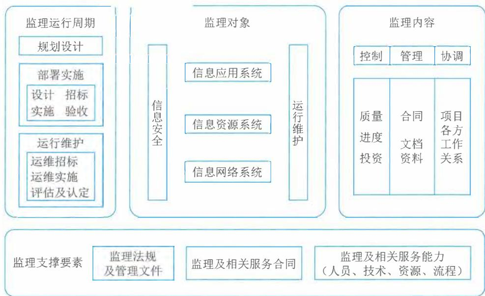

# 第16章 监理基础知识

在全球信息化的浪潮中，我国的信息化建设和应用经过了四十多年的发展，各种信息化应用系统已经渗透到国民经济和社会生活的方方面面。当然，在信息系统工程建设过程中，无论是业主单位还是承建单位依然面临许多任务，为了解决在信息系统工程建设过程中遇到的质量、进度、投资等问题，保障信息系统工程建设按照质量要求、投资计划、工程进度顺利完成，信息系统工程监理应运而生。经过二十多年的实践，尤其是随着国家法规性文件的推陈出新、一系列技术标准的贯彻落实和针对信息化监理规范的更新完善，信息系统工程监理行业不断得到发展壮大，逐渐在国家信息化项目的建设、应用过程中起到了至关重要的作用。信息系统工程监理对象包括五个方面：信息网络系统、信息资源系统、信息应用系统、信息安全和运行维护。

# 16.1 监理的意义和作用

众所周知，信息系统工程监理是吸取了建筑行业的建设监理的经验和思路，结合信息技术服务行业本身的特点发展而来的，是针对信息化建设独特的性质产生的新兴行业。信息系统工程监理系列标准规范的制定和大量专业技术人才的培养，对我国信息系统工程监理市场从无到有、从小到大、从弱到强的发展起到了规范和促进作用。同时，随着我国信息系统工程监理业务的不断扩展和规范，在信息技术服务中形成了信息系统工程监理的新市场，其服务质量和管理水平得以不断提高，所做的工作也得到行业认可，对提高我国信息化建设水平起到了极其重要的作用。

# 1. 监理的地位和作用

信息系统监理通常直接面对业主单位和承建单位，在双方之间形成一种系统的工作关系，在保障工程质量、进度、投资控制和合同管理、信息管理，协调双方关系中处于重要的、不可替代的地位。

信息系统监理为项目业主单位提供信息系统工程相关的技术建议。作为信息系统工程监理，对信息系统工程相关的技术的理解和认知，是对其专业素养的必然要求。项目监理在项目的可行性研究、项目实施、项目交付过程中要全程参与，通过对技术方案评价、管理过程监督、交付成果检验等方法和手段，为项目承建单位提供技术建议和解决对策。

信息系统监理代表项目业主单位对项目的实施过程进行全程的跟踪和监督管理。现阶段对信息系统工程监理的服务需求主要有：有关国有投资项目建设管理的国家政策、法规的要求；有关业主单位工程建设的实际需求，包括合规性管理的实际要求、审计要求和管理办法要求等；业主单位在一定程度上受到工程技术特点、管理实践、经验和技能等限制，必须通过第三方监

理服务协助承担有关监督、管理的责任等；或业主单位由于专业的原因，难以对项目建设过程进行有效的监督和管理，这时就会委托监理单位对项目承建单位的项目实施过程的标准性、规范性进行监督和管理，确保项目顺利交付。

信息系统监理保证项目交付成果的质量。信息系统工程监理要依据项目的质量目标和质量标准的要求，参照国家和行业标准，对项目的交付成果和项目的管理成果进行必要检验和审核，确保相关成果达到质量要求。

信息系统监理协调项目干系人间的关系，促进项目建设过程中的各类项目信息得到全面有效的共享、一致的理解和认同，保证项目质量目标的贯彻和落实。

信息系统工程监理涉及的部门和人员范围包括：监理及相关服务的资格认定和监督管理部门；从事监理及相关服务的单位和人员；信息系统工程的业主单位；信息系统工程的承建单位；信息系统运行维护服务的供方单位和需方单位；从事监理及相关服务的教育、培训和研究单位。

# 2. 监理的重要性与迫切性

信息系统工程监理在工程建设过程中的重要性是不言而喻的，在信息系统工程项目中，其重要性就更为突出，主要原因有以下6个方面：

（1）随着信息化项目应用的普及，信息系统工程无论大小，一般都关系到国家、企业、单位的重要业务；（2）随着信息技术的飞速发展，信息系统工程项目往往在还没有提出需求或需求还不明确时就付诸实施，因此在实施过程中需要不断修改；（3）由于用户需求的不断变化以及其他内部或外部因素的影响，信息系统工程存在不能按预定进度执行的问题和风险；（4）信息系统工程项目的投资相对比较大，如果管理不善会造成较大浪费；（5）信息系统工程的实施过程存在隐蔽工程，可视性差，如过程监督缺失，容易产生工程隐患；（6）信息系统工程项目存在“重建设，轻管理”的问题，尤其是项目内容从技术上或专业上比较复杂，业主单位缺乏足够的技术能力进行监管，需要懂专业的技术人员进行监督管理，并通过必要的信息化技术手段、方法和过程予以查验、审核，确认其技术指标是否实现。

# 3. 监理技术参考模型

信息系统工程监理的技术参考模型由四部分组成，即监理支撑要素、监理运行周期、监理对象和监理内容，其相互关系如图16- 1所示。参考模型表明，信息系统工程的监理及相关服务工作应建立在监理支撑要素的基础上，根据工程项目的需要，对监理运行周期的规划设计部分，提供相关信息技术咨询服务；在部署实施和运行维护部分，结合各项监理内容，对监理对象进行监督管理及提供相关信息技术服务。

监理支撑要素包括：监理法规及管理文件、监理及相关服务合同和监理及相关服务能力。其中监理服务能力要素由人员、技术、资源和流程四部分组成。

  
图16-1 信息系统工程监理及相关服务技术参考模型

（1）人员。人员主要包括总监理工程师、总监理工程师代表、监理工程师、监理员、外部技术协作体系、人力资源管理体系等。

（2）技术。技术主要包括监理工作体系、业务流程研究能力、监理技术规范、质量管理体系、监理大纲、监理规划、监理实施细则等。

（3）资源。资源包括监理机构、监理设施、监理知识库及监理案例库、检测分析工具及仪器设备、企业管理信息系统等。

（4）流程。流程包括项目管理体系、客户服务体系、监理及相关服务的制度和流程等。

监理活动最基础的内容被概括为“三控、两管、一协调”。

（1）三控。三控是指信息系统工程质量控制、信息系统工程进度控制和信息系统工程投资控制。

（2）两管。两管是指信息系统工程合同管理、信息系统工程信息管理。

（3）一协调。一协调是指在信息系统工程实施过程中协调有关单位及人员间的工作关系。

尽管在不同的教材、著作、文献中，还存在着“四控”“五控”，甚至“七控”等提法，例如信息系统工程变更控制、信息系统工程安全管理等，但从其内容看，这些提法中都包含有国家标准中所提的“三控”，即质量、进度、投资控制。因此，本书采用国家标准中提出的最基础的“三控”，而其他提法中多出来的那些“控”和“管”则均有其在相关环境中存在的合理性，本书不再进一步讨论。

# 16.2 监理相关概念

本节将对信息系统工程监理中的主要概念简要解释。

# 1.信息系统工程监理

1. 信息系统工程监理信息系统工程监理是指在政府工商管理部门注册的,且具有信息系统工程监理能力及资格的单位,受业主单位委托,依据国家有关法律法规、技术标准和信息系统工程监理合同,对信息系统工程项目实施的监督管理。

# 2.信息系统工程监理单位

信息系统工程监理单位是指从事信息系统工程监理业务的企业。它是具有独立企业法人资格,并具备规定数量的监理工程师和注册资金、必要的软硬件设备、完善的管理制度和质量保证体系、固定的工作场所和相关的监理工作业绩,从事信息系统工程监理业务的单位。

为区别信息系统工程监理单位在实力、能力、条件、业绩等方面的差异以适应信息系统工程由于级别、规模、复杂度、难度、应用范围等方面的区别而产生的不同需求,有些行业协会还对信息系统工程监理单位进行分级。

# 3.业主单位

3. 业主单位业主单位(也称建设单位)是指具有信息系统工程(含运行维护)发包主体资格和支付工程及相关服务价款能力的单位。

# 4.承建单位

4. 承建单位承建单位是指具有独立企业法人资格,具有承接信息系统工程建设能力的单位。

# 5.监理机构

5. 监理机构监理机构是指当监理单位对信息系统工程项目实施监理及相关服务时,负责履行监理合同的组织机构。

# 6.监理人员

从事信息系统工程监理业务的人员称为信息系统工程监理人员,主要包括监理工程师、总监工程师、总监理工程师代表和监理员等。

(1)监理工程师:监理单位正式聘任的,取得国家相关主管部门颁发的信息系统工程监理工程师资格证书的专业技术人员。

(2)总监理工程师:由监理单位法定代表人书面授权,全面负责监理及相关服务合同的履行,主持监理机构工作的监理工程师。

(3)总监理工程师代表:由总监理工程师书面授权,代表总监理工程师行使其部分职责和权力的监理工程师。

(4)监理员:经过监理及相关服务业务培训,具有同类工程相关专业知识,从事具体监理及相关服务工作的人员。

# 7.监理资料和工具

7. 监理资料和工具监理资料是指监理过程中需要的文件资料,主要包括监理大纲、监理规划、监理实施细则、监理意见和监理报告等。

(1)监理大纲:在投标阶段,由监理单位编制,经监理单位法定代表人(或授权代表)

书面批准,用于取得项目委托监理及相关服务合同,宏观指导监理及相关服务过程的纲领性文件。

(2) 监理规划: 在总监理工程师主持下编制, 经监理单位技术负责人书面批准, 用来指导监理机构全面开展监理及相关服务工作的指导性文件。

(3) 监理实施细则: 根据监理规划, 由监理工程师编制, 并经总监理工程师书面批准, 针对工程建设或运维管理中某一方面或某一专业监理及相关服务工作的操作性文件。

(4) 监理意见: 在监理过程中, 监理机构以书面形式向业主单位或承建单位提出的见解和主张。

(5) 监理报告: 在监理过程中, 监理机构对工程监理及相关服务阶段性的进展情况、专项问题或工程临时出现的事件、事态, 通过观察、检测、调查等活动, 形成以书面形式向业主单位提出的陈述。

监理工具是指在监理及相关服务过程中, 监理机构用于日常办公、监督、管理和检测等方面所需的设备或系统。

# 8. 监理过程

监理过程是指监理阶段负责进行监理的种类, 主要包括全过程监理、里程碑监理和阶段监理等。

(1) 全过程监理: 根据委托监理及相关服务合同要求开展工程建设及运行维护全过程的监理工作, 包括部署实施部分中的招标、设计、实施和验收阶段以及运行维护部分中的招标、实施、评价及认定阶段的监理工作。

(2) 里程碑监理: 根据委托监理及相关服务合同和信息系统工程标准规范要求, 对工程里程碑产生的结果进行确认的监理工作。

(3) 阶段监理: 根据委托监理及相关服务合同要求开展某个或某些特定阶段的监理工作。

# 9. 监理形式

监理形式是指监理过程中所采用的方式, 包括监理例会、签认、现场和旁站等。

(1) 监理例会: 由监理机构主持、有关单位参加的, 在工程监理及相关服务过程中针对质量、进度、投资控制和合同、文档资料管理以及协调项目各方工作关系等事宜定期召开的会议。

(2) 签认: 在监理过程中, 工程建设或运维管理任何一方签署, 并认可其他方所提供文件的活动。

(3) 现场: 开展项目所有监理及相关服务活动的地点。驻场服务属于现场监理的一种形式, 要求监理人员在项目执行期间, 一直在现场开展监理服务。

(4) 旁站: 在关键部位或关键工序施工过程中, 由监理人员在现场进行的监督或见证活动。

# 16.3 监理依据

从信息系统工程建设方面, 国家已经出台了许多管理规定和办法, 同时也有许多国家标准

和行业标准用于规范监理工作;针对信息系统工程监理,在专业技术和理论方面也出版了很多专著,这些都成为开展信息系统工程监理工作的重要依据。

# 1. 监理国家标准

自2005年信息化工程监理规范发布以来,已经经过了两轮国家标准修订,现行的国家标准主要有:

- GB/T 19668.1《信息技术服务监理第1部分:总则》。

- GB/T 19668.2《信息技术服务监理第2部分:基础设施工程监理规范》。

- GB/T 19668.3《信息技术服务监理第3部分:运行维护监理规范》。

- GB/T 19668.4《信息技术服务监理第4部分:信息安全监理规范》。

- GB/T 19668.5《信息技术服务监理第5部分:软件工程监理规范》。

- GB/T 19668.6《信息技术服务监理第6部分:应用系统:数据中心工程监理规范》。

- GB/T 19668.7《信息技术服务监理第7部分:监理工作量度量要求》。

# 2. 监理行业及团体标准

信息系统工程监理相关行业和团体标准主要有:

- T/CEAA PJ.001《信息系统工程监理服务评价第一部分监理单位服务能力评估规范》。

- T/CEAA PJ.002《信息系统工程监理服务评价第二部分从业人员能力要求》。

- T/CEAA PJ.003《信息系统工程监理服务评价第三部分从业人员能力评价指南》。

- T/CEAA PJ.004《信息系统工程监理服务评价第四部分服务成本度量指南》。

- T/CEAA PJ.005《信息系统工程监理服务评价第五部分服务质量评价规范》。

# 16.4 监理内容

信息系统工程建设在不同的阶段,监理服务内容有所不同,下面按照规划、招标、设计、实施、验收阶段分别进行介绍。

# 1. 规划阶段

规划阶段监理服务的基础活动主要包括:  $①$  协助业主单位构建信息系统架构;  $②$  可以为业主单位提供项目规划设计的相关服务,为业主单位决策提供依据;  $③$  对项目需求、项目计划和初步设计方案进行审查;  $④$  协助业主单位策划招标方法,适时提出咨询意见。

# 2. 招标阶段

招标阶段监理服务的基础活动主要包括:  $①$  在业主单位授权下,参与业主单位招标前的准备工作,协助业主单位编制项目的工作计划。  $②$  在业主单位授权下,参与招标文件的编制,并对招标文件的内容提出监理意见。  $③$  在业主单位授权下,协助业主单位进行招标工作。如委托招标,审核招标代理机构资质是否符合行业管理要求。  $④$  向业主单位提供招投标咨询服务。  $⑤$  在业主单位授权下,参与承建合同的签订过程,并对承建合同的内容提出监理意见。

# 3.设计阶段

3. 设计阶段设计阶段监理服务的基础活动主要包括:  $①$  设计方案、测试验收方案、计划方案的审查;依据承建合同,审查承建单位提交的设计方案、测试验收方案、计划方案,审查时应充分考虑业主单位的项目需求,并参考相关的技术标准。不应只审查文档规范性,还应审查设计内容的完整性、正确性和合理性。同时协助承建单位完善上述方案,促使其满足工程需求,符合相关的法律、法规和标准,并与承建合同相符。  $②$  变更方案和文档资料的管理。在设计阶段,文档资料的管理显得尤为重要,尤其是文档资料的版本控制和变更控制等。设计变更应得到有效的控制,否则将影响项目实施的进度、投资和质量。

# 4.实施阶段

4. 实施阶段实施阶段的监理服务的基础活动主要是通过现场监督、核查、记录和协调,及时发现项目实施过程中的问题,并督促承建单位采取措施、纠正问题,促使项目质量、进度、投资等按要求实现。监理的主要活动包括:质量控制、进度控制、投资控制、合同管理、文档资料和协调等。

# 5.验收阶段

5. 验收阶段项目验收阶段是全面验证和认可项目实施成果的阶段,由于信息系统工程的特殊性,进行信息系统工程建设项目验收时,有必要坚持以测试为基础、以事实为依据的项目的验收工作。一般情况下,监理机构需要参加验收阶段的各项管理工作,并非只进行监督和检查。在验收阶段,监理服务的基础活动主要包括:  $①$  审核项目测试验收方案(验收目标、双方责任、验收提交清单、验收标准、验收方式、验收环境等)的符合性及可行性;  $②$  协调承建单位配合第三方测试机构进行项目系统测评;  $③$  促使项目的最终功能和性能符合承建合同、法律法规和标准的要求;  $④$  促使承建单位所提供的项目各阶段形成的技术、管理文档的内容和种类符合相关标准。

# 16.5 监理要素

16.5 监理要素监理及相关服务应遵守与监理有关法规文件的规定,包括合同、法律、法规、标准和管理文件等的要求。

# 16.5.1 监理合同

监理合同的内容主要包括监理及相关服务内容、服务周期、双方的权利和义务、监理及相关服务费用的计取和支付、违约责任及争议的解决办法和双方约定的其他事项。

监理及相关服务合同可按规划设计、部署实施、运行维护中选择的各部分单独或合并签订,并将各部分服务范围及费用在合同中明确。

依据监理合同及其补充协议,总监理工程师签署监理费申请表,报业主单位。

监理机构应参与承建合同和运维服务合同的签订过程,在承建合同和运维服务合同中应明确要求承建单位和运维服务供方单位接受监理机构的监理。

监理服务宜采用全过程监理,也可采用里程碑监理或阶段监理。监理工作起始和结束的具体时间由监理单位与业主单位根据监理合同中有关条款和实际情况执行。

# 16.5.2 监理服务能力

监理单位应根据监理及相关服务范围,在人员、技术、资源、流程等四方面,建立和完善服务能力体系。

# 1.人员

监理人员的构成包括:总监理工程师、总监理工程师代表、监理工程师和监理员。监理单位人力资源管理体系应涵盖招聘与配置、培训与开发、绩效管理、薪酬管理等主要方面,并具备人力资源管理制度和流程。监理单位人力资源管理制度应在实际工作中得到贯彻执行,且有记录、可核查。

# 2.技术

1)监理工作体系

监理单位应建立完善的监理工作体系,包括为实施信息系统工程监理业务所建立的组织体系(含组织机构及职责、专业人员及岗位分工)、管理体系(含工作制度、工作程序)和文档体系(含标准化文档的编制、使用和保存)等。

监理单位应通过对主要客户的业务流程、业务特点以及客户所属领域信息技术发展的长期积累和研究,能够较好地把握客户的信息化需求,充分掌握监理服务工作的重点和要点,能够为客户的信息化建设提供有针对性的监理及相关服务工作方案和有价值的报告。

监理单位应建立质量管理体系。监理单位质量管理体系证书的覆盖范围应包括与监理及相关服务业务有关的所有活动和过程,从事监理及相关服务的所有部门和人员应在体系覆盖的范围内。

2)监理技术规范

监理单位制定的本单位的信息系统工程监理技术规范(或监理操作规程)应符合相关标准对监理工作的要求。

3)监理技术

监理的主要技术与管理手段包括检查、旁站、抽查、测试和软件特性分析等,使用这些手段对监理要点实施现场验证与确认,加强风险防范;利用监理知识库、监理案例库,对将要实施的项目进行风险分析与管理,并依据相关技术、管理及服务标准,审核或编制项目文档资料;监理技术人员应加强新的信息技术、产品发展趋势及行业知识的学习,在实践中不断更新和完善监理知识库及监理案例库,并借助现代通信和交流手段提高沟通效率。

4)监理大纲

监理大纲是监理单位承担信息系统工程项目的监理及相关服务的法律承诺。监理大纲的编制应针对业主单位对监理工作的要求,明确监理单位所提供的监理及相关服务目标和定位,确定具体的工作范围、服务特点、组织机构与人员职责、服务保障和服务承诺。监理大纲编制的

程序:  $①$  监理单位编制监理大纲后,应经监理单位技术负责人审核;  $②$  由监理单位法定代表人(或授权代表)书面批准。

监理大纲编制的依据包括业主单位对监理工作的要求(包括监理招标文件);监理单位的服务质量管理体系;监理及相关服务规范;与工程及相关服务有关的法律、法规和技术标准规范。

监理大纲的内容包括监理工作目标、监理工作依据、监理工作范围、项目监理机构及配备人员、监理工作计划、各阶段监理工作内容、监理流程和成果、监理服务承诺以及其他内容。

# 5)监理规划

监理规划是实施监理及相关服务工作的指导性文件。监理规划的编制应针对项目的实际情况,明确监理机构的工作目标,确定具体的监理工作制度、方法和措施。监理规划编制的程序:  $①$  在签订监理合同后,总监理工程师应主持编制监理规划;  $②$  监理规划完成后,应经监理单位技术负责人审批:  $③$  监理规划报送业主单位确认后生效。

监理规划编制的依据包括:与工程及相关服务有关的法律、法规及审批文件;与工程及相关服务有关的标准、设计文件和技术资料;监理合同、承建合同、运维服务合同、工程及相关服务的其他文件。监理规划的内容应包括工程及相关服务对象概况、监理依据、监理范围、监理目标、监理内容、监理机构的组织及监理人员的职责、监理设施、监理工作方法及措施、监理工作制度等。在监理工作实施过程中,如实际情况或条件发生重大变化而需要调整监理规划内容时,应由总监理工程师组织监理工程师修改,经监理单位技术负责人审批后报送业主单位签字确认。

# 6)监理实施细则

监理机构按照监理规划中规定的工作范围、内容、制度和方法等编制监理细则,开展具体的监理及相关服务工作。监理细则应符合监理规划的要求,结合工程及相关服务项目的专业特点,具有可操作性。监理细则编制的程序:  $①$  监理工程师依据监理规划,编制监理细则;  $②$  监理细则应经总监理工程师批准。监理细则编制的依据:签字确认的监理规划;与工程及相关服务有关的标准、设计文件和技术资料;工程实施方案及相关服务方案和工程相关文件。监理细则的主要内容:工程及相关服务的特点;监理工作流程;监理工作的控制要点及目标;监理方法及措施。

在监理工作实施过程中,监理细则应根据情况进行补充、修改和完善,并报总监理工程师批准。

# 3.资源

# 1)监理机构

监理单位履行监理合同时,应建立监理机构。监理机构在完成监理合同规定的监理及相关服务内容后方可撤销。监理机构的组建,监理机构的组织形式和规模,应根据监理及相关服务招标文件或委托文件约定的工程类别、规模、服务内容、技术复杂程度、实施工期和施工环境等因素确定。监理单位应在监理大纲中明确符合条件的监理机构,并在监理合同签订后将监理机构的组织形式、人员构成及对总监理工程师的任命书面报送业主单位。监理机构应根据监理工程类别、规模、技术复杂程度及相关服务内容,按监理合同的约定,配备满足监理及相关服

务需要的设备和工具等。业主单位为监理机构提供的设施:业主单位应按照监理合同的约定,为监理及相关服务工作顺利开展所需的办公、交通、通信等设施提供便利;监理机构应妥善保管和使用业主单位提供的设施,在完成监理工作后交还业主单位。

2) 监理知识库和监理案例库

监理单位应具备监理及相关服务知识库和监理案例库,以保证单位内各监理机构共享所积累的技术知识和信息。这些库应具备知识的添加、更新和查询功能,并确保其知识是可用的和可共享的。监理单位应针对知识管理要求制定相关管理制度,做好知识生命周期管理工作。

进行知识管理工作时,应开展以下工作:

- 知识体系构建:需具备提供监理服务所需的知识体系和能力。知识体系包括但不限于基础知识、业务知识、专业知识和管理知识等。

- 知识采集:需具备知识采集渠道和机制,根据知识体系的结构,建立对各类知识进行分类采编的渠道。

- 知识检查:需具备知识检查和更新机制,确保知识的适用性、准确性和时效性。

- 知识应用:提供知识查询、分析、管理及应用方法和工具,并进行必要的培训,发挥知识价值。

- 知识评价:应从知识的使用频度、适用性和价值等方面进行综合评价,建立知识评价体系。

- 知识维护:需要具备相应方法和工具来完成知识生命周期的管理;具备知识采集、知识审核、知识归类、知识存档、知识检索、知识使用、知识评价、知识统计分析、知识使用者权限管理和知识备份等功能。

监理单位的案例库包括信息系统工程项目的背景、建设内容、监理工作任务、监理要点和监理经验等内容,这些可对将来类似项目的实施起到指导作用。但应注意,案例公开的信息须征得业主单位的同意,并符合有关的保密规定,不得私自泄露客户的重要涉密信息。

3) 检测分析工具及仪器设备

监理单位在监理项目实施过程中应能运用信息系统检测分析工具及仪器设备对信息系统工程进行检测。监理单位应根据工程及相关服务情况、业务范围,配备满足监理工作需要的监理工具,包括软硬件工具和监理设备。

4) 企业管理信息系统

监理单位应建有内部基础网络环境,通过管理软件实现内部办公、财务和合同的信息化管理。监理单位的管理信息系统应在实际工作中得到应用。监理单位宜利用管理信息系统对监理工程师的现场工作进行管理,实现项目的质量、进度和投资控制。

# 4. 流程

1) 项目管理体系

监理单位应有负责项目管理的部门,有项目管理制度和流程,有项目管理评价方法、项目管理知识库和项目管理工具。项目管理工具包括企业购置或自主开发的具有项目管理功能的工

具。监理单位的项目管理制度和流程应在实际工作中得到贯彻执行,且有记录,可核查。

2)客户服务体系

2)客户服务体系监理单位应配置专门的机构和人员,有客户服务制度和流程,有满意度调查和投诉处理机制。监理单位的客户服务制度、流程应在实际工作中得到贯彻执行,且有记录,可核查。

3)监理及相关服务的制度和流程

3)监理及相关服务的制度和流程监理单位应依据国家法律、法规、标准、行业管理要求和企业质量保证体系实施情况,制定规范的监理及相关服务各项管理制度和工作流程,并按照这些管理制度和工作流程开展监理及相关服务工作。

# 16.6 本章练习

# 1.选择题

(1) 不是信息系统工程监理对象。

A.信息网络系统 
B.信息资源系统

C.信息技术服务组织 
D.信息应用系统

参考答案:C

(2)监理服务能力重点关注

A.战略、组织、流程、绩效

B.人员、技术、资源、流程

C.工具、知识、治理、满意度

D.文件、活动、人员、绩效

参考答案:B

(3) 不是规划阶段监理服务的基础活动。

A.协助业主单位构建信息系统架构

B.可以为业主单位提供项目规划设计的相关服务,为业主单位决策提供依据

C.在业主单位授权下,参与业主单位招标前的准备工作,协助业主单位编制项目的工

作计划

D.协助业主单位策划招标方法,适时提出咨询意见

参考答案:C

