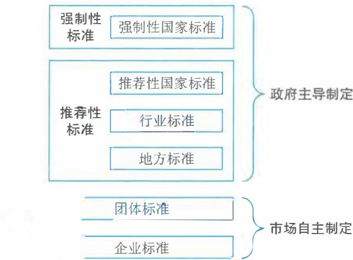

# 第17章 法律法规和标准规范

法律法规对信息化的建设发展和管理过程起到了促进和规范作用，标准规范的建立能够规范信息化建设过程，为过程中的各类活动提供规则和指南。随着信息技术的飞速发展，在信息化建设过程中，应充分利用法律法规和标准规范引导新技术在行业中的应用。

# 17.1 法律法规

17.1 法律法规信息化法律法规作为国家信息化体系的六大要素之一，对信息化建设的发展和管理起到了有力的促进和规范作用，为依法规范和保护信息化建设快速、健康和可持续发展提供了有力保障。本节将围绕法律的基本概念、法律体系、法律效力层级以及信息系统集成项目管理过程中常用的法律法规进行介绍。

# 17.1.1 法与法律

# 1.基本概念

法是由国家制定、认可并保证实施，以权利义务为主要内容，由国家强制力保证实施的社会行为规范及其相应的规范性文件的总称。法作为一种特殊的社会规范，是人类社会发展的产物。

法律是指由国家行使立法权的机关依照立法程序制定和颁布的涉及国家重大问题的规范性文件，通常规定社会政治、经济以及其他社会生活中最基本的社会关系和行为准则。一般地说，法律的效力仅低于宪法，其他一切行政法规和地方性法规都不得与法律相抵触，凡有抵触，均属无效。

# 2.本质与特征

法的本质是统治阶级意志的体现，是由特定社会的物质生活条件决定的。

一般认为法具有四大基本特征：

（1）法是调整人的行为或社会关系的规范；（2）法是由国家制定或认可，并具有普遍约束力的社会规范；（3）法是以国家强制力保证实施的社会规范；（4）法是规定权利和义务的社会规范。

# 17.1.2 法律体系

17.1.2 法律体系法律体系通常是指一个国家全部现行法律规范分类组合为不同的法律部门而形成的有机联系的统一整体。

# 1.世界法律体系

世界范围内，延续时间较长且产生较大影响的法系包括大陆法系、英美法系、印度法系和

中华法系等。对世界影响最大的法系是大陆法系和英美法系。这两种法系涉及历史、文化、信仰立场和社会背景等,从本质到理念上均有较大差别。

(1)大陆法系(Civil Law),又名欧陆法系、罗马法系、民法法系。大陆法系与罗马法在精神上一脉相承。12世纪,查士丁尼的《国法大全》在意大利被重新发现,由于其法律体系较之当时欧洲诸领主国家的习惯法更加完备,于是罗马法在欧洲大陆上被纷纷效法,史称"罗马法复兴",在与基督教文明与商业文明等渐渐融合后,形成了今天大陆法系的雏形。此为大陆法系的由来,故大陆法系又称罗马法系。

大陆法系沿袭罗马法,具有悠久的法典编纂传统,重视编写法典,具有详尽的成文法,强调法典必须完整,以致每一个法律范畴的每一个细节,都在法典里有明文规定。大陆法系崇尚法理上的逻辑推理,并以此为依据实行司法审判,要求法官严格按照法条审判。

(2)英美法系(Common Law)又称普通法系、海洋法系。英美法系因其起源,又称之为不成文法系。同大陆法系偏重于法典相比,英美法系在司法审判原则上更遵循先例,即作为判例的先例对其后的案件具有法律约束力,成为日后法官审判的基本原则。而这种以个案判例的形式表现出法律规范的判例法(Case Law)是不被实行大陆法系的国家承认的,最多只具有辅助参考价值。

英美法是判例之法,而非制定之法,法官在地方习惯法的基础上,归纳总结形成一套适用于整个社会的法律体系,具有适应性和开放性的特点。在审判时,更注重采取当事人主义和陪审团制度。下级法庭必须遵从上级法庭以往的判例,同级的法官判例没有必然约束力,但一般会互相参考。

在实行英美法系的国家中,法律制度与理论的发展实质上靠的是一个个案例的推动。因此,我们看到英国、美国等国家的判决,法官、陪审团、律师之间的博弈都极为精彩,往往一个史无先例的判决产生后,就为后世相同情况的判决提供了依据。

大陆法系在形式上具有体系化、概念化的特点,便于模仿和移植。在实行大陆法系的国家中,法律进步与完善的标志是一部部新法律的出台与实施。大陆法系与英美法系作为当今世界最重要的两大法系,并不是对立的,现在也多有交流和融合。

# 2.中国特色社会主义法律体系

中国特色社会主义法律体系,是以宪法为统帅,以法律为主干,以行政法规、地方性法规为重要组成部分,由宪法相关法、民法商法、行政法、经济法、社会法、刑法、诉讼与非诉讼程序法等多个法律部门组成的有机统一整体。

(1)宪法相关法是与宪法相配套、直接保障宪法实施和国家政权运作等方面的法律规范,调整国家政治关系,主要包括国家机构的产生、组织、职权和基本工作原则方面的法律,民族区域自治制度、特别行政区制度、基层群众自治制度方面的法律,维护国家主权、领土完整、国家安全、国家标志象征方面的法律,保障公民基本政治权利方面的法律。

(2)民法商法是规范社会民事和商事活动的基础性法律。民法是调整平等主体的公民之间、法人之间、公民和法人之间的财产关系和人身关系的法律规范,遵循民事主体地位平等、意思自治、公平、诚实信用等基本原则。商法调整商事主体之间的商事关系,遵循民法的基本原则,

同时秉承保障商事交易自由、等价有偿、便捷安全等原则。

(3) 行政法是关于行政权的授予、行政权的行使以及对行政权的监督的法律规范,调整的是行政机关与行政管理相对人之间因行政管理活动发生的关系,遵循职权法定、程序法定、公正公开、有效监督等原则,既保障行政机关依法行使职权,又注重保障公民、法人和其他组织的权利。

(4) 经济法是调整国家从社会整体利益出发,对经济活动实行干预、管理或者调控所产生的社会经济关系的法律规范。经济法为国家对市场经济进行适度干预和宏观调控提供法律手段和制度框架,防止市场经济的自发性和盲目性所导致的弊端。

(5) 社会法是调整劳动关系、社会保障、社会福利和特殊群体权益保障等方面的法律规范,遵循公平和谐和国家适度干预原则,通过国家和社会积极履行责任,对劳动者、失业者、丧失劳动能力的人以及其他需要扶助的特殊人群的权益提供必要的保障,维护社会公平,促进社会和谐。

(6) 刑法是规定犯罪与刑罚的法律规范。它通过规范国家的刑罚权,惩罚犯罪,保护人民,维护社会秩序和公共安全,保障国家安全。

(7) 诉讼与非诉讼程序法是规范解决社会纠纷的诉讼活动与非诉讼活动的法律规范。诉讼法律制度是规范国家司法活动解决社会纠纷的法律规范,非诉讼程序法律制度是规范仲裁机构或者人民调解组织解决社会纠纷的法律规范。

我国的法律体系中大体包括以下几种法律法规:法律、法律解释、行政法规、地方性法规、自治条例和单行条例、规章等。

(1) 法律:我国最高权力机关全国人民代表大会和全国人民代表大会常务委员会行使国家立法权,立法通过后,由国家主席签署主席令予以公布。

(2) 法律解释:是对法律中某些条文或文字的解释或限定。这些解释将涉及法律的适用问题。法律解释权属于全国人民代表大会常务委员会,其做出的法律解释同法律具有同等效力。还有一种司法解释,即由最高人民法院或最高人民检察院做出的解释,用于指导各基层法院的司法工作。

(3) 行政法规:是由国务院制定的,通过后由国务院总理签署国务院令公布。这些法规也具有全国通用性,是对法律的补充,在成熟的情况下会被补充进法律,其地位仅次于法律。

(4) 地方性法规、自治条例和单行条例:其制定者是各省、自治区、直辖市的人民代表大会及其常务委员会,相当于是各地方的最高权力机构。地方性法规大部分称作条例,有的为法律在地方的实施细则,部分为具有法规属性的文件,如决议、决定等。

(5) 规章:其制定者是国务院各部、委员会、中国人民银行、审计署和具有行政管理职能的直属机构,这些规章仅在本部门的权限范围内有效。还有一些规章是由各省、自治区、直辖市和较大的市的人民政府制定的,仅在本行政区域内有效。

# 17.1.3 法的效力

法的效力即法律的约束力,是指人们应当按照法律规定的那样行为,必须服从。通常,法的效力分为对象效力、空间效力和时间效力。

# 1. 对象效力

对象效力即对人的效力,是指法律对谁有效力,适用于哪些人。根据我国法律,对人的效

力包括两个方面:

(1)对中国公民的效力:中国公民在中国领域内一律适用中国法律。在中国境外的中国公民,也应遵守中国法律并受中国法律保护。但是,这里存在着适用中国法律与适用所在国法律的关系问题。对此,应当根据法律区分情况,分别对待。

(2)对外国人和无国籍人的效力:外国人和无国籍人在中国领域内,除法律另有规定者外,适用中国法律,这是国家主权原则的必然要求。

# 2.空间效力

法律的空间效力指法律在哪些地域有效力,适用于哪些地区,一般来说,一国法律适用于该国主权范围所及的全部领域,包括领土、领水及其底土和领空,以及作为领土延伸的本国驻外使馆、在外船舶及飞机。

# 3.时间效力

法律的时间效力。指法律何时生效、何时终止效力以及法律对其生效以前的事件和行为有无溯及力。

(1)法律的生效时间。法律的生效时间主要有三种:

$\oplus$  自法律公布之日起生效;

$\oplus$  由该法律规定具体生效时间;

$\oplus$  规定法律公布后符合一定条件时生效。

(2)法律终止生效的时间。法律终止生效,即法律被废止,指法律效力的消灭。它一般分为明示的废止和默示的废止两类。

(3)法的溯及力。法的溯及力是指法律对其生效以前的事件和行为是否适用。如果适用,就具有溯及力;如果不适用,就没有溯及力。

# 17.1.4 法律法规体系的效力层级

法律法规的效力层级是指法律体系中的各种法的形式,由于制定的主题、程序、时间、使用范围等的不同,具有不同的效力,形成法律法规的效力等级体系。

$\oplus$  纵向效力层级。宪法具有最高的法律效力,随后依次是法律、行政法规、地方性法规、规章。按制定机关来说,全国人民代表大会及其常务委员会制定的法律高于国务院、国务院各部门、各地人民代表大会及政府制定的法规和规章;国务院制定的行政法规效力高于国务院各部门制定的规章以及各地制定的地方性法规、地方性规章;地方人民代表大会及其常务委员会制定的地方性法规效力高于当地政府制定的规章。

$\oplus$  横向效力层级。横向效力层级主要指同一机关制定的法律、行政法规、地方性法规、规章;特别规定与一般规定不一致的,适用特别规定。

$\oplus$  时间序列效力层级。时间序列效力层级主要指同一机关制定的法律、行政法规、地方性法规、规章,新的规定效力高于旧规定,也就是我们平常说的"新法优于旧法"。

特殊情况处理有以下处理原则:

(1)法律之间对同一事项新的一般规定与旧的特别规定不一致时由全国人民代表大会常务

委员会裁决。

(2) 地方性法规、规章新的一般规定与旧的特殊规定不一致时,由制定机构裁决。

(3) 地方性法规与部门规章之间对同一事项规定不一致,不能确定如何适用时,由国务院提出意见。国务院认为适用地方性法规的应当决定在该地方适用地方性法规的规定,认为适用部门规章的,应当提请全国人大常委会裁决。

(4) 部门规章之间、部门规章与地方政府规章之间对同一事项的规定不一致时,由国务院裁决。

# 17.1.5 信息系统集成项目管理中常用的法律

# 1.民法典(合同编)

2020年5月,中华人民共和国第十三届全国人民代表大会通过的《中华人民共和国民法典》合同编(以下简称"合同编")是信息化法律法规领域的最重要的法律基础。根据合同编规定,合同是民事主体之间设立、变更、终止民事法律关系的协议。依法成立的合同,受法律保护。依法成立的合同,仅对当事人具有法律约束力,但是法律另有规定的除外。当事人对合同条款的理解有争议的,应当依法确定争议条款的含义。合同文本采用两种以上文字订立并约定具有同等效力的,对各文本使用的词句推定具有相同含义。各文本使用的词句不一致的,应当根据合同的相关条款、性质、目的以及诚信原则等予以解释。

# 2.招标投标法

《中华人民共和国招标投标法》(以下简称"招投标法")是国家用来规范招标投标活动、调整在招标投标过程中产生的各种关系的法律规范的总称。另外,国家还颁布《中华人民共和国招标投标法实施条例》作为执行补充。这两部法律法规中,对招投标保护及其具体措施作出了明确的规定。

# 3.政府采购法

2014年8月31日第十二届全国人民代表大会常务委员会修正了《中华人民共和国政府采购法》(以下简称"政府采购法"),该法律的制定是为了规范政府采购行为,提高政府采购资金的使用效益,维护国家利益和社会公共利益,保护政府采购当事人的合法权益,促进廉政建设。2015年3月1日施行的《中华人民共和国政府采购法实施条例》规定,政府采购是指各级国家机关、事业单位和团体组织,使用财政性资金采购依法制定的集中采购目录以内的或者采购限额标准以上的货物、工程和服务的行为。政府集中采购目录和采购限额标准依照政府采购法规定的权限制定。

# 4.专利法

2020年10月17日第四次修正的《中华人民共和国专利法》(以下简称"专利法")通过,并于2021年6月1日正式实施。专利法规定发明创造是指发明、实用新型和外观设计。发明是指对产品、方法或者其改进所提出的新的技术方案。实用新型是指对产品的形状、构造或者其结合所提出的适于实用的新的技术方案。外观设计是指对产品的整体或者局部的形状、图案或

者其结合以及色彩与形状、图案的结合所作出的富有美感并适于工业应用的新设计。

# 5. 著作权法

2020年11月11日发布第三次修正版《中华人民共和国著作权法》(以下简称"著作权法")。同时,国家主席习近平在2020年11月11日发布主席令,其中指出《全国人民代表大会常务委员会关于修改〈中华人民共和国著作权法〉的决定》已由中华人民共和国第十三届全国人民代表大会常务委员会第二十三次会议于2020年11月11日通过,现予公布,2021年6月1日正式施行。这部法律中,对著作权保护及其具体实施作出了明确的规定。

# 6. 商标法

2019年4月23日通过,2019年11月1日起施行的《中华人民共和国商标法》(以下简称"商标法")是信息化领域政策法规的重要的法律基础之一。国务院工商行政管理部门商标局主管全国商标注册和管理的工作。国务院工商行政管理部门设立商标评审委员会,负责处理商标争议事宜。经商标局核准注册的商标为注册商标,包括商品商标、服务商标和集体商标、证明商标;商标注册人享有商标专用权,受法律保护。

# 7. 网络安全法

2017年6月1日起正式实施的《中华人民共和国网络安全法》(以下简称"网络安全法")是我国第一部全面规范网络空间安全管理方面问题的基础性法律。网络安全法中给出了网络、网络安全、网络数据等用语的定义,明确了部门、企业、社会组织和个人的权利、义务和责任。规定了国家网络安全工作的基本原则、主要任务和重大指导思想、理念。网络安全法的制定是为了保障网络安全,维护网络空间主权和国家安全、社会公共利益,保护公民、法人和其他组织的合法权益,促进经济社会信息化健康发展。适用于在中华人民共和国境内建设、运营、维护和使用网络,以及网络安全的监督管理。

# 8. 数据安全法

《中华人民共和国数据安全法》(以下简称"数据安全法")于2021年9月1日起正式施行。数据安全法从数据安全与发展、数据安全制度、数据安全保护义务、政务数据安全与开放的角度对数据安全保护的义务和相应法律责任进行规定。数据安全法作为数据安全领域最高位阶的专门法,与网络安全法一起补充了《中华人民共和国国家安全法》框架下的安全治理法律体系,更全面地提供了国家安全在各行业、各领域保障的法律依据。同时,数据安全法延续了网络安全法生效以来的"一轴两翼多级"的监管体系,通过多方共同参与实现各地方、各部门对工作集中收集和产生数据的安全管理。

# 17.2 标准规范

标准是对重复性事物和概念所做的统一规定,它以科学技术和实践经验的结合成果为基础,经有关方面协商一致,由主管机构批准,以特定形式发布作为共同遵守的准则和依据。构建生产和管理行为制定统一的标准化体系,是现代化社会发展的客观需要,同时也为推动整个社会

的发展进程发挥了巨大的作用。本节将围绕标准与标准化的知识要点以及信息系统集成项目管理过程中常用的标准规范进行简要介绍。

# 17.2.1 标准和标准化

# 1. 标准和标准化基本概念

国家标准GB/T20000.1《标准化工作指南第1部分：标准化和相关活动的通用术语》给出了标准的定义。标准是指：“通过标准化活动，按照规定的程序经协商一致制定，为各种活动或其结果提供规则、指南或特性，供共同使用和重复使用的文件。”标准的作用是保障人类健康和安全、保护环境、促进资源的合理利用；增进相互理解；保障法规的有效实施。标准是经济社会活动的技术依据，是国家基础性制度建设的重要内容。

国家标准GB/T20000.1对标准化的定义是：“为了在既定范围内获得最佳秩序，促进共同效益，对现实问题或潜在问题确立共同使用和重复使用的条款以及编制、发布和应用文件的活动。标准化活动确立的条款，可形成标准化文件，包括标准和其他标准化文件。标准化的主要效益在于为产品、过程或服务的预期目的改进它们的适用性，促进贸易、交流以及技术合作。”标准化工作的任务是制定标准、组织实施标准以及对标准的制定、实施进行监督。

# 2. 主要标准化机构

1）国际标准化组织（International Organization for Standardization，ISO）

ISO是世界上最大、最有权威性的国际标准化专门机构。其目的和宗旨是在全世界范围内促进标准化工作的发展，以便于国际物资交流和服务，并扩大在知识、科学、技术和经济方面的合作。其主要活动是制定国际标准，协调世界范围的标准化工作，组织各成员和技术委员会进行情报交流，以及与其他国际组织进行合作，共同研究有关标准化的问题。

2）国际电工委员会（International Electrotechnical Commission，IEC）

IEC是世界上成立最早的国际性电工标准化机构，负责有关电气工程和电子工程领域中的国际标准化工作。其宗旨是促进电气、电子工程领域中标准化及有关问题的国际合作，增进国际间的相互了解。IEC标准的权威性是世界公认的。

3）国际电信联盟（International Telecommunication Union，ITU）

ITU是联合国的一个专门机构，也是联合国机构中历史最长的一个国际组织，分为国际电信联盟标准化部门（ITU- T）、国际电信联盟无线电通信部门和国际电信联盟电信发展部门，其中标准化部门的主要职责是完成国际电信联盟有关电信标准化的目标，使全世界的电信标准化。

4）中国标准化协会（China Association for Standardization，CAS）

CAS是由全国从事标准化工作的组织和个人自愿参与构成的全国性法人社会团体，是中国科学技术协会重要成员单位之一，接受国家市场监督管理总局和国家标准化管理委员会的领导和业务指导。其宗旨是充分发挥社会团体的桥梁和纽带作用，团结和组织全国标准化科技工作

者,根据政府、社会、市场、企业的需要,宣传、普及标准化知识,开展标准化学术研讨,提供标准化技术咨询服务,促进国内、国际标准化的合作与交流,推动中国标准化事业的发展。

5)国家标准化管理委员会(Standardization Administration of China,SAC)

5)国家标准化管理委员会(Standardization Administration of China,SAC)SAC的职责划入国家市场监督管理总局,对外保留国家标准化管理委员会牌子。其主要职责是以国家标准化管理委员会名义,下达国家标准计划,批准发布国家标准,审议并发布标准化政策、管理制度、规划、公告等重要文件;开展强制性国家标准对外通报;协调、指导和监督行业、地方、团体、企业标准工作;代表国家参加国际标准化组织、国际电工委员会和其他国际或区域性标准化组织;承担有关国际合作协议签署工作;承担国务院标准化协调机制日常工作。

6)全国信息技术标准化技术委员会(China National Information Technology Standardization Technical Committee,CITS)

6)全国信息技术标准化技术委员会(China National Information Technology Standardization Technical Committee, CITS)CITS原全国计算机与信息技术处理标准化技术委员会,是在国家标准化委员会和工业和信息化部的共同领导下,从事全国信息技术领域标准化工作的技术组织。其工作范围是信息技术领域的标准化,涉及信息采集、表示、处理、传输、交换、描述、管理、组织、存储、检索及其技术,系统与产品的设计、研制、管理、测试及相关工具的开发等标准化工作。

# 17.2.2 标准分级与标准分类

# 1.标准的层级

根据2017年修订发布的《中华人民共和国标准化法》将标准分为国家标准、行业标准、地方标准、团体标准和企业标准五个级别。各层级之间具有一定的依从关系和内在联系,形成覆盖全国且层次分明的标准体系。

(1)国家标准。对需要在全国范围内统一的技术要求,应当制定国家标准。国家标准由国务院标准化行政主管部门编制计划和组织草拟,并统一审批、编号和发布。

(2)行业标准。对没有推荐性国家标准、需要在全国某个行业范围内统一的技术要求,可以制定行业标准。行业标准由国务院有关行政主管部门制定。

(3)地方标准。为满足地方自然条件、风俗习惯等特殊技术要求,可以制定地方标准。地方标准由省、自治区、直辖市人民政府标准化行政主管部门制定;设区的市级人民政府标准化行政主管部门根据本行政区域的特殊需要,经所在地省、自治区、直辖市人民政府标准化行政主管部门批准,可以制定本行政区域的地方标准。地方标准由省、自治区、直辖市人民政府标准化行政主管部门报国务院标准化行政主管部门备案,由国务院标准化行政主管部门通报国务院有关行政主管部门。

(4)团体标准。团体标准是依法成立的社会团体为满足市场和创新需要,协调相关市场主体共同制定的标准。国务院标准化行政主管部门统一管理团体标准化工作。国务院有关行政主管部门分工管理本部门、本行业的团体标准化工作。县级以上地方人民政府标准化行政主管部门统一管理本行政区域内的团体标准化工作。县级以上地方人民政府有关行政主管部门分工管理本行政区域内本部门、本行业的团体标准化工作。

（5）企业标准。企业标准是对企业范围内需要协调、统一的技术要求、管理要求和工作要求所制定的标准，是企业组织生产、经营活动的依据。企业可以根据需要自行制定企业标准，或者与其他企业联合制定企业标准。

# 2. 标准的类型

根据《中华人民共和国标准化法》，国家标准分为强制性标准和推荐性标准。行业标准、地方标准是推荐性标准。强制性标准必须执行。国家鼓励采用推荐性标准。我国现行标准体系如图17- 1所示。

  
图17-1 我国现行的标准体系

（1）强制性标准。对保障人身健康和生命财产安全、国家安全、生态环境安全以及满足经济社会管理基本需要的技术要求，应当制定强制性国家标准。国务院有关行政主管部门依据职责负责强制性国家标准的项目提出、组织起草、征求意见和技术审查。国务院标准化行政主管部门负责强制性国家标准的立项、编号和对外通报。国务院标准化行政主管部门应当对拟制定的强制性国家标准是否符合前款规定进行立项审查，对符合前款规定的予以立项。省、自治区、直辖市人民政府标准化行政主管部门可以向国务院标准化行政主管部门提出强制性国家标准的立项建议，由国务院标准化行政主管部门会同国务院有关行政主管部门决定。社会团体、企业事业组织以及公民可以向国务院标准化行政主管部门提出强制性国家标准的立项建议，国务院标准化行政主管部门认为需要立项的，会同国务院有关行政主管部门决定。强制性国家标准由国务院批准发布或者授权批准发布。法律、行政法规和国务院决定对强制性标准的制定另有规定的，从其规定。

（2）推荐性标准。对满足基础通用、与强制性国家标准配套、对各有关行业起引领作用等需要的技术要求，可以制定推荐性国家标准。推荐性国家标准由国务院标准化行政主管部门制定。

# 17.2.3 我国标准的编号及名称

# 1. 标准编号

根据2022年发布的《国家标准管理办法》，国家标准的代号由大写汉语拼音字母构成。强

制性国家标准的代号为“GB”，推荐性国家标准的代号为“GB/T”，国家标准样品的代号为“GSB”。指导性技术文件的代号为“GB/Z”。国家标准的编号由国家标准的代号、国家标准发布的顺序号和国家标准发布的年份号构成。国家标准样品的编号由国家标准样品的代号、分类目录号、发布顺序号、复制批次号和发布年份号构成。

行业标准的代号由国务院标准化行政主管部门规定。目前我国共有73个行业标准代号，其中，与信息技术行业相关的行业标准代号如表17- 1所示。行业标准的编号由行业标准代号、标准顺序号及发布年号组成。

表17-1 部分行业标准代号  

<table><tr><td>行业</td><td>行业标准代号</td><td>主管部门</td></tr><tr><td>减灾救灾与综合性应急管理</td><td>YJ</td><td>应急管理部</td></tr><tr><td>电子</td><td>DJ</td><td>工业和信息化部</td></tr><tr><td>通信</td><td>YD</td><td>工业和信息化部</td></tr><tr><td>机械</td><td>JB</td><td>工业和信息化部</td></tr><tr><td>轻工</td><td>QB</td><td>工业和信息化部</td></tr><tr><td>汽车</td><td>QC</td><td>工业和信息化部</td></tr><tr><td>公共安全</td><td>GA</td><td>公安局</td></tr><tr><td>档案</td><td>DA</td><td>国家档案局</td></tr><tr><td>广播电影电视</td><td>GY</td><td>国家广播电视总局</td></tr><tr><td>粮食</td><td>LS</td><td>国家粮食和物资储备局</td></tr><tr><td>国密</td><td>GM</td><td>国家密码管理局</td></tr><tr><td>石油天然气</td><td>SY</td><td>国家能源局</td></tr><tr><td>能源</td><td>NB</td><td>国家能源局</td></tr><tr><td>认证认可</td><td>RB</td><td>国家市场监督管理总局</td></tr><tr><td>铁路</td><td>TB</td><td>国家铁路局</td></tr><tr><td>新闻出版</td><td>CY</td><td>国家新闻出版署</td></tr><tr><td>医药</td><td>YY</td><td>国家药监局</td></tr><tr><td>邮政</td><td>YZ</td><td>国家邮政局</td></tr><tr><td>出入境检验检疫</td><td>SN</td><td>国家市场监督管理总局</td></tr><tr><td>海关</td><td>HS</td><td>海关总署</td></tr><tr><td>交通</td><td>JT</td><td>交通运输部</td></tr><tr><td>民政</td><td>MZ</td><td>民政部</td></tr><tr><td>农业</td><td>NY</td><td>农业农村部</td></tr><tr><td>劳动和劳动安全</td><td>LD</td><td>人力资源和社会保障部</td></tr><tr><td>国内贸易</td><td>SB</td><td>商务部</td></tr></table>

（续表）

<table><tr><td>行业</td><td>行业标准代号</td><td>主管部门</td></tr><tr><td>环境保护</td><td>HJ</td><td>生态环境部</td></tr><tr><td>水利</td><td>SL</td><td>水利部</td></tr><tr><td>司法</td><td>SF</td><td>司法部</td></tr><tr><td>卫生</td><td>WS</td><td>卫生健康委员会</td></tr><tr><td>旅游</td><td>LB</td><td>文化和旅游部</td></tr><tr><td>文化</td><td>WH</td><td>文化和旅游部</td></tr><tr><td>消防救援</td><td>XF</td><td>应急管理部</td></tr><tr><td>民用航空</td><td>MH</td><td>中国民用航空局</td></tr><tr><td>气象</td><td>QX</td><td>中国气象局</td></tr><tr><td>金融</td><td>JR</td><td>中国证券监督管理委员会</td></tr></table>

地方标准的编号，由地方标准代号、顺序号和年代号三部分组成。省级地方标准代号，由汉语拼音字母“DB”加上其行政区划代码前两位数字组成。市级地方标准代号，由汉语拼音字母“DB”加上其行政区划代码前四位数字组成。

团体标准编号依次由团体标准代号“T”、社会团体代号、团体标准顺序号和年代号四部分组成。社会团体代号由社会团体自主拟定，可使用大写拉丁字母或大写拉丁字母与阿拉伯数字的组合。社会团体代号应当合法，不得与现有标准代号重复。

企业标准的编号由企业标准代号“Q”、企业代号、标准发布顺序号和标准发布年代号组成。

# 2.标准名称

标准名称是规范性的必备要素，是对文件所覆盖的主题的清晰、简明的描述，可直接反映标准化对象的范围和特征，关系到标准信息的传播效果。

国家标准GB/T1.1《标准化工作导则第1部分：标准化文件的结构和起草规则》对名称命名及表述原则进行了详细说明。名称的表述应使得某文件易于与其他文件相区分，不应涉及不必要的细节，任何必要的补充说明由范围给出。

标准名称由尽可能短的几种元素组成，其顺序由一般到特殊。所使用的元素应不多于以下三种。

（1）引导元素（可选元素）：表示文件所属的领域。如果省略引导元素会导致主体元素所表示的标准化对象不明确，那么文件名称中应有引导元素；如果主体元素（或者同补充元素一起）能确切地表示文件所涉及的标准化对象，那么文件名称中应省略引导元素。

（2）主体元素（必备元素）：表示上述领域内文件所涉及的标准化对象。

（3）补充元素（可选元素）：表示上述标准化对象的特殊方面，或者给出某文件与其他文件，或分为若干部分的文件的各部分之间的区分信息。如果文件只包含主体元素所表示的标准化对象的：

一个或两个方面,那么文件名称中应有补充元素,以便指出所涉及的具体方面。

两个以上但不是全部方面,那么在文件名称的补充元素中应由一般性的词语(例如技术要求、技术规范等)来概括这些方面,而不必一一列举。

所有必要的方面,并且是与该标准化对象相关的唯一现行文件,那么文件名称中应省略补充元素。

# 17.2.4 我国标准的有效期

自标准实施之日起,至标准复审重新确认、修订或废止的时间,称为标准的有效期,又称标龄。由于各国情况不同,标准有效期也不同。以ISO标准为例,该标准每5年复审一次。我国在《国家标准管理办法》中规定国家标准实施5年内需要进行复审,即国家标准有效期一般为5年。

《行业标准管理办法》《地方标准管理办法》分别规定了行业标准、地方标准的复审周期,一般不超过5年。但对于地方标准中有下列情形之一的,应当及时复审:

法律、法规、规章或者国家有关规定发生重大变化的;

涉及的国家标准、行业标准、地方标准发生重大变化的;

关键技术、适用条件发生重大变化的;

应当及时复审的其他情形。

《企业标准化管理办法》中明确企业标准应定期复审,复审周期一般不超过3年。当有相应国家标准、行业标准和地方标准发布实施后,应及时复审,并确定其继续有效、修订或废止。

# 17.2.5 信息系统集成项目管理中常用的标准规范

# 1.基础标准

(1)GB/T11457《信息技术软件工程术语》。该标准给出了1859个软件工程领域的中文术语,以及每个中文术语对应的英文词汇,并对每个术语给出相应的定义,适用于软件开发、使用维护、科研、教学和出版等方面。

(2)GB/Z31102《软件工程软件工程知识体系指南》。该指导性技术文件描述了软件工程学科的边界范围,按主题提供了访问支持该学科的文献的途径。

(3)GB/T1526《信息处理数据流程图、程序流程图、系统流程图、程序网络图和系统资源图的文件编制符号及规定》。该标准给出一些指导性原则,遵循这些原则可以增强图的可读性,有利于图与正文的交叉引用。

(4)GB/T14085《信息处理系统计算机系统配置图符号及约定》。该标准规定了计算机系统包括自动数据处理系统的配置图中所使用的图形符号及其约定。该标准中包含的图形符号是用来表示计算机系统配置的主要硬件部件。

# 2.生存周期管理标准

(1)GB/T8566《系统与软件工程软件生存周期过程》。该标准为软件生存周期过程建立了一个公共框架,可供软件工业界使用。包括了在含有软件的系统、独立软件产品和软件服务的

获取期间以及在软件产品的供应、开发、运行和维护期间需应用的过程、活动和任务。此外，该标准还规定了用来定义、控制和改进软件生存周期的过程。

(2)GB/T30999《系统和软件工程生存周期管理过程描述指南》。该标准的目的是统一过程描述,并允许组合来自不同参考模型的过程,简化新模型的开发并有利于模型的比较。通过提取过程描述形式的通用特性可以为标准的修订选择合适的过程描述形式。该标准根据规定的格式、内容和规定的级别为过程描述形式的选择提供指南。

(3)GB/T22032《系统与软件工程系统生存周期过程》。该标准为描述人工系统的生存周期建立了一个通用框架,从工程的角度定义了一组过程及相关的术语,并定义了软件生存周期过程。这些过程可以应用于系统结构的各个层次。此外,该标准还提供了一些过程,支持用于组织或项目中生存周期过程的定义、控制和改进。当获取和供应系统时,组织和项目可使用这些生存周期过程。

# 3.质量与监测标准

(1)GB/T15532《计算机软件测试规范》。该标准规定了计算机软件生存周期内各类软件产品的基本测试方法、过程和准则,适用于计算机软件生存周期全过程,适用于计算机软件的开发机构、测试机构及相关人员。

(2)GB/T25000《系统与软件工程系统与软件质量要求和评价(SQuaRE)》。本系列标准分为多个部分,采标ISO/IEC25000系列标准,在系统和软件质量测量过程的支持下,为系统与软件质量需求定义和评价提供指导和建议。该标准包括如下部分:

GB/T25000.1《系统与软件工程系统与软件质量要求和评价(SQuaRE)第1部分:SQuaRE指南》

GB/T25000.2《系统与软件工程系统与软件质量要求和评价(SQuaRE)第2部分:计划与管理》

GB/T25000.10《系统与软件工程系统与软件质量要求和评价(SQuaRE)第10部分:系统与软件质量模型》

GB/T25000.12《系统与软件工程系统与软件质量要求和评价(SQuaRE)第12部分:数据质量模型》

GB/T25000.20《系统与软件工程系统与软件质量要求和评价(SQuaRE)第20部分:质量测量框架》

GB/T25000.21《系统与软件工程系统与软件质量要求和评价(SQuaRE)第21部分:质量测度元素》

GB/T25000.22《系统与软件工程系统与软件质量要求和评价(SQuaRE)第22部分:使用质量测量》

GB/T25000.23《系统与软件工程系统与软件质量要求和评价(SQuaRE)第23部分:系统与软件产品质量测量》

GB/T25000.24《系统与软件工程系统与软件质量要求和评价(SQuaRE)第24部分:数据质量测量》