# 系统集成项目管理工程师

# 第1章 信息化发展

广义的信息技术可以追溯到3500—5000年前人类语言的形成和使用，持续经历了文字的创造、印刷术的发明、电脉冲和电磁的发现与应用、计算机技术发展、新一代信息技术应用等。可以看出，信息技术的发展历程，伴随着人类信息沉淀的丰富、信息传播高效以及信息应用的泛化，信息技术发展的价值侧重点由传播转型到知识沉淀，进而演进到以模拟和预测为主要特征的知识自动化应用。自20世纪90年代以来，电子信息技术不断创新，伴随着信息产业持续发展，信息网络广泛普及，信息化成为全球经济社会发展的显著特征，并逐步向一场全方位的社会变革演进。

进入21世纪，电子信息技术与经济社会发展深度融合，孕育了一系列的重大发展突破，互联网开辟了无限广阔的信息空间，成为信息传播和知识扩散的崭新的重要载体，同时也加剧了各种文化、思想的相互交流和融合。近年来，随着以大数据、人工智能等为代表的新一代信息技术的高速发展和深化应用，数据成了继土地、劳动力、技术和资本后，经济与社会发展的新型生产要素，正在孕育和促进新一轮的科技革命和产业革命，成为经济社会高质量发展和人类命运共同体的重要驱动因素。

在新一代信息技术的推动下，人类社会正在加速进入全新发展时期，以智能化、网络化、数字化等为典型特征的新模式、新经济、新业态等正在加速形成，电子政务、消费互联网、工业互联网、智能制造和智慧城市等正在深刻影响人们的生产、消费和生活方式等。随着数据广泛链接和共享、数字孪生广泛建设，重新定义了信息空间的内涵，基于已发生的信息快照已经无法满足人民对美好生活的需求。对物理世界的模拟、未来的预测以及物理社会的优化，将成为新的核心关注点，个性化需求的高效率满足成为发展主要方向之一。

继工业化后，信息化正在催生一场新的人类社会革命，其影响更加广泛、变革更加深入，已经成为世界各国的关注焦点和共同选择。一方面信息化的发展水平代表一个国家的信息能力，信息产业成为国家核心竞争力的新战略高地，信息技术成为国家间竞争的核心聚焦；另一方面数字经济、数字人才成为区域经济与社会发展的重要支点，这不仅需要各类组织持续强化信息技术人才的业务能力建设，也需要更加关注业务技术人才的信息技术能力建设，从而形成立体化、多元化的新型人才体系。这是因为，作为数字化转型主体的计算机信息系统工程是一项复杂的社会和技术工程，无论是内容、规模、深度和广度，还是技术、工具、业务和流程，都在不断地发展和创新。

# 1.1 信息与信息化

信息是指音讯、消息、信息系统传输和处理的对象，泛指人类社会传播的一切内容。人通过获得、识别自然界和社会的不同信息来区别不同事物，得以认识和改造世界。在一切通信和

控制系统中,信息是一种普遍联系的形式。信息化是指在国家宏观信息政策指导下,通过信息技术开发、信息产业的发展、信息人才的配置,最大限度地利用信息资源以满足全社会的信息需求,从而加速社会各个领域的共同发展以推进信息社会的过程。

# 1.1.1 信息基础

信息是物质、能量及其属性的标示的集合,是确定性的增加。它以物质介质为载体,传递和反映世界各种事物存在方式、运动状态等的表征。信息不是物质,也不是能量,它以一种普遍形式,表达物质运动规律,在客观世界中大量存在、产生和传递。

# 1. 信息的定义

1948年,数学家香农(Claude E. Shannon)在题为《通信的数学理论》的论文中指出:"信息是用来消除随机不定性的东西"。创造一切宇宙万物的最基本单位是信息。香农还给出了信息的定量描述,并确定了信息量的单位为比特(bit)。1比特的信息量,在变异度为2的最简单情况下,就是能消除非此即彼的不确定性所需要的信息量。这里的"变异度"是指事物的变化状态空间为2,例如大和小、高和低、快和慢等。

同时,香农将热力学中的熵引入了信息论。在热力学中,熵是系统无序程度的度量,而信息与熵正好相反,信息是系统有序程度的度量,表现为负熵,计算公式如下:

$$
H = -\sum_{i = 1}^{n}P(x_{i})\log_{2}P(x_{i})
$$

式中,  $x_{i}$  代表  $n$  个状态中的第  $i$  个状态,  $P(x_{i})$  代表出现第  $i$  个状态的概率,  $H$  代表用以消除系统不确定性所需的信息量,即以比特为单位的负熵。

信息的目的是用来"消除不确定的因素"。信息由意义和符号组成,指以声音、语言、文字、图像、动画、气味等方式所表示的实际内容。信息是抽象于物质的映射集合。

# 2. 信息的特征

香农关于信息的定义揭示了信息的本质,同时,人们通过深入研究,发现信息还具有很多其他的特征,主要包括客观性、普遍性、无限性、动态性、相对性、依附性、变换性、传递性、层次性、系统性和转化性等。

(1)客观性。信息是客观事物在人脑中的反映,而反映的对象则有主观和客观的区别,因此,信息可分为主观信息(例如:决策、指令和计划等)和客观信息(例如:国际形势、经济发展和一年四季等)。主观信息必然要转化成客观信息,例如,决策和计划等主观信息要转化成实际行动。因此,信息具有客观性。

(2)普遍性。物质决定精神,物质的普遍性决定了信息的普遍存在。

(3)无限性。客观世界是无限的,反映客观世界的信息自然也是无限的。无限性可分为两个层次:一是无限的事物产生无限的信息,即信息的总量是无限的;二是每个具体事物或有限个事物的集合所能产生的信息也可以是无限的。

(4)动态性。信息是随着时间的变化而变化的。

(5)相对性。不同的认识主体从同一事物中获取的信息及信息量可能是不同的。

（6）依附性。信息的依附性可以从两个方面来理解：一方面，信息是客观世界的反映，任何信息必然由客观事物所产生，不存在无源的信息；另一方面，任何信息都要依附于一定的载体而存在，需要有物质的承载者，信息不能完全脱离物质而独立存在。

（7）变换性。信息通过处理可以实现变换或转换，使其形式和内容发生变化，以适应特定的需要。

（8）传递性。信息在时间上的传递就是存储，在空间上的传递就是转移或扩散。

（9）层次性。客观世界是分层次的，反映它的信息也是分层次的。

（10）系统性。信息可以表示为一种集合，不同类别的信息可以形成不同的整体。因此，可以形成与现实世界相对应的信息系统。

（11）转化性。信息的产生不能没有物质，信息的传递不能没有能量，但有效地使用信息，可以将信息转化为物质或能量。

# 3.信息的质量

由于获取信息满足了人们消除不确定性的需求，因此信息具有价值，而价值的大小决定于信息的质量，这就要求信息满足一定的质量属性，主要包括精确性、完整性、可靠性、及时性、经济性、可验证性和安全性等。

（1）精确性。精确性指对事物状态描述的精准程度。

（2）完整性。完整性指对事物状态描述的全面程度，完整信息应包括所有重要事实。

（3）可靠性。可靠性指信息的来源、采集方法、传输过程是可以信任的，符合预期。

（4）及时性。及时性指获得信息的时刻与事件发生时刻的间隔长短。昨天的天气信息不论怎样精确、完整，对指导明天的穿衣并无帮助，从这个角度出发，这个信息的价值为零。

（5）经济性。经济性指信息获取、传输带来的成本在可以接受的范围之内。

（6）可验证性。可验证性指信息的主要质量属性可以被证实或者证伪的程度。

（7）安全性。安全性指在信息的生命周期中，信息可以被非授权访问的可能性，可能性越低，安全性越高。

信息应用的场合不同，其侧重面也不一样。例如，对于金融信息而言，其最重要的特性是安全性；而对于经济与社会信息而言，其最重要的特性是及时性。

# 4.信息的传输模型

信息是有价值的一种客观存在，信息只有流动起来，才能体现其价值。信息的传输通过信息传输技术（通常指通信、网络等）来实现，信息的传输模型如图1- 1所示。

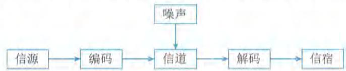  
图1-1 信息传输模型

信息传输通常包括信源、信宿、信道、编码器、译码器和噪声等。

（1）信源。信源产生信息的实体，信息产生后，由这个实体向外传播。

(2) 信宿。信宿是信息的归宿或接收者。

(3) 信道。信道是传送信息的通道,如 TCP/IP 网络。信道可以从逻辑上理解为抽象信道,也可以是具有物理意义的实际传送通道。TCP/IP 网络是逻辑上的概念,这个网络的物理通道可以是光纤、同轴电缆、双绞线、移动通信网络,甚至是卫星或者微波。

(4) 编码器。编码器在信息论中泛指所有变换信号的设备,实际上就是终端机的发送部分。它包括从信源到信道的所有设备,如量化器、压缩编码器和调制器等,使信源输出的信号转换成适于信道传送的信号。从信息安全的角度出发,编码器还可以包括加密解密设备。

(5) 译码器。译码器是编码器的逆变换设备,把信道上送来的信号(原始信息与噪声的叠加)转换成信宿能接收的信号,可包括解调器、译码器和数模转换器等。

(6) 噪声。噪声可以理解为干扰,干扰可以来自于信息系统分层结构的任何一层,当噪声携带的信息达到一定程度的时候,在信道中传输的信息可能被噪声掩盖导致传输失败。

当信源和信宿已给定,信道也已选定后,决定信息系统性能的关键就在于编码器和译码器。设计一个信息系统时,除了选择信道和设计其附属设施外,主要工作也就是设计编码和译码器。一般情况下,信息系统的主要性能指标是有效性和可靠性。有效性就是在系统中传送尽可能多的信息;而可靠性是要求信宿收到的信息尽可能地与信源发出的信息一致,或者说失真尽可能小。为了提高可靠性,可以在信息编码时增加冗余编码,犹如"重要的话说三遍",恰当的冗余编码可以在信息受到噪声侵扰时被恢复,而过量的冗余编码将降低信道的有效性和信息传输速率。

概括起来,信息系统的基本规律应包括信息的度量、信源特性和信源编码、信道特性和信道编码、检测理论、估计理论以及密码学。

# 1.1.2 信息系统基础

信息系统是由相互联系、相互依赖、相互作用的事物或过程组成的具有整体功能和综合行为的统一体。在经济与社会活动中,经常使用"系统"的概念,例如,经济领域中的业务系统和金融系统,自然界中的水利系统和生态系统等。从数学角度来看,系统是一个集合,是由许多相互作用、相互依存的事物(集合元素)为了达到某个目标组成的集合。

# 1. 系统及其特性

研究系统的一般理论和方法,称为系统论。系统是系统论的主要研究对象,而要研究系统,首先应该认识系统的特性。系统的总体特性是系统整体上的属性,系统的这些特性通常是很难提前预测的,只有当所有子系统和元素被整合形成完全的系统之后才能表现出来。目的性、整体性、层次性、稳定性、突变性、自组织性、相似性、相关性和环境适应性是系统的主要特性。

(1)目的性。定义一个系统、组成一个系统或者抽象出一个系统,都有明确的目标或者目的,目标性决定了系统的功能。

(2)整体性。系统是一个整体,元素是为了达到一定的目的,按照一定的原则,有序地排列起来组成系统,从而产生系统的特定功能。

(3)层次性。系统是由多个元素组成的,系统和元素是相对的概念。元素是相对于它所处的系统而言的,系统是从它包含元素的角度来看的,如果研究问题的角度变一变,系统就会变成更高一级系统的元素,也称为子系统。

（4）稳定性。系统的稳定性是指受规则的约束，系统的内部结构和秩序应是可以预见的，系统的状态以及演化路径有限并能被预测，系统的功能发生作用导致的后果也是可以预估的。稳定性强的系统使得系统在受到外部作用的同时，内部结构和秩序仍然能够保持。

（5）突变性。突变性是指系统通过失稳从一种状态进入另一种状态的一种剧烈变化的过程，它是系统质变的一种基本形式。

（6）自组织性。开放系统在系统内外因素的作用下自发组织起来，使系统从无序到有序，从低级有序到高级有序。

（7）相似性。系统具有同构和同态的性质，体现在系统结构、存在方式和演化过程具有共同性。系统具有相似性的根本原因在于世界的物质系统性。

（8）相关性。元素是可分的和相互联系的，组成系统的元素必须有明确的边界，可以与其他元素区分开来。另外，元素之间是相互联系的，不是哲学上所说的那种普遍联系，而是实实在在的、具体的联系。

（9）环境适应性。系统总处在一定环境中，并与环境发生相互作用。系统和环境之间总是在发生着一定的物质和能量交换。

# 2.信息系统及其特性

简单地说，信息系统就是通过对输入的数据进行加工处理，产生信息的系统。面向管理和支持生产是信息系统的显著特点，以计算机为基础的信息系统可以定义为：结合管理理论和方法，应用信息技术解决管理问题，提高生产效率，为生产或信息化过程以及管理和决策提供支撑的系统。信息系统是管理模型、信息处理模型和系统实现条件的结合，其抽象模型如图1- 2所示。

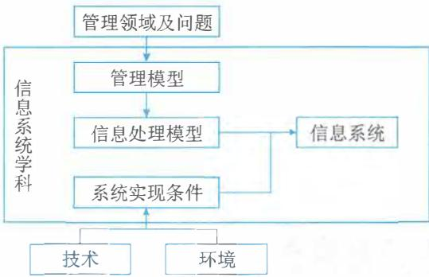  
图1-2 信息系统抽象模型

管理模型是指系统服务对象领域的专门知识，以及分析和处理该领域问题的模型，也称为对象的处理模型；信息处理模型指系统处理信息的结构和方法。管理模型中的理论和分析方法，在信息处理模型中转化为信息获取、存储、传输、加工和使用的规则；系统实现条件是指可供应用的计算机技术和通信技术、从事对象领域工作的人员，以及对这些资源的控制与融合。

广义的信息系统可以是手工的，也可以是电子化的。电子化信息系统的组成部件包括硬件、软件、数据库、网络、存储设备、感知设备、外设、人员以及把数据处理成信息的规程等。从用途类型来划分，信息系统一般包括电子商务系统、事务处理系统、管理信息系统、生产制造系统、电子政务系统、决策支持系统等。对于信息系统而言，信息系统的开发性、脆弱性和健壮性等特性会表现得比较突出。

（1）开放性。系统的开放性是指系统的可访问性。这个特性决定了系统可以被外部环境识别，外部环境或者其他系统可以按照预定的方法，使用系统的功能或者影响系统的行为。系统的开放性体现在系统有清晰描述并被准确识别和理解的接口层。

（2）脆弱性。这个特性与系统的稳定性相对应，即系统可能存在着丧失结构、功能、秩序

的特性，这个特性往往是隐蔽的且不易被外界感知的。脆弱的系统一旦被侵入，整体性会被破坏，甚至面临崩溃和系统瓦解。

（3）健壮性。当系统面临干扰、输入错误和入侵等因素时，系统可能会出现非预期的状态而丧失原有功能、出现错误甚至表现出破坏功能。系统具有能够抵御出现非预期状态的特性称为健壮性，也称鲁棒性（robustness）。一般来说，具有高可用性的信息系统，会采取冗余技术、容错技术、身份识别技术和可靠性技术等来抵御系统出现非预期的状态并保持系统的稳定性。

# 3.信息系统生命周期

信息系统是面向现实世界人类生产和生活中的具体应用的，是为了提高人类活动的质量、效率而存在的。信息系统的目的、性能、内部结构和秩序、外部接口、部件组成等由人来规划，它的产生、建设、运行和完善构成一个循环的过程，这个过程遵循一定的规律。另外，信息系统建设周期长、投资大、风险大，比一般技术工程有更大的难度和复杂性，其在使用过程中，随着生存环境的变化，要不断维护和修改，当它不再适应的时候就要被淘汰，由新系统代替老系统。为了工程化的需要，有必要把这些过程划分为具有典型特点的阶段，每个阶段有不同的目标和工作方法，阶段中的任务也由不同类型的人员来负责。这个过程称为信息系统的生命周期。

软件在信息系统中属于较复杂的部件，可以借用软件的生命周期来表示信息系统的生命周期。软件的生命周期通常包括：可行性分析与项目开发计划、需求分析、概要设计、详细设计、编码、测试和维护等阶段。

信息系统的生命周期可以简化为：系统规划（可行性分析与项目开发计划），系统分析（需求分析），系统设计（概要设计、详细设计），系统实施（编码、测试），系统运行和维护等阶段，如图1- 3所示。

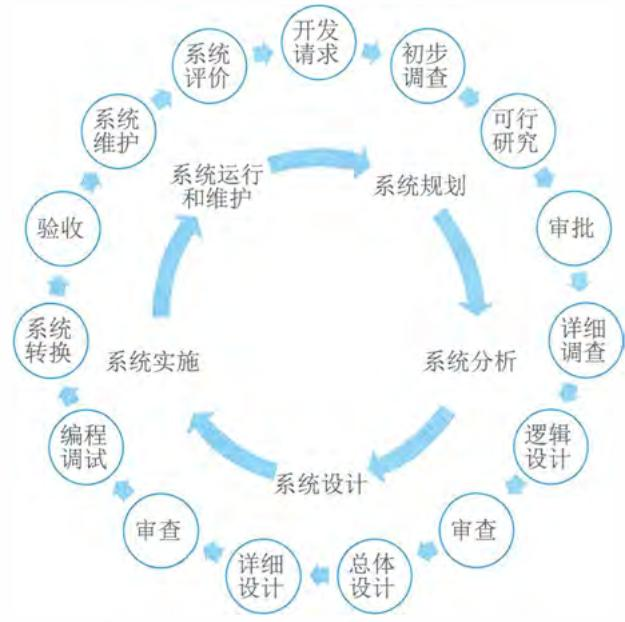  
图1-3 信息系统全生命周期示意图

I）系统规划阶段

I) 系统规划阶段系统规划阶段的任务是对组织的环境、目标及现行系统的状况进行初步调查,根据组织目标和发展战略,确定信息系统的发展战略,对建设新系统的需求做出分析和预测,同时考虑建设新系统所受的各种约束,研究建设新系统的必要性和可能性。根据需要与可能,给出报建系统的备选方案。对这些方案进行可行性研究,写出可行性研究报告。可行性研究报告审议通过后,将新系统建设方案及实施计划编写成系统设计任务书。

2）系统分析阶段

系统分析阶段的任务是根据系统设计任务书所确定的范围,对现行系统进行详细调查,描述现行系统的业务流程,指出现行系统的局限性和不足之处,确定新系统的基本目标和逻辑功能要求,即提出新系统的逻辑模型。

系统分析阶段又称为逻辑设计阶段。这个阶段是整个系统建设的关键阶段,也是信息系统建设与一般工程项目的重要区别所在。系统分析阶段的工作成果体现在系统说明书中,这是系统建设的必备文件。它既是和用户确认需求的基础,也是下一个阶段的工作依据。因此,系统说明书既要通俗又要准确。用户通过系统说明书可以了解未来系统的功能,判断是不是所要求的系统。系统说明书一旦讨论通过,就是系统设计的依据,也是将来验收系统的依据。

3）系统设计阶段

简单地说,系统分析阶段的任务是回答系统"做什么"的问题,而系统设计阶段要回答的问题是"怎么做"。该阶段的任务是根据系统说明书中规定的功能要求,考虑实际条件,具体设计实现逻辑模型的技术方案,也就是设计新系统的物理模型。这个阶段又称为物理设计阶段,可分为总体设计(概要设计)和详细设计两个子阶段。这个阶段的技术文档是系统设计说明书。

4）系统实施阶段

4) 系统实施阶段系统实施阶段是将设计的系统付诸实施的阶段。这一阶段的任务包括计算机等设备的购置、安装和调试、程序的编写和调试、人员培训、数据文件转换、系统调试与转换等。这个阶段的特点是几个互相联系、互相制约的任务同时展开,必须精心安排、合理组织。系统实施是按实施计划分阶段完成的,每个阶段应写出实施进展报告。系统测试之后写出系统测试分析报告。

5）系统运行和维护阶段

5) 系统运行和维护阶段系统投入运行后,需要经常进行维护和评价,记录系统运行的情况,根据一定的规则对系统进行必要的修改,评价系统的工作质量和经济效益。另外,为了便于论述针对信息系统的项目管理,信息系统的生命周期还可以简化为立项(系统规划)、开发(系统分析、系统设计、系统实施)、运维及消亡四个阶段,在开发阶段不仅包括系统分析、系统设计、系统实施,还包括系统验收等工作。如果从项目管理的角度来看,项目的生命周期又划分为启动、计划、执行和收尾四个典型阶段。

# 1.1.3 信息化基础

信息化是一个过程,与工业化、现代化一样,是一个动态变化的过程。信息化是指培养、

发展以计算机为主的智能化工具为代表的新生 $\mathcal{F}$ 力,并使之造福于社会的历史过程。与智能化工具相适应的生产力,称为信息化生产力。信息化是以现代通信、网络、数据库技术为基础,将所研究对象各要素汇总至数据库,供特定人群生活、工作、学习、辅助决策等,是和人类息息相关的各种行为相结合的一种技术,使用该技术可以极大地提高行为的效率,并且降低成本,为推动人类社会进步提供技术支持。

# 1.信息化内涵

信息化在不同的语境中有不同的含义。信息化用作名词时,通常指信息技术应用,特别是促成应用对象或领域(比如政府、企业或社会)发生转变的过程。例如,"企业信息化"不仅指在企业中应用信息技术,更重要的是通过深入应用信息技术,促进企业的业务模式、组织架构乃至经营战略发生革新或转变。信息化用作形容词时,常指对象或领域因信息技术的深入应用所达成的新形态或状态。例如,"信息化社会"指信息技术应用到一定程度后达成的社会形态,它只有充分应用信息技术才能达成。综上所述,信息化是推动经济社会发展与转型的一个历史性过程。在这个过程中,综合利用各种信息技术,支撑改善人类的各项政治、经济和社会活动,并把贯穿于这些活动中的各种数据有效、可靠地进行管理,经过符合业务需求的数据处理,形成信息资源,通过信息资源的整合与融合,促进信息交流和知识共享,形成新的经济和社会形态,推动各方面的高质量发展。

信息化的核心是要通过全体社会成员的共同努力,在经济和社会各个领域充分应用基于信息技术的先进社会生产工具(表现为各种信息系统或软硬件产品),提高信息时代的社会生产力,并推动生产关系和上层建筑的改革(表现为法律、法规、制度、规范、标准和组织结构等),使国家的综合实力、社会的文明程度和人民的生活质量全面提升。信息化的内涵主要包括:

- 信息网络体系:包括信息资源、各种信息系统和公用通信网络平台等。

- 信息产业基础:包括信息科学技术研究与开发、信息装备制造和信息咨询服务等。

- 社会运行环境:包括现代工农业、管理体制、政策法律、规章制度、文化教育和道德观念等生产关系与上层建筑。

- 效用积累过程:包括劳动者素质、国家现代化水平和人民生活质量的不断提高,精神文明和物质文明建设的不断进步等。

信息化的基本内涵给人们的启示是:信息化的主体是全体社会成员,包括政府、企业、事业、团体和个人。信息化的时域是一个长期的过程,它的空域是政治、经济、文化、军事和社会的一切领域;它的手段是基于现代信息技术的先进社会生产工具;它的途径是创建信息时代的社会生产力,推动社会生产关系及社会上层建筑的改革;它的目标是使国家的综合实力、社会的文明素质和人民的生活质量得到全面提升。我国大规模开展信息化工作已经30多年,已成为保障国家安全、支撑政府行政职能、维护社会和谐稳定、促进民生经济发展等各大战略层面的重要支柱。

# 2.信息化体系

信息化代表了一种信息技术被高度应用,信息资源被高度共享,从而使得人的智能潜力以及社会物质资源潜力被充分发挥,个人行为、组织决策和社会运行趋于合理化的理想状态。

1997年召开的首届全国信息化工作会议,将信息化和国家信息化定义为: "信息化是指培育、发展以智能化工具为代表的新的生产力并使之造福于社会的历史过程。国家信息化就是在国家统一规划和组织下,在农业、工业、科学技术、国防及社会生活各个方面应用信息技术,深入开发、广泛利用信息资源,加速实现国家现代化进程。"国家信息化体系包括信息技术应用、信息资源、信息网络、信息技术和产业、信息化人才、信息化政策法规和标准规范6个要素,这6个要素的关系构成了一个有机的整体,如图1- 4所示。

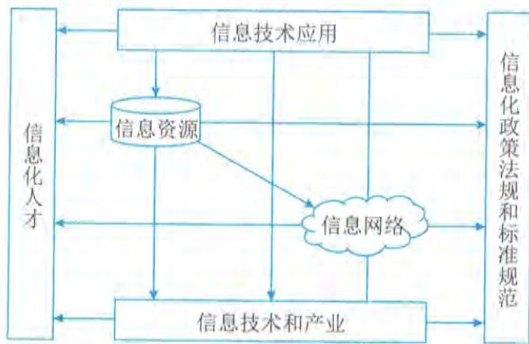  
图1-4 国家信息化体系

(1)信息资源。信息资源的开发和利用是国家信息化的核心任务,是国家信息化建设取得实效的关键,是衡量国家信息化水平的一个重要标志。

(2)信息网络。信息网络是信息资源开发和利用的基础设施,包括电信网、广播电视网和计算机网络。这三种网络有各自的形成过程、服务对象和发展模式,它们的功能有所交叉,又互为补充。

(3)信息技术应用。信息技术应用是指把信息技术广泛应用于经济和社会各个领域,它直接反映了效率、效果和效益。信息技术应用是信息化体系六要素中的龙头,是国家信息化建设的主阵地,集中体现了国家信息化建设的需求和效益。

(4)信息技术和产业。信息产业是信息化的物质基础,包括微电子、计算机、电信等产品和技术的开发、生产、销售,以及软件、信息系统开发和电子商务等。从根本上来说,国家信息化只有在相关产品和技术方面拥有雄厚的自主知识产权,才能提高综合国力。

(5)信息化人才。人才是信息化的成功之本,而合理的人才结构更是信息化人才的核心和关键。合理的信息化人才结构要求不仅要有各个层次的信息化技术人才,还要有精干的信息化管理人才,营销人才,法律、法规和情报人才。

(6)信息化政策法规和标准规范。信息化政策和法规、标准、规范用于规范和协调信息化体系各要素之间的关系,是国家信息化快速、有序、健康和持续发展的保障。

# 3.信息化趋势

信息化是信息产业发展与信息技术在经济与社会各方面扩散的基础上,不断运用信息技术改造传统的经济、社会结构,通往如前所述的理想状态的一段持续的过程。随着数字化、网络

化、智能化的持续深化,信息化成为重塑国家竞争优势的重要力量。信息化跟各行业、领域、业务现代化在更广范围、更深程度、更高水平上实现融合发展,新一代信息技术向各领域加速渗透,促进数字化转型步伐加快,并驱动经济与社会的高质量发展。

# 1)组织信息化趋势

随着计算机技术、网络技术和通信技术的发展和应用,组织信息化已成为业务价值实现、可持续化发展和提高经济与社会竞争力的重要保障。组织应该采取积极的应对措施,推动其信息化的建设进程。品牌2.0理论指出,信息化建设是品牌母体树冠部分的支持网络,庞大的品牌识别系统必须对应强大的信息化建设体系。如果信息化建设不能满足品牌识别系统的要求,品牌识别系统也将受到伤害,会自动调低到现有的信息化建设体系可以支撑的大小,这是品牌母体的自我调整过程。根据这个原理我们可以解释一种现象:为什么有的品牌进行了很好的品牌识别系统设计,初看起来是一个极具竞争力和发展前景的品牌,但却不能持久,并马上出现了负品牌效应。

各行业领域组织的信息化是国家经济与社会信息化的基础,指组织在产品的设计、开发、生产、管理、经营等多个环节中广泛利用信息技术,并大力培养信息人才,完善信息服务,加速建设组织信息系统。组织的信息化建设体现了组织在通信、网站、电子商务方面的投入情况,在客户和服务对象资源管理、质量管理体系方面的建设成就等。信息化建设日渐成为组织影响力、生产、销售、服务等各环节的核心支撑,并随着信息技术在组织中应用的不断深入,其价值显得越来越重要,未来甚至许多组织必须依托信息化建设才能生存。

组织信息化除驱动和加速组织转型升级和生产力建设外,还呈现出产品信息化、产业信息化、社会生活信息化和国民经济信息化等趋势和方向。产品信息化包含两层含义:  $①$  产品中各类信息比重日益增大、物质比重日益降低,其物质产品的特征向信息产品的特征迈进;  $②$  越来越多的产品中嵌入了智能化元器件,使产品具有越来越强的信息处理功能。产业信息化指农业、工业、服务业等传统产业广泛利用信息技术,大力开发和利用信息资源,建立各种类型的产业互联网平台和网络,实现产业内各种资源、要素的优化与重组,从而实现产业的升级。社会生活信息化指包括市场、科技、教育、军事、政务、日常生活等在内的整个社会体系采用先进的信息技术,建立各种互联网平台和网络,大力拓展人们日常生活的信息内容,丰富人们的精神生活,拓展人们的活动时空等。国民经济信息化指在经济大系统内实现统一的信息大流动,使金融、贸易、投资、计划、营销等组成一个信息大系统,生产、流通、分配、消费等经济的四个环节通过信息进一步连成一个整体。国民经济信息化是世界各国急需实现的目标。

# 2)国家信息化趋势

党中央、国务院一直高度重视信息化工作。2016年7月中共中央办公厅、国务院办公厅颁布的《国家信息化发展战略纲要》强调国家信息化发展战略总目标是建设网络强国,分"三步走":第一步到2020年,核心关键技术部分领域达到国际先进水平,信息产业国际竞争力大幅提升,信息化成为驱动现代化建设的先导力量;第二步到2025年,建成国际领先的移动通信网络,根本改变核心关键技术受制于人的局面,实现技术先进、产业发达、应用领先、网络安全坚不可摧的战略目标,涌现一批具有强大国际竞争力的大型跨国网信企业;第三步到21世纪

中叶, 信息化全面支撑富强民主文明和谐的社会主义现代化国家建设, 网络强国地位日益巩固, 在引领全球信息化发展方面有更大作为。当前, 我国全面部署了"构建产业数字化转型发展体系"重大任务, 明确我国信息化进入加快数字化发展、建设数字中国的新阶段。

# 4. 国家信息化规划

《"十四五"国家信息化规划》明确了: 建设泛在智联的数字基础设施体系, 建立高效利用的数据要素资源体系, 构建释放数字生产力的创新发展体系, 培育先进安全的数字产业体系, 构建产业数字化转型发展体系, 构筑共建共治共享的数字社会治理体系, 打造协同高效的数字政府服务体系, 构建普惠便捷的数字民生保障体系, 拓展互利共赢的数字领域国际合作体系和建立健全规范有序的数字化发展治理体系等重大任务。今后一段时间, 我国信息化的发展重点主要聚焦在数据治理、密码区块链技术、信息互联互通、智能网联和网络安全等方面。

# 1) 数据治理

深化数据资源调查, 推进数据标准规范体系建设, 制定数据采集、存储、加工、流通、交易、衍生产品等标准规范, 提高数据质量和规范性。建立和完善数据管理国家标准体系和数据治理能力评估体系。聚焦数据管理、共享开放、数据应用、授权许可、安全和隐私保护、风险管控等方面, 探索多主体协同治理机制。

# 2) 密码区块链技术

着力推进密码学、共识机制、智能合约等核心技术研究, 支持建设安全可控、可持续发展的底层技术平台和区块链开源社区。构建区块链标准规范体系, 加强区块链技术测试和评估, 制定关键基础领域区块链行业应用标准规范。开展区块链创新应用试点, 聚焦金融科技、供应链服务、政务服务、商业科技等领域开展应用示范。

# 3) 信息互联互通

打造市场化、法治化、国际化营商环境, 深化电子证照、电子合同、电子发票、电子会计凭证等在政务服务、财税金融、社会管理、民生服务等重要领域的有序有效应用。推进涉企政务事项的全程网上办理, 大力推进公共资源全流程电子化交易, 构建覆盖全国、透明规范、互联互通、智慧监管的公共资源交易体系。

# 4) 智能网联

遴选打造国家级车联网先导区, 加快智能网联汽车道路基础设施建设和 5G- V2X 车联网示范网络建设, 提升车载智能设备、路侧通信设备、道路基础设施和智能管控设施的"人、车、路、云、网"协同能力, 实现 L3 级以上高级自动驾驶应用。

# 5) 网络安全

全面加强网络安全保障体系和能力建设, 深化关口前移、防患于未然的安全理念, 压实网络安全责任, 加强网络安全信息统筹机制建设, 形成多方共建的网络安全防线。开发网络安全技术及相关产品, 提升网络安全自主防御能力。全面加强网络安全保障体系和能力建设。加强网络安全核心技术联合攻关, 开展高级威胁防护、态势感知、监测预警等关键技术研究, 建立安全可控的网络安全软硬件防护体系。强化 5G、工业互联网、大数据中心、车联网等安全保

障。完善网络安全监测、通报预警、应急响应与处置机制,提升网络安全态势感知、事件分析以及快速恢复能力。

结合国家信息化发展趋势,国家各部委将加速推进各领域信息化进程,尤其是数据赋能、5G等新兴技术应用、数字化转型等多方面的建设。例如,国家发展和改革委员会明确了相关信息化的发展目标和方向,即政务信息化建设总体迈入以数据赋能、协同治理、智慧决策、优质服务为主要特征的融慧治理新阶段,跨部门、跨地区、跨层级的技术融合、数据融合、业务融合成为政务信息化创新的主要路径,逐步形成平台化协同、在线化服务、数据化决策、智能化监管的新型数字政府治理模式,经济调节、市场监管、社会治理、公共服务和生态环境等领域的数字治理能力显著提升,网络安全保障能力进一步增强,有力支撑国家治理体系和治理能力现代化。

# 1.2 现代化基础设施

基础设施包括交通、能源、水利、物流等传统基础设施以及以信息网络为核心的新型基础设施,在国家发展全局中具有战略性、基础性、先导性作用。统筹推进传统基础设施和新型基础设施建设,打造系统完备、高效实用、智能绿色、安全可靠的现代化基础设施体系,是我国当前在该领域的发展战略和导向。

# 1.2.1 新型基础设施建设

2018年召开的中央经济工作会议,首次提出"加快5G商用步伐,加强人工智能、工业互联网、物联网等新型基础设施建设",简称"新基建"。"新型基础设施建设"的提法由此产生,主要包括5G基建、特高压、城际高速铁路和城际轨道交通、新能源汽车充电桩、大数据中心、人工智能、工业互联网等七大领域。"新基建"是立足于高新科技的基础设施建设,与传统"铁公基"相对应,是结合新一轮科技革命和产业变革特征,面向国家战略需求,为经济社会的创新、协调、绿色、开放、共享发展提供底层支撑的具有乘数效应的战略性、网络型基础设施。"新基建"的内涵更丰富,更能体现数字经济的特征,能够更好地推动中国经济转型升级。

# 1.概念定义

新型基础设施是以新发展理念为引领,以技术创新为驱动,以信息网络为基础,面向高质量发展需要,提供数字转型、智能升级、融合创新等服务的基础设施体系。目前,新型基础设施主要包括信息基础设施、融合基础设施、创新基础设施。

(1)信息基础设施。信息基础设施主要指基于新一代信息技术演化生成的基础设施。信息基础设施包括:  $①$  以5G、物联网、工业互联网、卫星互联网为代表的通信网络基础设施;  $②$  以人工智能、云计算、区块链等为代表的新技术基础设施;  $③$  以数据中心、智能计算中心为代表的算力基础设施等。信息基础设施凸显"技术新"。

(2)融合基础设施。融合基础设施主要指深度应用互联网、大数据、人工智能等技术,支撑传统基础设施转型升级,进而形成的融合基础设施。融合基础设施包括智能交通基础设施和

智慧能源基础设施等。融合基础设施重在"应用新"。

(3)创新基础设施。创新基础设施主要指支撑科学研究、技术开发、产品研制的具有公益属性的基础设施。创新基础设施包括重大科技基础设施、科教基础设施、产业技术创新基础设施等。创新基础设施强调"平台新"。

伴随技术革命和产业变革,新型基础设施的内涵、外延也将持续变化和演进。新型基础设施建设比传统基建内涵更加丰富、涵盖范围更广,更能体现数字经济特征,能够更好地推动经济与社会转型升级。

# 2.发展重点

新型基础设施建设更加侧重于突出产业转型升级的新方向,无论是人工智能还是物联网,都体现出加快推进产业高质量发展的大趋势。我国持续加快建设新型基础设施,将重点围绕:①强化数字转型、智能升级、融合创新支撑,布局建设信息基础设施、融合基础设施、创新基础设施等新型基础设施;②建设高速泛在、天地一体、集成互联、安全高效的信息基础设施,增强数据感知、传输、存储和运算能力;③加快5G网络规模化部署,持续提高用户普及率,推广升级千兆光纤网络;④前瞻布局6G网络技术储备;⑤扩容骨干网互联节点,新设一批国际通信出入口,全面推进互联网协议第六版(IPv6)商用部署;⑥实施中西部地区中小城市基础网络完善工程;⑦推动物联网全面发展,打造支持固移融合、宽窄结合的物联接入能力;⑧加快构建全国一体化大数据中心体系,强化算力统筹智能调度,建设若干国家枢纽节点和大数据中心集群,建设E级和10E级超级计算中心;⑨积极稳妥发展工业互联网和车联网;⑩打造全球覆盖、高效运行的通信、导航、遥感空间基础设施体系,建设商业航天发射场;⑪加快交通、能源、市政等传统基础设施数字化改造,加强泛在感知、终端联网、智能调度体系建设;⑫发挥市场主导作用,打通多元化投资渠道,构建新型基础设施标准体系等。

# 1.2.2 工业互联网

工业互联网(Industrial Internet)是新一代信息通信技术与工业经济深度融合的新型基础设施、应用模式和工业生态,通过对人、机、物、系统等的全面连接,构建起覆盖全产业链、全价值链的全新制造和服务体系,为工业乃至产业数字化、网络化、智能化发展提供了实现途径,是第四次工业革命的重要基石。

# 1.内涵和外延

工业互联网不是互联网在工业的简单应用,其具有更为丰富的内涵和外延。它既是工业数字化、网络化、智能化转型的基础设施,也是互联网、大数据、人工智能与实体经济深度融合的应用模式,同时也是一种新业态、新产业,将重塑企业形态、供应链和产业链。

从工业经济发展角度看,工业互联网为制造强国建设提供关键支撑。一是推动传统工业转型升级。通过跨设备、跨系统、跨厂区、跨地区的全面互联互通,实现各种生产和服务资源在更大范围、更高效率、更加精准地优化配置,实现提质、降本、增效、绿色、安全发展,推动制造业高端化、智能化、绿色化,大幅提升工业经济发展质量和效益。二是加快新兴产业培育壮大。工业互联网促进设计、生产、管理、服务等环节由单点的数字化向全面集成演进,加速

创新方式、生产模式、组织形式和商业范式的深刻变革,催生平台化设计、智能化制造、网络化协同、个性化定制、服务化延伸、数字化管理等诸多新模式、新业态、新产业。

从网络设施发展角度看,工业互联网是网络强国建设的重要内容。一是加速网络演进升级。工业互联网促进人与人相互连接的公众互联网、物与物相互连接的物联网,向人、机、物、系统等的全面互联拓展,大幅提升网络设施的支撑服务能力。二是拓展数字经济空间。工业互联网具有较强的渗透性,可以与交通、物流、能源、医疗、农业等实体经济各领域深度融合,实现产业上下游、跨领域的广泛互联互通,推动网络应用从虚拟到实体、从生活到生产的科学跨越,极大地拓展了网络经济的发展空间。

# 2. 平台体系

工业互联网平台体系具有四大层级,它以网络为基础,平台为中枢,数据为要素,安全为保障。

# 1)网络体系是基础

工业互联网网络体系包括网络互联、数据互通和标识解析三部分。网络互联实现要素之间的数据传输,包括企业外网和企业内网。典型技术包括传统的工业总线、工业以太网以及创新的时间敏感网络(TSN)、确定性网络、5G等技术。企业外网根据工业高性能、高可靠、高灵活、高安全网络需求进行建设,用于连接企业各地机构、上下游企业、用户和产品。企业内网用于连接企业内人员、机器、材料、环境和系统,主要包含信息(IT)网络和控制(OT)网络。当前,内网技术发展呈现三个特征:IT和OT正走向融合,工业现场总线向工业以太网演进,工业无线技术加速发展。数据互通是通过对数据进行标准化描述和统一建模,实现要素之间传输信息的相互理解,数据互通涉及数据传输、数据语义语法等不同层面。标识解析体系实现要素的标记、管理和定位,由标识编码、标识解析系统和标识数据服务组成,通过对物料、机器、产品等物理资源和工序、软件、模型、数据等虚拟资源分配标识编码,实现物理实体和虚拟对象的逻辑定位和信息查询,支撑跨企业、跨地区、跨行业的数据共享共用。

我国标识解析体系包括五大国家顶级节点、国际根节点、二级节点、企业节点和递归节点。国家顶级节点是我国工业互联网标识解析体系的关键枢纽,国际根节点是各类国际解析体系跨境解析的关键节点,二级节点是面向特定行业或者多个行业提供标识解析公共服务的节点,递归节点是通过缓存等技术手段提升整体服务性能、加快解析速度的公共服务节点。标识解析应用按照载体类型可分为静态标识应用和主动标识应用。静态标识应用以一维码、二维码、射频识别码(RFID)、近场通信标识(NFC)等作为载体,需要借助扫码枪、手机App等读写终端触发标识解析过程。主动标识通过在芯片、通信模组、终端中嵌入标识,主动通过网络向解析节点发送解析请求。

# 2)平台体系是中枢

工业互联网平台体系包括边缘层、IaaS、PaaS和SaaS四个层级,相当于工业互联网的"操作系统",它有四个主要作用:

(1)数据汇聚。网络层面采集的多源、异构、海量数据,传输至工业互联网平台,为深度分析和应用提供基础。

(2)建模分析。提供大数据、人工智能分析的算法模型和物理、化学等各类仿真工具,结合数字孪生、工业智能等技术,对海量数据挖掘分析,实现数据驱动的科学决策和智能应用。

(3)知识复用。将工业经验知识转化为平台上的模型库、知识库,并通过工业微服务组件方式,方便二次开发和重复调用,加速共性能力沉淀和普及。

(4)应用创新。面向研发设计、设备管理、企业运营、资源调度等场景,提供各类工业App、云化软件,帮助企业提质增效。

# 3)数据体系是要素

工业互联网数据有三个特性:

(1)重要性。数据是实现数字化、网络化、智能化的基础,没有数据的采集、流通、汇聚、计算、分析等各类新模式就是无源之水,数字化转型也就成为无本之木。

(2)专业性。工业互联网数据的价值在于分析利用,分析利用的途径必须依赖行业知识和工业机理。制造业千行百业、千差万别,每个模型、算法背后都需要长期积累和专业队伍,只有精耕细作才能发挥数据价值。

(3)复杂性。工业互联网运用的数据来源于"研产供销服"各环节,"人机料法环"各要素,ERP、MES、PLC等各系统。数据的维度和复杂度远超消费互联网,面临采集困难、格式各异、分析复杂等挑战。

# 4)安全体系是保障

工业互联网安全体系涉及设备、控制、网络、平台、工业App、数据等多方面网络安全问题,其核心任务就是要通过监测预警、应急响应、检测评估、功能测试等手段确保工业互联网健康有序发展。与传统互联网安全相比,工业互联网安全具有三大特点:

(1)涉及范围广。工业互联网打破了传统工业相对封闭可信的环境,网络攻击可直达生产一线。联网设备的爆发式增长和工业互联网平台的广泛应用,使网络攻击面持续扩大。

(2)造成影响大。工业互联网涵盖制造业、能源等实体经济领域,一旦发生网络攻击等破坏行为,安全事件影响严重。

(3)企业防护基础弱。目前我国广大工业企业安全意识、防护能力仍然薄弱,整体安全保障能力有待进一步提升。

# 3.融合应用

工业互联网融合应用推动了一批新模式、新业态孕育兴起,提质、增效、降本、绿色、安全发展成效显著,初步形成了平台化设计、智能化制造、网络化协同、个性化定制、服务化延伸、数字化管理六大类典型应用模式。

(1)平台化设计。平台化设计是依托工业互联网平台,汇聚人员、算法、模型、任务等设计资源,实现高水平高效率的轻量化设计、并行设计、敏捷设计、交互设计和基于模型的设计,变革传统设计方式,提升研发质量和效率。

(2)智能化制造。智能化制造是互联网、大数据、人工智能等新一代信息技术在制造业领域加速创新应用,实现材料、设备、产品等生产要素与用户之间的在线连接和实时交互,逐步实现机器代替人工生产,智能化代表制造业未来发展的趋势。

(3) 网络化协同。网络化协同是通过跨部门、跨层级、跨企业的数据互通和业务互联, 推动供应链上的企业和合作伙伴共享客户、订单、设计、生产、经营等各类信息资源, 实现网络化的协同设计、协同生产、协同服务, 进而促进资源共享、能力交易以及业务优化配置等。

(4) 个性化定制。个性化定制是面向消费者个性化需求, 通过客户需求准确获取和分析、敏捷产品开发设计、柔性智能生产、精准交付服务等, 实现用户在产品全生命周期中的深度参与, 是以低成本、高质量和高效率的大批量生产实现产品个性化设计、生产、销售及服务的一种制造服务模式。

(5) 服务化延伸。服务化延伸是制造与服务融合发展的新型产业形态, 指的是企业从原有制造业务向价值链两端高附加值环节延伸, 从以加工组装为主向“制造+服务”转型, 从单纯出售产品向出售“产品+服务”转变, 具体包括设备健康管理、产品远程运维、设备融资租赁、分享制造、互联网金融等。

(6) 数字化管理。数字化管理是企业通过打通核心数据链, 贯通制造全场景、全过程, 基于数据的广泛汇聚、集成优化和价值挖掘, 优化、创新乃至重塑企业战略决策、产品研发、生产制造、经营管理、市场服务等业务活动, 构建数据驱动的高效运营管理新模式。

工业互联网已延伸至众多个国民经济大类, 涉及原材料、装备、消费品、电子等制造业各大领域, 以及采矿、电力、建筑等实体经济重点产业, 实现更大范围、更高水平、更深程度发展, 形成了多样化的融合应用实践。

# 1.2.3 城市物联网

物联网是一个基于互联网、传统电信网等信息承载体, 让所有能够被独立寻址的普通物理对象实现互联互通的网络。物联网是城市智慧化建设中非常重要的元素, 它侧重于底层感知信息的采集与传输, 属于城市范围内泛在网建设的重要方面。

# 1. 物联网与智慧城市

物联网 (Internet of Tings, IoT) 起源于20世纪90年代末期, 是指通过信息传感设备, 按约定的协议, 将任意物体与网络相连接, 物体通过信息传播媒介进行信息交换和通信, 以实现智能化识别、定位、跟踪、监管等功能。通信与识别、智能化、互联性是其主要特征。①通信与识别。一般来说, 在物联网上需要安装海量的各类型传感器, 每个传感器均是一个信息源, 各种类型的传感器所接收到的信息在格式及内容上是不同的, 因此物联网必须具备极强的识别功能。另外, 物联网作为一个集信息收集、处理于一体的综合系统, 其必定需要一个完善的通信系统。②智能化。与其他一些系统相比, 物联网不但具备信息收集的功能, 其还具备极强的信息处理功能, 可对物体进行有效的智能管理, 物联网通过一些设备与传感器相连接, 利用云计算、智能识别等各种先进的自动化反馈技术可大范围实现对事物的智能化管控。③互联性。物联网技术的核心和基础仍是互联网, 其主要是通过各类有线及无线设备与互联网相融合, 将事物信息及时准确地反映出去。物联网上的传感设备可将信息定时传输, 由于所要传输的信息量极大, 出现了海量信息, 因此在传输过程中, 为了保证数据具备正确性与及时性, 物联网需要适应各种类型的网络及协议。

智慧城市(Smart City)一词较早出现在20世纪80年代中期,是指在城市规划、设计、建设、管理与运营等领域中,通过物联网、云计算、大数据、空间地理信息集成等智能计算技术的应用,使得城市管理、教育、医疗、房地产、交通运输、公用事业和公众安全等城市组成的关键基础设施组件和服务更互联、高效和智能,从而为市民提供更美好的生活和工作服务,为企业创造更有利的商业发展环境,为政府赋能更高效的运营与管理机制。系统感知、传递可靠、高度智能等是智慧城市重要特征。 $①$  系统感知。更加全面、更加系统的感知是智慧城市发展的基础也是其基本特性,以使得城市中需求感知的人和物可实现相互感知,且可随时获得所需求的各种信息及数据。物联网通过一些设备与传感器相连接,可保证智慧城市内的一切动态被实时感知与协调。 $②$  传递可靠。在实现全面的互联之后,形成可靠的传递是智慧城市发展的基础特征之一,并且这使得各种信息的采集及控制能做到可靠传递。要做到可靠的信息传递,物联网的互联性必不可少。试想一下,在物联网的帮助下,各类传感器敏捷采集数据,使得整个城市的各类公开信息都能唾手可得。 $③$  高度智能。更具深度及更具智能的信息管控能力是智慧城市的又一基础特征,对系统收集到的各类信息进行快速、准确、有效的处理,并做出智能控制管理。物联网的信息收集的功能和极强的信息处理功能,可对物体进行有效的智能管理。

物联网与智慧城市特征的高度重视,证明了智慧城市是物联网集中应用的平台之一,也是物联网技术综合应用的典范,是由  $N$  个物联网功能单元组合而成的更大的示范工程,承载和包含着几乎所有的物联网、云计算等相关技术。通过传感技术,实现对城市管理中的能源生产、运输、转换及消耗的监测和全面感知,实时智能识别、立体感知城市能源各方面情况。

# 2.城市物联网应用场景

智慧城市是物联网解决方案的主要应用场景之一。物联网在智慧城市发展中的应用关系到方方面面,从市政管理智能化、农业园林智能化、医疗智能化、楼宇智能化、交通智能化到旅游智能化及其他应用智能化等方面,均离不开物联网技术。物联网技术采集特定数据,然后数据被用于改善城市的营运,优化城市服务的效率并与市民连接。典型应用领域包括智慧物流、智能交通、智能安防、智慧能源环保、智能医疗、智慧建筑、智能家居和智能零售等。

# 1)智慧物流

智慧物流是新技术应用于物流行业的统称,指的是以物联网、大数据、人工智能等信息技术为支撑,在物流的运输、仓储、包装、装卸、配送等各个环节实现系统感知、全面分析及处理等功能。智慧物流的实现能大大地降低各行业的运输成本,提高运输效率,提升整个物流行业的智能化和自动化水平。智慧物流的应用场景包括三个主要方向,即仓储管理、运输监测、冷链物流等。 $①$  仓储管理。通常采用基于远距离无线电(Long Range Radio, LoRa)、窄带物联网(Narrow Band Internet of Things, NB- IoT)等传输网络的物联网仓库管理信息系统,完成收货入库、盘点、调拨、拣货、出库以及整个系统的数据查询、备份、统计、报表生产及报表管理等任务。尤其在无人仓、智能立体库、金融监管库里面有大量的物联网设备,通过物联网设备实时监控货品的状态,指引设备运营。 $②$  运输监测。实时监测货物运输中的车辆行驶情况以及货物运输情况,包括货物位置、状态环境以及车辆的油耗、油量、车速及刹车次数等驾驶行为。 $③$  冷链物流。冷链物流对温度要求比较高,温湿度传感器可将仓库、冷链车的温度实时传输到后台,便于监管。

# 2）智能交通

2)智能交通智能交通是物联网的一种重要体现形式,利用信息技术将人、车和路紧密地结合起来,改善交通运输环境、保障交通安全以及提高资源利用率。物联网技术的具体应用领域,包括智能公交车、共享单车、车联网、智慧停车以及智能红绿灯等。  $①$  智能公交车。结合公交车辆的运行特点,建设公交智能调度系统,对线路、车辆进行规划调度,实现智能排班。  $②$  共享单车。运用带有全球定位系统(GlobalPositioningSystem,GPS)或北斗、NB- IoT模块的智能锁,通过与应用程序相连实现精准定位、实时掌控车辆状态等。  $③$  车联网。利用先进的传感器及控制技术等实现自动驾驶或智能驾驶,实时监控车辆运行状态,降低交通事故发生率。  $④$  智慧停车。通过安装地磁感应设备,连接进入停车场的智能手机,实现停车自动导航、在线查询车位等功能。  $⑤$  智能红绿灯。依据车流量、行人及天气等情况,动态调控灯信号,来控制车流,提高道路承载力。  $⑥$  汽车电子标识。采用射频识别(RadioFrequencyIdentification,RFID)技术,实现对车辆身份的精准识别、车辆信息的动态采集等功能。  $⑦$  充电桩。通过物联网设备实现充电桩定位、充放电控制、状态监测及统一管理等功能。  $⑧$  高速无感收费。通过摄像头识别车牌信息,根据路径信息进行收费,从而提高通行效率、缩短车辆等候时间等。

# 3）智能安防

3)智能安防传统安防对人员的依赖性比较大,非常耗费人力,而智能安防能够通过设备实现智能判断。目前,智能安防最核心的部分在于智能安防系统,该系统是对拍摄的图像进行传输与存储,并对其进行分析与处理。一个完整的智能安防系统主要包括三大部分,门禁、报警和监控,行业中主要以视频监控为主。  $①$  门禁系统。门禁系统主要以感应卡、指纹、虹膜以及面部识别等为主,有安全、便捷和高效的特点,能联动视频抓拍、远程开门、手机位置探测及轨迹分析等。  $②$  监控系统。监控系统主要以视频为主,通过视频实时监控,使用摄像头进行抓拍记录,将视频和图片进行数据存储和分析,实现实时监测并确保安全。  $③$  报警系统。报警系统主要通过报警主机进行报警,同时可以将语音模块以及网络控制模块置于报警主机中,缩短报警响应时间。

# 4）智慧能源环保

4)智慧能源环保智慧能源环保的物联网应用主要集中在水能、电能、燃气、路灯等能源和用电装置以及井盖、垃圾桶等环保装置。如智慧井盖可以用于监测水位及其状态,智能水电表可实现远程抄表,智能垃圾桶可实现自动感应等。将物联网技术应用于传统的水、电、光能设备通过联网进行监测,从而提升利用效率,减少能源损耗。  $①$  智能水表。利用先进的NB- IoT技术,可实现远程采集用水量以及提供用水提醒等服务。  $②$  智能电表。自动化信息化的新型电表,具有远程监测用电情况并及时反馈等功能。  $③$  智能燃气表。通过网络技术将用气量传输到燃气集团,无须入户抄表即可实现显示燃气用量及用气时间等功能。  $④$  智慧路灯。通过给路灯搭载传感器等设备,实现远程照明控制以及故障自动报警等功能。

# 5）智能医疗

5)智能医疗在智能医疗领域,新技术的应用必须以人为中心。而物联网技术是获取数据的主要途径,能有效地帮助医院实现对人和物的智能化管理。对人的智能化管理指的是通过传感器对病人的生理状态(如心跳频率、体力消耗、血压高/低等)进行监测,主要指的是通过医疗可穿戴设

备将获取的数据记录到电子健康文件中，方便病人或医生查阅。对物的智能化管理指的是通过RFID技术对医疗设备、物品进行监控与管理，实现医疗设备、用品的可视化，主要用于实现数字化医院。

# 6）智慧建筑

6）智慧建筑建筑是城市的基石，技术的进步促进了建筑的智能化发展，以物联网等新技术为主的智慧建筑越来越受到人们的关注。当前的智慧建筑主要体现在节能方面，用设备进行感知和数据传输从而实现远程监控，不仅能够节约能源同时也能减少楼宇人员的运维工作量。根据亿欧智库的调查，目前智慧建筑主要体现在照明用电、消防监测、智慧电梯、楼宇监测以及运用于古建筑领域的白蚁监测。

# 7）智能家居

7）智能家居智能家居指的是使用不同的方法和设备来提高人们的生活能力，使家庭变得更舒适、安全和高效。物联网应用于智能家居领域，能够对家居类产品的位置、状态和变化进行监测，通过分析其变化特征并结合人的需求，在一定程度上进行反馈。智能家居行业的发展主要分为三个阶段：单品连接、物物联动和平台集成。智能家居的发展方向首先是连接智能家居单品，然后是实现不同单品之间的联动，最后向智能家居系统平台发展。

# 8）智能零售

8）智能零售零售行业按照距离将零售分为远场零售、中场零售、近场零售三种不同的形式，三者分别以电商和商场、超市和便利店、自动售货机为代表。物联网技术可以用于近场和中场零售，且主要应用于近场零售，即无人便利店和自动（无人）售货机。智能零售通过将传统的售货机和便利店进行数字化升级与改造，打造无人零售模式。通过数据分析并充分运用门店内的客流和活动，可以为用户提供更好的服务，可以使商家提高经营效率。

# 1.3 产业现代化

1.3 产业现代化党的十九届五中全会着眼2035年基本实现社会主义现代化，提出“关键核心技术实现重大突破，进入创新型国家前列”的远景目标。建设创新型国家，完善科技创新体系是关键。当前，我国经济发展正处于转型升级的关键时期，突破一系列瓶颈、解决深层次矛盾和问题的根本出路和动力在于把发展基点放在创新上，发挥科技创新在全面创新中的引领作用，通过建设科技强国，全面塑造发展新优势。

# 1.3.1 农业农村现代化

1.3.1 农业农村现代化实现农业农村现代化是全面建设社会主义现代化国家的重大任务，需要将先进技术、现代装备、管理理念等引入农业，将基础设施和基本公共服务向农村延伸覆盖，提高农业生产效率，改善乡村面貌，提升农民生活品质，促进农业全面升级、农村全面进步、农民全面发展。

# 1.农业现代化

1. 农业现代化农业现代化是用现代工业装备农业，用现代科学技术改造农业，用现代管理方法管理农业，

用现代科学文化知识提高农民素质的过程;是建立高产、优质、高效农业生产体系,把农业建成具有显著经济效益、社会效益和生态效益的可持续发展的农业的过程;也是大幅度提高农业综合生产能力、不断增加农产品有效供给和农民收入的过程,同时,农业现代化又是一种手段。

农业信息化是农业现代化的重要技术手段。所谓农业信息化是指利用现代信息技术和信息系统为农业产供销及相关的管理和服务提供有效的信息支持,以提高农业的综合生产力和经营管理效率的过程;就是在农业领域全面地发展和应用现代信息技术,使之渗透到农业生产、市场、消费以及农村社会、经济、技术等各个具体环节,加速传统农业改造,大幅度地提高农业生产效率和农业生产力水平,促进农业持续、稳定、高效发展的过程。农业信息产业化是发展"一优两高"农业的需要,是农民进入市场的需要。是推进农村社会化服务的需要,是农业信息部门转变职能、自我发展的需要,是农村经济发展的必然趋势。它是以信息化的方式改造传统农业,把农业发展推进到更高阶段,实现信息时代的农业现代化。

# 2. 乡村振兴战略

近年来我国加快实施数字乡村战略,深入推进"互联网+农业",扩大农业物联网示范应用。持续推进重要农产品全产业链大数据建设,加强国家数字农业农村系统建设。实施"互联网+"农产品出村进城工程。全面推进信息进村入户,依托"互联网+"推动公共服务向农村延伸。"十四五"时期,我国开启全面建设社会主义现代化国家新征程,为加快农业农村现代化带来难得机遇。政策导向更加鲜明,全面实施乡村振兴战略,将为推进农业农村现代化提供有力保障。生物技术、信息技术等加快向农业农村各领域渗透,乡村产业加快转型升级,数字乡村建设不断深入;将为推进农业农村现代化提供动力支撑。

随着数字技术与农业农村的加速融合,不断涌现出新技术、新产品和新模式。推进农业农村数字化发展,重点是完善农村信息技术基础设施建设,加快数字技术推广应用,让广大农民共享数字经济发展红利。围绕数字赋能农业农村现代化建设,重点将围绕建设基础设施、发展智慧农业和建设数字乡村等方面。

(1)加强基础设施建设。一手抓新建、一手抓改造,提出推动农村千兆光网、5G、移动物联网与城市同步规划建设,提升农村宽带网络水平,推动农业生产加工和农村基础设施数字化、智能化升级。

(2)发展智慧农业。建立和推广应用农业农村大数据体系,推动物联网、大数据、人工智能、区块链等新一代信息技术与农业生产经营深度融合,建设一批数字田园、数字灌区和智慧农牧渔场,不断提高农业发展数字化水平,让农业资源利用更加合理、农业经营管理更加高效。

(3)建设数字乡村。构建线上线下相结合的乡村数字惠民便民服务体系,推进"互联网+"政务服务向农村基层延伸,深化乡村智慧社区建设,促进农村教育、医疗、文化与数字化结合,提升乡村治理和服务的智能化、精准化水平。

# 1.3.2 工业现代化

"坚持自主可控、安全高效,推进产业基础高级化、产业链现代化,保持制造业比重基本稳定,增强制造业竞争优势,推动制造业高质量发展"是工业发展的重要战略。"深入实施智能制

造和绿色制造工程, 发展服务型制造新模式, 推动制造业高端化智能化绿色化"是我国推动制造业优化升级的重点方向。

# 1. 两化融合

两化融合是信息化和工业化的高层次的深度结合, 是指以信息化带动工业化、以工业化促进信息化, 走新型工业化道路; 两化融合的核心就是信息化支撑, 追求可持续发展模式。信息化和工业化深度融合是信息化和工业化两个历史进程的交汇与创新, 是中国特色新型工业化道路的集中体现, 是新发展阶段制造业数字化、网络化、智能化发展的必由之路, 是数字经济时代建设制造强国、网络强国和数字中国的结合点。信息化和工业化的融合既加速了工业化进程, 也拉动了信息技术的进步。信息世界与物理世界的深度融合是未来世界发展的总趋势, 两化深度融合顺应这一趋势, 正在全面加速数字化转型, 推动制造业企业形态、生产方式、业务模式和就业方式的根本性变革, 信息化与工业化主要在技术、产品、业务、产业四个方面进行融合。也就是说, 两化融合包括技术融合、产品融合、业务融合和产业衍生四个方面。

(1) 技术融合。技术融合是指工业技术与信息技术的融合, 产生新的技术, 推动技术创新。例如, 汽车制造技术和电子技术融合产生的汽车电子技术; 工业和计算机控制技术融合产生的工业控制技术。

(2) 产品融合。产品融合是指电子信息技术或产品渗透到产品中, 增加产品的技术含量。例如, 普通机床加上数控系统之后就变成了数控机床; 传统家电采用了智能化技术之后就变成了智能家电; 普通飞机模型增加控制芯片之后就成了遥控飞机。信息技术含量的提高使产品的附加值大大提高。

(3) 业务融合。业务融合是指信息技术应用到企业研发设计、生产制造、经营管理、市场营销等各个环节, 推动企业业务创新和管理升级。例如, 计算机管理方式改变了传统手工台账, 极大地提高了管理效率; 信息技术应用提高了生产自动化、智能化程度, 生产效率大大提高; 网络营销成为一种新的市场营销方式, 受众大量增加, 营销成本大大降低。

(4) 产业衍生。产业衍生是指两化融合可以催生出的新产业, 形成一些新兴业态, 如工业电子、工业软件、工业信息服务业。工业电子包括机械电子、汽车电子、船舶电子、航空电子等; 工业软件包括工业设计软件、工业控制软件等; 工业信息服务业包括工业企业B2B电子商务、工业原材料或产成品大宗交易、工业企业信息化咨询等。

# 2. 智能制造

智能制造(Intelligent Manufacturing, IM)是基于新一代信息通信技术与先进制造技术深度融合, 贯穿于设计、生产、管理、服务等制造活动的各个环节, 具有自感知、自学习、自决策、自执行、自适应等功能的新型生产方式。智能制造是一项重要的国家战略, 也是各个国家推动新一代工业革命的关注焦点。

智能制造是一种由智能机器和人类专家共同组成的人机一体化智能系统, 它在制造过程中能进行智能活动, 诸如分析、推理、判断、构思和决策等。通过人与智能机器的合作共事, 去扩大、延伸和部分地取代人类专家在制造过程中的脑力劳动。它把制造自动化的概念更新, 扩展到柔性化、智能化和高度集成化。

智能制造的建设是一项持续性的系统工程, 涵盖企业的方方面面。《智能制造能力成熟度模型》(GB/T 39116) 明确了智能制造能力建设服务覆盖的能力要素、能力域和能力子域, 如图 1- 5 所示。

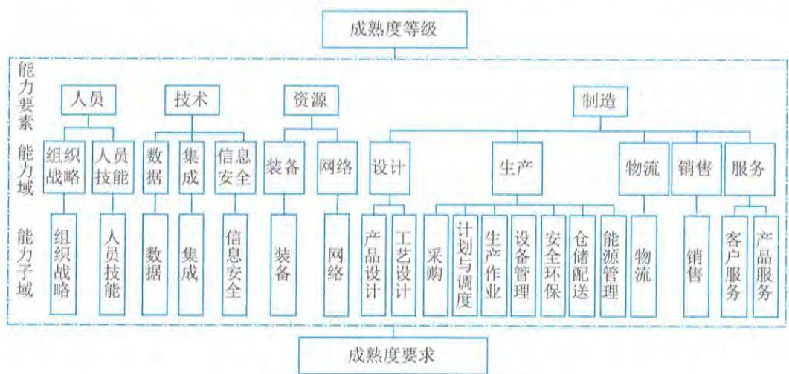  
图1-5 智能制造能力成熟度模型

能力要素提出了智能制造能力成熟度等级提升的关键方面, 包括人员、技术、资源和制造。人员包括组织战略、人员技能2个能力域。技术包括数据、集成和信息安全3个能力域。资源包括装备、网络2个能力域。制造包括设计、生产、物流、销售和服务5个能力域。设计包括产品设计和工艺设计2个能力子域; 生产包括采购、计划与调度、生产作业、设备管理、仓储配送、安全环保、能源管理7个能力子域; 物流包括物流1个能力子域; 销售包括销售1个能力子域; 服务包括客户服务和产品服务2个能力子域。

《智能制造能力成熟度模型》(GB/T 39116) 还规定了企业智能制造能力在不同阶段应达到的水平。成熟度等级分为五个等级, 自低向高分别是一级 (规划级)、二级 (规范级)、三级 (集成级)、四级 (优化级) 和五级 (引领级)。较高的成熟度等级涵盖了低成熟度等级的要求, 如图1- 6所示。

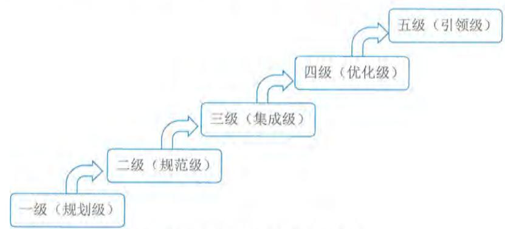  
图1-6 智能制造能力成熟度等级

一级(规划级)。企业应开始对实施智能制造的基础和条件进行规划,能够对核心业务活动(设计、生产、物流、销售、服务)进行流程化管理。二级(规范级)。企业应采用自动化技术、信息技术手段对核心装备和业务活动等进行改造和规范,实现单一业务活动的数据共享。三级(集成级)。企业应对装备、系统等开展集成,实现跨业务活动间的数据共享。四级(优化级)。企业应对人员、资源、制造等进行数据挖掘,形成知识、模型等,实现对核心业务活动的精准预测和优化。五级(引领级)。企业应基于模型持续驱动业务活动的优化和创新,实现产业链协同并衍生新的制造模式和商业模式。

# 1.3.3 服务现代化

服务现代化是使用信息技术手段,推动服务的效能提升、质量提高、风险降低和成本优化,也包括基于信息环境下的服务创新。以现代服务业为代表的服务模式变革,正在改变人们的生活模式、消费体验等。现代服务业是相对于传统服务业而言,适应现代人和现代城市发展的需求,而产生和发展起来的具有高技术含量和高文化含量的服务业。现代化服务业主要包括四大类:①基础服务(包括通信服务和信息服务);②生产和市场服务(包括金融、物流、批发、电子商务、农业支撑服务以及中介和咨询等专业服务);③个人消费服务(包括教育、医疗保健、住宿、餐饮、文化娱乐、旅游、房地产、商品零售等);④公共服务(包括政府的公共管理服务、基础教育、公共卫生、医疗以及公益性信息服务等)。

# 1.融合形态

以先进制造业与现代服务业融合发展为例。在工业化后期,服务业内部结构调整加快,新型业态开始出现,广告和咨询等中介服务业、房地产、旅游、娱乐等服务业发展较快,生产和生活服务业互动发展,催生了先进制造业与现代服务业的融合,主要表现出结合型融合、绑定型融合和延伸型融合。

(1)结合型融合。结合型融合是指在制造业产品生产过程中,中间投入品中服务投入所占的比例越来越大,如在产品的市场调研、产品研发、员工培训、管理咨询和销售服务的投入日益增加;同时,在服务业最终产品的提供过程中,中间投入品中制造业产品投入所占比重也越来越大,如在移动通信、互联网、金融等服务提供过程中无不依赖于大量的制造业"硬件"投入。这些作为中间投入的制造业或制造业产品,往往不出现在最终的服务或产品中,而是在服务或产品的生产过程中与之结合为一体。发展迅猛的生产性服务业,正是服务业与制造业结合型融合的产物,服务作为一种软性生产资料正越来越多地进入生产领域,促使制造业生产过程的"软化",并对提高经济效率和竞争力产生重要影响。

(2)绑定型融合。绑定型融合是指越来越多的制造业实体产品必须与相应的服务产品绑定在一起使用,才能使消费者获得完整的功能体验。消费者对制造业产品的需求不仅仅是有形产品,而是从产品的购买、使用、维修、报废、回收全生命周期的服务保证,产品的内涵已经从单一的实体扩展到提供全面解决方案。很多制造业的产品就是为了提供某种服务而生产,如通

信产品与家电等;部分制造业企业还将技术服务等与产品一同出售,如电脑与操作系统软件等。在绑定型融合过程中,服务正在引导制造业部门的技术变革和产品创新,服务的需求与供给指引着制造业的技术进步和产品开发方向,如对拍照、发电邮、听音乐等服务的需求,推动了手机由单一功能向功能更丰富的多媒体方向升级。

(3)延伸型融合。延伸型融合是指以体育文化产业、娱乐产业为代表的服务业引导周边衍生产品的生产需求,从而带动相关制造产业的共同发展。电影、动漫、体育赛事等能够带来大量的衍生品消费,包括服装、食品、玩具、装饰品、音像制品、工艺纪念品等实体产品,这些产品在文化、体育和娱乐产业周围构成一个庞大的产业链,这个产业链在为服务业供应商带来丰厚利润的同时,也给相关制造产业带来了巨大商机,从而把服务业同制造业紧密结合在一起,推动着整个连带产业共同向前发展。

# 2.消费互联网

消费互联网对消费影响最明显的特点是,从商品消费逐渐向服务型消费转变,无论是经济增长还是消费升级,服务贸易的比重会越来越大,数字和服务对未来经济和生活的影响作用也会越来越突出。它是以个人为用户,以日常生活为应用场景的应用形式,满足消费者在互联网中的消费需求而生的互联网类型。消费互联网以消费者为服务中心,针对个人用户提升消费过程的体验,在人们的阅读、出行、娱乐和生活等诸多方面进行改善,让生活变得更方便、更快捷。消费互联网的本质是个人虚拟化和增强个人生活消费体验。

消费互联网依托于强大的信息与数据处理能力以及多样化的移动终端,在电子商务、社交网络、搜索引擎等行业出现规模化发展态势并形成各自的生态圈,奠定了稳定的行业发展格局。消费互联网具有的属性包括:

- 媒体属性。消费互联网是由自媒体、社会媒体以及资讯为主的门户网站。

- 产业属性。消费互联网是由在线旅行和为消费者提供生活服务的电子商务等其他组成。

这些属性影响着人们的生活方式,渗透到人们生活的各个领域,改善消费体验等。

近年来,我国以网络购物、移动支付、线上线下融合等新业态新模式为特征的新型消费迅速发展,特别是新冠疫情发生以来,传统接触式线下消费受到影响,新型消费发挥了重要作用,有效保障了居民日常生活需要。

社交网络的出现,极大地推动了社会化信息的传播效率。社交网络中每个用户实际上是一个点,一个网络上有无数的点;点与点之间相连成线,线与线之间相连成网。社交网络本身具有发散性,发散性是指信息的扩散速度。伴随社交网络出现的社交圈,并不仅仅只是发散性,还体现出一定的聚集性。社交圈会因特定的因素而聚集,从而带来了新型网络经济,如网络商城、快递、餐饮外卖、网红带货等,成就了社交网络的消费互联网的核心地位。

消费互联网不仅仅给人们带来了生活方式的变化和生活质量的提高,而且推动了社会生活的深层变革,也就是"无身份社会"的建立。互联网环境下的"无身份社会"不仅使社会活动更加快捷,还提高了经济效能,相关参与者可以不用消耗时间、精力来完成共同参与者的"身份认定",这是因为互联网搭建了更高层级的信任校验模式,其通过数据记录、存储、整合与共

享等方面的能力，实现了社会活动在一定程度上的复杂校验和过程可回溯，正是这种天然模式，进一步强化了“无身份社会”的发展进程。

数字技术在消费领域的场景应用得到了多元拓展。新冠疫情后，消费者日益习惯在数字空间进行消费、娱乐和社交，为不断拓展多元、新型的数字消费场景奠定了基础。因此，消费互联网经济未来仍有广阔前景，消费领域平台组织可以充分挖掘经济与社会潜力，增加优质产品和服务供给，并为消费者实现数字化生活方式提供高效连接，创造和普及消费新场景，培育消费新行为和新需求。同时，加快发展线下向“上”融合和线上向“下”拓展的双向消费形态。

# 1.4 数字中国

习近平总书记在党的十九大报告中指出：加强应用基础研究，拓展实施国家重大科技项目，突出关键共性技术、前沿引领技术、现代工程技术、颠覆性技术创新，为建设数字中国等提供有力支撑。数字中国是新时代国家信息化发展的新战略，是满足人民日益增长的美好生活需要的新举措，是驱动引领经济高质量发展的新动力，涵盖经济、政治、文化、社会、生态等各领域信息化建设，主要包括“宽带中国”“互联网  $+$ ”大数据、云计算、人工智能、数字经济、电子政务、新型智慧城市、数字乡村等内容。“迎接数字时代，激活数据要素潜能，推进网络强国建设，加快建设数字经济、数字社会、数字政府，以数字化转型整体驱动生产方式、生活方式和治理方式变革”成为了新时代我国信息化发展的主旋律，如图1- 7所示。

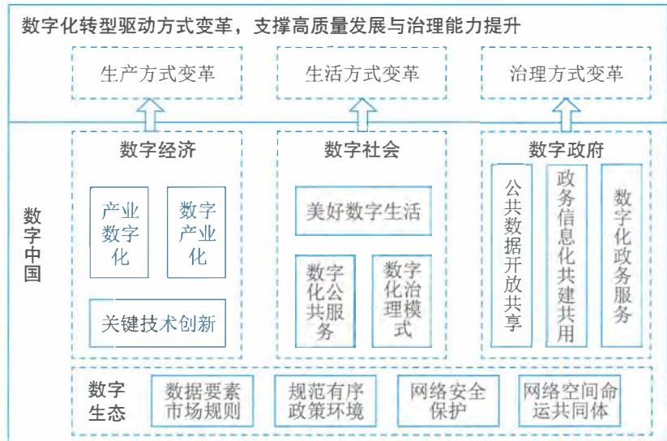  
图1-7 数字中国概览示意图

# 1.4.1 数字经济

数字经济是继农业经济、工业经济之后的更高级经济形态。从本质上看，数字经济是一种新的技术经济范式，它建立在信息与通信技术的重大突破的基础上，以数字技术与实体经济融

合驱动的产业梯次转型和经济创新发展的主引擎,在基础设施、生产要素、产业结构和治理结构上表现出与农业经济、工业经济显著不同的新特点。

# 1.新技术经济范式

1962年库恩在其代表作《科学革命的结构》中首先对"范式"(Paradigm)进行了定义,库恩认为:"范式是指那些公认的科学成就,在一段时间里为实践共同体提供典型的问题和解答"。1982年,技术创新经济学家多西将这个概念引入技术创新之中,并提出了技术范式(Technology Paradigm)的概念,将技术范式定义为解决所选择的技术经济问题的一种模式,而这些解决问题的办法立足于自然科学的原理。从这个定义出发,云计算、人工智能、大数据等技术在与社会经济活动的融合重构中,经过技术与经济的相互促进,形成了一些相对稳定的经济新结构和新形态,如平台经济、分享经济、算法经济、服务经济、协同经济等。进而,先一步形成的经济形态触发社会其他领域的连锁变革,最终实现整个经济领域的技术经济范式转换。数字经济的技术经济范式的结构主要包括驱动力、新结构、价值创造和经济增长。

(1)驱动力。数字经济发展的驱动力机制解释了数字经济为什么会产生以及数字经济为何能持续发展。大量研究文献证实,由新一代信息技术革命而形成的智能技术群被普遍认为是数字经济发生和发展的基本驱动力。智能技术群是包括云计算、大数据、人工智能、区块链、物联网、5G、VR/AR等众多技术的集群,并通过不同的细分技术组合驱动经济活动发生变革。多种技术的组合形成乘数效应,并在不断融合重组中创造出新的技术组件,形成新的合力。智能技术群与经济活动融合,通过复杂经济学所描绘的经济与技术互动过程,最终展现出重构旧经济并形成新经济的强大力量,从而为数字经济发展提供了源源不断的驱动力。

(2)新结构。每一次技术经济范式转换都会带来全新的经济形态和经济结构。数字经济建立在智能技术群所独有的数字化、网络化、智能化等特征的基础上,具有前所未有的新特征,如基于网络连接而产生的网络效应和用户规模经济;基于全方位数字化而使得数据成为生产要素;由智能化技术应用而产生的自治化、无人化运行特征;数字世界和实体世界融合重构了产用关系,并在经济产出方面呈现出正递增效应。

(3)价值创造。新范式代替旧范式的本质是价值观的转换。数字经济的本质是技术经济范式转换,数字经济必然要创造出全新的价值,进而改变人们的价值观念。通过技术经济范式转换,数字经济与社会要素的互动进一步构成社会技术系统,从而把影响渗透到整个社会领域。2020年突如其来的疫情对经济和社会结构造成了前所未有的冲击,在疫情的推动下,数字经济将加速影响和改变宏微观经济结构、组织形态和运行模式,并全方位推动全社会生产关系的再重建。疫情新常态下,数字技术对经济发展和政府治理模式加速重构,数字技术与工业、教育、医疗等行业领域深度融合,并延伸出全新的应用场景。同时,数据已经成为新型生产关系里最具潜力的生产要素,不断推动技术、价值、模式的新发展,加快驱动产业、社会、治理的新变革,全面助力全社会生产关系的再重建。

(4)经济增长。新技术驱动新经济,新经济创造新价值,新价值驱动经济增长,前述三个元素构建出数字经济的基本逻辑。但经济增长并非单纯是数字经济拉动的结果。而且也是数字经济持续发展的引擎,因而也是数字经济范式结构的构成元素。随着数字经济的持续推进,在

增长预期的推动下，构成经济进一步增长的投资和消费也就更加活跃，更多的新经济形态不断出现，更多的新价值不断创造，从而形成一个正反馈的闭环，最终实现持续的经济增长。

# 2.主要内容构成

《数字经济及其核心产业统计分类(2021)》从“数字产业化”和“产业数字化”两个方面，确定了数字经济的基本范围，将其分为数字产品制造业、数字产品服务业、数字技术应用业、数字要素驱动业、数字化效率提升业等5大类。其中，前4大类为数字产业化部分，对应于《国民经济行业分类》中的26个大类、68个中类、126个小类，是数字经济发展的基础。第5大类产业数字化部分，对应于《国民经济行业分类》中的91个大类、431个中类、1256个小类，体现了数字技术将进一步与国民经济各行业进行深度渗透和广泛融合。

# 1)数字产业化

数字产业化是指为产业数字化发展提供数字技术、产品、服务、基础设施和解决方案，以及完全依赖于数字技术、数据要素的各类经济活动，包括电子信息制造业、电信业、软件、信息技术、互联网行业等。数字产业化也成为了数字经济基础部分。《中华人民共和国国民经济和社会发展第十四个五年规划和2035年远景目标纲要》提出了强调加快推动数字产业化，培育壮大人工智能、大数据、区块链、云计算、网络安全等新兴数字产业，提升通信设备、核心电子元器件、关键软件等产业水平。构建基于5G的应用场景和产业生态，在智能交通、智慧物流、智慧能源、智慧医疗等重点领域开展试点示范。鼓励企业开放搜索、电商、社交等数据，发展第三方大数据服务产业。促进共享经济、平台经济健康发展。

数字产业化发展重点包括：

云计算。加快云操作系统迭代升级，推动超大规模分布式存储、弹性计算、数据虚拟隔离等技术创新，提高云安全水平，以混合云为重点，培育行业解决方案、系统集成、运维管理等云服务产业。大数据。推动大数据采集、清洗、存储、挖掘、分析、可视化算法等技术创新，培育数据采集、标注、存储、传输、管理、应用等全生命周期产业体系，完善大数据标准体系。物联网。推动传感器、网络切片、高精度定位等技术创新，协同发展云服务与边缘计算服务，培育车联网、医疗物联网、家居物联网产业。工业互联网。打造自主可控的标识解析体系、标准体系、安全管理体系，加强工业软件研发应用，培育形成具有国际影响力的工业互联网平台，推进“工业互联网+智能制造”产业生态建设。区块链。推动智能合约、共识算法、加密算法、分布式系统等区块链技术创新，以联盟链为重点发展区块链服务平台和金融科技、供应链管理、政务服务等领域应用方案，完善监管机制。人工智能。建设重点行业人工智能数据集，发展算法推理训练场景，推进智能医疗装备、智能运载工具、智能识别系统等智能产品设计与制造，推动通用化和行业性人工智能开放平台建设。

虚拟现实和增强现实。推动三维图形生成、动态环境建模、实时动作捕捉、快速渲染处理等技术创新，发展虚拟现实整机、感知交互、内容采集制作等设备和开发工具软件、行业解决方案。

# 2）产业数字化

产业数字化是指在新一代数字科技支撑和引领下，以数据为关键要素，以价值释放为核心，以数据赋能为主线，对产业链上下游的全要素数字化升级、转型和再造的过程。产业数字化作为实现数字经济和传统经济深度融合发展的重要途径是新时代背景下使用数字经济发展的必由之路和战略抉择。《中华人民共和国国民经济和社会发展第十四个五年规划和2035年远景目标纲要》明确提出了推进产业数字化转型，实施“上云用数赋智”行动，推动数据赋能全产业链协同转型。

产业数字化发展对经济和社会各项发展都具有重要意义。从微观看，数字化助力传统企业蝶变，再造企业质量效率新优势。传统企业迫切需要新的增长机会与发展模式；快速迭代及进阶的数字科技为传统企业转型升级带来新希望；传统产业成为数字科技应用创新的重要场景。从中观看，数字化促进产业提质增效，重塑产业分工协作新格局。提升产品生产制造过程的自动化和智能化水平；降低产品研发和制造成本，实现精准化营销、个性化服务；重塑产业流程和决策机制。从宏观看，孕育新业态新模式，加速新旧动能转换新引擎。

数字科技广泛应用和消费需求变革催生出共享经济、平台经济等新业态新模式；促进形成新一代信息技术、高端装备、机器人等新兴产业，加速数字产业化形成。产业数字化具有的典型特征包括：

以数字科技变革生产工具；以数据资源为关键生产要素；以数字内容重构产品结构；以信息网络为市场配置纽带；以服务平台为产业生态载体；以数字善治为发展机制条件。

通过产业数字化全面推动数字时代产业体系的质量变革、效率变革、动力变革，推动新旧动能转换和高质量发展。产业数字化的理解需要兼顾社会与市场两个维度，以更加全面的视角理解其内涵本质。从社会维度看，产业数字化是建立在生产工具与生产要素变革基础上的一种社会行为；从市场维度看，产业数字化是以信息网络为市场配置纽带、以服务平台为产业生态载体的资源优化过程。数字善治是社会及市场两个维度有机融合的具体体现，其既是产业数字化发展的机制条件，也是驱动产业数字化发展的重要动力机制。

在数字经济背景下，企业逐步进入数据驱动时代。随着企业对数字技术的不断利用，各类主体在组织生产、业务重构、经营管理等方面的数字化程度日益完善，数据将成为企业各类信息汇集的载体。未来以数据驱动的业务形式将成为主流，全渠道的数据盘活将成为企业的核心竞争力。因此，数据资产有效盘活与运营，将成为数字经济时代下企业的核心竞争力。企业应加深对数据的利用水平和治理水平，通过数据积累与运营，打通企业内部不同层级、不同系统

之间的数据壁垒，盘活数据资产价值，实现对内支撑业务应用和管理决策；对外加强数据服务能力输出，从而提升数据潜在价值向实际业务价值的转化率，使得企业在提升市场竞争力同时也强化了运营能力，以此获得业务的高速增长。

在国家战略层面，数字化转型已经成为支撑未来经济发展的核心驱动力。随着数字经济的蓬勃发展，产业数字化转型将形成以产业链为中心，促进产业链与创新链、供应链、要素链、资金链、政策链等相互融合发展的新场景，如图1- 8所示。“六链融合”也将成为未来产业数字化转型的主要发展模式，基于此将彻底释放国家数字经济发展的新动能。在战略层面，要以产业链为转型基础，通过与供应链的稳定协同、与创新链的对接融合、与资金链的良性循环、与政策链的相互支撑、与要素链的互联互动，实现六链条的联动呼应，促使各链条内的数据效应、经济活力竞相进发。在实施层面，要始终推进以科学技术为核心，发挥产业互联网效应，实现以大数据为主线、以人工智能为驱动的“数据链”穿插联动，进而释放国家层的多链协同下的数字效能。“六链融合”通过创新、政策、生产要素等赋能产业链，推动产业的升级转换，加快建设实体经济、科技创新、现代金融、人力资源协同发展的产业体系，最终开辟数字化转型的新路径。

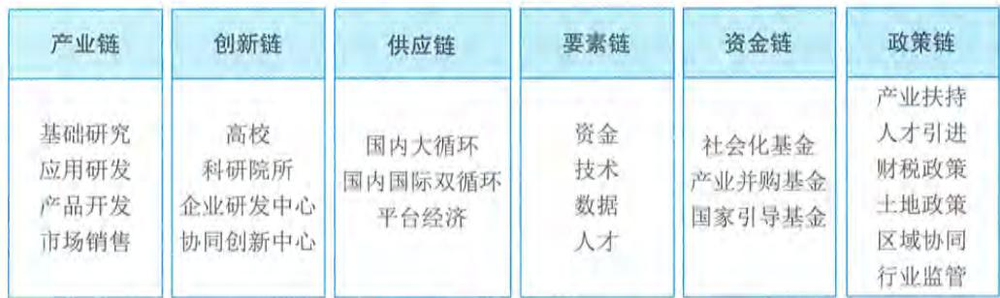  
图1-8“六链融合”推动产业数字化协同发展

# 3）数字化治理

数字化治理通常指依托互联网、大数据、人工智能等技术和应用，创新社会治理方法手段，优化社会治理模式，推进社会治理的科学化、精细化、高效化，助力社会治理现代化。数字化治理是数字经济的组成部分之一，包括但不限于多元治理，以“数字技术+治理”为典型特征的技管结合，以及数字化公共服务等。

数字化治理的核心特征是全社会的数据互通、数字化的全面协同与跨部门的流程再造，形成“用数据说话、用数据决策、用数据管理、用数据创新”的治理机制。作为数字时代的全新治理范式，数字化治理至少包含3个方面的内涵：

- 对数据的治理。对数据的治理即将治理对象扩大到涵盖数据要素。作为新兴生产要素和关键的治理资源，数据要素成为大国竞争的主要领域，对数据的治理成为制定数字经济规则的重要内容，数据要素的所有权、使用权、监管权，以及信息保护和数据安全等都需要全新治理体系。

- 运用数字技术进行治理。运用数字技术进行治理即运用数字与智能技术优化治理技术体

系,进而提升治理能力。大数据、人工智能等新一代数字技术,可以为国家治理进行全方位的"数字赋能",改进治理技术、治理手段和治理模式,实现复杂治理问题的超大范围协同、精准"滴灌"、双向触达和超时空预判。

- 对数字融合空间进行治理。随着越来越多的经济社会活动搬到线上,治理场域也拓展到数字空间。未来会有越来越多的经济社会活动发生在线上,数字融合空间会以全新的方式创造经济价值、塑造社会关系,这需要适应数字融合世界的治理体系,对数字融合空间的新生事物进行有效治理。

# 4)数据价值化

价值化的数据是数字经济发展的关键生产要素,加快推进数据价值化进程是发展数字经济的本质要求。近年来,数据可存储与可重用呈现爆发增长、海量集聚的特点,是实体经济数字化、网络化、智能化发展的基础性战略资源。数据价值化包括但不限于数据采集、数据标准、数据确权、数据标注、数据定价、数据交易、数据流转、数据保护等。

数据价值化是指以数据资源化为起点,经历数据资产化、数据资本化阶段,实现数据价值化的经济过程。上述三个要素构成数据价值化的"三化"框架,即数据资源化、数据资产化、数据资本化。

- 数据资源化是使无序、混乱的原始数据成为有序、有使用价值的数据资源。数据资源化阶段包括通过数据采集、整理、聚合、分析等,形成可采、可见、标准、互通、可信的高质量数据资源。数据资源化是激发数据价值的基础,其本质是提升数据质量,形成数据使用价值的过程。

- 数据资产化是数据通过流通交易给使用者或者所有者带来的经济利益的过程。数据资产化是实现数据价值的核心,其本质是形成数据交换价值,初步实现数据价值的过程。

- 数据资本化主要包括两种方式,即数据信贷融资与数据证券化。数据资本化是拓展数据价值的途径,其本质是实现数据要素社会化配置。

# 1.4.2 数字政府

信息技术的革新改变了人们传统的工作、学习、生活和娱乐方式,同时对政府提供信息服务,公民参与政府民主决策的方式提出了挑战。利用信息技术改进政府工作及服务的效率,形成新的工作方式,这已成为各国政府所关心的问题。数字政府的出现便是其中之一。数字政府通常是指以新一代信息技术为支撑,以"业务数据化、数据业务化"为着力点,通过数据驱动重塑政务信息化管理架构、业务架构和组织架构,形成"用数据决策、数据服务、数据创新"的现代化治理模式。

# 1.数字新特征

2022年国务院印发的《关于加强数字政府建设的指导意见》提出加强数字政府建设是适应新一轮科技革命和产业变革趋势、引领驱动数字经济发展和数字社会建设、营造良好数字生态、加快数字化发展的必然要求,是建设网络强国、数字中国的基础性和先导性工程,是创新政府治理理念和方式、形成数字治理新格局、推进国家治理体系和治理能力现代化的重要举措,对

加快转变政府职能，建设法治政府、廉洁政府和服务型政府意义重大。

数字政府既是“互联网  $^+$  政务”深度发展的结果，也是大数据时代政府自觉转型升级的必然，其核心目的是以人为本，实施路径是共创、共享、共建、共赢的生态体系。同时数字政府也被赋予了新的特征，包括协同化、云端化、智能化、数据化、动态化等。

- 协同化。协同化主要强调组织的互联互通，业务协同方面能实现一个跨层级、跨地域、跨部门、跨系统、跨业务的高效协同管理和服务。

- 云端化。云平台是政府数字化最基本的技术要求，政务上云是促成各地各部门由分散建设向集群或集约式规划与建设的演化过程，是政府整体转型的必要条件。

- 智能化。智能化治理是政府应对社会治理多元参与、治理环境越发复杂、治理内容多样化趋势的关键手段。

- 数据化。数据化也是现阶段数字政府建设的重点，是建立在政务数据整合共享基础上的数字化的转型。

- 动态化。动态化指数字政府是在数据驱动下动态发展和不断演进的过程。

数字政府建设的关键词主要包括：共享、互通和便利。

- 共享。推动政务数据共享，推进政务服务事项集成化办理。数字政府，数据先行。数据共享是提升政务服务效能的重要抓手。

- 互通。国家政务服务平台持续推动与各地区、各部门政务服务业务办理系统的全面对接融合，打破地域阻隔与部门壁垒，实现更大范围内的系统互联互通，有力推动了政务服务线上线下融合互通和跨地区、跨部门、跨层级协同办理。

- 便利。数字政府，利企便民。加强数字政府建设的根本目标是更好地服务企业和群众，满足人民日益增长的对美好生活的需要。

# 2. 主要内容

《“十四五”国家信息化规划》中提出打造协同高效的数字政府服务体系，深入推进“放管服”改革，加快政府职能转变，打造市场化、法治化、国际化营商环境，坚持整体集约建设数字政府，推动条块政务业务协同，加快政务数据开放共享和开发利用，深化推进“一网通办”“跨省通办”“一网统管”，畅通参与政策制定的渠道，推动国家行政体系更加完善、政府作用更好发挥、行政效率和公信力显著提升，推动有效市场和有为政府更好结合，打造服务型政府。

数字政府从面向社会大众政务服务视角来看，主要内容重点体现在“一网通办”“跨省通办”“一网统管”。

# 1）一网通办

随着互联网技术的发展，政务事项在一窗式办理的基础上，利用互联网技术将业务办理由实体大厅升级为网上大厅进行办理，各个政务部门的业务也只需要在同一个网上大厅即可办理，即“一网通办”的模式。群众可以少去甚至不去政务中心，通过网络即可将各类业务办理完成。2020年国务院政府工作报告提出，推动更多服务事项“一网通办”，做到企业开办全程网上办理。“一网通办”是指打通不同政府部门的信息系统，群众只需操作一个办事系统就能办成不同领域的事项，解决办不完的手续、盖不完的章、跑不完的路这些“关键小事”。

"一网通办"是依托于一体化在线政务服务平台,通过规范网上办事标准,优化网上办事流程,搭建统一的互联网政务服务总门户,整合政府服务数据资源和完善配套制度等措施,推行政务服务事项网上办理,推动企业和群众线上办事只登录一次即可全网通办。"一网通办"和一窗式服务在本质上是一致的。两者均采用受办分离的模式,一窗式服务是由工作人员填报信息,"一网通办"是由个人在网上自主填写申报信息,后续均由具体业务经办部门进行审核处理。"一网通办"模式是在一窗式服务的基础上,以互联网技术为手段,逐步将原先政务大厅中办理的业务迁移至网上办事大厅进行申报。

信息共享对于"一网通办"平台的建设有着重大的意义。建立自然人库、法人库、电子证照库等基础共享库和业务数据共享库,一方面能极大地简化基础信息的录入工作,原本需要线下提供的材料,现在通过信息共享就能获得,杜绝了信息录入的错误和数据的造假;另一方面在规范数据的前提下,能够实现业务条件的智能匹配和判断,自动完成业务办理的初审甚至是最终审批。以数据的自动比对来代替人工判断,通过数据的流转来代替纸质材料的传递,在最大程度上降低工作的错误率,能够极大地提高事项审批的效率,改善用户体验。信息共享也为"一网通办"带来了更大的可行性。通过数据的共享,减少了信息录入,降低了业务自主办理难度,通过数据的智能比对与校验,使得更多的业务能在网上实现办理。

"一网通办"是政务服务发展的一个阶段性目标,在各类信息共享的基础上,能进一步优化业务流程,提升政务服务水平,提高政务服务效率。它的实现需要各部门通力合作,梳理政务服务事项,优化整个业务流程,在原有各部门业务系统的基础上进行升级改造,打破部门间的壁垒,实现深度的分工合作。

# 2)跨省通办

"跨省通办"是一种政务服务模式。推进政务服务"跨省通办",是转变政府职能、提升政务服务能力的重要途径,是畅通国民经济循环、促进要素自由流动的重要支撑,对于提升国家治理体系和治理能力现代化水平具有重要作用。"跨省通办"从高频政务服务事项入手,2021年底前基本实现高频政务服务事项"跨省通办",同步建立清单化管理制度和更新机制,逐步纳入其他办事事项,有效满足各类市场主体和广大人民群众异地办事需求。

"跨省通办"是申请人在办理地之外的省市提出事项申请或在本地提出办理其他省市事项的申请,办理模式通常可分为:

- 全程网办。全程网办指政务服务平台提供申请受理、审查决定、颁证送达等全流程、全环节网上服务,以及为申请人提供事项申报、进度查询、获取结果等全过程线上指导和辅导。- 代收代办。代收代办指在不改变各地区原有办理事权的基础上,通过"收办分离"打破事项办理属地限制,实现事项跨省市办理。- 多地联办。多地联办指由一地受理申请,"跨省通办"事项相关业务系统与全国一体化政务服务平台互联互通,申请材料和档案材料通过全国一体化政务服务平台共享,实现信息少填少报,对于确需纸质材料的通过邮件寄递至业务属地部门,申请人只需到一地即可办理完成跨省事项。

政务服务"跨省通办"不仅是政务服务方式的改变,更有助于实现政务服务流程的优化,

从而提高政府工作效能,激发社会活力,实现让利于民。从理念上讲,政务服务"跨省通办"是坚持以群众和企业需求为导向,推进政府自身的变革。从方法上讲,政务服务"跨省通办"体现了高效协同的方法路径。政务服务"跨省通办"涉及不同政府部门事权和支出责任的重新划分,需要健全不同部门、不同层级、不同地域之间协同配合机制,形成改革的合力。从手段上讲,政务服务"跨省通办"需要以数字化为技术支撑。新一代数字技术的发展为政务服务提供了重要的技术手段和平台,也为政务服务"跨省通办"奠定了坚实基础。政务服务"跨省通办"的一个重要内涵就是要充分运用大数据、云计算、人工智能等新技术手段,优化再造业务流程,强化业务协同,加强数据融合,促进条块联通和上下联动,提升政府治理能力。

3)一网统管

"一网统管"作为新型智慧城市推进城市治理体系和治理能力现代化的重要创新模式,自被提出后已经逐步在各地落地并发挥着重要作用。"一网统管"围绕城市治理水平的提升,主要针对各类民生诉求和城市事件,用实时在线数据和各类智能方法,及时、精准地发现问题、对接需求、研判形势、预防风险,在最低层级、最早时间以相对最小成本,解决最突出问题,取得最佳综合效应,实现线上线下协同高效处置一件事。

"一网统管"通常从城市治理突出问题出发,以城市事件为牵引,统筹管理网格,统一城市运行事项清单,构建多级城市运行"一网统管"应用体系,推动城市管理、应急指挥、综合执法等领域的"一网统管",实现城市运行态势感知、关键指标检测、统一事件受理、智能调度指挥、联动协同处置、监督评价考核等全流程监管。

"一网统管"建设通常重点强调:

- 一网。一网主要包括政务云、政务网和政务大数据中心等。

- 一屏。一屏是指通过对多个部门的数据进行整合,将城市运行情况充分反映出来。

- 联动。畅通各级指挥体系,为跨部门、跨区域、跨层级联勤联动、高效处置提供快速响应能力。

- 预警。基于多维、海量、全息数据汇集,实现城市运行体征的全量、实时掌握和智能预警。

- 创新。以管理需求带动智能化建设,以信息流、数据流推动业务流程全面优化和管理创新。

# 3.能力体系

随着数字政府发展的不断演进,2022年国务院印发的《关于加强数字政府建设的指导意见》进一步明确"构建协同高效的政府数字化履职能力体系"发展目标。

(1)强化经济运行大数据监测分析,提升经济调节能力。将数字技术广泛应用于宏观调控决策、经济社会发展分析、投资监督管理、财政预算管理、数字经济治理等方面,全面提升政府经济调节数字化水平。

(2)大力推行智慧监管,提升市场监管能力。充分运用数字技术支撑构建新型监管机制,加快建立全方位、多层次、立体化监管体系,实现事前事中事后全链条全领域监管,以有效监管维护公平竞争的市场秩序。

(3) 积极推动数字化治理模式创新, 提升社会管理能力。推动社会治理模式从单向管理转向双向互动、从线下转向线上线下融合, 着力提升矛盾纠纷化解、社会治安防控、公共安全保障、基层社会治理等领域数字化治理能力。

(4) 持续优化利企便民数字化服务, 提升公共服务能力。持续优化全国一体化政务服务平台功能, 全面提升公共服务数字化、智能化水平, 不断满足企业和群众多层次多样化服务需求, 打造泛在可及的服务体系。

(5) 强化动态感知和立体防控, 提升生态环境保护能力。全面推动生态环境保护数字化转型, 提升生态环境承载力、国土空间开发适宜性和资源利用科学性, 更好支撑美丽中国建设, 提升生态环保协同治理能力。

(6) 加快推进数字机关建设, 提升政务运行效能。提升辅助决策能力。建立健全大数据辅助科学决策机制, 统筹推进决策信息资源系统建设, 充分汇聚整合多源数据资源, 拓展动态监测、统计分析、趋势研判、效果评估、风险防控等应用场景, 全面提升政府决策科学化水平。

(7) 推进公开平台智能集约发展, 提升政务公开水平。优化政策信息数字化发布。完善政务公开信息化平台, 建设分类分级、集中统一、共享共用、动态更新的政策文件库。加快构建以网上发布为主、其他发布渠道为辅的政策发布新格局。

# 1.4.3 数字社会

在新一轮科技革命推动下, 人类正在加速迈向数字社会。新科技革命成果不断融入生产生活, 改变传统的生产生活方式, 改变人们的行为方式、社会交往方式、社会组织方式和社会运行方式, 深刻影响人们的思想观念和思维方式, 不断创造新的产业形态、商业模式、就业形态, 推动我国现代化不断向纵深发展。

# 1. 数字民生

随着互联网、物联网、大数据、区块链和人工智能交汇融合、集群互动形成一种呈指数级增长的信息技术体系, 使得传统生产方式优化升级, 在触发经济发展结构变革的同时, 正以一种前所未有的势头向政治、文化、生活等民生领域延伸, 将"人"与"公共服务"通过数字化的方式全面连接, 将大幅提升社会整体服务效率和水平, 实现数字民生。

《中华人民共和国国民经济和社会发展第十四个五年规划和2035年远景目标纲要》提出"聚焦教育、医疗、养老、抚幼、就业、文体、助残等重点领域, 推动数字化服务普惠应用, 持续提升群众获得感。推进学校、医院、养老院等公共服务机构资源数字化, 加大开放共享和应用力度。推进线上线下公共服务共同发展、深度融合, 积极发展在线课堂、互联网医院、智慧图书馆等, 支持高水平公共服务机构对接基层、边远和欠发达地区, 扩大优质公共服务资源辐射覆盖范围。加强智慧法院建设。鼓励社会力量参与"互联网+公共服务", 创新提供服务模式和产品"。《"十四五"国家信息化规划》提出"构建普惠便捷的数字民生保障体系, 坚持把实现好、维护好、发展好最广大人民根本利益作为发展的出发点和落脚点, 着力以信息技术健全基本公共服务体系, 改善人民生活品质, 让人民群众共享信息化发展成果"。

我国在数字教育、数字医疗、数字就业、数字文旅等领域持续高速发展, 涵盖内容既有

"软件"层面的体制机制建设,又有"硬件"层面的平台系统建设。数字民生建设重点通常强调普惠、赋能和利民。

(1)普惠。充分开发利用信息技术体系,扩大民生保障覆盖范围,助力普惠型民生建设,解决民生资源配置不均衡等问题。

(2)赋能。信息技术体系与民生的深度融合赋予了民生建设新动能,促进民生保障实效指数式增长,如"互联网+教育""互联网+养老""互联网+交通"等。

(3)利民。信息技术体系创新拓展了公共服务场景,推动数字技术全面融入社会交往和日常生活新趋势,使民生服务日趋智慧化、便利化和人性化。

无论是打造宜居城市,还是建设美丽乡村,都离不开基于大数据的民生需求洞察,拓展民生服务渠道。数字民生体现出的正是以数字思维破解民生难题,以信息技术赋能民生治理的新时代,也是对科技助力人民幸福美好生活追求的生动诠释。

# 2.智慧城市

智慧城市是运用信息通信技术,有效整合各类城市管理系统,实现城市各系统间信息资源共享和业务协同,推动城市管理和服务智慧化,提升城市运行管理和公共服务水平,提高城市居民幸福感和满意度,实现可持续发展的一种创新型城市。智慧城市从概念提出到落地实践,历经长期建设与发展,我国智慧城市建设数量持续增长。从在建智慧城市的分布来看,我国已初步形成京津冀、长三角、粤港澳、中西部四大智慧城市群。智慧城市作为一种新型城市发展形态和治理模式已被社会群体广泛认可和接受,新型智慧城市建设持续推动着城市的高质量发展,主要体现在:

- 智慧城市建设更加注重以人民为中心;

- 新技术持续赋能智慧城市的建设与发展;

- 城市治理现代化是智慧城市建设的必然要求;

- 智慧城市群区域一体化协同发展新格局逐步形成;

- 共建、共治、共享生态模式助力智慧城市高质量发展。

2020年随着新冠疫情的蔓延,越来越多的国家开始意识到智慧城市建设的重要性,城市管理者可以借助先进的信息技术来应对危机。2020年经济合作与发展组织(OECD)发布的《城市政策响应》报告中强调,数字化应用在疫情应急防控中起到关键作用,这促使许多城市将疫情防控系统长久地纳入到智慧城市应用场景中,用以监控和警惕公共卫生风险。同时,由于疫情变化仍具有不确定性,市政服务、医疗、办公、教育等模式的变革正在加速数字化转型。

# 1)基本原理

智慧城市的建设与发展遵循一定的基本原理。随着智慧城市的持续迭代升级,智慧城市已经从信息化建设与信息技术产品应用阶段,演进到了信息化与城市现代化深度融合阶段,其基本原理也在发生变化。当前,随着新一代信息技术的发展与成熟应用,智慧城市关注焦点从使用信息化应用提高工作效率,转为通过数字关系计算提高决策效能;从局部信息技术应用,转为广泛互联互通环境下的综合应用创新;从强调管理体系和规范性,转为突出主动服务与精准施策等。

随着智慧城市步入新的发展阶段,以及以数字产业化和产业数字化为主旋律的数字经济高

速发展,智慧城市基本原理表现为:  $①$  强调"人民城市为人民",以面向政府、企业、市民等主体提供智慧化的服务为主要模式;  $②$  重点强化数据治理、数字孪生、边际决策、多元融合和态势感知五个核心能力要素建设;  $③$  更加注重规划设计、部署实施、运营管理、评估改进和创新发展在内的智慧城市全生命周期管理;  $④$  目标旨在推动城市治理、民生服务、生态宜居、产业经济、精神文明五位一体的高质量发展;  $⑤$  持续推动城市治理体系与治理能力现代化水平提升,如图1- 9所示。

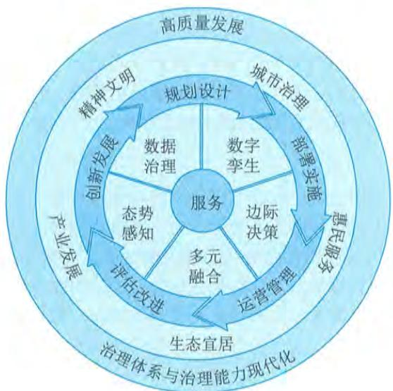  
图1-9 智慧城市参考基本原理图

该原理确立的智慧城市核心能力要素,揭示了当前及未来一段时期智慧城市发展的重心在于信息技术与社会发展的深度融合。智慧城市的五个核心能力要素密切关联且相互影响,但不可互为替代,均是开展新一阶段智慧城市整体、局部乃至具体项目建设、运行需要关注的核心能力要素。核心能力要素解释包括:

- 数据治理。数据治理指围绕数据这一新的生产要素进行能力构建,包括数据责权利管控、全生命周期管理及其开发利用等。- 数字孪生。数字孪生指围绕现实世界与信息世界的互动融合进行能力构建,包括社会孪生、城市孪生和设备孪生等,将推动城市空间摆脱物理约束,进入数字空间。- 边际决策。边际决策指基于决策算法和信息应用等进行能力构建,强化执行端的决策能力,从而达到快速反应、高效决策的效果,满足对社会发展的敏捷需求。- 多元融合。多元融合强调社会关系和社会活动的动态性及其融合的高效性等,实现服务可编排和快速集成,从而满足各项社会发展的创新需求。- 态势感知。态势感知指围绕对社会状态的本质反映及模拟预测等进行能力构建,洞察可变因素与不可见因素对社会发展的影响,从而提升生活质量。

根据智慧城市参考基本原理,智慧城市建设与发展内容主要面向城市治理、惠民服务、生

态宜居、产业发展等相关城市场景构建服务能力，为政府、企业、市民等提供服务。服务场景的构建，不仅仅需要技术与平台、基础设施等方面的共性技术支撑能力构建和数据要素支撑，也需要安全保障体系、运营体系的建设，同时还离不开产业环境、信息环境等环境的支撑。

# 2）成熟度等级

智慧城市的建设与发展过程是一个逐渐迈向更高成熟状态的长期渐进过程，是基础设施、信息资源、网络安全、体制机制、惠民服务、城市治理等各方面能力的持续提升过程。结合成熟度理论和方法，可以构建智慧城市成熟度，实现从动态评价的角度来对城市智慧化的发展阶段进行衡量。依托科学发展规律，可将智慧城市发展成熟度划分为规划级、管理级、协同级、优化级、引领级5个等级，如图1- 10所示。

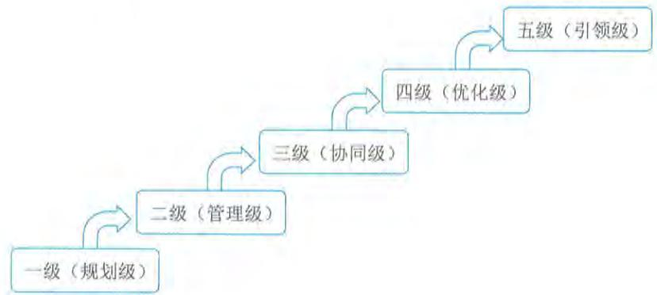  
图1-10 智慧城市成熟度等级参考模型

一级（规划级）。规划级应围绕智慧城市的发展进行策划，明确相关职责分工和工作机制等，初步开展数据采集和应用，确保相关活动有序开展。

二级（管理级）。管理级应明确智慧城市发展战略、原则、目标和实施计划等，推进城市基础设施的智能化改造，多领域实现信息系统单项应用，对智慧城市全生命周期实施管理。

三级（协同级）。协同级应管控智慧城市各项发展目标，实施多业务、多层级、跨领域应用系统的集成，持续推进信息资源的共享与交换，推动惠民服务、城市治理、生态宜居、产业发展等的融合创新，实现跨领域的协同改进。

四级（优化级）。优化级应聚焦智慧城市与城市经济社会发展深度融合，基于数据与知识模型实施城市经济、社会精准化治理，推动数据要素的价值挖掘和开发利用，推进城市竞争力持续提升。

五级（引领级）。引领级应构建智慧城市敏捷发展能力，实现城市物理空间、社会空间、信息空间的融合演进和共生共治，引领城市集群治理联动，形成高质量发展共同体。

# 3.数字乡村

数字乡村是伴随网络化、信息化和数字化在农业农村经济社会发展中的应用，以及农民现代信息技能的提高而内生的农业农村现代化发展和转型进程，既是乡村振兴的战略方向，也是

建设数字中国的重要内容。2019年中共中央办公厅、国务院办公厅印发《数字乡村发展战略纲要》指出:立足新时代国情农情,要将数字乡村作为数字中国建设的重要方面,加快信息化发展,整体带动和提升农业农村现代化发展。进一步解放和发展数字化生产力,注重构建以知识更新、技术创新、数据驱动为一体的乡村经济发展政策体系,注重建立层级更高、结构更优、可持续性更好的乡村现代化经济体系,注重建立灵敏高效的现代乡村社会治理体系,开启城乡融合发展和现代化建设新局面。

《数字乡村发展战略纲要》明确了到2035年,数字乡村建设取得长足进展。城乡"数字鸿沟"大幅缩小,农民数字化素养显著提升。农业农村现代化基本实现,城乡基本公共服务均等化基本实现,乡村治理体系和治理能力现代化基本实现,生态宜居的美丽乡村基本实现。到21世纪中叶,全面建成数字乡村,助力乡村全面振兴,全面实现农业强、农村美、农民富。《数字乡村发展战略纲要》明确了十项重点任务。

(1)加快乡村信息基础设施建设。主要包括大幅提升乡村网络设施水平、完善信息终端和服务供给、加快乡村基础设施数字化转型。

(2)发展农村数字经济。主要包括夯实数字农业基础、推进农业数字化转型、创新农村流通服务体系、积极发展乡村新业态。

(3)强化农业农村科技创新供给。主要包括推动农业装备智能化、优化农业科技信息服务。

(4)建设智慧绿色乡村。主要包括推广农业绿色生产方式、提升乡村生态保护信息化水平、倡导乡村绿色生活方式。

(5)繁荣发展乡村网络文化。主要包括加强农村网络文化阵地建设、加强乡村网络文化引导。

(6)推进乡村治理能力现代化。主要包括推动"互联网  $^+$  党建"、提升乡村治理能力。

(7)深化信息惠民服务。主要包括深入推动乡村教育信息化、完善民生保障信息服务。

(8)激发乡村振兴内生动力。主要包括支持新型农业经营主体和服务主体发展、大力培育新型职业农民、激活农村要素资源。

(9)推动网络扶贫向纵深发展。主要包括助力打赢脱贫攻坚战、巩固和提升网络扶贫成效。

(10)统筹推动城乡信息化融合发展。主要包括统筹发展数字乡村与智慧城市、分类推进数字乡村建设、加强信息资源整合共享与利用。

# 4.数字生活

数字生活是依托互联网和一系列数字科技技术应用为基础的一种生活方式,可以方便快捷地带给人们更好的生活体验和工作便利。数字生活主要体现在生活工具数字化、生活内容数字化和生活方式数字化等方面。

(1)生活工具数字化。数字化生活时代,现代信息技术和产品成为极其重要的生活工具,人们将像享受空气、阳光、水一样享受数字化生活工具带来的舒适和便捷。根据摩尔定律和梅特卡夫定律,随着技术的不断创新与广泛扩散,其应用成本将显著下降,而其价值则显著增加。

(2)生活方式数字化。在数字社会中,借助于数字化技术,每个人的工作、学习、消费、交往、娱乐等各种活动方式都将具有典型的数字化特征,数字家庭成为未来家庭的发展趋势。体现在工作更加弹性化和自主化;终身学习与随时随地学习成为可能;网络购物跻身主流消费

方式;人际交往的范围与空间无限扩大等。

(3)生活内容数字化。数字生活时代,人们工作、学习、消费和娱乐的内容具有典型的数字化特征。体现在工作内容以创造、处理和分配信息为主;学习内容个性化;信息成为重要消费内容;娱乐内容数字化等。

# 1.4.4 数字生态

随着新一代信息技术创新和迭代速度的明显加快,其在提高社会生产力、优化资源配置等方面的作用日益凸显。营造良好数字生态,有利于充分激发数字技术的创新活力、要素潜能、发展空间,引领和驱动经济结构调整、产业发展升级、消费需求增长、治理格局优化,为加快建设数字经济、数字社会、数字政府提供良好环境和有力支撑。特别要看到,世界主要国家均把信息化作为国家战略重点和优先发展方向,通过优化数字生态加快推动数字化转型发展。《中华人民共和国国民经济和社会发展第十四个五年规划和2035年远景目标纲要》指出:"坚持放管并重,促进发展与规范管理相统一,构建数字规则体系,营造开放、健康、安全的数字生态"。

# 1.数据要素市场

随着数字经济的快速发展,数据作为数字经济的关键要素,对我国经济高质量发展的重要作用日益凸显。数据作为生产要素参与生产,需要进行市场化配置,形成生产要素价格及其体系。数据要素价格体系的建立,又是建立在数据所有制基础上的。因此谁掌握数据资产,在一定程度上就可以影响体系建立。数据作为新型生产要素,具有劳动工具和劳动对象的双重属性。首先数据作为劳动对象,通过采集、加工、存储、流通、分析环节,具备了价值和使用价值;其次,数据作为劳动工具,通过融合应用能够提升生产效能,促进生产力发展。

数据要素市场就是将尚未完全由市场配置的数据要素转向由市场配置的动态过程,其目的是形成以市场为根本调配机制,实现数据流动的价值或者数据在流动中产生价值。数据要素市场化配置是一种结果,而不是手段。数据要素市场化配置是建立在明确的数据产权、交易机制、定价机制、分配机制、监管机制、法律范围等保障制度的基础上。未来数据要素市场的发展,需要不断动态调整以上保障制度,最终形成数据要素的市场化配置。

保障数据要素市场化配置这一结果,不同产业链环节均被赋予了独特使命。数据采集环节,关注数据采集的准确度、全面性;数据储存环节,关注数据储存安全性和调用实时性;数据加工环节,关注数据加工精度;数据流通环节是数据要素市场的核心环节,关注在保障所有者权利的前提下,进行合理合规流通;数据分析环节,关注数据深度分析挖掘;数据应用环节,关注数据作为要素在合理、充分应用中产生价值,降低生产要素获取成本及提升其赋能水平。其中,数据流通作为数据要素市场的核心环节,需要针对不同类型的数据提出不同的解决方案。充分发挥数据要素市场化配置是我国数字经济发展水平达到一定程度后的必然结果,也是数据供需双方在数据资源和需求积累到一定阶段后产生的必然现象。

数据要素市场处于高速发展阶段,各要素市场规模实现不同程度的增长,以数据采集、数据储存、数据加工、数据流通等环节为核心的数据要素市场增长尤为迅速。数据要素市场的培育将消除信息鸿沟、信任鸿沟,促进数据资源要素化体现,推进各方对数据资源的合作开发和

综合利用,实现数据价值最大化,以新动能、新方向、新特征开启数据生态体系培育新征程。

《中华人民共和国国民经济和社会发展第十四个五年规划和2035年远景目标纲要》提出:"建立健全数据要素市场规则。统筹数据开发利用、隐私保护和公共安全,加快建立数据资源产权、交易流通、跨境传输和安全保护等基础制度和标准规范。建立健全数据产权交易和行业自律机制,培育规范的数据交易平台和市场主体,发展数据资产评估、登记结算、交易撮合、争议仲裁等市场运营体系。加强涉及国家利益、商业秘密、个人隐私的数据保护,加快推进数据安全、个人信息保护等领域基础性立法,强化数据资源全生命周期安全保护。完善适用于大数据环境下的数据分类分级保护制度。加强数据安全评估,推动数据跨境安全有序流动"。

# 2. 数字营商环境

良好的营商环境是一个国家或地区经济软实力和综合竞争力的重要体现。市场化、法治化、国际化、便利化的营商环境是一个国家、一个地区经济社会高质量发展的重要因素。随着数字经济蓬勃发展,与传统的营商环境相对应,数字经济时代的新型营商环境成为广泛关注的议题。2022年1月发布的《"十四五"数字经济发展规划》提出,要持续优化数字营商环境,加速弥合数字鸿沟。

《中华人民共和国国民经济和社会发展第十四个五年规划和2035年远景目标纲要》提出:"营造规范有序的政策环境。构建与数字经济发展相适应的政策法规体系。健全共享经济、平台经济和新个体经济管理规范,清理不合理的行政许可、资质资格事项,支持平台企业创新发展、增强国际竞争力。依法依规加强互联网平台经济监管,明确平台企业定位和监管规则,完善垄断认定法律规范,打击垄断和不正当竞争行为。探索建立无人驾驶、在线医疗、金融科技、智能配送等监管框架,完善相关法律法规和伦理审查规则。健全数字经济统计监测体系"。

国家工业信息安全发展研究中心2021年12月提出的全球数字营商环境评价指标体系。该评价体系包含5个一级指标:  $①$  数字支撑体系,包含普遍接入、智慧物流设施、电子支付设施;  $②$  数据开发利用与安全,包含公共数据开放、数据安全;  $③$  数字市场准入,包含数字经济业态市场准入、政务服务便利度;  $④$  数字市场规则,包含平台企业责任、商户权利与责任、数字消费者保护;  $⑤$  数字创新环境,包含数字创新生态、数字素养与技能、知识产权保护。

# 3. 网络安全保护

网络安全(Cyber Security)是指网络系统的硬件、软件及其系统中的数据受到保护,不因偶然的或者恶意的原因而遭受破坏、更改、泄露,系统连续可靠正常地运行,网络服务不中断。随着数字经济时代的到来,网络安全已经从一个基础的技术问题,上升到经济与社会乃至国家安全的战略问题,上升到关乎人们工作和生活的重要问题。

随着《中华人民共和国网络安全法》《中华人民共和国数据安全法》《中华人民共和国个人信息保护法》《关键信息基础设施安全保护条例》等法律法规的颁布,以及网络安全等级保护2.0标准体系的发布,使我国网络安全法律法规和制度标准更加健全。但百年变局和世纪疫情交织叠加,国际环境日趋复杂,网络霸权主义对世界和平与发展构成威胁,全球产业链供应链遭受冲击,网络空间安全面临的形势持续复杂多变。网络空间对抗趋势更加突出,大规模针对性网络攻击行为增加,安全漏洞、数据泄露、网络诈骗等风险增加。针对这些问题,需要坚持总

体国家安全观和正确的网络安全观, 贯彻新发展理念, 构建网络安全新格局, 全面加强网络安全保障体系和能力建设, 主要举措包括以下 5 个方面。

(1) 健全国家网络安全法律法规和制度标准。细化相关法律法规实施细则和相关指导意见, 进一步完善配套标准规范体系, 构建个人信息、重要领域数据资源、重要网络和信息系统安全保障体系。

(2) 加强网络安全风险评估和审查。强化新技术新应用安全评估管理。建立健全关键信息基础设施保护体系, 提升安全防护和维护政治安全能力。

(3) 加强网络安全基础设施建设, 提高网络安全综合治理能力。强化跨领域网络安全信息共享和工作协同, 提升网络安全威胁发现、监测预警、应急指挥、攻击溯源能力。

(4) 推动网络安全教育、技术、产业融合发展。加强网络安全宣传教育和人才培养。强化网络安全关键技术创新, 提升网络安全产业综合竞争力, 形成人才培养、技术创新、产业发展的良好生态。

(5) 加强网络安全国际交流合作。积极参与网络安全、数据安全等国际规则和数字安全技术标准制定。深化在人才培养、技术创新、应急响应和网络犯罪打击等领域的国际合作, 推动国际网络安全保障合作机制建设。

强大的网络安全产业实力是保障网络空间安全的根本和基石。习近平总书记多次就网络安全产业作出重要指示, 强调“要坚持网络安全教育、技术、产业融合发展, 形成人才培养、技术创新、产业发展的良性生态”, 为网络安全事业高质量发展指明了方向并提供根本遵循。

# 1.5 数字化转型与元宇宙

随着众多信息通信新技术的迅速发展与普及应用, 信息空间成长为第三空间, 并与物理空间和社会空间共同构成人类社会的三元空间。新一轮科技革命与产业革命交互演进, 面向组织的战略发展、业务模式、生产管理、运行管理等全方位的数字化转型, 已成为数字经济时代广大组织的必选题。以云计算、大数据、人工智能等为代表的新一代信息技术发展迅猛, 成为驱动组织数字化转型的关键要素。组织需要通过深化应用数字技术, 打造敏捷、韧性、创新的数字化能力, 重构传统业务流程和价值链, 推动实现全要素、全链条、全层级的数字化转型。随着各领域数字化转型的发展和持续深化, 元宇宙这一新概念也随之流行。元宇宙本质上是对现实世界的虚拟化、数字化过程, 需要对内容生产、经济系统、用户体验以及实体世界内容等进行大量改造。

# 1.5.1 数字化转型

数字化转型 (Digital Transformation) 是建立在数字化转换、数字化升级基础上, 进一步触及组织核心业务, 以新建一种业务模式为目标的高层次转型。数字化转型是开发数字化技术及支持能力以新建一个富有活力的数字化商业模式, 只有组织对其业务进行系统性、彻底的 (或重大和完全的) 重新定义, 而不仅仅是 IT, 而是对组织活动、流程、业务模式和员工能力的方方面面进行重新定义的时候, 成功才会得以实现。

# 1.驱动因素

1. 驱动因素从全球视角来看,当前国际社会主要矛盾聚焦在发达国家企图垄断市场、资源和技术与发展中国家的发展愿望之间的矛盾。发达国家生产力没有飞跃式发展(第四次科技革命姗姗来迟),世界范围内市场、资源开发程度越来越充分,众多发展中国家想进一步改善人民生活,进一步参与到世界市场和资源的竞争中。纵观历史,无论是国际竞争关系、产业转型升级和新经济发展,还是当前我国社会主要矛盾变化带来的新特征新要求,都有其发展规律和演进范式,即"生产力飞跃、生产要素变化、信息传播效率突破和社会'智慧主体'规模扩容的叠加,将会促使人类社会生产关系的创新变革,最终引发经济与民生的深层发展"。这个范式驱动完成了原始经济到农业经济,再到工业经济的转型过程,同样会驱动工业经济向数字经济的转型。

1)生产力飞升:第四次科技革命

科学技术是第一生产力,近代人类发展过程中,已经完成了三次科技革命,正在经历第四次科技革命,每次科技革命都对应一个科学范式,其深刻影响着世界格局的变化,是人类社会发展的根本动力,也是国际社会主要矛盾的发源地。

第一科学范式为经验范式。它偏重于经验事实的描述和明确具体的实用性的科学研究范式。在研究方法上以归纳为主,带有较多盲目性的观测和实验。第二科学范式为理论范式。它主要指偏重理论总结和理性概括,强调较高普遍的理论认识而非直接实用意义的科学研究范式。第三科学范式为模拟范式。它是一个由数据模型构建、定量分析方法以及利用计算机来分析和解决科学问题的研究范式。第四科学范式为数据密集型研究范式。它针对数据密集型科学,是由传统的假设驱动向基于科学数据进行探索的科学方法转变而生成的科学研究范式。其研究方法是基于计算机生产与实践产生的数据,按照驱动理论获得猜想与假设,完成数据自动化的计算和原理探索,即由计算机实施第一、第二、第三科学范式。第四科学范式通过新型信息技术的数据洞察,从大数据中自动化挖掘实践经验、理论原理并自行开展模拟仿真,完成基于数据的自决策和自优化,这将极大地繁荣应用科学技术。

2)生产要素变化:数据要素的诞生

2)生产要素变化:数据要素的诞生数据是与土地、劳动力、资本和技术并列的主要生产要素,表明数据将会是未来社会数字化、智能化发展的重要基础。数据是一项重要的经济资源,其对经济社会的全面持续发展、经济组织转型和参与个体生活质量非常重要且不可或缺。数据记载信息,信息融合知识,知识孕育智慧,过去人们已经持续了几十年的信息化建设,人们把智慧解构成知识,把知识分解为信息,把信息拆解为数据。随着人工智能、区块链和大数据等技术的出现,过去分散在各个环节的数据,重新归集为显性信息、知识和智慧,数据的经济价值被凸显出来,因此数据对我国高质量发展的作用,与土地、设备、原材料、资本、劳动、技术同等重要,具备了单列为生产要素的现实条件。

3)信息传播效率突破:社会互联网新格局

3)信息传播效率突破:社会互联网新格局随着科学技术的发展,各种网络服务随之而来,互联网社交网络就是其中之一。人们的日常生活逐渐从现实社交网络转移到互联网虚拟社交网络中。互联网社交网络下,人们可以跟不在身边的朋友进行面对面的交流,还可以寻找有共同爱好的陌生人。从而形成在线社区,构成

了庞大的社交网络平台,为用户提供便捷交流的渠道。

社交网络信息传输具有永生性、无限性、即时性以及方向性的特征。永生性指尽管在传播过程中可以控制信息,但它并不会被破坏或者消灭。比如:收到一条信息且尚未传播该消息,但该消息实实在在地存在,信息的载体还可以继续传播。无限性是指信息可以像病毒一样无限地传播下去。即时性使社交网络信息传播的速度从通信器向接收者传播信息的时间大幅缩短,甚至可以忽略。方向性意味着信息传播具有目的性,某些信息的传播仅是为了传递给特定的人。

随着互联网的发展,在互联网上传播信息已成为信息扩散的主要渠道。互联网的特性是信息可以跨越时间和地理障碍在网络上迅速传播。

4)社会"智慧主体"规模:快速复制与"智能  $+$

过去,我们认为的"智慧主体"都是自然人,复制一个"智慧主体"的难度很大,需要教育、培育、培养等众多的手段方法。同时,其周期也较为漫长,培育一个自然人的"智慧主体",往往需要超过20年的时间。另外,智慧融合也需要经历漫长而复杂的交互环境以及自然环境因素等限制,都制约了社会"智慧主体"规模的扩大与繁荣,从而使互联网的节点容量出现瓶颈,随着社会的进一步演进,这种瓶颈会阻碍人类社会的高质量建设,影响人类社会的进一步发展和演进。

现在,社会的"智慧主体"已经不单纯是自然人,它可以是一个互联网账号、一台自动驾驶的汽车、一部智能手机,或者是工厂中的一套智能机器人。这些新兴"智慧主体"具有不同于自然人的全量社会化活动模式,如消费选择等,但其在数据生产、数据开发利用、劳动力贡献和决策能力等方面,具备了自然人很多关键特征,在不知不觉中已经让这些新主体参与到了人们社会活动的方方面面,乃至与自然人享有同等的社会空间,如未来某一时刻无人驾驶的汽车主体与自然人道路参与主体享有同等的道路权。

新兴的"智慧主体"具备较强的可复制性、自我修炼能力、更加广泛的连接能力和更加标准的交互手段等。新兴"智慧主体"规模和种类的快速扩张,会引发人类社会的深层次变革,改变自然人主体的劳动方式,劳动密集型的社会劳动逐步消退,智力密集型的社会劳动持续强化,自然人"智慧主体"甚至会全面退出生产制造过程领域,让自然人的竞争力聚焦在新兴"智慧主体"不会具备的领域。这个领域是以"服务"为典型代表,因为该领域会面对更加复杂的交互过程、更多的风险融合应对和情感因素管控等。

# 2.基本原理

随着经济与社会的持续发展,同领域相关参与者因为数量的持续增多和发展水平趋于一致等,再加上我国处在中高速发展阶段,这些因素共同导致了经济与社会的竞争越来越充分、越来越激烈。随着我国社会主要矛盾从人民日益增长的物质文化需要同落后的社会生产之间的矛盾,转变为人民日益增长的美好生活需要和不平衡、不充分的发展之间的矛盾,以及信息时代带来的信息高效、充分且大规模传播,信息对象过程加速,乃至出现信息淹没等情况,这进一步加剧了经济与社会参与者的竞争,这表现在产品和服务的生命周期迭代越来越快,组织运行决策越来越高效,组织的转型升级周期越来越短,组织的业务发展越来越敏捷等。

传统发展视角下,组织为提升自身的竞争力,往往通过优化组织结构体系(如组织结构

扁平化),提升工艺技术与装备(如应用新技术或自动化装备),降低业务成本(如人员容量、材料成本、加工成本等)等方式展开,这种优化与提升从某种程度上实现了对组织竞争力和竞争优势的保持和增强。这种发展模式下,组织通过治理和管理体系强化组织的协同性和创新力,并降低组织风险;通过减少客户个性选择来驱动业务规模化发展,以优化产品生产和服务交付成本。

数字经济时代,经济与社会竞争的进一步加剧,传统发展视角下的竞争力与竞争优势的保持和增强方法,越来越难以支撑组织的发展需求,主要体现在:

- 决策瓶颈。以组织架构构建的治理与管理体系决策效率容易遇到瓶颈,并且组织规模越大、行政层级越多、决策效率效能越容易达到瓶颈。- 变革制约。组织变革是一项系统工程,这不仅仅包括新组织、新工艺、新产品、新营销等的策划、规划和设计等,其部署落实也是一组复杂的工作,变革的效能常常受组织文化、人员技能、技术现状等方面的制约,太多的变革一致性无法解决。- 知识资产流失。组织研发或沉淀的各类经验,如有使用传统的知识体系(如用文档资料管理),容易随着人员流动而流失,这是因为传统知识方法需要相关人员全部掌握。- 需求响应延迟。组织为了有效地控制成本,最常用的方法是固化管理、工艺等,通过"简单可复制"的模式,达到一致性和成本最优化,这会导致组织对客户或服务对象的个性化需求延迟满足乃至放弃满足。

组织的数字化转型就是基于组织既有的治理与管理体系、工艺路径和产品技术、服务活动定义等,打造更加高效的决策效率、更灵活的工艺调度、更多元的产品与服务技术应用和更丰富的业务模式等。数字化转型需要组织结合信息技术的开发利用,对组织完成深层次变革,可参考模型如图1- 11所示。

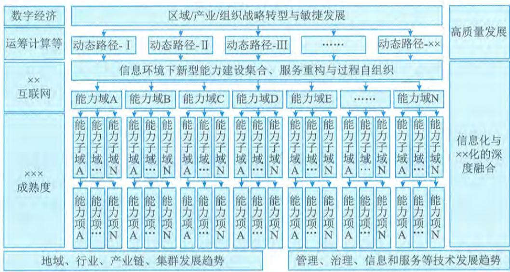  
图1-11 数字组织运行参考框架

1）能力因子定义和数字化“封装”

实施数字化转型，组织需要把各项能力和活动进行清晰的结构化并定义，形成细化的可灵活调度和编排的能力因子，这些能力因子是有层次或可组合的，如能力域、能力子域、能力项、能力分项、能力子项等，对于数字化转型不同成熟度的组织来说，主要体现在能力因子定义颗粒度、学科性和有效性等方面。

能力因子的定义可驱动组织的管理精细化，更重要的是能够实现对这些能力因子的数字化“封装”，这种封装不只是对业务流程、工艺过程和技术内容的“包装”，而是需要向具体活动的人员、技术（含内部控制等）、资源、数据、流程（过程和动作）的模块化“封装”，打造基于数据的标准化输入与输出，形成类似信息化系统中的对象、类、模块等组件。在工业类组织中体现为数字装备、数字化管理单元、数字产品等，目的是实现“智能  $^+$  ”。

2）基于“互联网  $^+$  ”的调度和决策

实施数字化转型，组织需要在既有治理与管理体系、工艺体系、服务体系、产品体系的基础上，通过使用“互联网  $^+$  ”的模式，将组织沉淀的各类知识经验进行数字化提炼，形成数字算法、模型和框架等，满足信息系统能够理解和使用的方式，让调度和决策脱离“自然人”，从而提高调度和决策效率及其科学性。这部分工作是数字化转型中一项持续性工作，其科技含量比较高，也是组织数字化转型中的难点，主要体现在：

- 业务融合。将知识经验形成数字化调用模式，需要业务和信息技术的充分融合，需要实施这些工作的业务人员，具备一定的数字技能，或者信息技术人员能够深入理解业务。- 持续坚持。通过数字模式开展决策与调度活动，其开始时的效果、效率、效能并不一定理想，这就需要组织能够持续坚持，通过持续改进活动，提升数据模式的价值。- 文化冲突。调度与决策的科学化、敏捷化，依赖组织的知识沉淀，这就需要组织解决文化冲突，引导组织成员适应数字化带来的各种变化，积极贡献知识经验，消除自我成长顾虑以及驾驭数字的“恐惧”等。- 效果判别。通常情况下，治理和管理更加注重判断和决策的正确性，执行操作关注过程的精确性，而使用数字模式实施决策和调度时，其精确性被凸显出来，对决策和调度的数据及应用过程提出了更高的要求，需要组织投入更多的智力资源。

# 3）转型控制

数字化转型往往不是指一个结果的表达，而是一个持续的过程，组织需要能够有效地管控转型的过程，无论是服务组织还是工业组织，都不能一蹴而就地完成该项转型升级。组织需要充分借鉴信息化与工业化、信息化与领域现代化等深度融合的最佳实践，结合自身的实际情况，持续建设、优化和改进数字化转型过程。

# 3.智慧转移

数字化转型基本原理揭示了个体智慧（知识、技能和经验等）由“自然人”个体，转移到组织智慧（计算机、信息系统等掌握的）的必要性和重要性。这种“智慧转移”也称“智慧移植”，需要经历一系列的过程才能完成，每个组织开展此类活动的模式与方法存在差异，也可以参考图1- 12所示的“智慧转移”模型。

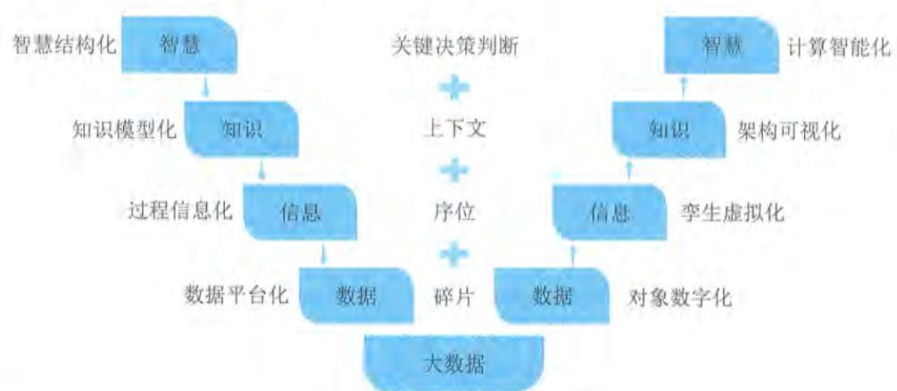  
图1-12 智慧转移的S8D模型

DIKW模型很好地诠释了数据（Data）、信息（Information）、知识（Knowledge）和智慧（Wisdom）之间的关系，并揭示了他们的转化过程与方法。S8D模型就是基于DIKM模型，构筑了“智慧—数据”“数据—智慧”两大过程的8个转化活动。

1）“智慧—数据”过程

该过程通常指信息系统规划、建设、运行过程，也就是传统讲的信息化过程。该过程： $①$  通过智慧结构化明确了业务体系层面方面的内容； $②$  通过知识模型化定义业务活动的逻辑关系； $③$  通过过程信息化（管理和工艺流程化）明确各执行操作系列要求； $④$  通过数据平台化实现了数据的采集、存储和共享等。

2）“数据—智慧”过程

该过程通常指数据的开发利用和资源管理的过程，也就是人们常说的智慧化过程，重点解决基于各类组织组成对象（人员、流程、业务、工艺、装备等）“数字关系”的“脑力替代”。该过程在大数据“筑底”后，多元化数据能够被开发利用： $①$  通过对象数字化实现对各类对象的数字化表达； $②$  通过孪生虚拟化完成物理对象到信息空间的映射； $③$  通过架构可视化实现业务知识模型与经验沉淀的复用和创新； $④$  通过计算智能化实现多元条件下的调度和决策。

数据是筑底构建可计算智慧的关键，通过“智慧—数据”过程将人类智慧形成了数据表达，并通过数据流动，提高了组织业务与工作效能，实现“体力劳动替代”。接下来通过“数据—智慧”工程，在大数据的基础上，逆变数据为计算智能，完成了智慧载体由自然人到计算机和信息系统的转移，其价值不仅仅可实现智慧的在线时效（ $7 \times 24$  无休），更可以实现“智慧挤压”（多方法多维度综合判断）和更高级别的“智慧萃取”（新智慧的生成），进一步可以实现智慧的可复制。这一过程也是第四科学范式的基本框架，是第四次科技革命的触发逻辑。

# 4. 持续迭代

组织数字化转型需要在能力因子不断细化的基础上，针对能力因子的数字化转型实施迭代，可类比为整体数字化转型与局部数字转型的关系。组织每个能力因子数字化“封装”的持续迭代主要包含四项活动，即：信息物理世界（也称数字孪生，CPS）建设、决策能力边际化（Power

to Edge, PtoE) 部署、科学社会物理赛博机制 (Cyber- Physical- Social Systems, CPSS) 构筑、数字框架与信息调制 (Digital Frame and Information Modulation, DFIM) 设计, 如图 1- 13 所示。针对能力因子的持续迭代可以从任何一项活动开始实施四项活动, 形成持续迭代闭环。

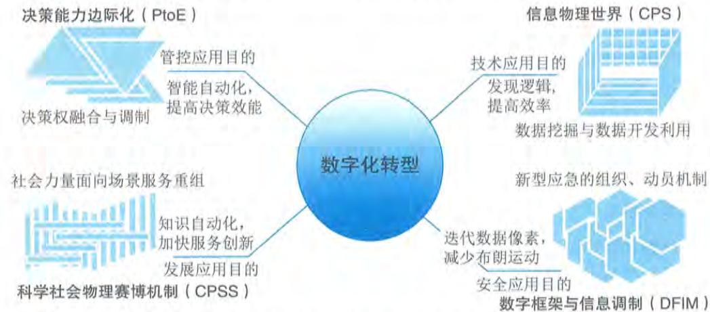  
图1-13 组织能力数字化转型及持续迭代参考模型（CPSD模型）

# 1）信息物理世界建设

针对能力因子中的各类对象, 实施数字孪生建设, 并在此基础上加入该因子与其他因子之间的配置关系。组织可以通过该项活动实现能力因子相关数据挖掘与数据开发利用, 从而发现新的技术和逻辑, 提升各项工作效率。

# 2）决策能力边际化部署

决策能力边际化是指处置执行层面的装置和人员能够基于决策算法模型等, 敏捷获得更高的决策能力（权), 达到敏捷响应的效果。组织可以通过该项活动实现决策权融合与调制, 达到装备智能化和提高决策效能的价值效果。

# 3）科学物理赛博机制构筑

科学物理赛博机制设计是在CPS的基础上, 汇聚组织内能力因子的环境因素力量（或组织维度的外部社会力量), 建设高密度数据框架, 参照社会运行原理, 封装、解构和重构各能力因子协同关系。组织可以通过该项活动实现对各能力因子的灵活组合机制, 形成能够面对各类需求的动态调度能力。

# 4）数字框架与信息调制设计

组织能力因子的数字密度越高, 对其可控性就越高, 对应的安全可靠性也越高。组织通过优化能力因子的数字框架模型, 提升数据采集获取的精准度和及时性, 能够有效地提升组织对能力因子的应急与动员能力, 从而具备更加可靠的已知风险管控能力和未知风险的应对能力。

# 1.5.2 元宇宙

元宇宙 (Metaverse) 是一个新兴概念, 是一大批技术的集成。北京大学刚刚教授对元宇宙

的定义是:元宇宙是利用科技手段进行链接与创造的,与现实世界映射与交互的虚拟世界,具备新型社会体系的数字生活空间。清华大学沈阳教授对元宇宙的定义是:元宇宙是整合多种新技术而产生的新型虚实相融的互联网应用和社会形态,它基于扩展现实技术提供沉浸式体验,以及数字孪生技术生成现实世界的镜像,通过区块链技术搭建经济体系,将虚拟世界与现实世界在经济系统、社交系统、身份系统上密切融合,并且允许每个用户进行内容生产和编辑。

中国社会科学院学者左鹏飞从时空性、真实性、独立性、连接性四个方面去交叉定义元宇宙。他指出:从时空性来看,元宇宙是一个空间维度上虚拟而时间维度上真实的数字世界;从真实性来看,元宇宙中既有现实世界的数字化复制物,也有虚拟世界的创造物;从独立性来看,元宇宙是一个与外部真实世界既紧密相连,又高度独立的平行空间;从连接性来看,元宇宙是一个把网络、硬件终端和用户囊括进来的一个永续的、广覆盖的虚拟现实系统。

# 1. 主要特征

随着虚拟现实、人工智能、数字孪生、云计算等关键技术逐步迭代发展,用户对更沉浸的虚拟世界有了更深入、更丰富的需求。元宇宙的流行是互联网发展到了一定的高度,也可以认为其是互联网发展的另一阶段。元宇宙的主要特征包括:

- 沉浸式体验。元宇宙的发展主要基于人们对互联网体验的需求,这种体验就是即时信息基础上的沉浸式体验。

- 虚拟身份。人们已经拥有大量的互联网账号,未来人们在元宇宙中,随着账号内涵和外延的进一步丰富,将会发展成为一个或若干个数字身份,这种身份就是数字世界的一个或一组角色。

- 虚拟经济。虚拟身份的存在就促使元宇宙具备了开展虚拟社会活动的能力,而这些活动需要一定的经济模式展开,即虚拟经济。

- 虚拟社会治理。元宇宙中的经济与社会活动也需要一定的法律法规和规则的约束,就像现实世界一样,元宇宙也需要社区化的社会治理。

总之,元宇宙作为现实世界的孪生空间和虚拟世界,其物理属性淡化,但社会属性会被强化,人们在现实社会中的大量特征和活动,都逐渐会在元宇宙中体现出来。

# 2. 发展演进

元宇宙作为多技术的集成融合和现实世界虚拟化,其发展一方面受到各类技术创新、发展和演进的影响,另一方面受经济与社会发展进程的约束。从互联网发展的基本规律和数字化转型进程来看,元宇宙首先会在社交、娱乐和文化领域发展,形成虚拟"数字人",再逐步向虚拟身份方向演进,形成"数字人生",此时的元宇宙偏向个体用户需求。但随着元宇宙中虚拟经济的发展和现实中各类组织数字化转型的深入,元宇宙向"数字组织"领域延伸,从而影响现实世界的经济与社会发展整体数字化转型升级,形成"数字生态"。之后伴随相关法律法规、标准规范的生成,网信事业的发展以及网络文明的进一步完善,元宇宙的虚拟世界形态中持续迭代,形成"数字社会治理",实现物理空间、社会空间和信息空间三元空间的协同发展新格局。

# 1.6 本章练习

# 1.选择题

（1）关于信息的特征，不正确的是

A.客观性、普遍性、无限性、动态性、相对性、不可存储性B.依附性、变换性、传递性、层次性、系统性、转化性C.相对性、依附性、变换性、传递性、层次性、转化性D.动态性、相对性、依附性、变换性、传递性、层次性

参考答案：A

(2) 是信息的基础。

A.数据 
B.知识 
C.事实 
D.概念

参考答案：A

（3）智能制造能力要素包括：

A.人员、技术、生产、资金 
B.工艺、产品、销售、服务C.采购、计划、调度、生产 
D.人员、技术、资源、制造

参考答案：D

（4） 不是数字政府建设的关键词。

A.共享 
B.互通 
C.便利 
D.交易

参考答案：D

（5） 不是数字生活的主要体现。

A.生活工具的数字化 
B.生活质量数字化C.生活内容数字化 
D.生活方式数字化

参考答案：B

# 2.思考题

（1）请阐述数字政府建设的主要特征、内容和能力体系。

参考答案：略

（2）请简述工业现代化的主要创新重点。

参考答案：略