# 第3章 信息技术服务

信息技术服务（Information Technology Service，IT服务）通常是指供方为需方提供如何开发、应用信息技术的服务，以及供方以信息技术为手段提供支持需方业务活动的服务。在新时代，IT服务持续融合创新的环境下，IT服务突破了单纯的供方为需方提供服务的限制，IT服务的内涵定义为：组织为达成用户期望的结果，利用信息技术为用户交付价值的活动。

IT服务是随着信息技术的发展和信息技术在各行业的深入应用而产生的一种新兴业态，是数字经济的重要内容之一，是现代信息服务业的重要组成部分。IT服务是信息技术与服务的结合，既具有服务的特征，又具有信息技术的独特特征。

# 3.1 内涵与外延

3.1 内涵与外延随着网络的快速发展，包括互联网的泛化以及数据要素的驱使等，使其上的应用能够通过多种终端与个人紧密结合，创造和改变了众多组织及个人的应用习惯和业务模式等，为服务提供了新的实现手段，也赋予了服务更多的内涵，除软硬件技术支持服务、服务外包、IT咨询、IT培训等服务外，以新媒体、社交网络、数据开发等为代表的新领域开始蓬勃发展，IT服务走向多元化发展模式，深度影响产业经济发展和社会治理改革等。

# 3.1.1 服务的特征

服务是一种通过提供必要的手段和方法，满足服务接受者需求的“过程”，其外延是指具备服务本质的一切服务，例如餐饮服务、零售服务、IT服务等。服务的特征包括：无形性、不可分离性、可变性和不可储存性等。

（1）无形性。无形性指服务在很大程度上是抽象的和无形的。需方在购买之前一般无法看到、感觉到或触摸到，例如理发、听音乐会、到海边度假等。这一特性使得服务不容易向需方展示或沟通交流，因此需方难以评估其质量。

（2）不可分离性。不可分离性又叫同步性，指生产和消费是同时进行的，如照相、理发等。这一特性表明，需方只有参与到服务的生产过程中才能享受到服务。这一特性决定了服务质量管理对服务供方的重要性，其服务的态度和水平直接决定了需方对该项服务的满意度。因此，服务人员的筛选、培训和报酬标准等，对实现高标准的服务质量至关重要。

（3）可变性。可变性也叫异质性，指服务的质量水平会受到相当多因素的影响，因此会经常变化。服务以人为中心，由于人与人的文化、修养、技术水平等存在差异，同一服务的品质会因操作者不同而不同；即使是同一操作者，由于时间、地点与心态的变化，服务质量也会随之变化。

（4）不可储存性。不可储存性也叫易逝性、易消失性，指服务无法被储藏起来以备将来使用、转售、延时体验或退货等。

# 3.1.2 IT服务的内涵

按照国务院发展研究中心的相关研究成果定义,信息服务包括信息传输服务、IT服务和信息内容服务。在国家统计局最新修订的《国民经济行业分类》(GB/T4754)中,已将IT服务划分为一个国民经济行业大类。在中国经济增长方式转变,产业结构优化升级,IT应用不断深化,特别是在数字中国、数字经济、数字政府、数字化转型等的背景下,IT服务新业态与技术创新不断涌现(如车联网、工业互联网、自媒体等),为IT服务业发展带来更多新的机遇和挑战。IT服务除了具备服务的基本特征,还具备本质特征、形态特征、过程特征、阶段特征、效益特征、内部关联性特征、外部关联性特征等方面的内涵。

(1)本质特征。IT服务的组成要素包括人员、过程、技术和资源。就IT服务而言,通常情况下是由具备匹配的知识、技能和经验的人员,合理运用资源,并通过规定过程向需方提供IT服务。

(2)形态特征。常见服务形态有IT咨询服务、设计与开发服务、信息系统集成服务、数据处理和运营服务、智能化服务及其他IT服务等。

(3)过程特征。IT服务从项目级、组织级、量化管理级、数字化运营等逐步发展,是从计算机单机应用、网络应用、综合管理的逐步提升,具有连续不断和可持续发展的特征。

(4)阶段特征。由于IT的发展永无止境,信息基础设施和经济、市场环境的变迁,IT服务也无终极目标。IT服务是全方位的,无论需方还是供方都需要根据自身需要抓重点。分层次、分阶段地推进IT服务,提高IT的有效利用。

(5)效益特征。IT服务的发展不同于以往对产品的技术改造,其效益的概念完全不同。通过对产品生产线的技术改造,提高质量、增加产能,其效果往往是单方面的,且容易显现。而IT服务的发展是服务系统进行深度开发和广泛利用,从整体上提高组织核心竞争力和管理水平,其效益是多方面的。

(6)内部关联性特征。IT服务不仅依赖于技术创新,更依赖于业务模式创新。保持技术创新和业务模式创新的相互促进、有机融合,实现IT服务人才结构优化,建立IT服务管理规范,将从机制上为IT服务的发展创造条件。

(7)外部关联性特征。IT服务依赖于国民经济和良性竞争的市场环境的形成,依赖于社会信息网络的不断进步,依赖于政府相应的政策支撑、配套人才的培养和产业链上下游组织IT应用的逐渐完善。

# 3.1.3 IT服务的外延

在各行业加速数字化转型的形势下,随着新一代信息技术的快速发展和应用,IT服务的外延得到很大的拓展。新形势下,IT服务包括基础服务、技术创新服务、数字化转型服务等。

(1)基础服务。基础服务指面向IT的基础类服务,主要包括咨询设计、开发服务、集成实施、运行维护、云服务和数据中心等。

(2)技术创新服务。技术创新服务指面向新技术加持下的新业态新模式的服务,主要包含智能化服务、数字服务、数字内容处理服务和区块链服务等。

(3)数字化转型服务。数字化转型服务指支撑和服务组织数字化服务开展和创新融合业务发展的服务,主要包括数字化转型成熟度推进服务、评估评价服务、数字化监测预警服务等。

(4) 业务融合服务。业务融合服务指信息技术及其服务与各行业融合的服务,如面向政务、广电、教育、应急、业财等行业。

# 3.1.4 IT服务业的特征

IT服务业具有高知识和高技术含量、高集群性、服务过程的交互性、服务的非独立性、知识密集性、产业内部呈金字塔分布、法律和契约的强依赖性以及声誉机制等特征。

(1) 高知识和高技术含量。IT服务业的提供者是生产过程中的专家组,多以技术资本、知识资本、人力资本为主要投入,产出中有密集的知识要素,因此IT服务业把日益专业化的技术、知识加入服务过程中,具有人力资源、技术、知识密集的特点。IT服务业需要向需方转移高度专业化的知识,这是其区别于其他服务业的一个显著特征。

(2) 高集群性。IT服务业在其空间上具有很高的集群性。IT服务业的出现和发展都集中在大型中心城市。其中,中心城市具有及时准确的宏观政策、完善的基础设施、高智力的人力资源及发达的人力资源市场,这些因素为IT服务业发展提供了良好的条件。

(3) 服务过程的交互性。需方参与服务过程,IT服务业不仅提供显性知识,还提供隐性知识,要实现隐性知识的传播需要通过专业人员与需方间进行大量的互动过程才能完成。

(4) 服务的非独立性。IT服务业提供的是满足需方需求的解决方案,往往涉及多个领域的知识,许多IT服务业与高等院校、科研机构形成联盟,相互合作。因此除了自身具备的知识技术外,IT服务业会将其他行业机构的技术与成果进行整合,这是IT服务业比较突出的特征。

(5) 知识密集性。IT服务提供过程中的交互活动依赖个人的专业知识,因此,个人知识成为IT服务业的关键性资源,IT服务业间的竞争更多是人才竞争。没有高素质人才,IT服务业就成了无本之木。IT服务业的从业人员需要具备完整的知识结构、丰富的专业知识和实践经验,方能满足需方的需求,帮助需方制定与实施完善的、适宜的解决方案。

(6) 产业内部呈金字塔分布。IT服务产品差异性比较大,具有资金需求小、成本低、标准化程度不足等特点,因此进入壁垒相对较低。现代服务业内部结构呈金字塔分布,存在少数大型的组织和多数小型的组织。

(7) 法律和契约的强依赖性。IT服务业在提供服务的供方与接受服务的需方间主要以签订服务协议或者契约的形式来确定相关服务事项,从而在双方间形成一种委托代理关系。因此,IT服务业与法律和契约之间具有较强的依赖关系。

(8) 声誉机制。IT服务业的生产和消费,由于空间和时间上的不可分性,使接受服务的需方事先无法观察到服务的质量,因此需方主要根据供方的声誉来确定对服务的支付意愿。反映供方声誉和质量的证明是决定选取和使用方面的重要因素,因此声誉机制对IT服务业的服务业务发展起着决定性作用。

# 3.2 原理与组成

2009年在工业和信息化部软件服务业司的指导下,我国组建了IT服务标准工作组,全面推动国家IT服务标准建设,形成了IT服务标准库(Information Technology Service Standards,

ITSS)。ITSS 是一套体系化 IT 服务标准库, 全面规范了 IT 服务产品及其组成要素, 是我国 IT 服务最佳实践的总结和提升, 也是我国从事 IT 服务开发、供应、推广和应用各类组织创新成果的固化。经过十多年的持续建设, ITSS 已经发布了包含国家标准、行业标准和社团标准等在内的百余项标准, 是我国标准化和可信赖 IT 服务的主要指导依据。

# 3.2.1 IT服务原理

ITSS 给出了 IT 服务的基本原理, 由能力要素、生存周期要素、管理要素组成, 如图 3- 1 所示。能力要素由人员 (People)、过程 (Process)、技术 (Technology) 和资源 (Resource) 组成, 简称 PPTR。IT 服务生命周期由四个阶段组成, 分别是战略规划 (Strategy&planning)、设计实现 (Design&implementation)、运营提升 (Operation&promotion)、退役终止 (Retirement&termination), 简称为 SDOR。为了保证每个生命周期阶段及其过程的实施, 需要通过监督提供保障, 通过管理提供支撑。

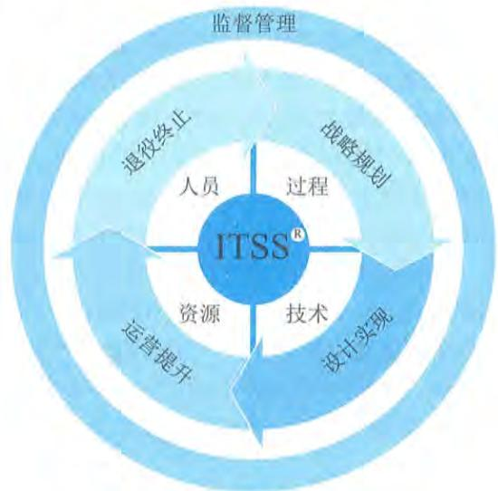  
图 3-1 ITSS 基本原理

# 3.2.2 组成要素

ITSS 定义了 IT 服务由人员、过程、技术和资源组成, 并对这些服务的组成要素进行标准化。另外, 就 IT 服务而言, 通常情况下是由具备匹配的知识、技能和经验的人员, 合理运用资源, 并通过规定的过程向需方提供服务。

# 1. 人员

人员是指 IT 服务生命周期中各类满足要求的人才的总称, ITSS 规定了提供 IT 服务的各类人员应具备的知识、经验和技能要求, 目的是指导 IT 服务提供商根据岗位职责和管理要求“正确选人”。

一般而言, 针对咨询设计、集成实施、运行维护和运营等典型的 IT 服务, 所需要的人员包

括项目经理（如系统集成项目经理、服务项目经理）、系统分析师、架构设计师、系统集成工程师、信息安全工程师、系统评测工程师、服务工程师、服务定价师、客户经理和日常服务人员等，如图3- 2所示。

图例：

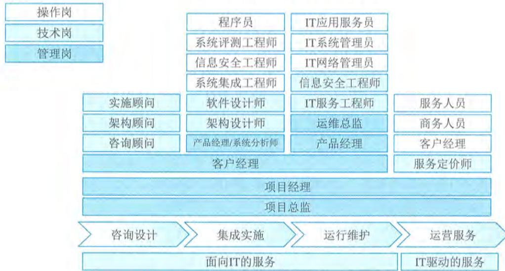  
图3-2 IT服务所需要的人员

目前，针对IT服务人员，使得服务供方常面临如下挑战：

- 人员知识、技能和经验评估难；- 不同人员交付同一服务的质量不一致；- 人才流动率高，很难建设稳定的服务团队；- 人才招聘难，很难形成合理的人力资源池；- 人员专业化的必要性；- 有助于建立与服务发展相适应的人才队伍，保障服务工作的连续性和稳定性；- 有助于改进和完善人才培养模式，提高人才培养质量；- 有助于优化人力资源管理，提高管理效率和降低管理成本。

# 2.过程

过程是通过合理利用必要的资源，将输入转化为输出的一组相互关联和结构化的活动，是提高管理水平和确保服务质量的关键要素。ITSS根据咨询设计、集成实施、运行维护等各种类型的IT服务，规定了应建立的过程和各个过程应实现的关键绩效指标（KPI），确保供方能“正确做事”。通过按照ITSS要求建立简洁、高效和协调的过程，能有效地将人员、技术和资源要素连接起来，指导服务人员按规定的方式方法正确地做事。

过程作为IT服务的核心要素之一，有明确的目标，可重复和可度量。各类IT服务的典型过程如图3- 3所示。

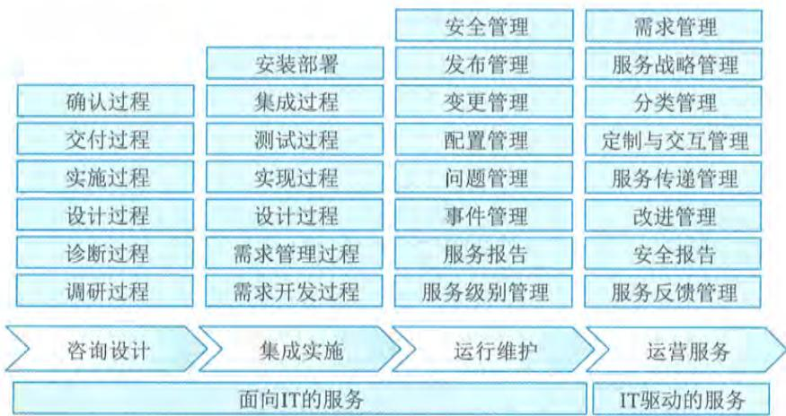  
图3-3 各类IT服务的典型过程

对各类IT服务组织来说，过程要素所面临的挑战主要包括以下几个方面：

对各类IT服务组织来说，过程要素所面临的挑战主要包括以下几个方面：- 过程没有明确定义，完全按照操作人员的个人习惯执行；- 过程定义不清晰，不具备按照过程管理思路执行的价值；- 过程定义太复杂，执行效率严重下降甚至影响运营；- 没有明确的过程目标，操作人员不清楚每一项活动应该做到什么；- 对过程没有监督，不清楚过程的稳定性；- 对过程没有考核，不能得到持续改进。过程规范化的必要性主要包括以下几个方面：- 确保过程可重复和可度量；- 有效控制因未明确定义而引发的潜在风险；- 通过对过程进行评价和度量，可持续提升过程的效率；- 通过过程实现规范化管理，可持续提高服务质量；- 通过规范化的过程管理，提高效率，减少人员和成本的投入。

# 3.技术

技术是指交付满足质量要求的IT服务应使用的技术或应具备的技术能力，以及提供IT服务所必须的分析方法、架构和步骤。技术要素确保IT服务供方能“高效做事”，是提高IT服务质量方面重点考虑的要素，主要通过自有核心技术的研发和非自有核心技术的学习借鉴，持续提升提供服务过程中发现问题和解决问题的能力。

在提供服务过程中，可能面临各种问题、风险以及新技术和前沿技术应用所提出的新要求，供方应根据需方要求或技术发展趋势，具备发现和解决问题、风险控制、技术储备以及研发、应用新技术和前沿技术的能力。针对咨询设计、集成实施、运行维护等IT服务，常用的技术如图3- 4所示。

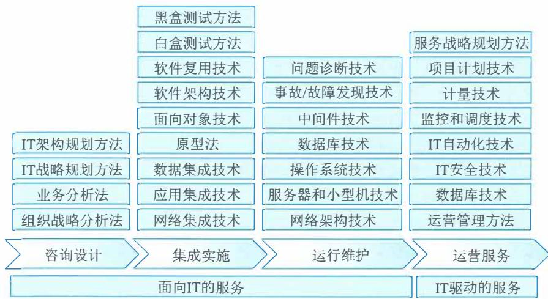  
图3-4 IT服务常用的技术

对服务供需双方来说，技术要素所面临的挑战主要包括：

对服务供需双方来说，技术要素所面临的挑战主要包括：- 为满足组织的目标和需求，组织对IT技术的依赖程度越来越高；- 激烈的市场竞争使得组织对技术的要求越来越高；- 低成本、高效率的服务需求，对组织的技术研发和使用能力提出了更高的要求。技术体系化的必要性主要体现在以下几个方面：- 提高服务质量，降低服务成本；- 减少人员流失带来的损失；- 及时应用和推广成熟技术；- 做好新技术的研发和储备；- 在提供服务中使用一致的技术标准。

# 4.资源

资源是指提供IT服务所依存和产生的有形及无形资产，如咨询服务供方为满足需方的需求，提供咨询服务所必须具备的知识、经验和工具等。资源要素确保供方能“保障做事”，主要由人员、过程和技术要素中被固化的成果和能力转化而成，同时又对人员、过程和技术要素提供有力的支撑和保障。

根据所提供的IT服务类型的不同，所需要的资源也不尽相同，但可以对其进行汇总。例如，咨询设计服务和IT运维服务所使用的资源包括知识库、工具库、专家库、备件库和服务台。常见的IT服务资源如图3- 5所示。

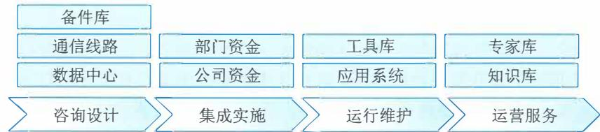  
图3-5 常见的IT服务资源

对于各类服务组织来说，资源要素所面临的挑战主要包括：

对于各类服务组织来说，资源要素所面临的挑战主要包括：- 忽略资源的价值，投入不够，导致资源不足；- 对资源的使用不重视，重复投资现象严重；- 缺乏利用资源的统一规划，资源的利用率不高；- 资源的更新不及时，与需求、技术研发脱节。资源系统化的必要性主要体现在以下几个方面：- 统筹资源开发利用，确保与运营、技术研发协调一致；- 确保提供满足质量和成本要求的服务；- 明确各类资源管理的要点，提高资源使用率；- 结合服务发展需求，确保能及时更新资源，提高资源的使用率和使用质量。

# 3.3 服务生命周期

3.3 服务生命周期IT服务生存周期是指IT服务从战略规划、设计实现、运营提升到退役终止的演变，如图3- 6所示。IT服务生命周期的引入，改变了IT服务在不同阶段相互割裂、独立实施的局面。同时，通过连贯的逻辑体系，以战略规划为指引，设计实现为准绳，通过服务运营实现价值转化，直至服务的退役终止。同时伴随着监督管理的不断完善，将服务中的不同阶段的不同过程有机整合为一个井然有序、良性循环的整体，使服务质量得以不断改进和提升。

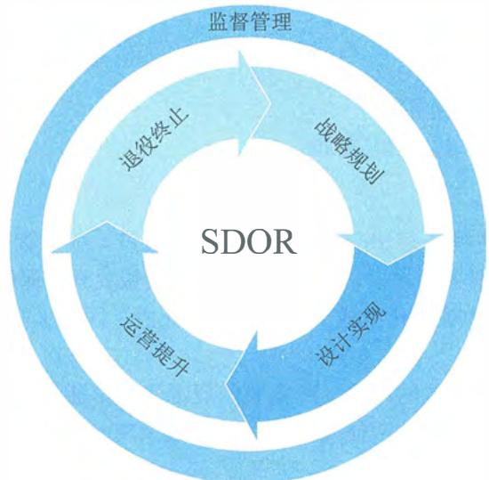  
图3-6 ITSS定义的IT服务生命周期

（1）战略规划。战略规划是指从组织战略出发，以需求为中心，参照ITSS对IT服务进行战略规划，为IT服务的设计实现做好准备，以确保提供满足供需双方需求的IT服务。（2）设计实现。设计实现是指依据战略规划，定义IT服务的体系结构、组成要素、要素特征以及要素之间的关联关系，建立管理体系、部署专用工具以及服务解决方案。

(3) 运营提升。运营提升是指根据服务实现情况, 采用过程方法实现业务运营与 IT 服务运营相融合, 评审 IT 服务满足业务运营的情况以及自身缺陷, 提出优化提升策略和方案, 对 IT 服务进行进一步的规划。

(4) 退役终止。退役终止是指对趋近于退役期的 IT 服务进行残余价值分析, 规划新的 IT 服务部分或全部替换原有的 IT 服务, 对没有可利用价值的 IT 服务停止使用。

IT 服务的相关方在 IT 服务生命周期的各个阶段设定服务目标, 在服务质量、运营效率和业务连续性方面不断改进和提升, 并能够有效识别、选择和优化服务的有效性, 提高绩效, 为组织做出更优的决策提供指导。

# 3.3.1 战略规划

战略规划是从业务战略出发, 以需求为中心, 对 IT 服务进行全面系统的战略规划, 为服务的设计实现做好准备, 以确保提供满足需求的服务。战略规划阶段需要根据组织业务战略、运营模式及业务流程的特点, 确定所需要的服务组件和关键要素, 对组织结构及团队建设、管理过程、技术需求及开发、资源等进行全面系统的规划。

# 1. 规划活动

服务战略规划是组织整个 IT 服务发展和能力体系建设的首要之事。在该阶段, 需要考虑服务目录、组织架构和管理体系、指标体系和服务保障体系, 以及内部评估机制等。

(1) 基于组织的 IT 服务发展目标和业务规划, 确保可以提供良好稳定的 IT 服务, 可以结合自身业务能力、客户需求以及内外部环境策划服务目录。服务目录定义了服务供方所提供服务的全部种类以及服务目标, 这些服务包括正在提供的和能够提供的内容。

(2) 需规划如何建立相应的组织架构和服务保障体系来支持服务目录所列出服务内容的实施。组织架构与提供的服务内容密切相关, 不同的组织架构在管控、成本、创新和效能方面存在巨大差异, 需要根据组织总体战略目标和组织治理架构确立, 组织架构稳定的周期相对较长, 不会频繁调动, 这就需要确保一定时期内对 IT 服务能力的支撑情况。通常可以通过两种方式实现: 一是在定义服务内容的时候, 参照了组织当前的组织结构; 二是根据业务目标确定服务内容以后, 设立或优化组织当前的组织架构。

(3) 在适合的组织架构基础上, 组织需要根据总体的治理理念和思想, 确定必要的制度保障, 固化对 IT 服务保障能力。这里的制度体系包括组织级的制度, 如质量、财务、安全、职业健康、人力资源、商务等; 也要包括 IT 服务本身的制度, 如行为规范、数据质量等。对人员、资源、技术和过程四要素所涉及的策划内容, 也应包含在服务保障体系之中。同时, 结合组织整体的质量管理要求, 应建立 IT 服务能力审核、监督和检查计划。

(4) 对于任何 IT 服务, 服务绩效都可以通过绩效指标来衡量, 通过制定服务指标体系, 作为衡量 IT 服务实施的绩效, 检查供方是否达到目标。建立服务指标体系, 大致可以包括:

- 制定各项 IT 服务目标, 如质量目标、过程目标、能力目标和财务目标等;

- 制定目标实施的检查机制 (包括评估、检查、报告、测量等方法) 并测量其有效性, 注意必要时需要对目标进行变更;

- 制定服务实施结果的测量指标, 例如与目标的偏离度、客户满意度调查等可以适当地考虑相关的测量、评估工具。

战略规划阶段的关键成功因素主要包括:

- 确保全面考虑业务战略、团队建设、管理过程、技术研发、资源储备的战略规划;

- 确保战略规划的内容和结果得到决策层、管理层的承诺和支持;

- 确保战略规划的内容和结果得到相关干系人的理解和支持;

- 对战略规划的内容和结果进行测量、分析、评审和改进。

如果组织未进行有效的战略规划, 那么仓促而就的 IT 服务难以满足组织业务发展和满足客户的真正需求, 很可能造成服务质量低下、IT 服务可用性低、预算超支或 IT 系统功能丧失等。

# 2. 规划报告

战略规划报告是战略规划阶段的核心成果之一, 主要针对已确定的服务目录、服务级别和业务需求来确立相应的组织架构、服务保障体系和能力要素建设等, 进而保持相应的业务能力、IT 服务能力和资源能力, 确保实际的 IT 服务能够满足服务目录和服务级别的要求, 保证在总体战略指导下有计划性地组织、建设、调整和配比各项能力, 满足当前和未来的 IT 服务需求。

战略规划报告的目标主要包括:

- 确保经过业务需求和成本合理分析的 IT 服务能力管理;

- 确保战略规划和实施在要求时间内满足当前和将来 IT 服务的需求, 避免因为资源能力缺乏、发展预期产生的技术以及人员准备不足等而造成的突发事件;

- 识别需要监测的 IT 服务内容, 定义监测方法和可测量的能力指标;

- 保证能够及时识别服务能力的不足, 并且及时设计并采取相应的纠正措施弥补不足;

- 采集能力数据, 对资源的能力参数进行监控, 产生监控数据记录和报告;

- 定期生成战略实施报告, 对能力监控数据进行总结和评估;

- 对服务战略定期进行检查评审、维护和改进, 不断提高 IT 服务质量和效能水平, 并调整以适应不断发展的 IT 服务能力需求。

战略规划报告的确立、发布和实施常遵循的原则主要包括:

- 必须遵从政策法规的要求, 满足相应的法规和过程、技术标准、行业规范以及指导组织意见;

- 关键业务优先级原则, 有限的能力要素必须保证关键业务过程的支持和恢复;

- 风险管理原则, 树立风险无处不在的意识, 有效地分析和管理风险;

- 面向体系化的管理原则, 制定和实施完善的能力管理, 并遵从过程进行活动和管理;

- 质量管理原则, 遵循计划、实施、检查、改进的质量管理周期过程;

- 成本合理原则, 能力要素总是有限的, 尤其对于能力管理, 更要考虑做到成本和能力的平衡、需求与提供之间的平衡;

- 战略规划过程中, 组织治理、运维交付、质量管理、人力资源管理、技术研发等部门应共同参与。

服务战略应涵盖方面主要包括：

- IT服务的整体战略、发展方针以及阶段性目标策划；- 对需方的需求预测；- 对于人员、资源、技术和过程的能力进行预测和规划；- 对现有服务人员、资源、技术、过程能力进行评估、优化、改进和计划性储备；- 规定定期形成能力监控和分析报告；- 对外部服务能力进行规划以及对将来需求的预测；- 规定监控对外部提供服务的实施能力及其SLA达成能力等参数；- 依据服务战略及标准的要求建立相适应的指标体系；- 依据服务战略及标准的要求建立计划和指标体系的考核方法及考核准则；- 规定IT服务能力管理的管理指标、考核体系和配套的管理制度，具有明确的量化指标，包括人员绩效考评、服务项目管理考评、服务交付指标等方面；- 规定服务保障体系，具有服务保障制度、岗位设置和匹配岗位需求的人员技术能力。

# 3.3.2 设计实现

设计实现是在战略规划的基础上，采用过程方法来策划和实施服务设计，并基于健全的IT服务项目组织结构和规范化的项目管理，执行战略规划和服务设计所确定的方针、策略和方案，部署新的服务或变更的服务，包括落实新的组织结构、运行新的或变更后的管理体系、建设支撑服务运营的工具系统、提供有效的资源保障等。

# 1.服务设计

组织需要基于业务战略、运营模式及业务流程特点，设计与开发满足业务发展需求的服务，以确保服务提供及服务管理过程满足需方的需求，在进行服务设计的过程中，需要考虑的主要因素包括以下几个方面：

- 客户对IT服务的相关要求；- 基于信息服务分类（参考GB/T29264—2012）确定的管理方法；- 组织所确定的关于服务的关键要求；- 服务设计活动的特性、周期和复杂性；- 组织承诺遵守的标准或行业准则；- 所设计的IT服务的特性以及失败的潜在后果；- 客户和其他相关方对服务设计过程期望的控制程度；- 服务设计过程所需的内部和外部资源；- 设计过程中的组织方式，包括人员和各小组的职责和权限。

为确保服务设计活动有序且高效，组织需要对服务设计过程进行适当的控制，主要包括以下几个方面：

- 服务设计活动完成的结果是明确定义的，并且应便于后续服务的交接和提供，以及相关的监视和测量；

- 服务设计过程中遇到的问题必须在服务交付和运营之前得到有效处置;

- 遵循在战略规划所确定的服务设计准则和流程;

- 服务设计的输出结果满足相关的目标和约束条件;

- 在整个服务设计过程及后续任何对服务的变更设计中,保持适当的变更控制和配置管理。

服务设计的输出通常会形成文档化信息,主要包括:

- 服务的名称、适用范围和交付内容;

- 完成服务部署所需的组织方式;

- 对服务质量的度量指标或服务级别定义;

- 服务交付验收标准;

- 服务交付方式及交付物成果说明;

- 服务的计量和计费方式。

组织在服务设计过程中,需要注意识别和控制风险,主要包括:技术风险、管理风险、成本风险和不可预测风险等。

(1)技术风险。技术风险包括技术工具的确认、技术支持过程的确认、技术要求的变更、关键技术人员的变更等。

(2)管理风险。管理风险包括资源及预算是否到位、服务范围是否可控、服务边界是否清晰、服务内容是否充分满足需求、服务终止标准是否可衡量可达到等。

(3)成本风险。成本风险包括人力、技术、工具及设备、环境、服务管理等成本是否可控。

(4)不可预测风险。不可预测风险包括火灾、自然灾害、重大信息安全事件等。

# 2. 服务部署

服务部署是衔接服务设计与服务运营的中间活动。根据服务设计和可用于实施的服务设计方案,落实设计和开发服务,建立服务管理过程和制度规范并完成服务交付等。服务实施不仅可以对某一项目具体描述的服务需求进行部署实施,也可以对整体服务要求做相应的部署实施,将服务设计中的所有要素完整地导入组织环境,为服务运营打下基础。服务部署的主要内容和活动包括以下几个方面:

- 确定服务交付所需的组织结构、人员能力或资格、职责和权限;

- 确保所需资金、设备设施、信息资源和供方资源的可用性和连续性;

- 确定与组织内部和外部服务相关人沟通的过程并保持相关记录;

- 评价新的或变更的服务对IT服务管理体系的影响,确保IT服务管理体系的有效性;

- 必要时获得表述部署活动的操作程序或作业指导书;

- 建立部署计划,确保部署活动可被跟踪、验证,并且在必要的情况下可回退;

- 识别、记录与部署活动有关的预期偏差和风险,适宜时采取纠正措施;

- 确定可监视和测量的服务部署移交过程和要求,例如:文件信息移交、知识移交、技能移交、基线移交和模拟环境移交。

服务部署的目标是协调组织组成服务的所有组件,以及与之有关的其他个人、部门或组织,

在满足设计环节的要求和限制的前提下,在可接受的时间、成本和质量标准内,确保服务目标和服务需求在组织环境里得到满足;在部署实施期间,确保需方、IT终端用户及服务团队等各方面的满意度,服务目标和服务需求与需方的业务组织、业务流程顺利衔接,服务目标和服务需求实现以后是可以正常运转且可以被有效管理的,同时使需方对其有更明确的、合理的期望。通常情况下,部署实施可分为计划、启动、执行和交付四个阶段。组织制定的服务部署计划内容,通常包括以下几个方面:

组织制定的服务部署计划内容,通常包括以下几个方面:

- 服务部署的实施主体及相关方的责任和权限;

- 服务部署过程中的沟通机制,包括与相关方的沟通;

- 所需资金、设备设施、信息资源的可用性和连续性;

- 对服务部署过程中所需的组织结构、人员能力或资格有明确的要求;

- 服务部署的风险评估与应对措施;

- 服务部署成功的验证标准;

- 服务部署过程的实施内容,必要时获取表述部署活动的操作程序或作业指导书。

组织在服务部署过程中,需要注意识别和控制风险,主要包括:

- 评价新的或变更的服务对服务管理体系的影响,确保服务管理体系的有效性。

- 对新的或变更的服务进行评审,评审内容包括时间、地点、实施步骤、人员、技术、资源的安排,新的或变更的服务对现有服务提供的风险及风险应对措施,新的或变更的服务成功部署验证标准、失败的应对措施等。保持评价过程的相关记录。

- 制定标准部署活动的操作程序或作业指导书,可以被相关人员访问及使用。

- 识别、记录与部署活动有关的预期偏差和风险,包括新的或者变更的服务对现有服务、现有生产运营环境、相关干系人和部署实现目标等产生影响。

- 通过进行测试或者试运行,以减少过程风险和对生产运营环境的影响,如进行压力测试、用户测试、应急演练等。

- 对服务部署过程的风险评估并制定合理的应对措施,确保服务部署过程的完成。

服务部署的关键成功因素主要包括:

- 确定可度量的里程碑和交付物以及交付物的验收标准;

- 对服务资源的准确预测并确保资源的可用性和连续性;

- 管理和统一服务相关干系人的期望;

- 服务目标清晰;

- 形成标准操作程序或作业指导书。

# 3.3.3 运营提升

服务运营是根据服务部署情况,采用过程方法全面管理基础设施、服务过程、人员和业务连续性,实现业务运营与IT服务运营融合。服务运营阶段的内容包括业务运营和IT运营,对服务支持系统进行监控,识别、分类并报告服务支持系统的异常、缺陷和故障,以及对系统的运行使用提供支持。

从整个IT服务生命周期来看,服务运营阶段通常占服务整体生命周期的比重为  $80\%$  左右,

不仅影响组织的运行效率和效益,也影响需方对服务的感知及供需双方未来合作的连续性。服务运营阶段的目的是通过高效的业务关系管理、人员管理、过程管理、技术管理、质量管理以及信息安全管理等,提供优质、可靠、安全性高、需方满意度高的服务,实现需方与供方的双赢。服务运营的关键成功因素主要包括:

- 服务交付结果满足业务运营需求;

- 服务促进了需方业务价值的提升;

- 服务质量的一致性及标准化能力;

- 全面跟踪和理解需方需求变更;

- 具有有效运行的知识管理体系;

- 具有有效信息安全管理方法、手段和工具;

# 1. 运营活动

组织根据服务部署情况,全面管理服务运营的要素,持续监督与测量服务,控制服务的变更以及服务运营的风险,以确保服务的正常运行,相关活动主要包括:

- 根据服务部署的成果,持续实施管理活动,输出符合要求的服务;

- 建立正式的、非正式的沟通渠道,获取用户的反馈并保留相关记录文档;

- 持续控制服务范围、服务级别协议、关键里程碑、交付物要求等;

- 建立服务运营的投诉管理机制,包括投诉接收、处理、反馈及相关记录等;

- 建立服务交付成果及交付质量评价机制,并分析和记录;

- 与外部供方明确技术要求、资源要求、质量要求、交付时间要求等。

# 2. 要素管理

组织对主要人员、过程、技术、资源等服务运营相关要素进行持续管理。要素管理的相关活动主要包括:

- 根据岗位职责的要求完成人员细化管理并开展培训,通过绩效考核制度确保人员具备应有的能力;

- 采用适宜的手段对服务涉及的技术进行管理,包括前瞻性研究、知识显性化管理、自主研发或购买能提高服务效率或效果的工具、技术评估和优化等;

- 有效提供、配置、评估、优化和维护各类资源,确保资源的合理利用;

- 对服务过程实施监控、测量、评估和考核,并对服务过程产生的记录文件进行有效管理。

# 3. 监督与测量

组织需要对服务运营的目标和计划达成状况进行监督、测量、分析和评价。监督和测量的相关活动主要包括:

- 确定测量的方式、标准、频率、时间及地点;

- 采用适宜的手段监督服务的过程和结果,包括建立监督组织和岗位职责、建立服务相关阈值或基线,采用适宜的工具或手段采集数据,建立预警或提示机制,建立纠正措施的

启动机制等;

对测量结果进行分析,提出改进建议;

定期根据分析和改进成果评价服务。

# 4.风险控制

组织需要通过风险控制对服务运营做出正确的决策,实现服务运营的目标。风险控制的相关活动主要包括:

$\oplus$  识别服务运营中人员、资源、技术和过程的风险和机遇;

$\oplus$  识别可能导致服务中断的风险,制定应对措施,确保服务连续性;

$\oplus$  对服务运营中的风险采用必要的措施,降低对服务运营的影响;

$\oplus$  控制风险,对服务级别协议的完成情况进行监视,对不达标条款进行分析,提出解决方案,转移、回避或者接受风险。

# 3.3.4 退役终止

组织因某种因素制约,不再继续提供某项服务时,可进行服务终止操作,服务终止应及时通知需方及相关方,做好服务终止风险控制,处理好终止后的事务。

组织如果要终止服务,往往需要有书面的服务终止计划,其主要内容通常包括:

$\oplus$  终止适用的条件;

$\oplus$  终止的目标与成功要素;

$\oplus$  其他各方执行流程的控制;

$\oplus$  所有相关各方的角色与职责,如需方、外部供方和内部团队;

$\oplus$  约束、风险与问题;

$\oplus$  里程碑和交付物;

$\oplus$  活动分解和每个活动的描述;

$\oplus$  约定的服务终止与责任终止的完成标准;

$\oplus$  服务对需方不再有效的时间和服务终止的时间;

$\oplus$  要终止的服务和其他服务之间的接口将如何由其他服务处理;

$\oplus$  安排信息安全审查,包括敏感信息的删除等;

$\oplus$  确保任何悬而未决的事件、问题、用户请求和变更请求的具体内容已与需方达成共识,与需方的协议包括由此产生的任何行动。

组织需要做好服务终止确认文件的收集、资金、人力资源、基础设施、信息资源的回收确认,做好数据清理和资源释放,做好需方和相关方应履行的事项。还需要协商所有数据、文件和系统组件的所有权。如果需要,协商访问数据或其他服务组件的安排,并计划和实施。组织在数据归档、处置和转让时须满足法律法规及相关方要求。

组织需要建立服务终止的风险列表,并对风险等级进行评估,对风险等级较高的风险应制定应对措施方案。风险列表可包括数据风险、业务连续性风险、法律法规风险、信息安全风险等。

# 3.4 服务标准化

3.4 服务标准化标准化伴随IT服务的发展与成熟,从20世纪80年代发展至今,IT服务相关标准不断丰富并与其他相关标准相互融合。IT服务标准化具备规范价值、经济价值和社会价值等,其规范价值体现在使整个行业提供服务的活动规范化;其社会价值主要体现在各类组织提升了服务质量、避免了质量低劣、解决了质量问题纠纷,有助于化解社会矛盾与提升社会信用度等;其经济价值主要体现在提升组织自身的服务效率效能,节约服务交付成本,提升组织品牌,繁荣服务市场等。

# 3.4.1 服务产业化

IT服务的产业化进程分为产品服务化、服务标准化和服务产品化三个阶段。

(1)产品服务化。软硬件服务化已成为IT产业发展的主要方向之一,特别是云计算、物联网、移动互联网等新模式、新技术的不断出现,改变了软硬件的营销、生产和交付模式。软件即服务、平台即服务、基础设施即服务等业态的出现,促使软硬件组织以产品为基础向服务转型。

(2)服务标准化。标准化是确保服务实现专业化、规模化的前提,也是规范服务的重要手段。在服务标准化的过程中,标准化的核心作用是确定服务的范围和内容,规范组成服务的各种要素,从而为服务的规模化生产和消费奠定基础。

(3)服务产品化。产品化是实现产业化的前提和基础,只有需方对服务产品达到一致认识的前提下,服务的规模化生产和消费才能成为可能。

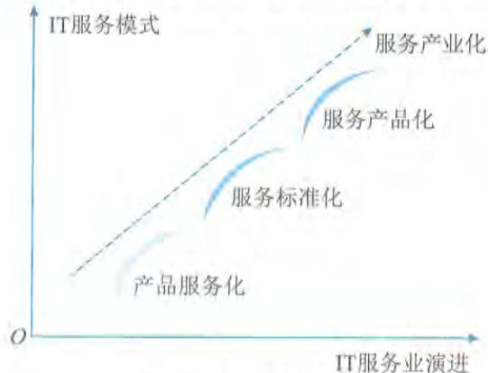  
图3-7 IT服务产业化

总的来说,产品服务化是前提,服务标准化是保障,服务产品化是趋势。三者之间的关系如图3- 7所示。

# 1.产品服务化

在传统意义上,产品的含义是能够提供给市场,被人们使用和消费,并能满足人们某种需求的任何有形的物品;而服务在传统意义上则是指为他人做事,并使他人从中受益的一种有偿或无偿的活动,通常不以实物形式而以提供劳动的形式满足他人或组织的某种特殊需要。

IT服务相关的产品包括硬件、软件等在不

图3- 7 IT服务产业化IT服务相关的产品包括硬件、软件等在不断发展,IT产品在技术、质量方面不断地改进提升,但产品的同质化状况也日益严重,市场竞争也更多地体现在为需方提供的服务上,通过为需方提供量身定制的个性化、差异化的服务,增加供方为需方带来的价值。在此背景下,产品的含义也逐步从单纯的有形产品扩展到基于产品的增值服务,有形产品本身只是作为传递服务的载体或者平台,这种趋势就是产品服务化。

产品服务化的特征主要包括以下几个方面:

$\cdot$  产品服务化是以产品为主线,服务依附于产品而存在;

$\cdot$  产品服务化在服务过程中,常对服务没有明确的考核;

$\cdot$  产品与服务是不可分割的两部分,两者往往融合在一起。

产品服务化的价值可以分别从需方和供方角度来看。

(1) 从需方的角度。产品的交付和使用是为了有效支撑需方业务运营, 一般是通过供方为需方提供服务来实现的, 包括以产品本身和增值服务方式提供的服务, 从而实现产品的作用和价值的最大化。

(2) 从供方的角度。新产品或新的解决方案, 需要通过研发和应用的有效互动来持续改进, 并在提供服务的过程中不断提升产品, 在为需方创造价值的同时, 实现供方的发展战略。

# 2. 服务标准化

随着 IT 应用的快速成长, IT 服务的供方和需方逐渐意识到服务标准化将成为服务的核心能力。服务标准化主要是基于服务生命周期的管理, 针对服务过程、规范以及相关制度进行统一规定、统一度量标准, 实现服务可复制交付。

服务标准化的特征主要包括以下几方面:

建立了标准的过程、实施规范以及相关制度;

具有明确的有形化产出物描述及相关模板;

实施服务的过程有记录, 此记录可进行追溯且可审计;

建立完善的服务质量考核指标体系。

服务标准化的价值分别从供方和需方角度来看:

从供方的角度: 服务标准化使服务规模化成为可能;

从需方的角度: 在接受服务的过程中更有效地获得满足需求的服务。

# 3. 服务产品化

随着组织对 IT 的依赖, IT 服务需求不断增加, 并从附属于硬件和软件的从属地位中逐渐独立出来, 成为增长速度最快的领域。但是, 由于服务的无形性、不可存储性等特殊性, 如何衡量 IT 服务质量和成本、评价服务绩效已成为 IT 服务发展过程中的关键技术难题。因此, 需要借鉴针对传统产品的方式, 实现服务产品化, 即将所提供的服务通过可衡量的质量要求、可视化的服务体系、清晰的服务定价机制和统一的服务标准来体现, 形成具有特定属性的服务产品, 并具有产品规范化、可视化、数字化特性。

服务产品化的特征主要包括:

服务产品化具有清晰的服务目录;

具有独立的价值、明确的功能和性能指标;

对具体的服务有相应的服务级别要求;

对服务有明确的考核指标;

对服务产品实施全生命周期管理。

服务产品化的价值可以分别从供方和需方角度来看。

(1) 从服务需方角度。服务产品化之后, 需方能够以产品组合的形式定制规范化服务, 具有清晰的标准、预期的服务质量和服务收益。

(2) 从服务供方的角度。将服务进行产品化, 能够满足需方不同阶段的服务需求, 以产品的方式对需方提供统一、规范的服务交付内容、交付过程及交付界面, 有效地提升了服务的工

作效率和服务级别协议的达成率,使需方得到统一、规范、专业的服务,获得更大的满意度。

# 3.4.2 服务标准

ITSS在工业和信息化部、国家标准化管理委员会的指导下,在各方共同努力下,开创了政府指导、企业主体、应用牵引、国际同步、产学研用共同推进的标准化工作局面,破解了标准化工作重研制、轻应用、无反馈的难题,提出了以IT服务基本原理为核心、整体布局、分类分级、协调优化、持续改进的标准体系建设的新方法。ITSS在政策规划制定、产业转型升级、行业统计制度建设、企业服务能力提升、IT服务关键支撑工具和产品研发等方面发挥了重要作用。ITSS既是一套成体系和综合配套的标准库,又是IT服务的方法论,通过最佳实践的总结、标准化提炼等实现IT服务相关方的可信赖。

# 1.建设目标

经过多年的建设与发展,ITSS的建设目标主要聚焦在支撑国家战略、引导产业高质量发展、促进新技术应用创新、指导IT服务业务升级、确保标准化工作有序开展等方面。

(1)支撑国家战略。标准是国家竞争力的基本要素,是国际交往的技术语言和国际贸易的技术依据。ITSS体系的建设与发展,需要始终坚持以国家战略为纲领,更好支撑"数字化发展""建设数字中国""新发展格局""自主创新"等国家战略部署。

(2)引领产业高质量发展。ITSS体系的建设与发展,应致力于引领产业的高质量发展。信息技术服务业产业结构升级持续加快,智能化服务、数据服务、区块链服务等新产业形态蓬勃发展,ITSS体系建设应从标准化角度助力产业链贯通和产业生态打造,着力构建IT服务领域的新发展格局,引领和推动信息技术服务的高质量发展。

(3)促进新技术创新应用。ITSS体系的建设与发展,应从标准化的角度引领新技术融合创新。传统基础服务呈现智能化发展趋势,建立IT服务关键技术体系,开展相关标准研制工作,需要引领信息技术创新导向,促进新技术的在业务上的创新应用。

(4)指导IT服务业务升级。ITSS体系的建设与发展,应全面、客观反映IT服务的基础和转型升级进展,固化业界最佳实践和认知水平成果,分享IT服务标准化领域的研究成果和实践经验,为IT服务的转型升级和有序发展奠定坚实基础。

(5)确保标准化工作有序开展。ITSS体系应直观地规定标准体系中需要制定的标准及其彼此之间的关联关系,有效支持以上原则的实施,有效规避标准化目标不明确、方向不清晰等问题,指导和统筹协调相关部门标准体系构建工作,确保成体系、成系统地开展标准研制工作。

# 2.价值定位

ITSS对IT服务相关方来讲,将带来质量、成本、效能和风险等方面的潜在收益。

对IT服务需方的价值收益主要包括:提升服务质量、优化服务成本、强化服务效能、降低服务风险等。

(1)提升服务质量。通过量化和监控用户满意度,需方可以更好地控制和提升用户满意度,从而有助于全面提升服务质量。

(2)优化服务成本。不可预测的支出往往导致服务成本频繁变动,同时也意味着难以持续

控制并降低服务成本,通过使用ITSS,将有助于量化服务成本,从而达到优化成本的目的。

(3)强化服务效能。通过ITSS实施标准化的服务,有助于更合理地分配和使用服务,让所获得的服务能够得到最充分、最合理的使用。

(4)降低服务风险。通过ITSS实施标准化的服务,也就意味着更稳定、更可靠的服务,降低业务中断风险,并可以有效避免被服务供方绑定。

对IT服务供方的价值收益主要包括:提升服务质量、优化服务成本、强化服务效能、降低服务风险等。

(1)提升服务质量。供需双方基于同一标准衡量服务质量,可使供方:

$\bullet$  通过ITSS来提升服务质量;

$\bullet$  提升的服务质量被需方认可,直接转换为经济效益。

(2)优化服务成本。ITSS使供方可以将多项服务成本从组织内成本转换成社会成本,比如初级服务工程师培养、客户IT教育等。这种转变一方面降低了供方的成本,另一方面为供方的工作快速发展提供了可能。

(3)强化服务效能。服务标准化是服务产品化的前提,服务产品化是服务产业化的前提。ITSS让供方实现服务的规模化成为可能。

(4)降低服务风险。通过依据ITSS引入监理、服务质量评价等第三方服务,可降低服务项目实施风险;部分服务成本从组织内转换到组织外,可降低组织运营风险。

# 3.体系框架

ITSS的内容即为依据其原理制定的一系列标准,是一套完整的IT服务标准体系。标准体系是一种由标准组成的系统,为了实现系统化的目标而必须具备一整套具有内在联系的、科学的有机整体。标准体系内部各标准按照一定的结构进行逻辑组合,而不是杂乱无章的堆积,它是一个概念系统,是由人为组织制定的标准形成的人工系统。标准体系结构是指标准系统内各标准内在有机联系的表现方式。形成标准体系的主要方式有层次和并列两种,层次是指一种方向性的等级顺序,彼此存在着制约关系和隶属关系;并列是指同一层次内各类或各标准之间存在的方式和秩序,ITSS标准体系通过并列方式列出各类和各项标准。

1)体系建立原则

ITSS标准体系的建立原则主要包括目标明确,整体性强,整个体系是有序的,并具有开放性、动态性特点等。

$\bullet$  目标性。任何标准体系的建立有其明确的目标。建立ITSS体系的目标是按照科学的分类体系指导IT服务标准化工作成体系,成系统地开展,解决IT服务发展过程中的共性技术问题,从而降低服务和技术的研究、生产、使用或消费、维护乃至管理的成本和风险,使标准化工作发挥最佳效益。

$\bullet$  整体性。现代标准化以标准的整体性为特征。构成标准体系的各标准并不是独立的要素,标准之间相互联系、相互作用、相互约束、相互补充,从而构成一个完整统一体。

$\bullet$  有序性。标准体系是一个相当复杂的系统,包含为数众多的标准,体系内部各标准不是杂乱无章的堆积,整个标准体系的结构层次应该是有序的。标准体系结构应具备合理的

标准层级、时间序列和数量比例。标准体系结构层次的有序性是由系统中各层次要素之间的依从关系决定的。上一层是对下一层的抽象（归纳），而下一层又是上一层的具体化。

$\bullet$  开放性与动态性。标准是科学技术和生产水平的综合反映，科学技术不断发展，生产水平也不断提高，所以标准也要不断提高水平、拓宽领域、完善更新。这就决定了标准体系必须随着科学技术和生产力的发展而不断发展。

因此，标准体系既不是封闭的，也不是绝对静止的。任何标准体系总是处于某种环境之中，总是要同环境之间进行相互作用和交换信息，并且不断地调整或淘汰那些不适用的要素，及时补充新的要素，使标准体系处于不断改进的过程。

2）ITSS 5.0

ITSS 5.0 标准体系框架是在数字中国建设、产业高质量发展、新发展格局构建以及自主创新的国家战略和市场需求的双轮驱动下，以基础服务标准为底座，以通用标准和保障标准为支柱，以技术创新服务标准和数字化转型服务标准为引领，共同支撑业务融合的实现。ITSS 5.0 的体系框架如图 3- 8 所示。

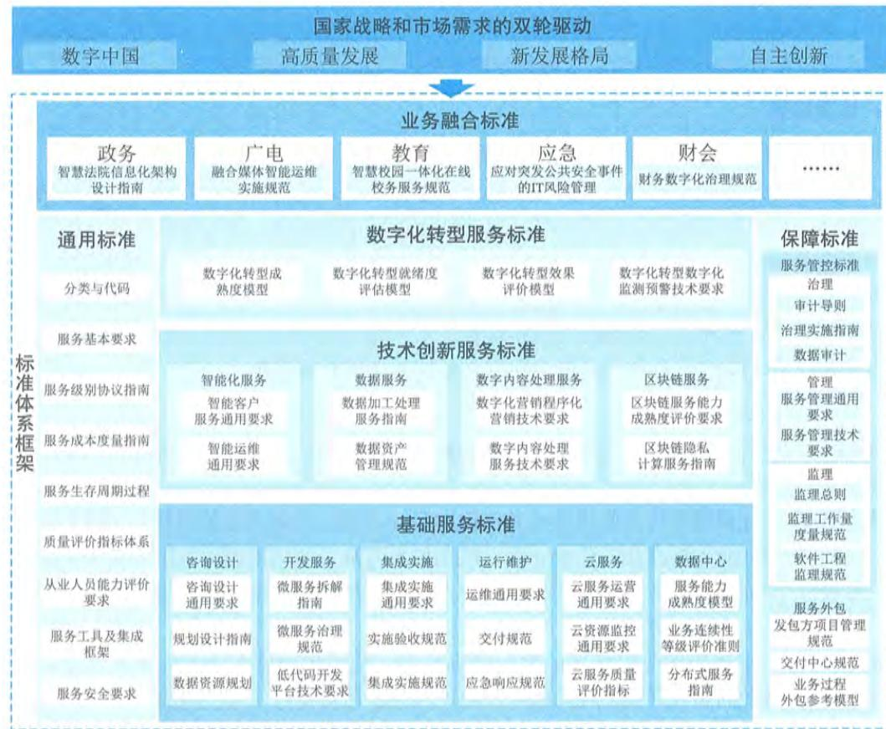  
图3-8 ITSS 5.0 体系框架图

ITSS 5.0 的主要内容包括:

- 通用标准。通用标准是指适用于所有IT服务的共性标准,主要包括IT服务的业务分类和服务原理、服务质量评价方法、服务基本要求、服务从业人员能力要求、服务成本度量和服务安全等。

- 保障标准。保障标准是指对IT服务提出保障要求的标准,主要包括服务管控标准和外包标准。服务管控标准是指通过对IT服务的治理、管理和监理活动和要求,以确保IT服务管控的权责分明、经济有效和服务可控;服务外包标准则对组织通过外包形式获取服务所应采取的业务和管理措施提出要求。

- 基础服务标准。基础服务标准是指面向IT服务基础类服务的标准,包括咨询设计、开发服务、集成实施、运行维护、云服务、数据中心等标准。

- 技术创新服务标准。技术创新服务标准是指面向新技术加持下的新业态新模式的标准,包含智能化服务、数据服务、数字内容处理服务和区块链服务等标准。

- 数字化转型服务标准。数字化转型服务标准是支撑和服务组织数字化转型服务开展和创新融合业务发展的标准,包含数字化转型成熟度模型、就绪度评估、效果评估、中小企业指南、数字化监测预警等标准规范和要求。

- 业务融合标准。业务融合标准是指支撑IT服务与各行业融合的标准,包括面向政务、广电、教育、应急、财会等行业建立具有行业特点的信息技术服务相关的标准。

# 3.5 服务质量评价

《信息技术服务质量评价指标体系》(GB/T 33850)中,定义IT服务质量为:"信息技术服务的固有特性满足要求的程度"。IT服务质量的若干特性在服务生命周期中得以表现出来。例如,在规划设计阶段,服务质量特性更多体现在对服务本身的各种规定,服务本身的内容及其实现的功能等方面。因此,在IT服务本身的规划和设计过程中,需要组织在服务资源、服务能力和服务投入等方面进行策划和设计;而在服务部署实施及服务运营阶段,服务质量更多体现在服务交付过程中的各种特性中,即为了实现服务对象满意而进行的服务交互活动。因此,在服务交付时,服务相关方在一定条件下,以交互方式实现服务价值。相关方的互动与沟通、服务的提供与体验等构成服务质量形成的基础。

# 3.5.1 相关方模型

IT服务涉及服务的开发、提供和消费等环节,并涉及服务的需方、供方和第三方等服务相关方,在特定条件下的服务交互过程,如图3- 9所示。服务需方负责提出服务质量需求,作为整个服务质量衡量或评价的基准,服务质量需求通常情况下是以供需双方签订的服务级别协议体现,服务需方有时也行使服务质量评价的职能;服务供方负责提供满足服务质量需求的服务,同时在提供服务过程中,有职责和义务配合服务需方和第三方开展质量监督和评价工作,以及开展内部质量监督和评价;第三方通常是受服务需方或服务供方的委托,以中立的视角参照服务质量需求,应用服务质量评价工具,对整个服务过程的服务质量进行客观评价。

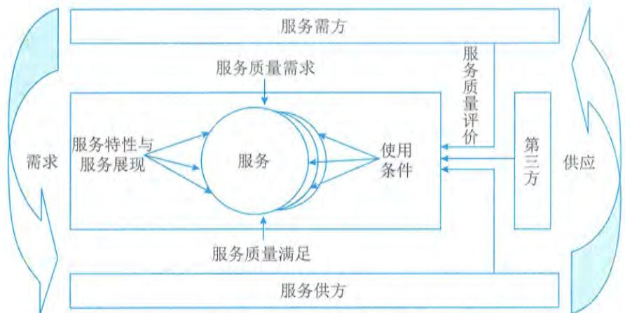  
图3-9 服务质量相关方模型

# 3.5.2 互动模型

服务的需方和供方之间是通过服务质量特性来进行互动的，如图3- 10所示。在需方部分，期望质量也就是需方对供方服务所提出的服务质量要求。感知质量就是供方在提供服务过程中被需方感受到的服务质量。这二者都将通过服务质量特性的评价指标去量化体现。其中期望质量与感知质量的差异将影响到服务需方满意度，期望质量大于感知质量，服务需方不满意；期望质量小于或等于感知质量，服务需方满意。在供方部分，服务质量特性决定于服务供方的服务要素质量和服务生产质量应满足的服务质量要求。服务要素质量涉及人员、过程、技术、资源等方面。服务生产质量就是供方提供服务的过程，覆盖了服务的全生命期。服务要素质量支撑服务生产质量，服务生产质量依赖服务要素质量并通过服务质量特性的评价影响需方的感知质量。

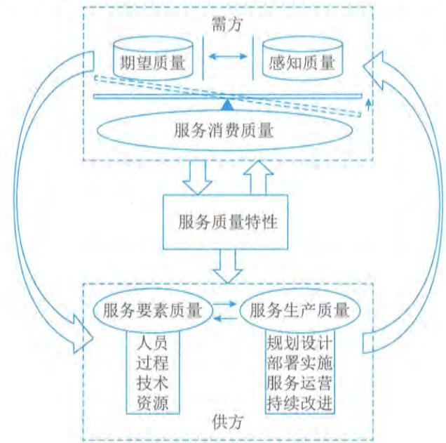  
图3-10 IT服务质量特性模型

# 3.5.3 质量模型

《信息技术服务质量评价指标体系》（GB/T33850）定义了IT服务质量模型，如图3- 11所示。质量模型用于定义服务质量的各项特性，分为5大类：安全性、可靠性、响应性、有形性和友好性。每个大类服务质量特性进一步细分为若干子特性。这些特性和子特性适用于定义各类IT服务的评价指标。

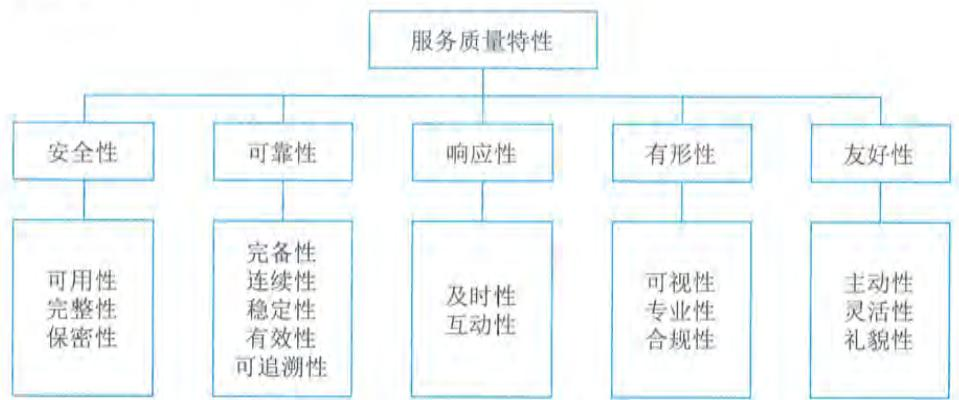  
图3-11 IT服务质量模型

（1）安全性。IT服务供方在服务过程中保障需方的信息安全的程度。子特性包括：

- 可用性。确保授权用户对信息的正常使用不应被异常拒绝，在必要时能及时地访问和使用的程度。

- 完整性。确保供方在服务提供过程中管理的需方信息不被非授权篡改、破坏和转移的程度。

- 保密性。确保供方在服务提供过程中不泄露信息给非授权的用户或实体的程度。

（2）可靠性。IT服务供方在规定条件下和规定时间内履行服务协议的程度。子特性包括：

- 完备性。供方所提供的服务是否具备了服务协议中承诺的所有功能的程度。

- 连续性。确保服务协议在任何情况下都能得到满足的程度，致力于将风险降低至合理水平以及在业务中断以后进行业务恢复两个方面。

- 稳定性。供方所提供的服务能够稳定地达到服务协议约定的要求的程度。

- 有效性。供方按照服务协议要求对服务请求进行解决的程度。

- 可追溯性。供方在服务过程中涉及的活动应具有原始的完整记录，实现有据可查的程度。

（3）响应性。IT服务供方按照服务协议要求及时受理需方服务请求的程度。子特性包括：

- 及时性。供方按照服务协议要求对服务请求响应快慢的程度。

- 互动性。供方通过建立适宜的互动沟通机制保障供需双方进行信息交换的程度。

（4）有形性。IT服务供方通过实体证据展现其服务的程度。这些实体证据通常包括人员形象、服务设施、服务流程、服务工具及服务交付物等。子特性包括：

- 可视性。供方向需方以可见的方式展现其服务的程度。

专业性。供方在服务过程中展现出的规范性、标准性和先进性的程度。

合规性。供方提供的IT服务遵循标准、约定或法规以及类似规定的程度。

(5)友好性。IT服务供方设身处地为需方着想和对需方给予特别关注的程度。子特性包括:

主动性。供方主动感知需方需求并积极采取措施保障服务提供的能力。

灵活性。供方应对需方需求变化的能力。

礼貌性。供方在服务提供过程中展现的服务语言、行为和态度规范化的能力。

# 3.6 服务发展

3.6 服务发展当前,世界正在经历百年未有的大变局,新一轮科技革命和产业变革深入发展,IT服务业发展日趋复杂,机遇和挑战均有新的变化。一方面,IT服务业面临严峻的外部环境。国际环境日趋复杂,全球经济发展不稳定性、不确定性明显增加,新冠疫情等"黑天鹅"事件频发,数字化转型下的行业分化变革加速,IT服务业传统的商业与盈利模式受到严重挑战。另一方面,IT服务业面临巨大的发展机遇。国内大循环为主体、国内国际双循环的新发展格局正加速形成,数字经济迅猛发展,数字技术创新日新月异,围绕云、物联网、数据资产等领域不断涌现出新的IT服务形态。我国经济的转型和发展以及新业态的出现给IT服务业带来了大量的新机会。

# 3.6.1 发展环境

党的十九届五中全会提出"发展战略性新兴产业,推动互联网、大数据、人工智能等同各产业深度融合",并要求"加快数字化发展。发展数字经济,推进数字产业化和产业数字化,推动数字经济和实体经济深度融合,打造具有国际竞争力的数字产业集群"。强调"加强数字社会、数字政府建设,提升公共服务、社会治理等数字化智能化水平"。该规划的颁布为我国IT服务业高质量发展指明了方向,IT服务业将继续通过新一代信息技术,支撑各行业间的数字化转型,全面助力数字中国建设。除此之外,国家多部委和地方政府纷纷发布了有关数字经济发展的政策文件,政策规划正在引领IT服务业发展达到新的高度。

随着全球数字化的加速渗透,数字经济蓬勃发展。特别是面对新冠疫情等影响,数字经济展现出强大的发展韧性,实现逆势增长,为世界经济复苏、增长注入重要动力,数字经济已成为引领全球经济与推动经济高质量发展的重要引擎。我国超大规模的市场优势为数字经济发展提供了广阔而丰富的应用场景。数字经济在实现自身快速发展的同时,也成为推动传统产业升级改造的重要引擎。各行业纷纷将业务从线下搬到线上或尽量将业务能够同线上和线下进行深度融合,加快向数字化、网络化、智能化转型升级的步伐。IT服务作为信息技术和实体经济深度融合的黏合剂与推进剂,数字经济蓬勃发展的浪潮为IT服务创造了更加广阔的发展空间。

全球新一轮科技革命和产业革命加速发展,新一代的信息基础设施、分布式的计算能力、丰富多样的应用场景等共同驱动IT服务持续保持高速创新演进态势。以5G、人工智能、物联网、大数据为代表的新一代信息技术逐步普及并成熟,驱动了云服务、数据服务、智能化服务等新兴IT服务的快速发展,带来了IT服务新的业务增长点和发展新机遇。IT服务创新能力显

著提升,产业基础得到夯实巩固,产业链现代化水平明显提高,更高水平的产业生态重构基本形成。

# 3.6.2 发展现状与趋势

# 1. 产业规模持续增长

在国家政策、市场需求和产业资金不断改善和发展的驱动下,国内IT服务业继续呈现平稳向好发展态势,收入快速增长,增速高于软件业整体水平。作为数字经济的重要组成,IT服务产业规模预期将保持持续增长。一是我国IT服务业的发展具有天然的优势,经济体量庞大,用户数量多,各行各业都在开展数字化转型,巨大的市场规模牵引着我国IT服务业快速发展。二是IT服务业是带动经济复苏的主要力量。受国际局势影响,全球主要经济体的经济受到极大冲击,而IT服务业体现出强大的发展韧性和发展潜力,成为拉动国内经济的重要引擎。三是当今世界正经历百年未有之大变局,新一轮科技革命和产业变革深入发展,国际环境日趋复杂,经济全球化遭遇逆流。复杂的国际形势倒逼我国加快提升IT服务发展的自主创新能力。四是国家、地区等发布了众多重要政策,为IT服务业发展营造了良好的发展环境。

# 2. 传统服务加速转型升级

传统的IT服务,如信息技术咨询规划、软硬件设计与开发、系统集成、运行维护服务在新技术的加持下,为满足市场需求,加快转型升级。

咨询设计服务方面,由信息化工程咨询服务逐步转变为业务数字化转型咨询服务。随着信息化与业务深度融合,单纯的信息化工程咨询服务已不能满足客户需求,如何通过信息化促进业务融合与提升,推动业务数字化转型成为当前咨询服务的新方向。咨询设计服务从以业务需求为出发点规划信息化工程,转变为深入组织业务痛点构建前瞻性业务模型,从战略流程组织架构入手,通过数字化规划,提出引领组织业务数字化转型的方案。

开发服务方面,由传统瀑布开发模式向微服务开发模式转变。随着业务迭代加速、协同需求增大以及云应用开发部署普及,以微服务开发框架进行业务组件开发的服务模式逐渐成为主流。微服务围绕业务组件创建应用,可灵活地进行开发、管理和加速。业务组件提供服务接口和管理界面,实现不同应用集成,为应用提供服务,有效改善现有系统之间的调用效率,满足业务系统的快速开发和迭代升级。

信息系统集成实施服务方面,从基础软硬件集成服务,向基础设施搭建、数据整合与共享、应用重构和上云部署等全栈式集成服务转变。近年来,信息系统建设的集约整合和共享共用要求不断提高,信息系统上云以及大系统、大平台、大数据的建设模式可以集约化利用资源并系统性打破信息孤岛。与此同时,产业数字化带来的应用与数据集成不断向细分领域、高端技术延展,用户群体的集成需求更加丰富和多层次,信息系统集成实施服务逐步从基础软硬件集成发展为向用户提供一体化解决方案为主的集成服务,即全面实现数据共享、业务系统整合的全栈式信息系统集成服务。

运行维护服务方面,由基于人员、流程、资源和技术的传统运维模式向由基于知识、数据、

算法、算力的智能运维模式转变。随着人工智能、大数据、云计算等技术的飞速发展,运维服务面临信息系统技术架构日趋复杂、运维对象规模快速增长、告警信息海量涌现、业务需求快速迭代等困难,智能运维应运而生。智能运维是人工智能在运行维护领域的应用,更关注知识、数据、算法、算力的应用,是"数据驱动的运维",具备能感知、会描述、自学习、会诊断、可决策、自执行、自适应等特征,极大地降低了运维成本,提高了运维效率。

# 3.新模式新业态不断涌现

数字化转型过程中,5G、云计算、区块链、人工智能、数字孪生、北斗通信等新一代信息技术的应用,为IT服务提供了新的实现手段,同时赋予了其更多的内涵,促使数据服务、区块链服务、数字内容处理服务、数字化转型服务等新兴IT服务的不断涌现与迅猛发展。服务模式也由传统的人·月方式、项目方式扩展到云订阅、在线调用等数字化方式。IT服务业态与技术创新不断涌现,让IT服务业走向多元化发展模式。

数据逐渐成为重点服务对象和重要服务资源。一方面数据呈现爆发增长、海量集聚的发展态势,以业务数据作为服务对象的数据服务产业迎来重要的爆发期。数据服务产品不断涌现,数据与实体经济各产业领域加速融合,覆盖数据采集、存储、处理、分析、应用和可视化的数据服务以及推动数据加快流通交易的数据资产评估服务产业格局不断完善。另一方面,服务数据已经成为服务资源的重要组成部分,如何合理、有效、科学地利用服务数据是实现IT服务本身数字化、智能化、网络化协同的关键。

区块链服务助力营造安全可信发展环境。区块链有利于建立公开透明的信任机制,在隐私保护方面有匿名化的独特优势,已在防伪溯源、供应链管理、司法存证、政务数据共享、民生服务等领域涌现了一批有代表性的应用。规范和提升基于区块链的服务,对构建安全可信环境、防范应用风险、完善区块链产业生态具有重要意义。产业界正持续开展区块链服务模式的探索,推动建立安全可信的数字经济新规则与新秩序。

数字内容服务运用信息技术进行数字化并加以整合运用,向用户提供数字化的图像、字符、影像、语音等信息产品与服务的新兴IT服务。直播电商、云展会等数字化营销手段的出现,提供了线上服务。

业务驱动的数字化转型服务成为新的服务类型,数字化转型服务是一种新型的IT服务业态,其核心是通过协同组织推进关键数字技术在业务中的创新应用,通过"上云用数赋智"构建平台业务模式等,激活组织业务中的数据要素,为组织的业务转型赋能。

# 4.自主创新能力进一步加强

基础软硬件是所有IT服务的基础。近年来,在政策鼓励和应用牵引下,国内涌现出一批优秀的从事基础软硬件研发的技术型组织,我国自主产品逐步实现从"可用"到"好用",再到"突破创新"的转变,建立了满足基本应用需求的产业链条。集成厂商和软件开发商已逐步开始兼容自主系统,部分软硬件进入自主研发阶段,芯片、操作系统、中间件和应用软件领域乘势而起,通过对IT软硬件的重构,建立我国自主可控的IT服务产业生态,提升我国IT服务"双链"的稳定性和竞争力,实现信创技术群体跃升和融合发展。

然而,与国际主流基础软硬件相比,我国软硬件产品的性能、可靠性、兼容性等仍有待进

一步提升,标准化程度不高导致基础IT服务,如设计开发、集成实施、运维服务等,周期长、难度大、服务质量不可控;同时,基础软硬件的短板会导致IT技术创新服务和业务融合IT服务发展受限;再如,制造行业软件与国产基础软硬件的适配等方面存在众多问题。因此,提升我国基础软硬件的自主创新能力仍是IT服务发展的重要内容。

# 5.复合型人才需求旺盛

我国IT服务产业人才供给能力不断提升。据工业和信息化部公布数据显示,软件和IT服务业从业人数稳步增加,工资总额加快增长。然而,我国IT服务与业务领域融合的复合型人才缺口仍然较大,复合型人才和高技能人才紧缺,部分领域人才培养不能满足产业发展需求。例如,融合金融学、数学、信息计算科学等多门学科的金融科技,培养新型金融科技人才适应不断发展变化的金融新环境迫在眉睫。再如,信息技术应用创新的从业人员缺口大,核心技术人才尤其缺乏,导致核心技术攻关能力受限,设计开发、集成服务周期长。

# 6.发展与安全长期共存

从国际情况来看,加强本土信息技术产业的扶持成为了世界各国发展主基调。美国政府持续通过"实体清单"等手段对我国企业全方位打压,同时借助政策引导,加强本土产业能力建设。欧盟出台相关政策,积极引导本土产业界加大对信息技术和数据产业的投入创新,同时借助规范市场规则打造新时期欧洲IT产业发展竞争力。

从国内情况来看,"十四五"规划提出坚持总体国家安全观,实施国家安全战略,维护和塑造国家安全,把安全发展贯穿国家发展各领域和全过程,防范和化解影响我国现代化进程的各种风险,筑牢国家安全屏障。IT服务产业作为国家战略科技力量和重要基础设施重要性突出,安全发展也必须贯穿全过程。

危机中寻新机,变局中开新局。在"十四五"规划的建议指导下,加快数字化发展,建设数字中国,在数字基建、信息消费等需求推动下,产业数字化和数字产业化的加速升级将持续为我国IT服务产业发展培育新的增长点,IT服务产业的稳步前行也将为我国数字经济体系建设贡献力量。

# 3.7 服务集成与实践

随着云计算、云原生、工业互联网等平台化业务模式的实践与发展,为满足社会、企业等具体业务场景或数字化转型需求,以信息系统平台为基础的多元服务融合集成,已成为信息系统集成发展的方向之一。服务集成是在传统意义上信息系统集成关注技术融合的基础上,更加强调数据融合共享条件下的"敏态"集成能力建设,是信息系统软硬件面向"稳态"集成后,面向各行业领域数字化转型和服务化发展的新型实践。服务集成以包含信息系统软件在内的"服务产品"为集成对象,以量化的服务水平管理为抓手,以跨组织、跨团队的服务动态融合为关注焦点,以服务交付管理为项目管理主要内容,以服务绩效和服务价值为集成成果评价关键点。

服务集成活动的基本方法,如图3- 12所示。

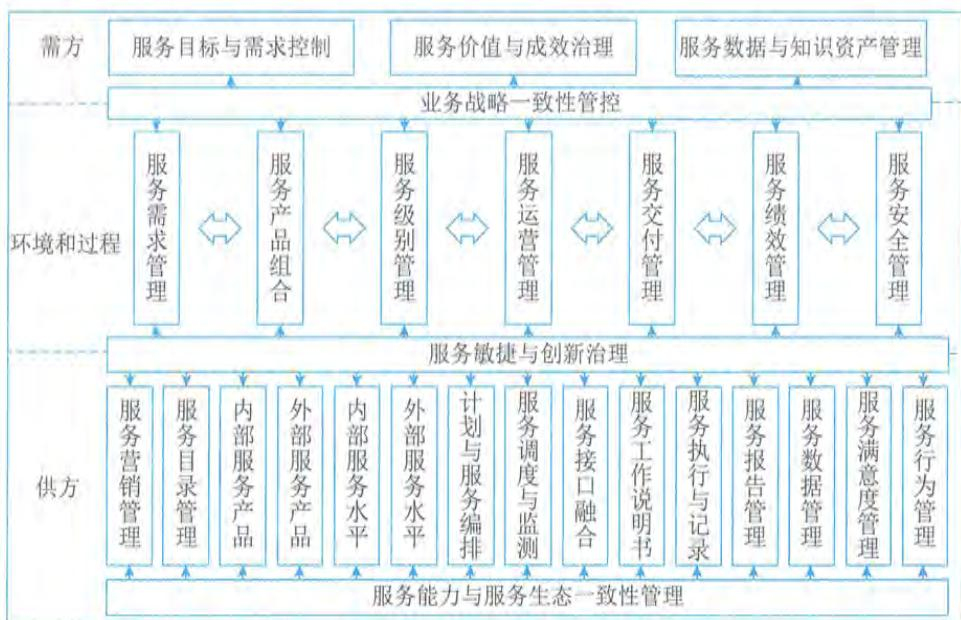  
图3-12 服务集成活动基本方法示意图

服务集成基于服务核心四要素:需方、供方、环境和过程,与单项服务活动相比,多元服务的集成更加关注通过业务战略一致性管控(服务集成价值与需方发展战略的深度融合)、服务敏捷与创新、服务能力与服务生态一致性建设,满足需方复杂需求(尤其是隐性需求)以及具备弹性的价值与成效要求等,这就需要供方通过服务数据共享交换、人才团队融合、计划和调度能力的强化等手段,确保内外部服务能力的一体化融合以及面向服务项目或场景的一致性行动等。服务集成涉及多个供方团队或组织,因此服务数据和知识资产的管理也成为服务集成的重要关注点。

# 3.7.1 实践背景

某城市为提升区域交通治理与管理水平,优化区域交通与城市配送等交通环境,以及改善城市居民出行、停车等交通体验,充分发挥城市公共空间针对交通的动、静态载体能力,策划提出了包含区域车联网新技术、智慧停车新思路、低速无人快递新模式、数字交通治理概念等城市交通环境更新项目需求,并期望以此带动区域经济的发展,包括城市影响力提升、产业链级的招商引资以及相关数字经济高质量发展等,命名为"某市城市交通空间综合开发项目"。为此,该城市成立了专门的平台公司,并为该公司筹集了必要的启动资金,计划投资额12亿元人民币,由该平台公司主导开展相关项目建设和服务集成工作,政府侧也建立了由多部门共同构成的指导委员会,共同驱动该项区域发展战略。

# 1. 集成目标

该实践集成目标主要包括区域发展、产业衍生、社会运营、高效建设等方面。

在区域发展方面,项目主要聚焦在城市可持续竞争力、经济与社会发展两个方面,主要包括:①落实国家相关战略需求,包括数字中国、智慧城市、数字经济和车联网等试点示范,从而使城市在国家新时期长期战略中进一步锁定发展新机遇;②提升城市治理体系与治理能力现代化,提升民

生服务水平, 优化数字营商环境, 从而支撑城市的高质量发展; ③全面利用城市基础设施与环境升级建设的契机, 优化区域产业结构, 大力发展数字经济等方面, 打造出新型智慧城市产业生态。

在产业衍生方面, 项目主要聚焦在智能硬件产品、信息服务和数据加工三个方面, 主要包括: ①车联网与道边停车感知等相关软硬件产品的产业导入、提升和产业链建设等; ②培育出能够贯彻技术、产品、运营、终端服务全链条融合创新的产业生态模式, 以及相关的服务组织等; ③聚焦产业竞争力建设, 培育和打造相关产业独角兽企业和龙头企业分支机构等。

在社会运营方面, 项目主要聚焦在可持续运营、合理的投资收益两个方面, 主要包括: ①确立无人驾驶与低速无人快递、智慧公共停车等相关产业化投资模式, 形成"引导资金+社会资本"共同改善城市环境投资的成熟框架与方法; ②构建新型基础设施建设与运营融合的全过程模型, 提炼边建设、边运营探索的项目开发方法; ③打造"政府引导、社会化参与"的城市基础环境改善与经济融合发展的多元共治共享样板, 沉淀城市居民数字素养提升和系统化城市运营新方法。

在高效建设方面, 项目主要聚焦在建设合规、技术标准明确、施工有机协同、系统稳定可靠四个方面, 主要包括: ①面对城市更新与改造建设关联施工领域多、既有资源利用复杂、施工难度大等特点, 需要保障安全与合规的情况下正确施工; ②面对大量新技术、新系统等, 既需要满足各领域标准规范, 又要做好技术的融合与集成; ③面对交通相关基础设施智能控制的高性能与高可靠要求, 做好智能控制与可靠控制的组合应用, 避免时延、可用性等技术因素带来的城市交通运维问题。

# 2. 需求分析

服务自身具备无形性、可变性、不可存储性、不可分离性等特点, 服务需要往往面临较大的弹性, 因此服务集成需求的可变性空间变得更大, 这就需要把服务需求在项目前期阶段就要进行有效识别、分析、推演, 并定义其控制方法和管理过程。相对一般信息系统项目来说, 服务需求的弹性往往来自于隐性需求, 且在期望与感知过程中不断变化。多元化服务需方相关人员往往对需求起关键性决定因素, 因此全面识别服务需方是对服务集成项目至关重要, 对该项目而言, 识别的服务需方主要包括: 政府城市治理与管理人员 (含执法人员)、各类自治组织、城市居民、社会运营机构等。

服务隐性需求的显性化是服务集成项目过程中持续关注的重点, 就该项目而言, 启动阶段确立的显性需求及其指标控制如表3- 1所示。

表3-1某市城市交通空间综合开发项目启动阶段需求分析与指标示例  

<table><tr><td rowspan="2">需求方</td><td rowspan="2">关键需求</td><td colspan="3">指标控制</td></tr><tr><td>2020年</td><td>2021年</td><td>2022年</td></tr><tr><td rowspan="5">政府机构</td><td>车联网覆盖率</td><td>≥30%</td><td>≥70%</td><td>≥85%</td></tr><tr><td>路侧停车电子化率</td><td>≥50%</td><td>≥80%</td><td>100%</td></tr><tr><td>招商引资及产业服务产值/基础投资额(引导资金)</td><td>≥1倍</td><td>≥20倍</td><td>≥30倍</td></tr><tr><td>公共道路违章停车下降</td><td>≥10%</td><td>≥20%</td><td>≥30%</td></tr><tr><td>……</td><td>……</td><td>……</td><td>……</td></tr></table>

（续表）

<table><tr><td rowspan="2">需求方</td><td rowspan="2">关键需求</td><td colspan="3">指标控制</td></tr><tr><td>2020年</td><td>2021年</td><td>2022年</td></tr><tr><td rowspan="4">自治组织</td><td>群众路侧停车满意度</td><td>≥85%</td><td>≥90%</td><td>≥95%</td></tr><tr><td>城市公共停车场接入率</td><td>≥30%</td><td>≥80%</td><td>≥95%</td></tr><tr><td>特殊群体路侧停车优惠管理接口</td><td>电子表格</td><td>自治组织客户端</td><td>居民自助客户端</td></tr><tr><td>……</td><td>……</td><td>……</td><td>……</td></tr><tr><td rowspan="4">城市居民</td><td>公共停车信息获取率</td><td>≥25%</td><td>≥75%</td><td>≥90%</td></tr><tr><td>路侧停车最长等待时间</td><td>≤10分钟</td><td>≤8分钟</td><td>≤2分钟</td></tr><tr><td>交通通行效率提升</td><td>≥5%</td><td>≥10%</td><td>≥20%</td></tr><tr><td>……</td><td>……</td><td>……</td><td>……</td></tr><tr><td rowspan="3">社会运营机构</td><td>无人递送通达社区率</td><td>≥25%</td><td>≥60%</td><td>≥80%</td></tr><tr><td>无人驾驶接入可用性</td><td>≥90%</td><td>≥95%</td><td>≥99%</td></tr><tr><td>……</td><td>……</td><td>……</td><td>……</td></tr></table>

# 3. 需求控制

服务集成是一项复杂的系统工程，多元可变促使服务集成难度的提升，也容易陷入“复杂创新黑洞”，也就是虽然技术、产品、管理等可行，但原理创新、技术创新、服务创新、模式创新等错综交织带来的巨大项目及社会成本，导致项目陷入某种困境。因此，服务集成往往采用如下原则开展：

以稳态发展规律，推演创新实施路径；以成熟实践方法，保驾创新融合内容；以合规评估评测，确立创新核心价值；以多元专家参与，支撑创新建设优化。基于上述原则，该项目确立的具体治理理论和方法如表3- 2所示。

表3-2某市城市交通空间综合开发项目治理理论与方法示例  

<table><tr><td>领域</td><td>治理理论与方法</td></tr><tr><td rowspan="4">推演与演进</td><td>智慧城市、城市数字化转型等发展成熟度和演进规律</td></tr><tr><td>智慧交通建设与演进规律</td></tr><tr><td>新型基础设施建设与发展规律</td></tr><tr><td>……</td></tr><tr><td rowspan="4">最佳实践</td><td>信息技术服务标准、方法论与最佳实践</td></tr><tr><td>信息惠民与信息消费标准、方法论与最佳实践</td></tr><tr><td>社会科学技术工程方法论与最佳实践</td></tr><tr><td>……</td></tr></table>

（续表）

<table><tr><td>领域</td><td>治理理论与方法</td></tr><tr><td rowspan="4">合规与评测</td><td>信息化工程项目管理</td></tr><tr><td>信息化工程监理与评测</td></tr><tr><td>财务升级与IT审计</td></tr><tr><td>……</td></tr><tr><td rowspan="4">专家资源</td><td>多元专家融合服务体系方法</td></tr><tr><td>多领域专家协同创新平台</td></tr><tr><td>科技成果转化工程</td></tr><tr><td>……</td></tr></table>

服务集成项目往往涉及众多知识领域、工程思维模式以及动态分析与决策能力等，因此，服务集成项目往往需要配备“全过程咨询服务”这一服务内容，从而确保项目各类目标、方法、思想和要求等能够有效地进行发布与传达，这种服务尤其对项目隐性需求和隐性知识的继承起着重要的作用，这也恰巧是服务集成所重点关注的内容。

# 3.7.2 服务产品与组合

服务集成是对组织内、外部多领域服务产品（内容）的有机融合，该过程结合了组织内外部“产品服务化、服务产品化”的进程和成果，也是相关知识与能力重组、再造和创新的过程。

# 1. 服务供应业务域识别

服务供应业务域的识别与软硬件系统集成的架构层次识别类似，重点不是对具体（服务）产品的识别以及价值与指标确认，而是采用系统工程的分阶段模式与信息系统全生命过程管理体系，对需要参与服务集成的业务类型或组织类型进行识别和分析。考虑到服务产品的个性化与“非标”（与信息系统标准化软硬件相比）特点，服务供应业务域的识别全面性与有效性及其逻辑关系搭建方法与模式，对服务集成项目与活动来说都至关重要，其影响服务项目组织的搭建及服务融合的有效性等，往往对不同的服务集成项目，采用不同的识别方法和特定的关系模式。

就该项目而言，其采用的服务供应业务域识别模式如图3- 13所示。

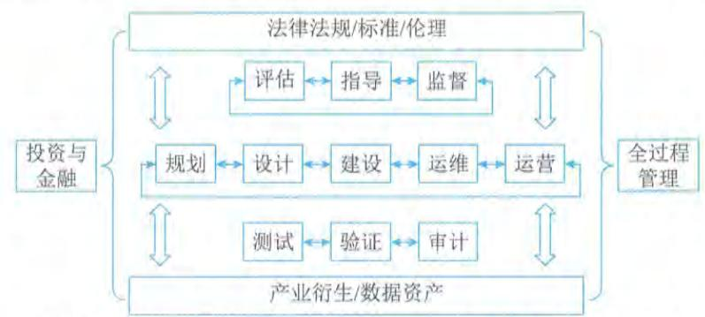  
图3-13 某市城市交通空间综合开发项目服务供应业务域识别模型

该模型以信息系统及其服务创新的全生命周期为基础,定义规划、设计、建设、运维和运营相关服务供应业务域;该项目涉及城市发展和居民利益与感受,按照治理基本方法,定义了评估、指导和监督服务供应业务域;同时该项目关联较多的创新和动态过程等,定义了测试、验证和审计服务供应业务域,并明确了验证涵盖了社会化参与的验证需求等;考虑到该项目的复杂性和融合创新性等,定义了全过程管理服务供应业务域;基于该项目涉及无人驾驶、低速无人快递等内容,在法律法规、标准的基础上,定义了伦理相关的服务供应业务域;又考虑到该项目涉及投融资、招商引资以及过程资金共管等情况,定义了投资与金融服务供应业务域;基于项目带动的数字经济发展需求等,定义了产业衍生、数字资产服务供应业务域。

# 2. 服务产品定义与组合

服务产品是具备标准化输入输出接口、服务水平控制的一组服务活动、服务资源集合,是实施服务集成的基本单元,是进行服务编排、计划与调度的基础。服务产品与一般信息系统软硬件产品有所区别,其行业或产业标准化程度不高,往往是服务供方自行定义其内容、范围、模式、成果、接口等,这是由于服务固有的可变性及个性化等因素造成。服务产品的颗粒度及内容标准化程度,与服务集成的梳理实施关系紧密,服务产品定义和组合是服务集成项目进入实施阶段前的重要工作,并伴随整个服务集成全生命周期。针对该项目,确立的服务产品定义与组合如表3- 3所示。

表3-3 某市城市交通空间综合开发项目服务产品定义与组合示例  

<table><tr><td>业务域</td><td>服务产品(组)</td><td>产品(组)概述</td><td>组合基本原则/要求</td></tr><tr><td rowspan="3">金融/投资</td><td>投资管理</td><td>对政府引导资金、建设资金等进行管理以及发展基金的筹措等</td><td>政府指定的平台公司全权实施</td></tr><tr><td>资金管理</td><td>对项目建设资金、运营基础资金进行第三方管理以及多方共管提供服务</td><td>具备支持平台公司参与资金共管的银行机构</td></tr><tr><td>……</td><td>……</td><td>……</td></tr><tr><td rowspan="4">法律法规、标准与伦理</td><td>法律法规</td><td>为集成项目的立项、招采、合同、人员等提供法律服务,为伦理或运营突破提供法律建议等</td><td>与地方政府一起,实现满足新型服务、智能社会伦理等相关政策与法规的创新融合</td></tr><tr><td>标准</td><td>为项目标准制定、发布和应用提供支撑,为项目标准拓展为社团、地方、行业、国家标准提供支撑等</td><td>能够与全过程管理和关键建设机构形成互动</td></tr><tr><td>伦理</td><td>持续跟踪项目的社会化运营,提供伦理审查支持、伦理验证与创新等支持</td><td>能够综合开发利用社会科学技术等,并与法律法规及标准组织具备协同基础</td></tr><tr><td>……</td><td>……</td><td>……</td></tr></table>

（续表）

<table><tr><td>业务域</td><td>服务产品(组)</td><td>产品(组)概述</td><td>组合基本原则/要求</td></tr><tr><td rowspan="3">规划</td><td>顶层规划</td><td>从整体视角,对项目涉及的资金、技术、运营、经济发展、惠民等内容进行规划,对整体项目集成模式进行整体策划等</td><td>与平台公司及全过程管理相关活动能够有效衔接和支撑</td></tr><tr><td>智慧停车专项规划</td><td>从城市发展、居民便捷出行等视角,对路侧停车、公共停车场的建设、运营和管理等进行整体规划</td><td>继承顶层规划的要求,并与整体规划形成互动与融合</td></tr><tr><td>……</td><td>……</td><td>……</td></tr><tr><td rowspan="4">设计</td><td>工程设计</td><td>对车辆网、路侧停车的土木工程、弱电工程等进行专业化设计</td><td>能够充分理解车联网等新型技术与发展模式,并能够对既有基础环境进行测绘等</td></tr><tr><td>信息系统设计</td><td>对停车管理、车联网管理与调度等信息系统进行设计</td><td>能够与工程设计及各类规划服务进行有机融合</td></tr><tr><td>运营管理设计</td><td>对项目关联和衍生的运营体系进行设计,包括车联网运营、停车运营等</td><td>能够与平台公司及社会化运营机构等进行有效衔接</td></tr><tr><td>……</td><td>……</td><td>……</td></tr><tr><td rowspan="2">全过程管理</td><td>项目管理辅助及监理</td><td>为平台公司提供项目全生命周期辅助管理,包括技术创新、商业谈判、过程管理等,并通过监理活动确保项目策划到各项具体活动实施的一致性</td><td>能够充分理解项目涉及的目标、价值、意义和边界等,与平台公司及各类参与者形成良性互动融合</td></tr><tr><td>专家管理服务</td><td>聚合综合类、技术类、运营类、服务类的多元化专家资源,为项目各项活动提供专家服务</td><td>与平台公司及项目管理辅助机构形成良性互动融合</td></tr><tr><td></td><td>……</td><td>……</td><td>……</td></tr><tr><td>……</td><td>……</td><td>……</td><td>……</td></tr></table>

在该阶段的服务产品定义活动往往不能达到项目实施所需要的服务产品颗粒度,其主要作为服务选型与服务机构确立的基本来源,需要结合服务机构具体的服务产品进一步细化,形成服务详细产品清单(树),并伴随项目全生命周期,持续迭代更新。

# 3. 服务接口标准与控制

服务接口的价值作用与信息系统相关软硬件接口类似,都是各类产品共享交换、融合集成的基础,但服务接口的内容范围与形式有其特定属性,按照信息技术服务标准(ITSS)基本原理定义的服务基本要素包括:人员、过程、技术和资源,服务接口也要至少涵盖这些内容,同时考虑到服务持续提升及可变融合,通常也会涵盖服务机构的服务能力管理相关内容。

就该项目而言,定义的接口类型主要包括咨询服务接口、专家服务接口、工程建设服务接口、信息系统开发服务接口等。咨询服务接口标准内容如表3- 4所示。

表3-4 某市城市交通空间综合开发项目咨询服务接口标准示例  

<table><tr><td>服务类型</td><td>要素</td><td>接口内容及标准</td></tr><tr><td rowspan="5">咨询服务</td><td>人员</td><td>服务负责人：服务供方高级管理人员
服务商务负责人：服务供方营销人员或项目负责人
服务产品负责人：服务供方服务研发负责人或项目负责人
服务日常管理人员：服务供方项目负责人
服务交付负责人：服务供方实施团队负责人或技术负责人
服务研发负责人：服务供方研发负责人或技术负责人
服务质量负责人：服务供方质量体系负责人或交付负责人
服务团队人员：服务人员、服务时间、技能覆盖等信息......</td></tr><tr><td>过程</td><td>服务接入规范：包括服务入口、服务响应流程及指标等
服务管理规范：包括内外部服务级别管理、服务人员管理等流程与指标等
服务交付规范：包括例行操作、响应支持、评估优化等规范与指标等
服务行为规范：包括人员行为、安全治理等规范和指标等
服务报告规范：包括报告计划、报告模板、报告存储等规范与指标等......</td></tr><tr><td>技术</td><td>服务研发：服务研发体系、研发方向、研发方法等接口与规范
服务验证：服务测试环境、验证方法、参照标准等接口与规范......</td></tr><tr><td>资源</td><td>服务管理平台：服务编排信息接口、服务调度信息接口等规范
服务运营平台：服务计量信息接口、服务计费信息接口等规范
服务知识库平台：知识库共享接口、知识重组与再造信息接口等规范......</td></tr><tr><td>能力管理</td><td>服务战略与策划接口等规范
服务沟通与交互接口等规范
服务检查与改进接口等规范......</td></tr></table>

服务接口控制是服务集成的重要活动，是控制服务风险、提升服务质量、服务一体化融合的主要支点，对服务接口的控制重点关注服务弹性、敏捷性、可变性等内容。服务接口控制可以参照国家标准《信息技术服务质量评价指标体系》（GB/T33850）相关规定进行设计和部署，从安全性、可靠性、响应性、有形性和有效性等结果性指标，管理、调整和优化服务接口控制方法。

就该项目而言，其服务接口控制的内容主要包括：

$\bullet$  服务供方能力管理及能力要素变更：

$\bullet$  服务质量态势感知：

$\bullet$  服务需求、服务产品组合、服务运营、服务成本变更：

$\bullet$  服务研发、创新联动、模式变革等。

该项目建立了服务接口控制委员会和专门服务接口管理人员，负责服务接口有效性、一致性和变更控制等。

# 3.7.3 项目组织与里程碑计划

3.7.3 项目组织与里程碑计划服务集成通常是跨服务供方组织的一项活动，这就对服务组织建设和进度控制提出了更高的要求，服务不可存储与不可分离等固有特性（服务供应与消费是同时进行的）又导致服务活动结果的不可逆，因此在服务项目组织设计和实施进度控制时，需要尽量强化服务实施前的设计和定义，充分考虑服务互补能力及进度控制手段。

# 1.项目组织

针对该项目的目标和特点，定义的项目组织体系如图3- 14所示。

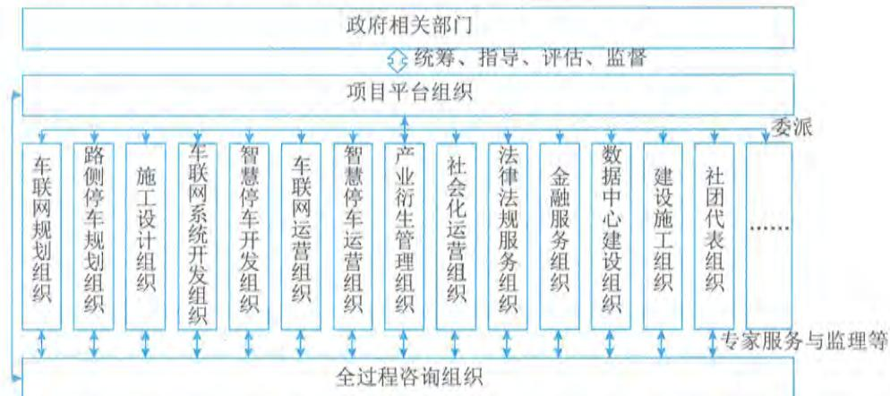  
图3-14 某市城市交通空间综合开发项目组织体系

该项目由政府有关部门发起，并组建项目平台组织（公司），由平台组织聚合和委派各类服务组织参与项目的策划、建设和运营等活动。考虑到该项目服务集成的复杂性以及管控难度等，平台组织引入了全过程咨询组织，提供面向所有领域的专家咨询服务、项目代管及监理等活动。

政府相关组织的责任分工界面举例如表3- 5所示。

表3-5 某市城市交通空间综合开发项目政府相关组织分工界面  

<table><tr><td>阶段</td><td>主要分工</td></tr><tr><td>启动</td><td>明确城市交通空间综合开发的发展方向、目标和战略步骤等
准备开发与引导资金并筹建平台组织（公司）
明确项目涉及的主管部门以及相关部门协同机制
……</td></tr><tr><td>建设</td><td>协调交通空间治理与管理有关部门
支撑法律法规、政策和标准的制定与修订，以及发布实施等
评估、指导、监督项目各项工作的开展
……</td></tr><tr><td>运营</td><td>开展伦理审查及社会风险控制等
开展数字经济评估及招商引资对接等
协调解决居民反映的问题及居民满意度跟踪等
……</td></tr></table>

平台组织（公司）的责任分工界面举例如表3- 6所示。

表3-6某市城市交通空间综合开发项目平台组织（公司）分工界面  

<table><tr><td>阶段</td><td>主要分工</td></tr><tr><td>启动</td><td>组织资源开展策划、社会调研、技术与服务选型等
进一步深化业务需求，明确需求的关键点，定义需求控制机制与措施等
开展项目顶层规划与专项规划等
......</td></tr><tr><td>建设</td><td>协调指导深化设计，总体把控项目进度和项目质量，协调政府相关部门配合
依托内外部资源，成立专项业务转型升级、技术与工程建设工作组
协调业务梳理，确定业务需求，确认并验证建设内容等
......</td></tr><tr><td>运营</td><td>策划运营方向，明确运营的目标与价值导向等
确认项目信息资产运营方案，协调组织项目运营各项资源
评估、验证社会化运营方案，监督管理社会化运营活动
......</td></tr></table>

信息系统、工程与技术承建组织的责任分工界面举例如表3- 7所示。

表3-7某市城市交通空间综合开发项目信息系统、工程与技术承建组织分工界面  

<table><tr><td>阶段</td><td>主要分工</td></tr><tr><td>启动</td><td>服务目录、服务水平管理、解决方案与技术方案准备
根据项目的基本需求，定义服务相关的人员、流程、技术和资源等内容
明确服务接口，配合调研，提供技术支持
......</td></tr><tr><td>建设</td><td>开展与自身相关的项目详细需求调研分析，做好项目服务、技术方案设计和功能模块设计
做好服务接口管理，清晰定义相关的服务工作说明书等
按照设计方案开展软件开发、系统部署、工程建设实施和服务交付等工作
配合标准体系执行，配合专家技术论证
......</td></tr><tr><td>运营</td><td>提供社会化运营服务或为社会化运营服务提供技术保障和工作配合
根据需求做好运营、应用、技术和信息资源管理的迭代升级
持续深化运营所需的计量与记录能力，包括数据准确度、计量记录颗粒度等
......</td></tr></table>

全过程咨询管理组织的责任分工界面举例如表3- 8所示。

表3-8某市城市交通空间综合开发项目全过程咨询组织分工界面  

<table><tr><td>阶段</td><td>主要分工</td></tr><tr><td>启动</td><td>定义专家资源需求，构建专家资源库，明确专家参与项目模式与方法等
协助开展项目策划和项目建设前期准备工作，参与项目顶层规划和专项规划等
实施项目合作伙伴比选、建设模式研究、需求调研、可行性分析、辅助项目招标等
......</td></tr></table>

（续表）

<table><tr><td>阶段</td><td>主要分工</td></tr><tr><td>建设</td><td>指导方案设计，做好设计方案成果质量把控和专家评审论证
制定项目标准规范体系，包括数据标准制定、系统标准制定、运营标准制定等
开展项目建设过程监理服务和评估评价工作，监督评估项目质量进度</td></tr><tr><td>运营</td><td>协助定义服务运营的计量单位及运营组合方案等
针对整体运营、信息资源运营等提供方案咨询等
对项目相关运营活动，提供能力成熟度及程度评价评估等</td></tr></table>

该项目根据项目目标、业务需求以及组织体系的责任分工等内容，组建了项目管理中心作为项目管理的核心机构，该中心作为政府侧成立的项目指导与协同委员会的统筹、指导、评估和监督等，中心负责人由平台组织（公司）负责人担任，设置若干中心副主任，分别由资深专家代表、全过程咨询服务负责人、投资与招商引资负责人、关键技术负责人以及运营策划负责人等担任，组织架构如图3- 15所示。

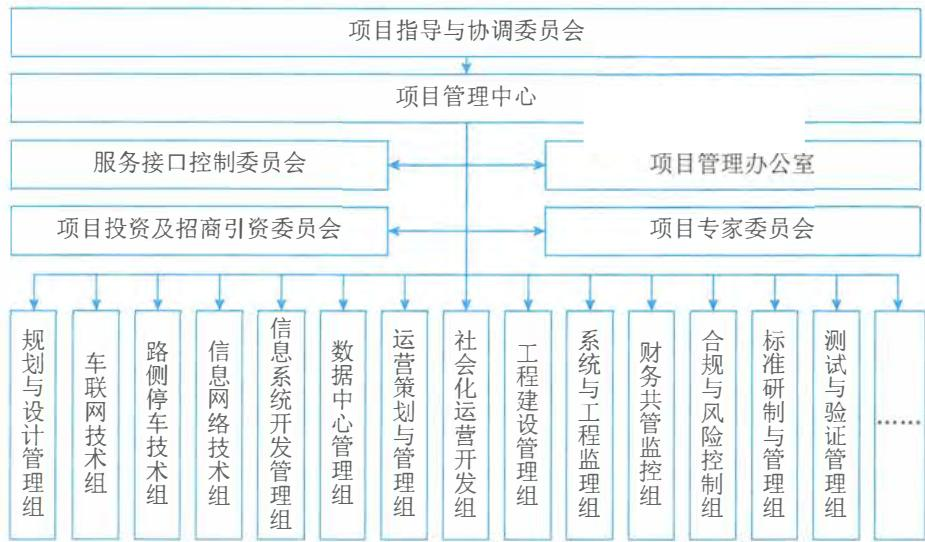  
图3-15 某市城市交通空间综合开发项目管理组织架构

该组织架构下部分团队的主要定位说明如下：

- 项目指导与协调委员会：统筹、评估、指导和监督项目各项活动，并为项目提供政策制定和公共资源协调等。- 项目管理中心：负责项目各项活动的策划、计划、实施和监控等工作，也是项目建设与运营的最高决策与协调机构，由多领域服务组织的负责人共同构成。- 服务接口控制委员会：承担服务集成的协调、管理与控制，确保服务集成的有序、有机和融合，同时负责服务需求和服务交付变更控制等。

- 项目管理办公室：实施项目日常管理活动，包括章程制定、会议组织、活动监督、项目资源协调等。- 项目投资与招商引资委员会：定义项目投资计划，实施投资管理，面向社会化运营和公共服务的招商引资等。- 项目专家委员会：负责专家资源的需求识别、邀请，专家服务的使用与管理，专家知识资源的科技转化与导入等。- 财务共管监控组：对纳入资金共管的资金使用和拨付使用进行条件验证，保障共管账户的资金安全等。

# 2. 项目里程碑计划

该项目采用统一规划、分段实施的模式展开，针对面向城市基础设施与环境更新的工程部分，以及面向社会化运营部分，采用先试点、再推广的模式，项目关键里程碑定义和计划如表3- 9所示。

表3-9 某市城市交通空间综合开发项目里程碑计划示例  

<table><tr><td rowspan="2">领域</td><td rowspan="2">里程碑定义</td><td colspan="3">计划控制</td></tr><tr><td>2020年</td><td>2021年</td><td>2022年</td></tr><tr><td rowspan="4">策划规划设计</td><td>项目可研及可行性论证</td><td>完成</td><td>—</td><td>—</td></tr><tr><td>项目顶层规划及专项规划</td><td>顶层规划
车联网、路侧停
车等专项规划</td><td>无人低速驾驶、停
车运营专项规划</td><td>社会化衍生专项
规划</td></tr><tr><td>信息系统与建设工程设计</td><td>完成</td><td>—</td><td>—</td></tr><tr><td>……</td><td>……</td><td>……</td><td>……</td></tr><tr><td rowspan="3">建设施工</td><td>车联网设施铺设及路口改造完工率</td><td>≥ 30%</td><td>≥ 70%</td><td>≥ 85%</td></tr><tr><td>路侧停车改造及电子设备安装率</td><td>≥ 50%</td><td>≥ 80%</td><td>100%</td></tr><tr><td>……</td><td>……</td><td>……</td><td>……</td></tr><tr><td rowspan="4">信息系统
开发部署</td><td>车辆网管理平台</td><td>完成</td><td>—</td><td>—</td></tr><tr><td>智慧停车管理平台</td><td>完成</td><td>—</td><td>—</td></tr><tr><td>公共停车场计入率</td><td>≥ 30%</td><td>≥ 80%</td><td>≥ 95%</td></tr><tr><td>……</td><td>……</td><td>……</td><td>……</td></tr><tr><td rowspan="4">运营</td><td>无人驾驶接入项目</td><td>1个</td><td>8个</td><td>15个</td></tr><tr><td>无人低速递送接入项目</td><td>1个</td><td>3个</td><td>5个</td></tr><tr><td>招商引资社会化运营项目</td><td>1个</td><td>10个</td><td>30个</td></tr><tr><td>……</td><td>……</td><td>……</td><td>……</td></tr><tr><td>……</td><td>……</td><td>……</td><td>……</td><td>……</td></tr></table>

# 3.7.4 项目风险识别与控制

该服务集成项目具备社会影响大、参与组织多元、各类创新众多等特点，且在可借鉴与参

考的项目案例比较少, 项目的风险与合规控制存在较大难度, 尤其是数字经济与商业探索、车联网技术与产品成熟度、伦理识别与创新等方面。

# 1. 模式探索与技术创新

无论是对技术研究来说, 还是对城市级应用来说, 城市交通空间综合开发相关的技术、管理和商业模式都是新生事物, 尤其是车联网技术, 其技术与产品的成熟度还在逐步提升阶段。在这种情况下, 采用精准招采、逐步建设实施的项目模式, 无法适应这种复杂创新项目的推进, 这也是很多服务集成项目面临的共性问题, 这就需要采用满足服务可变性特征的新型项目模式推进相关工作, 从而避免服务需求与内容变化, 带来的各类商业和合规风险。

为应对模式探索和技术创新等带来服务复杂集成风险, 该项目主要采取了四项关键措施:  $①$  引入全过程咨询服务作为所有服务集成活动的第三方角色, 赋予其参与项目规划、辅助项目管理、开展项目监理和落实评估评价等职能, 通过这种项目模式, 确保所有参与服务集成的供方, 能够在项目目标、实施进程、质量管理等方面保持一致和韧性;  $②$  采用边试点、边建设、边推广的项目推进模式, 即在一个可控范围内和信息系统基本功能框架下, 验证项目创新和服务创新的可行性, 确保技术、管理和模式具备可落地和可操作性后, 并逐步扩大范围直到所有内容达到成熟度要求后, 再进行全域建设和推广, 避免大规模建设、直接全面推广可能带来的创新"黑洞";  $③$  采用财务共管的模式确保资金安全, 即通过招采服务供方后, 相关资金进入平台组织 (公司)、全过程管理组织、开发与建设组织等多方共管的资金账号, 根据项目实际执行情况和资金拨付规则, 兑付服务供方资金, 从而避免服务可变性带来的项目团队间的信任"障碍";  $④$  建设服务接口控制委员会, 通过该委员会的决策机制、管理办法和协同活动等, 确保参与项目的多元服务组织能够应对各类项目变化带来的风险。

# 2. 咨询规划与专家服务

咨询规划与专家服务是服务集成项目中对隐性需求满足关联较强的服务内容, 因此容易出现项目预期不一致、服务结果难以预测、服务过程无法控制等风险。该项目针对这类风险, 一方面强化对服务供方服务能力成熟度的管控, 另一方面加强了在此类服务中范围、进度、人力资源和交付内容等方面的应对措施。

(1) 范围风险。项目范围涉及大量隐性需求, 可能导致合作双方对项目范围的认知产生分歧。若双方的分歧较大, 不能达成一致, 则必然会造成效率低下, 影响服务质量。针对此类风险的该项目应对措施定义为: 在现状评估完成之后, 结合实际需求, 由全过程咨询组织牵头相关服务组织, 共同研讨后续工作开展的内容、措施、步骤、计划等, 并根据具体工作开展情况随时调整工作方法。

(2) 进度风险。服务集成对最终目标实现明确的时间段要求, 各类服务之间又往往存在较强的关联关系, 一旦某部分工作的实施出现延误, 势必影响其他工作包的实施, 影响咨询服务交付质量乃至影响整个项目的实施进度。针对此类风险该项目定义的措施主要包括:

- 在各咨询规划与专家服务的人员分配上, 尽最大可能根据知识领域和创新需求细分服务板块, 每个板块任命一名负责人, 落实责任到人, 同时保证定期召开沟通会议。

- 尽量提前各服务工作包的执行, 为服务工作包之间的对接留出尽可能多的时间。

- 服务工作包间有人员交叉时应尽可能协调避开同一人的工作时间交叉重叠。

(3) 人力资源风险。人员是开展此类服务的关键要素, 人员能力、资源容量、人员变更等都可能引发项目风险。针对此类风险该项目定义的措施主要包括:

- 在服务接口定义时明确服务人员的基本要求。

- 控制进入项目并承担角色的各类人员满足服务所需的能力要求和项目要求。

- 对实际参与项目的相关人员的能力进行定期评估, 包括具体服务主责方和关联方, 必要时由服务主责方对相关人员进行培训。

- 由全过程咨询组织配备专家资源参与具体服务活动, 并由其储备人员资源池, 当出现不可抗力导致服务主责方人员匮乏时, 进行能力和容量补充。

(4) 交付内容风险。此类服务交付内容往往包括现场和远程的交流访谈、指导辅导、撰写与文件审查等, 任何局部的交付质量都可能会影响整体项目推进, 乃至导致项目建设部分内容的偏离。针对此类风险该项目定义的措施主要包括:

- 周期性召开交付团队会议, 通过会议确保交付团队成员信息的一致性, 纠正可能存在的质量偏差等。

- 通过关键成果的复审, 确保各项交付成果的有效性, 由全过程咨询组织进行总体质量成果复审, 重点成果将请领域内的专家资源进行复核。

# 3.8 本章练习

# 1. 选择题

(1) 不属于服务典型特征。

A. 无形性 
B. 不可分离性 
C. 价值性 
D. 可变性

参考答案: C

(2) IT 服务组成要素包括:

A. 人员、过程、技术、资源

B. 组织、人员、服务、质量

C. 领导力、治理、管理、操作

D. 服务台、事件管理、问题管理、配置管理

参考答案: A

(3) IT 服务生命周期包括:

A. 策划、交付、验收、回顾

B. 策划、实施、检查、改进

C. 规划设计、部署实施、服务运营

D. 战略规划、设计实现、运营提升、退役终止

参考答案: D

(4) 不属于 IT 服务产业化重点活动的是

A. 产品服务化 
B. 服务数字化 
C. 服务标准化 
D. 服务产品化

参考答案:B

(5)不属于IT服务标准建设目标的是

A.支撑国家战略 
B.引导产业高质量发展

C.开拓国际服务市场 
D.促进IT服务创新

参考答案:C

# 2.思考题

(1)请简述IT服务发展现状和趋势。

参考答案:略

(2)请简述ITSS中定义的IT服务基本原理。

参考答案:略