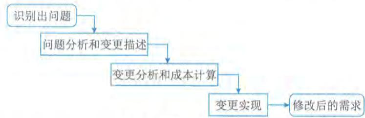
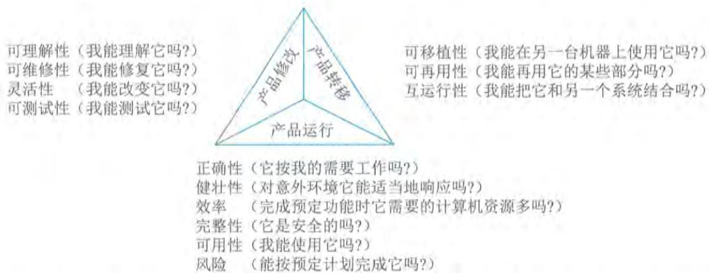
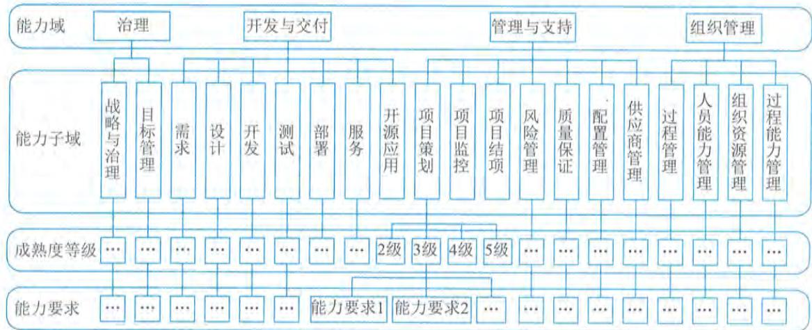
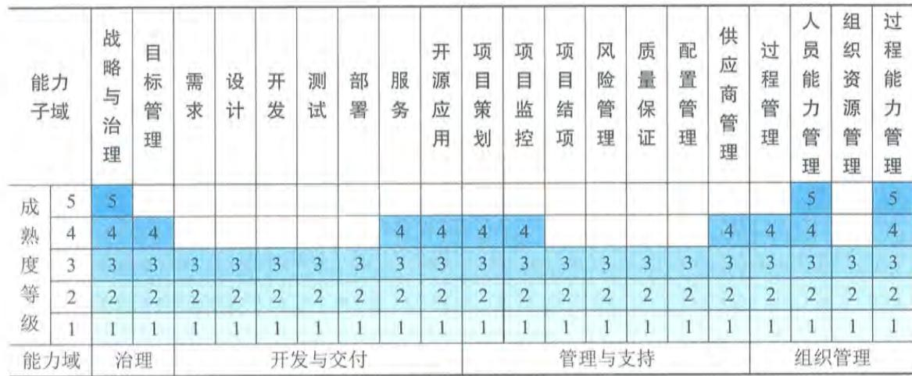

# 第5章 软件工程

20世纪60年代以前，计算机刚刚投入实际使用，软件设计往往只是为了一个特定的应用而在指定的计算机上进行设计和编制；采用密切依赖于计算机的机器代码或汇编语言，软件规模比较小，文档资料通常也不存在，很少使用系统化的开发方法，设计软件往往等同于编制程序，基本上是个人设计、个人使用、个人操作、自给自足的私人化的软件生产方式。

20世纪60年代中期，大容量、高速度计算机的出现，使计算机的应用范围迅速扩大，软件开发量急剧增长，软件系统的规模越来越大，复杂程度越来越高，软件可靠性问题也越来越突出。1968年，软件危机（SoftwareCrisis）的概念被首次提出，具体表现为软件开发进度难以预测、软件开发成本难以控制、软件功能难以满足用户期望、软件质量无法保证、软件难以维护、软件缺少适当的文档资料等，为解决软件危机，软件工程概念诞生。

# 5.1 软件工程定义

软件工程是指应用计算机科学、数学及管理科学等原理，以工程化的原则和方法来解决软件问题的工程，其目的是提高软件生产率、提高软件质量、降低软件成本。电气与电子工程师协会（Institute of Electrical and Electronics Engineers，IEEE）对软件工程的定义是：将系统的、规范的、可度量的工程化方法应用于软件开发、运行和维护的全过程及上述方法的研究。计算机科学家FritzBauer给出的软件工程的定义是：建立并使用完善的工程化原则，以较经济的手段获得能在实际机器上有效运行的可靠软件的一系列方法。

软件工程由方法、工具和过程3个部分组成。软件工程使用的方法是完成软件项目的技术手段，它支持整个软件生命周期；软件工程使用的工具是人们在开发软件的活动中智力和体力的扩展与延伸，它自动或半自动地支持软件的开发和管理，支持各种软件文档的生成；软件工程中的过程贯穿于软件开发的各个环节，是指为获得软件产品，在软件工具的支持下由软件工程师完成的一系列软件工程活动。管理人员在软件工程过程中，要对软件开发的质量、进度、成本进行评估、管理和控制，包括人员组织、计划跟踪与控制、成本估算、质量保证和配置管理等。

# 5.2 软件需求

软件需求是指用户对系统在功能、行为、性能、设计约束等方面的期望。根据IEEE的软件工程标准词汇表，软件需求是指用户解决问题或达到目标所需的条件或能力，是系统或系统部件要满足合同、标准、规范或其他正式规定文档所需具有的条件或能力，以及反映这些条件或能力的文档说明。

# 5.2.1 需求的层次

5.2.1 需求的层次简单地说,软件需求就是系统必须完成的事和必须具备的品质。需求是多层次的,包括业务需求、用户需求和系统需求,这3个不同层次的需求从目标到具体,从整体到局部,从概念到细节。

# 1.业务需求

1. 业务需求业务需求是指反映组织机构或用户对系统、产品高层次的目标要求,从总体上描述了为什么要达到某种效应,组织希望达到什么目标。通常来自项目投资人、购买产品的客户、客户单位的管理人员、市场营销部门或产品策划部门等。通过业务需求可以确定项目视图和范围,项目视图和范围文档把业务需求集中在一个简单、紧凑的文档中,该文档为以后的设计开发工作奠定了基础。

# 2.用户需求

2. 用户需求用户需求描述的是用户的具体目标,或用户要求系统必须能完成的任务和想要达到的结果,这构成了用户原始需求文档的内容。也就是说,用户需求必须能够体现某种系统产品将给用户带来的业务价值,描述了用户能使用系统来做什么。通常采取用户访谈和问卷调查等方式,对用户使用的场景进行整理,从而建立用户需求。

# 3.系统需求

3. 系统需求系统需求是从系统的角度来说明软件的需求,包括功能需求、非功能需求和约束等。功能需求也称为行为需求,它规定了开发人员必须在系统中实现的软件功能,用户利用这些功能来完成任务,满足业务需要。功能需求通常是通过系统特性的描述表现出来的。所谓特性,是指一组逻辑上相关的功能需求,表示系统为用户提供某项功能(服务),使用户的业务目标得以满足。非功能需求描述了系统展现给用户的行为和执行的操作等,它包括产品必须遵从的标准、规范和合约,是指系统必须具备的属性或品质,又可细分为软件质量属性(例如易用性、可维护性、效率等)和其他非功能需求。约束是指对开发人员在软件产品设计和构造上的限制,常见的有设计约束和过程约束。例如,必须采用安全可靠的自主知识产权的数据库系统,必须运行在开源操作系统之下等。

# 5.2.2 质量功能部署

质量功能部署(Quality Function Deployment, QFD),即通过多种角度对产品的特点进行描述,从而反映产品功能,是一种将用户要求转化成软件需求的技术,其目的是最大限度地提升软件工程过程中用户的满意度。为了达到这个目标,QFD将软件需求分为3类,分别是常规需求、期望需求和意外需求。

(1)常规需求。用户认为系统应该做到的功能或性能,实现得越多,用户会越满意。

(2)期望需求。用户想当然认为系统应具备的功能或性能,但并不能正确描述自己想要得到的这些功能或性能需求。如果期望需求没有得到实现,会让用户感到不满意。

(3)意外需求。意外需求也称为兴奋需求,是用户要求范围外的功能或性能(但通常是软

件开发人员很乐意赋予系统的技术特性),实现这些需求用户会更高兴,但不实现也不影响其购买的决策。意外需求是控制在开发人员手中的,开发人员可以选择实现更多的意外需求,以便得到高满意、高忠诚度的用户,也可以(出于成本或项目周期的考虑)选择不实现任何意外需求。

# 5.2.3 需求获取

需求获取是确定和理解不同的项目干系人对系统的需求和约束的过程。需求获取是一件看上去很简单、做起来却很难的事情。需求获取是否科学、准备充分,对获取到的结果影响很大,因为用户往往很难给出完整正确的原始需求,也很难想象出未来的软件应该提供哪些功能,以解决自己的业务问题。因此,需求获取的过程中,只有与用户有效合作、得到软件人员的协助、进行多次沟通讨论才能成功确认需求。常见的需求获取方法包括用户访谈、问卷调查、采样、情节串联板、联合需求计划等。

需求获取是开发者、用户之间为了定义新系统而进行的交流,需求获取是获得系统必要的特征,或者是获得用户能接受的、系统必须满足的约束。如果双方所理解的领域内容在系统分析、设计过程出现问题,通常在开发过程的后期才会被发现,将会使整个系统交付延迟,或者上线的系统无法或难以使用,最终导致项目失败。例如,遗漏的需求或理解错误的需求。

# 5.2.4 需求分析

在需求获取阶段获得的需求是杂乱的,是用户对新系统的期望和要求,这些要求有重复的地方,也有矛盾的地方,这样的要求是不能作为软件设计的基础的。一个好的需求应该具有无二义性、完整性、一致性、可测试性、确定性、可跟踪性、正确性、必要性等特性。因此,需要分析人员把杂乱无章的用户要求和期望转化为用户需求,这就是需求分析的工作。

需求分析将提炼、分析和审查已经获取到的需求,以确保所有的项目干系人都明白其含义,并找出其中的错误、遗漏或其他不足的地方。需求分析的关键在于对问题域的研究与理解。为了便于理解问题域,现代软件工程方法所推荐的做法是对问题域进行抽象,将其分解为若干个基本元素,然后对元素之间的关系进行建模。

# 1.结构化分析

结构化分析(Structured Analysis, SA)方法给出一组帮助系统分析人员产生功能规约的原理与技术,其建立模型的核心是数据字典。围绕这个核心,有3个层次的模型,分别是数据模型、功能模型和行为模型(也称为状态模型)。在实际工作中,一般使用实体关系图(E- R图)表示数据模型,用数据流图(Data Flow Diagram, DFD)表示功能模型,用状态转换图(State Transform Diagram, STD)表示行为模型。E- R图主要描述实体、属性,以及实体之间的关系;DFD从数据传递和加工的角度,利用图形符号通过逐层细分描述系统内各个部件的功能和数据在它们之间传递的情况,来说明系统所完成的功能;STD通过描述系统的状态和引起系统状态转换的事件,来表示系统的行为,指出作为特定事件的结果将执行哪些动作(例如处理数据等)。结构化分析通常包含以下几个步骤:

- 分析业务情况, 做出反映当前物理模型的DFD;- 推导出等价的逻辑模型的DFD;- 设计新的逻辑系统, 生成数据字典和基元描述;- 建立人机接口, 提出可供选择的目标系统物理模型的DFD;- 确定各种方案的成本和风险等级, 据此对各种方案进行分析;- 选择一种方案;- 建立完整的需求规约。

1) DFD 需求建模方法

DFD 需求建模方法也称为过程建模和功能建模方法。DFD 建模方法的核心是数据流, 从应用系统的数据流着手, 以图形方式刻画和表示一个具体业务系统中的数据处理过程和数据流。DFD 建模方法首先抽象出具体应用的主要业务流程, 然后分析其输入, 例如其初始的数据有哪些, 这些数据从哪里来, 将流向何处, 又经过了什么加工, 加工后又变成了什么数据, 这些数据流最终将得到什么结果。通过对系统业务流程的层层追踪和分析, 把要解决的问题清晰地展现及描述出来, 为后续的设计、编程及实现系统的各项功能打下基础。DFD 方法由以下 4 种基本元素 (模型对象) 组成: 数据流、处理/加工、数据存储和外部项。

- 数据流 (Data Flow): 用一个箭头描述数据的流向, 箭头上标注的内容可以是信息说明或数据项。- 处理 (Process): 表示对数据进行的加工和转换, 在图中用矩形框表示。指向处理的数据流为该处理的输入数据, 离开处理的数据流为该处理的输出数据。- 数据存储: 表示用数据库形式 (或者文件形式) 存储的数据, 对其进行的存取分别以指向或离开数据存储的箭头表示。- 外部项: 也称为数据源或者数据终点。描述系统数据的提供者或者数据的使用者, 如教师、学生、采购员、某个组织或部门或其他系统, 在图中用圆角框或者平行四边形框表示。

建立 DFD 图的目的是描述系统的功能需求。DFD 方法利用应用问题域中数据及信息的提供者与使用者、信息的流向、处理和存储这 4 种元素描述系统需求, 建立应用系统的功能模型。具体的建模过程及步骤如下:

(1) 明确目标, 确定系统范围。首先要明确目标系统的功能需求, 并将用户对目标系统的功能需求完整、准确、一致地描述出来, 然后确定模型要描述的问题域。虽然在建模过程中这些内容是逐步细化的, 但必须自始至终保持一致、清晰和准确。

(2) 建立顶层 DFD 图。顶层 DFD 图表达和描述了将要实现的系统的主要功能, 同时也确定了整个模型的内外关系, 表达了系统的边界及范围, 也构成了进一步分解的基础。

(3) 构建第一层 DFD 分解图。根据应用系统的逻辑功能, 把顶层 DFD 图中的处理分解成多个更细化的处理。

(4) 开发 DFD 层次结构图。对第一层 DFD 分解图中的每个处理框做进一步分解, 在分解图中要列出所有的处理及其相关信息, 并要注意分解图中的处理与信息包括父图中的全部内容。分解可采用以下原则: 保持均匀的模型深度; 按困难程度进行选择; 如果一个处理难以确切命

名,可以考虑对它重新分解。

(5)检查确认DFD图。按照规则检查和确定DFD图,以确保构建的DFD模型是正确的、一致的,且满足要求。具体规则包括:父图中描述过的数据流必须要在相应的子图中出现,一个处理至少有一个输入流和一个输出流,一个存储必定有流入的数据流和流出的数据流,一个数据流至少有一端是处理端,模型图中表达和描述的信息是全面的、完整的、正确的和一致的。

经过以上过程与步骤后,顶层图被逐层细化,同时也把面向问题的术语逐渐转化为面向现实的解法,并得到最终的DFD层次结构图。层次结构图中的上一层是下一层的抽象,下一层是上一层的求精和细化,而最后一层中的每个处理都是面向一个具体的描述,即一个处理模块仅描述和解决一个问题。

# 2)数据字典的应用

数据字典(Data Dictionary)是一种用户可以访问的记录数据库和应用程序元数据的目录。数据字典是指对数据的数据项、数据结构、数据流、数据存储、处理逻辑等进行定义和描述,其目的是对数据流图中的各个元素做出详细的说明。简而言之,数据字典是描述数据的信息集合,是对系统中使用的所有数据元素定义的集合。

数据字典最重要的作用是作为分析阶段的工具。任何字典最重要的用途都是供人查询,在结构化分析中,数据字典的作用是给数据流图上的每个元素加以定义和说明。换句话说,数据流图上所有元素的定义和解释的文字集合就是数据字典。数据字典中建立的严密一致的定义,有助于改进分析员和用户的通信与交互。数据字典主要包括数据项、数据结构、数据流、数据存储、处理过程等几个部分。

- 数据项:数据流图中数据块的数据结构中的数据项说明。数据项是不可再分的数据单位。对数据项的描述通常包括数据项名、数据项含义说明、别名、数据类型、长度、取值范围、取值含义及与其他数据项的逻辑关系等。其中,"取值范围""与其他数据项的逻辑关系"定义了数据的完整性约束条件,是设计数据检验功能的依据。若干个数据项可以组成一个数据结构。

- 数据结构:数据流图中数据块的数据结构说明。数据结构反映了数据之间的组合关系。一个数据结构可以由若干个数据项组成,也可以由若干个数据结构组成。或由若干个数据项和数据结构混合组成。对数据结构的描述通常包括数据结构名、含义说明和组成(数据项或数据结构)等。

- 数据流:数据流图中流线的说明。数据流是数据结构在系统内传输的路径。对数据流的描述通常包括数据流名、说明、数据流来源、数据流去向、组成(数据结构)、平均流量、高峰期流量等。其中,"数据流来源"说明该数据流来自哪个过程,即数据的来源;"数据流去向"说明该数据流将到哪个过程去,即数据的去向;"平均流量"是指在单位时间(每天、每周、每月等)里的传输次数;"高峰期流量"则是指在高峰时期的数据流量。

- 数据存储:数据流图中数据块的存储特性说明。数据存储是数据结构停留或保存的地

方，也是数据流的来源和去向之一。对数据存储的描述通常包括数据存储名、说明、编号、流入的数据流、流出的数据流、组成（数据结构）、数据量、存取方式等。其中，“数据量”是指每次存取多少数据，每天（或每小时、每周等）存取几次等信息；“存取方式”指出是批处理还是联机处理，是检索还是更新，是顺序检索还是随机检索等；“流入的数据流”要指出其来源；“流出的数据流”要指出其去向。

- 处理过程：数据流图中功能块的说明。数据字典中只需要描述处理过程的说明性信息，通常包括处理过程名、说明、输入（数据流）、输出（数据流）、处理（简要说明）等。其中，“简要说明”中主要说明该处理过程的功能及处理要求。功能是指该处理过程用来做什么（并不是怎样做）；处理要求包括处理频度要求（如单位时间里处理多少事务、多少数据量）和响应时间要求等，这些处理要求是后续物理设计的输入及性能评价的标准。

# 2. 面向对象分析

面向对象的分析（Object- Oriented Analysis，OOA）方法能正确认识其中的事物及它们之间的关系，找出描述问题域和系统功能所需的类和对象，定义它们的属性和职责，以及它们之间所形成的各种联系。最终产生一个符合用户需求，并能直接反映问题域和系统功能的 OOA 模型及其详细说明。

面向对象分析与结构化分析有较大的区别。OOA 所强调的是在系统调查资料的基础上，针对 OO 方法所需要的素材进行的归类分析和整理，而不是对管理业务现状和方法的分析。OOA 模型由 5 个层次（主题层、对象类层、结构层、属性层和服务层）和 5 个活动（标识对象类、标识结构、定义主题、定义属性和定义服务）组成。在这种方法中定义了两种对象类之间的结构，分别是分类结构和组装结构。分类结构就是所谓的一般与特殊的关系；组装结构则反映了对象之间的整体与部分的关系。

# 1）OOA 的基本原则

OOA 的基本原则主要包括抽象、封装、继承、分类、聚合、关联、消息通信、粒度控制和行为分析。

- 抽象：是从许多事物中舍弃个别的、非本质的特征，抽取共同的、本质性的特征。抽象是形成概念的必要手段。抽象是面向对象方法中使用最为广泛的原则。抽象原则包括过程抽象和数据抽象两个方面。过程抽象是指任何一个完成确定功能的操作序列，其使用者都可以把它看作一个单一的实体，尽管实际上它可能是由一系列更低级的操作完成的。数据抽象是根据施加于数据之上的操作来定义数据类型，并限定数据的值只能由这些操作来修改和观察。数据抽象是 OOA 的核心原则，它强调把数据（属性）和操作（服务）结合为一个不可分的系统单位（对象），对象的外部只需要知道它做什么，而不必知道它如何做。- 封装：把对象的属性和服务结合为一个不可分的系统单位，并尽可能隐蔽对象的内部细节。这个概念也经常用于从外部隐藏程序单元的内部表示。- 继承：特殊类的对象拥有其对应的一般类的全部属性与服务，称作特殊类对一般类的继

承。在OOA中运用继承原则,在特殊类中不再重复地定义一般类中已定义的内容,但是在语义上,特殊类却自动地、隐含地拥有一般类(以及所有更上层的一般类)中定义的全部属性和服务。继承原则的好处是能够使系统模型比较简练、清晰。- 分类:把具有相同属性和服务的对象划分为一类,用类作为这些对象的抽象描述。分类原则实际上是抽象原则运用于对象描述时的一种表现形式。- 聚合:又称组装,其原则是把一个复杂的事物看成若干比较简单的事物的组装体,从而简化对复杂事物的描述。- 关联:关联是人类思考问题时经常运用的思想方法,即通过一个事物联想到另外的事物。能使人发生联想的原因是事物之间确实存在着某些联系。- 消息通信:这一原则要求对象之间只能通过消息进行通信,而不允许在对象之外直接地存取对象内部的属性。通过消息进行通信是由于封装原则而引起的。在OOA中要求用消息连接表示出对象之间的动态联系。- 粒度控制:一般来讲,人在面对一个复杂的问题域时,不可能在同一时刻既能纵观全局,又能洞察秋毫。因此需要控制自己的视野,即考虑全局时,注意其大的组成部分,暂时不考虑具体的细节,考虑某部分的细节时则暂时撇开其余的部分。这就是粒度控制原则。- 行为分析:现实世界中事物的行为是复杂的,由大量的事物所构成的问题域中,各种行为往往相互依赖、相互交织。

2)OOA的基本步骤

OOA大致遵循如下5个基本步骤:

- 确定对象和类:这里所说的对象是对数据及其处理方式的抽象,它反映了系统保存和处理现实世界中某些事物的信息的能力。类是多个对象的共同属性和方法集合的描述,它包括如何在一个类中建立一个新对象的描述。

- 确定结构:结构是指问题域的复杂性和连接关系。类成员结构反映了泛化-特化关系,整体-部分结构反映整体和局部之间的关系。

- 确定主题:主题是指事物的总体概貌和总体分析模型。

- 确定属性:属性就是数据元素,可用来描述对象或分类结构的实例,可在图中给出,并在对象的存储中指定。

- 确定方法:方法是在收到消息后必须进行的一些处理方法,即方法要在图中定义,并在对象的存储中指定。对于每个对象和结构来说,那些用来增加、修改、删除和选择的方法本身都是隐含的(虽然它们是要在对象的存储中定义的,但并不在图上给出),而有些则是显示的。

# 5.2.5 需求规格说明书

软件需求规格说明书(Software Requirement Specification,SRS)是在需求分析阶段需要完成的文档,是软件需求分析的最终结果,是确保每个要求得以满足所使用的方法。编制该文档的目的是使项目干系人与开发团队对系统的初始规定有一个共同的理解,使之成为整个开发工作的

基础。SRS是软件开发过程中最重要的文档之一,任何规模和性质的软件项目都不应该缺少。

在国家标准《计算机软件文档编制规范》(GB/T8567)中,提供了一个SRS的文档模板和编写指南,其中规定SRS应该包括范围、引用文件、需求、合格性规定、需求可追踪性、尚未解决的问题、注解和附录。

(1)范围:包括SRS适用的系统和软件的完整标识,(若适用)包括标识号、标题、缩略词语、版本号和发行号;简述SRS适用的系统和软件的用途,描述系统和软件的一般特性;概述系统开发、运行和维护的历史;标识项目的投资方、需方、用户、承建方和支持机构;标识当前和计划的运行现场;列出其他有关的文档;概述SRS的用途和内容,并描述与其使用有关的保密性和私密性的要求;说明编写SRS所依据的基础。

(2)引用文件:列出SRS中引用的所有文档的编号、标题、修订版本和日期,还应标识不能通过正常的供货渠道获得的所有文档的来源。

(3)需求:这一部分是SRS的主体部分,详细描述软件需求。具体可以分为以下项目:所需的状态和方式、需求概述、需求规格、软件配置项能力需求、软件配置项外部接口需求、软件配置项内部接口需求、适应性需求、保密性和私密性需求、软件配置项环境需求、计算机资源需求(包括硬件需求、硬件资源利用需求、软件需求和通信需求)、软件质量因素、设计和实现约束、数据、操作、故障处理、算法说明、有关人员需求、有关培训需求、有关后勤需求、包装需求和其他需求,以及需求的优先次序和关键程度。

(4)合格性规定:这一部分定义一组合格性的方法,对于第(3)部分中的每个需求指定所使用的方法,以确保需求得到满足。合格性方法包括演示、测试、分析、审查和特殊的合格性方法(例如,专用工具、技术、过程、设施和验收限制等)。

(5)需求可追踪性:这一部分包括从SRS中每个软件配置项的需求到其涉及的系统(或子系统)需求的双向可追踪性。

(6)尚未解决的问题:如果有必要,可以在这一部分说明软件需求中尚未解决的遗留问题。

(7)注解:包含有助于理解SRS的一般信息(例如,背景信息、词汇表、原理等)。这一部分应包含理解SRS所需要的术语和定义,所有缩略语和它们在SRS中的含义的字母序列表。

(8)附录:提供那些为便于维护SRS而单独编排的信息(例如,图表、分类数据等)。为便于处理,附录可以单独装订成册,按字母顺序编排。

另外,国家标准《计算机软件需求规格说明规范》(GB/T9385)中也给出了一个详细的SRS写作大纲,可以作为SRS写作的参考之用。

资深软件工程师都知道,当以SRS为基础进行后续开发工作时,如果在开发后期或在交付系统之后才发现需求存在问题,这时修补需求错误就需要做大量的工作。相对而言,在系统分析阶段,检测SRS中的错误所采取的任何措施都将节省相当多的时间和资金。因此,有必要对于SRS的正确性进行验证,以确保需求符合良好特征。需求验证也称为需求确认,其活动需要确定的内容包括:

- SRS正确地描述了预期的、满足项目干系人需求的系统行为和特征;

- SRS中的软件需求是从系统需求、业务规格和其他来源中正确推导而来的;

- 需求是完整的和高质量的;

需求的表示在所有地方都是一致的;

需求为继续进行系统设计、实现和测试提供了足够的基础。

需求的表示在所有地方都是一致的;需求为继续进行系统设计、实现和测试提供了足够的基础。在实际工作中, 一般通过需求评审和需求测试工作来对需求进行验证。需求评审就是对 SRS 进行技术评审, SRS 的评审是一项精益求精的技术, 它可以发现那些二义性的或不确定性的需求, 为项目干系人提供在需求问题上达成共识的方法。需求的遗漏和错误具有很强的隐蔽性, 仅仅通过阅读 SRS, 通常很难想象在特定环境下系统的行为。只有在业务需求基本明确、用户需求部分确定时, 同步进行需求测试的情况下, 才可能及早发现问题, 从而在需求开发阶段以较低的代价解决这些问题。

# 5.2.6 需求变更

在当前的软件开发过程中, 需求变更已经成为一种常态。需求变更的原因有很多种, 可能是需求获取不完整, 存在遗漏的需求, 可能是对需求的理解产生了误差, 也可能是业务变化导致了需求的变化等。一些需求的改进是合理的且不可避免的, 要使得软件需求完全不变更基本上是不可能的。但毫无控制的变更会导致项目陷入混乱, 不能按进度完成或者软件质量无法保证。

事实上, 迟到的需求变更会对已进行的工作产生非常大的影响。如果不控制变更的影响范围, 在项目开发过程中持续不断地采纳新功能, 不断地调整资源、进度或者质量标准是极为有害的。如果每一个建议的需求变更都采用, 该项目将有可能永远不能完成。软件需求文档应该精确描述要交付的产品与服务, 这是一个基本的原则。为了使开发组织能够严格控制软件项目, 应该确保做到仔细评估已建议的变更、挑选合适的人选对变更做出判定、变更应及时通知所有相关人员、项目要按一定的程序来采纳需求变更, 以实现对变更的过程和状态进行控制。

# 1）变更控制过程

变更控制过程用来跟踪已建议变更的状态, 以确保已建议的变更不会丢失或疏忽。一旦确定了需求基线, 应该使所有已建议的变更都遵循变更控制过程。需求变更管理过程如图 5- 1 所示。

  
图5-1 需求变更管理过程

问题分析和变更描述: 当提出一份变更提议后, 需要对该提议做进一步的问题分析, 检查它的有效性, 从而产生一个更明确的需求变更提议。

变更分析和成本计算: 当接受该变更提议后, 需要对需求变更提议进行影响分析和评估。变更成本计算应该包括该变更所引起的所有改动的成本, 例如修改需求文档、相应

的设计、实现等工作成本。一旦分析完成并且被确认，应该采取是否执行这一变更的决策。

- 变更实现：当确定执行该变更后，需要根据该变更的影响范围，按照开发的过程模型执行相应的变更。在计划驱动过程模型中，往往需要回溯到需求分析阶段开始，重新做对应的需求分析、设计和实现等步骤；在敏捷开发模型中，往往会将需求变更纳入到下一次迭代的执行过程中。

变更控制过程并不是给变更设置障碍。相反地，它是一个渠道和过滤器，通过它可以确保采纳最合适的变更，使变更产生的负面影响降到最低。

# 2）变更策略

控制需求变更与项目其他配置的管理决策有着密切的联系。项目管理应该达成一个策略，用来描述如何处理需求变更，而且策略应具有现实可行性。常见的需求变更策略主要包括：

- 所有需求变更必须遵循变更控制过程；

- 对于未获得批准的变更，不应该做设计和实现工作；

- 应该由项目变更控制委员会决定实现哪些变更；

- 项目风险承担者应该能够了解变更的内容；

- 绝不能从项目配置库中删除或者修改变更请求的原始文档；

- 每一个集成的需求变更必须能跟踪到一个经核准的变更请求。

目前存在很多问题跟踪工具，这些工具用来收集、存储和管理需求变更。问题跟踪工具也可以随时按变更状态分类报告变更请求的数目和实现情况等。

# 3）变更控制委员会

变更控制委员会（Change Control Board，CCB）是项目所有者权益代表，负责裁定接受哪些变更。CCB由项目所涉及的多方成员共同组成，通常包括用户和实施方的决策人员。CCB是决策机构，不是作业机构，通常CCB的工作是通过评审手段来决定项目是否能变更，但不提出变更方案。变更控制委员会可能包括如下方面的代表：

- 产品或计划管理部门；- 项目管理部门；- 开发部门；- 测试或质量保证部门；- 市场部或客户代表；- 用户文档的编制部门；- 技术支持部门；- 桌面或用户服务支持部门；- 配置管理部门。

变更控制委员会应该有一个总则，用于描述变更控制委员会的目的、管理范围、成员构成、做出决策的过程及操作步骤。总则也应该说明举行会议的频度和事由等。管理范围描述该委员会能做什么样的决策，以及哪一类决策应上报到高一级的委员会。过程及操作步骤主要包括制

定决策、交流情况和重新协商约定等。

- 制定决策。制定决策过程的描述应确认:  $①$  变更控制委员会必须到会的人数或做出有效决定必须出席的人数;  $②$  决策的方法,例如投票、一致通过或其他机制;  $③$  变更控制委员会主席是否可以否决该集体的决定等。变更控制委员会应该对每个变更权衡利弊后做出决定: "利"包括节省的资金或额外的收入、增强的客户满意度、竞争优势、减少上市时间等; "弊"是指接受变更后产生的负面影响,包括增加的开发费用、推迟的交付日期、产品质量的下降、减少的功能、用户不满意度等。

- 交流情况。一旦变更控制委员会做出决策,相应的人员应及时更新请求的状态。

- 重新协商约定。变更总是有代价的,即使拒绝的变更也因为决策行为(提交、评估、决策)而耗费了资源。当项目接受了重要的需求变更时,为了适应变更情况,要与管理部门和客户重新协商约定。协商的内容可能包括推迟交付时间、要求增加人手、推迟实现尚未实现的较低优先级的需求,或者质量上进行调整等。

# 5.2.7 需求跟踪

需求跟踪包括编制每个需求同系统元素之间的联系文档,这些元素包括其他需求、体系结构、其他设计部件、源代码模块、测试、帮助文件和文档等,是要在整个项目的工件之间形成水平可追踪性。跟踪能力信息使变更影响分析十分便利,有利于确认和评估实现某个建议的需求变更所必需的工作。

需求跟踪提供了由需求到产品实现整个过程范围的明确查阅的能力。需求跟踪的目的是建立与维护"需求一设计一编程一测试"之间的一致性,确保所有的工作成果符合用户需求。需求跟踪有正向跟踪和逆向跟踪两种方式。

- 正向跟踪:检查SRS中的每个需求是否都能在后继工作成果中找到对应点;

- 逆向跟踪:检查设计文档、代码、测试用例等工作成果是否都能在SRS中找到出处。

正向跟踪和逆向跟踪合称为"双向跟踪"。不论采用何种跟踪方式,都要建立与维护需求跟踪矩阵(表格)。需求跟踪矩阵保存了需求与后继工作成果的对应关系。跟踪能力是优秀SRS的一个特征,为了实现可跟踪能力,必须统一地标识出每一个需求,以便能明确地进行查阅。需求跟踪是一个要求手工操作且劳动强度很大的任务,需要组织提供支持。随着系统开发的进行和维护的执行,要保持关联信息与实际一致。跟踪能力信息一旦过时,可能再也不会重建它。在实际项目中,往往采用专门的配置管理工具来实现需求跟踪。

# 5.3 软件设计

软件设计的目标是根据软件分析的结果,完成软件构建的过程。其主要目的是绘制软件的蓝图,权衡和比较各种技术和实施方法的利弊,合理分配各种资源,构建新的详细设计方案和相关模型,指导软件实施工作的顺利开展。

软件设计是需求的延伸与拓展。需求阶段解决"做什么"的问题,而软件设计阶段解决"怎么做"的问题。同时,它也是系统实施的基础,为系统实施工作做好铺垫。合理的软件设计

方案既可以保证软件的质量,也可以提高开发效率,确保软件实施工作的顺利进行。从方法上来说,软件设计分为结构化设计与面向对象设计。

# 5.3.1 结构化设计

结构化设计(Structured Design, SD)是一种面向数据流的方法,其目的在于确定软件结构。它以SRS和SA阶段所产生的DFD和数据字典等文档为基础,是一个自顶向下、逐层分解、逐步求精和模块化的过程。SD方法的基本思想是将软件设计成由相对独立且具有单一功能的模块组成的结构。从管理角度讲,其分为概要设计和详细设计两个阶段。其中,概要设计又称为总体结构设计,它是开发过程中很关键的一步,其主要任务是确定软件系统的结构,将系统的功能需求进行模块划分,确定每个模块的功能、接口和模块之间的调用关系,形成软件的模块结构图,即系统结构图。在概要设计中,将系统开发的总任务分解成许多个基本的、具体的任务,而为每个具体任务选择适当的技术手段和处理方法的过程称为详细设计。详细设计的主要任务是为每个模块设计实现的细节,根据任务的不同,详细设计又可分为多种,例如,输入/输出设计、处理流程设计、数据存储设计、用户界面设计、安全性和可靠性设计等。

# 1. 模块结构

系统是一个整体,它具有整体性的目标和功能,但这些目标和功能的实现又是由相互联系的各个组成部分共同工作的结果。人们在解决复杂问题时使用的一个很重要的原则,就是将它分解成多个小问题分别处理,在处理过程中,需要根据系统总体要求,协调各业务部门的关系。在SD中,这种功能分解就是将系统划分为模块,模块是组成系统的基本单位,它的特点是可以自由组合、分解和变换,系统中任何一个处理功能都可以看成一个模块。

(1)信息隐藏与抽象。信息隐藏原则要求采用封装技术,将程序模块的实现细节(过程或数据等)隐藏起来,对于不需要这些信息的其他模块来说是不能访问的,使模块接口尽量简单。按照信息隐藏的原则,系统中的模块应设计成"黑盒",模块外部只能使用模块接口说明中给出的信息,如操作和数据类型等。模块之间相对独立,既易于实现,也易于理解和维护。抽象原则要求抽取事物最基本的特性和行为,参见本章5.2.4小节中关于抽象的说明。

(2)模块化。在SD方法中,模块是实现功能的基本单位,它一般具有功能、逻辑和状态3个基本属性。其中,功能是指该模块"做什么",逻辑是描述模块内部"怎么做",状态是该模块使用时的环境和条件。在描述一个模块时,必须按模块的外部特性与内部特性分别描述。模块的外部特性是指模块的模块名、参数表和给程序乃至整个系统造成的影响;模块的内部特性则是指完成其功能的程序代码和仅供该模块内部使用的数据。对于模块的外部环境(例如,需要调用这个模块的上级模块)来说,只需要了解这个模块的外部特性就足够了,不必了解它的内部特性。而软件设计阶段,通常是先确定模块的外部特性,然后再确定它的内部特性。

(3)耦合。耦合表示模块之间联系的程度。紧密耦合表示模块之间联系非常强,松散耦合表示模块之间联系比较弱,非直接耦合则表示模块之间无任何直接联系。模块的耦合类型通常分为7种,根据耦合度从低到高排序如表5-1所示。

表5-1 模块的耦合类型  

<table><tr><td>耦合类型</td><td>描述</td></tr><tr><td>非直接耦合</td><td>两个模块之间没有直接关系，它们之间的联系完全是通过上级模块的控制和调用来实现的</td></tr><tr><td>数据耦合</td><td>一组模块借助参数表传递简单数据</td></tr><tr><td>标记耦合</td><td>一组模块通过参数表传递记录等复杂信息（数据结构）</td></tr><tr><td>控制耦合</td><td>模块之间传递的信息中包含用于控制模块内部逻辑的信息</td></tr><tr><td>通信耦合</td><td>一组模块共用了一组输入信息，或者它们的输出需要整合，以形成完整数据，即共享了输入或输出</td></tr><tr><td>公共耦合</td><td>多个模块都访问同一个公共数据环境，公共的数据环境可以是全局数据结构、共享的通信区、内存的公共覆盖区等</td></tr><tr><td>内容耦合</td><td>一个模块直接访问另一个模块的内部数据；一个模块不通过正常入口转到另一个模块的内部；两个模块有一部分程序代码重叠；一个模块有多个入口等</td></tr></table>

对于模块之间耦合的强度，主要依赖于一个模块对另一个模块的调用、一个模块向另一个模块传递的数据量、一个模块施加到另一个模块的控制的多少，以及模块之间接口的复杂程度等。

（4）内聚。内聚表示模块内部各代码成分之间联系的紧密程度，是从功能角度来度量模块内的联系，一个好的内聚模块应当恰好做目标单一的一件事情。模块的内聚类型通常也可以分为7种，根据内聚度从高到低排序如表5-2所示。

表5-2 模块的内聚类型  

<table><tr><td>内聚类型</td><td>描述</td></tr><tr><td>功能内聚</td><td>完成一个单一功能，各个部分协同工作，缺一不可</td></tr><tr><td>顺序内聚</td><td>处理元素相关，而且必须顺序执行</td></tr><tr><td>通信内聚</td><td>所有处理元素集中在一个数据结构的区域上</td></tr><tr><td>过程内聚</td><td>处理元素相关，而且必须按特定的次序执行</td></tr><tr><td>时间内聚</td><td>所包含的任务必须在同一时间间隔内执行</td></tr><tr><td>逻辑内聚</td><td>完成逻辑上相关的一组任务</td></tr><tr><td>偶然内聚</td><td>完成一组没有关系或松散关系的任务</td></tr></table>

一般来说，系统中各模块的内聚越高，则模块间的耦合就越低，但这种关系并不是绝对的。耦合低使得模块间尽可能相对独立，各模块可以单独开发和维护；内聚高使得模块的可理解性和维护性大大增强。因此，在模块的分解中应尽量减少模块的耦合，力求增加模块的内聚，遵循“高内聚、低耦合”的设计原则。

# 2.系统结构图

2. 系统结构图系统结构图（Structure Chart，SC）又称为模块结构图，它是软件概要设计阶段的工具，反

映系统的功能实现和模块之间的联系与通信,包括各模块之间的层次结构,即反映了系统的总体结构。在系统分析阶段,系统分析师可以采用SA方法获取由DFD、数据字典和加工说明等组成的系统的逻辑模型;在系统设计阶段,系统设计师可根据一些规则,从DFD中导出系统初始的SC。

详细设计的主要任务是设计每个模块的实现算法、所需的局部数据结构。详细设计的目标有两个:实现模块功能的算法要逻辑上正确;算法描述要简明易懂。详细设计必须遵循概要设计来进行。详细设计方案的更改,不得影响到概要设计方案;如果需要更改概要设计,必须经过项目经理的同意。详细设计应该完成详细设计文档,主要是模块的详细设计方案说明。设计的基本步骤如下:

分析并确定输入/输出数据的逻辑结构;

找出输入数据结构和输出数据结构中有对应关系的数据单元;

按一定的规则由输入、输出的数据结构导出程序结构;

列出基本操作与条件,并把它们分配到程序结构图的适当位置;

用伪码写出程序。

详细设计的表示工具有图形工具、表格工具和语言工具。

(I)图形工具。利用图形工具可以把过程的细节用图形描述出来。具体的图形有业务流程图、程序流程图、问题分析图(Problem Analysis Diagram, PAD)、NS流程图(由Nassi和Shneiderman开发,简称NS)等。

业务流程图:是一种描述管理系统内各单位、人员之间的业务关系、作业顺序和管理信息流向的图表。业务流程图的绘制是按照业务的实际处理步骤和过程进行的,它用一些规定的符号及连线表示某个具体业务的处理过程,帮助分析人员找出业务流中的不合理流向。

程序流程图:又称为程序框图,是使用最广泛的一种描述程序逻辑结构的工具。它用方框表示一个处理步骤,用菱形表示一个逻辑条件,用箭头表示控制流向。其优点是结构清晰,易于理解,易于修改;缺点是只能描述执行过程而不能描述有关的数据。

NS流程图:也称为盒图或方框图,是一种强制使用结构化构造的图示工具。其具有以下特点:功能域明确,不可能任意转移控制,很容易确定局部和全局数据的作用域,很容易表示嵌套关系及模板的层次关系。

PAD图:是一种改进的图形描述方式,可以用来取代程序流程图,比程序流程图更直观,结构更清晰。最大的优点是能够反映和描述自顶向下的历史和过程。PAD提供了5种基本控制结构的图示,并允许递归使用。

(2)表格工具。可以用一张表来描述过程的细节,在这张表中列出了各种可能的操作和相应的条件。

(3)语言工具。用某种高级语言来描述过程的细节,例如伪码或PDL(Program Design Language)等。PDL也可称为伪码或结构化语言,它用于描述模块内部的具体算法,以便开发人员之间比较精确地进行交流。语法是开放式的,其外层语法是确定的,而内层语法则不确定。外层语法描述控制结构,它用类似于一般编程语言控制结构的关键字表示,所以是确定的。内

层语法描述具体操作,考虑到不同软件系统的实际操作种类繁多,内层语法因而不确定,它可以按系统的具体情况和不同的设计层次灵活选用。

- PDL的优点:可以作为注释直接插在源程序中;可以使用普通的文本编辑工具或文字处理工具产生和管理;已经有自动处理程序存在,而且可以自动由PDL生成程序代码。- PDL的不足:不如图形工具形象直观,描述复杂的条件组合与动作间的对应关系时不如判定树清晰简单。

# 5.3.2 面向对象设计

面向对象设计(Object- Oriented Design, OOD)是OOA方法的延续,其基本思想包括抽象、封装和可扩展性,其中可扩展性主要通过继承和多态来实现。在OOD中,数据结构和在数据结构上定义的操作算法封装在一个对象之中。由于现实世界中的事物都可以抽象出对象的集合,所以OOD方法是一种更接近现实世界、更自然的软件设计方法。

OOD的主要任务是对类和对象进行设计,这是OOD中最重要的组成部分,也是最复杂和最耗时的部分。其主要包括类的属性、方法,以及类与类之间的关系。OOD的结果就是设计模型。对于OOD而言,在支持可维护性的同时,提高软件的可复用性是一个至关重要的问题,如何同时提高软件的可维护性和可复用性,是OOD需要解决的核心问题之一。在OOD中,可维护性的复用是以设计原则为基础的。

常用的OOD原则包括:

- 单职原则:一个类应该有且仅有一个引起它变化的原因,否则类应该被拆分。

- 开闭原则:对扩展开放,对修改封闭。当应用的需求改变时,在不修改软件实体的源代码或者二进制代码的前提下,可以扩展模块的功能,使其满足新的需求。

- 里氏替换原则:子类可以替换父类,即子类可以扩展父类的功能,但不能改变父类原有的功能。

- 依赖倒置原则:要依赖于抽象,而不是具体实现;要针对接口编程,不要针对实现编程。

- 接口隔离原则:使用多个专门的接口比使用单一的总接口要好。

- 组合重用原则:要尽量使用组合,而不是继承关系达到重用目的。

- 迪米特原则(最少知识法则):一个对象应当对其他对象有尽可能少的了解。其目的是降低类之间的耦合度,提高模块的相对独立性。

在OOD中,类可以分为3种类型:实体类、控制类和边界类。

# 1.实体类

实体类映射需求中的每个实体,是指实体类保存需要存储在永久存储体中的信息。例如,在线教育平台系统可以提取出学员类和课程类,它们都属于实体类。实体类通常都是永久性的,它们所具有的属性和关系是长期需要的,有时甚至在系统的整个生存期都需要。实体类对用户来说是最有意义的类,通常采用业务领域术语命名,一般来说是一个名词,在用例模型向领域模型的转换中,一个参与者一般对应于实体类。通常可以从SRS中的那些与数据库

表（需要持久存储）对应的名词着手来找寻实体类。通常情况下，实体类一定有属性，但不一定有操作。

# 2. 控制类

控制类是用于控制用例工作的类，一般是由动宾结构的短语（“动词  $+$  名词”或“名词  $+$  动词”）转化来的名词。例如，用例“身份验证”可以对应于一个控制类“身份验证器”，它提供了与身份验证相关的所有操作。控制类用于对一个或几个用例所特有的控制行为进行建模，控制对象（控制类的实例）通常控制其他对象，因此，它们的行为具有协调性。

控制类将用例的特有行为进行封装，控制对象的行为与特定用例的实现密切相关，当系统执行用例的时候，就产生了一个控制对象，控制对象经常在其对应的用例执行完毕后消亡。通常情况下，控制类没有属性，但一定有方法。

# 3. 边界类

边界类用于封装在用例内、外流动的信息或数据流。边界类位于系统与外界的交接处，包括所有窗体、报表、打印机和扫描仪等硬件的接口，以及与其他系统的接口。要寻找和定义边界类，可以检查用例模型，每个参与者和用例交互至少要有一个边界类，边界类使参与者能与系统交互。边界类是一种用于对系统外部环境与其内部运作之间的交互进行建模的类。常见的边界类有窗口、通信协议、打印机接口、传感器和终端等。实际上，在系统设计时，产生的报表都可以作为边界类来处理。

边界类用于系统接口与系统外部进行交互，边界对象将系统与其外部环境的变更（例如，与其他系统的接口的变更、用户需求的变更等）分隔开，使这些变更不会对系统的其他部分造成影响。通常情况下，边界类可以既有属性也有方法。

# 5.3.3 统一建模语言

统一建模语言（Unified Modeling Language，UML）是一种定义良好、易于表达、功能强大且普遍适用的建模语言。它融入了软件工程领域的新思想、新方法和新技术，它的作用域不仅支持OOA（面向对象分析法）和OOD（面向对象设计），还支持从需求分析开始的软件开发的全过程。从总体上来看，UML的结构包括构造块、规则和公共机制3个部分，如表5- 3所示。

表5-3UML的结构  

<table><tr><td>部分</td><td>说明</td></tr><tr><td>构造块</td><td>UML有3种基本的构造块，分别是事物（thing）、关系（relationship）和图（diagram）。事物是UML的重要组成部分，关系把事物紧密联系在一起，图是多个相互关联的事物的集合</td></tr><tr><td>规则</td><td>规则是构造块如何放在一起的规定，包括：为构造块命名；给一个名字以特定含义的语境，即范围；怎样使用或看见名字，即可见性；事物如何正确、一致地相互联系，即完整性；运行或模拟动态模型的含义是什么，即执行</td></tr><tr><td>公共机制</td><td>公共机制是指达到特定目标的公共UML方法，主要包括规格说明（详细说明）、修饰、公共分类（通用划分）和扩展机制4种</td></tr></table>

# 1.UML中的事物

1. UML 中的事物UML 中的事物也称为建模元素，包括结构事物（Structural Things）、行为事物（Behavioral Things，也称动作事物）、分组事物（Grouping Things）和注释事物（Annotational Things，也称注解事物）。这些事物是 UML 模型中最基本的 OO（面向对象）构造块，如表 5-4 所示。

表5-4 UML中的事物  

<table><tr><td>建模元素</td><td>说明</td></tr><tr><td>结构事物</td><td>结构事物在模型中属于最静态的部分，代表概念上或物理上的元素。UML 有 7 种结构事物，分别是类、接口、协作、用例、活动类、构件和节点</td></tr><tr><td>行为事物</td><td>行为事物是 UML 模型中的动态部分，代表时间和空间上的动作。UML 有两种主要的行为事物：第一种是交互（内部活动），交互是由一组对象之间在特定上下文中，为达到特定目的而进行的一系列消息交换而组成的动作，交互中组成动作的对象的每个操作都要详细列出，包括消息、动作次序（消息产生的动作）、连接（对象之间的连接）；第二种是状态机，状态机由一系列对象的状态组成</td></tr><tr><td>分组事物</td><td>分组事物是 UML 模型中的组织部分，可以把它们看成盒子，模型可以在其中进行分解。UML 只有一种分组事物，称为包。包是一种将有组织的元素分组的机制。与构件不同的是，包纯粹是一种概念上的事物，只存在于开发阶段，而构件可以存在于系统运行阶段</td></tr><tr><td>注释事物</td><td>注释事物是 UML 模型的解释部分</td></tr></table>

# 2.UML中的关系

UML用关系把事物结合在一起，主要有4种关系：依赖、关联、泛化和实现。

（1）依赖（Dependency）。依赖是两个事物之间的语义关系，其中一个事物发生变化会影响另一个事物的语义。

（2）关联（Association）。关联是指一种对象和另一种对象有联系。

（3）泛化（Generalization）。泛化是一般元素和特殊元素之间的分类关系，描述特殊元素的对象可替换一般元素的对象。

（4）实现（Realization）。实现将不同的模型元素（例如，类）连接起来，其中的一个类指定了由另一个类保证执行的契约。

# 3.UML2.0中的图

UML2.0包括14种图，如表5- 5所示

表5-5 UML2.0中的图  

<table><tr><td>种类</td><td>说明</td></tr><tr><td>类图（Class Diagram）</td><td>类图描述一组类、接口、协作和它们之间的关系。在 OO 系统的建模中，最常见的图就是类图。类图给出了系统的静态设计视图，活动类的类图给出了系统的静态进程视图</td></tr><tr><td>对象图（Object Diagram）</td><td>对象图描述一组对象及它们之间的关系。对象图描述了在类图中所建立的事物实例的静态快照。和类图一样，这些图给出系统的静态设计视图或静态进程视图，但它们是从真实案例或原型案例的角度建立的</td></tr></table>

<table><tr><td>种类</td><td>说明</td></tr><tr><td>构件图(Component Diagram)</td><td>构件图描述一个封装的类和它的接口、端口，以及由内嵌的构件和连接件构成的内部结构。构件图用于表示系统的静态设计实现视图。对于由小的部件构建大的系统来说，构件图是很重要的。构件图是类图的变体</td></tr><tr><td>组合结构图(Composite Structure Diagram)</td><td>组合结构图描述类中的内部构造，包括结构化类与系统其余部分的交互点。组合结构图用于画出结构化类的内部内容。组合结构图比类图更抽象</td></tr><tr><td>用例图(Use Case Diagram)</td><td>用例图是用户与系统交互的最简表示形式。用例图给出系统的静态用例视图。这些图在对系统的行为进行组织和建模时是非常重要的</td></tr><tr><td>顺序图(Sequence Diagram,也称序列图)</td><td>顺序图也是一种交互图，它是强调消息的时间次序的交互图（Interaction Diagram）。交互图展现了一种交互，它由一组对象或参与者以及它们之间可能发送的消息构成。交互图专注于系统的动态视图</td></tr><tr><td>通信图(Communication Diagram)</td><td>通信图也是一种交互图，它强调收发消息的对象或参与者的结构组织。顺序图和通信图表达了类似的基本概念，但它们所强调的概念不同，顺序图强调的是时序，通信图表达的是对象之间相互协作完成一个复杂功能。在UML 1.X 版本中，通信图称为协作图（Collaboration Diagram）</td></tr><tr><td>定时图(Timing Diagram,也称计时图)</td><td>定时图也是一种交互图，用来描述对象或实体随时间变化的状态或值，及其相应的时间或期限约束。它强调消息跨越不同对象或参与者的实际时间，而不只是关心消息的相对顺序</td></tr><tr><td>状态图(State Diagram)</td><td>状态图描述一个实体基于事件反应的动态行为，显示了该实体如何根据当前所处的状态对不同的事件做出反应。它由状态、转移、事件、活动和动作组成。状态图给出了对象的动态视图。它对于接口、类或协作的行为建模尤为重要，而且它强调事件导致的对象行为，这非常有助于对反应式系统建模</td></tr><tr><td>活动图(Activity Diagram)</td><td>活动图将进程或其他计算结构展示为计算内部一步步的控制流和数据流。活动图专注于系统的动态视图。它对系统的功能建模和业务流程建模特别重要，并强调对象间的控制流程。活动图在本质上是一种流程图</td></tr><tr><td>部署图(Deployment Diagram)</td><td>部署图描述对运行时的处理节点及在其中生存的构件的配置。部署图给出了架构的静态部署视图。通常一个节点包含一个或多个部署图</td></tr><tr><td>制品图(Artifact Diagram)</td><td>制品图描述计算机中一个系统的物理结构。制品包括文件、数据库和类似的物理比特集合。制品图通常与部署图一起使用。制品也给出了它们实现的类和构件</td></tr><tr><td>包图(Package Diagram)</td><td>包图描述由模型本身分解而成的组织单元，以及它们之间的依赖关系</td></tr><tr><td>交互概览图(Interaction Overview Diagram)</td><td>交互概览图是活动图和顺序图的混合物</td></tr></table>

# 4. UML 视图

UML 对系统架构的定义是系统的组织结构，包括系统分解的组成部分，以及它们的关联性、交互机制和指导原则等提供系统设计的信息。具体来说，就是指逻辑视图、进程视图、实现视图、部署视图和用例视图这 5 个系统视图。

(1) 逻辑视图。逻辑视图也称为设计视图, 它用系统静态结构和动态行为来展示系统内部的功能是如何实现的, 其侧重点在于如何得到功能。它表示了设计模型中在架构方面具有重要意义的部分, 即类、子系统、包和用例实现的子集。

(2) 进程视图。进程视图是可执行线程和进程作为活动类的建模, 它是逻辑视图的一次执行实例, 描述了并发与同步结构。

(3) 实现视图。实现视图对组成基于系统的物理代码的文件和构件进行建模。

(4) 部署视图。部署视图把构件部署到一组物理节点上, 表示软件到硬件的映射和分布结构。

(5) 用例视图。用例视图是最基本的需求分析模型。它从外部角色的视角来展示系统功能。

另外, UML 还允许在一定的阶段隐藏模型的某些元素、遗漏某些元素, 以及不保证模型的完整性, 但模型要逐步地达到完整和一致。

# 5.3.4 设计模式

设计模式是前人经验的总结, 它使人们可以方便地复用成功的软件设计。当人们在特定的环境下遇到特定类型的问题, 采用他人已使用过的一些成功的解决方案, 一方面可以降低分析、设计和实现的难度, 另一方面可以使系统具有更好的可复用性和灵活性。设计模式包含模式名称、问题、目的、解决方案、效果、实例代码和相关设计模式等基本要素。

根据处理范围不同, 设计模式可分为类模式和对象模式。类模式处理类和子类之间的关系, 这些关系通过继承建立, 在编译时刻就被确定下来, 属于静态关系; 对象模式处理对象之间的关系, 这些关系在运行时刻变化, 更具动态性。

根据目的和用途不同, 设计模式可分为创建型 (Creational) 模式、结构型 (Structural) 模式和行为型 (Behavioral) 模式 3 种。创建型模式主要用于创建对象, 包括工厂方法模式、抽象工厂模式、原型模式、单例模式和建造者模式等; 结构型模式主要用于处理类或对象的组合, 包括适配器模式、桥接模式、组合模式、装饰模式、外观模式、享元模式和代理模式等; 行为型模式主要用于描述类或对象的交互以及职责的分配, 包括职责链模式、命令模式、解释器模式、迭代器模式、中介者模式、备忘录模式、观察者模式、状态模式、策略模式、模板方法模式、访问者模式等。

# 5.4 软件实现

软件设计完成后, 进入软件开发实现过程, 在此过程中, 我们需要重点关注软件配置管理、软件编码、软件测试、部署交付以及软件过程能力成熟度建设等。

# 5.4.1 软件配置管理

软件配置管理 (Software Configuration Management, SCM) 是一种标识、组织和控制修改的技术。软件配置管理应用于整个软件工程过程。在软件建立时变更是不可避免的, 而变更加剧了项目中软件开发者之间的混乱。SCM 活动的目标就是标识变更、控制变更、确保变更正确

实现,并向其他有关人员报告变更。从某种角度讲,SCM 是一种标识、组织和控制修改的技术,目的是使错误降为最小,并最有效地提高生产效率。

软件配置管理的核心内容包括版本控制和变更控制。

# 1.版本控制（VersionControl）

版本控制是指对软件开发过程中各种程序代码、配置文件及说明文档等文件变更的管理,是软件配置管理的核心思想之一。版本控制最主要的功能就是追踪文件的变更。它将什么时候、什么人更改了文件的什么内容等信息如实地记录下来。每一次文件的改变,文件的版本号都将增加。除了记录版本变更外,版本控制的另一个重要功能是并行开发。软件开发往往是多人协同作业,版本控制可以有效地解决版本的同步以及不同开发者之间的开发通信问题,提高协同开发的效率。并行开发中最常见的不同版本软件的错误(Bug)修正问题也可以通过版本控制中分支与合并的方法有效地解决。

# 2.变更控制（ChangeControl）

变更控制的目的并不是控制变更的发生,而是对变更进行管理,确保变更有序进行。对于软件开发项目来说,发生变更的环节比较多,因此变更控制显得格外重要。项目中引起变更的因素有两个:一是来自外部的变更要求,如客户要求修改工作范围和需求等;二是开发过程中内部的变更要求,如为解决测试中发现的一些错误而修改源码,甚至改变设计。比较而言,最难处理的是来自外部的需求变更,因为IT项目需求变更的概率大,引发的工作量也大(特别是到项目的后期)。

软件配置管理与软件质量保证活动密切相关,可以帮助达成软件质量保证目标。软件配置管理活动包括软件配置管理计划、软件配置标识、软件配置控制、软件配置状态记录、软件配置审计、软件发布管理与交付等活动。

软件配置管理计划:软件配置管理计划的制订需要了解组织结构环境和组织单元之间的联系,明确软件配置控制任务;软件配置标识:识别要控制的配置项,并为这些配置项及其版本建立基线;软件配置控制:关注的是管理软件生命周期中的变更;软件配置状态记录:标识、收集、维护并报告配置管理的配置状态信息;软件配置审计:独立评价软件产品和过程是否遵从已有的规则、标准、指南、计划和流程而进行的活动;软件发布管理与交付:通常需要创建特定的交付版本,完成此任务的关键是软件库。

# 5.4.2 软件编码

目前,人和计算机通信仍需使用人工设计的语言,也就是程序设计语言。所谓编码,就是把软件设计的结果翻译成计算机可以"理解和识别"的形式——用某种程序设计语言书写的程序。作为软件工程的一个步骤,编码是设计的自然结果,因此,程序的质量主要取决于软件设计的质量。但是,程序设计语言的特性和编码途径也会对程序的可靠性、可读性、可测试性和可维护性产生深远的影响。

(1)程序设计语言。编码的目的是实现人和计算机的通信,指挥计算机按人的意志正确工作。程序设计语言是人和计算机通信的最基本工具,程序设计语言的特性不可避免地会影响人的思维和解决问题的方式,会影响人和计算机通信的方式和质量,也会影响他人阅读和理解程序的难易程度。因此,编码之前的一项重要工作就是选择一种恰当的程序设计语言。

(2)程序设计风格。在软件生存期内,开发者经常要阅读程序。特别是在软件测试阶段和维护阶段,编写程序的人员与参与测试、维护的人员要阅读程序。因此,阅读程序是软件开发和维护过程中的一个重要组成部分,而且读程序的时间比写程序的时间还要多。这就要求编写的程序不仅自己看得懂,而且也要让别人能看懂。20世纪70年代初,有人提出在编写程序时,应使程序具有良好的风格。程序设计风格包括4个方面:源程序文档化、数据说明、语句结构和输入/输出方法。应尽量从编码原则的角度提高程序的可读性,改善程序的质量。

(3)程序复杂性度量。经过详细设计后每个模块的内容都已非常具体,因此可以使用软件设计的基本原理和概念仔细衡量它们的质量。但是,这种衡量毕竟只能是定性的,人们希望能进一步定量度量软件的性质。定量度量程序复杂程度的方法很有价值,把程序的复杂度乘以适当的常数即可估算出软件中故障的数量及软件开发时的工作量。定量度量的结构可以用于比较两个不同设计或两种不同算法的优劣,程序定量的复杂程度可以作为模块规模的精确限度。

(4)编码效率。主要包括:

- 程序效率:程序的效率是指程序的执行速度及程序所需占用的内存空间。一般来说,任何对效率无重要改善,且对程序的简单性、可读性和正确性不利的程序设计方法都是不可取的。

- 算法效率:源程序的效率与详细设计阶段确定的算法的效率直接相关。在详细设计翻译转换成源程序代码后,算法效率反映为程序的执行速度和对存储容量的要求。

- 存储效率:存储容量对软件设计和编码的制约很大。因此要选择可生成较短目标代码且存储压缩性能优良的编译程序,有时需要采用汇编程序,通过程序员富有创造性的努力,提高软件的时间与空间效率。提高存储效率的关键是程序的简单化。

- I/O效率:输入/输出可分为两种类型,一种是面向人(操作员)的输入/输出,另一种是面向设备的输入/输出。如果操作员能够十分方便、简单地输入数据,或者能够十分直观、一目了然地了解输出信息,则可以说面向人的输入/输出是高效的。至于面向设备的输入/输出,主要考虑设备本身的性能特性。

# 5.4.3 软件测试

软件测试是在将软件交付给客户之前所必须完成的重要步骤。软件测试是使用人工或自动的手段来运行或测定某个软件系统的过程,其目的在于检验它是否满足规定的需求或弄清预期结果与实际结果之间的差别。

软件测试的目的就是确保软件的质量,确认软件以正确的方法是检查软件是否做了用户所期望的事情,所以软件测试工作主要是发现软件的错误,有效定义和实现软件成分由低层到高层的组装过程,验证软件是否满足任务书和系统定义文档所规定的技术要求,为软件质量模型的建立提供依据。软件测试不仅要确保软件的质量,还要给开发人员提供信息,以方便其为风

险评估做相应的准备,重要的是软件测试要贯穿在整个软件开发过程中,保证整个软件开发的过程是高质量的。目前,软件的正确性证明尚未得到根本的解决,软件测试仍是发现软件错误(缺陷)的主要手段。根据国家标准《计算机软件测试规范》(GB/T 15532),软件测试的目的是验证软件是否满足软件开发合同或项目开发计划、系统/子系统设计文档、SRS、软件设计说明和软件产品说明等规定的软件质量要求。通过测试,发现软件缺陷,为软件产品的质量测量和评价提供依据。

# 1. 测试方法

软件测试方法可分为静态测试和动态测试。

1)静态测试

静态测试是指被测试程序不在机器上运行,只依靠分析或检查源程序的语句、结构、过程等来检查程序是否有错误,即通过对软件的需求规格说明书、设计说明书以及源程序做结构分析和流程图分析,从而找出错误。静态测试包括对文档的静态测试和对代码的静态测试。对文档的静态测试主要以检查单的形式进行,而对代码的静态测试一般采用桌前检查(Desk Checking)、代码走查和代码审查的方式。经验表明,使用这种方法能够有效地发现 $30\% \sim 70\%$  的逻辑设计和编码错误。

2)动态测试

动态测试是指在计算机上实际运行程序进行软件测试,对得到的运行结果与预期的结果进行比较分析,同时分析运行效率和健壮性能等。一般采用白盒测试和黑盒测试方法。

白盒测试也称为结构测试,主要用于软件单元测试中。它的主要思想是,将程序看作一个透明的白盒,测试人员完全清楚程序的结构和处理算法,按照程序内部逻辑结构设计测试用例,检测程序中的主要执行通路是否都能按设计规格说明书的设定进行。白盒测试方法是从程序结构方面出发对测试用例进行设计,主要用于检查各个逻辑结构是否合理,对应的模块独立路径是否正常,以及内部结构是否有效,包括控制流测试、数据流测试和程序变异测试等。另外,使用静态测试的方法也可以实现白盒测试。例如,使用人工检查代码的方法来检查代码的逻辑问题,也属于白盒测试的范畴。白盒测试方法中,最常用的技术是逻辑覆盖,即使用测试数据运行被测程序,考查对程序逻辑的覆盖程度,主要的覆盖标准有语句覆盖、判定覆盖、条件覆盖、条件/判定覆盖、条件组合覆盖、修正的条件/判定覆盖和路径覆盖等。

黑盒测试也称为功能测试,它是通过测试来检测每个功能能否正常使用。黑盒测试将程序看作一个不透明的黑盒,完全不考虑(或不了解)程序的内部结构和处理算法,根据需求规格说明书设计测试实例,并检查程序的功能是否能够按照规范说明准确无误地运行。对于黑盒测试行为必须加以量化才能够有效地保证软件的质量。黑盒测试根据SRS所规定的功能来设计测试用例,一般包括等价类划分、边界值分析、判定表、因果图、状态图、随机测试、猜错法和正交试验法等。

# 2. 测试类型

根据国家标准《计算机软件测试规范》(GB/T 15532),软件测试可分为单元测试、集成测试、确认测试、系统测试、配置项测试和回归测试等类别,如表5- 6所示。

<table><tr><td>测试类型</td><td>说明</td></tr><tr><td>单元测试</td><td>单元测试主要是对该软件的模块进行测试，测试的对象是可独立编译或汇编的程序模块、软件构件或OO软件中的类（统称为模块），其目的是检查每个模块能否正确地实现设计说明中的功能、性能、接口和其他设计约束等条件，发现模块内可能存在的各种差错。单元测试的技术依据是软件详细设计说明书，着重从模块接口、局部数据结构、重要的执行通路、出错处理通路和边界条件等方面对模块进行测试</td></tr><tr><td>集成测试</td><td>集成测试一般要对已经严格按照程序设计要求和标准组装起来的模块同时进行测试，明确该程序结构组装的正确性，发现和接口有关的问题。在这一阶段，一般采用白盒测试和黑盒测试结合的方法进行测试，验证这一阶段设计的合理性以及需求功能的实现性。集成测试的技术依据是软件概要设计文档。除应满足一般的测试准入条件外，在进行集成测试前还应确认待测试的模块均已通过单元测试</td></tr><tr><td>确认测试</td><td>确认测试主要用于验证软件的功能、性能和其他特性是否与用户需求一致</td></tr><tr><td>系统测试</td><td>系统测试的对象是完整的、集成的计算机系统，目的是在真实系统工作环境下，检测完整的软件配置项能否和系统正确连接，并满足系统/子系统设计文档和软件开发合同规定的要求。主要测试内容包括功能测试、性能测试、健壮性测试、安装或反安装测试、用户界面测试、压力测试、可靠性及安全性测试等。其中，最重要的工作是进行功能测试与性能测试。功能测试主要采用黑盒测试方法；性能测试主要验证软件系统在承担一定负载的情况下所表现出来的特性是否符合客户的需要。系统测试过程较为复杂，由于在系统测试阶段不断变更需求造成功能的删除或增加；从而使程序不断出现相应的更改，而程序在更改后可能会出现新的问题，或者原本没有问题的功能由于更改导致出现问题。所以，测试人员必须进行多轮回归测试。系统测试的结束标志是测试工作已满足测试目标所规定的需求覆盖率，并且测试所发现的缺陷已全部归零</td></tr><tr><td>配置项测试</td><td>配置项测试的对象是软件配置项，配置项测试的目的是检验软件配置项与SRS的一致性。配置项测试的技术依据是SRS（含接口需求规格说明）。除应满足一般测试的准入条件外，在进行配置项测试之前，还应确认被测软件配置项已通过单元测试和集成测试</td></tr><tr><td>回归测试</td><td>回归测试的目的是测试软件变更之后，变更部分的正确性和对变更需求的符合性，以及软件原有的、正确的功能、性能和其他规定的要求的不损害性</td></tr></table>

# 3. 面向对象的测试

OO系统的测试目标与传统信息系统的测试目标是一致的，但OO系统的测试策略与传统的结构化系统的测试策略有很大的不同，这种不同主要体现在两个方面，分别是测试的焦点从模块移向了类，以及测试的视角扩大到了分析和设计模型。与传统的结构化系统相比，OO系统具有3个明显特征，即封装性、继承性与多态性。正是由于这3个特征，给OO系统的测试带来了一系列的困难。封装性决定了OO系统的测试必须考虑到信息隐蔽原则对测试的影响，以及对象状态与类的测试序列；继承性决定了OO系统的测试必须考虑到继承对测试充分性的影响，以及误用引起的错误；多态性决定了OO系统的测试必须考虑到动态绑定对测试充分性的影响，抽象类的测试及误用对测试的影响。

# 4.软件调试

4. 软件调试软件调试(排错)与成功的测试形影相随。测试成功的标志是发现了错误,根据错误迹象确定错误的原因和准确位置,并加以改正,主要依靠软件调试技术。常用的软件调试策略可以分为蛮力法、回溯法和原因排除法。

# 5.5 部署交付

5.5 部署交付软件开发完成后,必须部署在最终用户的正式运行环境,交付给最终用户使用,才能为用户创造价值。传统的软件工程不包括软件部署与交付,但不断增长的软件复杂度和部署所面临的风险,迫使人们开始关注软件部署。软件部署是一个复杂的过程,包括从开发商发放产品,到应用者在他们的计算机上实际安装并维护应用的所有活动。这些活动包括开发商的软件打包,组织及用户对软件的安装、配置、测试、集成和更新等。同时,需求和市场的不断变化导致软件的部署和交付不再是一劳永逸的,而是一个持续不断的过程,伴随在整个软件的开发过程中。

# 5.5.1 软件部署

软件部署是软件生命周期中的一个重要环节,属于软件开发的后期活动,即通过配置、安装和激活等活动来保障软件产品的后续运行。部署技术影响着整个软件过程的运行效率和投入成本,软件系统部署的管理代价占到整个软件管理开销的大部分。其中软件配置过程极大地影响着软件部署结果的正确性,应用系统的配置是整个部署过程中的主要错误来源。据Standish Group的统计,软件的缺陷所造成的损失,相当大的部分是由于部署的失败所引起的,可见软件部署工作的重要意义。

(1)软件部署存在着风险,这是由以下原因造成的:应用软件越来越复杂,包括许多构件、版本和变种;应用发展很快,相继两个版本的间隔很短(可能只有几个月);环境的不确定性;构件来源的多样性等。

(2)软件部署过程的主要特征有:过程覆盖度、过程可变更性、过程间协调和模型抽象。已经提出一些抽象的软件部署模型,用于有效地指导部署过程,包括应用模型、组织模型、站点模型、产品模型、策略模型和部署模型。

(3)软件部署过程中需要关注的问题有:安装和系统运行的变更管理,构件之间的相依、协调,内容发放,管理异构平台,部署过程的可变更性,与互联网的集成和安全性。

(4)软件部署的目的是支持软件运行,满足用户需求,使得软件系统能够被直接使用并保障软件系统的正常运行和功能实现,简化部署的操作过程,提高执行效率,同时还必须满足软件用户在功能和非功能属性方面的个性化需求。

(5)软件部署模式分为面向单机软件的部署模式、集中式服务器应用部署和基于微服务的分布式部署。面向单机软件的部署模式主要适用于运行在操作系统之上的单机类型的软件,如软件的安装、配置和卸载;集中式服务器应用部署主要适用于用户访问量小(500人以下)、硬件环境要求不高的情况,诸如中小组织、高校在线学习、实训平台等;基于微服务的分布式部

署主要适用于用户访问量大、并发性要求高的云原生应用,通常需要借助容器和 DevOps 技术进行持续部署与集成。

# 5.5.2 软件交付

传统的软件交付过程是指在编程序改代码之后,直到将软件发布给用户使用之前的一系列活动,如提交、集成、构建、部署、测试等。传统软件交付流程通常包括4个步骤:首先,业务人员会诞生一个软件的想法;然后,开发人员将这个想法变为一个产品或者功能;经过测试人员的测试之后提交给用户使用并产生收益;最后,运维人员参与产品或功能的后期运维。传统软件交付流程可能存在的问题包括以下3个方面。

(1)业务人员产生的需求文档沟通效率较低,有时会产生需求文档描述不明确、需求文档变更频繁等问题。

(2)随着开发进度的推进,测试人员的工作量会逐步增加,测试工作的比重会越来越大,而且由于测试方法和测试工具有限,自动化测试程度低,无法很好地把控软件质量。

(3)真实项目中运维的排期经常会被挤占,又因为手工运维烦琐复杂,时间和技术上的双重压迫会导致运维质量难以保证。

因为存在以上问题,所以传统的软件交付经常会出现开发团队花费大量成本开发出的功能或产品并不能满足客户需求的局面。由此可以总结出传统的软件交付存在2个层面的困境。

(1)从表现层来看,传统软件交付存在进度不可控、流程不可控、环境不稳定、协作不顺畅等困境;

(2)表现层的问题其实都是由底层问题引起的,从根源上来说,存在分支冗余导致合并困难,缺陷过多导致阻塞测试,开发环境、测试环境、部署环境不统一导致的未知错误,代码提交版本混乱无法回溯,等待上线周期过长,项目部署操作复杂经常失败,上线之后出现问题需要紧急回滚,架构设计不合理导致发生错误之后无法准确定位等困境。

# 5.5.3 持续交付

经过对传统软件交付问题的分析和总结,持续交付应运而生,持续交付是一系列开发实践方法,用来确保代码能够快速、安全地部署到生产环境中。持续交付是一个完全自动化的过程,当业务开发完成的时候,可以做到一键部署。持续交付提供了一套更为完善的解决传统软件开发流程的方案,主要体现在:

- 在需求阶段,抛弃了传统的需求文档的方式,使用便于开发人员理解的用户故事;

- 在开发测试阶段,做到持续集成,让测试人员尽早进入项目开始测试;

- 在运维阶段,打通开发和运维之间的通路,保持开发环境和运维环境的统一。

持续交付具备的优势主要包括:

- 持续交付能够有效缩短提交代码到正式部署上线的时间,降低部署风险;

- 持续交付能够自动地、快速地提供反馈,及时发现和修复缺陷;

- 持续交付让软件在整个生命周期内都处于可部署的状态;

- 持续交付能够简化部署步骤,使软件版本更加清晰;

- 持续交付能够让交付过程成为一种可靠的、可预期的、可视化的过程。

在评价互联网公司的软件交付能力的时候,通常会使用两个指标:一是仅涉及一行代码的改动需要花费多少时间才能部署上线,这是核心指标;二是开发团队是否在以一种可重复、可靠的方式执行软件交付。

目前,国内外的主流互联网组织部署周期都以分钟为单位,互联网巨头组织单日的部署频率都在8000次以上,部分组织达20000次以上。高频率的部署代表着能够更快更好地响应客户的需求。

# 5.5.4 持续部署

对于持续交付整体来说,持续部署非常重要。

# 1. 持续部署方案

容器技术是目前部署中最流行的技术,常用的持续部署方案有Kubernetes+Docker和Matrix系统两种。容器技术一经推出就被广泛地接受和应用,对比传统的虚拟机技术,其优点主要有:

- 容器技术上手简单,轻量级架构,体积很小;

- 容器技术的集合性更好,能更容易对环境和软件进行打包复制和发布。

容器技术的引入为软件的部署带来了前所未有的改进,不但解决了复制和部署麻烦的问题,还能更精准地将环境中的各种依赖进行完整的打包。

# 2. 部署原则

在持续部署管理的时候,需要遵循一定的原则,主要包括:

- 部署包全部来自统一的存储库;

- 所有的环境使用相同的部署方式;

- 所有的环境使用相同的部署脚本;

- 部署流程编排阶梯式晋级,即在部署过程中需要设置多个检查点,一旦发生问题可以有序地进行回滚操作;

- 整体部署由运维人员执行;

- 仅通过流水线改变生产环境,防止配置漂移;

- 不可变服务器;

- 部署方式采用蓝绿部署或金丝雀部署。

# 3. 部署层次

部署层次的设置对于部署管理来说也是非常重要的。首先要明确部署的目的并不是部署一个可工作的软件,而是部署一套可正常运行的环境。完整的镜像部署包括3个环节:Build- Ship- Run。

- Build:跟传统的编译类似,将软件编译形成RPM包或者Jar包;

- Ship:将所需的第三方依赖和第三方插件安装到环境中;

- Run:就是在不同的地方启动整套环境。

制作完成部署包之后,每次需要变更软件或者第三方依赖、插件升级的时候,不需要重新打包,直接更新部署包即可。

# 4. 不可变服务器

在部署原则中提到的不可变服务器原则对于部署管理来说非常重要。不可变服务器是技术逐步演化的结果。在早期阶段,软件的部署是在物理机上进行的,每一台服务器的网络、存储、软件环境都是不同的,物理机的不稳定让环境重构变得异常困难。后来逐渐发展为虚拟机部署,在虚拟机上借助流程化的部署能较好地构建软件环境,但是第三方依赖库的重构不稳定为整体部署带来了困难。现阶段使用容器部署不但继承和优化了虚拟机部署的优点,而且很好地解决了第三方依赖库的重构问题,容器部署就像一个集装箱,直接把所有需要的内容全部打包进行复制和部署。

# 5. 蓝绿部署和金丝雀部署

在部署原则中提到的两大部署方式分别为蓝绿部署和金丝雀部署。蓝绿部署是指在部署的时候准备新旧两个部署版本,通过域名解析切换的方式将用户使用环境切换到新版本中,当出现问题的时候,可以快速地将用户环境切回旧版本,并对新版本进行修复和调整。金丝雀部署是指当有新版本发布的时候,先让少量的用户使用新版本,并且观察新版本是否存在问题,如果出现问题,就及时处理并重新发布,如果一切正常,就稳步地将新版本适配给所有的用户。

# 5.5.5 部署和交付的新趋势

持续集成、持续交付和持续部署的出现及流行反映了新的软件开发模式发展趋势,表现为以下3个方面。

(1)工作职责和人员分工的转变。软件开发人员运用自动化开发工具进行持续集成,进一步将交付和部署扩展,而原来的手工运维工作也逐渐被分派到开发人员的手里。运维人员的工作也从重复枯燥的手工作业转化为开发自动化的部署脚本,并逐步并入开发人员的行列之中。

(2)大数据和云计算基础设施的普及与进步给部署带来新的飞跃。云计算的出现使得计算机本身也可以自动化地创建和回收,这种环境管理的范畴将进一步扩充。部署和运维工作也会脱离具体的机器和机房,可以在远端进行,部署能力和灵活性出现质的飞跃。

(3)研发运维的融合。减轻运维的压力,把运维和研发融合在一起。

# 5.6 软件质量管理

软件质量就是软件与明确地和隐含地定义的需求相一致的程度,更具体地说,软件质量是软件符合明确地叙述的功能和性能需求、文档中明确描述的开发标准以及所有专业开发的软件都应具有的隐含特征的程度。从管理角度出发,可以将影响软件质量的因素划分为3组,分别反映用户在使用软件产品时的3种不同倾向和观点。这3组分别是产品运行、产品修改和产品转移,三者的关系如图5- 2所示。

  
图5-2 影响软件质量的3个主要因素的关系图

软件质量保证（Software Quality Assurance，SQA）是建立一套有计划、有系统的方法，来向管理层保证拟定出的标准、步骤、实践和方法能够正确地被所有项目所采用。软件质量保证的目的是使软件过程对于管理人员来说是可见的，它通过对软件产品和活动进行评审和审计来验证软件是合乎标准的。软件质量保证组在项目开始时就一起参与建立计划、标准和过程。这些使软件项目满足机构方针的要求。

软件质量保证的关注点集中在一开始就避免缺陷的产生。质量保证的主要目标是：

- 事前预防工作，例如，着重于缺陷预防而不是缺陷检查；- 尽量在刚刚引入缺陷时即将其捕获，而不是让缺陷扩散到下一个阶段；- 作用于过程而不是最终产品，因此它有可能会带来广泛的影响与巨大的收益；- 贯穿于所有的活动之中，而不是只集中于一点。

软件质量保证的目标是以独立审查的方式，从第三方的角度监控软件开发任务的执行，就软件项目是否正确遵循已制订的计划、标准和规程给开发人员和管理层提供反映产品和过程质量的信息和数据，提高项目透明度，同时辅助软件工程取得高质量的软件产品。

软件质量保证的主要作用是给管理者提供预定义的软件过程的保证，因此SQA组织要保证如下内容的实现：选定的开发方法被采用、选定的标准和规程得到采用和遵循、进行独立的审查、偏离标准和规程的问题得到及时的反映和处理、项目定义的每个软件任务得到实际的执行。软件质量保证的主要任务包括：SQA审计与评审、SQA报告、处理不合格问题。

（1）SQA审计与评审。SQA审计包括对软件工作产品、软件工具和设备的审计，评价这几项内容是否符合组织规定的标准。SQA评审的主要任务是保证软件工作组的活动与预定的软件过程一致，确保软件过程在软件产品的生产中得到遵循。

（2）SQA报告。SQA人员应记录工作的结果，并写入报告之中，发布给相关的人员。SQA报告的发布应遵循3条原则：SQA和高级管理者之间应有直接沟通的渠道；SQA报告必须发布给软件工程组，但不必发布给项目管理人员；在可能的情况下向关心软件质量的人发布SQA报告。

（3）处理不合格问题。这是SQA的一个重要的任务，SQA人员要对工作过程中发现的问题进行处理，及时向有关人员及高级管理者反映。

# 5.7 软件过程能力成熟度

5.7 软件过程能力成熟度软件过程能力是组织基于软件过程、技术、资源和人员能力达成业务目标的综合能力，包括治理能力、开发与交付能力、管理与支持能力、组织管理能力等方面。软件过程能力成熟度是指组织在提升软件产品开发能力或软件服务能力过程中，各个发展阶段的软件能力成熟度。针对组织的软件过程能力成熟度，中国电子工业标准化技术协会发布了T/CESA 1159《软件过程能力成熟度模型》（CSMM）团体标准。

# 5.7.1 成熟度模型

CSMM定义的软件过程能力成熟度模型旨在通过提升组织的软件开发能力帮助顾客提升软件的业务价值。该模型借鉴吸收了软件工程、项目管理、产品管理、组织治理、质量管理、卓越绩效管理、精益软件开发等领域的优秀实践，为组织提供改进和评估软件过程能力的一个成熟度模型。其层次结构如图5- 3所示。

  
图5-3 软件过程能力成熟度模型的层次结构

CSMM模型由4个能力域、20个能力子域、161个能力要求组成。

（1）治理：包括战略与治理、目标管理能力子域，确定组织的战略、产品的方向、组织的业务目标，并确保目标的实现。

（2）开发与交付：包括需求、设计、开发、测试、部署、服务、开源应用能力子域，这些能力子域确保通过软件工程过程交付满足需求的软件，为顾客与利益相关方增加价值。

（3）管理与支持：包括项目策划、项目监控、项目结项、质量保证、风险管理、配置管理、供应商管理能力子域，这些能力子域覆盖了软件开发项目的全过程，以确保软件项目能够按照既定的成本、进度和质量交付，能够满足顾客与利益相关方的要求。

（4）组织管理：包括过程管理、人员能力管理、组织资源管理、过程能力管理能力子域，对软件组织能力进行综合管理。

# 5.7.2 成熟度等级

按照软件过程能力的成熟度水平由低到高演进发展的形势，CSMM定义了5个等级，高等级是在低等级充分实施的基础之上进行的。成熟度等级的总体特征如表5- 7所示。

表5-7 成熟度等级的总体特征  

<table><tr><td>等级</td><td>结果特征</td><td>行为特征</td></tr><tr><td>1级：初始级</td><td>软件过程和结果具有不确定性</td><td>●能实现初步的软件交付和项目管理活动
●项目没有完整的管理规范，依赖于个人的主动性和能力</td></tr><tr><td>2级：项目规范级</td><td>项目基本可按计划实现预期的结果</td><td>●项目依据选择和定义管理规范，执行软件开发和管理的基础过程
●组织按照一定的规范，为项目活动提供支持保障工作</td></tr><tr><td>3级：组织改进级</td><td>在组织范围内能够稳定地实现预期的项目目标</td><td>●在2级充分实施的基础之上进行持续改进
●依据组织的业务目标、管理要求以及外部监管需求，建立并持续改进组织标准过程和过程资产
●项目根据自身特征，依据组织标准过程和过程资产，实现项目目标，并贡献过程资产</td></tr><tr><td>4级：量化提升级</td><td>在组织范围内能够量化地管理和实现预期的组织和项目目标</td><td>●在3级充分实施的基础上使用统计分析技术进行管理
●组织层面认识到能力改进的重要性，了解软件能力在业务目标实现、绩效提升等方面的重要作用，在制定业务战略时可获得项目数据的支持
●组织和项目使用统计分析技术建立了量化的质量与过程绩效目标，支持组织业务目标的实现
●建立了过程绩效基线与过程绩效模型
●采用有效的数据分析技术，分析关键软件过程的能力，预测结果，识别和解决目标实现的问题以达成目标
●应用先进实践，提升软件过程效率或质量</td></tr><tr><td>5级：创新引领级</td><td>通过技术和管理的创新，实现组织业务目标的持续提升，引领行业发展</td><td>●在4级充分实施的基础上进行优化革新
●通过软件过程的创新提升组织竞争力
●能够使用创新的手段实现软件过程能力的持续提升，支持组织业务目标的达成
●能将组织自身软件能力建设的经验作为行业最佳案例进行推广</td></tr></table>

能力域的成熟度等级要求如图5-4所示

  
图5-4 能力域的成熟度等级要求

# 5.8 本章练习

# 1.选择题

(1) 不是软件需求的常用层次。

A.业务需求 
B.数据需求C.用户需求 
D.系统需求

参考答案：B

(2) 不属于软件需求规格说明书的内容。

A.业务功能 
B.应用系统性能C.交互界面 
D.算法的详细过程

参考答案：D

(3)以下软件需求变更策略中,不正确的是:

A.所有需求变更必须遵循变更控制过程B.对于未获得批准的变更,不应该做设计和实现工作C.应该由项目经理决定实现哪些变更D.项目风险承担者应该能够了解变更的内容

参考答案：C

(4)软件过程能力成熟度分为 级。

A.2 
B.3 
C.4 
D.5

参考答案：D

(5)关于蓝绿部署的描述,正确的是:

A.蓝绿部署是指在部署的时候准备新旧两个部署版本,通过域名解析切换的方式将用户使用环境切换到新版本中

B. 蓝绿部署是先让少量的用户使用新版本，并且观察新版本是否存在问题C. 蓝绿部署当出现问题的时候，可以使用新版本，但业务逻辑和数据不受影响D. 蓝绿部署如果出现问题，就及时处理并重新发布

参考答案：A

# 2. 思考题

（1）开展软件测试的时候，可用的方法都有哪些？各自的优缺点是什么？

参考答案：略

（2）软件过程能力成熟度（CSMM）中，3级的结果特征和行为特征都包括哪些？

参考答案：略

