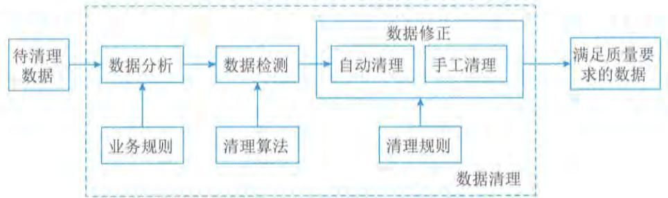
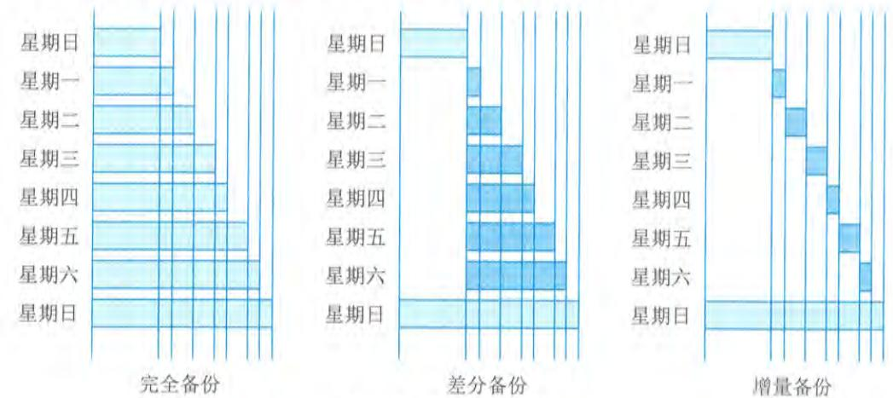
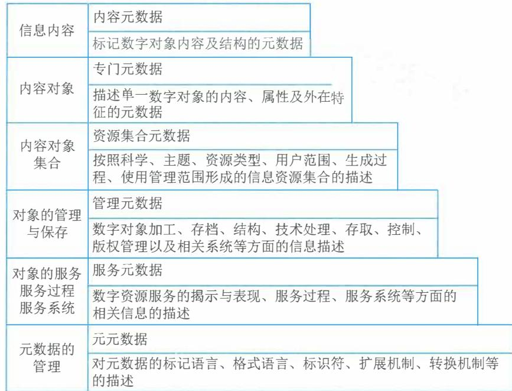
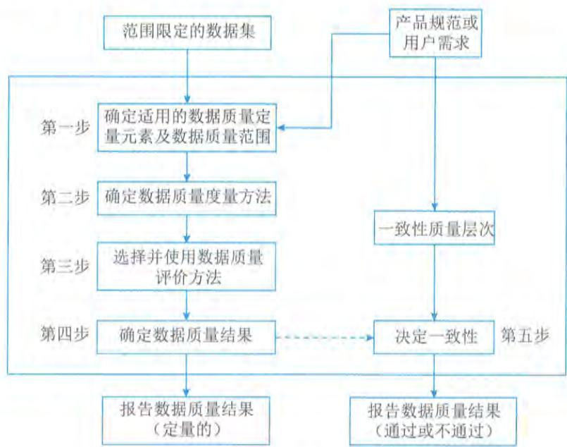
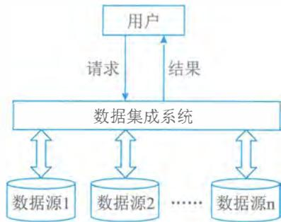
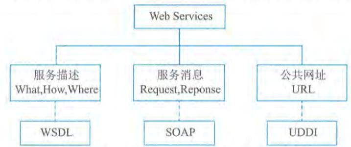
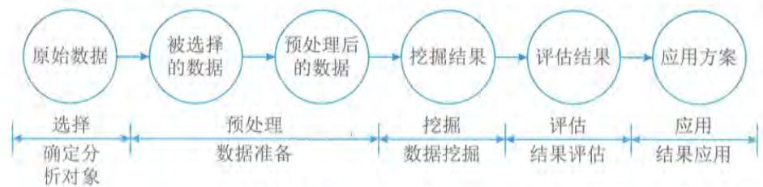
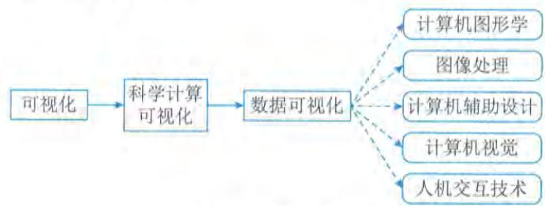

# 第6章 数据工程

数据工程是信息系统的基础工程。数据工程围绕数据的生命周期及管理要求，研究数据从采集清洗到应用服务的全过程，为信息系统运行提供可靠的数据基础，为信息系统之间的数据共享提供安全、高效的保障，为信息系统实现互连、互通、互操作提供支撑。组织的数据工程相关能力是其建设数据要素的关键，是组织数据资源化、数据标准化、数据资产化、数据价值化的重要手段。

# 6.1 数据采集和预处理

6.1 数据采集和预处理有效且高质量的数据获取是组织数据要素建设的重要活动，关系到组织数据的质量基础、容量规模、价值化开发等。广泛多元的数据采集以及必要的预处理，是支撑和保障数据获取的主要活动。

# 6.1.1 数据采集

数据采集又称数据收集，是指根据用户需要收集相关数据的过程。采集的数据类型包括结构化数据、半结构化数据、非结构化数据。结构化数据是以关系型数据库表管理的数据；半结构化数据是指非关系模型的、有基本固定结构模式的数据，例如日志文件、XML文档、E- mail等；非结构化数据是指没有固定模式的数据，如所有格式的办公文档、文本、图片、HTML、各类报表、图像和音频/视频信息等。

数据采集的方法可分为传感器采集、系统日志采集、网络采集和其他数据采集等。

传感器采集是通过传感器感知相应的信息，并将这些信息按一定规律变换成电信号或其他所需的信息输出，从而获取相关数据，是目前应用非常广泛的一种采集方式。数据采集传感器包括重力感应传感器、加速度传感器、光敏传感器、热敏传感器、声敏传感器、气敏传感器、流体传感器、放射线敏感传感器、味敏传感器等。

系统日志采集是通过平台系统读取、收集日志文件变化。系统日志记录系统中硬件、软件和系统运行情况及问题的信息。系统日志一般为流式数据，数据量非常庞大，常用的采集工具有Logstash、Filebeat、Flume、Fluentd、Logagent、rsyslog、syslog- ng等。

网络采集是指通过互联网公开采集接口或者网络爬虫等方式从互联网或特定网络上获取大量数据信息的方式，是实现互联网数据或特定网络采集的主要方式。数据采集接口一般通过应用程序接口（API）的方式进行采集。网络爬虫（WebCrawler/WebSpider）是根据一定的规则来提取所需要信息的程序。根据系统结构和实现技术，网络爬虫可分为通用网络爬虫（GeneralPurposeWebCrawler）、聚焦网络爬虫（FocusedWebCrawler）、增量式网络爬虫（IncrementalWebCrawler）、深层网络爬虫（DeepWebCrawler）等类型。

除此之外,还有一些其他的数据采集方式,如通过与数据服务商合作,使用特定数据采集方式获取数据。

# 6.1.2 数据预处理

数据的预处理一般采用数据清洗的方法来实现。数据预处理是一个去除数据集重复记录,发现并纠正数据错误,并将数据转换成符合标准的过程,从而使数据实现准确性、完整性、一致性、唯一性、适时性、有效性等。一般来说,数据预处理主要包括数据分析、数据检测和数据修正3个步骤,如图6- 1所示。

  
图6-1 数据预处理的流程

(1)数据分析:是指从数据中发现控制数据的一般规则,比如字段域、业务规则等。通过对数据的分析,定义出数据清理的规则,并选择合适的算法。

(2)数据检测:是指根据预定义的清理规则及相关数据清理算法,检测数据是否正确,比如是否满足字段域、业务规则等,或检测记录是否重复。

(3)数据修正:是指手工或自动地修正检测到的错误数据或重复的记录等。

# 6.1.3 数据预处理方法

一般而言,需要进行预处理的数据主要包括数据缺失、数据异常、数据不一致、数据重复、数据格式不符等情况,针对不同问题需要采用不同的数据处理方法。

# 1.缺失数据的预处理

数据缺失产生的原因主要分为环境原因和人为原因,需要针对不同的原因采取不同的数据预处理方法,常见的方法有删除缺失值、均值填补法、热卡填补法等。

删除缺失值是最常见的、简单有效的方法,当样本数很多的时候,并且出现缺失值的样本占整个样本的比例相对较小时,可以将有缺失值的样本直接丢弃。

均值填补法是根据缺失值的属性相关系数最大的那个属性把数据分成几个组,再分别计算每个组的均值,用均值代替缺失数值。

热卡填补法通过在数据库中找到一个与包含缺失值变量最相似的对象,然后采用相似对象的值进行数据填充。

缺失数据预处理的其他方法还有最近距离决定填补法、回归填补法、多重填补法、K- 最近邻法、有序最近邻法、基于贝叶斯的方法等。

# 2.异常数据的预处理

对于异常数据或有噪声的数据，如超过明确取值范围的数据、离群点数据，可以采用分箱法和回归法来进行处理。

分箱法通过考察数据的“近邻”（即周围的值）来平滑处理有序的数据值，这些有序的值被分布到一些“桶”或“箱”中，进行局部光滑。一般而言，宽度越大，数据预处理的效果越好。

回归法用一个函数拟合数据来光滑数据，消除噪声。线性回归涉及找出拟合两个属性（或变量）的“最佳”直线，使得一个属性能够预测另一个。多线性回归是线性回归的扩展，它涉及多于两个属性，并且数据拟合到一个多维面。

# 3.不一致数据的预处理

3. 不一致数据的预处理不一致数据是指具有逻辑错误或者数据类型不一致的数据，如年龄与生日数据不符。这一类数据的清洗可以使用人工修改，也可以借助工具来找到违反限制的数据，如知道数据的函数依赖关系，可以通过函数关系修改属性值。但是大部分的不一致情况都需要进行数据变换，即定义一系列的变换纠正数据，有一些商业工具可以提供数据变换的功能，例如数据迁移工具和ETL工具等。

# 4.重复数据的预处理

4. 重复数据的预处理数据本身存在的或数据清洗后可能会产生的重复值。重复值的存在会影响后续模型训练的质量，造成计算及存储浪费。去除重复值的操作一般最后进行，可以使用Excel、VBA（Visual Basic 宏语言）、Python 等工具处理。

# 5.格式不符数据的预处理

5. 格式不符数据的预处理一般人工收集或者应用系统用户填写的数据，容易存在格式问题。一般需要将不同类型的数据内容清洗成统一类型的文件和统一格式，如将TXT、CSV、Excel、HTML以及PDF清洗成统一的Excel文件，将显示不一致的时间、日期、数值或者内容中有空格、单引号、双引号等情况进行格式的统一调整。

# 6.2 数据存储及管理

6.2 数据存储及管理通过数据采集和预处理获得的数据，往往是组织具备较高价值的数字资源，确保这些数据得到适当的保管和管理，是数据价值化的基础，组织往往根据数据规模和数据的重要性等，采用最合适的存储介质、存储方法、管理体系、管理措施等。

# 6.2.1 数据存储

6.2.1 数据存储数据存储就是根据不同的应用环境，通过采取合理、安全、有效的方式将数据保存到物理介质上，并能保证对数据实施有效的访问。其中包含两个方面：一是数据临时或长期驻留的物理媒介；二是保证数据完整、安全存放和访问而采取的方式或行为。数据存储就是把这两个方面结合起来，提供完整的解决方案。

# 1.数据存储介质

1. 数据存储介质数据存储首先要解决的是存储介质的问题。存储介质是数据存储的载体，是数据存储的基础。存储介质并不是越贵越好、越先进越好，要根据不同的应用环境，合理选择存储介质。存储介质的类型主要有磁带、光盘、磁盘、内存、闪存、云存储等，其描述如表6-1所示。

表6-1 常见数据存储介质的描述  

<table><tr><td>介质</td><td>描述</td></tr><tr><td>磁带</td><td>磁带是存储成本低、容量大的存储介质，主要包括磁带机、自动加载磁带机和磁带库。其主要的缺点就是速度比较慢</td></tr><tr><td>光盘</td><td>光盘的全称是高密度盘（Compact Disk），常见的格式有VCD（Video Compact Disk）和DVD（Digital Video Disk）两种，前者能提供700MB左右的空间，后者容量要大得多，可提供4.7GB～60GB的存储空间。光盘具有3个显著特点：一是光盘上的数据具有只读性；二是不受电磁的影响；三是光盘容易大量复制。这些特点使得光盘特别适合用来对数据进行永久性归档备份</td></tr><tr><td>磁盘</td><td>利用磁盘存储数据时，一般采用独立冗余磁盘阵列RAID（Redundant Array of Independent Disks）。RAID将数个单独的磁盘以不同的组合方式形成一个逻辑磁盘，不仅提高了磁盘读取的性能，也增强了数据的安全性</td></tr><tr><td>内存</td><td>内存是计算机用于存放CPU中的运算数据，与硬盘等外部存储器交换数据的硬件。内存的性能决定了计算机运行的稳定性、反应速率。通常来说，内存数据会在断电后丢失所有数据</td></tr><tr><td>闪存</td><td>闪存是一种固态技术，使用闪存芯片来写入和存储数据，具有集内存的访问速度和存储持久性于一体的特点，常作为磁盘的替代品</td></tr><tr><td>云存储</td><td>与将数据存储到本地硬盘驱动器或存储网络相比，云存储提供了一种可扩展的替代方案，将数据存储在异地位置，可通过公共互联网或者专用私有网络进行访问</td></tr></table>

# 2.存储形式

2. 存储形式一般而言，主要有3种形式来记录和存储数据，分别是文件存储、块存储和对象存储，如表6-2所示。

表6-2 主要数据存储形式的描述  

<table><tr><td>存储形式</td><td>描述</td></tr><tr><td>文件存储</td><td>文件存储也称为文件级或基于文件的存储，是一种用于组织和存储数据的分层存储方法。换言之，数据存储在文件中，文件被组织在文件夹中，文件夹则被组织在目录和子目录的层次结构下</td></tr><tr><td>块存储</td><td>块存储有时也称为块级存储，是一种用于将数据存储成块的技术。这些块随后作为单独的部分存储，每个部分都有唯一的标识符。对于需要快速、高效和可靠地进行数据传输的计算场景，开发人员一般倾向于使用块存储</td></tr><tr><td>对象存储</td><td>对象存储通常称为基于对象的存储，是一种用于处理大量非结构化数据的数据存储架构。这些数据无法轻易组织到具有行和列的传统关系数据库中，或不符合其要求，如电子邮件、视频、照片、网页、音频文件、传感器数据以及其他类型的媒体和Web内容（文本或非文本）</td></tr></table>

# 3.存储管理

3. 存储管理存储管理在存储系统中的地位越来越重要,例如,如何提高存储系统的访问性能,如何满足数据量不断增长的需要,如何有效地保护数据、提高数据的可用性,如何满足存储空间的共享等。存储管理的具体内容如表 6-3 所示。

表6-3 存储管理的主要内容  

<table><tr><td>管理方面</td><td>主要内容</td></tr><tr><td>资源调度管理</td><td>资源调度管理的功能主要是添加或删除存储节点。编辑存储节点的信息,设定某类型存储资源属于某个节点,或者设定这些资源比较均衡地存储到节点上。它包含存储控制、拓扑配置以及各种网络设备(如集线器、交换机、路由器和网桥等)的故障隔离</td></tr><tr><td>存储资源管理</td><td>存储资源管理是一类应用程序,它们管理和监控物理和逻辑层次上的存储资源,从而简化资源管理,提高数据的可用性。被管理的资源主要是存储硬件,如RAID、磁带以及光盘库。存储资源管理不仅包括监控存储系统的状况、可用性、性能以及配置情况,还包括容量和配置管理以及事件报警等,从而提供优化策略</td></tr><tr><td>负载均衡管理</td><td>负载均衡是为了避免存储资源由于资源类型、服务器访问频率和时间不均衡造成浪费或形成系统瓶颈而平衡负载的技术</td></tr><tr><td>安全管理</td><td>存储系统的安全主要是防止恶意用户攻击系统或窃取数据。系统攻击大致分为两类:一类以扰乱服务器正常工作为目的,如拒绝服务(DoS)攻击、勒索病毒攻击等;另一类以入侵或破坏服务器为目的,如窃取数据、修改网页等</td></tr></table>

# 6.2.2 数据归档

因数据量海量增长和存储空间容量有限的矛盾,需要制定合理的数据归档方案,并及时清除过时的、不必要的数据,从而保证数据库性能的稳定。

数据归档是将不活跃的"冷"数据从可立即访问的存储介质迁移到查询性能较低、低成本、大容量的存储介质中,这一过程是可逆的,即归档的数据可以恢复到原存储介质中。数据归档策略需要与业务策略、分区策略保持一致,以确保最需要数据的可用性和系统的高性能。在开展数据归档活动时,有以下3点值得注意:

(1)数据归档一般只在业务低峰期执行。因为数据归档过程需要不断地读写生产数据库,这个过程将会大量使用网络,会对线上业务造成压力。

(2)数据归档之后,将会删除生产数据库的数据,将会造成数据空洞,即表空间并未及时释放,若长时间没有新的数据填充,会造成空间浪费的情况。

(3)如果数据归档影响了线上业务,一定要及时止损,结束数据归档,进行问题复盘,及时找到问题和解决方案。

# 6.2.3 数据备份

6.2.3 数据备份数据备份是为了防止由于各类操作失误、系统故障等意外原因导致的数据丢失,而将整个应用系统的数据或一部分关键数据复制到其他存储介质上的过程。这样做是为了保证当应用系统的数据不可用时,可以利用备份的数据进行恢复,尽量减少损失。

# 1.备份结构

当前最常见的数据备份结构可以分为4种：DAS备份结构、基于LAN的备份结构、LAN- FREE备份结构和SERVER- FREE备份结构。具体如表6- 4所示。

表6-4 常见的数据备份结构的主要内容  

<table><tr><td>备份结构</td><td>主要内容</td></tr><tr><td>DAS备份结构</td><td>最简单的备份结构就是将备份设备（RAID或磁带库）直接连接到备份服务器上。DAS备份结构往往适合数据量不大、操作系统类型单一、服务器数量有限的情况</td></tr><tr><td>基于LAN的备份结构</td><td>基于LAN的备份结构是一种C/S模型，多个服务器或客户端通过局域网共享备份系统。这种结构在小型的网络环境中较为常见，用户通过备份服务器将数据备份到RAID或磁带机上。与DAS备份结构相比，这种结构最主要的优点是用户可以通过LAN共享备份设备，并且可以对备份工作进行集中管理。缺点是备份数据流通过LAN到达备份服务器，这样就和业务数据流混合在一起，会占用网络资源</td></tr><tr><td>LAN-FREE备份结构</td><td>为了克服基于LAN备份结构的缺点，该结构将备份数据流和业务数据流分开，业务数据流主要通过业务网络进行传输，而备份数据流通过SAN进行传输。其主要缺点是由于备份数据流要经过应用服务器，因此会影响应用服务器提供正常的服务</td></tr><tr><td>SERVER-FREE备份结构</td><td>SERVER-FREE备份结构是LAN-FREE备份结构的改进。它不依赖应用服务器，而是通过第三方备份代理直接将数据从应用服务器的存储设备传送到备份设备上。第三方备份代理是一种软、硬结合的智能设备，使用网络数据管理协议（Network Data Management Protocol，NDMP）发送命令，从需要备份的应用服务器上获得需要备份数据的信息，然后通过SAN直接从应用服务器的存储设备将需要备份的数据读出，再存储到备份设备上</td></tr></table>

# 2.备份策略

备份策略是指确定需要备份的内容、备份时间和备份方式。主要有3种备份策略：完全备份、差分备份和增量备份。这3种备份策略的对比如图6- 2所示。

  
图6-2 备份策略对比

(1) 完全备份 (Full Backup): 每次都对需要进行备份的数据进行全备份。当数据丢失时, 用完全备份下来的数据进行恢复即可。这种备份主要有两个缺点: 一是由于每次都对数据进行全备份, 会占用较多的服务器、网络等资源; 二是在备份数据中有大量的数据是重复的, 对备份介质资源的消耗往往也较大。

(2) 差分备份 (Differential Backup): 每次所备份的数据只是相对上一次完全备份之后发生变化的数据。与完全备份相比, 差分备份所需时间短, 而且节省了存储空间。另外, 差分备份的数据恢复很方便, 管理员只需两份备份数据, 如星期日的完全备份数据和故障发生前一天的差分备份数据, 就能对系统数据进行恢复。

(3) 增量备份 (Incremental Backup): 每次所备份的数据只是相对于上一次备份后改变的数据。这种备份策略没有重复的备份数据, 节省了备份数据存储空间, 缩短了备份的时间, 但是当进行数据恢复时就会比较复杂。如果其中有一个增量备份数据出现问题, 那么后面的数据也就无法恢复了。因此增量备份的可靠性没有完全备份和差分备份高。

# 6.2.4 数据容灾

数据备份是数据容灾的基础。传统的数据备份主要采用磁带进行冷备份, 备份磁带一般存放在机房中进行统一管理, 一旦整个机房出现灾难, 如火灾、盗窃和地震等时, 这些备份磁带也随之毁灭, 起不到任何容灾作用。

因此, 真正的数据容灾就是要避免传统冷备份的先天不足, 它在灾难发生时能全面、及时地恢复整个系统。容灾按其灾难恢复能力的高低可分为多个等级, 例如, 国际标准 SHARE 78 定义的容灾系统有 7 个等级, 从最简单的仅在本地进行磁带备份, 到将备份的磁带存储在异地, 再到建立应用系统实时切换的异地备份系统。恢复时间也可以从几天到小时级到分钟级、秒级或零数据丢失等。从技术上看, 衡量容灾系统有两个主要指标, 即 RPO (Recovery Point Object, 恢复点目标) 和 RTO (Recovery Time Object, 恢复时间目标), 其中 RPO 代表了当灾难发生时允许丢失的数据量, 而 RTO 则代表了系统恢复的时间。

数据容灾的关键技术主要包括远程镜像技术和快照技术。

(1) 远程镜像技术。远程镜像技术是在主数据中心和备份中心之间进行数据备份时用到的远程复制技术。镜像是在两个或多个磁盘子系统上产生同一个数据镜像视图的数据存储过程, 一个称为主镜像; 另一个称为从镜像。按主从镜像所处的位置分为本地镜像和远程镜像。本地镜像的主从镜像处于同一个 RAID 中, 而远程镜像的主从镜像通常分布在城域网或广域网中。由于远程镜像在远程维护数据的镜像, 因此在灾难发生时, 存储在异地的数据不会受到影响。

(2) 快照技术。所谓快照, 就是关于指定数据集合的一个完全可用的复制, 该复制是相应数据在某个时间点 (复制开始的时间点) 的映像。快照的作用有两个: ①能够进行在线数据恢复, 可以将数据恢复成快照产生时间点时的状态; ②为用户提供另外一个数据访问通道, 比如在原数据在线运行时, 利用快照数据进行其他系统的测试、应用开发验证、数据分析、数据模型训练等。

# 6.3 数据治理和建模

6.3 数据治理和建模数据治理是开展数据价值化活动的基础，关注对数字要素的管控能力，覆盖组织对数据相关活动的统筹、评估、指导和监督等工作，需要重点关注元数据、数据标准化、数据质量、数据模型和数据建模等方面的内容。

# 6.3.1 元数据

6.3.1 元数据简单来说，元数据是关于数据的数据（Data About Data）。在信息技术及其服务行业，元数据往往被定义为提供关于信息资源或数据的一种结构化数据，是对信息资源的结构化描述。其实质是用于描述信息资源或数据的内容、覆盖范围、质量、管理方式、数据的所有者、数据的提供方式等有关的信息。

# 1.信息对象

1. 信息对象元数据描述的对象可以是单一的全文、目录、图像、数值型数据以及多媒体（声音、动态图像）等，也可以是多个单一数据资源组成的资源集合，或是这些资源的生产、加工、使用、管理、技术处理、保存等过程及其过程中产生的参数的描述等。

# 2.元数据体系

2. 元数据体系根据信息对象从产生到服务的生命周期中，元数据描述和管理内容的不同以及元数据作用的不同，可以将元数据分为多种类型，从最基本的资源内容描述元数据开始，到指导描述元数据的元元数据，形成了一个层次分明、结构开放的元数据体系，如图6-3所示。

  
图6-3 元数据体系与元数据类型

元数据为数据的管理、发现和获取提供了一种实际而简便的方法。通过元数据，数据的使用者能够对数据进行详细、深入的了解，包括数据的格式、质量、处理方法和获取方法等各方面细节，可以利用元数据进行数据维护、历史资料维护等，具体作用包括描述、资源发现、组织管理数据资源、互操作性、归档和保存数据资源等，如表6- 5所示。

表6-5 元数据对数据使用者的作用说明  

<table><tr><td>作用</td><td>说明</td></tr><tr><td>描述</td><td>用于描述数据的内容、覆盖范围、质量、管理方式、数据的所有者、数据的提供方式等信息，是数据与用户之间的桥梁</td></tr><tr><td>资源发现</td><td>元数据起到如同好的目录一样的作用，帮助用户便捷、快速地检索和确认所需要的资源</td></tr><tr><td>组织管理数据资源</td><td>随着基于Web的信息资源指数级的增长，按照用户和主题来链接信息资源的复合式网站或门户网站的作用越来越大，但是这种链接是用名称或位置硬编码在HTML文件中的，是一些静态的Web网页。利用存储在数据库中的元数据来组织动态网页，将更有效率和普遍意义，可以用软件工具为Web应用程序自动析取信息资源</td></tr><tr><td>互操作性</td><td>互操作性是不同硬件、软件平台、数据结构和接口以最少的内容和功能损失进行数据交换的能力。利用元数据描述的数据资源既可以被人类也可以被机器理解。使用良好定义的元数据语义和共享的转换协议，分布在网络上的数据资源就可以更加容易地被查找和转换，从而提高系统之间的互操作性</td></tr><tr><td>归档和保存数据资源</td><td>数据是脆弱的，它可能被无意识或有意识地破坏、修改，也可能由于存储介质、硬件和软件技术的变化而使得它不能使用。元数据是使数据资源保存下来，并能在将来继续被访问的关键，归档和保存数据需要特殊的数据元素来跟踪数字对象的来源（它来自何处、保护条件、保存责任等）。数据元素详细描述数字对象的物理特性和适应未来技术变化的行为</td></tr></table>

# 6.3.2 数据标准化

数据标准化主要为复杂的信息表达、分类和定位建立相应的原则和规范，使其简单化、结构化和标准化，从而实现信息的可理解、可比较和可共享，为信息在异构系统之间实现语义互操作提供基础支撑。数据标准化的主要内容包括元数据标准化、数据元标准化、数据模式标准化和数据分类与编码标准化。

在数据标准化活动中，要依据信息需求，并参照现行数据标准、信息系统的运行环境以及法规、政策和指导原则，在数据管理机构、专家组和开发者共同参与下，运用数据管理工具，得到注册的数据元素，物理模式和扩充的数据模型。数据标准化阶段的具体过程包括确定数据需求、制定数据标准、批准数据标准和实施数据标准。

（1）确定数据需求。本阶段将产生数据需求及相关的元数据、域值等文件。在确定数据需求时应考虑现行法规、政策，以及现行的数据标准。

（2）制定数据标准。本阶段要处理“确定数据需求”阶段提出的数据需求。如果现有的数据标准不能满足该数据需求，可以建议制定新的数据标准，也可建议修改或者封存已有的数据

标准。推荐的、新的或修改的数据标准记录在数据字典中。这个阶段将产生供审查和批准的成套建议。

（3）批准数据标准。本阶段的数据管理机构对提交的数据标准建议、现行数据标准的修改或封存建议进行审查。一经批准，该数据标准将扩充或修改数据模型。

（4）实施数据标准。本阶段涉及在各信息系统中实施和改进已批准的数据标准。

# 6.3.3 数据质量

数据质量指在特定的业务环境下，数据满足业务运行、管理与决策的程度，是保证数据应用效果的基础。数据质量管理是指运用相关技术来衡量、提高和确保数据质量的规划、实施与控制等一系列活动。衡量数据质量的指标体系包括完整性、规范性、一致性、准确性、唯一性、及时性等。数据质量是一个广义的概念，是数据产品满足指标、状态和要求能力的特征总和。

（1）数据质量描述。数据质量可以通过数据质量元素来描述，数据质量元素分为数据质量定量元素和数据质量非定量元素。

（2）数据质量评价过程。数据质量评价过程是产生和报告数据质量结果的一系列步骤，如图6-4所示描述了数据质量评价过程。

  
图6-4 数据质量评价过程

（3）数据质量评价方法。数据质量评价程序是通过应用一个或多个数据质量评价方法来完成的。数据质量评价方法分为直接评价法和间接评价法。直接评价法通过将数据与内部或外部的参照信息（如理论值等）进行对比来确定数据质量，间接评价法利用数据相关信息（如对数据源、采集方法等的描述）推断或评估数据质量。

（4）数据质量控制。数据产品的质量控制分成前期控制和后期控制两大部分。前期控制包

括数据录入前的质量控制、数据录入过程中的实时质量控制；后期控制为数据录入完成后的后处理质量控制与评价。

在数据质量的前期控制中，在提交成果（即数据入库）之前对所获得的原始数据与完成的工作进行检查，进一步发现和改正错误；在数据质量管理过程中，通过减少和消除误差和错误，对数据在录入过程中进行属性的数据质量控制；在数据入库后进行系统检测，设计检测模板，利用检测程序进行系统自检；在数据存储管理中，可以通过各种精度评价方法进行精度分析，为用户提供可靠的数据质量。

# 6.3.4 数据模型

数据模型是指现实世界数据特征的抽象，用于描述一组数据的概念和定义，是用来将数据需求从业务传递到需求分析，以及从分析师、建模师和架构师传递到数据库设计人员和开发人员的主要媒介。根据模型应用的目的不同，可以将数据模型划分为3类：概念模型、逻辑模型和物理模型。

# 1.概念模型

概念模型也称为信息模型，它是按用户的观点来对数据和信息建模，也就是说，把现实世界中的客观对象抽象为某一种信息结构，这种信息结构不依赖于具体的计算机系统，也不对应某个具体的数据库管理系统（Database Management System，DBMS），它是概念级别的模型。概念模型的基本元素如表6- 6所示。

表6-6 概念模型基本元素说明  

<table><tr><td>基本元素</td><td>说明</td></tr><tr><td>实体</td><td>客观存在的并可以相互区分的事物称为实例，而同一类型实例的抽象称为实体，如学生实体（学号、系名、住处、课程、成绩）、教师实体（工作证号、姓名、系名、教研室、职称）。实体是同一类型实例的共同抽象，不再与某个具体的实例对应。相比较而言，实例是具体的，而实体则是抽象的</td></tr><tr><td>属性</td><td>实体的特性称为属性。学生实体的属性包括学号、系名、住处、课程、成绩等，教师实体的属性包括工作证号、姓名、系名、教研室、职称等</td></tr><tr><td>域</td><td>属性的取值范围称为该属性的域。例如，性别的域是集合{&quot;男&quot;,&quot;女&quot;}。域的元素必须是相同的数据类型</td></tr><tr><td>键</td><td>能唯一标识每个实例的一个属性或几个属性的组合称为键。一个实例集中有很多个实例，需要有一个标识能够唯一地识别每一个实例，这个标识就是键</td></tr><tr><td>关联</td><td>在现实世界中，客观事物之间是有相互关系的，这种相互关系在数据模型中表现为关联。实体之间的关联包括一对一、一对多和多对多3种</td></tr></table>

# 2.逻辑模型

逻辑模型是在概念模型的基础上确定模型的数据结构，目前主要的逻辑模型有层次模型、网状模型、关系模型、面向对象模型和对象关系模型。其中，关系模型是目前最重要的一种逻辑数据模型。

关系模型的基本元素包括关系、关系的属性、视图等。关系模型是在概念模型的基础上构建的,因此关系模型的基本元素与概念模型中的基本元素存在一定的对应关系,具体如表6- 7所示。

表6-7 关系模型与概念模型的对应关系  

<table><tr><td>概念模型</td><td>关系模型</td><td>说明</td></tr><tr><td>实体</td><td>关系</td><td>概念模型中的实体转换为关系模型的关系</td></tr><tr><td>属性</td><td>属性</td><td>概念模型中的属性转换为关系模型的属性</td></tr><tr><td>关联</td><td>关系外键</td><td>概念模型中的关联有可能转换为关系模型的新关系，被参照关系的主键转化为参照关系的外键</td></tr><tr><td>-</td><td>视图</td><td>关系模型中的视图在概念模型中没有元素与之对应，它是按照查询条件从现有关系或视图中抽取若干属性组合而成的</td></tr></table>

关系模型的数据操作主要包括查询、插入、删除和更新数据,这些操作必须满足关系的完整性约束条件。关系的完整性约束包括三大类型:实体完整性、参照完整性和用户定义的完整性。其中,实体完整性、参照完整性是关系模型必须满足的完整性约束条件,用户定义的完整性是应用领域需要遵照的约束条件,体现了具体领域中的语义约束。

# 3.物理模型

3. 物理模型物理模型是在逻辑模型的基础上,考虑各种具体的技术实现因素,进行数据库体系结构设计,真正实现数据在数据库中的存放。物理模型的内容包括确定所有的表和列,定义外键用于确定表之间的关系,基于性能的需求可能进行反规范化处理等。在物理实现上的考虑,可能会导致物理模型和逻辑模型有较大的不同。物理模型的目标是用数据库模式来实现逻辑模型,以及真正地保存数据。物理模型的基本元素包括表、字段、视图、索引、存储过程、触发器等,其中表、字段和视图等元素与逻辑模型中的基本元素有一定的对应关系。

# 6.3.5 数据建模

通常来说,数据建模的过程包括数据需求分析、概念模型设计、逻辑模型设计和物理模型设计等。

(1)数据需求分析。数据需求分析就是分析用户对数据的需要和要求。数据需求分析是数据建模的起点,数据需求掌握的准确程度将直接影响后续阶段数据模型的质量。数据需求分析通常不是单独进行的,而是融合在整个系统需求分析的过程之中。开展需求分析时,首先要调查清楚用户的实际要求,与用户充分沟通,形成共识,然后再分析和表达这些要求与共识,最后将需求表达的结果反馈给用户,并得到用户的确认。数据需求分析采用数据流图作为工具,描述系统中数据的流动和数据变化,强调数据流和处理过程。

(2)概念模型设计。经过需求分析阶段的充分调查,得到了用户数据应用需求,但是这些应用需求还是现实世界的具体需求,应该首先把它们抽象为信息世界的结构,下一步才能更好地、更准确地用某个DBMS来实现用户的这些需求。将需求分析得到的结果抽象为概念模型的过程就是概念模型设计,其任务是确定实体和数据及其关联。

(3)逻辑模型设计。概念模型独立于机器,更抽象,从而更加稳定,但是为了能够在具体的DBMS上实现用户的需求,还必须在概念模型的基础上进行逻辑模型的设计。由于现在的DBMS普遍采用关系模型结构,因此逻辑模型设计主要指关系模型结构的设计。关系模型由一组关系模式组成,一个关系模式就是一张二维表,逻辑模型设计的任务就是将概念模型中的实体、属性和关联转换为关系模型结构中的关系模式。

(4)物理模型设计。经过概念模型设计和逻辑模型设计,数据模型设计的核心工作基本完成,如果要将数据模型转换为真正的数据库结构,还需要针对具体的DBMS进行物理模型设计,使数据模型走向数据存储应用环节。物理模型考虑的主要问题包括命名、确定字段类型和编写必要的存储过程与触发器等。

# 6.4 数据仓库和数据资产

6.4 数据仓库和数据资产随着"数字中国"等国家战略持续深化,以及各类组织数字化转型的全面实施和持续推进,数据资产逐步成为各类组织的重要资产类型,也是组织高质量发展和可持续竞争优势建设的关键。

# 6.4.1 数据仓库

数据仓库是一个面向主题的、集成的、随时间变化的、包含汇总和明细的、稳定的历史数据集合。数据仓库通常由数据源、数据的存储与管理、OLAP服务器、前端工具等组件构成。

(1)数据源。数据源是数据仓库系统的基础,是整个系统的数据源泉,通常包括企业的内部信息和外部信息。内部信息包括存放于关系型数据库管理系统中的各种业务处理数据和各类文档数据;外部信息包括各类法律法规、市场信息和竞争对手的信息等。

(2)数据的存储与管理。数据的存储与管理是整个数据仓库系统的核心。数据仓库真正的关键是数据的存储和管理。数据仓库的组织管理方式决定了它有别于传统数据库,同时也决定了其对外部数据的表现形式。要决定采用什么产品和技术来建立数据仓库的核心,则需要从数据仓库的技术特点着手分析。针对现有各业务系统的数据,进行抽取、清理,并有效集成,按照主题进行组织。数据仓库按照数据的覆盖范围可以分为企业级数据仓库和部门级数据仓库(通常称为数据集市)。

(3)OLAP(On-Line Analysis Processing,联机分析处理)服务器。对分析需要的数据进行有效集成,按多维模型予以组织,以便进行多角度、多层次的分析,并发现趋势。其具体实现可以分为:ROLAP(关系数据的关系在线分析处理)、MOLAP(多维在线分析处理)和HOLAP(混合在线分析处理)。ROLAP基本数据和聚合数据均存放在RDBMS之中;MOLAP基本数据和聚合数据均存放于多维数据库中;HOLAP基本数据存放于RDBMS之中,聚合数据存放于多维数据库中。

(4)前端工具。前端工具主要包括各种查询工具、报表工具、分析工具、数据挖掘工具以及各种基于数据仓库或数据集市的应用开发工具。其中,数据分析工具主要针对OLAP服务器,报表工具、数据挖掘工具主要针对数据仓库。

# 6.4.2 主题库

主题库建设是数据仓库建设的一部分。主题库是为了便利工作、精准快速地反映工作对象全貌而建立的融合各类原始数据、资源数据等。围绕能标识组织、人员、产权、财务等的主题对象,长期积累形成的多种维度的数据集合。例如,人口主题库、土地主题库、企业主题库、产权主题库、财务主题库、组织主题库等。由于每类主题对象具有不同的基本属性、不同的业务关注角度,因此每类主题对象具有不同的描述维度。主题库建设可采用多层级体系结构,即数据源层、构件层、主题库层。

(1)数据源层。数据源层存放数据管理信息的各种管理表和数据的各类数据表。

(2)构件层。构件层包括基础构件和组合构件。基础构件包括用户交互相关的查询数据、展现数据和存储数据构件,以及数据维护相关的采集数据、载入数据和更新数据构件。组合构件由基础构件组装而成,能够完成相对独立的复杂功能。

(3)主题库层。按业务需求通过构建组合,形成具有统一访问接口的主题库。

# 6.4.3 数据资产管理

数据资产管理(DataAssetManagement,DAM)是指对数据资产进行规划、控制和提供的一组活动职能,包括开发、执行和监督有关数据的计划、政策、方案、项目、流程、方法和程序,从而控制、保护、交付和提高数据资产的价值。数据资产管理须充分融合政策、管理、业务、技术和服务等,从而确保数据资产保值增值。在数字时代,数据是一种重要的生产要素,把数据转化成可流通的数据要素,重点包含数据资源化、数据资产化两个环节。

(1)数字资源化。通过将原始数据转变为数据资源,使数据具备一定的潜在价值,是数据资产化的必要前提。数据资源化以数据治理为工作重点,以提升数据质量、保障数据安全为目标,确保数据的准确性、一致性、时效性和完整性,推动数据内外部流通。

(2)数据资产化。通过将数据资源转变为数据资产,使数据资源的潜在价值得以充分释放。数据资产化以扩大数据资产的应用范围、显性化数据资产的成本与效益为工作重点,并使数据供给端与数据消费端之间形成良性反馈闭环。

在数据资产化之后,将关注数据资产的流通、数据资产的运营、数据价值评估等流程和活动,为数据价值的实现提供支撑。

数据资产流通是指通过数据共享、数据开放或数据交易等流通模式,推动数据资产在组织内外部的价值实现。数据共享是指打通组织各部门间的数据壁垒,建立统一的数据共享机制,加速数据资源在组织内部流动。数据开放是指向社会公众提供易于获取和理解的数据。对于政府而言,数据开放主要是指公共数据资源开放;对于企业而言,数据开放主要是指披露企业运行情况、推动政企数据融合等。数据交易是指交易双方通过合同约定,在安全合规的前提下,开展以数据或其衍生形态为核心的交易行为。

数据资产运营是指对数据服务、数据流通情况进行持续跟踪和分析,以数据价值管理为参考,从数据使用者的视角出发,全面评价数据应用效果,建立科学的正向反馈和闭环管理机制,促进数据资产的迭代和完善,不断适应和满足数据资产的应用和创新。

数据价值评估是数据资产管理的关键环节, 是数据资产化的价值基线。狭义的数据价值是指数据的经济效益; 广义的数据价值是在经济效益之外, 考虑数据的业务效益、成本计量等因素。数据价值评估是指通过构建价值评估体系, 计量数据的经济效益、业务效益、投入成本等活动。

# 6.4.4 数据资源编目

数据资源编目是实现数据资产管理的重要手段。数据资源目录体系设计包括概念模型设计和业务模型设计等, 概念模型设计明确数据资源目录的构成要素, 通过业务模型设计规范数据资源目录的业务框架。数据资源目录的概念模型由数据资源目录、信息项、数据资源库、标准规范等要素构成。

(1) 数据资源目录。数据资源目录是站在全局视角对所拥有的全部数据资源进行编目, 以便对数据资源进行管理、识别、定位、发现、共享的一种分类组织方法, 从而达到对数据的浏览、查询、获取等目的。数据资源目录分为资源目录、资产目录和服务目录 3 个层面。

- 资源目录: 能够准确浏览组织所记录或拥有的线上、线下原始数据资源的目录, 如电子文档索引、数据库表、电子文件、电子表格、纸质文档等。- 资产目录: 对原始数据资源进行标准化处理, 识别数据资产及其信息要素, 包括基本信息、业务信息、管理信息和价值信息等, 按照分类、分级, 登记到数据资产目录中。- 服务目录: 是基于资源和资产目录, 对特定的业务场景以信息模型、业务模型等形式对外提供的可视化共享数据目录。服务目录主要分为两类: 一类是指标报表、分析报告等数据应用, 可以直接使用; 另一类是共享接口, 提供鉴权、加密、计量、标签化等功能, 并对接外部系统。服务目录应以应用场景为切入, 以应用需求为导向进行编制。

(2) 信息项。信息项是将各类数据资源 (如表、字段) 以元数据流水账的形式清晰地反映出来, 以便更好地了解、掌握和管理数据资源。信息项需要通过数据标识符挂接到对应的数据目录。信息项常分为数据资源信息项、数据资产信息项和数据服务信息项 3 种类型。

- 数据资源信息项: 是记录原始数据资源的元数据流水账, 是对原始数据资源的定义描述。

- 数据资产信息项: 是记录经过一系列处理后所形成的主题数据资源、基础数据资源的元数据流水账, 是对数据资产的定义描述。

- 数据服务信息项: 是记录需要对外提供数据应用、数据接口两类数据服务的元数据流水账, 是对数据服务的定义描述。

(3) 数据资源库。数据资源库是存储各类数据资源的物理数据库, 常分为专题数据资源库、主题数据资源库和基础数据资源库。

(4) 标准规范。数据资源目录体系标准规范包括数据资源元数据规范、编码规范、分类标准等相关标准。元数据规范描述数据资源所必须具备的特征要素; 编码规范规定了数据资源目录相关编码的表示形式、结构和维护规则; 分类标准规范了数据资源分类的原则和方法。

# 6.5 数据分析及应用

6.5 数据分析及应用数据的分析及应用是数据要素价值实现环节的重要活动，是组织实施数据驱动发展的基础，通常涉及数据集成、数据挖掘、数据服务和数据可视化等。

# 6.5.1 数据集成

数据集成就是将驻留在不同数据源中的数据进行整合，向用户提供统一的数据视图，使得用户能以透明的方式访问数据。其中，“数据源”主要是指不同类别的DBMS，以及各类XML文档、HTML文档、电子邮件、普通文件等结构化、半结构化和非结构化数据。这些数据源具有存储位置分散、数据类型异构、数据库产品多样等特点。

数据集成的目标就是充分利用已有数据，在尽量保持其自治性的前提下，维护数据源整体上的一致性，提高数据共享利用效率。实现数据集成的系统称为数据集成系统，它为用户提供了统一的数据源访问接口，用于执行用户对数据源的访问请求。典型的数据集成系统模型如图6- 5所示。

（1）数据集成方法。数据集成的常用方法有模式集成、复制集成和混合集成，具体描述为：

$\bullet$  模式集成：也叫虚拟视图方法，是人们最早采用的数据集成方法，也是其他数据集成方法的基础。

  
图6-5 数据集成系统模型

其基本思想是：在构建集成系统时，将各数据源共享的视图集成为全局模式（GlobalSchema），供用户透明地访问各数据源的数据。全局模式描述了数据源共享数据的结构、语义和操作等，用户可直接向集成系统提交请求，集成系统再将这些请求处理并转换，使之能够在数据源的本地视图上被执行。

$\bullet$  复制集成：将数据源中的数据复制到相关的其他数据源上，并对数据源的整体一致性进行维护，从而提高数据的共享和利用效率。数据复制可以是整个数据源的复制，也可以是仅对变化数据的传播与复制。数据复制的方法可减少用户使用数据集成系统时对异构数据源的访问量，提高系统的性能。

$\bullet$  混合集成：该方法为了提高中间件系统的性能，保留虚拟数据模式视图为用户所用，同时提供数据复制的方法。对于简单的访问请求，通过数据复制方式，在本地或单一数据源上实现访问请求；而对数据复制方式无法实现的复杂的用户请求，则用模式集成方法。

（2）数据访问接口。常用的数据访问接口标准有ODBC、JDBC、OLEDB和ADO，具体描述为：

$\bullet$  ODBC（OpenDatabaseConnectivity）：ODBC是当前被业界广泛接受的、用于数据库访问的应用程序编程接口（API），它以X/Open和ISO/IEC的调用接口规范为基础，并使用结构化查询语言（SQL）作为其数据库访问语言。ODBC由应用程序接口、驱动程序管理器、驱动程序和数据源4个组件组成。

- JDBC（Java Database Connectivity）：JDBC是用于执行SQL语句的Java应用程序接口，它由Java语言编写的类和接口组成。JDBC是一种规范，其宗旨是各数据库开发商为Java程序提供标准的数据库访问类和接口。使用JDBC能够方便地向任何关系数据库发送SQL语句。同时，采用Java语言编写的程序不必为不同的系统平台、不同的数据库系统开发不同的应用程序。- OLE DB（Object Linking and Embedding Database）：OLE DB是一个基于组件对象模型（Component Object Model，COM）的数据存储对象，能提供对所有类型数据的操作，甚至能在离线的情况下存取数据。- ADO（ActiveX Data Objects）：ADO是应用层的接口，它的应用场合非常广泛，不仅可用在VC、VB、Delphi等高级编程语言环境，还可用在Web开发等领域。ADO使用简单，易于学习，已成为常用的实现数据访问的主要手段之一。ADO是COM自动接口，几乎所有数据库工具、应用程序开发环境和脚本语言都可以访问这种接口。

（3）Web Services技术。Web Services技术是一个面向访问的分布式计算模型，是实现Web数据和信息集成的有效机制。它的本质是用一种标准化方式实现不同服务系统之间的互调或集成。它基于XML、SOAP（Simple Object Access Protocol，简单对象访问协议）、WSDL（Web Services Description Language，Web服务描述语言）和UDDI（Universal Description，Discovery，and Integration，统一描述、发现和集成协议规范）等协议，开发、发布、发现和调用跨平台、跨系统的各种分布式应用。其三要素WSDL、SOAP和UDDI及其组成如图6-6所示。

  
图6-6 Web Services的3个组成部分

- WSDL：WSDL是一种基于XML格式的关于Web服务的描述语言，主要目的在于Web Services的提供者将自己的Web服务的所有相关内容（如所提供的服务的传输方式、服务方法接口、接口参数、服务路径等）生成相应的文档，发布给使用者。使用者可以通过这个WSDL文档，创建相应的SOAP请求（request）消息，通过HTTP传递给Web Services提供者；Web服务在完成服务请求后，将SOAP返回（response）消息传回请求者，服务请求者再根据WSDL文档将SOAP返回消息解析成自己能够理解的内容。- SOAP：SOAP是消息传递的协议，它规定了Web Services之间是怎样传递信息的。简单地说，SOAP规定了：①传递信息的格式为XML，这就使Web Services能够在任何平台上，用任何语言进行实现；②远程对象方法调用的格式，规定了怎样表示被调用对象以及调用的方法名称和参数类型等；③参数类型和XML格式之间的映射，这是因为，被

调用的方法有时候需要传递一个复杂的参数, 怎样用XML来表示一个对象参数, 也是 SOAP所定义的范围; (4)异常处理以及其他的相关信息。

- UDDI: UDDI是一种创建注册服务的规范。简单地说, UDDI用于集中存放和查找 WSDL描述文件, 起着目录服务器的作用, 以便服务提供者注册发布Web Services, 供使用者查找。

(4)数据网格技术。数据网格是一种用于大型数据集的分布式管理与分析的体系结构, 目标是实现对分布、异构的海量数据进行一体化存储、管理、访问、传输与服务, 为用户提供数据访问接口和共享机制, 统一、透明地访问和操作各个分布、异构的数据资源, 提供管理、访问各种存储系统的方法, 解决应用所面临的数据密集型网格计算问题。数据网格的透明性体现为:

分布透明性: 用户感觉不到数据是分布在不同的地方的;

- 异构透明性: 用户感觉不到数据的异构性, 感觉不到数据存储方式的不同、数据格式的不同、数据管理系统的不同等;

- 数据位置透明性: 用户不用知道数据源的具体位置, 也没有必要了解数据源的具体位置;

- 数据访问方式透明性: 不同系统的数据访问方式不同, 但访问结果相同。

# 6.5.2 数据挖掘

数据挖掘是指从大量数据中提取或"挖掘"知识, 即从大量的、不完全的、有噪声的、模糊的、随机的实际数据中, 提取隐含在其中的、人们不知道的、却是潜在有用的知识, 它把人们从对数据的低层次的简单查询, 提升到从数据库挖掘知识, 提供决策支持的高度。数据挖掘是一门交叉学科, 其过程涉及数据库、人工智能、数理统计、可视化、并行计算等多种技术。

数据挖掘与传统数据分析存在较大的不同, 主要表现在以下4个方面。

(1)两者分析对象的数据量有差异。数据挖掘所需的数据量比传统数据分析所需的数据量大。数据量越大, 数据挖掘的效果越好。

(2)两者运用的分析方法有差异。传统数据分析主要运用统计学的方法手段对数据进行分析; 而数据挖掘综合运用数据统计、人工智能、可视化等技术对数据进行分析。

(3)两者分析侧重有差异。传统数据分析通常是回顾型和验证型的, 通常分析已经发生了什么; 而数据挖掘通常是预测型和发现型的, 预测未来的情况, 解释发生的原因。

(4)两者成熟度不同。传统数据分析由于研究较早, 其分析方法相当成熟; 而数据挖掘除基于统计学等方法外, 部分方法仍处于发展阶段。

数据挖掘的目标是发现隐藏于数据之后的规律或数据间的关系, 从而服务于决策。数据挖掘常见的主要任务包括数据总结、关联分析、分类和预测、聚类分析和孤立点分析。

(1)数据总结。数据总结的目的是对数据进行浓缩, 给出它的总体综合描述。通过对数据的总结, 将数据从较低的个体层次抽象总结到较高的总体层次上, 从而实现对原始数据的总体把握。传统的、也是最简单的数据总结方法是利用统计学中的方法计算出各个数据项的和值、均值、方差、最大值、最小值等基本描述统计量, 还可以利用统计图形工具, 对数据制作直方

图、散点图等。

(2)关联分析。数据库中的数据一般都存在着关联关系,也就是说,两个或多个变量的取值之间存在某种规律性。关联分析就是找出数据库中隐藏的关联网,描述一组数据项的密切度或关系。有时并不知道数据库中数据的关联是否存在精确的关联函数,即使知道也是不确定的,因此关联分析生成的规则带有置信度,置信度度量了关联规则的强度。

(3)分类和预测。使用一个分类函数或分类模型(也常称作分类器),根据数据的属性将数据分派到不同的组中,即分析数据的各种属性,并找出数据的属性模型,确定哪些数据属于哪些组,这样就可以利用该模型来分析已有数据,并预测新数据将属于哪个组。

(4)聚类分析。当要分析的数据缺乏描述信息,或者无法组织成任何分类模型时,可以采用聚类分析。聚类分析是按照某种相近程度度量方法,将数据分成一系列有意义的子集合,每一个集合中的数据性质相近,不同集合之间的数据性质相差较大。统计方法中的聚类分析是实现聚类的一种手段,它主要研究基于几何距离的聚类。人工智能中的聚类是基于概念描述的。概念描述就是对某类对象的内源进行描述,并概括这类对象的有关特征。概念描述又分为特征性描述和区别性描述,前者描述某类对象的共同特征,后者描述非同类对象之间的区别。

(5)孤立点分析。数据库中的数据常有一些异常记录,与其他记录存在着偏差。孤立点分析(或称为离群点分析)就是从数据库中检测出偏差。偏差包括很多潜在的信息,如分类中的反常实例、不满足规则的特例、观测结果与模型预测值的偏差等。

数据挖掘流程一般包括确定分析对象、数据准备、数据挖掘、结果评估与结果应用5个阶段,如图6- 7所示,这些阶段在具体实施中可能需要重复多次。为完成这些阶段的任务,需要不同专业人员参与其中,专业人员主要包括业务分析人员、数据挖掘人员和数据管理人员。

  
图6-7 数据挖掘流程图

(1)确定分析对象。定义清晰的挖掘对象,认清数据挖掘的目标是数据挖掘的第一步。数据挖掘的最后结果往往是不可预测的,但要探索的问题应该是可预见、有目标的。在开始数据挖掘之前,最基础的就是理解数据和实际的业务问题,对目标有明确的定义。

(2)数据准备。数据准备是保证数据挖掘得以成功的先决条件,数据准备在整个数据挖掘过程中占有重要比重。数据准备包括数据选择和数据预处理,具体描述为:

- 数据选择:在确定挖掘对象之后,搜索所有与挖掘对象有关的内部和外部数据,从中选出适合于数据挖掘的部分。

- 数据预处理:选择后的数据通常不完整、有噪声且不一致,这就需要对数据进行预处理。数据预处理包括数据清理、数据集成、数据变换和数据归约。

(3)数据挖掘。数据挖掘是指运用各种方法对预处理后的数据进行挖掘。然而任何一种数

据挖掘算法,不管是统计分析方法、神经网络,还是遗传算法,都不是万能的。不同的社会或商业问题,需要用不同的方法去解决。即使对于同一个社会或商业问题,也可能有多种算法。这个时候就需要运用不同的算法,构建不同的挖掘模型,并对各种挖掘模型进行评估。数据挖掘过程细分为模型构建过程和挖掘处理过程,具体描述为:

- 模型构建:挖掘模型是针对数据挖掘算法而构建的。建立一个真正适合挖掘算法的挖掘模型是数据挖掘成功的关键。模型的构建可通过选择变量、从原始数据中构建新的预示值、基于数据子集或样本构建模型、转换变量等步骤来实现。

- 挖掘处理:挖掘处理是对所得到的经过转化的数据进行挖掘,除了完善与选择合适的算法需要人工干预外,其余工作都可由分析工具自动完成。

(4)结果评估。当数据挖掘出现结果后,要对结果进行解释和评估。具体的解释与评估方法一般根据数据挖掘操作结果所制定的决策成败来定,但是管理决策分析人员在使用数据挖掘结果之前,希望能够对挖掘结果进行评价,以保证数据挖掘结果在实际应用中的成功率。

(5)结果应用。数据挖掘的结果经过决策人员的许可,才能实际运用,以指导实践。将通过数据挖掘得出的预测模式和各个领域的专家知识结合在一起,构成一个可供不同类型的人使用的应用程序。也只有通过对分析知识的应用,才能对数据挖掘的成果做出正确的评价。

# 6.5.3 数据服务

数据服务主要包括数据目录服务、数据查询与浏览及下载服务、数据分发服务。

(1)数据目录服务。数据目录服务是用来快捷地发现和定位所需数据资源的一种检索服务,是实现数据共享的重要基础功能服务之一。由于专业、领域、主管部门、分布地域和采用技术的不同,数据资源呈现的是海量、多源、异构和分布的特点。对于需要共享数据的用户来说,往往存在不知道有哪些数据、不知道想要的数据在哪里、不知道如何获取数据等困难。

(2)数据查询与浏览及下载服务。数据查询、浏览和下载是网上数据共享服务的重要方式,用户使用数据的方式有查询数据和下载数据两种。数据查询与浏览服务一般通过关键字检索来进行。用户通过输入关键字或选择相应的领域及学科,对数据进行快速定位,得到相应的数据集列表。数据下载服务是指用户提出数据下载要求,在获得准许的情况下,直接通过网络获得数据的过程。对于需要数据下载的用户来说,首先需要查询数据目录,获得目标数据集的信息,然后到指定的网络位置进行下载操作。

(3)数据分发服务。数据分发是指数据的生产者通过各种方式将数据传送到用户的过程。通过分发,能够形成数据从采集、存储、加工、传播向使用流动,实现数据的价值。数据分发服务的核心内容包括数据发布、数据发现、数据评价等。数据发布是指数据生产者可以将已生产和标准化的数据传送到一个数据分发体系中,为用户发现、评价做好基础的准备工作。数据发布的内容包括元数据、数据本身、用于数据评价的信息及其他相关信息。数据发现是指用户通过分发服务系统搜索到所需数据相关信息的过程,可通过数据目录服务来实现。数据评价指用户对数据的内容进行判断和评定,以此判断数据是否符合自己的要求。

# 6.5.4 数据可视化

6.5.4 数据可视化数据可视化（Data Visualization）的概念来自科学计算可视化。数据可视化主要运用计算机图形学和图像处理技术，将数据转换成图形或图像在屏幕上显示出来，并能进行交互处理，它涉及计算机图形学、图像处理、计算机辅助设计、计算机视觉及人机交互技术等多个领域，是一门综合性的学科，具体如图6- 8所示。

  
图6-8 数据可视化

图6- 8 数据可视化由于所要展现数据的内容和角度不同，可视化的表现方式也多种多样，主要可分为7类：一维数据可视化、二维数据可视化、三维数据可视化、多维数据可视化、时态数据可视化、层次数据可视化和网络数据可视化。具体如表6- 8所示。

表6-8 常见数据可视化表现方式  

<table><tr><td>表现方式</td><td>说明</td></tr><tr><td>一维数据可视化</td><td>一维数据就是简单的线性数据，如文本或数字表格、程序源代码都属于一维数据。一维数据可视化取决于数据大小和用户想用数据来处理什么任务</td></tr><tr><td>二维数据可视化</td><td>在数据可视化中，二维数据是指由两种主要描述属性构成的数据。如一个物体的宽度和高度、一个城市的平面地图、建筑物的楼层平面图等都是二维数据可视化的实例。最常见的二维数据可视化就是地理信息系统（Geographic Information System，GIS）</td></tr><tr><td>三维数据可视化</td><td>三维数据比二维数据更进了一层，它可以描述立体信息。三维数据可以表示实际的三维物体，因此可视化的许多应用是三维可视化。物体通过三维可视化构成计算机模型，供操作及试验，以此预测真实物体的实际行为</td></tr><tr><td>多维数据可视化</td><td>在可视化环境中，多维数据所描述事物的属性超过三维，为了实现可视化，往往需要降维</td></tr><tr><td>时态数据可视化</td><td>时态数据实际上是二维数据的一种特例，即二维中有一维是时间轴。它以图形方式显示随着时间变化的数据，是可视化信息最常见、最有用的方式之一</td></tr><tr><td>层次数据可视化</td><td>层次数据，即树形数据，其数据内在结构特征为：每个节点都有一个父节点（根节点除外）。节点分兄弟节点（拥有同一个父节点的节点）和子节点（从属该节点的节点）。拥有这种结构的数据很常见，如商业组织、计算机文件系统和家谱图都是按树形结构排列的层次数据</td></tr><tr><td>网络数据可视化</td><td>网络数据指与任意数量的其他节点有关系的节点的数据。网络数据中的节点不受与它有关系的其他节点数量的约束（不同于层次节点有且只有一个父节点），网络数据没有固有的层次结构，两个节点之间可以有多条连接路径，也就是说节点间关系的属性和数量是可变的</td></tr></table>

# 6.6 数据脱敏和分类分级

6.6 数据脱敏和分类分级数据的广泛应用（尤其是跨组织应用）需要确保数据隐私得到保护，这不仅仅涉及个人隐私数据，也包括组织隐私数据，这就需要各类组织对其管理、存储和使用的各类数据进行数据脱敏，并依托适当的分类分级，使数据相关活动能够在确保数据安全和隐私保护的前提下进行。

# 6.6.1 数据脱敏

6.6.1 数据脱敏数据使用常常需要经过脱敏化处理，即对数据进行去隐私化处理，实现对敏感信息的保护，这样既能够有效利用数据，又能保证数据使用的安全性。数据脱敏就是一项重要的数据安全防护手段，它可以有效地减少敏感数据在采集、传输、使用等环节中的暴露，进而降低敏感数据泄露的风险，确保数据合规。

# 1.敏感数据

敏感数据又称隐私数据，或者敏感信息。《中华人民共和国保守国家秘密法》规定，敏感信息是指不当使用或未经授权被人接触或修改后，会产生不利于国家和组织的负面影响和利益损失，或不利于个人依法享有的个人隐私的所有信息。

敏感数据可以分为个人敏感数据、商业敏感数据、国家秘密数据等。目前的日常应用中，常见的敏感数据有姓名、身份证号码、地址、电话号码、银行账号、邮箱地址、所属城市、邮编、密码类（如账户查询密码、取款密码、登录密码等）、组织机构名称、营业执照号码、交易日期、交易金额等。

为了更加有效地管理敏感数据，通常会对敏感数据的敏感程度进行划分，例如，可以把数据密级划分为5个等级，分别是L1（公开）、L2（保密）、L3（机密）、L4（绝密）和L5（私密）。

# 2.数据脱敏

数据脱敏是对各类数据所包含的自然人身份标识、用户基本资料等敏感信息进行模糊化、加扰、加密或转换后形成无法识别、无法推算演绎、无法关联分析原始用户身份标识等的新数据，这样就可以在非生产环境（开发、测试、外包、数据分析等）、非可控环境（跨组织或团队数据应用）、生产环境、数据共享、数据发布等环境中安全地使用脱敏后的真实数据集。

加强数据脱敏建设，建立数据脱敏制度，完善和制定生产数据使用管理制度，并明确生产数据中敏感信息数据字典规范和生产数据申请、提取、安全预处理、使用、清理、销毁等环节的处理流程，有助于提高生产数据使用管理规范化、制度化水平，防范生产数据泄露等安全隐患，完善信息科技风险管理体系。

# 3.数据脱敏方式

3. 数据脱敏方式数据脱敏方式包括可恢复与不可恢复两类。可恢复类指脱敏后的数据可通过一定的方式，恢复成原来的敏感数据，此类脱敏规则主要指各类加解密算法规则。不可恢复类指脱敏后的数据被脱敏的部分使用任何方式都不能恢复，一般可分为替换算法和生成算法两类。

数据脱敏方式主要由应用场景决定，例如，对于发布数据场景，既要考虑直接表示信息，又要非表示信息，防止通过推算演绎、关联分析等手段，定位到用户身份。

# 4. 数据脱敏原则

数据脱敏通常需要遵循一系列原则，从而确保组织开展数据活动以及参与这些活动的人员能够在原则的指引下，实施相关工作。数据脱敏原则主要包括算法不可逆原则、保持数据特征原则、保留引用完整性原则、规避融合风险原则、脱敏过程自动化原则和脱敏结果可重复原则等。

算法不可逆原则：是指除一些特定场合存在可恢复式数据复敏需求外，数据脱敏算法通常应当是不可逆的，必须防止使用非敏感数据推断、重建敏感原始数据。

保持数据特征原则：是指脱敏后的数据应具有原数据的特征，因为它们仍将用于开发或测试场合。带有数值分布范围、具有指定格式（如信用卡号前4位指代银行名称）的数据，在脱敏后应与原始信息相似。姓名和地址等字段应符合基本的语言认知，而不是无意义的字符串。在要求较高的情形下，还要求具有与原始数据一致的频率分布、字段唯一性等。

保留引用完整性原则：是指数据的引用完整性应予以保留，如果被脱敏的字段是数据表主键，那么相关的引用记录必须同步更改。

规避融合风险原则：是指应当预判非敏感数据集多源融合可能造成的数据安全风险。对所有可能生成敏感数据的非敏感字段同样进行脱敏处理。例如，在病人诊治记录中，为隐藏姓名与病情的对应关系，将“姓名”作为敏感字段进行变换。但是，如果能够凭借某“住址”的唯一性推导出“姓名”，则需要将“住址”一并变换。

脱敏过程自动化原则：是指脱敏过程必须能够在规则的引导下自动化进行，才能达到可用性要求，更多的是强调不同环境的控制功能。

脱敏结果可重复原则：是指在某些场景下，对同一字段脱敏的每轮计算结果都相同或者都不同，以满足数据使用方可测性、模型正确性、安全性等指标的要求。

# 6.6.2 数据分类

数据分类是根据内容的属性或特征，将数据按一定的原则和方法进行区分和归类，并建立起一定的分类体系和排列顺序。

数据分类有分类对象和分类依据两个要素。分类对象由若干个被分类的实体组成，分类依据取决于分类对象的属性或特征。任何一种信息都有多种多样的属性特征，这些属性特征有本质和非本质属性特征之别。分类应以相对最稳定的本质属性为依据，但是对具有交叉、双重或多重本质属性特征的信息进行分类，除了需要符合科学性、系统性等原则外，还应符合交叉性、双重或多重性的原则。

数据分类是数据保护工作中的关键部分之一，是建立统一、准确、完善的数据架构的基础，是实现集中化、专业化、标准化数据管理的基础。数据分类具有多种视角和维度，其主要目的是便于数据管理和使用。数据处理者进行数据分类时，应优先遵循国家、行业的数据分类要求，如果所在行业没有行业数据分类规则，也可从组织经营维度进行数据分类。

# 6.6.3 数据分级

数据分级是指按照数据遭到破坏(包括攻击、泄露、篡改、非法使用等)后对国家安全、社会秩序、公共利益以及公民、法人和其他组织的合法权益(受侵害客体)的危害程度,对数据进行定级,主要是为数据全生命周期管理进行的安全策略制定。

数据分级常用的分级维度有按特性分级、基于价值(公开、内部、重要核心等)、基于敏感程度(公开、秘密、机密、绝密等)、基于司法影响范围(境内、跨区、跨境等)等。

从国家数据安全角度出发,数据分级基本框架分为一般数据、重要数据、核心数据3个级别,如表6- 9所示。数据处理者可在基本框架定级的基础上,结合行业数据分类分级规则或组织生产经营需求,考虑影响对象、影响程度两个要素进行分级。

表6-9 数据分级参考表  

<table><tr><td rowspan="2">本级别</td><td colspan="4">影响对象</td></tr><tr><td>国家安全</td><td>公共利益</td><td>个人合法权益</td><td>组织合法权益</td></tr><tr><td>核心数据</td><td>一般危害、严重危害</td><td>严重危害</td><td></td><td></td></tr><tr><td>重要数据</td><td>轻微危害</td><td>一般危害、轻微危害</td><td></td><td></td></tr><tr><td>一般数据</td><td>无危害</td><td>无危害</td><td>无危害、轻微危害、一般危害、严重危害</td><td>无危害、轻微危害、一般危害、严重危害</td></tr></table>

# 6.7 本章练习

# 1.选择题

(1) 不属于需要进行数据预处理的促成因素。

A.数据缺失 
B.数据不一致 
C.数据安全 
D.数据重复

参考答案:C

(2)衡量容灾系统或能力的主要指标是:

A.远程镜像技术 
B.RT/RPO 
C.异地容灾 
D.数据备份策略

参考答案:B

(3) 不属于常见的数据质量评价过程。

A.确定使用的数据质量定量元素及数据质量范围

B.确定数据质量度量方法

C.确定数据质量评价的第三方组织

D.选择并使用数据治理评价方法

参考答案:C

(4)关于数据集成定义的描述较为准确的是:

A.通过应用软件接口,将不同系统的数据进行共享

B.将不同表单中的结构化数据融合为一个表单

C.通过网络或数据标准,实现数据的共享与交换

D. 将驻留在不同数据源中的数据进行整合

参考答案:D

(5)为了更加有效地管理敏感数据,通常会对敏感数据的敏感程度进行划分,以下属于常见程度划分的是:

A.L1(公开)、L2(保密)、L3(机密)、L4(绝密)、L5(私密)

B.L1(个人)、L2(组织)、L3(商业)、L4(技术)、L5(国家)

C.L1(公共)、L2(保密)、L3(机密)、L3(加密)、L5(绝密)

D.L1(互联网)、L2(局域网)、L3(保密网)、L4(专网)、L5(绝密网)

参考答案:A

# 2. 思考题

(1)常见的数据预处理方法有哪些?

参考答案:略

(2)数据的标准化包含哪些主要阶段?

参考答案:略

(3)数据模型分为哪些主要类别?

参考答案:略

(4)数据挖掘与传统数据分析有哪些差别?

参考答案:略

(5)数据脱敏的主要原则是什么?

参考答案:略

