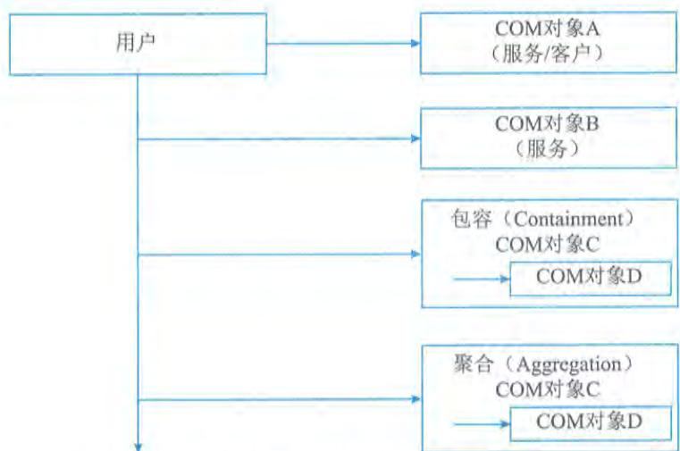
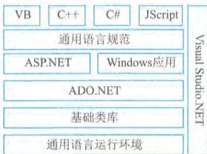

# 第7章 软硬件系统集成

计算机软硬件系统集成是根据组织治理、管理、业务、服务等场景化需求,优选各种信息技术和产品等,将各个分离的"信息孤岛"连接成为一个完整、可靠、经济和有效的整体,并使之能彼此协调工作,发挥整体效益,达到整体优化的目的。系统集成一般可以分为软件集成、硬件集成、网络集成、数据集成和业务应用集成等。通常,系统集成也就是将计算机软件、硬件、网络通信、信息安全、业务应用、数据管理等技术和产品集成为能够满足特定需求的信息系统。系统的软硬件集成活动也是一系列跨设备与系统等组件边界的融合活动,需要突破这些系统组件内部的"安全信任"机制,并通过技术手段,实现跨组件间的新的、动态的"安全信任"关系,这往往需要商用密码的深入应用。

# 7.1 系统集成基础

目前,我国在多年发展信息产业、推广信息技术应用的基础上,开始全面启动国民经济和社会信息化、现代化建设。随着信息技术的飞速发展,数字经济、数字社会、数字政府、数字化转型、高质量发展也越来越深入到社会各阶层。这对系统集成的相关参与者来说,无论是集成服务组织,还是需求建设组织,都提出了新的要求。系统集成服务组织在为其客户提供完整解决方案的同时,不仅要在技术上实现客户的场景化需求,还要对客户投资的实用性、适宜性和有效性等进行分析,往往还要为相关人员能力建设及信息技术持续应用创新提供可靠的服务。这就需要系统集成服务组织不仅要具有场景化咨询、工程设计、施工、培训、后期运维支持和服务的能力,还应具备从技术规范化到项目管理科学化等多方面的知识。

# 1.系统集成概念理解

对于什么是系统集成,有人认为系统集成只是计算机软硬件的简单搭配,没什么技术含量。有人认为系统集成就是技术问题,谈不上什么设计思想,这是对系统集成的狭义理解。随着计算机软硬件技术、网络技术和安全技术等的持续突破创新,以及信创产业的快速发展,科技自立自强已上升为国家战略,自主技术和能力被高度重视,赋予系统集成新的内涵。现在的系统集成已不只是为特定使用场景提供信息共享共治、互联互通等功能,而是通过基础设施和网络,将复杂的硬件、软件、业务、数据、信息、服务、人员有机地结合起来,以此为系统使用者最大限度地整合各种信息资源,并在满足需求的基础上,提高投资效率、管理效率、经营效率和治理能力,最终帮助建设组织获得最大的收益。系统集成是在系统工程科学方法的指导下,根据对需求场景的分析和计算机软硬件开发的技术规范等,提出系统的、整体的解决方案,同时将组成方案的硬件、软件、网络、业务、数据、人员等进行有机结合,达到满足场景需求的完整体系。由此可见,软硬件系统集成是一种系统的思想和方法,并具有工程思维,它虽然涉及软件和硬件等技术问题,但绝不仅仅是技术问题。可以说,软硬件系统集成是以信息的集成为

目标,功能的集成为结构,平台的集成为基础,人员的集成为保证。只有实现了上述全方位的集成,才是满足现代新业态需求的系统集成。

# 2. 系统集成项目特点

一般来说,软硬件系统集成项目属于典型的多学科合作项目,一般需要多种学科的配合,如在地理信息系统(GIS)、卫星导航系统(GPS)等系统集成过程中,需要地理信息技术、电子技术、无线射频技术等。系统集成服务组织要向客户提供具有针对性的整合应用解决方案,这就要求系统集成商除了要有IT方面的技术之外,还必须要有较丰富的行业经验。在系统集成项目中,由于场景的不同特点和需求,每一个系统集成项目往往都不完全一样,因此需要一定量的量身定做,带有一些非标准的问题,通常每一个项目也都可以带来新意,这也是系统集成项目的特点。

典型的系统集成项目具备以下特点:

- 集成交付队伍庞大,且往往连续性不是很强;

- 设计人员高度专业化,且需要多元化的知识体系;

- 涉及众多承包商或服务组织,且普遍分散在多个地区;

- 通常需要研制或开发一定量的软硬件系统,尤其是信创产品和信创系统的适配与系统优化;

- 通常采用大量新技术、前沿技术,乃至颠覆性技术;

- 集成成果使用越来越友好,集成实施和运维往往变得更加复杂。

# 3. 信创与系统集成发展

"十四五"以来,国家持续强调科技自立自强在国家发展中的战略支撑作用,核心技术是国之重器,需要立足自主创新、自立自强。《求是》杂志2022年三次发表习近平总书记关于"科技强国"的文章,强调科技攻关实现高水平自立自强的发展主线。党的二十大报告中,再次重申了发展信创产业实现关键领域信息技术自主可控的重要性。信创作为数据安全、网络安全的基础,其不仅是新基建的重要组成部分,也是各行各业数字化升级的"发动机",同时也是我国强化网络安全与信息安全的重要手段。通过应用牵引与产业培育,目前国产信息技术软硬件基础设施产品综合能力不断提升,操作系统、数据库等基础软件在应用场景中实现了可用、能用和好用。

国家标准《信息安全技术关键信息基础设施安全保护要求》(GB/T39204)给出了"关键信息基础设施行业"(简称"关基行业")的定义,即公共通信和信息服务、能源、交通、水利、金融、公共服务、电子政务、国防科技等重要行业和领域,以及其他一旦遭到破坏、丧失功能或者数据泄露,可能严重危害国家安全、国计民生、公共利益的信息设施。因此,通信、能源、交通、金融、电子政务等基础领域要加快推进行业信创进程。目前,我国在信息系统建设和信创产业发展方面也取得了巨大成绩,积累了宝贵经验。

信创的相关集成相对于传统系统集成来说,需要关注以下几方面:①由于技术与产品创新或原创较多,每种技术与产品所处的成熟度不同,这就需要集成服务商一方面充分把握好技术与产品的选型,另一方面基于技术与产品的生命周期情况,与对应的应用场景做好匹配融合;

$②$  信创技术产品往往迭代周期比较快,也会带来标准化程度困扰,这就需要集成服务组织充分理解并认知到这个问题,基于场景化需求程度、层次等的不同,合理使用处于快速迭代期的信创技术与产品;  $③$  信创技术与产品因为具有较强的自主可控能力,因此在面向场景化应用中,可以充分调动技术与产品厂商,进行场景化技术与产品创新,从而获得更好的经济与社会效益,并进一步驱动信创技术与产品发展。

# 7.2 基础设施集成

信息系统基础设施通常包括以局域网、互联网、5G、物联网、工业互联网和卫星互联网等为代表的通信网络基础设施,以人工智能、云计算和区块链为代表的新技术基础设施,以及以数据中心和超算中心等为代表的计算基础设施。信息系统基础设施从不同的维度有不同的划分方法,如可分为弱电系统、网络系统、数据中心等。

# 7.2.1 弱电工程

弱电一般指交流220V、50Hz以下的用电,是电力应用按照电力输送功率的强弱进行划分的一种方式,信息系统涉及的弱电工程非常多,包括电话通信系统、计算机局域网系统、音乐/广播系统、有线电视信号分配系统、视频监控系统、消防报警系统和楼宇自控系统等多种应用场景。

(1)电话通信系统。电话通信系统用来实现电话(包括三类传真机、可视电话等)通信功能,通常采用星形拓扑结构,使用三类(或以上)非屏蔽双绞线,传输信号的频率在音频范围内。

(2)计算机局域网系统。计算机局域网系统用来实现各种数据传输的网络基础,根据使用场景不同,可分为办公网、生产网、工控网、保密网、研发网等,通常采用星形拓扑结构,使用五类或以上的非屏蔽双绞线,传输数字信号,传输速率可达100Mb/s以上。计算机网络系统是弱电系统运用比较广泛的工程内容。

(3)音乐/广播系统。音乐/广播系统通过安装在现场(如商场、车站、走廊、办公区域等处)的扬声器、收音器等,对现场进行音乐播放或语音广播。通常采用多路总线结构,使用铜芯绝缘导线,传输由功率放大器输出的定压的音频信号,以驱动现场扬声器发声等。

(4)有线电视信号分配系统。有线电视信号分配系统是将有线电视信号均匀地分配到建筑物(群)内各用户点,通常采用分支器、分配器进行信号分配,为了减少信号失真和衰减,使各用户点信号质量达到规范规定的要求,其布线通常采用树形结构,使用75射频同轴电缆,传输多路射频信号,且随建筑物的形式及用户点分布的不同而不同。

(5)视频监控系统。视频监控系统是通过安装在现场(如数据中心、商场、车站、社区等处)的摄像机、防盗探测器等设备,对建筑物的各出入口和一些重要场所进行监视,可对异常情况进行报警。视频信号的传输通常采用星形结构,使用视频同轴电缆或光纤,控制信号的传输采用总线结构,使用铜芯绝缘缆线。随着网络技术与设备的大量普及,传统的闭路视频监控系统逐步被网络视频监控系统替代。网络视频监控系统通常是指用于安防监控和远程监控领域特定应用的网络监控系统,它使用户能够通过IP网络实现视频监控、视频图像记录和相关的报警管理。

(6)消防报警系统。消防报警系统由火灾报警、消防联动系统、消防广播系统、火警对讲电话系统等部分组成。火灾报警及消防联动系统通过设置在建筑物内各处的火灾探测器、手动报警装置等对现场情况进行监测,当有报警信号时,根据接收到的信号,按照事先设定的程序,联动相应的设备,以控制火势蔓延,其信号传输往往采用多路总线结构。对于重要消防设备(如消防泵、喷淋泵、正压风机、排烟风机等)的联动控制信号的传输,有时采用星形结构,信号的传输使用铜芯绝缘缆线(有的产品要求使用双绞线)。消防广播系统用于在发生火灾时指挥现场人员安全疏散,通常采用多路总线结构,信号传输使用铜芯绝缘导线(该系统可与音乐/广播系统合用)。火警对讲电话系统用于指挥现场消防人员进行灭火工作,通常采用星形和总线两种结构,信号传输使用屏蔽线。

(7)出入口控制系统/一卡通系统。出入口控制系统/一卡通系统使用计算机、智能卡门锁、读卡器等设备,对各出入口状态进行设置、监视、控制和记录等,实现对建筑物各出入口统一管理,保证大楼安全,其拓扑结构和传输介质因产品或场景需求而异。

(8)停车收费管理系统。停车收费管理系统通过安装在车辆出入口地面下的感应线圈,感应车辆的出入,通过人工/半自动/全自动收费管理系统,实现收费和控制电动栏杆的启闭等。该系统布线仅限于车场的出入口处,每一个出入口由一台控制器控制,控制器可以独立工作,也可以与上位管理计算机联网,其布线结构和传输介质因产品或场景需求而异。

(9)楼宇自控系统。楼宇自控系统通过与现场控制器相连的各种检测和执行器件,对大楼内外的各种环境参数以及楼内各种设备(如空调、给排水、照明、供配电、电梯等设备)的工作状态进行检测、监视和控制,并通过计算机网络连接各现场控制器,对楼内的资源和设备进行合理分配和管理,达到舒适、便捷、节省、可靠的目的。楼宇自控系统不同厂家的产品所采用的通信协议各不相同,其现场总线和控制总线的拓扑结构和传输介质也就不同。

(10)智能化系统。智能化系统指的是由现代通信与信息技术、计算机网络技术、行业技术、智能控制技术汇集而成的,针对某一领域或场景应用的智能集合。随着信息技术的不断发展,其技术含量及复杂程度也越来越高,智能化的概念开始逐渐渗透到各行各业以及人们生活中的方方面面,相继出现了智能住宅小区、智能医院、智能楼宇等,都以智能化建筑为基点生发开来。因此我们通常提到的智能化系统,都是指智能化建筑系统。

此外,弱电工程还有电视会议系统、屏幕显示系统、扩声系统、巡更系统、楼宇对讲系统、三表(水、电、气表)自动抄表系统等。因此,不同功能的建筑物需要设置的弱电系统各不相同。在弱电工程实际工作中,设计者通常从线路集成(共享)、网络集成、功能集成和软件界面集成等方面来考虑各弱电系统间的集成应用。

总之,弱电工程是一项技术性较强的系统工程,要真正做好一个建筑弱电系统的集成,不仅要求弱电工程师对各弱电系统产品的功能、技术参数以及施工、安装、调试等有比较深的掌握,还要对建筑的给排水系统、供配电系统、通风空调系统、照明系统、电梯系统等有比较全面的了解。同时,由于建筑弱电系统涉及通信、计算机、控制以及显示等多项技术含量高、更新发展快的现代化高新技术,所以在系统集成的具体实施过程中,在很多技术性比较强的细节问题的解决上,还需要各方面的专业技术人员的支持、合作和融合创新。

# 7.2.2 网络集成

网络系统集成就是在网络工程中，根据场景化应用的需要，运用技术、管理等手段，将网络基础设施、网络设备、网络系统软件、网络基础服务系统以及计算机硬件设备、软件系统、应用软件等组织集成为一体，使之能组建成为一个完整、可靠、经济、安全、高效的计算机网络系统的全过程。从技术角度来看，网络系统集成是将计算机技术、网络技术、控制技术、通信技术、应用系统开发技术、建筑装修等技术综合运用到网络工程中的一门综合技术。网络集成工程一般包括项目前期方案，线路、弱电等施工，网络设备架设，各种系统架设和网络后期维护等项目建设和信息技术服务工作。

计算机网络系统集成通常比较复杂，特别是大型网络系统更是如此，因为网络集成不仅涉及技术问题，而且涉及组织的管理问题。从技术角度讲，网络集成不仅涉及不同厂家的网络设备和管理软件，也会涉及异构和异质网络系统的互联问题。从管理角度讲，每个组织的管理方式和管理思想千差万别，实现向网络化管理的转变会面临许多人为的因素。因此，在实际网络集成项目中需结合组织的实际情况，通过建立网络系统集成的体系框架来指导网络系统建设是相当关键的问题。计算机网络集成的一般体系框架通常包括网络传输子系统、交换子系统、网管子系统和安全子系统等。

# 1.传输子系统

传输是网络的核心，是网络信息的“公路”和“血管”。传输线路带宽的高低不仅体现了网络的通信能力，也体现了网络的现代化水平。并且，传输介质在很大程度上也决定了通信的质量，从而直接影响到网络协议。目前主要的传输介质分为无线传输介质和有线传输介质两大类。常用的无线传输介质主要包括无线电波、微波、红外线等，常用的有线传输介质主要包括双绞线、同轴电缆、光纤等。

# 2.交换子系统

网络按所覆盖的区域可分为局域网、城域网和广域网，因此，网络交换也可以分为局域网交换技术、城域网交换技术和广域网交换技术。

（1）局域网交换技术。局域网可分为共享式局域网和交换式局域网两种。共享式局域网通常是共享高速传输介质，例如以太网（包括快速以太网和千兆以太网等）、令牌环（TokenRing）、FDDI等；交换式局域网是指以数据链路层的帧或更小的数据单元（称为信元）为交换单位，以硬件交换电路构成的交换设备。交换式网络具有良好的扩展性和很高的信息转发速度，能适应不断增长的网络应用的需要。

（2）城域网交换技术。城域网是在一个城市范围内所建立的计算机通信网。由于采用具有有源交换元件的局域网技术，网络中传输时延较小，它的传输媒介主要是光缆。城域网的典型应用即为宽带城域网，就是在城市范围内，以IP和ATM电信技术为基础，以光纤作为传输媒介，集数据、语音、视频服务于一体的高带宽、多功能、多业务接入的多媒体通信网络。作为城市最重要的基础设施之一，城市信息网络正变得越来越重要。

（3）广域网交换技术。广域网是连接不同地区局域网或城域网计算机通信的远程网。通常

跨接很大的物理范围,所覆盖的范围从几十公里到几千公里,它能连接多个地区、城市和国家,或横跨几个洲,并能提供远距离通信,形成国际性的远程网络。广域网并不等同于互联网,一般所指的互联网属于一种公共型的广域网。广域网的主要技术有:

- 电路交换:是指通过由中间节点建立的一条专用通信线路来实现两台设备的数据交换。例如,电话网就是采用电路交换技术。电路交换的优点是,一旦建立起通信线路,通信双方能以恒定的传输速率传输数据,而且时延小;其缺点是通信线路的利用率较低。- 报文交换:是指通信双方无专用线路,而是以报文为单位交换数据,通过节点的多次"存储转发"将发方报文传送到目的地。报文交换的优点是通信线路的利用率较高,缺点是报文传输时延较大。- 分组交换:是指将数据划分成固定长度的分组(长度远小于报文),然后进行"存储转发",从而实现更高的通信线路利用率、更短的传输时延和更低的通信费用。- 混合交换:主要是指同时使用电路交换技术和分组交换技术。典型的应用是ATM交换技术。

# 3. 安全子系统

由于网络的发展,安全问题一直是网络研究和应用关注的热点。网络安全主要关注的内容包括:

- 使用防火墙技术,防止外部侵犯。防火墙技术主要有分组过滤技术、代理服务器和应用网关等。

- 使用数据加密技术,防止任何人从通信信道窃取信息。目前主要的加密技术包括对称加密算法(如DES)和非对称加密算法(如RSA)。

- 访问控制,主要是通过设置口令、密码和访问权限保护网络资源。

# 4. 网管子系统

网络是一种动态结构。随着组织规模的扩大和改变,网络也会跟着扩大和改变。配置好网络以后,必须对其进行有效的管理,确保网络能连续不断地满足组织的需要。对于任何网管子系统来说,关键的任务便是保证网络良好地运行。由于网络规模的扩大,通常会出现网络"瓶颈"问题,使系统的速度放慢。网管的职责便是找出瓶颈并解决它。

# 5. 服务子系统

网络服务是网络应用最核心的问题。带宽再高的网络,如果没有好的网络服务,就不能发挥网络的效益。网络服务主要包括互联网服务、多媒体信息检索、信息点播、信息广播、远程计算和事务处理以及其他信息服务等。

# 7.2.3 数据中心集成

数据中心集成通常包括数据中心基础设施、通信机房、计算中心、数据处理中心、分布式计算、电信设备、网络和安全设备等集成环境。在数据中心集成建设中,机房建设或改造是基础的工程,机房建设或改造包括网络中心机房、高性能计算机机房和相关辅助机房的建设、

改造和装修,此外还包括机房UPS电源、空调、接地和防雷工程及其他配套设施(如弱电工程)等。

# 1. 机柜集成

在数据中心集成项目中,机房设备必不可少,而机柜又是其中的主要设备之一。项目工作人员在安装机柜之前,首先对机房可用空间进行规划,考虑设备的散热和设备维护,同时明确机柜安装流程。具体机柜集成安装工作包括安装前的准备工作(如场地划线、机柜及其附件拆箱等工作)、按照机柜安装流程进行施工(如机柜摆放、强电线与弱电线等固定电线,强电线通常是指机箱电源线的用电电线,弱电线通常是指网线、电话线等)以及机柜安装后的调试等。

# 2. 服务器集成

服务器是系统集成中的关键设备。服务器的作用就是向工作站提供处理器、内存、磁盘、打印机、软件数据等资源和服务,并负责协调管理这些资源。服务器集成工作就是要把服务器设备按项目实施方案及其安装顺序安装到机柜中,并基于项目实施方案或系统设计方案中的服务器系统设计进行服务器操作系统调试。在服务器集成实施工作之前,需要熟悉项目实施方案中的服务器设计方案,包括网络拓扑、服务器应用设计、服务器资源划分、服务器运行要求等。针对网络服务器,由于网络服务器要同时为网络上所有的用户服务,因此要求网络服务器具有较高的性能,包括较快的处理速度、较大的内存、较大的磁盘容量和高可靠性。根据网络的应用情况和规模,网络服务器可选用高配置微机、工作站、小型机、超级小型机和大型机等。选择网络服务器时要考虑以下因素:  $①$  CPU的速度和数量;  $②$  内存容量和性能;  $③$  总线结构和类型;  $④$  磁盘容量和性能;  $⑤$  容错性能;  $⑥$  网络接口性能;  $⑦$  服务器软件等。

# 3. 存储集成

存储集成实施通常与服务器集成相辅相成,存储设备集成时要考虑以下因素:  $①$  磁盘阵列空间和类型;  $②$  配置硬盘的数量;  $③$  RAID控制器结构;  $④$  支持RAID0、RAID1、RAID5或更多类型;  $⑤$  IOPS读写性能和数据传输能力;  $⑥$  满足高可靠性,配置冗余热插拔的电源、风扇等。同时,基于互联网技术的发展和信息化的广泛应用,云存储越来越普及,云存储的应用领域也越来越广。云集成存储通常是指将数据分层和/或隐藏在基于云端的存储技术。

# 4. 网络设备集成

网络设备集成工作通常基于软硬件集成项目中的网络规划与设计,进行设备上架和连接,并完成网络测试。网络规划与设计内容包括拓扑规划、设备安装部署设计、网络规划等。其中,网络规划通常又包括WAN规划、LAN规划、IP地址规划、路由规划、无线规划、网管规划、服务规划和安全规划等。网络设备通常包括核心交换机、汇聚交换机、接入交换机、路由器、中继器、集线器、网关、网桥等。

# 5. 安全设备集成

数据中心是组织信息环境最重要的部位之一,是信息化的神经中枢,数据中心的设计、集成实施和建设应具备满足业务需求和安全管理要求的安全性,同时还要保持充足的带宽和系统

可靠性。安全设备集成工作主要为围绕网络安全建设规划方案,对防火墙系统、网络入侵防御系统、网络入侵检测系统、病毒过滤网关、漏洞扫描、主机监控与审计、网络安全审计、数据库审计、日志审计系统、Web应用防护、网页防篡改、安全管理平台、堡垒机以及VPN系统等安全系统和设备进行集成实施安装部署和测试工作。

# 7.3 软件集成

软件是实现信息系统运行、互联互通、数据计算与管理的基础载体,是信息系统集成的直接执行者,面向场景化的业务信息系统,需要基础软件和应用软件的充分融合,也需要基础软件之间、应用软件之间高效能、高质量的集成。

# 7.3.1 基础软件集成

操作系统、数据库、中间件等作业驱动计算机运行的关键组件,是信息系统集成的重点关注内容,随着计算机及网络性能的大幅提升和新型技术的成熟应用,尤其是随着计算机系统走向云化和互联网化,各类基础软件的结构、功能、用途等都持续发生变化,总体来说,朝着更加便捷、高效集成的方向发展。

# 1.操作系统

操作系统(Operating System,OS)是计算机系统中最基本,也是最为重要的基础性系统软件,它是一组主管并控制计算机操作、运用和运行硬件、软件资源以及提供公共服务来组织用户交互的相互关联的系统软件程序。

# 1)分类与功能

操作系统种类繁多,根据运行的环境,操作系统可以分为桌面操作系统、服务器操作系统、手机操作系统、嵌入式操作系统等。从功能角度分析,分别有批处理操作系统、实时操作系统、分时操作系统、网络操作系统、分布式操作系统等。批处理操作系统是最早的操作系统类型之一,它的主要功能是批量执行一系列事先编写好的作业。用户将作业提交给操作系统,系统按顺序执行并输出结果;实时操作系统主要应用于对时间敏感的系统,如航空航天、工业自动化等领域,可分为硬实时系统和软实时系统;分时操作系统是为多用户和多任务而设计的操作系统,它可以同时为多个用户提供服务,每个用户的任务在时间上交替执行,给用户一种同时独占计算机的感觉;网络操作系统是为网络环境而设计的操作系统,它提供了一组管理网络资源和服务的功能,使得多个计算机可以协同工作、共享资源;分布式操作系统是一种多台计算机协同工作的操作系统,它将计算和存储任务分布到多台计算机上,以提高整个系统的性能和可靠性。目前我国自主研发的操作系统主要有中标麒麟、银河麒麟、深度Deepin、华为鸿蒙等,各类组织都在深度参与操作系统的开发、适配和应用,进一步激发和繁荣我国在该领域的发展。

操作系统集成是围绕其主要功能开展安装部署和性能优化工作,操作系统功能主要包括以下几个方面:

- 进程管理: 其工作主要是进程调度, 在单用户单任务的情况下, 处理器仅为一个用户的一个任务所独占, 进程管理的工作十分简单。但在多道程序或多用户的情况下, 组织多个作业或任务时, 就要解决处理器的调度、分配和回收等问题。

- 存储管理: 分为存储分配、存储共享、存储保护、存储扩张等功能。

- 设备管理: 具有设备分配、设备传输控制、设备独立性等功能。

- 文件管理: 具有文件存储空间管理、目录管理、文件操作管理、文件保护等功能。

- 作业管理: 负责处理用户提交的任何要求。

2) 网络操作系统

网络操作系统是一种可代替一般操作系统的软件程序, 是网络环境的心脏和灵魂, 是向网络计算机提供服务的特殊操作系统。信息系统通过网络实现互相传递数据与各种消息, 结构上可分为服务器及客户端。服务器的主要功能是管理服务器和网络上的各种资源和网络设备的共用, 加以统合并管控流量, 避免瘫痪; 客户端具备接收服务器所传递的数据来运用的功能, 以便让客户端可以清楚地搜索所需的资源。因此, 网络操作系统的主要任务是调度和管理网络资源, 为网络用户提供统一、透明使用网络资源的手段。网络资源主要包括网络服务器、工作站、打印机、网桥、路由器、交换机、网关、共享软件和应用软件等。网络操作系统的基本功能包括:

- 数据共享: 数据是网络最主要的资源, 数据共享是网络操作系统最核心的功能。

- 设备共享: 网络用户共享比较昂贵的设备, 例如激光打印机、大屏幕显示器、绘图仪、大容量磁盘等。

- 文件管理: 管理网络用户读/写服务器文件, 并对访问操作权限进行协调和控制。

- 名字服务: 网络用户注册管理, 通常由域名服务器完成。

- 网络安全: 防止非法用户对网络资源的操作、窃取、修改和破坏。

- 网络管理: 包括网络运行管理和网络性能监控等。

- 系统容错: 防止主机系统因故障而影响网络的正常运行, 通常采用UPS电源监控保护、双机热备份、磁盘镜像和热插拔等技术措施。

- 网络互联: 将不同的网络互联在一起, 实现彼此间的通信与资源共享。

- 应用软件: 支持电子邮件、数据库、文件服务等各种网络应用。

3) 分布式操作系统

分布式操作系统是为分布计算系统配置的操作系统。它在资源管理、通信控制和操作系统的结构等方面都与其他操作系统有较大的区别。由于分布式操作系统的资源分布于系统的不同计算机上, 操作系统对用户的资源需求不能像一般操作系统那样采用等待有资源时直接分配的简单做法, 而是要在系统的各台计算机上搜索, 找到所需资源后才可进行分配。对于有些资源, 如具有多个副本的文件, 还必须考虑一致性等。所谓一致性, 是指若干用户对同一个文件所同时读出的数据是一致的。为了保证一致性, 操作系统须控制文件的读、写、操作等, 使得多个用户可同时读一个文件, 而任一时刻最多只能有一个用户在修改文件。分布式操作系统的通信功能类似于网络操作系统。分布式操作系统不像网络分布得很广, 且分布式操作系统还要支持

并行处理,因此它提供的通信机制和网络操作系统提供的有所不同,它要求通信速度更高、稳定性更强。分布式操作系统的结构也不同于其他操作系统,它分布于系统的各台计算机上,能并行地处理用户的各种需求,有较强的容错能力。

# 4)虚拟化与安全

操作系统虚拟化作为容器的核心技术,得到了研究者的广泛关注。操作系统虚拟化技术允许多个应用在共享同一主机操作系统(Host OS)内核的环境下隔离运行,主机操作系统为应用提供一个个隔离的运行环境,即容器实例。操作系统虚拟化技术架构可以分为容器实例层、容器管理层和内核资源层。操作系统虚拟化与传统虚拟化最本质的不同在于,传统虚拟化需要安装客户机操作系统(Guest OS)才能执行应用程序,而操作系统虚拟化通过共享的宿主机操作系统来取代客户机操作系统。

随着计算机网络与应用技术的不断发展,计算机信息系统安全问题越来越引起人们的关注。信息系统一旦遭受破坏,用户及单位将遭受重大的损失。对信息系统进行有效的保护,是我们必须面对和解决的迫切课题,而操作系统安全在计算机系统整体安全中至关重要,做好操作系统安全加固和优化服务是实现信息系统安全的关键环节。当前,对操作系统安全构成威胁的问题主要有系统漏洞、脆弱的登录认证方式、访问控制问题、计算机病毒、木马、系统后门、隐蔽通道、恶意程序和代码感染等。加强操作系统安全加固工作也是整个信息系统安全的基础。

目前,在信创产业快速发展的大势之下,信创操作系统将迅速崛起。操作系统的集成工作,主要是基于项目实施方案(系统部署方案),围绕操作系统安装、资源分配、系统管理等项目任务,开展集成实施交付工作,以及基于信创环境的操作系统应用的适配、测试、验证和性能调优等工作。

# 2.数据库

数据库是按照数据结构来组织、存储和管理数据的仓库,是一个长期存储在计算机内的、有组织的、可共享的、统一管理的大量数据的集合。数据库管理系统是为管理数据库而设计的计算机软件系统,一般具有存储、截取、安全保障、备份等基础功能。因此,数据库管理系统是数据库系统的核心组成部分,主要完成对数据库的操作与管理功能,实现数据库对象的创建,以及数据库存储数据的查询、添加、修改与删除操作和数据库的用户管理、权限管理等。数据库管理系统安全直接关系到整个数据库系统的安全。

分布式数据库是数据库技术与分布式技术的一种结合。分布式数据库技术是指把在地理意义上分散的各个数据库节点,但在计算机系统逻辑上又是属于同一个系统的数据结合起来的一种数据库技术。既有着数据库间的协调性,也有着数据的分布性。分布式数据库系统并不注重系统的集中控制,而是注重每个数据库节点的自治性。此外,为了让程序员能够在编写程序时减轻工作量,并减少系统出错的可能性,一般都完全不考虑数据的分布情况,这样就使得系统数据的分布情况一直保持着透明性。

数据库的集成工作,主要是基于项目实施方案(包括数据库建设方案或数据库设计),围绕数据库系统安装、数据库创建、数据库迁移、数据库备份与恢复、数据库管理等项目任务,开展集成实施交付工作,以及基于信创环境的数据库应用的适配、测试、验证和性能调优等工作。

# 3.中间件

3. 中间件中间件是基础软件的一大类,属于可复用软件的范畴。顾名思义,中间件处于操作系统软件与用户的应用软件的中间,即中间件在操作系统、网络和数据库之上,应用软件的下层,它总的作用是为处于自己上层的应用软件提供运行与开发的环境,帮助用户灵活、高效地开发和集成复杂的应用软件。

1)中间件的功能

1)中间件的功能中间件是独立的系统级软件,连接操作系统层和应用程序层,将不同操作系统提供的应用接口标准化,协议统一化,屏蔽具体操作的细节。通常来看,中间件一般提供通信支持、应用支持、公共服务等功能。

- 通信支持。中间件为其所支持的应用软件提供平台化的运行环境,该环境屏蔽底层通信之间的接口差异,实现互操作,所以通信支持是中间件最基本的功能。早期应用与分布式中间件交互的主要通信方式为远程调用和消息。通信模块中,远程调用通过网络进行通信,通过支持数据的转换和通信服务,从而屏蔽不同的操作系统和网络协议。远程调用提供基于过程的服务访问,只为上层系统提供非常简单的编程接口或过程调用模型。消息提供异步交互的机制。

- 应用支持。中间件的目的是服务上层应用,提供应用层不同服务之间的互操作机制。中间件为上层应用开发提供统一的平台和运行环境,并封装不同操作系统提供的API接口,向应用系统提供统一的标准接口,使应用系统的开发和运行与操作系统无关,实现其独立性。中间件的松耦合的结构、标准的封装服务和接口、有效的互操作机制,都给应用结构化和开发方法提供了有力的支持。

- 公共服务。公共服务是对应用软件中的共性功能或约束的提取。将这些共性的功能或者约束分类实现,并支持复用,作为公共服务提供给应用程序使用。通过提供标准、统一的公共服务,可减少上层应用的开发工作量,缩短应用的开发时间,并有助于提高应用软件的开发效率和质量。

2)中间件的分类

2)中间件的分类中间件技术的发展,经历了面向过程的分布式计算技术、面向对象的分布式计算技术、面向Agent(代理)的分布式计算技术等多个阶段。中间件产品通常分为事务式中间件、过程式中间件、面向消息的中间件、面向对象中间件、交易中间件、Web应用服务器等。

- 事务式中间件:又称为事务处理管理程序,是当前应用最广泛的中间件之一,其主要功能是提供联机事务处理所需要的通信、并发访问控制、事务控制、资源管理、安全管理、负载平衡、故障恢复和其他必要的服务。事务式中间件支持大量客户进程的并发访问,具有极强的扩展性。由于事务式中间件具有可靠性高、极强的扩展性等特点,它主要应用于金融、电信、电子商务、电子政务等拥有大量客户的行业和领域。

- 过程式中间件:又称为远程过程调用中间件。过程式中间件一般从逻辑上分为两部分:客户机和服务器。客户机和服务器是一个逻辑概念,既可以运行在同一计算机上,也可以运行在不同的计算机上,甚至客户机和服务器底层的操作系统也可以不同。客户机和

服务器之间的通信可以使用同步通信,也可以采用线程式异步调用。所以过程式中间件有较好的异构支持能力,简单易用。但由于客户机和服务器之间采用访问连接,所以在易剪裁性和容错性等方面有一定的局限性。

- 面向消息的中间件:简称为消息中间件,它是一类以消息为载体进行通信的中间件,利用高效可靠的消息机制,来实现不同应用间大量的数据交换。按其通信模型的不同,消息中间件的通信模型有两类:消息队列和消息传递。通过这两种通信模型,不同应用之间的通信和网络的复杂性脱离,摆脱对不同通信协议的依赖,可以在复杂的网络环境中高可靠、高效率地实现安全的异步通信。消息中间件的非直接连接,支持多种通信规程,达到多个系统之间的数据共享和同步。

- 面向对象中间件:又称为分布对象中间件,是分布式计算技术和面向对象技术发展的结合,简称为对象中间件。分布对象模型是面向对象模型在分布异构环境下的自然拓展。面向对象中间件给应用层提供各种不同形式的通信服务,通过这些服务,上层应用对事务处理、分布式数据访问、对象管理等处理更简单易行。

- 交易中间件:是一种专门针对联机交易处理系统而设计的软件。联机交易处理系统需要处理大量的并发进程,而处理并发进程势必涉及操作系统、文件系统、编译语言、数据库系统等各类基础软件和应用软件,是一项相当复杂的任务,但这类高难度的工作可以通过采用交易中间件使之简化。使用交易中间件可以大大减少开发一个联机交易处理系统所需的编程工作量。

- Web应用服务器:是Web服务器和应用服务器相结合的产物。应用服务器中间件可以说是软件的基础设施,利用构件化技术将应用软件整合到一个确定的协同工作环境中,并提供多种通信机制、事务处理能力以及应用的开发管理功能。由于直接支持三层或多层应用系统的开发,应用服务器受到了业界的广泛欢迎,是中间件市场上的热点,J2EE架构是应用服务器方面的主流标准。

随着信息技术的应用和发展,新的应用需求、技术创新、应用领域促成了新的中间件产品的出现。如互联网中云计算技术发展的云计算中间件、物流网的中间件等,随着应用市场的需求应运而生。中间件的集成工作,主要是基于项目实施方案(服务器部署和中间件部署方案),围绕中间件安装、应用部署、中间件管理等项目任务,开展集成实施交付工作,以及基于信创环境的中间件应用的适配、测试、验证和性能调优等工作。

# 4.办公软件

办公软件的应用范围很广,小到会议记录、数字化的办公,大到社会统计,都离不开办公软件的工作支撑。办公软件通常是指可以进行文字处理、表格制作、幻灯片制作、图形图像处理、简单数据库处理等工作的软件。当前,办公软件朝着操作简单化、功能细化等方向发展。另外,在有些范围和领域,如政务用的电子政务、税务用的税务系统、企业用的协同办公软件,也属于办公软件的范畴。

当前办公软件的集成工作主要涉及流式软件和版式软件。对流式文档进行处理的软件就是流式软件,其特长在于所见即所得地编辑文档。对版式文档进行处理的软件就是版式软件,其特长在于原封不动地显示、打印、分享原文件内容,不做任何改动与编辑。

金山的WPS Office软件就是典型的流式软件,所保存的文档就是流式文件。流式文件支持编辑,其内容是流动的,中间键入新内容将导致后面的内容"流"到下一行或下一页去。流式文件在不同的软硬件环境中,显示效果是会发生变化的,比如,同一个Word文档,在不同版本的Office软件中或者不同分辨率的计算机上,显示效果都是有所不同的,也就是"跑版"现象。

针对版式软件,当前业界有两种版式标准:一种是国际版本PDF;另一种是国家标准OFD。OFD简单来说就是国家标准版式,一般应用于政务领域公文、文件等业务中。当前各类PDF阅读器、编辑器就是典型的版式软件,所保存的PDF文档就是版式文件。版式文件形成后,不可编辑和篡改正文,只能在其上附加注释印章等信息。所以,版式文档非常适合做高度严肃、版面高度精确的文档的载体,如电子公文、电子证照、电子凭据等。与流式文件相比,版式文档不会"跑版",在任何设备上显示和打印效果是高度精确一致的。

目前,办公软件的集成工作主要是基于信创环境下的办公软件产品进行安装、管理和应用,尤其是基于信创环境办公软件的适配、测试、验证和性能调优等工作。

# 7.3.2 应用软件集成

随着软件工程面向对象技术和网络技术的发展,信息系统开发环境也逐步体现出从结构化到面向对象、从集中到分布、从同构到异构、从独立到集成、从辅助到智能、从异步到协同的发展趋势。应用系统的开发已从以单机为中心逐步过渡到以网络环境为中心,成千上万台个人计算机与工作站已变成全球共享的庞大的计算机信息资源。开放系统可让用户透明地应用由不同厂商制造的不同硬件平台、不同操作系统组成的异构型计算资源,在千差万别的信息资源(异构的、网络的、物理性能差别很大的、不同厂商和不同语言的信息资源)的基础上构造起信息共享的分布式系统。面对这样的趋势,必须对面向对象技术进行改进和扩展,使之符合异构网络应用的要求。就用户来说,这种软件构件能够"即插即用",即能从所提供的对象构件库中获得合适的构件并重用;就供应商来说,这种软件构件便于用户裁剪、维护和重用。当然,应用软件集成还包括对应用软件本身上线运行的性能进行持续优化。由此可见,应用软件集成就是指,根据软件需求,把现有软件构件重新组合,以较低的成本、较高的效率实现目的要求的技术和集成方法。基于此,应用软件系统之间的集成和整合势在必行。应用软件系统集成和整合的常见方式有软件系统间以接口方式相互调用、软件系统功能完全融合在一个系统中。软件系统之间使用单点登录等,被产业界公认的解决应用集成的最佳方式是SOA。应用软件系统集成的功能通常包括界面集成、功能集成、接口集成以及系统对应的数据集成等。

应用系统的组件化将大而全的软件分解成很多小部分,每一小部分和其他部分都是松耦合的关系。信息在应用内的组件之间的流动要非常高效,否则工作的体验和生产效率就会受到影响。因此,集成工作者做了大量工作,致力于改进组件间信息的交换。在应用软件集成领域,移动和移动工作的巨大作用鼓励越来越多的应用系统组件化。应用系统组件化的一大驱动因素是组件重用,从一个通用组件集构建出多个应用。根据业务和信息发展需要,要在应用间重用组件,应用本身的壁垒被打破,应用集成和组件集成成为趋势。组件集成工具,比如服务和消

息总线或服务数据定义语言,也能够用来集成应用程序。

当前,云计算和虚拟化已经打破了应用程序或者组件和服务器资源之间的传统壁垒。服务器已经是资源池的一部分,一些服务器甚至可能在组织外的公有云上。任何功能都可能运行在任何地方,因此需要记录下来它到底在哪里运行,这样其他组件才能够找到它,以动态方式部署应用意味着在部署组件之间提供动态的链接。

应用集成随着应用开发的进化在不停演变,促使应用集成也在持续改进。敏捷运营创建出了新工具集的需求,并且这些工具已经进化为更为复杂的编排工具,来部署并且链接运行在资源池上的应用和组件。这些工具随着进化和改进,吸收了曾经是应用集成传统部分的功能。

在软件集成的大背景下,出现了有代表性的软件构件标准,如公共对象请求代理结构(Common Object Request Broker Architecture, CORBA)、COM、DCOM与COM+、.NET、J2EE应用架构等标准。

# 1.CORBA

对象管理组织(Object Management Group, OMG)是CORBA规范的制定者,是由800多个信息系统供应商、软件开发者和用户共同构成的国际组织,建立于1989年。OMG在理论上和实践上促进了面向对象软件的发展。OMG的目的则是将对象和分布式系统技术集成为一个可相互操作的统一结构,此结构既支持现有的平台,也将支持未来的平台集成。以CORBA为基础,利用JINI技术,可以结合各类电子产品成为网络上的服务资源,使应用集成走向更广阔的应用领域,同时Object Web把CORBA的技术带入了Internet世界。CORBA是OMG进行标准化分布式对象计算的基础。CORBA自动匹配许多公共网络任务,例如对象登记、定位、激活、多路请求、组帧和错误控制、参数编排和反编排、操作分配等。CORBA具有以下功能:

(1)对象请求代理(Object Request Broker,ORB)。在CORBA中,各个模块的相互作用都是通过对象请求代理完成的。ORB的作用是把用户发出的请求传给目标对象,并把目标对象的执行结果返回给发出请求的用户。因此,ORB是以对象请求的方式实现应用互操作的构架,它提供了用户与目标对象间的交互透明性,是人们能够有效使用面向对象方法开发分布式应用的基础,而ORB是整个参考模型的核心。

(2)对象服务。CORBA对象服务扩展了基本的CORBA体系结构。它的对象服务代表了一组预先实现的、软件开发商通常需要的分布式对象,其接口与具体应用领域无关,所有分布式对象程序都可以使用。目前CORBA共规范定义了15种服务,如名录服务(Naming Service)、事件服务(Event Service)、生命周期服务(Life Cycle Service)、关系服务(Relationship Service)以及事务服务(Transaction Service)等。

(3)公共功能(Common Facility)。公共功能与对象服务的基本功能类似,只是公共功能是面向最终用户的应用。例如,分布式文档组件功能(基于OpenDoc的组件文档公共功能)就是公共功能的一个例子。

(4)域接口(Domain Interface)。提供与对象服务和公共功能相似的接口,但这些接口是面向特定应用领域的。这些领域包括制造业、电信、医药和金融业等。

(5)应用接口(Application Interface)。提供给应用程序开发的接口。

目前，CORBA规范本身还处于不断发展的过程中，随着与其他相关技术的结合，CORBA将能够为应用开发提供功能更强大的服务。

# 2.COM

COM中的对象是一种二进制代码对象，其代码形式是DLL或EXE执行代码。COM中的对象都被直接注册在Windows的系统库中，所以，COM中的对象都不再是由特定的编程语言及其程序设计环境所支持的对象，而是由系统平台直接支持的对象。COM对象可能由各种编程语言实现，并为各种编程语言所引用。COM对象作为某个应用程序的构成单元，不但可以作为该应用程序中的其他部分，而且可以单独地为其他应用程序系统提供服务。

COM技术要达到的基本目标是：即使对象是由不同的开发人员用不同的编程语言实现的，在开发软件系统时，仍能够有效地利用已经存在于其他已有软件系统中的对象，同时，也要使当前所开发的对象便于今后开发其他软件系统时进行重用。

为了实现与编程语言的无关性，将COM对象制作成二进制可执行代码，然后在二进制代码层使用这种标准接口的统一方式，为对象提供标准的互操作接口，并且由系统平台直接对COM对象的管理与使用提供支持。COM具备了软件集成所需要的许多特征，包括面向对象、客户机/服务器、语言无关性、进程透明性和可重用性。

（1）面向对象。COM是在面向对象的基础上发展起来的。它继承了对象的所有优点，并在实现上进行了进一步的扩充。

（2）客户机/服务器。COM以客户机/服务器（C/S）模型为基础，且具有非常好的灵活性，如图7-1所示。

  
图7-1 在COM应用中的C/S计算模型

（3）语言无关性。COM规范的定义不依赖于特定的语言，因此，编写构件对象所使用的语言与编写用户程序使用的语言可以不同，只要它们都能够生成符合COM规范的可执行代码即可。

（4）进程透明性。COM提供了3种类型的构件对象服务程序，即进程内服务程序、本地服

务程序和远程服务程序。

(5) 可重用性。可重用性是任何对象模型的实现目标, 尤其对于大型的软件系统, 可重用性非常重要, 它使复杂的系统简化为一些简单的对象模型, 体现了面向对象的思想。COM 用两种机制 (包容和聚合) 来实现对象的重用。对于 COM 对象的用户程序来说, 它只是通过接口使用对象提供的服务, 并不需要关心对象内部的实现过程。

# 3. DCOM 与 COM+

DCOM 作为 COM 的扩展, 不仅继承了 COM 的优点, 而且针对分布环境提供了一些新的特性, 如位置透明性、网络安全性、跨平台调用等。DCOM 实际上是对用户调用进程外服务的一种改进, 通过 RPC 协议, 使用户通过网络可以以透明的方式调用远程机器上的远程服务。在调用的过程中, 用户并不是直接调用远程机器上的远程服务, 而是首先在本地机器上建立一个远程服务代理, 通过 RPC 协议, 调用远程服务机器上的存根 (stub), 由存根来解析用户的调用以映射到远程服务的方法或属性上。

COM+ 为 COM 的新发展或 COM 更高层次上的应用, 其底层结构仍然以 COM 为基础, 几乎包容了 COM 的所有内容。COM+ 倡导了一种新的概念, 它把 COM 组件软件提升到应用层而不再是底层的软件结构, 通过操作系统的各种支持, 使组件对象模型建立在应用层上, 把所有组件的底层细节留给操作系统。因此, COM+ 与操作系统的结合更加紧密。COM+ 的主要特性包括: 真正的异步通信、事件服务、可伸缩性、继承并发展了 MTS 的特性、可管理和可配置性、易于开发等。

(1) 真正的异步通信。COM+ 底层提供了队列组件服务, 这使用户和组件有可能在不同的时间点上协同工作, COM+ 应用无须增加代码就可以获得这样的特性。

(2) 事件服务。新的事件机制使事件源和事件接收方实现事件功能更加灵活, 利用系统服务简化了事件模型, 避免了 COM 可连接对象机制的琐碎细节。

(3) 可伸缩性。COM+ 的可伸缩性来源于多个方面, 动态负载平衡以及内存数据库、对象池等系统服务都为 COM+ 的可伸缩性提供了技术基础。COM+ 的可伸缩性原理上与多层结构的可伸缩特性一致。

(4) 继承并发展了 MTS 的特性。从 COM 到 MTS 是一个概念上的飞跃, 但实现上还欠成熟, COM+ 则完善并实现了 MTS 的许多概念和特性。

(5) 可管理和可配置性。管理和配置是应用系统开发完成后的行为, 在软件维护成本不断增加的今天, COM+ 应用将有助于软件厂商和用户减少这方面的投入。

(6) 易于开发。COM+ 应用开发的复杂性和难易程度将决定 COM+ 的成功与否, 虽然 COM+ 开发模型比以前的 COM 组件开发更为简化, 但真正提高开发效率仍需要借助于一些优秀的开发工具。

COM+ 标志着组件技术达到了一个新的高度, 它不再局限于一台机器上的桌面系统, 而把目标指向了更为广阔的组织内部网, 甚至互联网。COM+ 与多层结构模型, 以及 Windows 操作系统为组织应用或 Web 应用提供了一套完整的解决方案。

# 4.NET

.NET是基于一组开放的互联网协议推出的一系列的产品、技术和服务。.NET开发框架在通用语言运行环境的基础上，给开发人员提供了完善的基础类库、数据库访问技术及网络开发技术，开发者可以使用多种语言快速构建网络应用。.NET开发框架如图7- 2所示。

（1）通用语言运行环境（CommonLanguageRuntime，CLR）处于.NET开发框架的底层，是该框架的基础，它为多种语言提供了统一的运行环境、统一的编程模型，大大

  
图7-2 .NET开发框架

简化了应用程序的发布和升级、多种语言之间的交互、内存和资源的自动管理等。

（2）基础类库（BaseClassLibrary，BCL）给开发人员提供了一个统一的、面向对象的、层次化的、可扩展的编程接口，使开发人员能够高效、快速地构建基于下一代互联网的应用。

（3）ADO.NET技术用于访问数据库，提供了一组用来连接到数据库、运行命令、返回记录集的类库。ADO.NET提供了对XML的强大支持，为XML成为.NET中数据交换的统一格式提供了基础。

（4）ASP.NET是.NET中的网络编程结构，可以方便、高效地构建、运行和发布网络应用，ASP.NET还支持Web服务（WebServices）。在.NET中，ASP.NET应用不再是解释脚本，而采用编译运行，再加上灵活的缓冲技术，从根本上提高了性能。

# 5.J2EE

J2EE架构是使用Java技术开发组织级应用的一种事实上的工业标准，它是Java技术不断适应和促进组织级应用过程中的产物。J2EE为搭建具有可伸缩性、灵活性、易维护性的组织系统提供了良好的机制。J2EE的体系结构可以分为客户端层、服务器端组件层、EJB层和信息系统层。

（1）客户端层。本层负责与用户直接交互，J2EE支持多种客户端，所以客户端既可以是Web浏览器，也可以是专用的Java客户端。

（2）服务器端组件层。本层是为基于Web的应用服务的，利用J2EE中的JSP与JavaServlet技术，可以响应客户端的请求，并向后访问封装有商业逻辑的组件。

（3）EJB层。本层主要封装了商业逻辑，完成企业计算，提供了事务处理、负载均衡、安全、资源连接等各种基本服务，程序在编写EJB时可以不关心这些基本的服务，集中注意力于业务逻辑的实现。

（4）信息系统层。信息系统层包括了组织的现有系统（包括数据库系统、文件系统），J2EE提供了多种技术以访问这些系统，如JDBC访问DBMS。

在J2EE规范中，J2EE平台包括一整套的服务、应用编程接口和协议，可用于开发一般的多层应用和基于Web的多层应用，是J2EE的核心和基础。它还提供了对EJB、JavaServletsAPI、JSP和XML技术的全面支持等。

# 7.3.3 其他软件集成

其他软件集成，通常包括针对外部设备驱动的集成适配和优化、安全软件的集成部署和管

理、信息系统监控软件的集成部署和管理,以及运维软件的集成部署和管理等。

# 7.4 业务应用集成

随着计算机网络和互联网的发展及分布式系统的日益流行,大量异构网络及各计算机厂商推出的软、硬件产品,在分布式系统的各层次(如硬件平台、操作系统、网络协议、计算机应用),乃至不同的网络体系结构上都广泛存在着互操作问题,分布式操作和应用接口的异构性严重影响了系统间的互操作性。要实现在异构环境下的信息交互,实现系统在应用层的集成,需要研究多项新的关键技术。

如果一个业务应用系统支持位于同一层次上的各种构件之间的信息交换,那么称该系统支持互操作性。从开放系统的观点来看,互操作性指的是能在对等层次上进行有效的信息交换。如果一个开放系统提供在系统各构件之间交换信息的机制,也称该系统支持互操作性。如果一个子系统(构件或部分)可以从一个环境移植到另一个环境,称它是可移植的。因此,可移植性是由系统及其所处环境两方面的特征决定的。

集成关心的是个体和系统的所有硬件与软件之间各种人/机界面的一致性。从业务应用集合的一致表示、行为与功能的角度来看,业务应用(构件或部分)的集成化集合提供了一种一致的无缝用户界面。

业务应用集成或组织应用集成(EAI)是指将独立的软件应用连接起来,实现协同工作。借助应用集成,组织可以提高运营效率,实现工作流自动化,并增强不同部门和团队之间的协作。对业务应用集成的技术要求大致有:具有应用间的互操作性、具有分布式环境中应用的可移植性、具有系统中应用分布的透明性。

(1)具有应用间的互操作性。应用的互操作性提供不同系统间信息的有意义交换,即信息的语用交换,而不仅限于语法交换或语义交换。此外,它还提供系统间功能服务的使用功能,特别是资源的动态发现和动态类型检查。

(2)具有分布式环境中应用的可移植性。提供应用程序在系统中迁移的潜力并且不破坏应用所提供的或正在使用的服务,这种迁移包括静态的系统重构或重新安装以及动态的系统重构。

(3)具有系统中应用分布的透明性。分布的透明性屏蔽了由系统的分布所带来的复杂性。它使应用编程者不必关心系统是分布的还是集中的,从而可以集中精力设计具体的应用系统,这就大大减少了应用集成编程的复杂性。

实现上述目标的关键在于,在独立业务应用之间实现实时双向通信和业务数据流,这些应用包括本地应用和云应用,其中云应用正变得越来越多。借助互联互通的流程和数据交换,组织通常可以基于统一的用户界面或服务,协调所有基础设施和应用的各种功能。

# 1.业务应用集成的优势

业务应用集成可以给组织带来重要优势,主要包括共享信息、提高敏捷性和效率、简化软件使用、降低IT投资和成本、优化业务流程。

(1)共享信息。跨多个独立运维系统创建统一访问点,节省信息搜索时间。不同部门的用

户可以访问更新后的数据,这有助于来自不同部门的人员开展更紧密的协作。

(2) 提高敏捷性和效率。简化业务流程,提高整体运营效率;利用更强大的功能和管控措施,实现更便捷的信息沟通,并提高工作效率。组织将能快速响应经济和社会变化,大幅减少意外突发事件对业务的影响。

(3) 简化软件使用。组织业务应用集成能够打造一个可以访问多个业务应用的统一界面,用户将无须学习不同的软件应用。

(4) 降低 IT 投资和成本。连接所有渠道和业务应用的流程,简化新旧系统的集成,减少初始和后续软件投资。

(5) 优化业务流程。一键访问业务应用中的近乎实时的数据,轻松利用机器人流程自动化和其他流程优化技术,推动工作流自动化。

# 2. 业务应用集成的发展历程

20 世纪 80 年代,组织开始利用技术连接本地业务应用,随后,集成不同业务应用的需求应运而生。例如,早期 ERP 系统通常与会计、人力资源、分销和制造系统以及其他后端系统相集成。这些运维应用之间的集成是数据层面的,而非业务应用层面,主要依靠数据集成工具和技术集成数据库。

进入 21 世纪,基于云的软件即服务(Software as a Service,SaaS)应用问世,组织越来越清楚地意识到,人们需要采用不同的集成方法,优化新型云应用与现有本地应用之间的通信。在此之后,业务应用集成技术迅速发展,让组织能够实现这种新的混合集成,支持云应用和本地应用之间的通信和协同。

随着 API 的出现,组织能够通过互联网轻松整合数据,打破组织孤岛,利用来自更多数据源的数据获得更深入、更丰富的洞察。

# 3. 业务应用集成的工作原理

在信息化业务运营或日常工作开展过程中,当事件或数据发生变化时,业务应用集成会确保不同业务应用之间保持同步。业务应用集成不同于数据集成,数据集成是共享数据,并不存储数据;而业务应用集成是在功能层面将多个业务应用直接连接起来,帮助打造动态且具有高度适应性的应用和服务。

由于业务应用集成重点关注的是工作流层面的应用连接,因此需要的数据存储空间和计算时间并不多。业务应用集成既可以部署在云端,集成 SaaS、CRM 等云应用;也可以部署在受防火墙保护的本地,集成传统 ERP 系统等;还可以部署在混合环境中,集成本地业务应用和托管在专用服务器上的云应用。

业务应用集成可以帮助协调连接各种业务应用的组件,包括应用编程接口(API)、事件驱动型操作、数据映射。

(1) 应用编程接口(API)。API 是定义不同软件交互方式的程序和规则,可以支持应用之间相互通信。API 利用特定的数据结构,帮助开发人员快速访问其他应用功能。

(2) 事件驱动型操作。当触发器(即事件)启动一个程序或一组操作时,系统就会执行事件驱动型操作。例如,在订单提交后,进行计费并向客户开具发票;管理从 ERP 系统到 CRM

系统的"业务机会到订单"工作流。

(3)数据映射。数据映射是指将数据从一个系统映射到另一个系统,可以定义数据的交换方式,从而简化后续的数据导出、分组或分析工作。例如,用户在一个应用中填写联系信息表,那么这些信息将被映射到相邻应用的相应字段。

如今,各行各业不同规模的组织都在利用业务应用集成实现流程互联和数据交换,以提高业务效率。

# 7.5 本章练习

# 1.选择题

(1)以下关于系统集成的说法,不正确是:

A.系统集成是根据组织治理、管理、业务、服务等场景化需求,优选各种信息技术和产品等,并使之能彼此协调工作,达到整体优化的目的B.系统集成一般可以分为软件集成、硬件集成、网络集成、数据集成和业务应用集成等C.系统集成项目属于典型的多学科合作项目D.系统集成是一项聚焦技术的融合活动,安全、产品、服务、人员等因素可不作为关键因素

参考答案:D

(2)的主要任务是调度和管理网络资源,为网络用户提供统一、透明使用网络资源的手段。

A.单机操作系统 
B.网络操作系统 
C.物联网操作系统 
D.分布式操作系统

参考答案:B

(3)的不属于存储集成过程中常见的考虑因素。

A.磁盘阵列空间和类型 
B.RAID控制器结构C.存储产品供应商的品牌 
D.IOPS读写性能和数据传输能力

参考答案:C

(4)在应用软件集成活动中,以下不属于代表性的软件构件标准的是:

A.CORIT 
B.CORBA 
C.J2EE 
D.COM

参考答案:A

(5)在密评的系统评估阶段,依据相关标准要求,不属于需要开展评估工作的方面。

A.物理和环境 
B.服务和流程 
C.计算和设备 
D.安全管理

参考答案:B

# 2.简答题

业务应用集成的工作原理是什么?

参考答案:略

