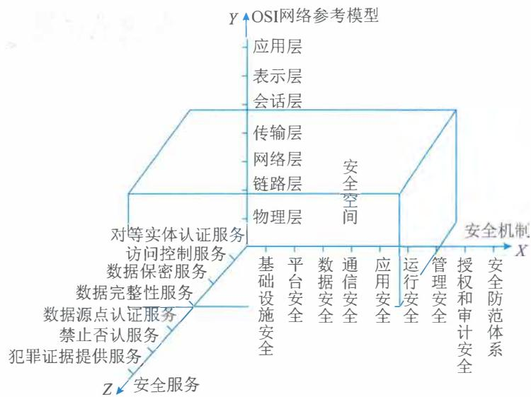
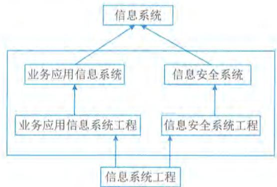
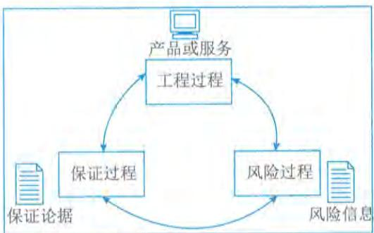
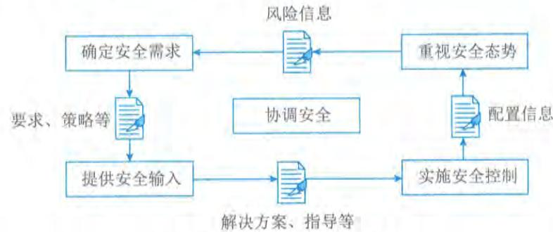
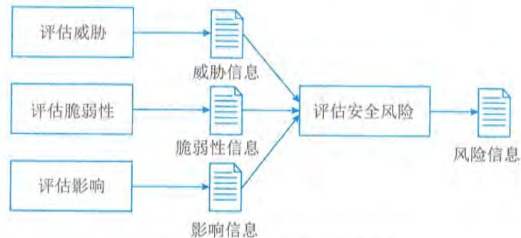
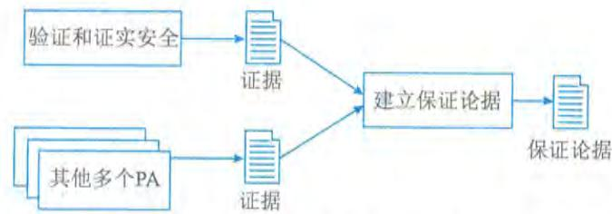
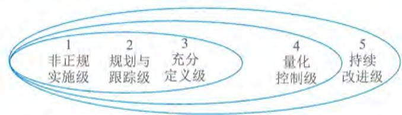

# 第8章 信息安全工程

现代社会已经进入数字时代，其突出的特点是信息的价值在很多方面超过信息处理设施，包括信息载体本身的价值，例如，一台计算机上存储和处理的信息的价值往往超过计算机本身的价值。另外，现代社会的各类组织，包括政府、企业，对信息以及信息处理设施的依赖程度也越来越大，一旦信息丢失或泄密、信息处理设施中断，很多组织的业务也就无法运营了。新时代对于信息的安全提出了更高的要求，信息安全的内涵也不断进行延伸和拓展。

# 8.1 信息安全管理

8.1 信息安全管理通常用“三分技术、七分管理”来形容管理对于各项活动的重要性。信息安全管理贯穿信息安全的全过程，也贯穿信息系统的全生命周期。信息安全管理涉及参与信息系统的各类角色在安全方面的权利、责任和义务等，覆盖安全技术使用、安全产品与系统部署、管理机制设立与监督等。

# 8.1.1 保障要求

网络与信息安全保障体系中的安全管理建设，通常需要满足以下5项原则：

（1）网络与信息安全管理要做到总体策划，确保安全的总体目标和所遵循的原则。

（2）建立相关组织机构，要明确责任部门，落实具体实施部门。

（3）做好信息资产分类与控制，达到员工安全、物理环境安全和业务连续性管理等。

（4）使用技术方法解决通信与操作的安全、访问控制、系统开发与维护，以支撑安全目标、安全策略和安全内容的实施。

（5）实施检查安全管理的措施与审计，主要用于检查安全措施的效果，评估安全措施执行的情况和实施效果。

网络安全与管理至少要成立一个安全运行组织，制定一套安全管理制度并建立一个应急响应机制。组织需要确保以下3个方面满足保障要求：

（1）安全运行组织应包括主管领导、信息中心和业务应用等相关部门，领导是核心，信息中心是实体，业务部门是使用者。

（2）安全管理制度要明确安全职责，制定安全管理细则，做到多人负责、任期有限、职责分离的原则。

（3）应急响应机制是主要由管理人员和技术人员共同参与的内部机制，要提出应急响应的计划和程序，提供对安全事件的技术支持和指导，提供安全漏洞或隐患信息的通告、分析和安全事件处理等相关培训。

# 8.1.2 管理内容

8.1.2 管理内容信息安全管理涉及信息系统治理、管理、运行、退役等各个方面,其管理内容往往与组织治理与管理水平,以及信息系统在组织中的作用与价值等方面相关,在ISO/IEC 27000系列标准中,给出了组织、人员、物理和技术方面的控制参考,这些控制参考是组织需要策划、实施和监测信息安全管理的主要内容。

# 1.组织控制

在组织控制方面,主要包括信息安全策略、信息安全角色与职责、职责分离、管理职责、威胁情报、身份管理、访问控制等。

信息安全策略:管理者应根据业务目标发展阶段等,制定清晰的信息安全策略和特定主题的策略,从而为信息安全提供管理指导和支持,并与业务要求和相关的法律法规保持一致。安全策略需要由管理层批准、发布并传达给相关人员和利益相关方确认,并周期性地或在发生重大变化时进行评审。

信息安全角色与职责:需要组织根据业务发展、监督监管等各类需求,依据信息安全策略等,定义并分配信息安全管理相关的角色和职责,从而明确信息安全相关参与者(如管理者、操作者等)的权利、责任和义务内容,也需要覆盖组织的内外部安全专家等。

职责分离:当出现相互冲突的职责和相互冲突的责任领域时,应实施职责分离,以减少疏忽或故意误用系统的风险等。

管理职责:在信息安全管理过程中,管理层需要以身作则,并通过管理职能定义,要求所有人员、组织遵守既定的信息安全策略、特定主题的策略和程序等,驱动组织信息安全能力建设,并满足信息安全需求。

与政府机构的联系:组织的信息安全涉及政府发布的相关法律法规和标准等,甚至关系到国家安全等,因此组织需要与政府相关机构保持联系。

与特殊利益群体的联系:考虑到组织信息安全技术的开发利用、监督与管理、评估与评价等需求,组织需要与信息安全相关治理、管理和技术团体建立并保持联系,包括相关授权机构、安全论坛、专业协会等。

威胁情报:信息安全的各类威胁往往层出不穷,手段和方法千变万化。因此,组织需要持续收集和分析与信息安全威胁有关的信息,从而有效掌握威胁情报。

项目信息安全:组织需要将信息安全各项策略、方案、技术和行动等整合到项目管理之中,保证项目管理不会成为信息安全管理的"黑洞",并保障项目活动中的信息安全。

信息和相关资产清单:组织需要明确信息安全的"保护对象",编制和维护包括所有者在内的信息和其他相关资产清单。

信息和相关资产的可接受使用:为确保组织信息安全管理的有效性,应识别、确立、记录并实施处理信息和相关资产的可接受的使用规则和程序。

资产归还:组织应确保员工和其他相关方在劳动关系、合同或协议等发生变更、终止时,归还其所拥有的组织信息和相关资产。

- 信息分类：组织需要根据其CIA和利益相关方的要求，对信息进行分类。- 信息标签：组织需要结合其信息分类方案，确立、发布和实施一组适当的信息标签程序及配套管理制度措施等。- 信息传输：信息传输是信息安全风险密度较高的环节，因此，组织需要为内外部的各类信息传输制定传输规则、程序或协议等。- 访问控制：访问控制是落实信息安全的重要手段，组织应根据业务和信息安全需求，制定和实施控制信息和相关资产物理和逻辑访问的规则等。- 身份管理：组织需要管理系统和信息安全等各类身份的全生命周期。- 认证信息：组织通过管理程序对认证信息的分配和管理进行控制，包括建议员工和相关人员等正确处理认证信息。- 访问权限：组织需要依据特定主题的政策和访问控制规则，分配、审查、修改和删除对信息和相关资产的访问权限等。- 供应商信息安全：组织需要定义、发布和实施管理程序，管理使用供应商产品或服务过程中相关的信息安全风险。- 解决供应商协议中的信息安全问题：组织需要根据供应商关系类型，确定每类（个）相关供应商的信息安全要求，并与其达成一致。- 管理ICT供应链中的信息安全：组织需要定义、发布和实施管理程序，管理与ICT产品和服务等供应链相关的信息安全风险。- 供应商服务的监控、审查和变更管理：组织需要定期监测、评估、评审和管理供应商信息安全实践及服务交付等的变化。- 云服务的信息安全：组织需要建立获取、使用、管理和退出云服务的管理程序，从而满足其信息安全相关要求。- 信息安全事件管理规划和准备：组织需要定义、建立和沟通信息安全事件管理程序，从而规划和准备信息安全事件的管理。- 信息安全事件的评估和决策：组织需要评估信息安全事件，并决定是否将其归类为信息安全事件。- 信息安全事件响应：组织需要确保信息安全事件按照确定的程序进行响应。- 信息安全事件总结：组织需要及时从信息安全事件中获得知识，并确保其能够用于加强和改进信息安全控制。- 收集证据：组织需要建立、发布和实施相关程序，确保与信息安全事件有关的证据的识别、收集、获取和保存。- 中断期间的信息安全：组织需要计划如何在系统和业务等各类活动中断期间，将信息安全保持在适当水平。- ICT业务连续性：组织需要根据业务连续性目标和ICT连续性需求，规划、实施、维护和测试ICT的准备情况。- 法律、法规、监管和合同要求：组织需要识别、记录与信息安全相关的法律、法规、监管和合同要求，以及组织满足这些要求的方法，并保持最新。

- 知识产权：组织需要建立、发布和实施管理程序，用来保护知识产权。- 记录保护：组织需要建立适当的措施，从而防止记录丢失、毁坏、篡改、未经授权的访问和未经授权发布等。- 个人身份信息的隐私和保护：组织需要根据有关法律法规和合同要求，识别并满足有关隐私保护和个人信息保护的相关要求。- 信息安全独立审查：组织需要建立独立审查机制并实施相关审查，以确保其管理信息安全的方法及其实施（包括人员、流程和技术等）能够周期性地或在发生重大变化时进行独立审查。- 遵守信息安全政策、规则和标准：组织需要定期评审其信息安全政策、特定主题政策、规则和标准的遵守情况及合规性等。- 记录操作程序：组织需要记录信息处理设施的操作过程，并将其提供给需要的人员。

# 2. 人员控制

在人员控制方面，主要包括筛选、雇佣、信息安全意识与教育、保密或保密协议、远程办公、安全纪律等。

- 筛选：组织在全职、兼职员工招聘或外部专家人才聘任等活动的前期阶段，需要组织对拟使用人员进行背景调查与验证，并考虑适用的法律、法规和道德规范等，且要与组织业务要求、需访问信息的分类和感知风险相适宜。

- 劳动合同与协议：组织需要在与人员相关的合同、劳动协议、聘用协议等文件中，说明人员和组织对信息安全的责任。

- 信息安全意识、教育和培训：组织和相关利益方的人员需要接受适当的信息安全意识教育和培训，并定期更新与人员工作职能相关的组织信息安全政策、主题策略和程序等。

- 惩戒程序：组织需要建立、发布和实施信息安全相关的惩戒程序，从而对违反信息安全政策的人员和其他相关利益方采取适当的惩戒行动。

- 劳动终止或变更后的责任：组织应确保相关人员在终止或变更劳动关系后，相关人员和其他相关方仍然需要保持的信息安全责任和义务得到明确、传达和执行。

- 保密或保密协议：组织需要与人员和其他相关方确定、记录、定期审查和签署能够反映组织信息安全需求的保密或保密协议。

- 远程工作：当组织相关人员远程工作时，组织需要采取适当的安全措施，保护在非组织可管控环境中所要访问、处理或存储的组织信息。

- 信息安全事件报告：组织需要为相关人员提供一种机制、手段或程序，以便使其及时通过适当渠道报告觉察到的、怀疑的或可疑的信息安全事件。

# 3. 物理控制

在物理控制方面，主要包括物理安全边界、物理入口、物理安全监控、防范物理和环境威胁、设备选址和保护、存储介质、布线安全和设备维护等。

- 物理安全边界：组织需要明确定义并使用安全边界，来保护包含信息和相关资产的区域，如研发大楼、数据中心等。

- 物理入口：组织需要明确并执行适当的入口控制，并对接入点或访问点进行保护。

- 办公室、房间和设施的安全：组织需要设计、实施和强化办公室、房间和设施的物理安全。

- 物理安全监控：组织需要通过适当的监控手段，持续监控涉及信息安全的各类场所是否存在未经授权的物理访问。

- 防范物理和环境威胁：组织需要设计和实施针对物理和环境威胁的保护措施，包括自然灾害和其他有意或无意的对基础设施的物理威胁等。

- 安全区域保护：组织需要设计并实施在安全区域工作的安全措施和手段等。

- 桌面和屏幕清理：组织需要制定、发布和实施桌面与电子屏幕清理规则，确保涉及信息安全的纸质文件和可移动存储介质等得到及时、可靠的清理。

- 设备选址和保护：组织需要确保涉及信息安全的设备得到安全放置和保护。

- 场外资产的安全：组织需要明确并执行适当的措施，保护非可控环境中的资产。

- 存储介质：组织需要根据信息分类方案和处理要求，在其信息获取、使用、运输和处置的整个生命周期内对存储介质进行有效管理。

- 配套设施：组织需要采取适当的技术方案或措施手段，保护信息处理设施免受电力故障和其他因辅助设施故障造成的干扰。

- 布线安全：组织需要保护承载电力、数据或辅助信息服务的电缆免受截获、干扰或损坏。

- 设备维护：组织需要建设适当的设备维护能力体系，从而有效维护设备，确保信息满足CIA需求。

- 设备安全处置或再利用：组织需要建立检测和验证包含存储介质设备的手段与措施，确保其处置或在利用之前，敏感数据、软件许可和许可软件等已被删除或安全覆盖。

# 4. 技术控制

在技术控制方面，主要包括用户终端设备、特殊访问权限、信息访问限制、访问源代码、身份验证、容量管理、恶意代码与软件防范、技术漏洞管理、配置管理、信息删除、数据屏蔽、数据泄露预防、网络安全和信息备份等。

- 用户终端设备：组织需要保护在终端设备上存储、处理或访问的信息。

- 特殊访问权限：组织需要尽量限制和管理特殊访问权限的分配和使用。

- 信息访问限制：组织需要根据既定的信息安全政策和特定主题访问控制政策，限制对信息和相关资产的访问。

- 访问源代码：组织需要对源代码、开发工具和软件库的读写访问等采取适当的管理措施。

- 身份验证：组织需要根据信息访问限制和特定主题的访问控制策略实施安全认证技术和程序。

- 容量管理：组织需要根据当前和预期的容量需求监测和调整资源的使用。

- 恶意代码与软件防范：组织需要对软件进行保护，采取适当的策略、手段和方法，对恶意代码与软件进行防范。

- 技术漏洞管理：组织需要及时获得使用中的信息系统的技术漏洞信息（含可疑信息），评估组织暴露于此类漏洞的情况和程度等，并采取适当措施。- 配置管理：组织需要建立、记录、实施、监控和审查软硬件、服务和网络的配置，包括安全配置等。- 信息删除：组织需要及时删除不再需要的信息系统、设备或任何其他存储介质中的信息。- 数据屏蔽：组织需要根据访问控制主题政策、相关特定主题政策、业务要求等，实施数据屏蔽，并考虑适用的立法。- 数据泄露预防：组织确立的数据泄漏预防措施需要适用于处理、存储或传输敏感信息的系统、网络和任何其他设备。- 信息备份：组织需要按照确定的特定主题备份政策，对信息、软件和系统的备份副本进行维护和定期测试。- 信息处理设施的冗余：组织需要根据可用性需求部署信息处理设施的冗余度。- 日志：组织需要记录信息活动、异常、故障和其他相关事件的日志，并存储、保护和分析。- 监控活动：组织需要监控网络、系统和应用程序的异常情况，并采取适当措施评估潜在的信息安全事件。- 时钟同步：组织需要确保使用的信息处理系统的时钟与指定的时钟源同步。- 特殊程序使用：组织需要限制并严格控制拥有特殊权限系统和应用程序控制的程序的使用。- 软件安装：组织需要采取适当的程序和措施，安全管理操作系统上的软件安装。- 网络安全：组织需要保护、管理和控制网络与网络设备，从而保护系统和应用程序中的信息。- 网络服务的安全：组织需要确立、发布、实施和监控网络服务的安全机制、服务级别和服务要求。- 网络隔离：组织需要根据安全需求，对信息服务组、用户组和信息系统组等在网络中进行隔离。- 网页过滤：组织需要对外部网站的访问进行管理，从而减少面对恶意内容的可能。- 密码使用：组织需要定义和实施有效使用密码的规则，包括密码密钥管理等。- 开发生命周期安全：组织需要建立、发布和实施应用软件和系统的安全开发规则。- 应用程序安全要求：组织需要在开发或获取应用程序时，识别、批准信息安全需要与要求。- 系统安全架构和工程原理：组织需要建立、记录、维护系统工程的安全原则，并确保其应用于各种信息系统开发活动。- 安全编码：组织需要确保软件安全编码原则有效应用于软件开发活动中。- 安全测试：组织需要在开发全生命周期中定义和实施安全测试管理程序。

外包开发：组织需要指导、监控和评审与外包系统开发相关的活动。

开发、测试和生产环境分离：组织需要将开发、测试和生产环境分开，并对各类环境采取适当的保护措施。

变更管理：组织需要确保信息处理设施和信息系统的变更遵守变更管理程序。

测试信息：组织需要适当选择、保护和管理测试信息。

在审核测试期间的信息系统保护：组织的测试人员和相关管理人员需要计划并商定审核测试和其他涉及操作系统评估的保证活动。

# 8.1.3 管理体系

信息系统安全管理是对一个组织机构中信息系统的生存周期全过程实施符合安全等级责任要求的管理，主要包括：

落实安全管理机构及安全管理人员，明确角色与职责，制定安全规划；

开发安全策略；

实施风险管理；

制订业务持续性计划和灾难恢复计划；

选择与实施安全措施；

保证配置、变更的正确与安全；

进行安全审计；

保证维护支持；

进行监控、检查，处理安全事件；

安全意识与安全教育；

人员安全管理等。

在组织机构中应建立安全管理机构，不同安全等级的安全管理机构逐步建立自己的信息系统安全组织机构管理体系，参考步骤包括： $①$  配备安全管理人员。管理层中应有一人分管信息系统安全工作，并为信息系统的安全管理配备专职或兼职的安全管理人员。 $②$  建立安全职能部门。建立管理信息系统安全工作的职能部门，或者明确指定一个职能部门监管信息安全工作，并将此项工作作为该部门的关键职责之一。 $③$  成立安全领导小组。在管理层成立信息系统安全管理委员会或信息系统安全领导小组，对覆盖全国或跨地区的组织机构，应在总部和下级单位建立各级信息系统安全领导小组，在基层至少要有一位专职的安全管理人员负责信息系统安全工作。 $④$  主要负责人出任领导。由组织机构的主要负责人出任信息系统安全领导小组负责人。 $⑤$  建立信息安全保密管理部门。建立信息系统安全保密监督管理的职能部门，或对原有保密部门明确信息安全保密管理责任，加强对信息系统安全管理重要过程和管理人员的保密监督管理。

GB/T20269《信息安全技术信息系统安全管理要求》提出了对信息系统安全管理体系的要求，其信息系统安全管理要素如表8- 1所示。

<table><tr><td>类</td><td>族</td><td>管理要素</td></tr><tr><td rowspan="3">政策和制度</td><td>信息安全管理策略</td><td>安全管理目标与范围、总体安全管理策略、安全管理策略的制定、安全管理策略的发布</td></tr><tr><td>安全管理规章制度</td><td>安全管理规章制度内容、安全管理规章制度的制定</td></tr><tr><td>策略与制度文档管理</td><td>策略与制度文档的评审和修订、策略与制度文档的保管</td></tr><tr><td rowspan="4">机构和人员管理</td><td>安全管理机构</td><td>建立安全管理机构、信息安全领导小组、信息安全职能部门</td></tr><tr><td>安全机制集中管理机构</td><td>设置集中管理机构、集中管理机构职能</td></tr><tr><td>人员管理</td><td>安全管理人员配备、关键岗位人员管理、人员录用管理、人员离岗、人员考核与审查、第三方人员管理</td></tr><tr><td>教育和培训</td><td>信息安全教育、信息安全专家</td></tr><tr><td rowspan="5">风险管理</td><td>风险管理要求和策略</td><td>风险管理要求、风险管理策略</td></tr><tr><td>风险分析和评估</td><td>资产识别和分析、威胁识别和分析、脆弱性识别和分析、风险分析和评估要求</td></tr><tr><td>风险控制</td><td>选择和实施风险控制措施</td></tr><tr><td>基于风险的决策</td><td>安全确认、信息系统运行的决策</td></tr><tr><td>风险评估的管理</td><td>评估机构的选择、评估机构保密要求、评估信息的管理、技术测试过程管理</td></tr><tr><td rowspan="2">环境和资源管理</td><td>环境安全管理</td><td>环境安全管理要求、机房安全管理要求、办公环境安全管理要求</td></tr><tr><td>资源管理</td><td>资产清单管理、资产的分类与标识要求、介质管理、设备管理要求</td></tr><tr><td rowspan="3">运行和维护管理</td><td>用户管理</td><td>用户分类管理、系统用户要求、普通用户要求、机构外部用户要求、临时用户要求</td></tr><tr><td>运行操作管理</td><td>服务器操作管理、终端计算机操作管理、便携机操作管理、网络及安全设备操作管理、业务应用操作管理、变更控制和重用管理、信息交换管理</td></tr><tr><td>运行维护管理</td><td>日常运行安全管理、运行状况监控、软硬件维护管理、外部服务方访问管理</td></tr><tr><td rowspan="3">运行和维护管理</td><td>外包服务管理</td><td>外包服务合同、外包服务商、外包服务的运行管理</td></tr><tr><td>有关安全机制保障</td><td>身份鉴别机制管理要求、访问控制机制管理要求、系统安全管理要求、网络安全管理要求、应用系统安全管理要求、病毒防护管理要求、密码管理要求</td></tr><tr><td>安全集中管理</td><td>安全机制集中管控、安全信息集中管理、安全机制整合要求、安全机制整合的处理方式</td></tr><tr><td rowspan="3">业务持续性管理</td><td>备份与恢复</td><td>数据备份和恢复、设备和系统的备份和冗余</td></tr><tr><td>安全事件处理</td><td>安全事件划分、安全事件报告和响应</td></tr><tr><td>应急处理</td><td>应急处理和灾难恢复、应急计划、应急计划的实施保障</td></tr></table>

（续表）

<table><tr><td>类</td><td>族</td><td>管理要素</td></tr><tr><td rowspan="4">监督和检查管理</td><td>符合法律要求</td><td>知晓适用的法律、知识产权管理、保护证据记录</td></tr><tr><td>依从性管理</td><td>检查和改进、安全策略依从性检查、技术依从性检查</td></tr><tr><td>审计及监管控制</td><td>审计控制、监管控制</td></tr><tr><td>责任认定</td><td>审计结果的责任认定、审计及监管者责任的认定</td></tr><tr><td rowspan="3">生存周期管理</td><td>规划和立项管理</td><td>系统规划要求、系统需求的提出、系统开发的立项</td></tr><tr><td>建设过程管理</td><td>建设项目准备、工程项目外包要求、自行开发环境控制、安全产品使用要求、建设项目测试验收</td></tr><tr><td>系统启用和终止管理</td><td>新系统启用管理、终止运行管理</td></tr></table>

# 8.1.4 等级保护

国家市场监督管理总局、国家标准化管理委员会宣布网络安全等级保护制度2.0相关的国家标准正式发布,并于2019年12月1日开始实施。"等保1.0"体系以信息系统为对象,确立了五级安全保护等级,并从信息系统安全等级保护的定级方法、基本要求、实施过程、测评工作等方面入手,形成了一套相对完整的、有明确标准的、涵盖了制度与技术要求的等级保护规范体系。然而,随着网络安全形势日益严峻,"等保1.0"体系难以持续应对新时代的网络安全要求,于是"等保2.0"体系应运而生。

"等保2.0"将"信息系统安全"的概念扩展到了"网络安全",其中,所谓"网络"是指由计算机或者其他信息终端及相关设备组成的按照一定的规则和程序对信息进行收集、存储、传输、交换、处理的系统。

# 1.安全保护等级划分

《信息安全等级保护管理办法》将信息系统的安全保护等级分为以下5级。

第一级,信息系统受到破坏后,会对公民、法人和其他组织的合法权益造成损害,但不损害国家安全、社会秩序和公共利益。第一级信息系统运营、使用单位应当依据国家有关管理规范和技术标准进行保护。

第二级,信息系统受到破坏后,会对公民、法人和其他组织的合法权益产生严重损害,或者对社会秩序和公共利益造成损害,但不损害国家安全。第二级信息系统运营、使用单位应当依据国家有关管理规范和技术标准进行保护。国家信息安全监管部门对该级信息系统信息安全等级保护工作进行指导。

第三级,信息系统受到破坏后,会对社会秩序和公共利益造成严重损害,或者对国家安全造成损害。第三级信息系统运营、使用单位应当依据国家有关管理规范和技术标准进行保护。国家信息安全监管部门对该级信息系统信息安全等级保护工作进行监督、检查。

第四级,信息系统受到破坏后,会对社会秩序和公共利益造成特别严重损害,或者对国家安全造成严重损害。第四级信息系统运营、使用单位应当依据国家有关管理规范、技术标准和业务专门需求进行保护。国家信息安全监管部门对该级信息系统信息安全等级保护工作进行强制监督、检查。

第五级,信息系统受到破坏后,会对国家安全造成特别严重损害。第五级信息系统运营、使用单位应当依据国家管理规范、技术标准和业务特殊安全需求进行保护。国家指定专门部门对该级信息系统信息安全等级保护工作进行专门监督、检查。

# 2. 安全保护能力等级划分

《信息安全技术网络安全等级保护基本要求》(GB/T22239)规定了不同级别的等级保护对象应具备的基本安全保护能力。

第一级安全保护能力:应能够防护免受来自个人的、拥有很少资源的威胁源发起的恶意攻击、一般的自然灾难,以及其他相当危害程度的威胁所造成的关键资源损害,在自身遭到损害后,能够恢复部分功能。

第二级安全保护能力:应能够防护免受来自外部小型组织的、拥有少量资源的威胁源发起的恶意攻击、一般的自然灾难,以及其他相当危害程度的威胁所造成的重要资源损害,能够发现重要的安全漏洞和处置安全事件,在自身遭到损害后,能够在一段时间内恢复部分功能。

第三级安全保护能力:应能够在统一安全策略下防护免受来自外部有组织的团体、拥有较为丰富资源的威胁源发起的恶意攻击、较为严重的自然灾难,以及其他相当程度的威胁所造成的主要资源损害,能够及时发现、监测攻击行为和处置安全事件,在自身遭到损害后,能够较快恢复绝大部分功能。

第四级安全保护能力:应能够在统一安全策略下防护免受来自国家级别的、敌对组织的、拥有丰富资源的威胁源发起的恶意攻击、严重的自然灾难,以及其他相当危害程度的威胁所造成的资源损害,能够及时发现、监测攻击行为和处置安全事件,在自身遭到损害后,能够迅速恢复所有功能。

第五级安全保护能力:略。

# 3. "等保2.0"的核心内容

网络安全等级保护制度进入2.0时代,其核心内容包括:  $①$  将风险评估、安全监测、通报预警、案事件调查、数据防护、灾难备份、应急处置、自主可控、供应链安全、效果评价、综治考核等重点措施全部纳入等级保护制度并实施;  $②$  将网络基础设施、信息系统、网站、数据资源、云计算、物联网、移动互联网、工控系统、公众服务平台、智能设备等全部纳入等级保护和安全监管;  $③$  将互联网企业的网络、系统、大数据等纳入等级保护管理,保护互联网企业健康发展。

信息安全等级保护制度是国家在国民经济和社会信息化的发展过程中,提高信息安全保障能力和水平,维护国家安全、社会稳定和公共利益,保障和促进信息化建设健康发展的一项基本制度。实行信息安全等级保护制度,能够充分调动国家、法人和其他组织及公民的积极性,发挥各方面的作用,达到有效保护的目的,增强安全保护的整体性、针对性和实效性,使信息系统安全建设更加突出重点、统一规范、科学合理,对促进我国信息安全的发展将起到重要推动作用。

# 4. "等保2.0"的技术变更

网络安全等级保护2.0技术变更的内容主要包括:

- 物理和环境安全实质性变更:降低物理位置选择要求,机房可设置在建筑楼顶或地下

室,但需要加强相应防水防潮措施。降低了物理访问控制要求,不再要求人员值守出入口,不再要求机房内部分区,不再对机房人员出入进行具体要求。降低了电力供应的要求,不再要求必须配备后备发电机。降低了电磁防护的要求,不再要求必须接地。降低了防盗和防破坏要求,可部署防盗系统或视频监控系统。

- 网络和通信安全实质性变更:强化了对设备和通信链路的硬件冗余要求。强化了网络访问策略的控制要求,包括默认拒绝策略、控制规则最小化策略和源目的检查要求。降低了带宽控制的要求,不再要求必须进行QoS控制。降低了安全访问路径、网络会话控制、地址欺骗防范、拨号访问权限限制等比较"古老"的控制要求。

- 设备和计算安全实质性变更:强化了访问控制的要求,细化了主体和客体的访问控制粒度要求。强化了安全审计的统一时钟源要求。强化了入侵防范的控制要求,包括终端的准入要求、漏洞测试与修复。降低了对审计分析的要求,不再要求必须生成审计报表。降低了对恶意代码防范的统一管理要求和强制性的代码库异构要求。提出了采用可信计算技术防范恶意代码的控制要求。

- 应用和数据安全实质性变更:强化了对软件容错的要求,保障故障发生时的可用性。强化了对账号和口令的安全要求,包括更改初始口令、账号口令重命名、对多余/过期/共享账号的控制。强化了安全审计的统一时钟源要求。降低了对资源控制的要求,包括会话连接数限制、资源监测、资源分配控制。降低了对审计分析的要求,不再要求必须生成审计报表。

# 5. "等保2.0"的管理变更

网络安全等级保护2.0管理变更的内容主要包括:

- 安全策略和管理制度实质性变更:降低了对安全管理制度的管理要求,包括版本控制、收发文管理等,其中不再要求必须由信息安全领导小组组织制度的审定。

- 安全管理机构和人员实质性变更:对安全管理和机构人员的要求整体有所降低,一方面对过细的操作层面要求进行删减,例如记录和文档的操作要求、制度的制定要求等;另一方面对岗位配备、人员技能考核等要求也有实质性的删减。强化了对外部人员的管理要求,包括外部人员的访问权限、保密协议的管理要求。

- 安全建设管理实质性变更:对安全建设管理的要求整体有所降低,一方面对过细的操作层面要求进行删减,例如不再要求由专门部门或人员实施某些管理活动,不再对某些管理制度的制定做细化要求;另一方面对安全规划管理、测试验收管理也有实质性的删减。强化了对服务供应商管理、系统上线安全测试、工程监理控制的管理要求。强化了对自行软件开发的要求,包括安全性测试、恶意代码检测、软件开发活动的管理要求。

- 安全运维管理实质性变更:对安全运维管理的要求整体有所降低,一方面对过细的操作层面要求进行删减,例如不再要求由专门部门或人员实施某些管理活动,不再对某些管理制度的制定做细化要求;另一方面对介质管理、设备管理也有实质性的删减。将原有属于监控管理和安全管理中心的内容移到了"网络和通信安全"部分。将原有属于网络安全设备的部分内容移到了"漏洞和风险管理"部分。降低了对网络和系统管理的

要求,包括安全事件处置管理、实施某些网络管理活动、网络接入策略控制。特别增加了漏洞和风险管理、配置管理、外包运维管理的管理要求。强化了对账号管理、运维管理、设备报废或重用的管理要求。

# 6. 网络安全等级保护技术体系设计通用实践

由于形态不同的等级保护对象面临的威胁有所不同,安全保护需求也有所差异,为了便于描述对不同网络安全保护级别和不同形态的等级保护对象的共性化和个性化保护,基于通用和特定应用场景,说明等级保护安全技术体系设计的内容。其中:

- 通用等级保护安全技术设计内容针对等级保护对象实行网络安全等级保护时的共性化保护需求提出。等级保护对象无论以何种形式出现,都应根据安全保护等级,实现相应级别的安全技术要求。- 特定应用场景针对云计算、移动互联、物联网、工业控制系统的个性化保护需求提出,针对特定应用场景,实现相应网络安全保护级别的安全技术要求。

安全技术体系架构由从外到内的纵深防御体系构成。纵深防御体系根据等级保护的体系框架设计。其中:

- “物理环境安全防护”保护服务器、网络设备以及其他设备设施免遭地震、火灾、水灾、盗窃等事故导致的破坏;

- “通信网络安全防护”保护暴露于外部的通信线路和通信设备;

- “网络边界安全防护”对等级保护对象实施边界安全防护,内部不同级别定级对象尽量分别部署在相应保护等级的内部安全区域,低级别定级对象部署在高等级安全区域时应遵循“就高保护”原则;

- “计算环境安全防护”即内部安全区域将实施“主机设备安全防护”和“应用和数据安全防护”;

- “安全管理中心”对整个等级保护对象实施统一的安全技术管理。

随着国际互联网信息高速公路的畅通和国际化的信息交流,业务大范围扩展,信息安全的风险也急剧恶化。由业务应用信息系统来解决安全问题的方式已经不能胜任。由操作系统、数据库系统、网络管理系统来解决安全问题,也不能满足实际的需要,于是才不得不建立独立的信息安全系统。信息系统安全是一门新兴的工程实践课题。我们有必要加大对信息系统安全工程的研究,规范信息系统安全工程建设的过程,提高建设信息系统安全工程的成熟能力。否则,信息系统安全工程建立不合理、不科学、不到位、不标准,势必影响业务应用信息系统的正常运营,阻碍信息化的推进。

# 8.2 信息安全系统

信息安全保障系统一般简称为信息安全系统,它是“信息系统”的一个部分,用于保证“业务应用信息系统”正常运营。现在人们已经明确,要建立一个“信息系统”,就必须要建立一个或多个业务应用信息系统和一个信息安全系统。信息安全系统是客观的、独立于业务应用

信息系统而存在的信息系统。

我们用一个“宏观”三维空间图来反映信息安全系统的体系架构及其组成，如图8- 1所示。

  
图8-1 信息安全系统的体系架构及其组成

$X$  轴是“安全机制”。安全机制可以理解为提供某些安全服务，利用各种安全技术和技巧，所形成的一个较为完善的结构体系。如“平台安全”机制，实际上就是指安全操作系统、安全数据库、应用开发运营的安全平台以及网络安全管理监控系统等。

$Y$  轴是“OSI网络参考模型”。信息安全系统的许多技术、技巧都是在网络的各个层面上实施的，离开网络，信息系统的安全也就失去了意义。

$Z$  轴是“安全服务”。安全服务就是从网络中的各个层次提供给信息应用系统所需要的安全服务支持。如对等实体认证服务、数据完整性服务、数据保密服务等。

由  $X$  、  $Y$  、  $Z$  三个轴形成的信息安全系统三维空间就是信息系统的“安全空间”。随着网络逐层扩展，这个空间不仅范围逐步加大，安全的内涵也更加丰富，具有认证、权限、完整、加密和不可否认五大要素，也叫作“安全空间”的五大属性。

# 8.2.1 安全机制

安全机制包含基础设施安全、平台安全、数据安全、通信安全、应用安全、运行安全、管理安全、授权和审计安全、安全防范体系等。

（1）基础设施安全。基础设施安全主要包括机房安全、场地安全、设施安全、动力系统安全、灾难预防与恢复等。

（2）平台安全。平台安全主要包括操作系统漏洞检测与修复、网络基础设施漏洞检测与修复、通用基础应用程序漏洞检测与修复、网络安全产品部署等。

（3）数据安全。数据安全主要包括介质与载体安全保护、数据访问控制、数据完整性、数

据可用性、数据监控和审计、数据存储与备份安全等。

(4) 通信安全。通信安全主要包括通信线路和网络基础设施安全性测试与优化、安装网络加密设施、设置通信加密软件、设置身份鉴别机制、设置并测试安全通道、测试各项网络协议运行漏洞等。

(5) 应用安全。应用安全主要包括业务软件的程序安全性测试(Bug分析)、业务交往的防抵赖测试、业务资源的访问控制验证测试、业务实体的身份鉴别检测、业务现场的备份与恢复机制检查,以及业务数据的唯一性与一致性及防冲突检测、业务数据的保密性测试、业务系统的可靠性测试、业务系统的可用性测试等。

(6) 运行安全。运行安全主要包括应急处置机制和配套服务、网络系统安全性监测、网络安全产品运行监测、定期检查和评估、系统升级和补丁提供、跟踪最新安全漏洞及通报、灾难恢复机制与预防、系统改造管理、网络安全专业技术咨询服务等。

(7) 管理安全。管理安全主要包括人员管理、培训管理、应用系统管理、软件管理、设备管理、文档管理、数据管理、操作管理、运行管理、机房管理等。

(8) 授权和审计安全。授权安全是指以向用户和应用程序提供权限管理和授权服务为目标,主要负责向业务应用系统提供授权服务管理,提供用户身份到应用授权的映射功能,实现与实际应用处理模式相对应的、与具体应用系统开发和管理无关的访问控制机制。

(9) 安全防范体系。组织安全防范体系的建立,就是使得组织具有较强的应急事件处理能力,其核心是实现组织信息安全资源的综合管理,即EISRM(Enterprise Information Security Resource Management)。组织安全防范体系的建立可以更好地发挥以下6项能力,包括预警(Warn)、保护(Protect)、检测(Detect)、反应(Response)、恢复(Recover)和反击(Counter-attack),即综合的WPDRRC信息安全保障体系。

组织可以结合WPDRRC能力模型,从人员、技术、政策(包括法律、法规、制度、管理)三大要素来构成宏观的信息网络安全保障体系结构的框架,主要包括组织机构的建立、人员的配备、管理制度的制定、安全流程的明确等,并切实做好物理安全管理、中心机房管理、主机安全管理、数据库安全管理、网络安全管理、网络终端管理、软件安全管理、授权和访问控制管理、审计和追踪管理,确保日常和异常情况下的信息安全工作持续、有序地开展。

# 8.2.2 安全服务

安全服务包括对等实体认证服务、访问控制服务、数据保密服务、数据完整性服务、数据源点认证服务、禁止否认服务和犯罪证据提供服务等。

(1) 对等实体认证服务。用于两个开放系统同等层中的实体建立链接或数据传输时,对对方实体的合法性、真实性进行确认,以防假冒。

(2) 访问控制服务。访问控制是指通信双方应该能够对通信的过程、通信的内容具有不同强度的控制能力,其目的在于保护信息免于被未经授权的实体访问,这是有效和高效通信的保障。其中,访问的含义较为宽泛,对程序的读、写、修改、执行等都属于访问的范畴。访问控制可分为自主访问控制、强制访问控制、基于角色的访问控制。实现机制可以是基于访问控制

属性的访问控制表、基于安全标签或用户和资源分档的多级访问控制等。

（3）数据保密服务。包括多种保密服务，为了防止网络中各系统之间的数据被截获或被非法存取而泄密，提供密码加密保护。数据保密服务可提供链接方式和无链接方式两种数据保密，同时也可对用户可选字段的数据进行保护。

（4）数据完整性服务。用以防止非法实体对交换数据的修改、插入、删除以及在数据交换过程中的数据丢失。数据完整性服务可分为：

- 带恢复功能的链接方式数据完整性；

- 不带恢复功能的链接方式数据完整性；

- 选择字段链接方式数据完整性；

- 选择字段无链接方式数据完整性；

- 无链接方式数据完整性。

（5）数据源点认证服务。用于确保数据发自真正的源点，防止假冒。

（6）禁止否认服务。用以防止发送方在发送数据后否认自己发送过此数据，接收方在收到数据后否认自己收到过此数据或伪造接收数据，由两种服务组成，即不得否认发送和不得否认接收。

（7）犯罪证据提供服务。指为违反国内外法律法规的行为或活动提供各类数字证据、信息线索等。

# 8.3 工程体系架构

信息安全系统工程（Information Security System Engineering，ISSE）是一门系统工程学，它的主要内容是确定系统和过程的安全风险，并且使安全风险降到最低或使其得到有效控制。

# 8.3.1 安全工程基础

信息安全系统工程就是要建造一个信息安全系统，它是整个信息系统工程的一部分，而且最好是与业务应用信息系统工程同步进行，而它主要是围绕“信息安全”的内容，如信息安全风险评估、信息安全策略制定、信息安全需求确定、信息安全系统总体设计、信息安全系统详细设计、信息安全系统设备选型、信息安全系统工程招投标、密钥密码机制确定、资源界定和授权、信息安全系统施工中需要注意的防泄密问题和施工中后期的信息安全系统测试、运营、维护的安全管理等问题。这些问题与用户的业务应用信息系统建设主要关注的内容完全不同。业务应用信息系统工程主要关注的是客户的需求、业务流程、价值链等的组织业务优化和改造的问题。信息安全系统建设所关注的问题恰恰是业务应用信息系统正常运营所不能缺少的。

为了进一步论述信息安全系统工程，我们需要区分几个术语，并了解它们之间的关系。如图8- 2所示为信息系统、业务应用信息系统、信息安全系统、信息系统工程、业务应用信息系统工程、信息安全系统工程以及信息系统安全和信息系统安全工程之间的关系。

  
图8-2 几个术语之间的关系

信息安全系统服务于业务应用信息系统,并与之密不可分,但两者又不能混为一谈。信息安全系统不能脱离业务应用信息系统而存在,比如,建立国税信息系统、公安信息系统、社保信息系统等,一定包含业务应用信息系统和信息安全系统两个部分。但二者的功能、操作流程、管理方式、人员要求、技术领域等都完全不同。随着信息化的深入,两者的界限也越来越明晰。

业务应用信息系统是支撑业务运营的计算机应用信息系统,如银行柜台业务信息系统、国税征收信息系统等。信息系统工程,即建造信息系统的工程,包括两个独立且不可分割的部分,即信息安全系统工程和业务应用信息系统工程。业务应用信息系统工程就是为了达到建设好业务应用信息系统所组织实施的工程,一般称为信息系统集成项目工程,它是信息系统工程的一部分。

信息安全系统工程是指为了达到建设好信息安全系统的特殊需要而组织实施的工程,它是信息系统工程的一部分。信息安全系统工程作为信息系统工程的一个子集,其安全体系和策略必须遵从系统工程的一般性原则和规律。信息安全系统工程的原理适用于系统和应用的开发、集成、运行、管理、维护和演变,以及产品的开发、交付和演变。这样,信息安全系统工程就能够在一个系统、一个产品或一个服务中得到体现。

我们讲述的是信息安全系统工程,而不是信息系统安全工程。从字面上理解,信息系统安全工程可能会被误解为安全地建设一个信息系统,而忽略了信息系统中的信息安全问题。因为信息系统可以安全地建设成一个没有信息安全子系统的信息系统,目前部分组织仍然存在这样的新建的信息系统——没有考虑信息安全的问题,或没有充分地考虑信息安全的问题,从而留下相当大的隐患。而信息安全系统工程就明白无误地确定了这个工程就是要建设一个信息安全系统。

信息安全系统的建设是在OSI网络参考模型的各个层面进行的,因此信息安全系统工程活动离不开其他相关工程,主要包括硬件工程、软件工程、通信及网络工程、数据存储与灾备工程、系统工程、测试工程、密码工程和组织信息化工程等。

信息安全系统建设是遵从组织所制定的安全策略进行的。而安全策略由组织和组织的客户及服务对象、集成商、安全产品开发者、密码研制单位、独立评估者和其他相关组织共同协商建立。因此,信息安全系统工程活动必须要与其他外部实体进行协调。也正是因为信息安全系统工程存在着这些与其他工程的关系接口,而这些接口又遍布各种组织,且具有相互影响,所以信息安全系统工程与其他工程相比就更加复杂。

信息安全系统工程应该吸纳安全管理的成熟规范部分,这些安全管理包括物理安全、计算机安全、网络安全、通信安全、输入/输出产品安全、操作系统安全、数据库系统安全、数据安全、信息审计安全、人员安全、管理安全和辐射安全等。

# 8.3.2 ISSE-CMM基础

信息安全系统工程能力成熟度模型(ISSE Capability Maturity Model,ISSE- CMM)是一种衡量信息安全系统工程实施能力的方法,是使用面向工程过程的一种方法。ISSE- CMM是建立在统计过程控制理论基础上的。统计过程控制理论认为,所有成功组织的共同特点是它们都具有一整套严格定义、管理完善、可测可控的有效业务过程。ISSE- CMM模型抽取了这样一组"好的"工程实施,并定义了过程的"能力",主要用于指导信息安全系统工程的完善和改进,使信息安全系统工程成为一个清晰定义的、成熟的、可管理的、可控制的、有效的和可度量的学科。

ISSE- CMM模型是信息安全系统工程实施的度量标准,它覆盖了:

$\bullet$  全生命期,包括工程开发、运行、维护和终止;

$\bullet$  管理、组织和工程活动等的组织;

$\bullet$  与其他规范(如系统、软件、硬件、人的因素、测试工程、系统管理、运行和维护等)并行的相互作用;

$\bullet$  与其他组织(包括获取、系统管理、认证、认可和评估组织)的相互作用。

ISSE- CMM主要适用于工程组织(Engineering Organizations)、获取组织(Acquiring Organizations)和评估组织(Evaluation Organizations)。信息安全的工程组织包含系统集成商、应用开发商、产品提供商和服务提供商等,这些组织可以使用ISSE- CMM对工程能力进行自我评估。信息安全的获取组织包含采购系统、产品,以及从外部/内部资源和最终用户处获取服务的组织,这些组织可以使用ISSE- CMM来判别一个供应者组织的信息安全系统工程能力,识别该组织供应的产品和系统的可信任性,以及完成一个工程的可信任性。信息安全的评估组织包含认证组织、系统授权组织、系统和产品评估组织等,这些组织可以使用ISSE- CMM作为工作基础,以建立被评组织整体能力的信任度。

# 8.3.3 ISSE过程

一个组织的过程能力可帮助组织预见项目达到目标的能力。位于低能力级组织的项目在达到预定的成本、进度、功能和质量目标上会有很大的变化,而位于高能力组织的项目则完全相反。ISSE过程的目的是使信息安全系统成为系统工程和系统获取过程整体的必要部分,从而有力地保证用户目标的实现,提供有效的安全措施,以满足客户和服务对象的需求,将信息系统安全的安全选项集成到系统工程中,获得最优的信息安全系统解决方案。为了使信息安全系统具有可实现性并有效力,必须把信息安全系统集成在信息系统生命周期的工程实施过程中,并与业务需求、环境需求、项目计划、成本效益、国家和地方政策、标准、指令保持一致性。这种集成过程将产生一个信息安全系统工程(ISSE)过程,这一过程能够确认、评估、消除(或控制)已知的或假定的安全威胁可能引起的系统威胁(风险),最终得到一个可以接受的安全风险等级。在系统设计、开发和运行时,应该运用科学的和工程的原理来确认和减少系统对攻击

的脆弱度或敏感性。ISSE 并不是一个独立的过程, 它依赖并支持系统工程和获取 (保证) 过程, 而且是后者不可分割的一部分。

  
图 8-3 信息安全系统工程实施过程的组成部分

ISSE 过程的目标是提供一个框架, 每个工程项目都可以对这个框架进行裁剪以符合自己特定的需求。ISSE 表现为直接与系统工程功能和事件相对应的一系列信息安全系统工程行为。ISSE 将信息安全系统工程实施过程分解为工程过程 (Engineering Process)、风险过程 (Risk Process) 和保证过程 (Assurance Process) 3 个基本的部分, 如图 8- 3 所示。它们相互独立, 但又有着有机的联系。粗略地说, 在风险过程中, 人们识别出所开发的产品或系统风险, 并对这些风险进行优先

级排序。针对风险所面临的安全问题, 信息安全系统工程过程与其他工程一起来确定安全策略和实施解决方案。最后, 由安全保证过程建立起解决方案的可信性, 并向用户转达这种安全可信性。

# 1. 工程过程

信息安全系统工程过程与其他工程活动一样, 是一个包括概念、设计、实现、测试、部署、运行、维护、退出的完整过程, 如图 8- 4 所示。在这个过程中, 信息安全系统工程的实施必须紧密地与其他的系统工程组进行合作。ISSE- CMM 强调信息安全系统工程是一个大项目队伍中的组成部分, 需要与其他科目工程的活动相互协调。这将有助于保证安全成为一个大项目过程中一个部分, 而不是一个分离的独立部分。

  
图 8-4 信息安全系统工程过程

使用上面所描述的风险管理过程的信息和关于系统需求、相关法律、政策的其他信息, 信息安全系统工程就可以与用户一起来识别安全需求。一旦需求被识别, 信息安全系统工程就可以识别和跟踪特定的安全需求。

对于信息安全问题, 创建信息安全解决方案一般包括识别可能选择的方案, 然后评估决定哪一种更可能被接受。将这个活动与工程过程的其他活动相结合, 不但要解决方案的安全问题, 还需要考虑成本、性能、技术风险、使用的简易性等因素。

# 2.风险过程

信息安全系统工程的一个主要目标是降低信息系统运行的风险。风险就是有害事件发生的可能性及其危害后果。出现不确定因素的可能性取决于各个信息系统的具体情况。这就意味着这种可能性仅可能在某些限制条件下才可预测。此外，对一种具体风险的影响进行评估，必须要考虑各种不确定因素。因此大多数因素是不能被综合起来准确预报的。在很多情况下，不确定因素的影响是很大的，这就使得对安全的规划和判断变得非常困难。

一个有害事件由威胁、脆弱性和影响3个部分组成。脆弱性包括可被威胁利用的资产性质。如果不存在脆弱性和威胁，则不存在有害事件，也就不存在风险。风险管理是调查和量化风险的过程，并建立组织对风险的承受级别，它是安全管理的一个重要部分。风险管理过程如图8- 5所示。

  
图8-5 信息安全系统风险管理过程

安全措施的实施可以减轻风险，但无论如何，不可能消除所有威胁或根除某个具体威胁。这主要是因为消除风险所需的代价，以及与风险相关的各种不确定性。因此，必须接受残留的风险。在存在很大不确定性的情况下，由于风险度量不精确的本质特征，在怎样的程度上接受它才是恰当的，往往会成为很大的问题。ISSE- CMM过程域包括实施组织对威胁、脆弱性、影响和相关风险进行分析的活动保证。

# 3.保证过程

保证过程是指安全需求得到满足的可信程度，它是信息安全系统工程非常重要的部分。保证过程如图8- 6所示。保证的形式多种多样。ISSE- CMM的可信程度来自于信息安全系统工程实施过程可重复性的结果质量。这种可信性的基础是工程组织的成熟性，成熟的组织比不成熟的组织更可能产生出重复的结果。

  
图8-6 信息安全系统保证过程

安全保证并不能增加任何额外的对安全相关风险的抵抗能力, 但它能为减少预期安全风险提供信心。安全保证也可看作安全措施按照需求运行的信心, 这种信心来自于措施及其部署的正确性和有效性。正确性保证了安全措施按设计实现了需求, 有效性则保证了提供的安全措施可充分地满足用户的安全需求。安全机制的强度也会发挥作用, 但其作用却受到保护级别和安全保证程度的制约。

# 8.3.4 ISSE-CMM体系结构

ISSE- CMM的体系结构可以在整个信息安全系统工程范围内决定信息安全工程组织的成熟性。这个体系结构的目标是落实安全策略, 从管理和制度化方面突出信息安全工程的基本特征。为此, 该模型采用两维设计, 其中的一维是“域”(Domain), 另一维是“能力”(Capability)。

# 1. 域维 / 安全工程过程域

域维汇集了定义信息安全系统工程的所有实施活动, 这些实施活动被称为过程域。能力维代表组织能力, 它由过程管理能力和制度化能力构成, 这些实施活动被称作公共特性, 可在广泛的域中应用。执行一个公共特性是一个组织能力的标志。通过设置这两个相互依赖的维, ISSE- CMM在各个能力级别上覆盖了整个信息安全活动范围。

ISSE包括6个基本实施, 这些基本实施被组织成11个信息安全工程过程域, 这些过程域覆盖了信息安全系统工程的所有主要领域。安全工程过程域的设计是为了满足信息安全工程组织广泛的需求。划分信息安全工程过程域的方法有许多种, 典型的做法之一就是将实际的信息安全工程服务模型化, 即原型法, 以此创建与信息安全工程服务相一致的过程域。其他的方法如识别概念域, 它们将识别的这些域形成相应的基本信息安全工程构件模块。每一个过程域包括一组表示组织成功执行过程域的目标, 每一个过程域也包括一组集成的基本实施, 基本实施定义了获得过程域目标的必要步骤。

一个过程域通常需要满足:

- 汇集一个域中的相关活动, 以便于使用;

- 有关有价值的信息安全工程服务;

- 可在整个组织生命周期中应用;

- 能在多个组织和多个产品范围内实现;

- 能作为一个独立过程进行改进;

- 能够由类似过程兴趣组进行改进;

- 包括所有需要满足过程域目标的基本实施 (Base Practices, BP)。

基本实施的特性包括:

- 应用于整个组织生命周期;

- 和其他BP互相不覆盖;

- 代表安全业界“最好的实施”;

- 不是简单地反映当前技术;

- 可在业务环境下以多种方法使用;

- 不指定特定的方法或工具。

由基本实施组成的11个安全工程过程域包括:PA01实施安全控制、PA02评估影响、PA03评估安全风险、PA04评估威胁、PA05评估脆弱性、PA06建立保证论据、PA07协调安全、PA08监控安全态、PA09提供安全输入、PA10确定安全需求、PA11验证和证实安全。

ISSE- CMM还包括11个与项目和组织实施有关的过程域:PA12保证质量、PA13管理配置、PA14管理项目风险、PA15监测和控制技术工程项目、PA16规划技术工程项目、PA17定义组织的系统工程过程、PA18改进组织的系统工程过程、PA19管理产品线的演变、PA20管理系统工程支持环境、PA21提供不断更新的技能和知识、PA22与供应商的协调。

# 2. 能力维/公共特性

通用实施（Generic Practices, GP）由被称为公共特性的逻辑域组成。公共特性分为5个级别，依次表示增强的组织能力。与域维的基本实施不同的是，能力维的通用实施按其成熟性排序，因此高级别的通用实施位于能力维的高端。

公共特性设计的目的是描述在执行工作过程（即信息安全工程域）中组织特征方式的主要变化。每一个公共特性包括一个或多个通用实施。通用实施可应用到每一个过程域（ISSE- CMM应用范畴），但第一个公共特性“执行基本实施”例外。其余公共特性中的通用实施可帮助确定项目管理好坏的程度，并可将每一个过程域作为一个整体加以改进。公共特性的成熟度等级定义如表8- 2所示。

表8-2 公共特性的成熟度等级定义  

<table><tr><td>级 别</td><td>公共特性</td><td>通用实施</td></tr><tr><td>Level 1: 非正规实施级</td><td>执行基本实施</td><td>● 执行过程</td></tr><tr><td rowspan="4">Level 2: 规划和跟踪级</td><td>规划执行</td><td>● 为执行过程域分配足够的资源
● 为开发工作产品和/或提供过程域服务指定责任人
● 将过程域执行的方法形成标准化和/或程序化文档
● 提供支持执行过程域的有关工具
● 保证过程域执行人员获得适当的过程执行方面的培训
● 对过程域的实施进行规划</td></tr><tr><td>规范化执行</td><td>● 在执行过程域中，使用文档化的规划、标准和/或程序
● 在需要的地方将过程域的工作产品置于版本控制和配置管理之下</td></tr><tr><td>验证执行</td><td>● 验证过程与可用标准和/或程序的一致性
● 审计工作产品（验证工作产品遵从可适用标准和/或需求的情况）</td></tr><tr><td>跟踪执行</td><td>● 用测量跟踪过程域相对于规划的态势
● 当进程严重偏离规划时采取必要的修正措施</td></tr></table>

<table><tr><td>级 别</td><td>公共特性</td><td>通用实施</td></tr><tr><td rowspan="3">Level 3:充分定义级</td><td>定义标准化过程</td><td>● 对过程进行标准化定义
● 对组织的标准化过程族进行裁剪</td></tr><tr><td>执行已定义的过程</td><td>● 在过程域的实施中使用充分定义的过程
● 对过程域的适当工作产品进行缺陷评审
● 通过使用已定义过程的数据管理该过程</td></tr><tr><td>协调安全实施</td><td>● 协调工程科目内部的沟通
● 协调组织内不同组间的沟通
● 协调与外部组间的沟通</td></tr><tr><td rowspan="2">Level 4:量化控制级</td><td>建立可测度的质量目标</td><td>● 为组织的标准化过程族的工作产品建立可测度的质量目标</td></tr><tr><td>对执行情况实施客观管理</td><td>● 量化地确定已定义过程的过程能力
● 当过程未按过程能力执行时,适当地采取修正行动</td></tr><tr><td rowspan="2">Level 5:持续改进级</td><td>改进组织能力</td><td>● 为改进过程效能,根据组织的业务目标和当前过程能力建立量化目标
● 通过改变组织的标准化过程,从而提高过程效能</td></tr><tr><td>改进过程的效能</td><td>● 执行缺陷的因果分析
● 有选择地消除已定义过程中缺陷产生的原因
● 通过改变已定义过程来连续地改进实施</td></tr></table>

# 3.能力级别

将通用实施划分为公共特性,将公共特性划分为能力级别有多种方法。公共特性的排序得益于对现有其他安全实施的实现和制度化,特别是当实施活动有效建立时尤其如此。在一个组织能够明确地定义、裁剪和有效使用一个过程前,单独执行的项目应该获得一些过程执行方面的管理经验。例如,一个组织应首先尝试对一个项目规模评估过程后,再将其规定为这个组织的过程规范。有时,当把过程的实施和制度化放在一起考虑可以增强能力时,则无须要求严格地进行前后排序。

公共特性和能力级别无论在评估一个组织过程能力还是改进组织过程能力时都是重要的。当评估一个组织能力时,如果这个组织只执行了一个特定级别的一个特定过程的部分公共特性时,则这个组织对这个过程而言处于这个级别的最底层。例如,在2级能力上,如果缺乏跟踪执行公共特性的经验和能力,那么跟踪项目的执行将会很困难。如果高级别的公共特性在一个组织中实施,但其低级别的公共特性未能实施,则这个组织不能获得该级别的所有能力带来的好处。评估组织在评估一个组织个别过程能力时,应对这种情况加以考虑。

当一个组织希望改进某个特定过程能力时,能力级别的实施活动可为实施改进的组织提供一个"能力改进路线图"。基于这一理由,ISSE- CMM的实施按公共特性进行组织,并按级别进行排序。对每一个过程域能力级别的确定,均需执行一次评估过程。这意味着不同的过程域能够或可能存在于不同的能力级别上。组织可利用这个面向过程的信息,作为侧重于这些过程改进的手段。组织改进过程活动的顺序和优先级应在业务目标里加以考虑。业务目标是使用ISSE-

CMM模型的主要驱动力。但是，对典型的改进活动，也存在着基本活动次序和基本的原则。这个活动次序在ISSE- CMM结构中通过公共特性和能力级别加以定义。能力级别代表工程组织的成熟度级别的5级模型如图8- 7所示。

  
图8-7 能力级别代表工程组织的成熟度级别的5级模型

5级能力级别的重点及能力特点如表8- 3所示。

表8-3 能力级别的重点与能力特点  

<table><tr><td>级 别</td><td>重 点</td><td>能力特点</td></tr><tr><td>1级：非正规实施级</td><td>着重于一个组织或项目只是执行了包含基本实施的过程</td><td>必须首先做它，然后才能管理它</td></tr><tr><td>2级：规划与跟踪级</td><td>着重于项目层面的定义、规划和执行问题</td><td>在定义组织层面的过程之前，先要弄清楚与项目相关的事项</td></tr><tr><td>3级：充分定义级</td><td>着重于规范化地裁剪组织层面的过程定义</td><td>这个级别的能力特点可描述为，用项目中学到的最好的东西来定义组织层面的过程</td></tr><tr><td>4级：量化控制级</td><td>着重于测量。测量是与组织业务目标紧密联系在一起的。尽管在以前的级别上，也把数据收集和采用项目测量作为基本活动，但只有达到高级别时，数据才能在组织层面上被应用</td><td>只有知道它是什么，才能测量它。当被测量的对象正确时，基于测量的管理才有意义</td></tr><tr><td>5级：持续改进级</td><td>从前面各级的所有管理活动中获得发展的力量，并通过加强组织的文化来保持这种力量。这一方法强调文化的转变，这种转变又将使方法更有效</td><td>持续性改进的文化需要以完备的管理实施、已定义的过程和可测量的目标作为基础</td></tr></table>

# 8.4 本章练习

# 1.选择题

(1) 不属于CIA三要素。

A.可靠性 
B.保密性 
C.完整性 
D.可用性

参考答案：A

(2)在ISO/IEC27000系列标准中，给出了以下几方面的控制：

A.组织、战略、管理、实施 
B.组织、人员、物理、技术

C.人员、过程、技术、资源 
D.机房、数据、系统、设备

参考答案:B

(3)《信息安全等级保护管理办法》将信息系统的安全保护等级分为

A.3级 
B.4级 
C.5级 
D.6级

参考答案:C

(4) 不属于基础设施实体安全。

A.机房安全 
B.场地安全 
C.动力系统安全 
D.数据安全

参考答案:D

(5)信息安全系统工程实施过程的组成部分包括:

A.开发过程、测试过程、验收过程 
B.定义过程、实施过程、改进过程C.工程过程、风险过程、保证过程 
D.治理过程、管理过程、操作过程

参考答案:C

# 2.思考题

(1)对于组织来说,如何建设有效、敏捷的信息安全管理体系?

参考答案:略

(2)从组织成员或公民视角来看,信息安全意识如何培育?

参考答案:略

