# 第9章 项目管理概论

# 9.1 PMBOK的发展

项目管理知识体系（ProjectManagementBodyOfKnowledge，PMBOK）是由美国项目管理协会（ProjectManagementInstitute，PMI）开发的一套描述项目管理专业范围的知识体系，包含了对项目管理所需的知识、技能和工具的描述。

1981年，PMI组委会成立了专门的小组，开展相应的研发工作，旨在将项目管理人在项目管理过程中的优秀实践总结成标准。1983年，该小组发表了第一份报告，报告中将项目管理的基本内容划分为范围管理、成本管理、时间管理、质量管理、人力资源管理和沟通管理六个领域，形成了后期项目管理专业化的基础内容。1984年，PMI组委会批准了关于进一步开发项目管理标准的项目。1987年，该小组发表了题为“项目管理知识体系”的研究报告，并于1996年进行了修订，称之为“项目管理知识体系指南”，国际标准化组织（ISO）随后以该文件为框架，制定了第一个项目管理的标准，即ISO10006：1997《质量管理项目管理质量指南》。

从1996年PMBOK指南的第一个版本开始，PMI基本每4年更新一版PMBOK指南，截至2022年，已经出版的有2000年的第2版、2004年的第3版、2008年的第4版、2012年的第5版、2017年的第6版和2021年的第7版。

在PMBOK指南的发展过程中，1996年的第1版、2004年的第3版、2017年的第6版和2021年的第7版的变化较为突出，主要的变化情况如表9- 1所示。

表9-1PMBOK指南的主要变化情况  

<table><tr><td>版本</td><td>主要发展变化情况</td></tr><tr><td>第1版
(1996年)</td><td>● 定位为指南，名为“项目管理知识体系指南”
● 表明项目管理知识体系获得了广泛认可，适用于大多数项目，实践价值和有效性获得了广泛的一致认可
● 将项目管理定义为“将知识、技能、工具和技术应用于项目活动，以便达到或超过干系人的需要和对项目的期望”
● 采用基于过程的标准，各知识领域之间相互联系并相互作用
● 创建了稳健而灵活的结构，同时，国际标准化组织（ISO）和其他组织也正在制定基于过程的标准</td></tr><tr><td>第3版
(2004年)</td><td>● 首次在封面上印制了“ANSI标准”的标识
● 正式区分了《项目的项目管理标准》和《项目管理框架和知识体系》
● 包含了适用于多数项目的良好实践
● 将项目管理定义为“将知识、技能、工具和技术应用于项目活动，以便达到项目要求”</td></tr></table>

（续表）

<table><tr><td>版本</td><td>主要发展变化情况</td></tr><tr><td>第6版
(2017年)</td><td>●清晰地区分了ANSI标准和指南
●首次将敏捷内容纳入正文
●拓展了知识领域前言部分，包括核心概念、发展趋势和新兴实践、裁剪时需要考虑的因素，以及在敏捷或适应型环境中需要考虑的因素</td></tr><tr><td>第7版
(2021年)</td><td>●从系统视角论述项目管理，在《项目管理标准》中加入了“价值交付系统”。
“价值交付系统”从系统角度出发，重点关注与业务能力结合在一起的价值链，为组织的战略、价值和商业目标提供支持。“价值交付系统”强调过程的输出是为了实现项目的成果，而实现项目的成果的最终目标是将价值交付给组织及其干系人
●增加了8个绩效域。这些绩效域对于有效交付项目成果至关重要。绩效域所代表的项目管理系统，充分体现了组织彼此交互、相互关联且相互依赖的管理能力，这些能力只有协调一致，才能实现期望的项目成果
●《项目管理标准》中增加了12个项目管理原则
●体现了各种开发方法（预测型、适应型、混合型等）</td></tr></table>

# 9.2 项目基本要素

# 9.2.1 项目基础

项目是为创造独特的产品、服务或成果而进行的临时性工作。

# 1.独特的产品、服务或成果

开展项目是为了通过可交付成果达成目标。目标是指工作所指向的结果、要取得的战略地位、要达到的目的、要获得的成果、要生产的产品或者要提供的服务。可交付成果是指在某一过程、阶段或项目完成时，形成的独特并可验证的产品、成果或服务。可交付成果可能是有形的，也可能是无形的。实现项目目标可能会产生一个或多个可交付成果。

某些项目可交付成果和活动中可能存在相同的元素，但这并不会改变项目本质上的独特性。例如，即便采用相同或相似的语言或工具，由相同的团队来开发，但每个信息系统项目仍具备独特性（例如需求、设计、运行环境、项目干系人都是独特的）。

项目可以在组织的任何层级上开展。一个项目可能只涉及一个人，也可能涉及一组人，可能只涉及一个组织单元，也可能涉及多个组织的多个单元。

下面列举一些项目的例子，例如为市场开发新的复方药，扩展导游服务，合并两家组织，改进组织内的业务流程，为组织采购和安装新的计算机硬件系统，一个地区的石油勘探，修改组织内使用的计算机软件，研发新的工艺流程，建造一座大楼等。

# 2.临时性工作

项目的“临时性”是指项目有明确的起点和终点。“临时性”并不一定意味着项目的持续时间短。项目可宣告结束的情况主要包括：

- 达成项目目标；- 不会或不能达到目标；- 项目资金耗尽或不再获得资金支持；- 对项目的需求不复存在（例如，客户不再要求完成项目，战略或优先级的变更致使项目终止，组织管理层下达终止项目的指示）；- 无法获得所需的人力或物力资源；- 出于法律或其他原因终止项目等。

虽然项目是临时性工作，但其可交付成果可能会在项目终止后依然存在。例如，国家纪念碑建设项目就是要创造一个可以流传百世的建筑。

# 3. 项目驱动变更

项目驱动组织进行变更。从业务价值角度看，项目旨在推动组织从一个状态转到另一个状态，从而达成特定目标，获得更高的业务价值。组织通过项目进行状态转换的过程如图9- 1所示。在项目开始之前，组织处于“当前状态”，项目驱动变更是为了获得期望的结果，即“将来状态”。通过成功完成一个或一系列项目，组织可以实现将来状态并达成特定的目标。

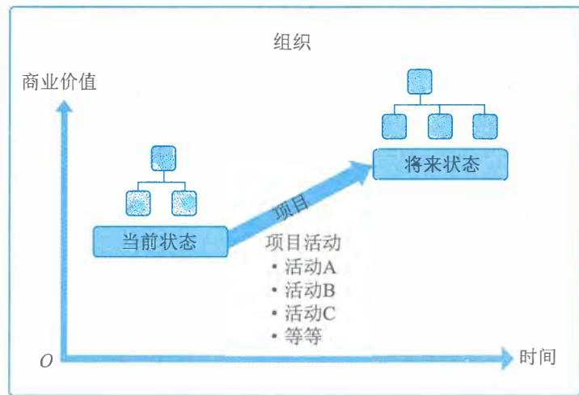  
图9-1 组织通过项目进行状态转换

# 4. 项目创造业务价值

业务价值是从组织运营中获得的可量化的净效益。在价值分析中，业务价值被视为回报，即以某种投入换取时间、资金、货物或无形的回报。项目的业务价值指特定项目的成果能够为干系人带来的效益。

项目带来的效益可以是有形的、无形的或两者兼而有之。有形效益的例子包括货币资产、股东权益、公共事业、固定资产、工具、市场份额等。无形效益的例子包括商誉、声誉、商标、公共利益、战略联盟、品牌认知度等。

# 5.项目启动背景

5. 项目启动背景促进项目创建的因素多种多样。组织领导者启动项目是为了应对影响该组织持续运营和业务战略的因素。这些因素说明了项目的启动背景，它们最终应与组织的战略目标以及各个项目的业务价值相关联。促进项目创建的因素大致可以分为4个基本类别，各类项目示例如表9-2所示。

表9-2 促成项目创建的因素  

<table><tr><td>特定因素</td><td>特定因素示例</td><td>符合法律
法规或社
会需求</td><td>满足干系
人要求或
需求</td><td>创造、改进或
修复产品、过
程或服务</td><td>执行、变
更业务或
技术战略</td></tr><tr><td>新技术</td><td>某电子公司批准一个新项目，在计算机内
存和电子技术发展的基础上，开发一种高
速、廉价的小型笔记本电脑</td><td></td><td></td><td>√</td><td>√</td></tr><tr><td>竞争力</td><td>为保持竞争力，产品价格要低于竞争对手
的产品价格，需要降低生产成本</td><td></td><td></td><td></td><td>√</td></tr><tr><td>材料问题</td><td>某市政桥梁的一些支撑构件出现裂缝，因
此需要实施一个项目来解决问题</td><td>√</td><td></td><td>√</td><td></td></tr><tr><td>政策变革</td><td>在某新政策影响下，当前某项目经费发生
变更</td><td></td><td></td><td></td><td>√</td></tr><tr><td>市场需求</td><td>为应对汽油紧缺的情况，某汽车公司批准
一个低油耗车型的研发项目</td><td></td><td>√</td><td>√</td><td>√</td></tr><tr><td>经济变革</td><td>经济滑坡导致某当前项目优先级发生变更</td><td></td><td></td><td></td><td>√</td></tr><tr><td>客户要求</td><td>为了给新工业园区供电，某电力公司批准
一个新变电站建设项目</td><td></td><td>√</td><td>√</td><td></td></tr><tr><td>干系人需求</td><td>某干系人要求组织进行新的输出</td><td></td><td>√</td><td></td><td></td></tr><tr><td>法律要求</td><td>某化工制造商批准一个项目，为妥善处理
一种新的有毒材料制定指南</td><td>√</td><td></td><td></td><td></td></tr><tr><td>业务过程改进</td><td>某组织实施一个运用精益六西格玛价值流
图的项目</td><td></td><td></td><td>√</td><td></td></tr><tr><td>战略机会或
业务需求</td><td>为增加收入，某培训公司批准一个项目，
开发一门新课程</td><td></td><td></td><td>√</td><td>√</td></tr><tr><td>社会需要</td><td>为应对传染病频发，某发展中国家的非政
府组织批准一个项目，为社区建设饮用水
系统和公共厕所，并开展卫生教育</td><td></td><td>√</td><td></td><td></td></tr><tr><td>环境需要</td><td>为减少污染，某上市公司批准一个项目，
开创电动汽车共享服务</td><td></td><td></td><td>√</td><td>√</td></tr></table>

# 9.2.2 项目管理

9.2.2 项目管理项目管理就是将知识、技能、工具与技术应用于项目活动，以满足项目的要求。通过合理

地应用并整合特定的项目管理过程,项目管理使组织能够有效并高效地开展项目。

有效的项目管理能够帮助个人、群体以及组织做到以下几点:  $①$  达成业务目标;  $②$  满足干系人的期望;  $③$  提高可预测性;  $④$  提高成功的概率;  $⑤$  在适当的时间交付正确的产品;  $⑥$  解决问题和争议;  $⑦$  及时应对风险;  $⑧$  优化组织资源的使用;  $⑨$  识别、挽救或终止失败项目;  $10$  管理制约因素(例如范围、质量、进度、成本、资源);  $11$  平衡制约因素对项目的影响(例如范围扩大可能会增加成本或延长进度);  $12$  以更好的方式管理变更等。

项目管理不善或缺失可能导致:  $①$  项目超过时限;  $②$  项目成本超支;  $③$  项目质量低劣;  $④$  返工;  $⑤$  项目范围失控;  $⑥$  组织声誉受损;  $⑦$  干系人不满意;  $⑧$  无法达成目标等。

项目是组织创造价值和效益的主要方式。当今外部环境动荡不定,变化越来越快,组织领导者需要应对预算紧缩、时间缩短、资源稀缺以及技术快速变化的情况。组织为了在全球经济中保持竞争力,需要充分利用项目管理来持续创造价值和效益。

有效和高效的项目管理是一个组织的战略能力。它使组织能够做到以下几点:  $①$  将项目成果与业务目标联系起来;  $②$  更有效地展开市场竞争;  $③$  实现可持续发展;  $④$  通过适当调整项目管理计划,应对外部环境改变给项目带来的影响等。

# 9.2.3 项目成功的标准

确定项目是否成功是项目管理中最常见的挑战之一。

时间、成本、范围和质量等项目管理测量指标历来被视为确定项目是否成功的最重要的因素。确定项目是否成功还应考虑项目目标的实现情况。

明确记录项目目标并选择可测量的目标是项目成功的关键。主要干系人和项目经理应思考3个问题:  $①$  怎样才算项目成功?  $②$  如何评估项目成功?  $③$  哪些因素会影响项目成功?主要干系人和项目经理应就这些问题达成共识并予以记录。

项目成功可能涉及与组织战略和业务成果交付相关的标准与目标,这些项目目标可能包括:

$\cdot$  完成项目效益管理计划;

$\cdot$  达到可行性研究与论证中记录的已商定的财务测量指标,这些财务测量指标可能包括净现值(NPV)、投资回报率(ROI)、内部报酬率(IRR)、回收期(PBP)和效益成本比率(BCR);

$\cdot$  达到可行性研究与论证的非财务目标;

$\cdot$  组织从"当前状态"成功转移到"将来状态";

$\cdot$  履行合同条款和条件;

$\cdot$  达到组织战略、目的和目标,使干系人满意;

$\cdot$  可接受的客户/最终用户的采纳度;

$\cdot$  将可交付成果整合到组织的运营环境中;

$\cdot$  满足商定的交付质量;

$\cdot$  遵循治理规则;

$\cdot$  满足商定的其他成功标准或准则(例如过程产出率)等。

为了取得项目成功,项目团队必须能够正确评估项目状况,平衡项目要求,并与干系人保

持积极沟通。如果项目能够与组织的战略方向持续保持一致,项目成功的概率就会显著提高。有可能一个项目从范围/进度/预算来看是成功的,但从业务角度来看并不成功,这是因为业务需求或市场环境在项目完成之前发生了变化。

# 9.2.4 项目、项目集、项目组合和运营管理之间的关系

# 1. 概述

项目管理过程、工具和技术的运用为组织达成目标奠定了坚实的基础。一个项目可以采用3种不同的模式进行管理:独立项目(不包括在项目集或项目组合中)、在项目集内、在项目组合内。如果在项目集或项目组合内管理某个项目,则项目经理需要与项目集或项目组合经理沟通与合作。

为达成组织的一系列目的和目标,可能需要实施多个项目。在这种情况下,项目可能被归入项目集中。项目集是一组相互关联且被协调管理的项目、子项目集和项目集活动,目的是获得分别管理所无法获得的利益。项目集不是大项目,大项目是指规模、影响等特别大的项目。

有些组织可能会采用项目组合,用于有效管理在任何特定的时间内同时进行的多个项目集和项目。项目组合是指为实现战略目标而组合在一起管理的项目、项目集、子项目组合和运营工作。项目组合、项目集、项目和运营在特定情况下是相互关联的,如图9- 2所示。

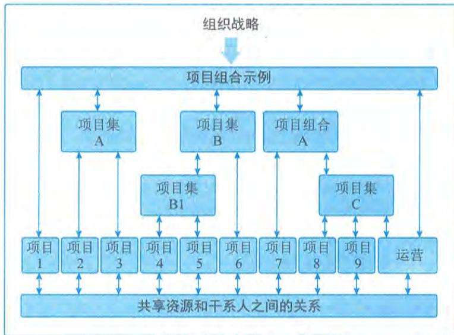  
图9-2 项目组合、项目集、项目和运营的关系

项目集管理和项目组合管理的生命周期、活动、目标、重点和效益都与项目管理不同。但是,项目组合、项目集、项目和运营通常都涉及相同的干系人,还可能需要使用同样的资源,而这可能会导致组织内出现冲突。这种情况促使组织增强内部协调,通过项目组合、项目集和项目管理达成组织内部的有效平衡。

图9- 2所示的项目组合结构表明了项目集、项目、共享资源和干系人之间的关系。项目组

合能够促进这项工作的有效治理和管理，从而有助于实现组织战略和相关优先级。在开展组织和项目组合规划时，要基于风险、资金和其他考虑因素对项目组合组件进行优先级排列。项目组合有利于组织了解战略目标在项目组合中的实施情况，还能适当促进项目组合、项目集和项目治理的实施与协调。这种协调治理方式可以合理分配资源，为实现预期绩效和效益分配人力、财力和实物资源。

从组织的角度看，项目和项目集管理的重点在于以“正确”的方式开展项目集和项目，即“正确地做事”；项目组合管理则注重于开展“正确”的项目集和项目，即“做正确的事”。表9- 3列出了项目、项目集、项目组合在定义、范围、变更、规划、管理、监督和成功等方面的比较结果。

表9-3 项目、项目集、项目组合管理的比较结果  

<table><tr><td>比较内容</td><td>项目</td><td>项目集</td><td>项目组合</td></tr><tr><td>定义</td><td>项目是为创造独特的产品、服务或成果而进行的临时性工作</td><td>项目集是一组相互关联且被协调管理的项目、子项目集和项目集活动，以便获得分别管理所无法获得的效益</td><td>项目组合是为实现战略目标而组合在一起管理的项目、项目集、子项目组合和运营工作的集合</td></tr><tr><td>范围</td><td>项目具有明确的目标。范围在整个项目生命周期中是新进明细的</td><td>项目集的范围包括其项目集组件的范围。项目集通过确保各项目集组件的输出和成果协调互补，为组织带来效益</td><td>项目组合的组织范围随着组织战略目标的变化而变化</td></tr><tr><td>变更</td><td>项目经理对变更和实施过程做出预期，实现对变更的管理和控制</td><td>项目集的管理方法是，随着项目集各组件成果和/或输出的交付，在必要时接受和适应变更，优化效益实现</td><td>项目组合经理持续监督更广泛的内外部环境的变更</td></tr><tr><td>规划</td><td>在整个项目生命周期中，项目经理渐进明细高层级信息，将其转化为详细的计划</td><td>项目集的管理利用高层级计划，跟踪项目集组件的依赖关系和进展。项目集计划也用于在组件层级指导规划</td><td>项目组合经理建立并维护与项目组合整体有关的必要过程和沟通</td></tr><tr><td>管理</td><td>项目经理为实现项目目标而管理项目团队</td><td>项目集由项目集经理管理，其通过协调项目集组件的活动，确保项目集效益按预期实现</td><td>项目组合经理可管理或协调项目组合管理人员或对项目组合整体负有报告职责的项目集和项目人员</td></tr><tr><td>监督</td><td>项目经理监控项目开展中生产产品、提供服务或成果的工作</td><td>项目集经理监督项目集组件的进展，确保整体目标、进度计划、预算和项目集效益的实现</td><td>项目组合经理监督战略变更以及总体资源分配、绩效成果和项目组合风险</td></tr><tr><td>成功</td><td>项目的成功通过产品和项目的质量、时间表、预算的依从性以及客户满意度水平进行衡量</td><td>项目集的成功通过项目集向组织交付预期效益的能力以及项目集交付所述效益的效率和效果进行衡量</td><td>项目组合的成功通过项目组合的总体投资效果和实现的效益进行衡量</td></tr></table>

# 2.项目集管理

项目集管理指在项目集中应用知识、技能与原则来实现项目集的目标，获得分别管理项目

集组成部分所无法实现的利益和控制。项目集组成部分指项目集中的项目和其他项目集。项目管理注重项目内部的依赖关系,以确定管理项目的最佳方法。项目集管理注重项目集组成部分之间的依赖关系,以确定管理这些项目的最佳方法。项目集的具体管理措施包括:

- 调整对项目集和所辖项目的目标有影响的组织或战略方向;

- 将项目集范围分配到项目集的组成部分;

- 管理项目集组成部分之间的依赖关系,从而以最佳方式实施项目集;

- 管理可能影响项目集内多个项目的项目集风险;

- 解决影响项目集内多个项目的制约因素和冲突;

- 解决作为组成部分的项目与项目集之间的问题;

- 在同一个治理框架内管理变更请求;

- 将预算分配到项目集内的多个项目中;

- 确保项目集及其包含的项目能够实现效益。

建立一个新的卫星通信系统就是一个项目集管理的实例,其所辖项目包括卫星与地面站的设计和建造、卫星发射以及系统整合。

# 3. 项目组合管理

项目组合是指为实现战略目标而组合在一起管理的项目、项目集、子项目组合和运营工作。项目组合管理是指为了实现战略目标而对一个或多个项目组合进行的集中管理。项目组合中的项目集或项目不一定存在彼此依赖或直接相关的关联关系。

项目组合管理的目的是:

- 指导组织的投资决策;

- 选择项目集与项目的最佳组合方式,以达成战略目标;

- 提供决策透明度;

- 确定团队资源分配的优先级;

- 提高实现预期投资回报的可能性;

- 集中管理所有组成部分的综合风险;

- 确定项目组合是否符合组织战略。

要实现项目组合价值的最大化,需要精心检查项目组合的各个组成部分。确定各组成部分的优先级,使最有利于组织战略目标的部分拥有所需的财力、人力和实物资源。

# 4. 运营管理

运营管理是另外一个领域,不属于项目管理范围。

运营管理关注产品的持续生产、服务的持续提供。运营管理使用最优资源满足客户要求,以保证组织或业务持续高效地运行。运营管理重点管理把输入(如材料、零件、能源和人力)转变为输出(如产品、服务)的过程。

# 5. 运营与项目管理

运营的改变可以作为某个项目的关注焦点,尤其是当项目交付的新产品或新服务将导致运

营有实质性改变时。持续运营不属于项目的范畴，但是项目与运营会在产品生命周期的不同时间点存在交叉，例如：

$\bullet$  在新产品开发、产品升级或提高产量时： $\bullet$  在改进运营或产品开发过程时： $\bullet$  在产品生命周期结束阶段： $\bullet$  在每个收尾阶段。

在每个交叉点，可交付成果及知识都会在项目与运营之间转移，可能是将项目资源及知识转移到运营部门，也可能是将运营资源转移至项目中。

# 6.组织级项目管理和战略

项目组合、项目集和项目都需要符合组织战略，由组织战略驱动，并以如下不同的方式服务于战略目标的实现：

$\bullet$  项目组合管理通过选择适当的项目集或项目，对工作进行优先级排序，并提供所需资源，与组织战略保持一致； $\bullet$  项目集管理通过对其组成部分进行协调，对它们之间的依赖关系进行控制，从而实现既定收益； $\bullet$  项目管理使组织的目标得以实现。

组织往往用战略规划引导项目投资，明确项目对实现组织战略和目标的作用。通过组织级项目管理，对项目组合、项目集和项目进行系统化管理，可以确保项目符合组织战略业务目标。组织级项目管理是指为实现战略目标，通过组织驱动因素整合项目组合、项目集和项目管理的框架。

组织级项目管理旨在确保组织开展正确的项目并合适地分配关键资源。组织级项目管理有助于确保组织的各个层级都了解组织的战略愿景、实现愿景的措施、组织目标以及可交付成果。组织级项目管理中，项目组合、项目集、项目和运营相互作用的组织环境如图9- 3所示。

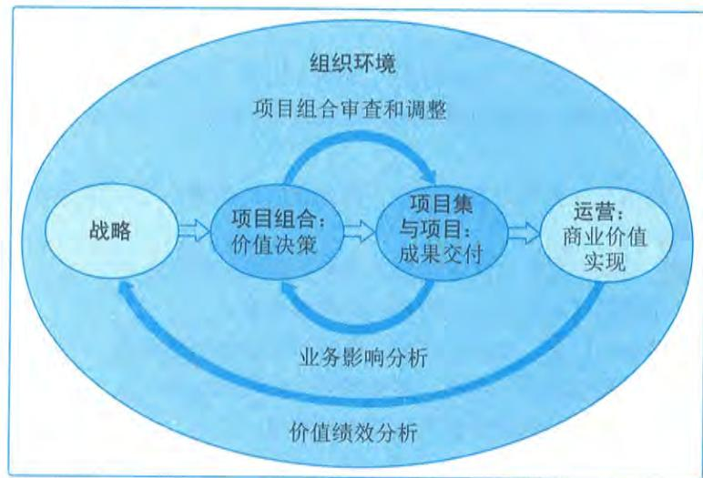  
图9-3 组织级项目管理

# 9.2.5 项目运行环境

项目在内部和外部环境中存在和运作，这些环境对价值交付有不同程度的影响。这些影响可能会对项目特征、干系人或项目团队产生有利、不利或中性的影响，也可能会影响规划和其他项目活动。这些影响的两大主要来源为事业环境因素和组织过程资产。

事业环境因素是指项目团队不能控制的，将对项目产生影响、限制或指令作用的各种条件。这些条件可能来自于组织的内部和/或外部。事业环境因素是很多项目管理过程，尤其是大多数规划过程的输入。这些因素可能会提高或限制项目管理的灵活性，并可能对项目结果产生积极或消极的影响。组织过程资产是执行组织所特有的并使用的计划、过程、政策、程序和知识库，会影响对具体项目的管理。

# 1.组织内部的事业环境因素

组织内部的事业环境因素主要包括：

组织内部的事业环境因素主要包括：- 组织文化、结构和治理：包括愿景、使命、价值观、信念、文化规范、领导力风格、等级制度和职权关系、组织风格、道德和行为规范。- 设施和资源的物理分布：包括工作地点、虚拟项目团队和共享系统。- 基础设施：包括现有设施、设备、组织和电信通道、IT硬件、可用性和功能。- 信息技术软件：包括进度计划软件、配置管理系统、信息系统的网络接口、协作工具和工作授权系统。- 资源可用性：包括签订合同和采购制约因素，获得批准的供应商和分包商，以及合作协议。与人员和材料相关的可用性包括签订合同和采购制约因素，获得批准的供应商和分包商，以及时间线。- 员工能力：包括通用和特定的专业知识、技能、能力、技术和知识等。

# 2.组织外部的事业环境因素

组织外部的事业环境因素主要包括：

2. 组织外部的事业环境因素组织外部的事业环境因素主要包括：- 市场条件：包括竞争对手、市场份额、品牌认知度、技术趋势和商标。- 社会和文化影响因素：包括政策导向、地域风俗和传统、公共假日和事件、行为规范、道德和观念。- 监管环境：包括与安全性、数据保护、商业行为、雇佣、许可和采购相关的全国性和地区性法律和法规。- 商业数据库：包括标准化的成本估算数据和行业风险研究信息。- 学术研究：包括行业研究、出版物和标杆对照结果。- 行业标准：包括与产品、生产、环境、质量和工艺相关的标准。- 财务考虑因素：包括汇率、利率、通货膨胀、税收和关税。- 物理环境因素：包括工作条件和天气相关因素等。

# 3.组织过程资产

3. 组织过程资产组织过程资产包括来自任何项目执行组织的，可用于执行或治理项目的任何工件、实践或

知识,还包括来自组织以往项目的经验教训和历史信息。组织过程资产可能还包括完成的进度计划、风险数据和挣值数据。组织过程资产是许多项目管理过程的输入。由于组织过程资产存在于组织内部,在整个项目期间,项目团队成员可对组织过程资产进行必要的更新和增补。

组织过程资产可分成过程、政策和程序与组织知识库两大类。第一类资产的更新通常不是项目工作的一部分,而是由项目管理办公室(PMO)或项目以外的其他职能部门完成。更新工作仅须遵循与过程、政策和程序更新相关的组织政策。有些组织鼓励团队裁剪项目的模板、生命周期和核对单。在这种情况下,项目管理团队应根据项目需求裁剪这些资产。第二类资产是在整个项目期间结合项目信息进行更新的。例如,在整个项目期间会持续更新与财务绩效、经验教训、绩效指标和问题以及缺陷相关的信息。

在过程、政策和程序方面需要重点关注启动和规划、执行和监控以及收尾等阶段。

(1)启动和规划阶段需要关注的内容包括:

- 指南和标准,用于裁剪组织标准流程和程序以满足项目的特定要求;

- 特定的组织标准,例如政策(如人力资源政策、健康与安全政策、安保与保密政策、质量政策、采购政策和环境政策);

- 产品和项目生命周期,以及方法和程序(如项目管理方法、评估指标、过程审计、改进目标、核对单、组织内使用的标准化的过程定义);

- 模板(如项目管理计划、项目文件、项目登记册、报告格式、合同模板、风险分类、风险描述模板、概率与影响的定义、概率和影响矩阵,以及干系人登记册模板);

- 预先批准的供应商清单和各种合同协议类型(如总价合同、成本补偿合同和工料合同)。

(2)执行和监控阶段需要关注的内容包括:

- 变更控制程序,包括修改组织标准、政策、计划和程序(或任何项目文件)所须遵循的步骤,以及如何批准和确认变更;

- 跟踪矩阵;

- 财务控制程序(如定期报告、必需的费用与支付审查、会计编码及标准合同条款等);

- 问题与缺陷管理程序(如定义问题和缺陷控制、识别与解决问题和缺陷,以及跟踪行动方案);

- 资源的可用性控制和分配管理;

- 组织对沟通的要求(如可用的沟通技术、许可的沟通媒介、记录保存政策、视频会议、协同工具和安全要求);

- 确定工作优先顺序、批准工作与签发工作授权的程序;

- 模板(如风险登记册、问题日志和变更日志);

- 标准化的指南、工作指示、建议书评价准则和绩效测量准则;

- 产品、服务或成果的核实和确认程序。

(3)收尾阶段需要关注的内容包括:收尾指南或要求(如项目终期审计、项目评价、可交付成果验收、合同收尾、资源分配,以及向生产和/或运营部门转移知识)。

在组织知识库方面,需要重点关注以下7个方面:

(1) 配置管理知识库, 包括软件和硬件组件版本以及所有执行组织的标准、政策、程序和任何项目文件的基准;

(2) 财务数据库, 包括人工时、实际成本、预算和成本超支等方面的信息;

(3) 历史信息, 如项目记录与文件、完整的项目收尾信息与文件、关于以往项目的信息等;

(4) 经验教训知识库, 如选择决策的结果及以往项目绩效的信息, 以及从风险管理活动中获取的信息;

(5) 问题与缺陷管理数据库, 包括问题与缺陷的状态、控制信息、解决方案以及相关行动的结果;

(6) 测量指标数据库, 用来收集与提供过程和产品的测量数据;

(7) 以往项目的项目档案, 如范围、成本、速度与绩效测量基准, 项目日历, 项目进度网络图, 风险登记册, 风险报告以及干系人登记册。

# 9.2.6 组织系统

项目运行时会受到项目所在的组织结构和治理框架的影响与制约。为有效且高效地开展项目, 项目经理需要了解组织内的组织机构及职责分配情况, 帮助自己有效地利用其权力、影响力、能力、领导力等, 以便成功完成项目。

组织内多种因素的交互影响创造出一个独特的组织系统, 该组织系统会影响项目的运行, 并决定了组织系统内部人员的权力、影响力、利益、能力等。组织系统的影响因素包括治理框架、管理要素和组织结构类型。

# 1. 治理框架

治理是在组织各层级上的组织性或结构性安排, 旨在确定和影响组织成员的行为。治理是一个多维度概念, 需要考虑人员、角色、结构和政策, 同时需要通过数据和反馈提供指导和监督。治理框架是在组织内行使职权的框架, 包括规则、政策、程序、规范、关系、系统和过程。该治理框架会对以下几方面内容产生影响:

- 组织目标的设定和实现方式;

- 风险监控和评估方式;

- 绩效优化方式。

# 2. 管理要素

管理要素是组织内部关键职能部门或一般管理原则的组成部分。组织根据其选择的治理框架和组织结构类型确定一般的管理要素。组织的管理要素包括:

- 部门, 基于专业技能及其可用性开展工作;

- 组织授予的工作职权;

- 工作职责, 用于开展组织根据技能和经验等属性合理分派的工作任务;

- 行动纪律 (如尊重职权、人员和规定);

- 统一指挥原则 (如对于一项行动或活动仅由一个人发布指示);

- 统一领导原则 (如对服务于同一目标的一组活动, 只能有一份计划或一个领导);

- 组织的总体目标优先于个人目标；- 支付合理的薪酬；- 资源的优化使用；- 畅通的沟通渠道；- 在正确的时间让正确的人使用正确的材料做正确的事情；- 公正、平等地对待所有员工；- 明确的工作职位；- 确保员工安全；- 允许任何员工参与计划和实施；- 保持员工士气。

组织会将这些管理要素分配给相应的员工，让他们负责这些管理要素的落实。员工可以在不同的组织结构中落实这些管理要素。例如，在层级式组织结构中，员工之间存在横向关系和纵向关系。纵向关系从一线管理层一直向上延伸到高级管理层。在特定的组织结构中，需要赋予员工所在层级的职责、终责和职权，才能保证员工在特定的组织结构内落实相应的管理要素。

# 3.组织结构类型

组织结构的形式或类型多种多样，组织在确定本组织选取并采用哪一种组织结构类型时，需要考虑各种可变因素，不存在适用于所有组织的通用的结构类型，特定组织最终选取和采用的组织结构具有各自的独特性。几种常见的组织结构类型的特征如表9- 4所示。

表9-4 常见的组织结构类型的特征  

<table><tr><td rowspan="2">组织结构类型</td><td colspan="6">特征</td></tr><tr><td>工作安排人</td><td>项目经理批准</td><td>项目经理的角色</td><td>资源可用性</td><td>项目预算管理人</td><td>项目管理人员</td></tr><tr><td>系统型或简单型</td><td>灵活；人员并肩工作</td><td>极少或无</td><td>兼职；工作角色（如协调员）指定与否不限</td><td>极少或无</td><td>负责人或操作员</td><td>极少或无</td></tr><tr><td>职能（集中式）</td><td>正在进行的工作（例如，设计、制造）</td><td>极少或无</td><td>兼职；工作角色（如协调员）指定与否不限</td><td>极少或无</td><td>职能经理</td><td>兼职</td></tr><tr><td>多部门（职能可复制，各部门几乎不会集中）</td><td>其中之一：产品；生产过程；项目组合；项目集；地理区域；客户类型</td><td>极少或无</td><td>兼职；工作角色（如协调员）指定与否不限</td><td>极少或无</td><td>职能经理</td><td>兼职</td></tr><tr><td>矩阵-强</td><td>按工作职能，项目经理作为一个职能</td><td>中到高</td><td>全职；指定工作角色</td><td>中到高</td><td>项目经理</td><td>全职</td></tr><tr><td>矩阵-弱</td><td>按工作职能</td><td>低</td><td>兼职；作为另一项工作的组成部分，并非指定工作角色，如协调员</td><td>低</td><td>职能经理</td><td>兼职</td></tr><tr><td>矩阵-均衡</td><td>按工作职能</td><td>低到中</td><td>兼职；作为一种技能的嵌入职能，不可以指定工作角色（如协调员）</td><td>低到中</td><td>混合</td><td>兼职</td></tr></table>

<table><tr><td rowspan="2">组织结构类型</td><td colspan="6">特征</td></tr><tr><td>工作安排人</td><td>项目经理批准</td><td>项目经理的角色</td><td>资源可用性</td><td>项目预算管理人</td><td>项目管理人员</td></tr><tr><td>项目导向（复合、混合）</td><td>项目</td><td>高到几乎全部</td><td>全职；指定工作角色</td><td>高到几乎全部</td><td>项目经理</td><td>全职</td></tr><tr><td>虚拟</td><td>网络架构，带有与他人联系的节点</td><td>低到中</td><td>全职或兼职</td><td>低到中</td><td>混合</td><td>全职或兼职</td></tr><tr><td>混合型</td><td>其他类型的混合</td><td>混合</td><td>混合</td><td>混合</td><td>混合</td><td>混合</td></tr><tr><td>PMO</td><td>其他类型的混合</td><td>高到几乎全部</td><td>全职；指定工作角色</td><td>高到几乎全部</td><td>项目经理</td><td>全职</td></tr></table>

在确定组织结构时，每个组织都需要考虑大量的因素。在最终分析中，每个因素的重要性也各不相同。综合考虑各种因素及其价值，能够帮助组织决策者选择合适的组织结构。选择组织结构时应考虑的因素主要包括：与组织目标的一致性；专业能力；控制、效率与效果的程度；明确的决策升级渠道；明确的职权线和范围；授权方面的能力；终责分配；职责分配；设计的灵活性；设计的简单性；实施效率；成本考虑；物理位置（例如集中办公、区域办公、虚拟远程办公）；清晰的沟通（例如政策、工作状态、组织愿景）等。

项目管理办公室（PMO）是项目管理中常见的一种组织结构，PMO对与项目相关的治理过程进行标准化，并促进资源、方法论、工具和技术共享。PMO的职责范围可大可小，小到提供项目管理支持服务，大到直接管理一个或多个项目。PMO的具体形式、职能和结构取决于所在组织的需要。

PMO有几种不同的类型，它们对项目的控制和影响程度各不相同，主要有支持型、控制型和指令型。

（1）支持型。支持型PMO担当顾问的角色，向项目提供模板、最佳实践、培训，以及来自其他项目的信息和经验教训。这种类型的PMO其实就是一个项目资源库，对项目的控制程度很低。

（2）控制型。控制型PMO不仅给项目提供支持，而且通过各种手段要求项目服从，这种类型的PMO对项目的控制程度中等。它可能在以下几个方面要求项目：一是采用项目管理框架或方法论；二是使用特定的模板、格式和工具；三是遵从治理框架。

（3）指令型。指令型PMO直接管理和控制项目。项目经理由PMO指定并向其报告。这种类型的PMO对项目的控制程度很高。

PMO还有可能承担整个组织范围的职责，在支持战略调整和创造组织价值方面发挥重要的作用。PMO从组织战略型项目中获取数据和信息，进行综合分析，评估高层战略目标的实现情况。PMO在组织的项目组合、项目集、项目与组织考评体系（如平衡计分卡）之间建立联系。PMO只是把项目进行了集中管理，它所支持和管理的项目之间不一定彼此关联。为了保证项目符合组织的业务目标，PMO有权在每个项目的生命周期中充当重要干系人和关键决策者。PMO

可以提出建议、支持知识传递、终止项目，并根据需要采取其他行动。PMO的一个主要职能是通过各种方式向项目经理提供支持，包括：

对PMO所辖全部项目的共享资源进行管理； $\bullet$  识别和制定项目管理方法、最佳实践和标准； $\bullet$  指导、辅导、培训和监督； $\bullet$  通过项目审计，监督项目对项目管理标准、政策、程序和模板的合规性； $\bullet$  制定和管理项目政策、程序、模板及其他共享的文件（组织过程资产）； $\bullet$  对跨项目的沟通进行协调等。

# 9.2.7 项目管理和产品管理

在当前复杂的项目管理环境中，项目组合、项目集、项目和产品管理等领域的相互关联性正逐渐加强。了解它们之间的关系能为项目提供有用的背景信息。

产品是指可以量化生产的工件（包括服务及其组件）。产品既可以是最终制品，也可以是组件制品。产品管理涉及将人员、数据、过程和业务系统整合，以便在整个产品生命周期中创建、维护和开发产品（或服务）。产品生命周期是指一个产品从引入、成长、成熟到衰退的整个演变过程的一系列阶段。产品管理可以在产品生命周期的任何时间点启动项目集或项目，以便为创建或增强特定组件、职能或功能提供支持，如图9- 4所示。

初始产品开始时可以是项目集或项目的可交付物。在整个产品生命周期中，新的项目集或项目可能会增加或改进创造额外价值的特定组件、属性或功能。在某些情况下，项目集可以涵盖产品（或服务）的整个生命周期，以便更直接地管理收益并为组织创造价值。

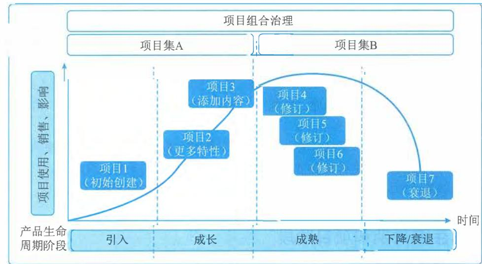  
图9-4 产品管理与产品生命周期的关系

产品管理可以表现为不同的形式，主要包括以下3种，即产品生命周期中包含项目集管理，

产品生命周期中包含单个项目管理,以及项目集内的产品管理。

(1)产品生命周期中包含项目集管理。这种方法中,产品生命周期中包括相关项目、子项目集和项目集活动。对于规模很大或长期运作的产品,一个或多个产品生命周期阶段可能非常复杂,因此需要一系列协同运作的项目集和项目。

(2)产品生命周期中包含单个项目管理。这种方法将产品作为某个单个项目的目标来进行管理,将产品功能的开发到成熟作为持续的业务活动进行监督。这种方法根据需要特许设立单个项目,执行对产品的增强和改进,或产生其他独特成果。

(3)项目集内的产品管理。这种方法会在给定项目集的范围内应用完整的产品生命周期。为了获得产品的特定收益,项目集内也可以特许设立一系列子项目集或项目。我们可以通过应用产品管理能力(例如竞争分析、客户获取和客户代言)增强这些收益。

虽然产品管理是一个单独的领域,有自己的知识体系,但它是项目集管理和项目管理这两个领域中的一个关键整合点。可交付物中包含产品的项目集和项目会使用的一种综合方法,这种方法包含所有相关知识体系及其相关实践、方法和工件。

# 9.3 项目经理的角色

项目经理是指由执行组织委派,领导团队实现项目目标的个人。项目经理的报告关系依据组织结构和项目治理而定。

除了要具备项目所需的特定技能和通用管理能力外,项目经理还应具备以下特性:

- 掌握关于项目管理、商业环境、技术领域和其他方面的知识,以便有效管理特定项目;

- 具备有效领导项目团队、协调项目工作、与干系人协作、解决问题和做出决策所需的技能;

- 具备编制项目计划(包括范围、进度、预算、资源、风险计划等)、管理项目工作,以及开展陈述和报告的能力;

- 拥有成功管理项目所需的其他特性,如个性、态度、道德和领导力。

项目经理通过项目团队和其他干系人来完成工作。项目经理需要依赖重要的人际关系技能,包括领导力、团队建设、激励、沟通、影响力、决策、政治和文化意识、谈判、引导、冲突管理和教练技术等。

项目经理的成功取决于项目目标的实现。干系人的满意程度是衡量项目经理的成功的另一个标准。项目经理应处理干系人的需要、关注和期望,令有关的干系人满意。为了取得成功,项目经理应该裁减项目方法、生命周期和项目管理过程,以满足项目和产品要求。

# 9.4 项目生命周期和项目阶段

# 9.4.1 定义与特征

项目生命周期指项目从启动到完成所经历的一系列阶段,这些阶段之间的关系可以顺序、迭代或交叠进行。它为项目管理提供了一个基本框架。项目生命周期适用于任何类型的项目。

项目的规模和复杂性各不相同，但不论其大小繁简，所有项目都呈现出包含启动项目、组织与准备、执行项目工作和结束项目4个项目阶段的通用的生命周期结构。

通用的生命周期结构具有以下两方面的主要特征：

（1）成本与人力投入水平在开始时较低，在工作执行期间达到最高，并在项目快要结束时迅速回落。这种典型的走势如图9-5所示。

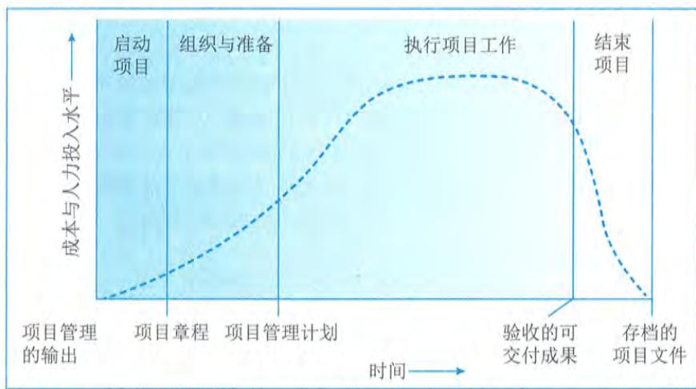  
图9-5 成本与人力投入水平随项目时间变化的情况

（2）风险与不确定性在项目开始时最大，并在项目的整个生命周期中随着决策的制定与可交付成果的验收而逐步降低；做出变更和纠正错误的成本随着项目越来越接近完成而显著增高，如图9-6所示。

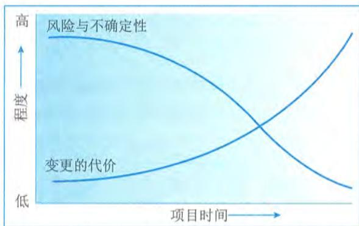  
图9-6 风险与不确定性以及变更的代价随项目时间变化的情况

上述特征在几乎所有项目生命周期中都存在，但是程度有所不同。

在通用生命周期结构的指导下，项目经理可以确定需要对哪些可交付成果施加更为有力的控制，或者哪些可交付成果完成之后才能完全确定项目范围。大型、复杂的项目尤其需要这种特别的控制。在这种情况下，项目经理需要将项目工作正式分解为若干阶段，并根据项目特点

采取合适的方法进行控制。

# 9.4.2 生命周期类型

在项目生命周期内的一个或多个阶段,通常会对产品、服务或成果进行开发,开发生命周期可分为预测型(计划驱动型)、迭代型、增量型、适应型(敏捷型)和混合型等多种类型,采用不同的开发生命周期的项目会呈现出不同的项目生命周期的特点。

# 1. 预测型生命周期

采用预测型开发方法的生命周期适用于已经充分了解并明确需求的项目,又称为瀑布型生命周期。在生命周期的早期阶段确定项目范围、时间和成本,对任何范围的变更都要进行严格管理,每个阶段只进行一次,每个阶段都侧重于某一特定类型的工作,如图9- 7所示。高度预测型项目范围变更很少、干系人之间有高度共识。这类项目会受益于前期的详细规划,但有些情况(例如增加范围、需求变化或市场变化)则会导致某些阶段重复进行。

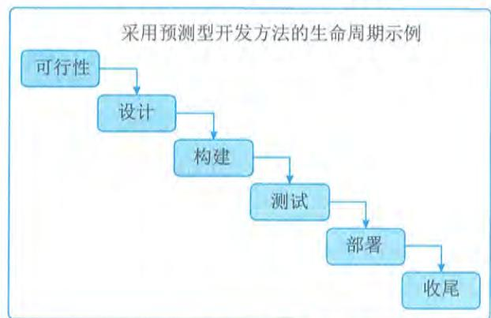  
图9-7 预测型生命周期

# 2. 迭代型生命周期

采用迭代型生命周期的项目范围通常在项目生命周期的早期确定,但时间及成本会随着项目团队对产品理解的不断深入而定期修改。迭代型生命周期如图9- 8所示。

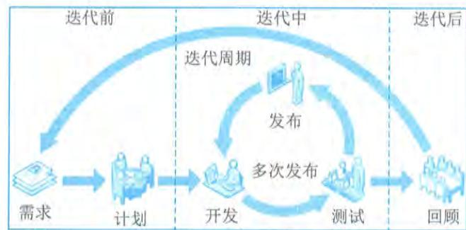  
图9-8 迭代型生命周期

# 3.增量型生命周期

3. 增量型生命周期采用增量型生命周期的项目通过在预定的时间区间内渐进增加产品功能的一系列迭代来产出可交付成果。只有在最后一次迭代之后，可交付成果具有了必要和足够的能力，才能被视为完整的，如图 9-9 所示。

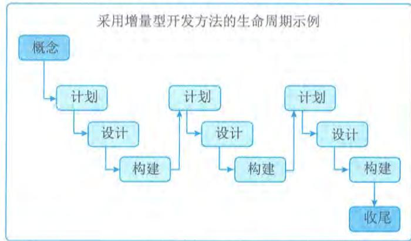  
图9-9 增量型生命周期

图9- 9 增量型生命周期迭代型开发方法和增量型开发方法的区别：迭代型开发方法是通过一系列重复的循环活动来开发产品，而增量型开发方法是渐进地增加产品的功能。

# 4.适应型生命周期

4. 适应型生命周期采用适应型开发方法的项目又称为敏捷型或变更驱动型项目，适合于需求不确定、不断发展变化的项目。在每次迭代前，项目和产品愿景的范围被明确定义和批准，每次迭代（有时称为“冲刺”）结束时，客户会对具有功能性的可交付物进行审查。在审查时，关键干系人会提供反馈，项目团队会更新项目待办事项列表，以确定下一次迭代中特性和功能的优先级，如图 9-10 所示。适应型项目生命周期的特点是先基于初始需求制定一套高层级的计划，再逐渐把需求细化到适合特定的规划周期所需的详细程度。

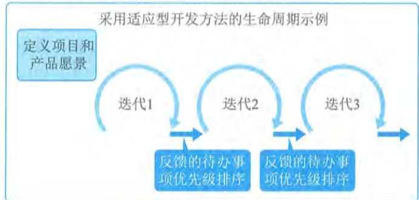  
图9-10 适应型生命周期

# 5.混合型生命周期

混合型生命周期是预测型生命周期和适应型生命周期的组合。

项目生命周期具有复杂性和多维性。特定项目的不同阶段往往采用不同的生命周期，项目管理团队需要确定项目及其不同阶段最适合的生命周期。各生命周期的联系与区别如表9- 5所示。开发生命周期需要足够灵活，才能够应对项目包含的各种因素。

表9-5 各生命周期之间的联系与区别  

<table><tr><td>预测型</td><td>迭代型与增量型</td><td>适应型</td></tr><tr><td>需求在开发前预先确定</td><td>需求在交付期间定期细化</td><td>需求在交付期间频繁细化</td></tr><tr><td>针对最终可交付成果制定交付计划，然后在项目结束时一次交付最终产品</td><td>分次交付整体项目或产品的各个子集</td><td>频繁交付对客户有价值的各个子集</td></tr><tr><td>尽量限制变更</td><td>定期把变更融入项目</td><td>在交付期间实时把变更融入项目</td></tr><tr><td>关键干系人在特定里程碑点参与</td><td>关键干系人定期参与</td><td>关键干系人持续参与</td></tr><tr><td>通过对基本已知的情况编制详细计划来控制风险和成本</td><td>通过用新信息逐渐细化计划来控制风险和成本</td><td>随着需求和制约因素的显现而控制风险和成本</td></tr></table>

# 9.5 项目立项管理

项目立项管理是对拟规划和实施的项目在技术上的先进性、适用性，经济上的合理性、效益性，实施上的可能性、风险性以及社会价值的有效性、可持续性等方面进行全面科学的综合分析，为项目决策提供客观依据的一种技术经济研究活动。一般包括项目建议与立项申请、项目可行性研究、项目评估与决策。

项目建议与立项申请、初步可行性研究、详细可行性研究、项目评估与决策是项目投资前期的4个阶段。在实际工作中，初步可行性研究和详细可行性研究可以依据项目的规模和繁简程度合二为一，但详细可行性研究是不可缺少的。升级改造项目只做初步和详细可行性研究，小项目一般只进行详细可行性研究。

# 9.5.1 项目建议与立项申请

# 1.立项申请的概念

立项申请，又称为项目建议书，是项目建设单位向上级主管部门提交项目申请时所必需的文件，是该项目建设筹建单位根据国民经济的发展、国家和地方中长期规划、产业政策、生产力布局、国内外市场、所在地的内外部条件、组织发展战略等，提出的某一具体项目的建议文件，是对拟建项目提出的框架性总体设想。项目建议书是项目发展周期的初始阶段产物，是国家或上级主管部门选择项目的依据，也是可行性研究的依据。涉及利用外资的项目，在项目建议书获得批准后，方可开展后续工作。

# 2.项目建议书内容

项目建议书应该包括的核心内容有： $①$  项目的必要性； $②$  项目的市场预测； $③$  项目预期成果（如产品方案或服务）的市场预测； $④$  项目建设必需的条件。

# 9.5.2 项目可行性研究

9.5.2 项目可行性研究可行性研究是在项目建议书被批准后,对技术、经济、社会和人员等方面的条件和情况进行调查研究,对可能的技术方案进行论证,以最终确定整个项目是否可行。可行性研究是为项目决策提供依据的一种综合性的分析方法,可行性研究具有预见性、公正性、可靠性、科学性的特点。

# 1、可行性研究的内容

1、可行性研究的内容信息系统项目进行可行性研究包括很多方面的内容,可以归纳为以下几个方面:技术可行性分析、经济可行性分析、社会效益可行性分析、运行环境可行性分析以及其他方面的可行性分析等。

# 1）技术可行性分析

技术可行性分析是指在当前的技术、产品条件限制下,分析能否利用现在拥有的及可能拥有的技术能力、产品功能、人力资源来实现项目的目标、功能、性能,能否在规定的时间期限内完成整个项目。

技术可行性分析一般应考虑的因素包括:

$\bullet$  进行项目开发的风险:在给定的限制范围和时间期限内,能否设计出预期的系统,并实现必需的功能和性能;

$\bullet$  人力资源的有效性:可以用于项目开发的技术人员队伍是否可以建立,是否存在人力资源不足、技术能力欠缺等问题,是否可以在社会上或者通过培训获得所需要的熟练技术人员;

$\bullet$  技术能力的可能性:相关技术的发展趋势和当前所掌握的技术是否支持该项目的开发是否存在支持该技术的开发环境、平台和工具;

$\bullet$  物资(产品)的可用性:是否存在可以用于建立系统的其他资源,如一些设备及可行的替代产品等。

技术可行性分析往往决定了项目的方向,一旦技术人员在评估技术可行性分析时估计错误,将会出现严重的后果,造成项目根本上的失败。

# 2）经济可行性分析

经济可行性分析主要是对整个项目的投资及所产生的经济效益进行分析,具体包括支出分析、收益分析、投资回报分析及敏感性分析等。

(1)支出分析。信息系统项目的支出可分为一次性支出和非一次性支出两类。

$\bullet$  一次性支出:包括开发费、培训费、差旅费、初试数据录入、设备购置费等;

$\bullet$  非一次性支出:包括软硬件租金、人员工资及福利、水电等公用设施使用费,以及其他消耗品支出等。

(2)收益分析。信息系统项目的收益包括直接收益、间接收益及其他方面的收益等。

$\bullet$  直接收益:指通过项目实施获得的直接经济效益,如销售项目产品的收入;

$\bullet$  间接收益:指通过项目实施以间接方式获得的收益,如成本的降低;

$\bullet$  其他收益:如知识产权、软件著作权等。

(3) 投资回报分析。投资回报分析包括收益投资比、投资回收期分析。对投入产出进行对比分析,以确定项目的收益率和投资回收期等经济指标。

(4) 敏感性分析。敏感性分析是指当诸如设备和软件配置、处理速度要求、系统的工作负荷类型和负荷量等关键性因素变化时,对支出和收益产生影响的估计。

3) 社会效益可行性分析

项目除了需要考虑经济可行性分析外,往往还需要对项目的社会效益进行分析。尤其是针对面向公共服务领域的项目,其社会效益往往是可行性分析的关注重点。

社会效益可行性分析主要包括以下内容:

(1) 对组织内部。信息系统项目往往都能为组织的发展带来一定的知识和经验沉淀,这些沉淀会夯实组织进一步发展的基础,需要充分挖掘和分析项目各项能力的效益,具体包括:

- 品牌效益:指通过项目建设、服务等为组织的知名度提升及正向特征带来的收益;

- 竞争力效益:指通过项目预期成果能够为组织在行业或领域中获得更好竞争优势的收益;

- 技术创新效益:指通过项目的建设过程中对技术矛盾或难点的攻克,为组织技术能力积累,以及产品与服务创新等方面带来的收益;

- 人员提升收益:指通过项目锻炼和人员知识、技能、经验的应用,为组织人员能力提升或骨干人员培育等方面带来的收益;

- 管理提升效益:指通过项目过程管控以及项目管理与组织管理的实践融合等,为组织的管理水平提升带来的收益。

(2) 对社会发展。信息系统项目也可能成为组织履行社会责任的关键举措,这些举措可以为局部或区域社会发展带来各种进步,主要包括:

- 公共效益:指为广大群众增加信息惠民、美好生活、理念创造、知识普及、居民健康等方面带来的各种收益;

- 文化效益:指在社会精神文明建设中所发挥的积极作用,也包括网络文明方面;

- 环境效益:指在保护自然资源或生态环境方面的作用和价值;

- 社会责任感效益:指组织在履行社会责任与义务方面的收益;

- 其他收益:如提高国防能力,保障国家和社会安全等。

4) 运行环境可行性分析

信息系统项目的可行性分析不同于一般项目,信息系统项目的产品大多数是一个软硬件配套的信息系统,或一套需要安装并运行在用户现场的软件、相关说明文档、管理与运行规程等。只有基础硬件运转正常可靠,软件正常使用,并达到预期的技术(功能、性能)指标、经济效益和社会效益指标,才能称信息系统项目是成功的。

运行环境是制约信息系统发挥效益的关键。因此,需要从用户的管理体制、管理方法、规章制度、工作习惯、人员素质(甚至包括人员的心理承受能力、接受新知识和技能的积极性等)、数据资源积累、基础软硬件平台等多方面进行评估,以确定软件系统在交付以后,是否能够在用户现场顺利运行。

但在实际项目中,软(硬)件的运行环境往往是需要再建立的,这就为项目运行环境可行性分析带来了不确定因素。因此,在进行运行环境可行性分析时,可以重点评估是否可以建立系统顺利运行所需要的环境,以及建立这个环境所需要进行的工作,以便可以将这些工作纳入项目计划之中。

# 5)其他方面的可行性分析

信息系统项目的可行性研究除了前面介绍的技术、经济、社会效益和运行环境可行性分析外,还包括诸如法律可行性、政策可行性等方面的可行性分析。

信息系统项目也会涉及合同责任、知识产权等法律方面的可行性问题。特别是在系统开发和运行环境、平台和工具方面,以及产品功能和性能方面,往往存在一些软件版权问题,是否能够购置所使用环境、工具的版权,有时也可能影响项目的建立。

此外,在可行性分析方面,还包括项目实施对社会环境、自然环境的影响,以及可能带来的社会效益分析。总之,项目的可行性分析主要包括上述几个方面的内容,但是对于具体的项目,应该根据实际情况选取重点进行可行性研究分析。

# 2.初步可行性研究

1)初步可行性研究的定义

初步可行性研究一般是在对市场或者客户情况进行调查后,对项目进行的初步评估。详细可行性研究需要对项目在技术、经济、社会、运行环境、法律等方面进行深入的调查研究和分析,是一项费时、费力的工作,特别是大型的或比较复杂的项目更是如此。因此,进行初步可行性研究可以从如下几方面进行,以便衡量、决定是否开始详细可行性研究:

分析项目的前途,从而决定是否应该继续深入调查研究;

初步估计和确定项目中的关键技术及核心问题,以确定是否需要解决;

初步估计必须进行的辅助研究,以解决项目的核心问题,并判断是否具备必要的技术、实验、人力条件作为支持等。

# 2)辅助研究的目的和作用

辅助(功能)研究包括项目的一个或几个方面,但不是所有方面,并且只能作为初步可行性研究、详细可行性研究和大规模投资建议的前提或辅助。辅助研究包括:  $①$  对要设计开发的产品进行的市场研究,包括市场的需求预测及预期的市场渗透情况。  $②$  配件和投入物资的研究,包括项目使用的基本配件和投入物资的当前可获得性及预测的可获得性,以及这些配件和投入物资的目前价格和预测的价格趋势。  $③$  试验室和中间工厂的试验,根据需要进行试验,以决定具体配件是否合适,设计方案是否可行。  $④$  网络物理布局设计。  $⑤$  规模的经济性研究,一般作为技术选择研究的一个部分进行。如果牵扯到几种技术和几种市场规模,则分开进行这些研究,但研究不扩大到复杂的技术问题中去。这些研究的主要任务是在考虑各种选择的技术、投资费用、开发成本和价格之后,评价最具经济性的设计开发规模。这种研究通常对几种规模的设计开发能力进行分析,研究该项目的主要特性,并计算出每种规模的结果。  $⑥$  设备选择研究,如果项目的设备涉及的部门多,来源分散,而且成本各不相同,就要进行这种研究。一般在投资或实施阶段进行设备订货,包括准备投标、招标并对其进行评价,以及订货和交货。如果涉及

巨额投资,项目的构成和经济性在极大程度上取决于设备的类型及其成本和经营成本,所选设备直接影响项目的经营效果。在这种情况下,如果得不到标准化的成本,那么设备选择研究就是必不可少的。

巨额投资,项目的构成和经济性在极大程度上取决于设备的类型及其成本和经营成本,所选设备直接影响项目的经营效果。在这种情况下,如果得不到标准化的成本,那么设备选择研究就是必不可少的。辅助研究的内容视研究的性质和打算研究的项目各有不同,但由于其关系到项目的关键方面,因此其结论应为随后的项目阶段指明方向。在大多数情况下,投资前的辅助研究如果在项目可行性研究之前或与项目可行性研究一起进行,其内容则构成项目可行性研究的一个必不可少的部分。如果一项基本投入可能是确定项目可行性的一个决定因素,那么应在初步可行性研究之前进行辅助研究。如果对一项具体功能的详细研究过于复杂,不能作为项目可行性研究的一部分进行,辅助研究则与项目初步可行性研究分头同时进行。如果在进行项目可行性研究的过程中发现,尽管作为决策过程一部分的初步评价可以早些开始,但比较稳妥的做法是对项目的某一方面进行更详尽的鉴别,那么就在完成该项目可行性研究之后再进行辅助研究。辅助研究的费用必须和项目可行性研究的费用一并考虑,因为这种研究的目的之一就是要在项目可行性研究阶段节省费用。

3)初步可行性研究的作用

如果对项目价值和收益等存在疑问,组织需要进行初步可行性研究来确定项目是否可行。初步可行性研究主要回答的问题包括:

$\bullet$  项目进行投资建设是否具有必要性;

$\bullet$  项目建设的周期是否合理且可接受;

$\bullet$  项目需要的人力、财力资源等是否可接受;

$\bullet$  项目的功能和目标是否可以实现;

$\bullet$  项目的经济效益、社会效益是否可以保证;

$\bullet$  项目从经济上、技术上是否是合理的等。

经过初步可行性研究,可以形成初步可行性研究报告,该报告虽然比详细可行性研究报告粗略,但是对项目已经有了全面的描述、分析和论证,所以初步可行性研究报告可以作为正式的文献供项目决策参考,也可以为进一步做详细可行性研究提供基础。

4)初步可行性研究的主要内容

初步可行性研究的结果及研究的主要内容基本与详细可行性研究相同,所不同的是在占有的资源、研究细节方面有较大差异。可以通过捷径来决定投资支出和生产成本中的次要组成部分,但不能决定其主要组成部分,此时必须把估计项目的主要投资支出和生产成本作为初步可行性研究的一部分。初步可行性研究的主要内容包括:

$\bullet$  需求与市场预测:包括客户和服务对象需求分析预测,营销和推广分析,如初步的销售量和销售价格预测;

$\bullet$  设备与资源投入分析:包括从需求、设计、开发、安装、实施到运营的所有设备与材料的投入分析;

$\bullet$  空间布局:如网络规划、物理布局方案的选择;

$\bullet$  项目设计:包括项目总体规划、信息系统设计和设备计划、网络工程规划等;

项目进度安排: 包括项目整体周期、里程碑阶段划分等;

项目投资与成本估算: 包括投资估算、成本估算、资金渠道及初步筹集方案等。

# 3.详细可行性研究

3. 详细可行性研究详细可行性研究是在项目决策前对项目有关的技术、经济、法律、社会环境等方面的条件和情况进行详尽的、系统的、全面的调查、研究、分析, 对各种可能的技术方案进行详细的论证、比较, 并对项目建设完成后所可能产生的经济、社会效益进行预测和评价, 最终提交的可行性研究报告将成为进行项目评估和决策的依据。

# 1）详细可行性研究的依据

1）详细可行性研究的依据进行详细可行性研究时, 必须在国家有关法律、法规、政策、规划的前提下进行, 同时还应当具备一些必需的技术资料。进行详细可行性研究工作的主要依据包括:  $①$  国民经济和社会发展的长期规划, 地区的发展规划;  $②$  国家和地区的相关政策、法律、法规和制度;  $③$  项目主管部门对项目设计开发建设要求请示的批复;  $④$  项目建议书或者项目建议书批准后签订的意向性协议;  $⑤$  国家、地区、组织的信息化规划和标准;  $⑥$  市场调研分析报告;  $⑦$  技术、产品或工具的有关资料等。

# 2）详细可行性研究的原则

详细可行性研究应遵循以下原则:

（1）科学性原则: 按客观规律办事。这是可行性研究工作必须遵循的最基本的原则。遵循这一原则要做到以下几点:  $①$  运用科学的方法和认真的态度来收集、分析和鉴别原始的数据和资料, 以确保它们的真实和可靠, 真实可靠的数据资料是可行性研究的基础和出发点;  $②$  要求每一项技术与经济的决定要有科学依据, 是经过认真分析、计算而得出的。

（2）客观性原则: 坚持从实际出发、实事求是。信息化建设项目的可行性研究, 要根据信息化建设的要求与具体条件进行分析论证, 进而得出可行或不可行的结论。组织需要做到以下几点:  $①$  正确地认识各种信息化建设条件, 这些条件都是客观存在的, 研究工作要求排除主观臆断, 要从实际出发;  $②$  要实事求是地运用客观的资料做出符合科学的决定和结论;  $③$  可行性研究报告和结论必须是分析研究过程合乎逻辑的结果, 而不掺杂任何主观成分。

（3）公正性原则: 站在公正的立场上, 不偏不倚。在信息化建设项目可行性研究的工作中, 应该把国家的和人民的利益放在首位, 综合考虑项目干系人的各方利益, 决不为任何单位或个人而生偏私之心, 不为任何利益或压力所动。实际上, 只要能够坚持科学性与客观性原则, 不有意弄虚作假, 就能够保证可行性研究工作的正确和公正, 从而为项目的投资决策提供可靠的依据。

# 3）详细可行性研究的方法

详细可行性研究的方法有很多, 包括如经济评价法、市场预测法、投资估算法和增量净效益法等。这里主要介绍投资估算法和增量净效益法。

（1）投资估算法。投资费用一般包括固定资金及流动资金两大部分。固定资金又分为设计开发费、设备费、场地费、安装费及项目管理费等。投资估算是可行性研究中的一个重要工作, 投资估算的正确与否将直接影响项目的经济效果, 因此要求尽量准确。投资估算根据其进程或

精确程度可分为数量性估算(即比例估算法)、研究性估算、预算性估算及投标估算等方法。

(2)增量净效益法(有无比较法)。将有项目时的成本(效益)与无项目时的成本(效益)进行比较,求得两者差额,即为增量成本(效益),这种方法称为有无比较法。有无比较法比传统的前后比较法更能准确地反映项目的真实成本和效益。因为前后比较法不考虑不上项目时组织的变化趋势,会人为地夸大或低估项目的效益。有无比较法则先对不上项目时组织的变动趋势做预测,将上项目以后的成本/效益逐年做动态比较,因此得出的结论更科学、更合理。

4)详细可行性研究的内容

详细可行性研究所涉及的内容很多,每一方面都有其处理问题的方法。详细可行性研究所涉及的主要内容和方法包括:

(1)市场需求预测。产品的需求预测是项目可行性研究的基础工作,这项工作的好坏将直接影响项目可行性研究的水平。需求和市场分析的关键因素就是对某一时间范围内项目的主要产出或成果需求量做出估计,因为一个项目是否可行,除其他因素外,主要取决于预计的销售额或收入。在任何一个特定时间,需求都是若干可变因素的函数,这些可变因素包括市场构成,来自相同(或替代)产品和服务的其他供应来源的竞争,需求的收入弹性与价格弹性,市场对社会经济形式产生的反应,经销渠道和消费增长水平等。因此,需求估计比一般想象的复杂,而且,不仅需要估计对某一具体产品或服务的需求,而且还要辨明其组成(如产品组合、服务组合)和各个部分或各消费者类别,以及其增长与敏感性所受到的社会与制度方面的限制。

(2)部件和投入的选择供应。这也是进行项目可行性研究首先应考虑的问题。项目可行性研究应包括与部件和投入需要量有关的问题,包括部件和投入的分类、部件和投入的选择与说明、部件和投入的特点等。

(3)信息系统架构及技术方案的确定。信息系统架构及其建设过程采用的技术方案是项目可行性研究中的技术选择问题,它对组织的经济效益有着直接的影响。要根据具体的技术经济条件选择"适宜技术",并做相应的评价。采用新结构、新技术应有实验的根据,而不应采用不成熟的技术,因为工程项目的技术方案在技术上首先应是"可行"的。技术方案的选择,包括所采用的技术和开发过程。当然,它与生产规模有着密切关系。

项目可行性研究中的技术评价应反映下述几个方面:技术的先进性、技术的实用性、技术的可靠性、技术的连锁效果、技术后果的危害性等。

(4)技术与设备选择。项目可行性研究应该说明具体项目所需的技术,评价可供选择的各种技术,并按项目各组成部分的最佳结合选择最适合的技术。应估计获得这类技术所涉及的各种问题,还应说明与选择的技术相联系的具体设计和技术服务,同时选择和获得技术还必须与选择机器设备相呼应。设备选择和技术选择是相互依存的,在项目可行性研究报告中,应根据项目研发能力和所选择的技术来确定设备方面的需要。

项目可行性研究阶段的设备选择,应概略说明通过使用某种技术达到某种效果或模式所必需的设备最佳组合。在所有项目中,必须说明每一项目阶段的额定设备,并使之同下一阶段的研发能力和设备需要相联系。从投资角度来看,在符合各种功能和研发需要的条件下,设备费用要控制到最低限度。

(5)网络物理布局设计。信息系统项目的网络物理布局主要考虑场地的电气特性、基本设

施(网络基础设施)和网络新技术发展等方面。

(6)投资、成本估算与资金筹措。进行项目可行性研究时应考虑投资、成本估算与奖金筹措等问题,具体包括以下内容:

- 投资费用:投资费用就是固定资本与净周转资金的合计。固定资本是建设和装备一个投资项目所需的资金,除了固定投资外,还包括项目启动前的所有投资费用,诸如筹建开办费、项目可行性研究和其他咨询费、项目建设期间贷款利息、人员培训费以及试运行费用等;周转资金(或称流动资金)则相当于全部或部分经营该项目所需的资金,在项目评价阶段计算周转资金需要量很重要,应使它保持在一个合理的、必要的水平上;净周转资金则是流动资产减去短期负债,流动资产包括应收账款、存货(配件、辅助材料、供应品、包装材料、备件及小工具等)、在制品、成品和现金,短期负债主要包括应付账款(贷方)等。在不同的研究设计阶段,投资估算的精确性不同。毛估和粗估,一般可据此否定或初步肯定一个项目,估计的精度一般在  $\pm 30\%$  。初步项目可行性研究要求估计的精度在  $\pm 20\%$  ,详细可行性研究要求估计的精度在  $\pm 10\%$  ,设计开发时则要达到  $\pm 5\%$  。

- 资金筹措:为一个项目调拨资金,这对任何投资决定,包括对项目拟定和投资前的分析都是明显的基本先决条件。如果一个项目可行性研究没有这样的合理保证的支持,那么这项研究就没有多大用处。大多数情况下,在进行项目可行性研究之前就应该对项目筹资的可能性做出初步估计。因此,说明实际或可能的资金来源,包括自有资金、各种贷款及其偿还条件,是项目可行性研究最为基本和最为关键的内容。大型投资项目,除了自筹资金外,通常还需要一定数量的贷款。两者各占多少,要有适当的比例,因为贷款要付息,自筹资金要分红。自筹资金比例大,则盈利用来分红的就多;反之,贷款比例大,则利息负债就多。一般认为,自筹资金、贷款各占一半比较稳妥。自筹资金不足时可以多贷款,这个限额通常为  $50\% \sim 80\%$  不等;相反,自有资金雄厚时,可以少贷款。

- 项目成本:在项目可行性研究阶段,所遇到的另一个问题就是项目活动的消耗和成本预算开支不精确,从而可能导致完全不同的结论。成本估算的精度也应当和投资估算的精度相当。成本计算要以项目计划的各种消耗和费用开支为依据,计算全部成本和单位产品的成本。大多数投资前的项目可行性研究报告只算项目总成本,这是因为作为整体估算要比计算单位产品成本简单一些。项目总成本一般划分为4类:研发成本、行政管理费、销售与分销费用、财务费用和折旧。前3类成本的总和称为经营成本。项目成本在项目可行性研究中的用途为计算盈亏,计算净周转资金的需要量,并用于财务评价。

- 财务报表:为了估计一个新建或扩建项目的资金需要,要编制一套财务报表。财务报表关系到管理决策,所以在对一个组织的财务状况分析中,必须注重所用的表格形式。只有财务报表有标准的项目和格式,才能从事有意义的对比和分析。所以财务报表的格式不应随意改变。项目可行性研究中的财务报表主要是为了向投资者说明项目编制以及随之而来的财务分析,财务报表通常包括现金流动表、净收入报表和预计资产负债表。

（7）经济评价及综合分析。进行项目可行性研究时应进行经济评价及综合分析，具体包括以下内容：

经济评价：经济评价分为组织经济评价和国民经济评价。 $①$  组织经济评价：对于一项投资来说，投资的准则是从投入资本取得最大的收益，因此，投资盈利率分析基本上就是要确定利润和投资的比率，同时在分析投资和利润两者之间的关系时应考虑时间因素，并对项目的整个生命周期进行总的评价。组织经济评价大致可以分为3个步骤：第一步，进行分析的基础准备；第二步，编制财务报表；第三步，进行经济效果计算。进行组织经济评价时可以使用静态评价方法，如投资收益率与投资回收期，但最好使用动态评价方法，如净现值法、内部收益率法、外部收益率法、动态投资回收期法以及收益/成本比值法等，以便考虑资金的时间价值。 $②$  国民经济评价：从国民经济的利害得失出发对项目所做的经济效果评估。就是将项目纳入整个国民经济系统之中，考虑对其他相关部门的影响，从国家和社会的全局出发去衡量项目在经济效果上是否可行。该评估要求比较真实地反映项目在生命周期过程中投入与产出的价值，国民经济的真正得失，因此在评估的方法及数据处理上不完全与组织经济评价相同。国民经济评价是从国家视角，评价项目对实现国家经济发展战略目标及对社会福利的实际贡献。它除了考虑项目的直接经济效果外，还要考虑项目对社会的全面的费用效益状况。与组织经济评价不同，它将工资、利息、税金作为国家收益，它所采用的产品价格为社会价格，采用的贴现率也为社会贴现率。

综合分析：在对项目进行了经济评价后，还需要对项目进行综合评价分析，这是因为一方面拟建项目未来所处的环境可能随时发生变化，另一方面需要分析项目的实施对整个社会以及国民经济的影响。

# 5）详细可行性研究报告

详细可行性研究报告视项目的规模和性质，有简有繁。编写一份关于信息系统项目的详细可行性研究报告，可以考虑从项目背景、可行性研究的结论、项目的技术背景等方面进行描述，如表9- 6所示。

表9-6详细可行性研究报告结构示例  

<table><tr><td>目录项</td><td>主要内容</td></tr><tr><td>项目背景</td><td>项目名称：项目承担单位、主管部门及客户；承担可行性研究的单位；可行性研究的工作依据：可行性研究工作的基本内容；基本术语和一些约定等</td></tr><tr><td>可行性研究的结论</td><td>项目的目标、规模：技术方案概述及特点；项目的建设进度计划；投资估算和资金筹措计划；项目财务和经济评价；项目综合评价结论等</td></tr><tr><td>项目提出的技术背景</td><td>国家、地区、行业或组织发展规划；客户业务发展及需求的原因、必要性</td></tr><tr><td>项目的技术发展现状</td><td>国内外的技术发展历史、现状；新技术发展趋势</td></tr><tr><td>编制项目建议书的过程及必要性</td><td></td></tr></table>

（续表）

<table><tr><td>目录项</td><td>主要内容</td></tr><tr><td>市场情况调查分析</td><td>项目所生产产品的用途、功能、性能市场调研；市场相关（或替代）产品的调研；项目开发环境、平台、工具所需要产品的市场调研；市场情况预测</td></tr><tr><td>客户现行系统业务、资源、设施情况调查</td><td>客户拥有的资源（硬件、软件、数据、规章制度等）及使用情况调查；客户现行系统的功能、性能、使用情况调查；客户需求</td></tr><tr><td>项目总体目标</td><td>项目的目标、范围、规模、结构；技术方案设计的原则和方法；技术方案特点分析；关键技术与核心问题分析</td></tr><tr><td>项目实施进度计划</td><td>项目实施的阶段划分；阶段工作及进度安排；项目里程碑</td></tr><tr><td>项目投资估算</td><td>项目总投资概算；资金筹措方案；投资使用计划</td></tr><tr><td>项目组人员组成</td><td>项目组组织形式；人员构成；培训内容及培训计划</td></tr><tr><td>项目风险</td><td>关键技术、核心问题（攻关）的风险；项目规模、功能、性能（需求）不完全确定性分析；其他不可预见性因素分析</td></tr><tr><td>经济效益预测</td><td></td></tr><tr><td>社会效益分析与评价</td><td></td></tr><tr><td>可行性研究报告结论</td><td>可行性研究报告结论、立项建议；可行项目的修改建议和意见；不可行项目的问题及处理意见；可行性研究中的争议问题及结论</td></tr><tr><td>附件</td><td></td></tr></table>

# 9.5.3 项目评估与决策

项目评估指在项目可行性研究的基础上，由第三方（国家、银行或有关机构）根据国家颁布的政策、法规、方法、参数和条例等，从国民经济与社会、组织业务等角度出发，对拟建项目建设的必要性、建设条件、生产条件、市场需求、工程技术、经济效益和社会效益等进行评价、分析和论证，进而判断其是否可行的一个评估过程。项目评估是项目投资前期进行决策管理的重要环节，其目的是审查项目可行性研究的可靠性、真实性和客观性，为银行的贷款决策或行政主管部门的审批决策提供科学依据。项目评估的最终成果是项目评估报告。

# 1. 项目评估的依据

项目评估的依据主要包括： $①$  项目建议书及其批准文件； $(2)$  项目可行性研究报告； $(3)$  报送组织的申请报告及主管部门的初审意见； $(4)$  项目关键建设条件和工程等的协议文件； $(5)$  必需的其他文件和资料等。

# 2. 项目评估的程序

项目评估工作一般可按以下程序进行：

- 成立评估小组：进行分工，制订评估工作计划（包括评估目的、评估内容、评估方法和评估进度等）。- 开展调查研究：收集数据资料，并对可行性研究报告和相关资料进行审查和分析。尽管

大部分数据在可行性报告中已经提供，但评估单位必须站在公正的立场上，核准已有数据的可靠性，并收集补充必要的数据资料，以提高评估的准确性。- 分析与评估：在上述工作的基础上，按照项目评估内容和要求，对项目进行技术经济分析和评估。- 编写、讨论、修改评估报告。- 召开专家论证会。- 评估报告定稿并发布。

# 3. 项目评估的内容

项目评估主要包括以下内容：

- 项目与组织概况评估。- 项目建设的必要性评估：评估项目是否符合国家产业政策、行业规划和地区规划，是否符合经济和社会发展需要，是否符合市场需求，是否符合组织的发展要求。- 项目建设规模评估。- 资源、配件、燃料及公用设施条件评估。- 网络物理布局条件和方案评估。- 技术和设备方案评估。- 信息安全评估。- 安装工程标准评估：采用标准、规范是否先进、合理，是否符合国家有关规定。- 实施进度评估：项目的建设工期、实施进度、试运行、运营及系统转换所选择的方案及时间安排是否正确合理。- 项目组织、劳动定员和人员培训计划评估。- 投资估算和资金筹措：投资额估算采用的数据、方法和标准是否正确，是否考虑了汇率、税金、利息、物价上涨指数等因素。资金筹措的方法是否正确，资金来源是否正当、落实，外汇能否平衡等。- 项目的财务经济效益评估：基本数据的选定是否可靠，主要财务经济效益指标的计算及参数选取是否正确，推荐的方案是否是“最佳方案”。- 国民经济效益评估：在财务经济效益评估的基础上，重点对费用和效益的范围及其数值的调整是否正确进行核查。- 社会效益评估：对促进国家或地区社会经济发展，改善生产力布局，带来的经济利益和劳动就业效果，提高国家、部门或地方的科技水平、管理水平和文化生活水平的效益和影响等进行评估。- 项目风险评估：盈亏平衡分析、敏感性分析、项目主要风险因素及其敏感度和概率分析，项目风险的预防措施及处置方案等。

# 4. 项目评估报告大纲

项目评估报告大纲应包括项目概况、详细评估意见、总结和建议等内容。

（1）项目概况：包括项目基本情况；综合评估结论，即是否批准或可否贷款的结论性意见。

（2）详细评估意见。

（3）总结和建议：存在或遗留的重大问题、潜在的风险及建议等。

# 9.6 项目管理过程组

项目管理过程组是为了达成项目的特定目标，对项目管理过程进行的逻辑上的分组。需要注意的是，项目管理过程组不同于项目阶段，项目管理过程组是为了管理项目，针对项目管理过程进行的逻辑上的划分；项目阶段是项目从开始到结束所经历的一系列阶段，是一组具有逻辑关系的项目活动的集合，通常以一个或多个可交付成果的完成为结束的标志。

项目管理过程可分为以下5个项目管理过程组：

（1）启动过程组。启动过程组定义了新项目或现有项目的新阶段，启动过程组授权一个项目或阶段的开始。

（2）规划过程组。规划过程组明确项目范围、优化目标，并为实现目标制订行动计划。

（3）执行过程组。执行过程组完成项目管理计划中确定的工作，以满足项目要求。

（4）监控过程组。监控过程组跟踪、审查和调整项目进展与绩效，识别变更并启动相应的变更。

（5）收尾过程组。收尾过程组正式完成或结束项目、阶段或合同。

一个过程组的输出通常成为另一个过程组的输入，或者成为项目或项目阶段的可交付成果。例如，需要把规划过程组编制的项目管理计划和项目文件（如风险登记册、责任分配矩阵等）及其更新，提供给执行过程组作为输入。各过程组在项目阶段中的相互作用如图9- 11所示。

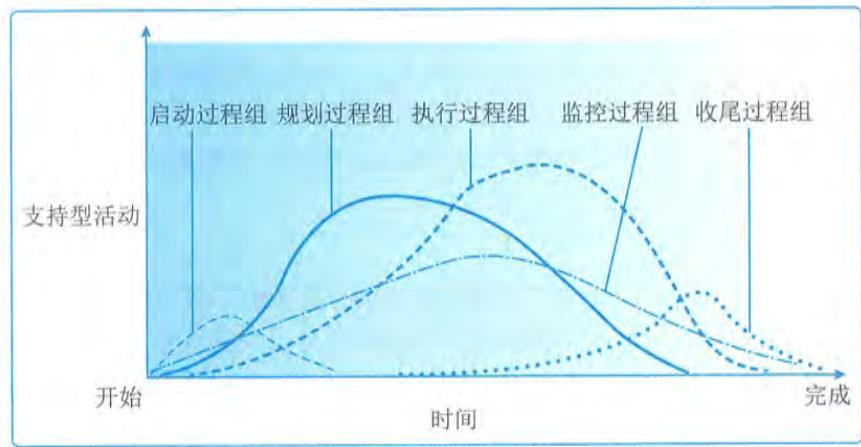  
图9-11 项目阶段中各过程组的相互作用

过程组中的各个过程会在每个阶段按需要重复开展，直到达到该阶段的完工标准。在适应型和高度适应型项目中，过程组之间相互作用的方式会有所不同。

# 1.适应型项目中的过程组

# 1）启动过程组

1）启动过程组在采用适应型生命周期的项目上，启动过程通常要在每个迭代期开展。适应型项目非常依赖知识丰富的干系人代表，他们要能够持续地表达需要和意愿，并不断针对新形成的可交付成果提出反馈意见。因此应该在项目开始时识别出这些关键干系人，以便在开展执行和监控过程组时与他们频繁互动，获得的反馈意见能够确保项目交付出正确的成果。同时，随着项目进展，优先级和情况的动态变化，项目制约因素和项目成功的标准也会变化。因此，需要定期开展启动过程，频繁回顾和重新确认项目章程，以确保项目在最新的制约因素内朝最新的目标推进。

# 2）规划过程组

2）规划过程组在高度复杂和不确定的项目中，在采用适应型生命周期的项目上，应该让尽可能多的团队成员和干系人参与到规划过程，以便依据广泛的信息开展规划，降低不确定性。高度预测型项目范围变更很少、干系人之间有高度共识，这类项目会受益于前期的详细规划。适应型生命周期的特点是先基于初始需求制订一套高层级的计划，再逐渐把需求细化到适合特定规划周期所需的详细程度。预测型和适应型生命周期在规划阶段的主要区别在于做多少规划工作，以及什么时间做。

# 3）执行过程组

在敏捷型或适应型生命周期中，执行过程通过迭代对工作进行指导和管理。每次迭代都是在一个很短的固定时间段内开展工作，然后演示所完成的工作成果，有关的干系人和团队基于演示来进行回顾性审查。这种演示和审查有助于对照计划检查进展情况，确定是否有必要对项目范围、进度或执行过程做变更。进行回顾性审查有利于及时发现和讨论与执行方法有关的问题，以及提出改进建议。

虽然工作是通过短期迭代进行的，但是也需要对照长期的项目交付时间框架对其进行跟踪和管理。先在迭代期层面上追踪开发速度、成本支出、缺陷率和团队能力的走势，再汇总并推算到项目层面，来跟踪整体项目的完工绩效。高度适应型项目中，项目经理聚焦于高层级的目标，并授权团队成员作为一个小组用最能实现目标的方式自行安排具体工作，有助于团队成员高度投入，制订出切合实际的计划。

# 4）监控过程组

在敏捷型或适应型生命周期中，监控过程通过维护未完项的清单，对进展和绩效进行跟踪、审查和调整。针对未完成的工作项，在项目团队的协助（分析并提供有关技术依赖关系的信息）下，业务代表对未完成的工作项进行优先级排序，基于业务优先级和团队能力，提取未完项清单最前面的任务，供下一个迭代期完成。针对变更，业务代表在听取项目团队的技术意见之后，评审变更请求和缺陷报告，排列所需变更或补救的优先级，列入工作未完项清单。

这种把工作和变更列入同一张清单的做法，多应用于充满变更的项目环境。在这种项目环境中，无法把变更从原先计划的工作中分离出来，所以把变更和原先的工作整合到一张未完项清单中，便于对全部工作进行重新排序，能够为干系人管理和控制项目工作、实施变更控制和

确认范围提供统一的平台。

随着排定了优先级的任务和变更从未完项清单中提取出来，并通过选代加以完成，就可以测算已完成工作的趋势和指标、变更工作量和缺陷率。通过在短期选代中频繁抽样，计算变更影响的数量和缺陷补救工作量，就可以对照原来的范围来考察团队能力和工作进展，进而能够基于实际的进展速度和变更影响来估算项目成本、进度和范围。

应该借助趋势图表与项目干系人分享这些指标和预测，以便沟通进展情况，共同面对问题，推动持续改进，以及管理干系人期望。

# 5）收尾过程组

在敏捷型或适应型生命周期中，收尾过程对工作进行优先级排序，以便首先完成最具业务价值的工作。这样，即便不得不提前关闭项目或阶段，也很可能已经创造出一些有用的业务价值。这就使得提前关闭不太像是一种归因于沉没成本的失败，而更像是提前实现收益、快速取得成功或验证某种业务概念。

# 2.适应型项目中过程组之间的关系

1）以选代方式顺序开展的项目

适应型项目往往可分解为一系列先后顺序进行的、被称为“选代期”的阶段。在每个迭代期都要利用相关的项目管理过程。为了有效管理高度复杂且充满不确定性和变更的项目，重复开展项目管理过程组会产生管理费用。在选代的各个阶段，所需的人力投入水平如图9- 12所示。

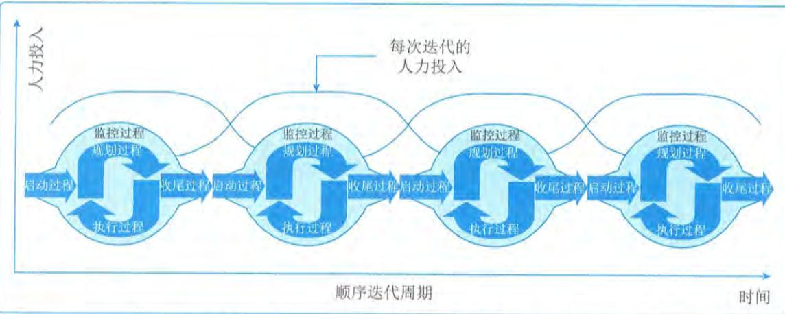  
图9-12以选代方式顺序开展的项目的人力投入水平

# 2）持续反复开展的项目

高度适应型项目往往在整个项目生命周期内持续实施所有的项目管理过程组。采用这种方法，工作一旦开始，计划就需根据新情况而改变，需要不断调整和改进项目管理计划的所有要素。这种方法中过程组之间的相互作用如图9- 13所示。

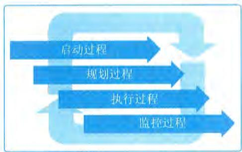  
图9-13 持续反复开展的项目中过程组之间的相互作用

# 9.7 项目管理原则

项目管理原则用于指导项目参与者的行为, 这些原则可以帮助参与项目的组织和个人在项目执行过程中保持一致性。项目管理原则具体包括:  $①$  勤勉、尊重和关心他人;  $②$  营造协作的项目团队环境;  $③$  促进干系人有效参与;  $④$  聚焦于价值;  $⑤$  识别、评估和响应系统交互;  $⑥$  展现领导力行为;  $⑦$  根据环境进行裁剪;  $⑧$  将质量融入过程和成果中;  $⑨$  驾驭复杂性;  $10$  优化风险应对;  $11$  拥抱适应性和韧性;  $12$  为实现目标而驱动变革。

# 1. 原则一: 勤勉、尊重和关心他人

项目管理者在遵守内部和外部准则的同时, 应该以负责任的方式行事, 以正直、关心和可信的态度开展活动, 同时对其所负责的项目的财务、社会和环境影响做出承诺。

1) 关键点

项目管理者在坚持“勤勉、尊重和关心他人”原则时, 应该关注的关键点包括:

$\bullet$  关注组织内部和外部的职责;

$\bullet$  坚持诚信、关心、可信、合规原则;

$\bullet$  秉持整体观, 综合考虑财务、社会、技术和可持续的发展环境等因素。

2) 工作内容

在组织内, 项目管理者在坚持“勤勉、尊重和关心他人”原则时, 需要履行的职责并做到相应的工作内容包括:

$\bullet$  运营时要做到与组织及其目标、战略、愿景、使命保持一致并维持其长期价值;

$\bullet$  承诺并尊重项目团队成员的参与, 包括薪酬、机会获得和公平对待;

$\bullet$  监督项目中使用的组织资金、材料和其他资源;

$\bullet$  了解职权和职责的运用是否适当等。

在组织外部, 项目管理者在坚持“勤勉、尊重和关心他人”原则时, 需要履行的职责并做到相应的工作内容包括:

$\bullet$  关注环境可持续性以及组织对材料和自然资源的使用;

$\bullet$  维护组织与外部干系人 (例如其合作伙伴和渠道) 的关系;

- 关注组织或项目对市场、社会和经营所在地区的影响:

- 提升专业化行业的实践水平等。

3) 职责

"勤勉、尊重和关心他人"原则反映了项目管理者对信任的理解和接受度以及产生和维持信任的行动和决定。项目管理者需要遵守明确的职责,也需要遵守隐含的职责。这些职责包括:

- 诚信: 项目管理者在所有参与和沟通中都应做到诚实且合乎道德。项目管理者应该通过制定决策并在参与具体的工作活动中践行和展现个人和组织的价值观,并带领团队成员、同职级人员和其他干系人考虑他们的言行、展现同理心、进行自我反思并乐于接受反馈,从而建立信任。

- 关心: 项目管理者应该密切关注自己所负责的项目相关的事务,像对待自己个人的私事一样关心项目事务。"关心"涉及与组织内部业务相关的所有事务,包括对环境和自然资源的可持续利用、对全球公众状况的关心。"关心"包括营造透明的工作环境、开放的沟通渠道以及让干系人有机会在不受惩罚或不害怕遭到报复的情况下提出意见和建议。

- 可信: 项目管理者应该在组织内外明确自己的身份、角色、所在项目团队和职权,帮助投入资源、作出批准或其他的项目决策。"可信"要求主动识别个人利益与组织或客户利益之间的冲突,因为这些冲突有可能会削弱信任和信心,导致产生不道德或非法等失信行为,或者对项目造成混乱或不利后果。项目管理者应该保护项目免受此类失信行为的影响。

- 合规: 项目管理者应该遵守相关的法律、规则、法规和要求,通过各种方法将合规性充分地融入项目文化。

# 2. 原则二: 营造协作的项目团队环境

项目团队由具有多样技能、知识和经验的成员组成。协同工作的项目团队可以更有效率、更有效果地实现共同的目标。

1) 关键点

项目管理者在坚持"营造协作的项目团队环境"原则时,应该关注的关键点包括:

- 项目是由项目团队交付的;

- 项目团队在组织文化和准则范围内开展工作,通常会建立自己的"本地"文化;

- 协作的项目团队环境有助于与其他组织文化和指南保持一致;

- 个人和团队的学习和发展;

- 为交付期望成果做出最佳贡献。

2) 营造协作的项目团队环境涉及的因素

营造协作的项目团队环境涉及团队共识、组织结构和过程等方面的因素。这些因素支持团队成员共同工作,并通过互动产生协同效应的文化。

- 团队共识: 是一套由项目团队制定的,需要大家做出承诺并共同维护的工作规范。团队

共识应在项目开始时形成,随着项目团队的深入合作,所需遵守的规范和所需实施的行为会随之变化,团队共识也会不断演变。

- 组织结构:是指项目工作要素和组织过程之间的对应关系。这些结构可以基于角色、职能或职权。可提升协作水平的组织结构具备的特点包括:确定了角色和职责;将员工和供应商分配到项目团队中;有特定目标任务的正式委员会;定期评审特定主题的站会。

- 过程:项目团队会定义能够完成任务和所分配工作的过程,包括使用工作分解结构(WBS)、待办事项列表或任务板。

3)协作的项目团队文化

为了更有效地实现项目目标,项目团队在组织文化、项目性质以及所处的运营环境的影响下,会建立自己的团队文化,并对组织结构进行裁剪。营造包容和协作的环境有助于传递知识和专业技能,可使项目实现更好的成果。

澄清角色和职责可以改善团队文化。在项目团队中,特定任务可以被委派给个人,也可以由项目团队成员自行选择,需要明确与任务相关的职权、担责和职责。

- 职权:指在特定背景下有权做出相关决策、制定或改进程序、应用项目资源、支出资金或给予批准。职权是一个实体授予(包括明示授予和默示授予)另一个实体的。

- 担责:指对成果负责。担责不能由他人分担。

- 职责:指有义务开展或完成某件事。职责可与他人共同履行。

无论谁应为特定项目工作承担责任,也无论谁负有开展特定项目工作的职责,协作的项目团队都会对项目成果共同负责。

多元化的项目团队可以将不同的观点汇集起来,丰富项目环境。项目团队可以由组织内部员工、签约贡献者、志愿者或外部第三方组成。此外,一些项目团队成员是短期加入项目的,而其他成员则是更长期地参与项目。将这些人与项目团队整合起来是一种挑战。相互尊重的团队文化允许团队内部存在差异,并致力于找到有效利用差异的方法,这种文化鼓励团队成员通过有效的方式管理冲突。

协作的项目团队环境还包括实践标准、道德规范和其他准则,项目团队会考虑这些标准或指南使用的既定准则,以及如何利用这些标准或指南为工作提供支持,以避免各领域之间可能发生的冲突。

协作的项目团队环境可促进信息和个人知识的自由交流,可帮助项目成员在交付成果的同时实现共同学习和个人发展,使相关的每个人都能尽最大努力交付期望的成果。

# 3.原则三:促进干系人有效参与

积极主动地让干系人参与进来,最大限度促使项目成功和客户满意。

1)关键点

项目管理者在坚持"促进干系人有效参与"原则时,应该关注以下关键点:

- 干系人会影响项目、绩效和成果;

- 项目团队通过与干系人互动来为干系人服务;

- 干系人的参与可主动地推进价值交付。

2）干系人参与的重要性

干系人是影响项目组合、项目集或项目的决策、活动或成果的个人、群体或组织。干系人包含会受到或自认为会受到项目组合、项目集和项目的决策、活动或成果影响的个人、群体或组织。干系人以积极或消极的方式直接或间接影响项目、项目绩效或成果。干系人可以影响项目的许多方面，包括范围或需求、进度、成本、项目团队、计划、成果、文化、收益、风险、质量等。

从项目开始到结束，识别、分析并主动争取干系人参与，将潜在的消极影响最小化，将积极影响最大化，有助于项目团队找到干系人普遍接受的解决方案，并帮助项目取得成功。在项目的整个生命周期内，干系人可能会参与进来，也可能会退出。此外，随着时间的推移，干系人的利益、影响或作用也会有所变化。干系人（特别是那些影响力高且对项目持不赞同或中立观点的干系人）需要有效地参与进来，以便项目团队了解他们的利益、顾虑和权利，干系人通过有效参与和支持来做出应对措施，帮助成功地实现项目成果。

项目团队本身就是项目干系人，这些干系人与其他干系人互动，理解、思考、沟通并回应他们的利益、需要和意见。

3）有效果且有效率的参与和沟通

有效果且有效率的参与和沟通包括确定干系人参与的方式、时间、频率等。沟通是参与的关键部分，深入的参与可以让他人了解自己的想法，吸收其他观点以及协同努力制定共同的解决方案。参与包括通过频繁的双向沟通建立和维持牢固的关系。鼓励通过互动会议、面对面会议、非正式对话和知识共享活动进行协作。

干系人参与在很大程度上依赖于人际关系技能，包括积极主动、正直、诚实、协作、尊重、同理心和信心。这些技能和态度可以帮助每个人适应工作和彼此适应，从而增加成功的可能性。

参与有助于项目团队发现、收集和评估信息、数据和意见，帮助形成共识和一致性，识别、调整和应对不断变化的环境，从而实现项目成果。

# 4.原则四：聚焦于价值

针对项目是否符合商业目标以及预期收益和价值，进行持续评估并做出调整。

1）关键点

项目管理者在坚持“聚焦于价值”原则时，应该关注的关键点包括：

- 价值是项目成功的最终指标；

- 价值可以在整个项目进行期间、项目结束或完成后实现；

- 价值可以从定性和/或定量的角度进行定义和衡量；

- 以成果为导向，可帮助项目团队获得预期收益，从而创造价值；

- 评估项目进展并做出调整，使期望的价值最大化。

2）项目价值

价值是指某种事物的作用、重要性或实用性。价值是项目的最终成功指标和驱动因素。项目的价值具体可表现为财务收益值，也可表现为所取得的公共利益和社会收益（包括客户从项

目结果中所感知到的收益)。当项目是项目集的组件时,项目的价值也可以表现为对项目集成果的贡献。

价值通过可交付物的预期成果来体现。项目的目的就是提供预期的成果,预期的成果通过有价值的解决方案来实现。可通过商业论证的方式,从定性或定量方面说明项目成果的预期价值。商业论证包含商业需要、项目理由和商业战略等要素。

- 商业需要:包含了项目有关的商业目标的详细信息,源于项目章程或其他授权文件中的业务需求,目的是满足组织、客户、合伙方或公共福利等的需要。明确说明商业需要有助于项目团队了解未来状态的商业驱动因素,并使项目团队能够识别机会或问题,从而提高项目成果的潜在价值。- 项目理由:与商业需要相关,项目理由增加了成本效益分析和假设条件,解释了为什么商业需要值得投资,以及为什么在此时应该满足商业需要。- 商业战略:是开展项目的原因。价值具有主观性,从某种意义上说,同一个概念对于不同的人和组织具有不同的价值,因此价值取决于组织商业战略,包含短期财务收益、长期收益和其他非财务要素。

商业需要、项目理由和商业战略一起为项目团队提供信息,帮助项目团队做出知情决策,以达到或超过预期的业务价值。

在项目生命周期内,项目可能会发生变更,项目团队需要在整个生命周期内,以不断迭代的方式对项目预期的成果进行清晰地描述、评估和更新,保证项目与商业需要保持一致,并交付预期的成果。在项目执行过程中,如果发现项目或干系人不再与商业需要保持一致,或者项目不可能提供预期的价值,组织可以选择终止项目。有时,特别是在没有预先确定范围的适应型项目中,项目团队可以与客户共同努力,确定哪些功能值得投资,哪些功能缺乏足够的价值无须增加到输出之中,从而优化价值。

# 3)关注预期成果

为了支持从项目中实现价值,项目团队可将重点从可交付物转到预期成果。这样做可以让项目团队实现项目的愿景或目标,而不是简单地创建特定的可交付物。可交付物可能会支持预期的项目成果,但它可能无法完全实现项目的愿景或目标。例如,客户需要某一特定的软件解决方案,该解决方案可以满足提高生产力的商业需要。软件是项目的可交付物,但软件本身并不能实现预期的生产力成果。在这种情况下,可以增加针对软件的培训这一新的可交付物,帮助实现更好的生产力成果。

# 5.原则五:识别、评估和响应系统交互

从整体角度识别、评估和响应项目的内外部环境,积极地推进项目绩效。

1)关键点

项目管理者在坚持"识别、评估和响应系统交互"原则时,应该关注的关键点包括:

- 项目是由多个相互依赖且相互作用的活动域组成的一个系统;

- 需要从系统角度进行思考,整体了解项目的各个部分如何相互作用,以及如何与外部系统进行交互;

- 系统不断变化,需要始终关注内外部环境;

- 对系统交互做出响应,可以使项目团队充分利用积极的成果。

2)将系统整体性思维应用于项目

2) 将系统整体性思维应用于项目系统是一组相互作用且相互依赖的组件,它们作为一个统一的整体发挥作用。项目是一个动态环境中的多层次的实体,具有系统的各种特征。

项目可在较大的系统中运作,一个项目的交付物可以成为较大系统的某个部件。例如,一个项目可能是某一项目集的部件,而该项目集又可能是某一项目组合的部件。这些相互关联的结构称为系统体系。项目团队需要平衡由内向外和由外向内的观点,保持整个系统体系的一致性。反之,当单个项目团队开发某一可交付物的独立组件时,系统内所有组件都应有效地整合起来,项目团队需要定期互动使系统中各子系统或组件的工作保持一致。

系统还需要考虑时序要素,即随着时间的推移项目将交付或实现哪些目标或成果。例如,如果项目可交付物以增量方式发布,则每个增量都会扩展以前版本的累积成果或能力。随着项目的开展,内部和外部条件会不断变化,单个变更可能会产生多种影响。例如,在大型施工项目中,需求的变更可能会导致与主要承包商、分包商、供应商或其他方面的合同发生变更。这些变更有可能会对项目成本、进度、范围和绩效产生影响。这些变更同时会调用变更控制协议,获得外部系统中实体(如服务提供商、监管机构、金融机构和政府机构)的批准。项目生命周期内影响项目的变更随时可能出现,项目团队可以通过系统整体性思维,并持续关注内外部环境。控制变更对项目的影响,使项目与干系人期望保持一致。

3)将系统整体性思维应用于项目团队

3) 将系统整体性思维应用于项目团队系统整体性思维同样适用于项目团队,一个多样性的项目团队聚集在一起成为一个整体,为共同的目标而努力。这种多样性给项目团队带来了价值,同时也带来了差异,项目团队需要有效平衡差异性,帮助项目团队紧密协作。多样性的项目团队成员可以建立一种综合性的团队文化,形成共同的愿景、语言和工具集,帮助项目团队成员有效参与并体现自身价值,并支持项目系统整体的正常运行。

由于系统体系中各个系统之间的这种交互性,项目团队在开展工作时需要以下技能帮助建立系统整体性思维,应对系统的不断变化的动态特性:

- 对商业领域具有同理心;

- 关注大局的批判性思维;

- 勇于挑战假设和思维模式;

- 寻求外部审查和建议;

- 使用整合的方法、工件和实践,对项目工作、可交付物和成果达成共识;

- 使用建模和情景假设等方法,对系统动力学互动和反应进行假设;

- 主动管理整合,支持商业成果的实现等。

4)识别、评估和响应系统交互带来的收益

识别、评估和响应系统交互可以为项目带来如下好处:

- 尽早考虑项目中的不确定性和风险,寻找替代方案并预见后果;

具有在整个项目生命周期内调整假设和计划的能力:

持续提供信息和执行情况:

与干系人及时沟通项目计划、进展情况,并对项目未来进行预测;

使项目目标与客户的目标和愿景保持一致;

能够适应不断变化的需要,通过协同获得收益;

能够利用潜在的机会,并发现面临的威胁;

有利于整个组织的决策;

更全面、更明智地识别风险等。

# 6.原则六:展现领导力行为

展现并调整领导力行为,为项目团队和成员提供支持。

# 1)关键点

项目管理者在坚持"展现领导力行为"原则时,应该关注的关键点包括:

有效的领导力有助于项目成功,并有助于取得积极的成果;

任何项目团队成员都可以表现出领导力行为;

领导力与职权不同;

有效的领导者会根据情境调整自己的风格;

有效的领导者会认识到项目团队成员之间的动机的差异性;

领导者应该在诚实、正直和道德行为规范方面展现出期望的行为。

# 2)有效领导力

愿景、创造力、激励、热情、鼓励和同理心,这些特质通常与领导力有关。为了实现预期成果,领导力包括对项目团队内外的个人施加影响的态度、才能、性格和行为。

有效领导力对项目至关重要。项目通常涉及多个组织、部门、职能或供应商,他们会不定期进行互动。高层领导和干系人会影响项目,这往往会造成更大程度的问题和冲突。领导力并非任何特定角色所独有。高绩效项目可能会有多名成员表现出有效的领导力技能,例如,项目经理、发起人、干系人、高级管理层甚至项目团队成员。任何开展项目工作的人员都可以展现有效的领导力特质、风格和技能,以帮助项目团队执行和交付所要求的结果。高绩效的项目会表现出一种由更多影响者组成的看似矛盾的联合体,每位影响者以互补的方式贡献领导力技能。例如,在某项目中,项目发起人说明了项目目标和优先级后,技术主管牵头开展与交付相关的讨论,在讨论过程中,参与者会陈述利弊,最终由项目经理协调并进行决策、达成共识。成功的领导力能够在各种情况下随时影响、激励、指导他人。

领导力与职权不同。职权是指组织内人员被赋予的控制地位,可以帮助高效履行其职能。通常通过正式手段(例如章程文件或指定的职务)授予某人。职权可以用来影响、激励、指导他人,或在他人未按要求或指示行事时采取措施,但职权与领导力不同。例如,某项目经理被授予了组建项目团队,并交付某项成果的职权。但项目经理仅仅拥有职权是不够的,他还需要领导力来激励团队成员处理好个人与项目集体之间的关系,激励团队实现共同的目标。

3）领导力风格

有效的领导力会借鉴并结合各种领导力风格。领导力包括专制型、民主型、放任型、指令型、参与型、自信型、支持型和共识型等。领导力风格没有好坏之分，不同的领导力风格适合于不同的环境。充分发挥不同领导力风格的独特优势，融合各种风格、持续增长技能并充分利用激励因素，任何项目团队成员或干系人，不论其角色或职位如何，都可以激励、影响、教导和培养项目团队。关于领导力风格，有以下几点需要注意：

在混乱无序的环境下，相比于协作型领导，指令型的领导行动力更强，解决问题更清晰、更有推动力。对于拥有高度胜任和敬业员工的环境，授权型领导比集中式领导更有效。当优先事项发生冲突时，民主中立的引导更有效。

4）领导力技能的培养

有效的领导力技能是可以培养的，可以通过学习提升。项目团队成员通过以下方法可以提升领导力技能：

让项目团队聚焦于预定的目标：

明确项目成果的激励性愿景：

为项目寻求资源和支持：

商榷最优路线并达成共识：

克服项目进展中的障碍：

协商并解决项目团队内部以及项目团队与干系人之间的冲突：

根据受众情况调整沟通风格和消息传递方式：

教导项目团队成员：

欣赏并奖励积极行为：

提供提高技能和未来发展的机会：

引导团队进行协同决策：

运用有效对话和积极倾听：

向项目团队成员赋能并向他们授予职责：

建立勇于担责、有凝聚力的项目团队：

对项目团队和干系人的观点表现出同理心：

对自己的偏见和行为有自我意识：

在项目生命周期过程中，管理和适应变革：

拥有通过承认错误促进快速学习的思维方式：

以身作则，对期望的行为进行示范等。

当项目团队成员展现出符合干系人特定需要和期望的适当领导力特质、技能和特征时，项目团队会蓬勃发展。以最佳方式与他人沟通、激励他人或者在必要时采取行动，有助于提高项目团队绩效，帮助扫清障碍，使项目取得成功。

当一个项目中有多人发挥领导力时，这种领导力可以促使大家对项目目标承担共同的责任，

同时可以帮助营造健康的、充满活力的环境。在领导有方的项目中,单个项目团队、项目团队成员和干系人都会积极参与其中。每名项目团队成员都会心系项目共同的愿景,努力实现共享的成果,聚焦于交付结果。

# 7. 原则七:根据环境进行裁剪

根据项目的背景及其目标、干系人、治理和环境的不同应用合适的项目开发方法,使用"合适"的过程来实现预期成果,同时最大化价值,降低管理成本并提高速度。

# 1)关键点

项目管理者在坚持"根据环境进行裁剪"原则时,应该关注的关键点包括:

$\cdot$  每个项目都具有独特性;

$\cdot$  项目成功取决于适合项目的独特环境和方法;

$\cdot$  裁剪应该在整个项目进展过程中持续进行。

# 2)裁剪的重要性

裁剪是对项目管理方法、治理和过程进行的深思熟虑的调整,使之更适合特定环境和当前项目任务。商业环境、团队规模、不确定性和项目复杂性都是裁剪项目应该考虑的因素。项目系统可以从整体角度,充分考虑其内在的相互关联的复杂特性来进行裁剪。通过使用"合适"的过程、方法、模板和工件实现项目期望的成果。裁剪是为了在管理因素的制约下将项目价值最大化,最终实现提高绩效的目标。

项目团队需要和PMO一起进行裁剪,在组织治理的策略下,逐一讨论每个项目,确定每个项目的交付方法,选择要使用的过程、开发方式方法和所需的工件,明确所需资源和计划实现的成果。

项目具有独特性,每个项目都处于特定的组织、客户、渠道和动态环境中,每个项目都需要裁剪,项目团队应综合判断每个项目的各种独特条件,寻找实现项目的期望成果的最适当的方法。

# 3)裁剪的收益

裁剪项目可以为组织带来以下收益:

$\cdot$  提高创新、效率和生产力;

$\cdot$  吸取经验教训,分享改进优势,并将它们应用于未来的工作或项目中;

$\cdot$  采用新的实践、方法和工件,改进组织的组织过程资产和方法论;

$\cdot$  通过实验探索新的成果、过程或方法;

$\cdot$  有效整合多个专业背景下的优秀方法和实践;

$\cdot$  提高组织对未来的适应性等。

在项目生命周期中,裁剪是一个持续迭代的过程。项目团队需要收集所有干系人的需求,了解在项目进展过程中裁剪后的方法和过程的效果,并评估其有效性,给组织增加价值。

# 8. 原则八:将质量融入过程和成果中

持续关注过程和成果的质量,过程和成果要符合项目目标,并与干系人提出的需求、用途和验收标准保持一致。

1）关键点

项目管理者在坚持"将质量融入过程和成果中"原则时,应该关注的关键点包括:

$\bullet$  项目成果的质量要求,达到干系人期望并满足项目和产品的需求:

$\bullet$  质量通过成果的验收标准来衡量;

$\bullet$  项目过程的质量要求,确保项目过程尽可能适当而有效。

2）质量的内容

质量是产品、服务或成果的一系列内在特征满足需求的程度。质量包括满足客户明示的或隐含的需求的能力。项目团队需要对项目的产品、服务或成果进行测量,以确定其是否符合验收标准并满足使用要求。

质量包含如下几个方面和维度:

$\bullet$  绩效:是否符合项目团队和干系人的期望?

$\bullet$  一致性:是否满足使用要求,是否符合规格?

$\bullet$  可靠性:在每次实施或生成时是否会具有一致的度量指标?

$\bullet$  韧性:是否能够应对意外故障并快速恢复?

$\bullet$  满意度:在可用性和用户体验等方面是否获得最终用户的满意?

$\bullet$  统一性:相同的实施过程或生成过程是否能够产生相同的成果?

$\bullet$  效率:是否能以最少的投入产生最大的输出?

$\bullet$  可持续性:是否会对经济、社会和环境产生积极影响?

3）质量的测量

项目团队需要依据需求,使用度量指标和验收标准对质量进行测量,具体包括以下内容:

$\bullet$  需求是为满足需要,某个产品、服务或成果必须达到的要求或具备的能力。需求(无论是明确的还是隐含的)来源于干系人、合同、组织政策、标准或监管机构。

$\bullet$  度量指标和验收标准是一系列在工作说明书或其他设计文件中明确规定,并根据需要不断更新的指标,这些指标需要在验收过程中确认。

质量不仅与项目成果有关,也与生成项目成果的项目方法和活动有关。因此在关注项目成果质量的同时,也需要对项目活动和过程进行评估。因此,质量管理更加关注过程的质量,侧重于在过程中提前发现和预防错误、缺陷的发生,帮助项目团队以最适当的方式交付符合要求的成果,达到客户和干系人的要求,并使资源最小化、目标最大化,并实现如下目标:

$\bullet$  快速交付成果;

$\bullet$  尽早识别缺陷并采取预防措施,避免或减少返工和报废。

4)质量的收益

将质量融入过程和成果中,可以带来如下收益:

$\bullet$  成果符合验收标准;

$\bullet$  成果达到干系人的期望和商业目标;

$\bullet$  成果缺陷最少或力求无缺陷;

$\bullet$  交付及时,提高交付速度;

强化成本控制;

提高交付质量;

减少返工和报废;

减少客户投诉;

整合供应链资源;

提高生产力;

提高项目团队的士气和满意度;

提升服务交付能力;

改进决策;

持续改进过程等。

# 9.原则九:驾驭复杂性

不断评估和确定项目的复杂性,使项目团队能够在整个生命周期中成功找到正确的方法应对复杂情况。

1)关键点

项目管理者在坚持"驾驭复杂性"原则时,应该关注的关键点包括:

复杂性是由人类行为、系统交互、不确定性和模糊性造成的;

复杂性可能在项目生命周期的任何时间出现;

影响价值、范围、沟通、干系人、风险和技术创新的因素都可能造成复杂性;

在识别复杂性时,项目团队需要保持警惕,应用各种方法来降低复杂性的数量及其对项目的影响。

2)复杂性的来源

项目是由相互作用、相互交互的要素组成的完整的系统。复杂性源于项目要素、项目要素之间的交互以及与其他系统和项目环境的交互。交互的性质和数量决定了项目的复杂程度。例如,项目的复杂性随着干系人的数量和类型的增多(如监管机构、国际金融机构、多个供应商、多个专业分包商或当地社区)而加深,这些干系人单独或共同对项目的复杂性造成重大影响。虽然复杂性无法控制,但项目团队可以随时调整项目活动,降低复杂性对项目的影响。

项目团队通常无法预见复杂性的出现,因为复杂性是风险、依赖性、事件或相互关系等许多因素交互形成的。很难分离出造成复杂性的特定原因。常见的复杂性来源包括:

人类行为:包括人的行为、举止、态度和经验,以及它们之间的相互作用。主观因素的引入也会使人类行为的复杂性加深。位于偏远地区的干系人可能地处不同的时区,讲不同的语言,遵守不同的文化规范。

系统行为:是项目要素内部和项目要素之间动态的相互依赖与交互的结果。例如,不同技术系统的集成可能会增加复杂性,项目系统各组件之间的交互也可能导致相互关联的风险,造成新的不可预见的问题。

不确定性和模糊性:不确定性是缺乏对问题、事件、目标路径和解决方案的理解和认识

而导致的一种状态,是超出了现有的知识或经验的新因素引起的。模糊性是一种不清晰、不知道会发生什么情况或无法理解某种情况的状态。选项众多或不清楚哪个是最佳选项都会导致模糊性。不清晰或误导性事件、新出现的问题或主观情况也会导致模糊性。在复杂的环境中,不确定性和模糊性往往混合在一起,导致其对项目影响的概率和可能性难以确定。

$\bullet$  技术创新:包括产品、服务、工作方式、流程、工具、技术、程序等的颠覆性创新。创新有助于项目产生新的解决方案,但新技术带来的不确定性也可能导致项目混乱,从而增加复杂性。

复杂性可能在项目生命周期的任何时间出现,通过持续关注项目组件和整个项目执行情况,项目团队可以时刻关注复杂性产生的迹象,识别贯穿整个项目的复杂性相关的要素。系统性思维、复杂的自适应系统、相关的项目经验,可以帮助项目团队提升驾驭复杂性的能力。

# 10.原则十:优化风险应对

持续评估风险(包括机会和威胁),并采取应对措施,控制其对项目及其成果的影响(机会最大化,威胁最小化)。

# 1)关键点

项目管理者在坚持"优化风险应对"原则时,应该关注的关键点包括:

$\bullet$  单个和整体的风险都会对项目造成影响;

$\bullet$  风险可能是积极的(机会),也可能是消极的(威胁);

$\bullet$  项目团队需要在整个项目生命周期中不断应对风险;

$\bullet$  组织的风险态度、偏好和临界值会影响风险的应对方式;

$\bullet$  项目团队持续反复地识别风险并积极应对,需要关注的要点包括明确风险的重要性,考虑成本效益,切合项目实际,与干系人达成共识,明确风险责任人。

# 2)风险及应对方法

风险是一旦发生即可能对一个或多个目标产生积极或消极影响的不确定事件或条件。在整个生命周期内,项目团队应努力识别和评估项目内外部的已知和未知的风险。

项目团队应力求最大化地增加积极风险(机会),减少消极风险(威胁)。机会可以带来收益,例如缩短进度、降低成本、提高绩效、增加市场份额或提升声誉等。威胁会导致问题,例如进度延迟、成本超支、技术故障、绩效下降或声誉受损等。

项目团队需要监督项目的整体风险。项目整体风险是不确定性对项目整体的影响。整体风险源自所有不确定性,是单个风险的累积结果。项目整体风险管理的目标就是要将项目风险保持在可接受的范围内。

项目团队成员应该争取干系人参与,了解他们的风险偏好和风险临界值。风险偏好是为了获得预期的回报,组织或个人愿意承担的不确定性的程度。风险临界值是围绕目标的可接受的偏差范围,它反映了组织和干系人的风险偏好。由于风险临界值能够反映风险偏好,风险偏好和风险临界值可以帮助项目团队识别并应对项目中的风险。

风险可能存在于组织、项目组合、项目集、项目和产品中。从成本角度来看,提前采用一

致的风险评估、规划风险、积极主动地管理风险,这些投入会降低风险发生概率,甚至规避风险,比风险发生后再采取措施投入的成本要低。

# 11. 原则十一:拥抱适应性和韧性

将适应性和韧性融入组织和项目团队的方法之中,可以帮助项目适应变革。

1)关键点

项目管理者在坚持"拥抱适应性和韧性"原则时,应该关注的关键点包括:

$\bullet$  适应性是应对不断变化的能力;

$\bullet$  韧性是接受冲击的能力和从挫折或失败中快速恢复的能力;

$\bullet$  聚焦于成果而非某项输出,有助于增强适应性。

2)适应性和韧性

项目在生命周期的某个阶段难免会遇到挑战或障碍。如果项目团队开展项目的方法同时具备适应性和韧性,则有助于项目适应各种影响并保持生命力。

适应性和韧性是任何开展项目的人员都应具备的有益的特征。

项目会受到内外部因素(新需求、问题、干系人影响等因素)的影响,这些因素相互作用,构成了一个完整的动态系统,因此项目很少会按最初的计划执行。项目中的某些要素可能会失败或达不到预期,此时就需要项目团队重新组合、重新思考和重新规划,从整体的角度做到适应性,例如采用适当的变更控制过程,避免范围蔓延等问题。

3)提升项目团队的适应性和韧性的能力

在项目环境中,帮助提升项目团队的适应性和韧性的能力的方法包括:

$\bullet$  采用较短的反馈路径;

$\bullet$  持续学习和改进;

$\bullet$  拥有多样性技能、文化和经验,具备在每个所需技能领域具有广博知识的主题专家;

$\bullet$  定期检查和调整项目工作,识别改进机会;

$\bullet$  多样化的项目团队,获得广泛丰富的经验;

$\bullet$  开放、透明,促进内外部干系人参与;

$\bullet$  鼓励小规模的原型法和实验,勇于尝试新方法;

$\bullet$  充分运用新的思考方式和工作方式;

$\bullet$  平衡工作速度和需求稳定性;

$\bullet$  鼓励在组织内的开放式对话;

$\bullet$  充分理解以往类似工作中所获得的学习成果;

$\bullet$  积极预测多种潜在情景,为多种可能的情况做好准备;

$\bullet$  延迟决策,将决策推迟到最后时刻;

$\bullet$  获得管理层支持等。

在项目中保持适应性和韧性,可使项目团队在内外部环境发生变化时,能够关注项目预期的成果,帮助项目团队学习和改进,帮助项目团队从失败或挫折中快速恢复,并继续在交付价

值方面取得进展。

# 12. 原则十二：为实现目标而驱动变革

驱动变革，使受影响者做好准备，采用新的过程并执行新的方法，完成从当前状态过渡到项目成果所带来的预期的未来状态。

1）关键点

项目管理者在坚持“为实现目标而驱动变革”原则时，应该关注的关键点包括：

- 采用结构化变革方法，帮助个人、群体和组织从当前状态过渡到未来的期望状态；

- 变革源于内部和外部的影响；

- 变革具有挑战性，并非所有干系人都接受变革；

- 在短时间内尝试过多的变革会导致变革疲劳，使变革易受抵制；

- 干系人参与、激励有助于变革顺利进行。

2）积极驱动变革

根据项目本身的定义，项目会创造新的事物，是变革推动者。项目经理需要具备独特的能力，让组织做好变革的准备。

变革管理或驱动变革是一种综合的、周期性的和结构化的方法，可使个人、群体和组织从当前状态过渡到实现期望收益的未来状态。组织中的变革可能源自内部，例如需要新的能力应对绩效差距。变革也可能源自外部，例如技术进步、人口结构变化或社会经济压力。任何类型的变革都需要经历变革的群体以及与其互动的行业具有适应或接受变革的能力。

在组织中推动变革充满了挑战，因为有些人可能天生抵制变革或厌恶风险，尤其是在具备保守型文化的组织中推行变革会更加艰难。有效的变革管理需要采用激励型策略，而不是强制型策略。积极参与，并鼓励双向沟通可营造有效变革的环境，让变革更容易被采用和接受。

项目团队成员和项目经理需要和干系人共同合作，解决抵制变革等相关的问题，提高客户成功采纳或接受变革的可能性。提倡在项目早期沟通与变革相关的愿景和目标，争取各方对变革的认同。在整个项目期间，向组织内所有层级的人员说明变革的收益和变革对工作过程的影响。

同时，项目团队成员和项目经理需要掌握变革的节奏，试图在太短的时间内进行过多的变革，会因变革饱和而受到抵制。为了加强变革效果、促进收益，项目团队成员和项目经理还需要在变革实施后开展一些活动，强化变革效果，避免再次回到变革前的初始状态。认识并解决干系人在整个项目生命周期内接受变革的需要，有助于将变革整合到项目工作中，促进项目的成功。

# 9.8 项目管理知识领域

除了过程组，过程还可以按知识领域进行分类。知识领域是指按所需知识内容来定义的项目管理领域，并用其所含过程、实践、输入、输出、工具和技术进行描述。

虽然知识领域相互联系，但从项目管理的角度来看，它们是分别定义的。根据美国项目管

理协会出版的《项目管理知识体系指南》第6版，在大多数情况下，大部分项目通常使用的是10个知识领域，具体如下：

（1）项目整合管理：识别、定义、组合、统一和协调各项目管理过程组的各个过程和活动。

（2）项目范围管理：确保项目做且只做所需的全部工作以成功完成项目。

（3）项目进度管理：管理项目按时完成所需的各个过程。

（4）项目成本管理：使项目在批准的预算内完成而对成本进行规划、估算、预算、融资、筹资、管理和控制。

（5）项目质量管理：把组织的质量政策应用于规划、管理、控制项目和产品的质量，以满足干系人的期望。

（6）项目资源管理：识别、获取和管理所需资源以成功完成项目。

（7）项目沟通管理：确保项目信息及时且恰当地规划、收集、生成、发布、存储、检索、管理、控制、监督和最终处置。

（8）项目风险管理：规划风险管理、识别风险、开展风险分析、规划风险应对、实施风险应对和监督风险。

（9）项目采购管理：从项目团队外部采购或获取所需产品、服务或成果。

（10）项目干系人管理：识别影响或受项目影响的人员、团队或组织，分析干系人对项目的期望和影响，制定合适的管理策略来有效调动干系人参与项目决策和执行。

某些项目可能需要一个或多个其他的知识领域，例如，建造项目可能需要财务管理或安全与健康管理。表9- 7列出了项目管理5个过程组和10个知识领域。

表9-7 项目管理5个过程组和10个知识领域  

<table><tr><td rowspan="2">知识领域</td><td colspan="5">项目管理过程组</td></tr><tr><td>启动过程组</td><td>规划过程组</td><td>执行过程组</td><td>监控过程组</td><td>收尾过程组</td></tr><tr><td>项目整合管理</td><td>制定项目章程</td><td>制订项目管理计划</td><td>●指导与管理项目工作
●管理项目知识</td><td>●监控项目工作
●实施整体变更控制</td><td>结束项目或阶段</td></tr><tr><td>项目范围管理</td><td></td><td>●规划范围管理
●收集需求
●定义范围
●创建WBS</td><td></td><td>●确认范围
●控制范围</td><td></td></tr><tr><td>项目进度管理</td><td></td><td>●规划进度管理
●定义活动
●排列活动顺序
●估算活动持续时间
●制订进度计划</td><td></td><td>控制进度</td><td></td></tr><tr><td>项目成本管理</td><td></td><td>●规划成本管理
●估算成本
●制定预算</td><td></td><td>控制成本</td><td></td></tr></table>

（续表）

<table><tr><td rowspan="2">知识领域</td><td colspan="5">项目管理过程组</td></tr><tr><td>启动过程组</td><td>规划过程组</td><td>执行过程组</td><td>监控过程组</td><td>收尾过程组</td></tr><tr><td>项目质量管理</td><td></td><td>规划质量管理</td><td>管理质量</td><td>控制质量</td><td></td></tr><tr><td>项目资源管理</td><td></td><td>● 规划资源管理
● 估算活动资源</td><td>● 获取资源
● 建设团队
● 管理团队</td><td>控制资源</td><td></td></tr><tr><td>项目沟通管理</td><td></td><td>规划沟通管理</td><td>管理沟通</td><td>监督沟通</td><td></td></tr><tr><td>项目风险管理</td><td></td><td>● 规划风险管理
● 识别风险
● 实施定性风险分析
● 实施定量风险分析
● 规划风险应对</td><td>实施风险应对</td><td>监督风险</td><td></td></tr><tr><td>项目采购管理</td><td></td><td>规划采购管理</td><td>实施采购</td><td>控制采购</td><td></td></tr><tr><td>项目干系人管理</td><td>识别干系人</td><td>规划干系人参与</td><td>管理干系人参与</td><td>监督干系人参与</td><td></td></tr></table>

# 9.9 价值交付系统

价值交付系统描述了项目如何在系统内运作，为组织及其干系人创造价值，包括项目如何创造价值、价值交付组件和信息流。

# 1. 创造价值

项目存在于组织中，包括政府机构、科研院所、企事业单位和其他组织，项目为干系人创造价值。项目可以通过以下方式创造价值：

- 创造满足客户或最终用户需要的新产品、服务或结果；- 做出积极的社会或环境贡献；- 提高效率、生产力、效果或响应能力；- 推动必要的变革，以促进组织向期望的未来状态过渡；- 维持以前的项目集、项目或业务运营所带来的收益等。

# 2. 价值交付组件

可以单独或共同使用多种组件（例如项目组合、项目集、项目、产品和运营）来创造价值。这些组件共同组成了一个符合组织战略的价值交付系统。价值交付系统所包含的组件如图9- 14所示，该系统有两个项目组合，它们包含了多个项目集和项目。该系统还显示了一个包含多个项目的独立项目集以及与项目组合或项目集无关的多个独立项目。任何项目或项目集都可能会包括产品。运营可以直接支持和影响项目组合、项目集和项目以及其他业务职能，例如工资支付、供应链管理等。项目组合、项目集和项目会相互影响，也会影响运营。

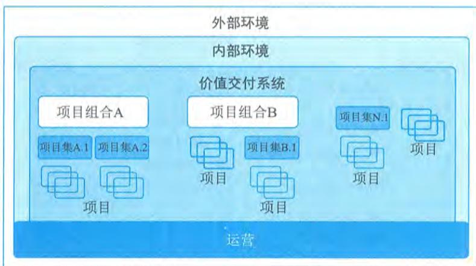  
图9-14 价值交付系统

价值交付系统是组织内部环境的一部分，该环境受政策、程序、方法论、框架、治理结构等制约。内部环境存在于更大的外部环境中，包括经济、竞争环境、法律限制等。

价值交付系统中的组件创建了用于产出成果的可交付物。成果是某一过程或项目的最终结果或后果。成果可带来收益，收益是组织实现的利益。收益继而可创造价值，而价值是具有收益作用、重要性或实用性的事物。

# 3.信息流

当信息和信息反馈在所有价值交付组件之间以一致的方式共享时，价值交付系统最为有效，能够使系统与战略保持一致，这就是信息流的作用。信息流如图9- 15所示。高层领导会与项目组合分享战略信息。项目组合与项目集和项目分享预期成果、收益和价值。项目集和项目的可交付物及其支持和维护信息一起传递给运营部门。

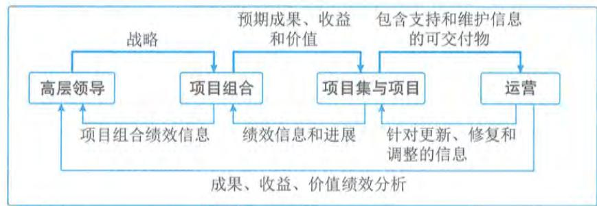  
图9-15 信息流

反之，从运营部门到项目集和项目的信息反馈表明对可交付物的调整、修复和更新。项目集和项目给项目组合提供实现预期成果、收益和价值方面的绩效信息和进展。项目组合会提供与高层领导一起对项目组合进行绩效评估的绩效信息。此外，运营部门还提供有关组织战略推进情况的信息。

# 9.10 本章练习

# 1.选择题

（1）项目有明确的起点和终点，体现了项目的 特性。

A.独特性 
B.临时性 
C.渐进明细 
D.及时性

参考答案：B

（2）项目管理不善，可能会导致的后果不包括

A.项目范围失控 
B.组织声誉受损 
C.管理制约因素 
D.干系人不满意

参考答案：C

（3）从项目、项目集、项目组合管理的目标来看， 注重于开展“正确”的工作，即“做正确的事”。

A.项目组合管理 
B.单个项目管理 
C.大项目管理 
D.项目集管理

参考答案：A

（4）在 组织结构中，项目经理全职指定工作角色。

A.职能型 
B.平衡矩阵型 
C.强矩阵型 
D.弱矩阵型

参考答案：C

（5）PMO直接管理和控制项目。项目经理由PMO指定并向其报告。这种类型的PMO对项目的控制程度很高。

A.指令型 
B.支持型 
C.控制型 
D.组合型

参考答案：A

（6）针对领导力和管理二者的区别，属于领导力的特征的是

A.直接利用职位权力 
B.关注系统和架构C.关注可操作性的问题和问题的解决 
D.激发信任

参考答案：D

（7） 的特点是先基于初始需求制订一套高层级的计划，再逐渐把需求细化到适合特定的规划周期所需的详细程度。

A.预测型项目生命周期 
B.混合型项目生命周期C.适应型项目生命周期 
D.瀑布型项目生命周期

参考答案：C

（8）以下关于项目建议书包含的内容，描述不正确的是

A.项目建设的必要性 
B.项目的市场预测C.技术能力分析 
D.项目建设必需的条件

参考答案：C

（9）在项目可行性研究工作中，技术可行性分析的关注内容不包含

A.进行项目开发的风险 
B.人力资源的有效性C.物资（产品）的可用性 
D.投资收益的可行性

参考答案：D

